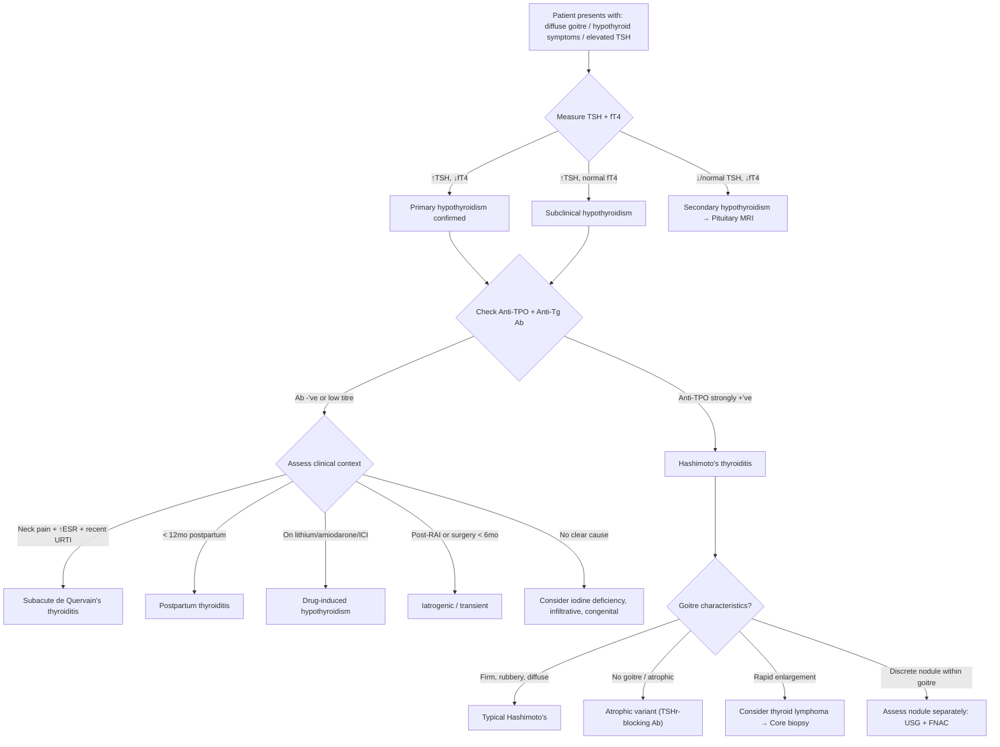

## Differential Diagnosis of Hashimoto's Thyroiditis

When a patient walks in with a diffuse goitre, hypothyroid symptoms, or simply an incidental finding of elevated TSH with positive thyroid antibodies, you need a systematic framework to differentiate Hashimoto's from its mimics. The differential diagnosis operates across **three clinical axes** simultaneously:

1. **What is causing the goitre?** (if present)
2. **What is causing the hypothyroidism?** (if present)
3. **What is causing the positive thyroid antibodies?** (if found)

Let's work through each systematically, then synthesise into a clinical approach.

---

### Axis 1: Differential Diagnosis of a Diffuse Goitre

Hashimoto's classically presents with a ***diffuse goitre***. The differential diagnosis for a diffuse thyroid enlargement is organised by thyroid functional status [2][3][11]:

| Thyroid Status | Condition | Key Distinguishing Features |
|---|---|---|
| **Hypothyroid** | ***Hashimoto's thyroiditis*** | Firm, rubbery, painless; anti-TPO 90–100%; gradual onset |
| | Iodine deficiency (endemic goitre) | Geographic context (mountainous regions); low urinary iodine; no antibodies |
| | Drug-induced (lithium, amiodarone) | Clear temporal relationship with drug initiation |
| | Late-stage subacute thyroiditis | History of preceding painful thyrotoxic phase; ↑ESR |
| **Euthyroid** | ***Simple diffuse goitre*** (physiological) | ***Pregnancy, puberty, iodine deficiency, goitrogen*** [3][11]; no antibodies; soft, non-tender |
| | ***Early MNG*** | Initially may appear diffuse before nodularity becomes apparent [3][11] |
| | ***Infiltrative disease (e.g. lymphoma)*** | Rapid enlargement in setting of long-standing Hashimoto's; firm/"woody" [3][11] |
| | ***Treated Graves' disease*** | History of prior antithyroid drugs/RAI; may now be euthyroid or hypothyroid [3][11] |
| **Hyperthyroid** | ***Graves' disease*** | Diffuse, smooth, ***vascular with audible bruit***; TRAb positive; ophthalmopathy; pretibial myxoedema [4] |
| **Mixed/Fluctuating** | ***Destructive thyroiditis*** (subacute, postpartum, silent) | Biphasic course (thyrotoxic → hypothyroid → recovery); pain in de Quervain's [8] |

<Callout title="Exam Tip: The Goitre DDx Table" type="idea">
This is a commonly tested table. The senior notes organise it neatly: **hypothyroid diffuse goitre = Hashimoto's until proven otherwise**. But don't forget that an euthyroid or even transiently thyrotoxic patient can still have Hashimoto's — it depends on the stage of disease [2][3][11].
</Callout>

---

### Axis 2: Differential Diagnosis of Hypothyroidism

If the patient's presenting problem is hypothyroidism (↑TSH ± ↓fT4), you need to work out the cause. Hashimoto's is the most common **non-iatrogenic** cause in iodine-sufficient regions [2][3]:

#### Primary Hypothyroidism (↑TSH, ↓fT4)

| Category | Condition | How to Differentiate from Hashimoto's |
|---|---|---|
| **Autoimmune** | ***Hashimoto's thyroiditis*** | Anti-TPO 90–100%, anti-Tg 80–90%; firm diffuse goitre [2][6] |
| | ***Atrophic thyroiditis*** | ***Predominantly TSHr-blocking Ab → no goitre*** [2]; same antibody profile but gland is small/absent |
| **Iatrogenic** | ***RAI treatment*** | History of prior radioactive iodine for Graves'/toxic nodule; ***< 6mo since treatment = may be transient*** [3][7] |
| | ***Thyroidectomy*** | Surgical scar; history of surgery |
| | ***External neck irradiation*** | History of radiotherapy (NPC, lymphoma, childhood leukaemia) [3] |
| **Thyroiditis** | ***Subacute (de Quervain's) thyroiditis*** | ***Pain*** (radiates to jaw/ears), ***fever, ↑ESR, ↑WBC***; self-limiting; ***low titres of thyroid autoAb*** [8] |
| | ***Silent/lymphocytic thyroiditis*** | Painless but fluctuating thyroid status; often postpartum; ***self-limiting*** [8] |
| | ***Postpartum thyroiditis*** | ***< 12 months postpartum***; biphasic course; may recur; ~20–30% progress to permanent hypothyroidism [7] |
| **Drug-induced** | ***Lithium*** | Concentrates in thyroid; inhibits T4 release + enhances autoimmunity; check drug history |
| | ***Amiodarone*** | High iodine content (75mg iodine per 200mg tablet); can cause type 1 (iodine-induced) or type 2 (destructive) thyrotoxicosis OR hypothyroidism |
| | ***Immune checkpoint inhibitors*** | Anti-PD-1/anti-CTLA-4 (nivolumab, pembrolizumab, ipilimumab); increasingly common cause; destructive mechanism |
| **Iodine-related** | Iodine deficiency | Geographic context; low urinary iodine; goitre without antibodies |
| | Iodine excess (Wolff–Chaikoff effect) | Recent iodine load (CT contrast, amiodarone, kelp supplements); transient |
| **Infiltrative** | ***Riedel's thyroiditis*** | "Woody" hard fixed thyroid; IgG4-related disease; mimics carcinoma on palpation |
| | Sarcoidosis, amyloidosis | Rare; systemic features of the underlying disease |
| **Congenital** | Thyroid dysgenesis, dyshormonogenesis | Neonatal screening; not relevant to adult differential but important in paediatrics [7] |

#### Secondary Hypothyroidism (↓/normal TSH, ↓fT4)

| Condition | Key Distinguishing Features |
|---|---|
| Pituitary tumour (adenoma, craniopharyngioma) | Other pituitary hormone deficits; visual field defects (bitemporal hemianopia); imaging findings |
| Pituitary surgery/irradiation | History of prior intervention |
| Sheehan's syndrome | Postpartum pituitary necrosis after massive haemorrhage; failure to lactate |
| Hypothalamic disease | Rare; usually with other hypothalamic features (DI, temperature dysregulation) |

<Callout title="Primary vs Secondary — The TSH Tells the Story" type="error">
A common mistake: students see a low fT4 and jump to "hypothyroidism" without checking the TSH direction. In **primary** hypothyroidism (like Hashimoto's), TSH is **elevated** because the pituitary is screaming at a failing thyroid. In **secondary** hypothyroidism, TSH is **low or inappropriately normal** because the pituitary itself is the problem. Also, ***oedema is much less in secondary hypothyroidism*** because ***ACTH deficiency usually occurs before TSH depletion*** [3][7] — so the aldosterone-mediated fluid retention is less.
</Callout>

---

### Axis 3: Conditions That Can Mimic or Coexist with Hashimoto's

These deserve special attention because they are commonly tested and clinically important:

#### 1. Graves' Disease vs Hashimoto's

This is the most important differentiation in autoimmune thyroid disease. Both are **autoimmune thyroid diseases** sharing HLA associations and often coexisting in the same families, but they sit at **opposite ends of the functional spectrum**:

| Feature | Hashimoto's Thyroiditis | Graves' Disease |
|---|---|---|
| Thyroid function | Hypothyroid (may be euthyroid or transiently thyrotoxic) | Hyperthyroid |
| Goitre character | ***Firm, rubbery***, diffuse, painless [2] | Diffuse, smooth, ***vascular with bruit*** [4] |
| Key antibody | ***Anti-TPO (90–100%)*** [2][6] | ***TRAb / Anti-TSHr stimulating (80–90%)*** [4][6] |
| Ophthalmopathy | No (unless coexisting Graves') | ***Yes (~20–25%)*** [12] — proptosis, lid retraction, ophthalmoplegia |
| Pretibial myxoedema | No | ***Yes (< 10%)*** [4] |
| Radioiodine uptake | Normal or low | ***Diffusely increased*** [13] |
| Histology | Lymphocytic infiltration, germinal centres, Hürthle cells, follicular destruction | Lymphocytic infiltration, follicular hyperplasia, scalloping of colloid |

**Why this matters**: Occasional patients have **"overlap" features** — Hashimoto's patients can harbour both stimulating and blocking TSHr antibodies, and the clinical picture can flip between hypo- and hyperthyroidism over time. This is the concept of the ***autoimmune thyroid disease continuum***.

#### 2. Subacute (de Quervain's) Thyroiditis

| Feature | Hashimoto's | De Quervain's |
|---|---|---|
| Pain | ***Painless*** | ***Painful*** (cardinal feature) — radiates to jaw/ears [8] |
| Onset | Insidious (months to years) | Acute/subacute (days to weeks); often follows URTI |
| Goitre | Firm, rubbery | Tender, may be asymmetric |
| ESR | Normal | ***Markedly elevated*** (often > 50 mm/hr) [8] |
| Thyroid antibodies | Anti-TPO 90–100% | ***Low titres*** (if any) [8] |
| Course | Progressive → permanent hypothyroidism | ***Self-limiting*** (thyrotoxic → hypothyroid → resolution) [8] |
| Histology | Lymphocytic infiltration, germinal centres | ***Granulomatous inflammation, multinucleated giant cells*** |

The key teaching point: **pain + ↑ESR + recent viral illness + low-titre antibodies = de Quervain's, NOT Hashimoto's**.

#### 3. Postpartum Thyroiditis

- Actually considered a **variant of Hashimoto's** — occurs in women with pre-existing anti-TPO positivity whose disease is unmasked by the immune rebound after pregnancy
- ***< 12 months postpartum*** [3][7]
- Biphasic course: thyrotoxic (2–6 months postpartum) → hypothyroid (3–12 months) → recovery in ~80%
- ***~20–30% develop permanent hypothyroidism*** — these essentially had latent Hashimoto's all along
- ***High titres of thyroid autoantibodies suggest underlying autoimmune pathology → ↑risk of recurrence + ultimate progression to hypothyroidism*** [8]

#### 4. Riedel's Thyroiditis (Invasive Fibrous Thyroiditis)

- ***Extremely rare***; now considered part of the IgG4-related disease spectrum
- "Woody" hard fixed thyroid — can be **clinically indistinguishable from anaplastic carcinoma** on palpation
- Extends beyond the thyroid capsule into surrounding tissues → may cause dysphagia, stridor, RLN palsy
- Anti-TPO can be positive (in ~67%), creating confusion with Hashimoto's
- **Biopsy is essential** to differentiate from malignancy — shows dense fibrosis with IgG4+ plasma cells

#### 5. Primary Thyroid Lymphoma

- ***Hashimoto's thyroiditis is a risk factor for thyroid lymphoma*** [10]
- Usually **MALT lymphoma or diffuse large B-cell lymphoma (DLBCL)**
- Presents as ***rapid painless enlargement of a previously stable Hashimoto's goitre*** [10]
- ***Requires core biopsy (not just FNAC)*** for diagnosis [10] — FNAC alone often cannot distinguish lymphoma from severe lymphocytic thyroiditis
- Risk is approximately 40–80× higher in Hashimoto's patients compared to general population

#### 6. Subclinical Hypothyroidism (Early/Mild Hashimoto's vs Other Causes)

***Subclinical hypothyroidism: ↑TSH with T3, T4 at lower end of reference range*** [3][11]:

- ***Most common cause is Hashimoto's thyroiditis*** [11]
- ***Risk of progression to overt hypothyroidism: 2–4%/year, especially if TSH > 10 mU/L or anti-TPO positive*** [11]
- ***Other causes***: recovery phase of subacute/postpartum thyroiditis, drugs (lithium, amiodarone), mild iodine deficiency, adrenal insufficiency
- ***Sick euthyroidism*** can mimic: ***systemic illness → ↓peripheral T4 conversion to T3, altered binding protein level/affinity, ↓TSH secretion → TSH may ↑ to hypothyroidism level in convalescence*** [3][11] — always **avoid unnecessary TFT testing in acutely unwell patients**

#### 7. Drug-Induced Hypothyroidism Mimicking Hashimoto's

Several drugs can cause hypothyroidism that looks like Hashimoto's but is **reversible on drug withdrawal**:

| Drug | Mechanism | Clue to Differentiation |
|---|---|---|
| **Lithium** | Inhibits thyroid hormone release; enhances autoimmunity; ↑anti-TPO | History of bipolar disorder; may actually trigger true Hashimoto's |
| **Amiodarone** | Iodine excess → Wolff–Chaikoff effect; may also cause destructive thyroiditis | History of AF/arrhythmia; check drug history |
| **Interferon-alpha** | Immune activation → thyroid autoimmunity | History of HCV/HBV treatment or haematological malignancy |
| **Immune checkpoint inhibitors** | Anti-PD-1/CTLA-4 → unmasked autoimmune thyroiditis | History of cancer immunotherapy; can be irreversible |

---

### Differential Diagnosis of Thyroid Nodule(s) in the Context of Hashimoto's

Hashimoto's patients can develop **coexisting thyroid nodules**, and this raises the question of malignancy. From the lecture slides [1][14]:

| ***Thyroid Nodule Pathology*** [14] | Frequency |
|---|---|
| ***Nodular goitre: colloid / haemorrhagic cystic / complex / hyperplastic / adenomatous nodule*** | ***70%*** |
| ***Benign follicular adenoma: mainly non-toxic*** | ***15%*** |
| ***Well-differentiated thyroid carcinoma*** | ***10%*** |
| ***Miscellaneous: other thyroid malignancies, thyroiditis*** | ***5%*** |

***Around 10–15% of nodules are malignant*** [10]. In a Hashimoto's patient with a nodule, you must consider:
- **Pseudo-nodule**: Heterogeneous lymphocytic infiltration in Hashimoto's can create the ultrasound appearance of nodules that are not true neoplastic lesions
- **Papillary thyroid carcinoma**: Hashimoto's patients may have a slightly increased risk (debated); any suspicious nodule still warrants FNAC
- ***Thyroid lymphoma***: The feared complication — ***Hashimoto's thyroiditis is a risk factor*** [10]

---

### Clinical Decision-Making Flowchart

The following algorithm synthesises the differential diagnosis approach when a patient presents with features suggestive of Hashimoto's thyroiditis:

---

### Summary Table: Key Differentiating Features

| Feature | Hashimoto's | Graves' | De Quervain's | Postpartum | Riedel's | Drug-induced |
|---|---|---|---|---|---|---|
| **Pain** | No | No | ***Yes*** | No | No | No |
| **Goitre** | Firm, rubbery, diffuse | Diffuse, vascular, bruit | Tender, asymmetric | Small, diffuse | "Woody", fixed | Variable |
| **Function** | Hypothyroid | Hyperthyroid | Biphasic | Biphasic | Hypothyroid | Hypothyroid |
| **Anti-TPO** | 90–100% | 50–80% | Low titre | Moderate | ~67% | Variable |
| **TRAb** | 10–20% (blocking) | 80–90% (stimulating) | Negative | Negative | Negative | Negative |
| **ESR** | Normal | Normal | ***↑↑↑*** | Normal | Normal | Normal |
| **Radioiodine uptake** | Normal/low | ***Diffusely high*** | ***Low*** (damaged follicles) | Low (thyrotoxic phase) | Low | Variable |
| **Course** | Progressive | Relapsing-remitting | Self-limiting | Self-limiting (80%) | Progressive fibrosis | Reversible |
| **Key clue** | Anti-TPO +++, firm goitre | TRAb +++, bruit, eye signs | Pain, ↑ESR, viral prodrome | < 12mo postpartum | Fixed, hard, IgG4+ | Drug history |

---

> **Clinical Pearl**: The single most useful first-line investigation to differentiate the cause of hypothyroidism is **anti-TPO antibodies**. If strongly positive (especially > 100 IU/mL) in a patient with ↑TSH, you can confidently diagnose Hashimoto's without the need for imaging, scintigraphy, or biopsy — unless there are palpable nodules or features concerning for lymphoma [2][3].

<Callout title="High Yield Summary — Differential Diagnosis">

1. **Hashimoto's presents as**: Diffuse firm rubbery painless goitre + hypothyroidism + strongly positive anti-TPO/anti-Tg
2. **Main DDx for diffuse goitre**: Graves' (hyperthyroid, bruit, TRAb+), simple goitre (euthyroid, no antibodies), de Quervain's (painful, ↑ESR), early MNG, infiltrative disease, treated Graves'
3. **Main DDx for hypothyroidism**: Iatrogenic (RAI, surgery, radiation — most common overall), atrophic thyroiditis (no goitre), subacute/postpartum thyroiditis (transient), drug-induced (lithium, amiodarone, ICI), iodine deficiency/excess, secondary (pituitary)
4. **Key differentiators**: Pain (de Quervain's), postpartum timing, drug history, TRAb (Graves'), ESR (de Quervain's), rapid enlargement (lymphoma)
5. **Hashimoto's + nodule**: Must rule out coexisting carcinoma or lymphoma — USG + FNAC for suspicious nodules; core biopsy if lymphoma suspected
6. **Sick euthyroidism trap**: Avoid TFTs in acutely unwell patients — TSH may be transiently abnormal

</Callout>

---

<ActiveRecallQuiz
  title="Active Recall - Differential Diagnosis of Hashimoto's Thyroiditis"
  items={[
    {
      question: "A 45-year-old woman presents with a diffuse, painless, firm goitre and fatigue. TSH is elevated, fT4 is low. Anti-TPO is strongly positive. What is the most likely diagnosis, and name three conditions in your differential?",
      markscheme: "Most likely: Hashimoto's thyroiditis. DDx: (1) Atrophic thyroiditis (no goitre, TSHr-blocking Ab), (2) Iodine deficiency (endemic area, no antibodies), (3) Drug-induced hypothyroidism (lithium, amiodarone — check drug history). Others acceptable: Riedel's thyroiditis, late-phase subacute thyroiditis.",
    },
    {
      question: "How do you differentiate Hashimoto's thyroiditis from subacute de Quervain's thyroiditis? Give at least four distinguishing features.",
      markscheme: "(1) Pain: Hashimoto's painless vs de Quervain's painful (radiates to jaw). (2) ESR: normal in Hashimoto's vs markedly elevated in de Quervain's. (3) Antibodies: anti-TPO 90-100% in Hashimoto's vs low titre in de Quervain's. (4) Course: progressive permanent hypothyroidism in Hashimoto's vs self-limiting biphasic in de Quervain's. (5) Histology: lymphocytic infiltration with germinal centres vs granulomatous with giant cells. (6) Preceding viral illness typical in de Quervain's.",
    },
    {
      question: "A patient with long-standing Hashimoto's thyroiditis presents with rapid painless enlargement of the thyroid. What diagnosis must you exclude, and what investigation is required?",
      markscheme: "Must exclude primary thyroid lymphoma (MALT or DLBCL). Hashimoto's is a major risk factor (40-80x increased risk). Requires core biopsy (not just FNAC) because FNAC alone cannot reliably distinguish lymphoma from severe lymphocytic thyroiditis.",
    },
    {
      question: "Explain why sick euthyroidism can be confused with hypothyroidism and why TFTs should be avoided in acutely unwell patients.",
      markscheme: "Systemic illness causes: (1) decreased peripheral T4 to T3 conversion, (2) altered binding protein levels/affinity, (3) decreased TSH secretion centrally. During convalescence, TSH may rebound and temporarily rise to hypothyroid levels, mimicking primary hypothyroidism. Testing during illness leads to false positive results and unnecessary treatment.",
    },
    {
      question: "A 30-year-old woman is 4 months postpartum and presents with palpitations and weight loss. Anti-TPO is moderately positive. Is this Graves' disease or postpartum thyroiditis? How would you differentiate?",
      markscheme: "Most likely postpartum thyroiditis (variant of autoimmune thyroiditis, less than 12 months postpartum). Differentiate by: (1) TRAb: positive in Graves', negative in postpartum thyroiditis. (2) Radioiodine uptake: high in Graves', low in postpartum thyroiditis (destructive mechanism). (3) Thyroid bruit: present in Graves', absent in postpartum. (4) Course: postpartum thyroiditis is biphasic and self-limiting; Graves' is persistent. Do NOT give antithyroid drugs for postpartum thyroiditis.",
    },
  ]}
/>

---

## References

[1] Lecture slides: GC 177. A thyroid nodule benign thyroid nodules; thyroid cancer.pdf (p4 — Goitre Classification)
[2] Senior notes: Ryan Ho Endocrine.pdf (p30 — Hashimoto's Thyroiditis)
[3] Senior notes: Ryan Ho Fundamentals.pdf (p423–426 — Hypothyroidism, Goitre and Thyroid Nodules)
[4] Senior notes: Ryan Ho Endocrine.pdf (p23 — Graves' Disease)
[6] Senior notes: felixlai.md (Thyroid antibodies table)
[7] Senior notes: Adrian Lui Pediatrics.pdf (p274–275 — Hypothyroidism)
[8] Senior notes: Ryan Ho Endocrine.pdf (p31 — Subacute Thyroiditis)
[10] Senior notes: maxim.md (Risk factors — Hashimoto's thyroiditis and thyroid lymphoma)
[11] Senior notes: Ryan Ho Endocrine.pdf (p17 — Subclinical hypothyroidism, Goitre and Thyroid Nodules)
[12] Senior notes: Ryan Ho Opthalmology.pdf (p128 — Dysthyroid Eye Disease)
[13] Senior notes: Ryan Ho Diagnostic Radiology.pdf (p59 — Thyroid Scintigraphy)
[14] Lecture slides: GC 177. A thyroid nodule benign thyroid nodules; thyroid cancer.pdf (p5 — Thyroid nodule pathology)
