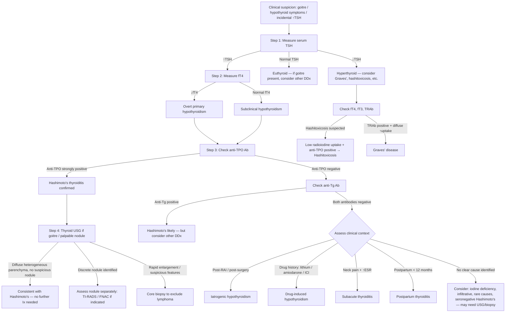

## Diagnostic Criteria for Hashimoto's Thyroiditis

### The Fundamental Principle

Unlike many conditions in medicine, Hashimoto's thyroiditis does **not** have a single universally codified set of diagnostic criteria (like the Jones criteria for rheumatic fever or the ACR/EULAR criteria for SLE). Instead, the diagnosis is made by **combining clinical findings with biochemical evidence**. In practice, diagnosis is straightforward in the vast majority of cases.

The diagnosis of Hashimoto's thyroiditis rests on **two pillars**:

1. **Evidence of autoimmunity directed against the thyroid** → positive anti-thyroid antibodies (especially anti-TPO)
2. **Evidence of thyroid dysfunction or structural change** → elevated TSH ± reduced fT4, or a characteristic goitre

### Practical Diagnostic Criteria (Working Diagnosis)

A confident diagnosis of Hashimoto's thyroiditis can be made when the following are present:

| Criterion | Detail |
|---|---|
| **1. Biochemical evidence of hypothyroidism** (overt or subclinical) | ***↑TSH ± ↓fT4*** (overt) OR ***↑TSH with normal fT4*** (subclinical) [2][7][15] |
| **2. Positive thyroid autoantibodies** | ***Anti-TPO Ab (90–100%)*** is the most diagnostically useful. ***Anti-Tg Ab (80–90%)*** adds sensitivity [2][6] |
| **3. Compatible clinical picture** | Diffuse, firm, rubbery, painless goitre ± hypothyroid symptoms [2] |

<Callout title="When is Biopsy Needed?">
Histological confirmation is **NOT required** for routine diagnosis of Hashimoto's. The combination of positive anti-TPO + appropriate TFT is sufficient. **Biopsy is only needed when**:
- There is a **discrete nodule** within the Hashimoto's goitre that needs evaluation for malignancy
- There is **rapid enlargement** raising suspicion for **thyroid lymphoma** (requires core biopsy, not just FNAC) [10]
- The clinical picture is **atypical** and an alternative diagnosis needs to be excluded
</Callout>

### Important Nuances

- ***Euthyroid patients with positive anti-TPO have autoimmune thyroiditis and are at higher risk of developing hypothyroidism*** [7] — you can diagnose "serological Hashimoto's" even before overt hypothyroidism develops
- Some patients (5–10%) with histologically confirmed Hashimoto's may be **antibody-negative** ("seronegative Hashimoto's") — in these rare cases, diagnosis requires biopsy or characteristic ultrasound findings
- The ***atrophic variant*** has no goitre but has ***predominantly TSHr-blocking Ab*** [2] — this is still Hashimoto's/autoimmune thyroiditis on the same spectrum

---

## Diagnostic Algorithm

The diagnostic workup proceeds in a logical, stepwise fashion. ***The key principle: TSH is the single most sensitive screening test for thyroid dysfunction*** [6][15].

### Step-by-Step Approach

<Callout title="When to Check fT3" type="idea">
***fT3 level is needed since 2–5% of patients have ONLY elevated fT3 level, known as T3 toxicosis*** [6]. This is primarily relevant for thyrotoxicosis workup. In hypothyroidism (Hashimoto's), fT3 measurement is generally **not** needed — TSH + fT4 + anti-TPO are sufficient for diagnosis.
</Callout>

---

## Investigation Modalities — Detailed Breakdown

### 1. Thyroid Function Tests (TFTs)

This is the **first-line investigation** for any patient with suspected thyroid disease. Understanding what you are measuring and why is critical.

#### a. Serum TSH (Thyroid-Stimulating Hormone)

- ***TSH level is the MOST sensitive indicator of thyroid function*** [15] due to the logarithmic relationship between TSH and fT4 — small changes in fT4 produce large changes in TSH
- **Why TSH first?** Because the pituitary amplifies even subtle thyroid dysfunction. A patient can have a "normal" fT4 but an elevated TSH — the pituitary has detected the decline before the fT4 falls out of range
- **Normal range**: approximately 0.4–4.0 mIU/L (varies by assay and laboratory)
- **In Hashimoto's**: ***↑TSH*** [2] — ranging from mildly elevated (subclinical: 4–10 mIU/L) to markedly elevated ( > 50 mIU/L in overt disease)
- ***Ultrasensitive TSH assays*** [3][11] can detect values as low as 0.01 mIU/L — important for distinguishing subclinical hyperthyroidism

***Interpretation of TSH in Hashimoto's*** [7][11]:

| TSH Level | fT4 Level | Interpretation | Action |
|---|---|---|---|
| ***↑TSH*** | ***↓fT4*** | ***Overt primary hypothyroidism*** | Confirm with anti-TPO; start T4 replacement |
| ***↑TSH*** | ***Normal fT4*** | ***Subclinical hypothyroidism*** | Check anti-TPO; ***risk of progression 2–4%/yr esp if TSH > 10 or anti-TPO+*** [11] |
| Normal TSH | Normal fT4 | Euthyroid | If antibody-positive only: monitor annually |
| ***↓TSH*** | ***↑fT4*** | Thyrotoxicosis (consider hashitoxicosis) | Check TRAb + radioiodine uptake to differentiate |

#### b. Free T4 (fT4)

- Measured when TSH is abnormal to quantify the degree of thyroid dysfunction
- ***fT4 is measured instead of total T4*** because ***T3 and T4 are highly protein-bound and many factors influence protein binding*** [6]:
  - ***Total T4 is elevated when TBG is increased***: ***pregnancy, oral contraceptives, hormonal therapy*** [6]
  - ***Total T4 is reduced when TBG is decreased***: ***androgens, hypoalbuminemia*** [6]
  - ***fT3 and fT4 are normal in euthyroid patients with the above circumstances and hence are preferable over total thyroid hormones*** [6]
- **In Hashimoto's**: ↓fT4 in overt disease; normal in subclinical disease

#### c. Free T3 (fT3)

- Not routinely needed in the hypothyroidism workup
- Relevant if hyperthyroidism is suspected (to detect T3 toxicosis)
- In severe hypothyroidism, fT3 may be low, but this adds little to the clinical picture

---

### 2. Thyroid Autoantibodies

The **second pillar** of diagnosis. Understanding what each antibody tells you and its sensitivity/specificity is essential.

***Thyroid antibodies tested*** [6]:
- ***Thyrotropin receptor antibodies (TRAb / Anti-TSH antibodies)***
- ***Anti-thyroid peroxidase (TPO) antibodies***
- ***Anti-thyroglobulin (TG) antibodies***

| Antibody | ***Normal Population*** | ***Graves' Disease*** | ***Hashimoto's Thyroiditis*** | ***MNG*** |
|---|---|---|---|---|
| ***Anti-TSH (TRAb)*** | ***0%*** | ***80–90%*** | ***10–20%*** | ***10–20%*** |
| ***Anti-TPO*** | ***10–15%*** | ***50–80%*** | ***90–100%*** | ***10–20%*** |
| ***Anti-TG*** | ***10–20%*** | ***50–70%*** | ***80–90%*** | ***30–40%*** |

[6]

#### Anti-TPO Antibodies — The Workhorse

- **What is TPO?** Thyroid peroxidase — the enzyme on the apical membrane of thyrocytes that catalyses iodination and coupling of thyroglobulin. It is the essential enzyme for making thyroid hormone.
- **Why is anti-TPO the best test for Hashimoto's?** Because it is:
  - **Highly sensitive**: present in ***90–100%*** of Hashimoto's patients [2][6]
  - ***More specific to hypothyroidism and may inhibit TPO activity*** [2] — the antibody directly impairs hormone synthesis
  - Present early in the disease, even before TSH rises
- ***Anti-TPO positive in euthyroid patients indicates autoimmune thyroiditis and increased risk of future hypothyroidism*** [7]
- **Caveat**: Anti-TPO can be found in ***10–15% of the normal population*** [6], especially older women — so a low-titre positive result in a euthyroid patient without goitre may not warrant treatment (just monitoring)

#### Anti-Thyroglobulin (Anti-Tg) Antibodies

- **What is thyroglobulin?** The scaffolding protein in the colloid on which T3/T4 are assembled
- ***Nearly all patients with Hashimoto's have ↑anti-Tg but may also occur in other thyroid diseases and even in apparently clinically euthyroid patients*** [2]
- Less specific than anti-TPO; useful as a **complementary test** when anti-TPO is negative but clinical suspicion is high
- **Important interference**: Anti-Tg Ab can **interfere with thyroglobulin assays** — this matters for post-thyroidectomy monitoring in thyroid cancer (anti-Tg positivity makes serum thyroglobulin unreliable as a tumour marker) [15]

#### Anti-TSH Receptor Antibodies (TRAb)

- Not routinely tested in Hashimoto's workup
- ***Anti-TSHr Ab (blocking type): mainly found in atrophic variant and contributes to hypothyroidism*** [2]
- ***TRAb (stimulating type) has Sens 97% Spec 99% with newer assays*** [4][13] — primarily for diagnosing Graves' disease
- In Hashimoto's, testing is only indicated if:
  - Differentiating hashitoxicosis from Graves' disease
  - Evaluating the atrophic variant
  - Assessing pregnant women with autoimmune thyroid disease (risk of neonatal thyroid dysfunction)

---

### 3. Thyroid Ultrasound (USG)

***Performed in all patients with a suspected thyroid nodule or nodular goitre*** [6][15]. In the context of Hashimoto's, USG serves two purposes:

1. **Characterise the thyroid parenchyma** (supportive of diagnosis)
2. **Identify any nodules** that require separate evaluation for malignancy

***Routine for all patients with goitre/palpable nodules: TFT, thyroid USG*** [10][16]

#### Technical Details
- ***7.5 or 10 MHz probes, B mode*** [3][11]
- ***Readily available, non-invasive, ↑Sens but ↓Spec*** [3][11]
- ***NOT a screening test for healthy subjects*** [3][11]

#### Characteristic USG Findings in Hashimoto's

| Feature | Description | Why It Occurs |
|---|---|---|
| **Diffuse hypoechogenicity** | The entire gland appears darker than normal | Lymphocytic infiltration replaces normal echogenic colloid-filled follicles; reduced colloid content |
| **Heterogeneous echotexture** | "Moth-eaten" or "pseudo-nodular" pattern | Patchy lymphocytic destruction creates alternating areas of inflammation and residual tissue |
| **Increased vascularity** | ↑colour Doppler flow | TSH-driven hyperplasia + inflammatory hyperaemia |
| **Diffuse enlargement** (or atrophy in late stage) | Depends on disease stage | Early: infiltration + TSH-driven hyperplasia; Late: fibrosis and atrophy |
| **Pseudo-nodules** | Focal hypoechoic areas mimicking true nodules | Focal lymphocytic aggregates; important NOT to mistake these for neoplastic nodules |
| **Fibrous septae** | Linear echogenic bands | Progressive fibrosis in advanced disease |

<Callout title="USG in Hashimoto's — Not for Diagnosis, but for Nodule Assessment" type="idea">
You do NOT need an ultrasound to diagnose Hashimoto's if TFT + anti-TPO are diagnostic. USG is indicated when there is a **palpable goitre or nodule** to: (1) assess the parenchyma, (2) identify discrete nodules that may need FNAC, and (3) evaluate cervical lymph nodes [3][11][16].
</Callout>

#### Assessment of Coexisting Nodules — Suspicion for Malignancy

If a discrete nodule is identified within a Hashimoto's goitre, it must be assessed independently for malignancy risk. The ***ATA 2015 Sonographic Pattern*** and ***TI-RADS classification*** guide the need for FNAC [6][3]:

| ***Sonographic Pattern*** | ***USG Findings*** | ***Risk of Malignancy*** | ***Size Cutoff for FNAC*** |
|---|---|---|---|
| ***High suspicion*** | ***Solid hypoechoic ± microcalcifications, taller-than-wide, irregular margins, extrathyroidal extension*** | ***> 70–90%*** | *** > 1 cm*** |
| ***Intermediate suspicion*** | ***Hypoechoic solid WITHOUT high-suspicion features*** | ***10–20%*** | *** > 1 cm*** |
| ***Low suspicion*** | ***Isoechoic/hyperechoic solid OR partially cystic with eccentric solid area*** | ***5–10%*** | *** > 1.5 cm*** |
| ***Very low suspicion*** | ***Spongiform or partially cystic without suspicious features*** | *** < 3%*** | *** > 2 cm*** |
| ***Benign*** | ***Purely cystic*** | *** < 1%*** | ***No FNAC*** |

[6]

***Sonographic features suspicious of malignancy*** mnemonic: **"SHIT CME"** — ***Solid, Hypoechoic, Irregular margins, Taller than wide, Calcifications (micro), Margin invasion, Extrathyroidal extension*** [16]

#### Assessment of Cervical Lymph Nodes

***Sonographic features of malignant lymph nodes*** [6][15]:
- ***Large > 2 cm***
- ***Roundish (taller than wide)***
- ***Heterogeneous hypoechoic***
- ***Loss of central fatty hilum***
- ***Presence of microcalcification***
- ***Intranodal cystic or coagulative necrosis***

---

### 4. Fine Needle Aspiration Cytology (FNAC)

***FNAC is the single most important investigation for thyroid nodules if TSH is not depressed*** [3]. However, for diagnosing Hashimoto's itself, FNAC is **not routinely required** — it is indicated for **nodule assessment within a Hashimoto's goitre**.

#### Indications for FNAC in the Setting of Hashimoto's
- Discrete nodule meeting ATA size/suspicion criteria (see table above)
- Nodule with suspicious USG features regardless of Hashimoto's background
- Rapid goitre enlargement (to exclude lymphoma — but core biopsy preferred for lymphoma)

#### FNAC Findings in Hashimoto's (If Sampled)
- **Abundant lymphocytes** with germinal centre fragments
- **Hürthle cells** (oxyphilic/oncocytic cells): large cells with abundant granular eosinophilic cytoplasm due to abundant mitochondria
- **Sparse colloid** (most of it has been destroyed)
- **Follicular cells** showing reactive/degenerative changes

#### ***Bethesda Classification*** — Standard Reporting for Thyroid FNAC [3]

| ***Bethesda Category*** | ***Risk of Malignancy*** | ***Usual Management*** |
|---|---|---|
| ***I. Non-diagnostic*** | ***1–4%*** | ***Repeat FNAC or operate if radiologically suspicious*** |
| ***II. Benign*** | ***0–3%*** | ***Clinical follow-up*** |
| ***III. AUS/FLUS*** | ***5–15%*** | ***Repeat FNAC, molecular testing, hemiT if AUS x2*** |
| ***IV. Follicular neoplasm*** | ***15–30%*** | ***Hemithyroidectomy, molecular testing*** |
| ***V. Suspicious for malignancy*** | ***60–75%*** | ***Hemithyroidectomy + frozen section + total thyroidectomy*** |
| ***VI. Malignant*** | ***97–99%*** | ***Total thyroidectomy*** |

[3]

<Callout title="FNAC Pitfall in Hashimoto's" type="error">
Hashimoto's thyroiditis can produce **abundant lymphocytes on FNAC**, which can be confused with **thyroid lymphoma**. If lymphoma is suspected (rapid enlargement, B-symptoms), a **core biopsy** is needed — ***FNAC alone cannot reliably distinguish lymphoma from severe lymphocytic thyroiditis*** [10]. Additionally, Hürthle cells in Hashimoto's can be misinterpreted as a "Hürthle cell neoplasm" (Bethesda IV) — clinical correlation with antibody status and USG findings is essential.
</Callout>

---

### 5. Thyroid Scintigraphy (Radionuclide Scan)

***NOT recommended for routine diagnostic use*** [6][16] in Hashimoto's. Its primary role is in the workup of thyrotoxicosis and toxic nodules.

***From the lecture slides*** [17]: ***Investigations for thyroid nodules include blood tests (TSH + free T4), ultrasound, FNAC (+ molecular testing), and selectively: ESR, thyroid antibodies, calcitonin, genetic testing, radioisotope scan, CT/MRI, PET scan, endoscopy, and thyroidectomy (diagnostic + therapeutic).***

#### When Is Scintigraphy Indicated in the Context of Hashimoto's?

| Scenario | Indication | Expected Finding |
|---|---|---|
| ***Hashitoxicosis vs Graves'*** | Differentiating cause of thyrotoxicosis | Hashitoxicosis: ***diffuse ↓uptake*** (damaged follicles cannot trap iodine); Graves': ***diffuse ↑uptake*** [3][4][13] |
| ***Nodule + ↓TSH*** | Determine if nodule is "hot" or "cold" | ***Hot nodules rarely malignant (< 1%)***; ***cold nodules 10–20% malignant → warrant FNAC*** [3][18] |
| ***NOT indicated if TSH is normal/elevated*** | Because the nodule will never be hyperfunctioning | ***Would lead to unnecessary biopsies*** [6][18] |

#### Radiopharmaceuticals [13]
- ***99mTc pertechnetate*** (iodine trapping only) — ***has a similar ionic size as iodide ion, allowing it to be taken up by NIS*** [13]
- ***123I or 131I*** (trapping + organification) — more physiological but less widely available

#### Interpretation Summary [3][4]

| ***Pattern*** | ***Diagnosis*** |
|---|---|
| ***Diffuse ↓uptake*** | ***Destructive thyroiditis (including hashitoxicosis) vs factitious thyrotoxicosis*** |
| ***Diffuse ↑uptake*** | ***Graves' disease vs secondary hyperthyroidism*** |
| ***Heterogeneous ↑uptake*** | ***Toxic MNG*** |
| ***Focal ↑uptake with ↓uptake elsewhere*** | ***Toxic adenoma*** |

---

### 6. Additional Blood Tests

These are **not primary diagnostic tests for Hashimoto's** but are important for assessing complications and associated conditions:

| Test | Rationale in Hashimoto's | Expected Finding |
|---|---|---|
| **CBC** | Screen for associated anaemia (pernicious anaemia from coexisting autoimmune gastritis; iron deficiency from menorrhagia) | May show macrocytic anaemia (B12 def) or normocytic anaemia |
| **Lipid profile** | Hypothyroidism causes dyslipidaemia | ***↑Total cholesterol, ↑LDL, ↑triglycerides*** [3][7] — due to ↓LDL receptor expression |
| **Serum Na+** | Severe hypothyroidism → SIADH → hyponatraemia | ↓Na+ in severe disease |
| **CK (creatine kinase)** | Hypothyroid myopathy | ↑CK (↓clearance + muscle damage) |
| **Prolactin** | If galactorrhoea or menstrual irregularity | ↑Prolactin (↑TRH stimulates lactotrophs) |
| ***ESR*** | To differentiate from subacute (de Quervain's) thyroiditis | ***Normal in Hashimoto's; markedly elevated in de Quervain's*** [3][8] |
| **Serum B12** | If macrocytosis or neurological symptoms | ↓B12 suggests coexisting pernicious anaemia |
| **HbA1c / glucose** | Screen for associated T1DM | May be elevated |

---

### 7. CT/MRI

***Not routine*** [3][11][16]. Only indicated in specific circumstances:

| Indication | Reason |
|---|---|
| ***Retrosternal goitre*** | ***Cannot be visualised by USG; needed for surgical planning*** [16] |
| ***Locally advanced disease*** | ***Better delineation of important structures within cervical fascia*** [16] |
| Suspected thyroid lymphoma with extrathyroidal extension | Staging purposes |

<Callout title="CT Contrast Warning" type="error">
***The use of iodinated contrast may affect post-op radioactive iodine body scan*** [3][11]. If a patient may need RAI therapy (e.g., for coexisting thyroid cancer), iodinated contrast should be avoided or planned appropriately (wait 6–8 weeks for iodine washout).
</Callout>

---

### 8. Other Selective Investigations

| Investigation | When Indicated | Purpose |
|---|---|---|
| ***Calcitonin*** | ***Hx or clinical suspicion of familial medullary carcinoma or MEN2*** [3][11] | Not relevant to Hashimoto's per se, but if a nodule within a Hashimoto's goitre is being worked up |
| ***Genetic testing (RET)*** | If medullary thyroid cancer confirmed | Not directly relevant to Hashimoto's |
| ***Direct laryngoscopy*** | ***For RLN palsy*** [3][11] — if hoarseness is present in a Hashimoto's patient | Exclude malignant invasion vs myxoedema of cords |
| ***Flow-volume loop*** | ***For airway obstruction*** [3][11] — if large goitre with dyspnoea | ***UAO results in a blunted flow-volume loop*** [3] |
| **Core biopsy** | Suspected thyroid lymphoma | Provides tissue architecture needed for lymphoma diagnosis |

---

### Summary: Routine vs Selective Investigations

***From the lecture slides and senior notes*** [16][17]:

| | ***Routine*** | ***Selective*** |
|---|---|---|
| ***History + Physical exam*** | ***✓*** | |
| ***Thyroid function test*** | ***✓*** | |
| ***Anti-TPO antibodies*** | ***✓*** (for hypothyroidism workup) | |
| ***USG thyroid ± FNAC*** | ***✓*** (if goitre/nodule present) | |
| ***Thyroid scintigraphy*** | ***✗*** | ***Only if thyrotoxicosis + nodules (↓TSH)*** |
| ***CT scan*** | ***✗*** | ***Only for retrosternal goitre or locally advanced disease*** |
| ***PET scan*** | ***✗*** | ***No diagnostic role*** [16] |
| ***ESR*** | | ***If thyroiditis DDx (de Quervain's)*** |
| ***Calcitonin*** | | ***If MTC suspected*** |
| ***Core biopsy*** | | ***If lymphoma suspected*** |

---

> **The Bottom Line**: Diagnosing Hashimoto's thyroiditis is usually simple — **TSH + fT4 + anti-TPO** is all you need in the majority of cases. The complexity arises when you need to (1) differentiate from other causes of hypothyroidism using clinical context, (2) assess coexisting nodules for malignancy, or (3) evaluate for the rare complication of thyroid lymphoma.

<Callout title="High Yield Summary — Diagnosis">

1. **No formal diagnostic criteria exist** — diagnosis is clinical + biochemical: ↑TSH + positive anti-TPO ± compatible goitre
2. **TSH is the most sensitive first-line test** due to logarithmic TSH–fT4 relationship
3. **Always measure fT4 (not total T4)** to avoid confounding by TBG changes
4. **Anti-TPO is the single most useful antibody** (90–100% sensitive, specific for hypothyroidism, inhibits TPO activity)
5. **USG is for nodule assessment, not for diagnosing Hashimoto's** — look for diffuse hypoechogenicity, heterogeneous echotexture, pseudo-nodules
6. **FNAC is only for discrete nodules** — follow ATA criteria/TI-RADS; Bethesda classification for reporting
7. **Scintigraphy is NOT routine** — only for thyrotoxicosis workup or nodule + ↓TSH
8. **Subclinical hypothyroidism**: ↑TSH + normal fT4 — progression to overt disease 2–4%/yr if anti-TPO+ or TSH > 10
9. **Core biopsy (not FNAC)** if thyroid lymphoma is suspected
10. **Screen for associated conditions**: lipid profile, CBC, B12, glucose

</Callout>

---

<ActiveRecallQuiz
  title="Active Recall - Diagnosis of Hashimoto's Thyroiditis"
  items={[
    {
      question: "What are the essential investigations to diagnose Hashimoto's thyroiditis, and why is fT4 preferred over total T4?",
      markscheme: "Essential: (1) TSH - most sensitive first-line test, (2) fT4 - quantifies degree of hypothyroidism, (3) anti-TPO Ab - confirms autoimmune aetiology (90-100% sensitive). fT4 is preferred because T3/T4 are highly protein-bound; total T4 is falsely elevated by increased TBG (pregnancy, OCP, hormonal therapy) and falsely low in decreased TBG (androgens, hypoalbuminaemia). fT4 is unaffected by binding protein changes.",
    },
    {
      question: "A patient has subclinical hypothyroidism with TSH of 12 mIU/L and normal fT4. Anti-TPO is strongly positive. What is the annual risk of progression to overt hypothyroidism, and what factors increase this risk?",
      markscheme: "Annual progression rate: 2-4% per year. Risk factors for progression: (1) TSH greater than 10 mIU/L, (2) positive anti-TPO antibodies, (3) higher antibody titres, (4) older age, (5) female sex. Both criteria (TSH greater than 10 AND anti-TPO positive) are met here, making progression highly likely.",
    },
    {
      question: "When is thyroid scintigraphy indicated vs contraindicated in the workup of a thyroid nodule? Explain the rationale from first principles.",
      markscheme: "Indicated: nodule with depressed TSH - to determine if the nodule is hyperfunctioning (hot) or non-functioning (cold). Hot nodules are almost never malignant (less than 1%) and do not need FNAC. Cold nodules have 10-20% malignancy risk and warrant FNAC. NOT indicated if TSH is normal or elevated - because the nodule cannot be hyperfunctioning in that setting, and most cold nodules are benign anyway, leading to unnecessary biopsies.",
    },
    {
      question: "Describe the characteristic thyroid ultrasound findings in Hashimoto's thyroiditis and explain the pathological basis for each.",
      markscheme: "Findings: (1) Diffuse hypoechogenicity - lymphocytic infiltration replaces echogenic colloid-filled follicles. (2) Heterogeneous echotexture (moth-eaten/pseudo-nodular) - patchy lymphocytic destruction creates alternating inflammation and residual tissue. (3) Increased vascularity on Doppler - TSH-driven hyperplasia and inflammatory hyperaemia. (4) Diffuse enlargement (early) or atrophy (late) - infiltration plus TSH-driven hyperplasia early, fibrosis late. (5) Pseudo-nodules - focal lymphocytic aggregates mimicking true nodules.",
    },
    {
      question: "A Hashimoto's patient has a rapidly enlarging painless goitre. What must you exclude, and why is FNAC alone insufficient?",
      markscheme: "Must exclude primary thyroid lymphoma (MALT lymphoma or DLBCL). Hashimoto's is a major risk factor (40-80x increased risk). FNAC alone is insufficient because it shows abundant lymphocytes that cannot be reliably distinguished from severe lymphocytic thyroiditis. Core biopsy is required to provide tissue architecture for immunohistochemistry and flow cytometry needed for lymphoma diagnosis.",
    },
  ]}
/>

---

## References

[2] Senior notes: Ryan Ho Endocrine.pdf (p30 — Hashimoto's Thyroiditis)
[3] Senior notes: Ryan Ho Fundamentals.pdf (p423–429 — Hypothyroidism, Goitre, Thyroid Nodules, FNAC, Scintigraphy)
[4] Senior notes: Ryan Ho Endocrine.pdf (p23 — Graves' Disease; p13 — Aetiological Ix for thyrotoxicosis)
[6] Senior notes: felixlai.md (Thyroid antibodies table; USG findings; Sonographic criteria for FNA; Scintigraphy)
[7] Senior notes: Adrian Lui Pediatrics.pdf (p274–275 — Hypothyroidism, Ix, anti-TPO significance)
[8] Senior notes: Ryan Ho Endocrine.pdf (p31 — Subacute Thyroiditis)
[10] Senior notes: maxim.md (Investigations table; thyroid lymphoma; FNAC)
[11] Senior notes: Ryan Ho Endocrine.pdf (p17–19 — Subclinical hypothyroidism, Goitre Ix, USG, FNAC)
[13] Senior notes: Ryan Ho Diagnostic Radiology.pdf (p59 — Thyroid Scintigraphy)
[15] Senior notes: felixlai.md (Biochemical tests for thyroid cancer workup; TSH sensitivity)
[16] Senior notes: maxim.md (Routine vs Selective investigations table; USG features)
[17] Lecture slides: GC 177. A thyroid nodule benign thyroid nodules; thyroid cancer.pdf (p7 — Thyroid nodule investigations)
[18] Senior notes: Ryan Ho Fundamentals.pdf (p429 — Radioisotope scintigraphy indications)
