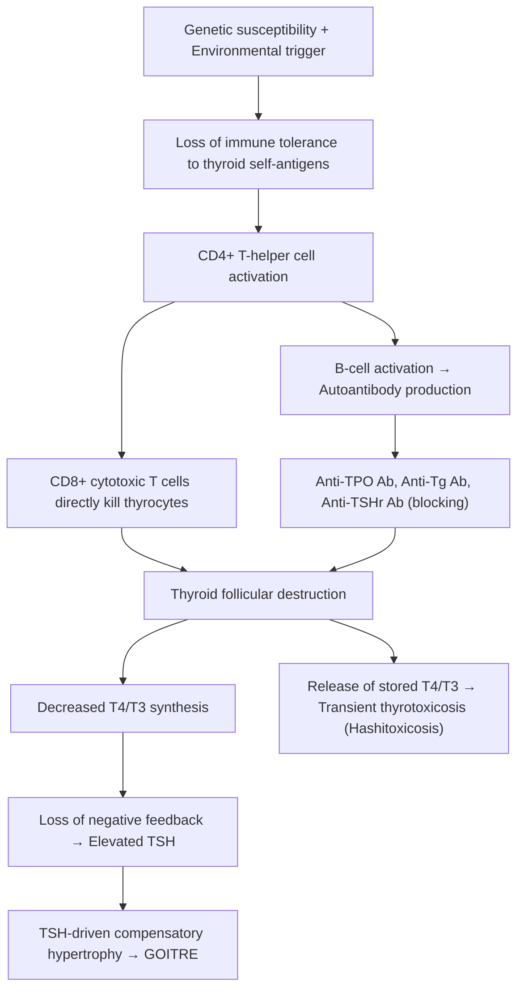
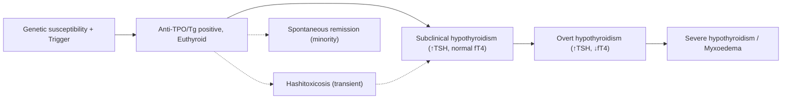

## Definition

Hashimoto's thyroiditis (HT) — also known as ***chronic lymphocytic (autoimmune) thyroiditis*** [1][2] — is an organ-specific autoimmune disease in which T-cell–mediated immune destruction of thyroid follicular cells leads to progressive thyroid failure. The name breaks down neatly:

- **Hashimoto** — Hakaru Hashimoto, Japanese surgeon who first described lymphocytic infiltration of the thyroid in 1912.
- **Thyroiditis** — "thyroid" + Greek *-itis* (inflammation).

It sits on a spectrum of autoimmune thyroid disease (AITD) that includes Graves' disease at one pole (stimulatory autoimmunity → hyperthyroidism) and Hashimoto's/atrophic thyroiditis at the other (destructive autoimmunity → hypothyroidism). The key conceptual point is that **the same gland is the target in both conditions**, but the type of antibody and immune response differ, producing opposite clinical endpoints.

> Within the lecture slides, Hashimoto's is classified under ***thyroiditis → lymphocytic/Hashimoto/autoimmune (chronic)*** in the goitre classification scheme [1].

<Callout title="Don't confuse these two">
Hashimoto's thyroiditis ≠ Atrophic thyroiditis. Both are autoimmune hypothyroidism, but Hashimoto's classically produces a **goitre** (due to lymphocytic infiltration and TSH-driven hyperplasia), while atrophic thyroiditis causes gland shrinkage (predominantly TSH-receptor–blocking antibodies prevent growth). They are two ends of the same autoimmune spectrum [2][3].
</Callout>

---

## Epidemiology

***Hashimoto's thyroiditis is a common cause of hypothyroidism — but NOT the commonest overall (iatrogenic hypothyroidism is more common worldwide)*** [2]. However, among **non-iatrogenic** causes, it is the most common cause in iodine-sufficient populations.

| Parameter | Detail |
|---|---|
| ***Prevalence*** | ***3.5/1,000 (F) vs 0.8/1,000 (M)*** [2]; higher in Western/iodine-replete populations |
| ***Sex ratio*** | ***F:M ≈ 7:1*** [2] — strong female predominance, like most autoimmune diseases (estrogen modulates immune tolerance) |
| ***Age*** | ***Increases with age, especially in older women*** [2]; peak incidence 30–50 years, but can occur at any age including children |
| Spectrum | ***Varies from anti-TPO positivity alone (5%), to subclinical hypothyroidism (5%), to overt hypothyroidism (0.1–2%)*** [2] — most patients with positive antibodies never develop overt disease |
| Hong Kong context | ***In HK, there is no mandatory iodination of salt → borderline iodine intake → low incidence of autoimmune thyroiditis (1% vs 10% in West) but increasingly common nowadays*** [2][3] — likely due to dietary westernisation and increased iodine intake from processed food, seaweed, and supplements |

<Callout title="Why is Hashimoto's more common in iodine-replete areas?">
Iodine excess increases thyroid antigenicity. When thyroglobulin becomes heavily iodinated, it becomes more immunogenic — the immune system "sees" it as foreign. This is why autoimmune thyroiditis incidence rises after iodine supplementation programmes are introduced in previously deficient populations. This is an important concept for HKUMed exams [2][3].
</Callout>

---

## Risk Factors

***Risk factors for Hashimoto's thyroiditis*** [2]:

| Risk Factor | Mechanism / Explanation |
|---|---|
| ***Older female sex*** | Estrogen modulates B-cell survival and autoantibody production; X-chromosome inactivation skewing may expose self-antigens |
| ***Family history*** | ***30–60% monozygotic twin concordance*** [2] — strong genetic component |
| ***HLA-DR3*** | ***4–5× increased risk*** [2]; HLA-DR3 and HLA-DR5 are associated with antigen presentation of thyroid self-peptides to T cells. Also HLA-DR4 in some populations |
| ***Increased iodine intake*** | Heavily iodinated thyroglobulin is more immunogenic; iodine may also be directly toxic to thyrocytes generating neoantigens |
| ***Smoking*** | Paradoxically, smoking is a risk factor for Hashimoto's [2] (note: in Graves', smoking is more specifically associated with ophthalmopathy rather than the disease itself [4]) |
| Other autoimmune diseases | Type 1 DM, Addison's disease, pernicious anaemia, vitiligo, coeliac disease, SLE, RA — autoimmune diseases cluster due to shared HLA susceptibility and generalised immune dysregulation [3][5] |
| Female sex hormones | Pregnancy, postpartum state — immune rebound after relative immunosuppression of pregnancy can trigger or unmask autoimmune thyroiditis |
| Drugs | Lithium (concentrates in thyroid, inhibits thyroid hormone release and may enhance autoimmunity), Amiodarone (high iodine content), Interferon-alpha, Immune checkpoint inhibitors (anti-PD-1, anti-CTLA-4) |
| Radiation exposure | External neck irradiation (e.g., for childhood leukaemia/NPC) can trigger thyroid autoimmunity |

---

## Anatomy and Thyroid Function (Brief Review)

Understanding Hashimoto's requires knowing what the immune system is destroying:

### Thyroid Gland Anatomy
- **Location**: Anterior neck, wrapping around the trachea at the level of C5–T1
- **Structure**: Two lobes connected by an isthmus; occasionally a pyramidal lobe (embryological remnant of the thyroglossal duct)
- **Blood supply**: Superior thyroid artery (from external carotid) and inferior thyroid artery (from thyrocervical trunk) — the thyroid is one of the most vascular organs per gram of tissue
- **Innervation**: Sympathetic fibres (vasomotor); the recurrent laryngeal nerve (RLN) runs in the tracheo-oesophageal groove posterior to the thyroid — critical surgical landmark
- **Lymphatic drainage**: Pre-tracheal, pre-laryngeal (Delphian), and paratracheal nodes (level VI) → deep cervical chain

### Functional Unit — The Thyroid Follicle
- **Follicular cells** (thyrocytes): Produce T4 (thyroxine) and T3 (triiodothyronine)
  - Thyroglobulin (Tg) is synthesised and secreted into the colloid
  - **Thyroid peroxidase (TPO)** catalyses iodination of tyrosine residues on Tg (organification) and coupling of iodotyrosines to form T3/T4
  - T4 is the major secretory product (~90%); T3 is predominantly formed by peripheral deiodination of T4
- **Parafollicular C cells**: Produce calcitonin (relevant to medullary thyroid carcinoma, not Hashimoto's)
- **Colloid**: Stored thyroglobulin (the "reservoir" of thyroid hormone)

### HPT Axis
```
Hypothalamus → TRH → Anterior pituitary → TSH → Thyroid → T4/T3
                                    ↑___________________________|
                                    (negative feedback)
```
When thyroid hormone levels fall (as in Hashimoto's), **negative feedback is lost** → TSH rises → drives residual thyroid tissue to hypertrophy → **goitre formation**.

<Callout title="Key Targets in Hashimoto's">
The two main enzymatic/structural targets of autoimmune attack are:
1. **Thyroid peroxidase (TPO)** — the enzyme that makes thyroid hormone
2. **Thyroglobulin (Tg)** — the scaffold protein on which thyroid hormone is assembled

This is why anti-TPO and anti-Tg antibodies are the hallmark serological markers [2][6].
</Callout>

---

## Etiology and Pathophysiology

### Etiology — Why Does Hashimoto's Happen?

Hashimoto's thyroiditis is a **multifactorial autoimmune disease** resulting from a breakdown in self-tolerance to thyroid antigens in a genetically susceptible individual, triggered by environmental factors.

#### 1. Genetic Susceptibility
- **HLA associations**: HLA-DR3, DR4, DR5 — these MHC class II molecules present thyroid self-peptides to CD4+ T-helper cells, initiating the autoimmune cascade
- **Non-HLA genes**: CTLA-4 (immune checkpoint), PTPN22 (T-cell signalling), IL-2Rα, thyroglobulin gene polymorphisms
- ***30–60% monozygotic twin concordance*** [2] confirms a strong heritable component but incomplete penetrance (environment matters)

#### 2. Environmental Triggers
- **Iodine excess**: Most well-established modifiable risk factor
  - Heavily iodinated thyroglobulin is more immunogenic
  - Iodine can be directly cytotoxic to thyrocytes via reactive oxygen species generated during organification
  - Iodine may activate innate immune cells in the thyroid
- **Infections**: Molecular mimicry (e.g., Yersinia enterocolitica has TSH-receptor–like epitopes, hepatitis C virus)
- **Drugs**: Lithium, amiodarone, interferon-alpha, immune checkpoint inhibitors (nivolumab, pembrolizumab)
- **Smoking**: Mechanism unclear but may involve alteration of thyroid antigen expression or immune modulation
- **Stress/Pregnancy**: Immune reconstitution after pregnancy (postpartum) or psychological stress may trigger disease

### Pathophysiology — The Autoimmune Cascade

***The pathology is fundamentally destructive lymphoid infiltration*** [2]:



#### Step-by-Step Pathophysiology:

1. **Initiation**: ***Generally believed to arise from T-cell mediated damage to thyroid tissues → immune activation → lymphocytic infiltration and cytokine secretion*** [2]
   - Dendritic cells within the thyroid present thyroid antigens (TPO, Tg) via MHC class II to CD4+ T cells
   - This breaks peripheral tolerance

2. **Effector Phase**:
   - **Cellular immunity (primary mechanism)**: CD8+ cytotoxic T lymphocytes directly kill thyrocytes via perforin/granzyme pathway and Fas-FasL interaction
   - **Humoral immunity**: B cells produce autoantibodies
   - **Cytokines**: TNF-α, IFN-γ, IL-1 from infiltrating lymphocytes create a hostile microenvironment that further damages thyrocytes and promotes apoptosis

3. ***Role of anti-thyroid antibodies*** [2]:
   - ***Anti-thyroglobulin (anti-Tg) Ab: nearly all patients with Hashimoto's have ↑anti-Tg but may also occur in other thyroid diseases and even in apparently clinically euthyroid patients*** [2]
   - ***Anti-TPO (microsomal) Ab: more specific to hypothyroidism and may inhibit TPO activity*** [2] — this directly impairs thyroid hormone synthesis
   - ***Anti-TSHr Ab (blocking type): mainly found in atrophic variant and contributes to hypothyroidism*** [2] — blocks TSH from stimulating the gland → no goitre, just atrophy
   - ***The antibodies are likely secondary phenomena to T-mediated injury but may also contribute to secondary thyroid damage*** [2]

4. ***Histology*** [2]: ***Profuse lymphocytic infiltration, lymphoid germinal centres and destruction of thyroid follicles ± fibrosis***
   - The germinal centres within the thyroid are essentially ectopic lymphoid tissue — the thyroid becomes its own battlefield
   - **Hürthle cells** (oxyphilic cells): Damaged follicular cells with abundant eosinophilic, mitochondria-rich cytoplasm — a characteristic histological finding
   - Varying degrees of fibrosis in late-stage disease

5. ***Consequence: destruction of thyroid tissues → ↓fT4 → ↑TSH → goitre*** [2]
   - The goitre in Hashimoto's is driven by TWO processes:
     - **Lymphocytic infiltration** expanding the gland
     - **TSH-driven hyperplasia** of remaining follicular cells trying to compensate

6. **Hashitoxicosis**: ***A minority of patients may initially present with hyperthyroidism and ↑iodine uptake due to severe follicular disruption and thyroid hormone release → subsequently progresses to typical Hashimoto's trajectory*** [2]
   - Think of it as "uncontrolled spillage" of pre-formed thyroid hormone from destroyed follicles
   - This is **transient** — once the stored hormone is depleted and enough follicular cells are destroyed, the patient becomes hypothyroid

<Callout title="Hashitoxicosis vs Graves' Disease" type="error">
A common exam pitfall: Hashitoxicosis can mimic Graves' disease clinically. The key differences:
- **Hashitoxicosis**: Destructive thyrotoxicosis → **low** radioiodine uptake (follicles are damaged, not hyperactive), anti-TPO strongly positive, TRAb usually negative
- **Graves'**: Stimulatory thyrotoxicosis → **high** radioiodine uptake (follicles are being stimulated by TRAb), TRAb positive

This distinction is critical because you must **NOT** give antithyroid drugs for destructive thyrotoxicosis — there is no overproduction to suppress [2][4].
</Callout>

---

## Classification

### Within the Spectrum of Autoimmune Thyroid Disease

| Feature | Hashimoto's Thyroiditis | Atrophic Thyroiditis | Graves' Disease |
|---|---|---|---|
| Goitre | Yes (firm, rubbery) | No (gland atrophies) | Yes (diffuse, vascular, bruit) |
| Predominant antibody | Anti-TPO, Anti-Tg | Anti-TSHr (blocking) | Anti-TSHr (stimulating/TRAb) |
| Thyroid function | Hypothyroid (may be euthyroid or transiently thyrotoxic) | Hypothyroid | Hyperthyroid |
| Histology | Lymphocytic infiltration, germinal centres, Hürthle cells | Fibrosis, atrophy | Lymphocytic infiltration, hyperplasia |

### Within the Classification of Hypothyroidism

Hashimoto's is classified as a cause of ***primary hypothyroidism*** [3][6]:

| Classification | Causes |
|---|---|
| **Primary hypothyroidism** | ***Autoimmune: Hashimoto's thyroiditis, atrophic thyroiditis***; Iatrogenic (RAI, thyroidectomy, external radiation); Iodine deficiency or excess; Drug-induced (lithium, amiodarone); Congenital; Infiltrative (sarcoidosis, amyloidosis, Riedel's thyroiditis) |
| **Secondary hypothyroidism** | Hypothalamic or pituitary disease (tumours, surgery, Sheehan's syndrome, infiltrative disorders) |
| **Transient hypothyroidism** | Subacute (de Quervain's) thyroiditis, silent/postpartum thyroiditis, post-RAI, post-thyroidectomy |

### Within the Classification of Goitre

From the lecture slides [1]:

| ***Goitre Classification*** | Examples |
|---|---|
| ***Neoplastic goitre*** | ***Benign; Malignant*** |
| ***Thyroiditis*** | ***Bacterial (acute suppurative); Viral (subacute); Lymphocytic/Hashimoto/autoimmune (chronic)*** |
| ***Simple goitre (endemic or sporadic)*** | ***Diffuse; Nodular*** |
| ***Toxic goitre*** | ***Diffuse toxic (Graves'); Toxic nodular (Plummer's); Toxic/functioning adenoma*** |

### Within the Classification of Thyroiditis

| Type | Aetiology | Pain | Thyroid Ab | Course |
|---|---|---|---|---|
| **Hashimoto's** (chronic lymphocytic) | Autoimmune | Painless | Anti-TPO, anti-Tg strongly positive | Progressive → permanent hypothyroidism |
| **Subacute granulomatous** (de Quervain's) | Post-viral | ***Painful*** (radiates to jaw/ears) | Low titre (if any) | Self-limiting (thyrotoxic → hypothyroid → recovery) |
| **Subacute lymphocytic / Silent** | Autoimmune (variant of Hashimoto's) | Painless | Moderate anti-TPO | Self-limiting (but may recur; ↑risk of permanent hypothyroidism) |
| **Postpartum thyroiditis** | Autoimmune (variant of silent) | Painless | Anti-TPO positive | Self-limiting in most; ~20–30% develop permanent hypothyroidism |
| **Riedel's thyroiditis** | Fibrosing (IgG4-related) | Hard, "woody" gland | Variable | Progressive fibrosis; may mimic carcinoma |
| **Drug-induced** | Amiodarone, lithium, checkpoint inhibitors | Variable | Variable | Depends on drug and mechanism |

---

## Clinical Features

The clinical presentation of Hashimoto's thyroiditis depends on **where the patient sits on the disease spectrum** at the time of presentation. Many patients are detected incidentally (positive antibodies, mildly elevated TSH) and are entirely asymptomatic.

### Symptoms

#### A. Symptoms Related to the Goitre (Local Effects)

| Symptom | Pathophysiological Basis |
|---|---|
| **Anterior neck swelling** | Lymphocytic infiltration + TSH-driven compensatory hypertrophy → gland enlargement. Patients may notice a visible or palpable fullness in the anterior neck |
| **Sensation of neck pressure/fullness** | Goitre expanding within the pretracheal fascia; usually mild because Hashimoto's goitres are typically only small to moderate in size |
| ***Dysphagia*** | Large goitre compressing the oesophagus posteriorly (uncommon in Hashimoto's; more relevant in large MNG or malignancy) |
| ***Dyspnoea/stridor*** | Compression of the trachea (rare in typical Hashimoto's; consider retrosternal extension or coexisting pathology) |
| ***Dysphonia/hoarseness*** | **Not** typical of uncomplicated Hashimoto's. If present, raises suspicion for **thyroid lymphoma** (a feared complication of long-standing Hashimoto's) or coexisting malignancy invading the RLN. However, ***hoarseness can also occur from myxoedema of vocal cords*** in severe hypothyroidism [3][7] |

#### B. Symptoms of Hypothyroidism (Systemic Effects)

***Only ~25% of Hashimoto's patients present with overt hypothyroidism*** [2]. The symptoms reflect a **global metabolic slowdown** — thyroid hormone drives basal metabolic rate, so deficiency affects virtually every organ system.

| Symptom | Pathophysiological Basis |
|---|---|
| ***Weight gain*** | ↓BMR → ↓energy expenditure; also fluid retention (myxoedema — mucopolysaccharide and fluid accumulation in tissues) |
| ***Cold intolerance*** | ↓thermogenesis due to ↓metabolic rate; thyroid hormone normally drives uncoupling protein expression and mitochondrial heat production |
| ***Fatigue / easy fatiguability*** | ↓cellular energy metabolism; ↓cardiac output; ↓oxygen delivery |
| ***Constipation*** | ↓GI smooth muscle motility due to ↓sympathetic tone and direct metabolic slowing |
| ***Menstrual irregularities*** | Hypothyroidism → ↑TRH → ↑prolactin (TRH stimulates prolactin release) → menorrhagia, oligomenorrhoea, or anovulation. Also ↑SHBG clearance → altered oestrogen/progesterone balance |
| ***Muscle cramps*** | ↓energy metabolism in muscle; delayed muscle relaxation (↓Ca²⁺-ATPase activity in sarcoplasmic reticulum) |
| ***Chest pain (angina)*** | ↑LDL cholesterol (↓LDL receptor expression due to hypothyroidism) → accelerated atherosclerosis; also ↑peripheral vascular resistance |
| ***Depression, cognitive slowing*** | ↓CNS neurotransmitter synthesis and metabolism; ↓serotonin, noradrenaline |
| ***Dry skin, hair loss*** | ↓sebaceous gland activity; ↓hair follicle cycling due to metabolic slowing |
| ***Hoarseness*** | ***Myxoedema of vocal cords*** [3][7] — mucopolysaccharide deposition thickens the vocal folds |

#### C. Symptoms of Hashitoxicosis (Transient Hyperthyroid Phase)

***A minority of patients may initially present with hyperthyroidism*** [2]:

| Symptom | Pathophysiological Basis |
|---|---|
| Palpitations, tremor, anxiety | Excess T4/T3 → ↑β-adrenergic receptor sensitivity → sympathetic overactivity |
| Weight loss despite increased appetite | ↑BMR → ↑energy expenditure |
| Heat intolerance, sweating | ↑thermogenesis |
| Diarrhoea | ↑GI motility |
| Irritability, insomnia | CNS stimulation |

This phase is **self-limiting** (weeks to a few months) — once stored thyroid hormone is depleted from destroyed follicles, the patient transitions to euthyroidism and then hypothyroidism.

### Signs

#### A. Signs on Thyroid Examination

| Sign | Description & Pathophysiological Basis |
|---|---|
| ***Goitre*** | ***Usually small or moderately sized, diffuse, painless*** [2]. Moves with swallowing (confirms thyroid origin) |
| ***Firm, rubbery consistency*** | ***Characteristically firm, rubbery*** [2] — due to dense lymphocytic infiltration and fibrosis. Compare: Graves' = soft and smooth; MNG = irregular and nodular; Carcinoma = hard and fixed; de Quervain's = tender |
| **Non-tender** | Unlike subacute (de Quervain's) thyroiditis, Hashimoto's is painless — the inflammation is chronic and low-grade |
| **Diffuse enlargement** | Both lobes uniformly enlarged (though mild asymmetry is possible). The isthmus may be prominent ("Delphian node" enlargement suggests reactive lymphadenopathy) |
| **Pyramidal lobe** may be palpable | TSH stimulation can cause the embryological remnant to enlarge |
| ***Atrophic variant: no goitre*** | ***Predominantly TSH-receptor blocking Ab → no goitre*** [2] |

#### B. Signs of Hypothyroidism (Systemic)

| Sign | Pathophysiological Basis |
|---|---|
| ***Dry skin*** | ↓sebaceous secretion + mucopolysaccharide deposition in dermis |
| ***Periorbital oedema and myxoedema*** | Accumulation of hyaluronic acid and other glycosaminoglycans (GAGs) in subcutaneous tissue → osmotically draws water → non-pitting oedema. "Myxoedema" = mucin + oedema — this is NOT dependent oedema from heart failure; it is **non-pitting** and distributed in face (periorbital), hands, pretibial area |
| ***Slow-relaxing reflexes*** | Delayed relaxation phase of deep tendon reflexes (classically Achilles) — ↓Ca²⁺-ATPase activity in muscle → delayed cross-bridge cycling |
| ***Bradycardia*** | ↓chronotropic effect (thyroid hormone normally upregulates β1-adrenergic receptors and HCN channels in the SA node) |
| ***Pallor and hypothyroid facies*** | Pallor from anaemia (↓EPO production, possible coexisting pernicious anaemia); puffy face from myxoedema; thinning of lateral third of eyebrows ("Queen Anne sign") |
| ***Oedema*** | ***Much less in secondary hypothyroidism*** [3][7] — because in secondary hypothyroidism, ACTH deficiency usually occurs before TSH depletion, and cortisol deficiency leads to less fluid retention than primary hypothyroidism |
| **Hyperlipidaemia** | ***Both triglycerides and cholesterol elevated*** [3][7] — ↓LDL receptor expression → ↓clearance of LDL-C; ↓lipoprotein lipase activity → ↑triglycerides |
| **Carpal tunnel syndrome** | Mucopolysaccharide deposition in the carpal tunnel compresses the median nerve |
| **Macroglossia** | GAG deposition in the tongue |
| **Delayed relaxation of reflexes** | The "hung-up" reflex — pathognomonic for hypothyroidism |

#### C. Unusual / Severe Presentations

| Presentation | Mechanism |
|---|---|
| ***Hypothermia, myxoedematous coma*** | Severe prolonged hypothyroidism → ↓thermoregulation, ↓consciousness; precipitated by infection, cold exposure, sedatives |
| ***Pericardial effusion*** | ↑capillary permeability + GAG deposition → transudative pericardial effusion (often asymptomatic, rarely causes tamponade) |
| ***Hyponatraemia, SIADH*** | ↓free water excretion (↓GFR, ↓cardiac output) + ↑ADH secretion → dilutional hyponatraemia |
| ***Hyperprolactinaemia, galactorrhoea*** | ↑TRH (due to loss of T4 negative feedback) directly stimulates lactotrophs → ↑prolactin |
| ***Ataxia*** | Cerebellar dysfunction from severe prolonged hypothyroidism (mechanism not fully elucidated; may involve ↓myelination) |

#### D. Associated Autoimmune Conditions (Look for These on Examination)

Hashimoto's clusters with other autoimmune diseases as part of **autoimmune polyendocrine syndromes**:

- ***Type 1 DM*** (2–5% of T1DM patients have autoimmune thyroid disease) [5][8]
- **Pernicious anaemia** (shared anti-parietal cell antibodies)
- **Vitiligo** (depigmented skin patches)
- **Addison's disease** (primary adrenal insufficiency)
- **Coeliac disease**
- **Alopecia areata**
- **SLE, RA, Sjögren's syndrome**
- ***Autoimmune hepatitis*** (8–23% have associated autoimmune thyroiditis) [9]

> ***Hashimoto's thyroiditis is a risk factor for thyroid lymphoma*** [10] — this is a feared but rare complication. Long-standing lymphocytic infiltration can give rise to primary thyroid B-cell lymphoma (usually MALT lymphoma or DLBCL). Suspect if there is **rapid painless enlargement** of a previously stable Hashimoto's goitre.

---

## Thyroid Antibody Profile — The Serological Fingerprint

This is high-yield for exams. Understand which antibodies go with which disease:

| Antibody | Normal Population | ***Graves' Disease*** | ***Hashimoto's Thyroiditis*** | MNG |
|---|---|---|---|---|
| ***Anti-TSH receptor (TRAb)*** | 0% | ***80–90%*** | ***10–20%*** (blocking type) | 10–20% |
| ***Anti-TPO*** | 10–15% | ***50–80%*** | ***90–100%*** | 10–20% |
| ***Anti-Tg*** | 10–20% | ***50–70%*** | ***80–90%*** | 30–40% |

[6]

<Callout title="High-Yield Antibody Facts">
- **Anti-TPO** is the most useful single antibody for diagnosing Hashimoto's — present in ***90–100%*** of cases [2][6]
- **Anti-Tg** is less specific but present in ***80–90%*** [2][6]
- ***Euthyroid patients with positive anti-TPO have autoimmune thyroiditis and are at higher risk of developing hypothyroidism*** [7] — this is the concept of "subclinical" or "serological" Hashimoto's
- **Anti-TSHr (blocking type)** is mainly in the atrophic variant [2]
</Callout>

---

## Natural History

***Natural history: gradual loss in thyroid function over years (but a minority may have spontaneous remission)*** [2]



The rate of progression from subclinical to overt hypothyroidism is approximately **2–5% per year** when anti-TPO antibodies are positive and TSH is elevated — this is why monitoring is important even in euthyroid patients with positive antibodies.

---

## Approach to Hashimoto's Thyroiditis — Differentiation from Other Causes of Hypothyroidism

***The clinical approach is mainly directed to differentiate*** [3][7]:

1. ***Those who require life-long T4 replacement***:
   - ***Autoimmune thyroiditis*** (Hashimoto's, atrophic)
   - ***Thyroid ablation*** (post-RAI, post-thyroidectomy)

2. ***Those who may only have transient hypothyroidism***:
   - ***Transient thyroiditis*** as suggested by:
     - ***Neck pain*** (suggests de Quervain's)
     - ***< 12 months post-partum*** (suggests postpartum thyroiditis)
     - ***Recent symptoms of thyrotoxicosis*** (suggests destructive phase)
   - ***< 6 months since ¹³¹I or thyroidectomy***
   - ***On lithium or amiodarone***

<Callout title="Clinical Pearl">
If a patient presents with hypothyroidism and you find a firm, painless, diffuse goitre with strongly positive anti-TPO antibodies — you have Hashimoto's thyroiditis. No further imaging (ultrasound, scintigraphy) is needed for diagnosis unless there are palpable nodules that need separate evaluation for malignancy risk.
</Callout>

---

<Callout title="High Yield Summary">

**Hashimoto's Thyroiditis — Key Points for Exams:**

1. **Definition**: Chronic autoimmune (lymphocytic) thyroiditis → most common non-iatrogenic cause of hypothyroidism in iodine-sufficient areas
2. **Epidemiology**: F:M = 7:1, increases with age, prevalence lower in HK (1% vs 10% West) due to borderline iodine intake but rising
3. **Pathophysiology**: T-cell mediated destruction → lymphocytic infiltration of thyroid → follicular destruction → ↓T4 → ↑TSH → goitre. Antibodies (anti-TPO, anti-Tg) are secondary phenomena but contribute to damage
4. **Histology**: Lymphocytic infiltration, germinal centres, Hürthle cells, follicular destruction, fibrosis
5. **Clinical**: Firm, rubbery, painless, diffuse goitre + hypothyroid symptoms (weight gain, cold intolerance, fatigue, constipation, dry skin, slow reflexes, bradycardia)
6. **Hashitoxicosis**: Minority present with transient hyperthyroidism from follicular destruction (low radioiodine uptake — distinguishes from Graves')
7. **Antibodies**: Anti-TPO (90–100%), Anti-Tg (80–90%), Anti-TSHr blocking type (10–20% — mainly atrophic variant)
8. **Associations**: Other autoimmune diseases (T1DM, pernicious anaemia, Addison's, vitiligo, coeliac); Thyroid lymphoma (long-standing disease)
9. **HK context**: No mandatory salt iodination → borderline iodine → lower incidence but increasing
10. **Natural history**: Progressive loss of function over years; 2–5% per year progression from subclinical to overt hypothyroidism if anti-TPO positive

</Callout>

---

<ActiveRecallQuiz
  title="Active Recall - Hashimoto's Thyroiditis (Definition, Epidemiology, Pathophysiology, Clinical Features)"
  items={[
    {
      question: "What is the most specific and sensitive antibody combination for diagnosing Hashimoto's thyroiditis, and what are the approximate positivity rates?",
      markscheme: "Anti-TPO Ab (90-100% positive, more specific for hypothyroidism, may inhibit TPO activity) and Anti-Tg Ab (80-90% positive, less specific). Anti-TSHr blocking type found in 10-20%, mainly atrophic variant.",
    },
    {
      question: "Explain the pathophysiological mechanism behind goitre formation in Hashimoto's thyroiditis.",
      markscheme: "Two processes: (1) Lymphocytic infiltration physically expands the gland; (2) Follicular destruction causes decreased T4 production, loss of negative feedback, increased TSH secretion, which drives compensatory hypertrophy/hyperplasia of remaining follicular cells.",
    },
    {
      question: "A patient with known Hashimoto's thyroiditis presents with thyrotoxic symptoms. What is this phenomenon called, how does it differ from Graves' disease, and what is the key investigation to distinguish them?",
      markscheme: "Hashitoxicosis - transient thyrotoxicosis from severe follicular disruption releasing stored thyroid hormone. Key difference from Graves': Hashitoxicosis shows LOW radioiodine uptake (damaged follicles cannot trap iodine) while Graves' shows HIGH uptake (TSHr stimulation). TRAb positive in Graves' but negative in Hashitoxicosis. Do NOT give antithyroid drugs for Hashitoxicosis.",
    },
    {
      question: "Why is autoimmune thyroiditis more common in iodine-replete populations compared to iodine-deficient ones?",
      markscheme: "Heavily iodinated thyroglobulin is more immunogenic and provokes a stronger immune response. Iodine may also be directly cytotoxic to thyrocytes via reactive oxygen species generated during organification, releasing neoantigens. Additionally, iodine may activate innate immune cells in the thyroid.",
    },
    {
      question: "Explain why hyperprolactinaemia and galactorrhoea can occur in severe hypothyroidism from Hashimoto's thyroiditis.",
      markscheme: "Decreased T4 leads to loss of negative feedback on the hypothalamus, resulting in increased TRH secretion. TRH directly stimulates lactotrophs in the anterior pituitary to release prolactin, causing hyperprolactinaemia and potentially galactorrhoea.",
    },
    {
      question: "What rare but important malignancy is associated with long-standing Hashimoto's thyroiditis, and what clinical feature should raise suspicion?",
      markscheme: "Primary thyroid lymphoma (usually MALT lymphoma or DLBCL). Suspect if there is rapid painless enlargement of a previously stable Hashimoto's goitre. Long-standing lymphocytic infiltration provides the substrate for B-cell lymphomagenesis.",
    },
  ]}
/>

---

## References

[1] Lecture slides: GC 177. A thyroid nodule benign thyroid nodules; thyroid cancer.pdf (p4 — Goitre Classification)
[2] Senior notes: Ryan Ho Endocrine.pdf (p30 — Hashimoto's Thyroiditis)
[3] Senior notes: Ryan Ho Fundamentals.pdf (p423–426 — Hypothyroidism, Goitre and Thyroid Nodules)
[4] Senior notes: Ryan Ho Endocrine.pdf (p23 — Graves' Disease)
[5] Senior notes: Adrian Lui Pediatrics.pdf (p290 — Type 1 DM associations)
[6] Senior notes: felixlai.md (Thyroid antibodies table)
[7] Senior notes: Adrian Lui Pediatrics.pdf (p274–275 — Hypothyroidism)
[8] Senior notes: Ryan Ho Endocrine.pdf (p31 — Subacute Thyroiditis and comparisons)
[9] Senior notes: Ryan Ho GI.pdf (p280 — Autoimmune Hepatitis associations)
[10] Senior notes: maxim.md (Risk factors — Hashimoto's thyroiditis and thyroid lymphoma)
