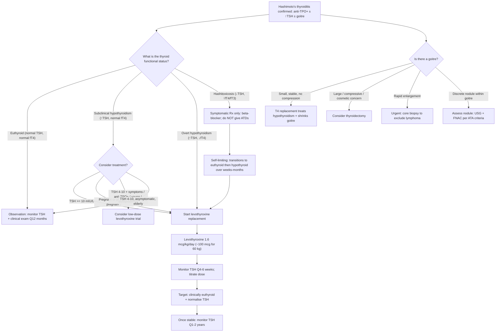

## Management Overview — Guiding Principles

The management of Hashimoto's thyroiditis is, at its core, deceptively simple: **replace what the thyroid can no longer make**. But the nuances — *when* to start, *how much* to give, *how to monitor*, *what to watch for*, and *when surgery enters the picture* — are what separate good clinical care from cookbook medicine.

The management approach depends entirely on **where the patient sits on the Hashimoto's disease spectrum**:

| Clinical Stage | TSH | fT4 | Treatment Approach |
|---|---|---|---|
| **Anti-TPO positive, euthyroid** | Normal | Normal | **Observation** — monitor annually |
| **Subclinical hypothyroidism** | ↑ (4–10 mIU/L) | Normal | **Consider treatment** in selected patients |
| **Overt hypothyroidism** | ↑↑ | ↓ | ***Levothyroxine (T4) replacement*** — mainstay [2][19] |
| **Hashitoxicosis** (transient) | ↓ | ↑ | **Symptomatic only** (β-blockers); do NOT give antithyroid drugs |
| **Goitre causing compression** | Variable | Variable | **Surgery** (thyroidectomy) |
| **Myxoedema coma** | ↑↑↑ | ↓↓↓ | **Emergency IV T4/T3 + hydrocortisone** |

---

## Management Algorithm

---

## Treatment Modalities — Detailed Breakdown

### 1. Levothyroxine (T4) Replacement — The Mainstay

"Levo" = levorotatory (the biologically active L-isomer); "thyroxine" = T4. This is **synthetic T4** that is identical to the endogenous hormone. It is the **single most important treatment** for Hashimoto's thyroiditis [2][3][7][19].

***Thyroxine replacement is the mainstay of treatment (ATA 2014)*** [7][19]

#### Why T4 and Not T3?

| Feature | ***Levothyroxine (T4)*** | ***Liothyronine (T3)*** |
|---|---|---|
| ***Indications*** | ***Routine replacement therapy for hypothyroidism of any cause, due to its longer half-life*** [20] | ***Acute severe hypothyroid state — myxoedema coma — due to its faster onset*** [20] |
| Half-life | ~7 days | ~1 day |
| Dosing | ***Once daily*** [20] — the long half-life provides stable serum levels | TDS dosing required — fluctuating levels |
| Physiological | T4 is the predominant secretory product of the thyroid (~90%); peripheral deiodination converts it to the active T3 as needed | Direct T3 bypasses the body's regulatory deiodination |
| Monitoring | TSH is a reliable indicator of adequacy | TSH fluctuates unpredictably with T3 dosing |

**Bottom line**: T4 acts as a **prodrug** — the body converts it to T3 at the tissues that need it, when they need it. This is more physiological and easier to monitor than giving T3 directly.

#### Dosing

***Full replacement dose: levothyroxine 1.6 µg/kg/day (~100 µg/day for 60 kg)*** [19] — but this is just a starting estimate.

| Patient Population | Starting Dose | Rationale |
|---|---|---|
| **Young, otherwise healthy** | Full anticipated dose (e.g., 100 µg/day) | Can tolerate rapid correction |
| ***Elderly or IHD patients*** | ***Start low (25–50 µg/day), increase by 25 µg Q4–6 weeks*** [3] | ***Starting T4 may ↑cardiac output → exacerbate IHD*** [3]; risk of precipitating angina, arrhythmias, heart failure |
| **Subclinical hypothyroidism** | Low dose (25–50 µg/day) | Often lower dose sufficient as residual thyroid function remains |
| ***Pregnancy*** | ***↑ dose by ~30–50% from pre-pregnancy dose*** | ***↑metabolism and ↑TBG in pregnancy → need more T4; prevent congenital hypothyroidism*** [3][7][19] |

#### Aims of Treatment

***Aim: (1) clinically euthyroid (2) normalise TSH (3) avoid overtreatment*** [7][19]

- **Target TSH**: 0.4–4.0 mIU/L (within normal reference range); some guidelines suggest lower half of normal (0.5–2.5) for younger patients
- ***In secondary hypothyroidism: aim fT4 in upper half of reference range*** [7][19] — because TSH cannot be used as a marker (the pituitary is the problem)

#### Monitoring Protocol

***Monitoring: monitor TSH Q4–6 weeks and titrate accordingly, then monitor Q1–2 years if within target range*** [7][19]

| Phase | Frequency | What to Check | Action |
|---|---|---|---|
| **Initiation / dose change** | ***Q4–6 weeks*** | TSH (± fT4) | Adjust dose by 12.5–25 µg increments; ***TSH levels may decline ≤ 1 month upon initiation but smaller changes may require > 8 weeks to achieve goal TSH*** [7] |
| **Stable maintenance** | ***Q1–2 years*** | TSH | Ensure no drift in thyroid function (ongoing autoimmune destruction may require dose increases over time) |
| **Pregnancy** | Q4 weeks during 1st half, then Q trimester | TSH | Dose ↑ needed in most; maintain TSH < 2.5 in 1st trimester |
| **Intercurrent illness / new medication** | As needed | TSH | Many drugs/conditions alter T4 requirements |

#### Risks of Over- and Under-treatment

| | ***Overtreatment (TSH suppressed)*** | ***Undertreatment (TSH elevated)*** |
|---|---|---|
| Consequences | ***Risk of osteoporosis and AF (especially in elderly)*** [7][19] | ***Risk of abnormal lipid profile → ↑risk of cardiovascular disease*** [7][19] |
| Why? | Excess T4 → ↑bone turnover (↑osteoclastic activity), ↑cardiac β-receptor sensitivity → AF | Persistent hypothyroidism → ↓LDL receptor expression → ↑LDL; ↓lipoprotein lipase → ↑TG |

#### Practical Precautions

- ***Take with empty stomach and separate from interfering medications ≥ 4 hours*** (e.g., ***CaCO₃, FeSO₄***) [7][19] — these chelate T4 in the gut, reducing absorption
- Other drugs that ↓ T4 absorption: sucralfate, cholestyramine, aluminium hydroxide antacids, proton pump inhibitors
- Drugs that ↑ T4 metabolism: phenytoin, carbamazepine, rifampicin (CYP inducers) — may need dose ↑
- ***In IHD patients: should treat coronary atherosclerosis prior to T4 treatment*** [3] — because abruptly ↑ metabolic rate can precipitate angina/MI

#### Adverse Effects of Levothyroxine

***Adverse effects*** [20]:

| Effect | Mechanism | Management |
|---|---|---|
| **Thyrotoxicosis symptoms** (palpitations, tremor, weight loss, heat intolerance) | Overdose → iatrogenic hyperthyroidism | Reduce dose; monitor TSH |
| ***Acute adrenal crisis*** | ***↑ metabolic clearance of adrenocortical hormones → ↓cortisol and aldosterone*** [20] | ***Contraindicated in patients with untreated adrenal insufficiency*** — must give hydrocortisone BEFORE starting T4 |
| ***Deterioration of CVS disease*** | ***↑ workload of heart and worsens ischaemic symptoms → angina / arrhythmias / cardiac failure*** [20] | Start low, go slow in elderly/IHD; treat coronary disease first |
| **Osteoporosis** | Long-term suppressed TSH → ↑bone resorption | Avoid over-replacement; monitor bone density in at-risk patients |
| **AF** | ↑atrial β-receptor sensitivity | Avoid over-replacement, especially in elderly |

<Callout title="The Adrenal Crisis Pitfall" type="error">
This is a commonly tested concept: if a patient has **both hypothyroidism and adrenal insufficiency** (e.g., Schmidt syndrome / autoimmune polyendocrine syndrome type 2), you must **treat the adrenal insufficiency FIRST** with hydrocortisone before starting levothyroxine. Why? Because T4 increases cortisol metabolism — starting T4 in a cortisol-deficient patient can precipitate an acute adrenal crisis. This is why ***levothyroxine is contraindicated in patients with untreated adrenal insufficiency*** [20].
</Callout>

---

### 2. Management of Subclinical Hypothyroidism

This is where the controversy lies, and it is a favourite exam topic.

***Subclinical hypothyroidism: ↑TSH with normal fT4*** [3][11]

***Management is controversial as benefit is uncertain*** [11]. The decision to treat depends on the balance of:
- **Risk of progression** to overt hypothyroidism
- **Cardiovascular risk** from untreated subclinical hypothyroidism
- **Risk of overtreatment** (osteoporosis, AF) especially in elderly

#### When to Treat (Current Consensus)

| Scenario | Recommendation | Rationale |
|---|---|---|
| ***TSH ≥ 10 mIU/L*** | ***Treat*** [11] | ***↑risk of CVD (IHD 1.89×, HF 1.86×) and ↑risk of progression*** [11] |
| ***Pregnant or planning pregnancy*** | ***Treat*** [11] | Maternal hypothyroidism → adverse fetal neurodevelopment; maintain TSH < 2.5 in 1st trimester |
| ***TSH 4–10 + anti-TPO positive*** | ***Consider treatment*** | Anti-TPO positivity predicts progression (2–4%/yr) |
| ***TSH 4–10 + symptoms attributable to hypothyroidism*** | ***Consider trial of T4*** | Improvement of symptoms supports continued treatment |
| TSH 4–10, asymptomatic, elderly | ***Observe + monitor*** | Risks of overtreatment may outweigh benefits; TSH reference range shifts higher with age |

> ***Risk of progression to overt hypothyroidism: 2–4%/year, especially if TSH > 10 mU/L or anti-TPO positive*** [11]

---

### 3. Management of Hashitoxicosis (Transient Thyrotoxic Phase)

This is a critical management distinction — **DO NOT give antithyroid drugs**.

***Hashitoxicosis: minority of patients initially present with hyperthyroidism due to severe follicular disruption and thyroid hormone release*** [2]

**Why antithyroid drugs don't work here**: Antithyroid drugs (carbimazole, methimazole, PTU) work by ***inhibiting TPO → ↓organification → ↓T4 synthesis*** [20]. In hashitoxicosis, the problem is **not overproduction** — it is **leakage of preformed hormone from destroyed follicles**. There is nothing to inhibit.

***Management (same principles as subacute thyroiditis)*** [8]:
- ***Self-limiting → do NOT give antithyroid medications*** [8]
- ***β-blocker for hyperthyroid phase*** (propranolol 10–40 mg TDS) — ***for symptomatic control only*** [8]
  - Propranolol is preferred: non-selective β-blocker, also ↓peripheral T4→T3 conversion
- ***NSAIDs or corticosteroids*** if significant inflammatory symptoms (uncommon in Hashimoto's, more relevant to de Quervain's)
- ***Temporary T4 replacement for hypothyroid phase if pronounced or symptomatic*** [8]
- **Eventually** transitions to permanent hypothyroidism → then long-term T4 replacement as above

---

### 4. Management of the Goitre

***T4 replacement treats hypothyroidism + shrinks goitre*** [2] — this is the dual benefit of levothyroxine in Hashimoto's.

#### Why Does T4 Shrink the Goitre?

The goitre in Hashimoto's is partly driven by **TSH-mediated hyperplasia** (the pituitary drives the remaining thyroid tissue to grow). By replacing T4:
- fT4 rises → negative feedback restored → TSH falls
- ↓TSH → ↓stimulus for compensatory hypertrophy → goitre shrinks

***T4 suppressive therapy if associated with ↑TSH, e.g., Hashimoto's thyroiditis*** [3]:
- ***MoA: administration of exogenous T4 → ↓TSH → ↓size of goitre*** [3]
- ***Problems: efficacy in euthyroid patient is controversial, also associated with long-term side effects of subclinical hyperthyroidism (bone, heart)*** [3]

#### When Is Surgery Needed for the Goitre?

***From the lecture slides — Indications of treatment for benign thyroid goitres*** [21]:
- ***Symptomatic (size of goitre/nodule)***
- ***Increase in goitre size***
- ***Trachea compression or deviation***
- ***Retrosternal extension***
- ***Suspected malignancy***
- ***Cosmetic considerations/patient wish***

Translated to the ***4C indications for thyroidectomy*** [10]:
- ***CA thyroid*** (confirmed or suspected)
- ***Uncontrolled thyrotoxicosis*** (not typically relevant to Hashimoto's)
- ***Compression*** (dysphagia, dyspnoea, stridor, RLN palsy)
- ***Cosmetic concern***

---

### 5. Thyroidectomy in Hashimoto's Thyroiditis

Surgery is **not first-line** for Hashimoto's — it is reserved for specific indications. But when it is needed, understanding the types and complications is essential.

#### Indications for Thyroidectomy in Hashimoto's

| Indication | Explanation |
|---|---|
| **Compressive goitre** | Large goitre causing dysphagia, dyspnoea, stridor, or tracheal deviation despite T4 therapy |
| **Suspected malignancy** | Suspicious nodule on USG/FNAC (Bethesda IV–VI) within the Hashimoto's goitre |
| **Suspected thyroid lymphoma** | Rapidly enlarging goitre — though lymphoma is treated with R-CHOP + EBRT, surgery may be needed for tissue diagnosis or debulking |
| **Cosmetic** | Large visible goitre unresponsive to T4 therapy |
| **Failed T4 suppression** | Goitre continues to grow despite adequate T4 replacement |

#### Types of Surgery

***From the lecture slides*** [21]:

| ***Type*** | ***Description*** | ***Indication in Hashimoto's*** | ***Key Consequences*** |
|---|---|---|---|
| ***Hemithyroidectomy (unilateral lobectomy)*** | ***Resection of one lobe + isthmus*** | ***Uninodular goitre; safe, minimal morbidities, diagnosis and cure; future reoperation on contralateral lobe without difficulty*** [21] | ***Around 10–20% chance of hypothyroidism*** [21]; lower risk of hypoparathyroidism and RLN injury |
| ***Total/near-total thyroidectomy*** | ***Resection of both lobes + isthmus + pyramidal lobe*** | ***Symptomatic multinodular goitre; no recurrence/need of reoperation*** [21] | ***Needs long-term thyroxine replacement*** [21]; ***additional surgical risk: hypoparathyroidism*** [21]; ***thyroid failure (100%)*** [10] |
| ***Subtotal thyroidectomy*** | Partial resection of both lobes | ***Rarely indicated*** [21] | Risk of recurrence + complications |

***Terminologies*** [10]:
- ***Total thyroidectomy***: resection of both lobes + isthmus + pyramidal lobe
- ***Subtotal thyroidectomy***: resection of > 1/2 of both lobes + isthmus
- ***Hemithyroidectomy***: resection of one lobe + isthmus
- ***Lobectomy***: resection of one lobe (isthmus preserved)

#### Pre-operative Evaluation [10]

- **Maintain biochemically euthyroid** — essential before any thyroid surgery
- **Vocal cord function by laryngoscopy** — baseline RLN assessment
- **Monitor Ca²⁺ and vitamin D levels** — prepare for post-op hypoparathyroidism/hungry bone syndrome

#### Complications of Thyroidectomy

| Complication | Mechanism | Management |
|---|---|---|
| **Hypoparathyroidism → Hypocalcaemia** | Parathyroid glands damaged/devascularised during surgery (especially in total thyroidectomy) | Acute: ***IV 10–20 mL of 10% calcium gluconate over 10 mins*** [20]; Long-term: calcium carbonate + calcitriol |
| **RLN injury → Hoarseness** | Recurrent laryngeal nerve damaged during dissection; runs in tracheo-oesophageal groove posterior to thyroid | Unilateral: hoarseness (usually recovers); Bilateral: stridor → emergency (may need tracheostomy) |
| **Hypothyroidism** | Loss of thyroid tissue | T4 replacement (universal after total thyroidectomy) |
| **Haemorrhage / Haematoma** | Post-op bleeding → neck swelling → can compress airway | Emergency: open wound at bedside to decompress; return to OT |
| **Wound infection** | Standard surgical complication | Antibiotics; wound care |

<Callout title="Post-Thyroidectomy T4 Replacement" type="idea">
After **hemithyroidectomy** in Hashimoto's: ***do NOT start T4 therapy immediately postoperatively — measure serum TSH 6 weeks after surgery and determine the need for T4*** [20]. The remaining lobe may compensate adequately (though in Hashimoto's, the remaining lobe is also diseased, so hypothyroidism is more likely than in other conditions).

After **total thyroidectomy**: T4 replacement is **mandatory** and lifelong [20][21].
</Callout>

---

### 6. Management of Myxoedema Coma

This is the **most extreme presentation** of untreated/undertreated Hashimoto's hypothyroidism — a medical emergency with ~20–40% mortality.

***Myxoedematous coma: very rare, medical emergency*** [3][19]

***S/S: confusion, coma, ↓↓body temperature, convulsion, respiratory failure, hypoxia; prone to superimposed infections*** [3][19]

#### Treatment Protocol [3][19][20]

| Component | Detail | Rationale |
|---|---|---|
| **Treat precipitating cause** | Infection (most common trigger), cold exposure, sedatives, non-compliance with T4 | Mortality is driven by the precipitant as much as the hypothyroidism |
| **Supportive care** | ***Fluid replacement + maintain body temperature + correct fluid, electrolytes, hypoglycaemia*** [3][19] | Hypothermia, hyponatraemia, hypoglycaemia are life-threatening |
| ***Urgent T4 replacement*** | ***T4 200–500 µg PO stat then 100–200 µg PO daily*** [3][19] | Rapid restoration of thyroid hormone; loading dose needed because T4 has a long half-life |
| ***Urgent T3 replacement*** | ***T3 20–40 µg stat then 20 µg Q8H PO*** [3][19] | Faster onset than T4; T3 is used because peripheral conversion of T4→T3 may be impaired in critical illness |
| ***IV Hydrocortisone*** | ***100 mg Q6H*** [3][19] | ***To provide steroid cover for possible coexisting secondary hypothyroidism (autoimmune polyendocrine syndrome) or relative adrenal insufficiency*** — must give BEFORE T4 to prevent adrenal crisis |
| **Ventilatory support** | Intubation if respiratory failure / ↓GCS | Hypothyroidism depresses respiratory drive |
| **Rewarming** | Passive rewarming (blankets); avoid active rewarming (can cause vasodilation → cardiovascular collapse) | Core temperature may be < 35°C |

<Callout title="Why Hydrocortisone Before T4 in Myxoedema Coma?">
Two reasons: (1) Coexisting adrenal insufficiency may be present (autoimmune polyendocrine syndrome — Hashimoto's + Addison's). Starting T4 increases cortisol metabolism, which can precipitate adrenal crisis. (2) Even without Addison's, critical illness causes relative adrenal insufficiency. The hydrocortisone provides a safety net [3][19].
</Callout>

---

### 7. Management of Associated Conditions

Because Hashimoto's clusters with other autoimmune diseases, comprehensive management includes:

| Associated Condition | Screening / Action |
|---|---|
| **Pernicious anaemia** | Check B12, anti-IF/anti-parietal cell Ab if macrocytosis or neurological symptoms |
| **Type 1 DM** | Check HbA1c/glucose; co-management with diabetology |
| **Coeliac disease** | Check anti-tTG IgA if GI symptoms or unexplained iron deficiency |
| **Addison's disease** | Check morning cortisol + ACTH if unexplained fatigue, hypotension, hyperpigmentation, hyponatraemia |
| **Dyslipidaemia** | Lipid profile; hypothyroidism-driven dyslipidaemia often improves with adequate T4 replacement — reassess before starting statins |
| **Thyroid lymphoma** | Surveillance for rapid goitre enlargement; low threshold for core biopsy |

---

### 8. Special Populations

#### Pregnancy

- Hashimoto's is the **most common cause of hypothyroidism in pregnancy** in iodine-sufficient regions
- ***↑ dosage of T4 in pregnancy due to ↑metabolism, ↑TBG level, and to prevent congenital hypothyroidism (associated with devastating consequences)*** [7][19]
- Typically increase dose by **30–50%** as soon as pregnancy is confirmed
- **Target TSH**: < 2.5 mIU/L in 1st trimester; < 3.0 in 2nd/3rd trimester (ATA 2017 guidelines)
- Monitor TSH **Q4 weeks** in first half of pregnancy
- **Untreated maternal hypothyroidism** → risk of miscarriage, preeclampsia, placental abruption, preterm birth, impaired fetal neurodevelopment

#### Elderly

- Start T4 at **low dose** (25 µg/day) and titrate slowly
- **Target TSH may be higher** (4–6 mIU/L acceptable in very elderly) — TSH reference range shifts upward with age
- Be especially cautious about **overtreatment** → AF, osteoporosis, fractures

#### Children

- Hashimoto's is the most common cause of acquired hypothyroidism in children
- Untreated → **growth retardation, delayed puberty, cognitive impairment**
- T4 replacement with weight-based dosing; close monitoring of growth, development, and TFTs

---

### Management Summary Table

| Clinical Scenario | Management | Key Points |
|---|---|---|
| **Euthyroid + anti-TPO positive** | Observe; TSH Q12 months | Do NOT treat; 2–4%/yr progression risk |
| **Subclinical hypothyroidism** | Treat if TSH ≥ 10, pregnant/planning, symptomatic + anti-TPO+ | Controversial if mild; weigh risks vs benefits |
| **Overt hypothyroidism** | Levothyroxine 1.6 µg/kg/day; titrate to normalise TSH | Lifelong therapy; monitor Q4–6w then Q1–2y |
| **Hashitoxicosis** | β-blocker only; NO antithyroid drugs | Self-limiting; will transition to hypothyroid phase |
| **Goitre (small, stable)** | T4 replacement ± T4 suppressive therapy | T4 treats hypothyroidism AND shrinks goitre |
| **Goitre (large, compressive)** | Thyroidectomy (total or hemi depending on extent) | Indications: 4Cs |
| **Suspected lymphoma** | Core biopsy → R-CHOP + EBRT | FNAC insufficient; urgency required |
| **Myxoedema coma** | IV hydrocortisone first → IV/PO T4 + T3 + supportive | Medical emergency; 20–40% mortality |
| **Pregnancy** | ↑ T4 dose 30–50%; target TSH < 2.5 (1st trim) | Prevent congenital hypothyroidism |

---

> ***Hashimoto's thyroiditis requires life-long T4 replacement*** [3][7] — this is the key management principle. The autoimmune destruction is irreversible in the vast majority of cases (though a minority may have spontaneous remission [2]).

<Callout title="High Yield Summary — Management">

1. ***Levothyroxine (T4) replacement is the mainstay*** — treats hypothyroidism AND shrinks goitre
2. **Dose**: 1.6 µg/kg/day; start low in elderly/IHD; ↑ in pregnancy
3. **Aims**: clinically euthyroid, normalise TSH, avoid overtreatment
4. **Monitoring**: TSH Q4–6 weeks initially → Q1–2 years once stable
5. **Overtreatment risks**: osteoporosis, AF (especially elderly)
6. **Undertreatment risks**: dyslipidaemia, CVD, persistent symptoms
7. **Subclinical hypothyroidism**: treat if TSH ≥ 10, pregnant, or symptomatic with anti-TPO+
8. **Hashitoxicosis**: β-blocker only — NO antithyroid drugs (nothing to inhibit)
9. **Myxoedema coma**: hydrocortisone FIRST → then IV T4/T3 + supportive care
10. **Surgery**: reserved for compression (4Cs), suspected malignancy/lymphoma
11. **Always rule out coexisting adrenal insufficiency** before starting T4 — give hydrocortisone first if suspected
12. **Pregnancy**: increase dose immediately; target TSH < 2.5; monitor Q4 weeks
13. **Associated conditions**: screen for pernicious anaemia, T1DM, coeliac, Addison's, dyslipidaemia

</Callout>

---

<ActiveRecallQuiz
  title="Active Recall - Management of Hashimoto's Thyroiditis"
  items={[
    {
      question: "A 65-year-old woman with Hashimoto's thyroiditis and known IHD is found to have a TSH of 45 mIU/L and fT4 of 5 pmol/L. How would you initiate levothyroxine treatment, and why?",
      markscheme: "Start low dose (25 mcg/day) and increase gradually by 25 mcg every 4-6 weeks. Rationale: starting T4 increases cardiac output and myocardial oxygen demand, which can precipitate angina, arrhythmias, or heart failure in IHD patients. Should ideally treat coronary atherosclerosis prior to or alongside T4 initiation. Must also exclude coexisting adrenal insufficiency before starting T4.",
    },
    {
      question: "Explain why antithyroid drugs are contraindicated in hashitoxicosis. What treatment should be given instead?",
      markscheme: "Antithyroid drugs (carbimazole, PTU) inhibit TPO, blocking new thyroid hormone synthesis. In hashitoxicosis, the problem is leakage of preformed hormone from destroyed follicles, NOT overproduction. There is nothing to inhibit. Treatment: beta-blockers (propranolol) for symptomatic control only. The condition is self-limiting; patient will transition to hypothyroid phase requiring T4 replacement.",
    },
    {
      question: "A patient with known Hashimoto's and Addison's disease develops severe hypothyroidism. In what order should you treat, and why?",
      markscheme: "Treat adrenal insufficiency FIRST with hydrocortisone, then start levothyroxine. Reason: T4 increases metabolic clearance of cortisol. Starting T4 in a cortisol-deficient patient precipitates acute adrenal crisis (hypotension, shock, death). This applies in autoimmune polyendocrine syndrome type 2 (Schmidt syndrome: Hashimoto's + Addison's).",
    },
    {
      question: "A woman with Hashimoto's thyroiditis on levothyroxine 100 mcg/day discovers she is pregnant. What changes should be made to her thyroid management?",
      markscheme: "Increase levothyroxine dose by 30-50% immediately upon confirmation of pregnancy. Target TSH less than 2.5 mIU/L in 1st trimester and less than 3.0 in 2nd/3rd trimester. Monitor TSH every 4 weeks in first half of pregnancy. Rationale: increased metabolism, increased TBG, and increased T4 requirements in pregnancy. Untreated maternal hypothyroidism causes miscarriage, preeclampsia, preterm birth, and impaired fetal neurodevelopment.",
    },
    {
      question: "List the 4C indications for thyroidectomy in the context of thyroid disease including Hashimoto's, and name two specific complications of total thyroidectomy with their mechanisms.",
      markscheme: "4C indications: (1) Cancer (confirmed or suspected malignancy), (2) Compression (dysphagia, dyspnoea, stridor, tracheal deviation), (3) Cannot be treated medically (uncontrolled disease), (4) Cosmetic concern. Complications: (1) Hypoparathyroidism causing hypocalcaemia - parathyroid glands damaged or devascularised during surgery. (2) Recurrent laryngeal nerve injury causing hoarseness - nerve runs in tracheo-oesophageal groove posterior to thyroid and can be injured during dissection.",
    },
    {
      question: "When should subclinical hypothyroidism due to Hashimoto's be treated versus observed? Name at least four indications for treatment.",
      markscheme: "Treat if: (1) TSH >= 10 mIU/L (increased CVD risk - IHD 1.89x, HF 1.86x), (2) pregnant or planning pregnancy, (3) symptomatic with positive anti-TPO antibodies, (4) young patient with lower risk of overtreatment, (5) infertility, (6) significant dyslipidaemia. Observe if: asymptomatic elderly with TSH 4-10 (risk of overtreatment - AF, osteoporosis outweighs uncertain benefit).",
    },
  ]}
/>

---

## References

[2] Senior notes: Ryan Ho Endocrine.pdf (p30 — Hashimoto's Thyroiditis: Mx)
[3] Senior notes: Ryan Ho Fundamentals.pdf (p424–429 — Hypothyroidism Mx, Goitre Mx, Scintigraphy, Myxoedema coma)
[7] Senior notes: Adrian Lui Pediatrics.pdf (p274–275 — Hypothyroidism Mx, Thyroxine replacement, Myxoedema coma)
[8] Senior notes: Ryan Ho Endocrine.pdf (p31 — Subacute Thyroiditis Mx)
[10] Senior notes: maxim.md (Thyroidectomy indications 4C, terminologies, pre-op evaluation, thyroxine roles)
[11] Senior notes: Ryan Ho Endocrine.pdf (p17 — Subclinical hypothyroidism management)
[19] Senior notes: Ryan Ho Endocrine.pdf (p16 — Thyroxine replacement: dosing, aims, monitoring, precautions, myxoedema coma)
[20] Senior notes: felixlai.md (Treatment of hypothyroidism table: T3 vs T4 indications, adverse effects; Myxoedema coma Mx; Thyroid hormone replacement post-thyroidectomy)
[21] Lecture slides: GC 177. A thyroid nodule benign thyroid nodules; thyroid cancer.pdf (p14–15 — Benign thyroid nodules: indications of treatment, surgical treatment types)
