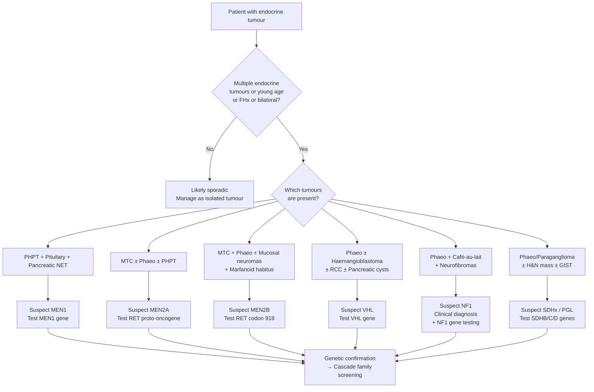

## Differential Diagnosis of MEN Syndromes

### 9. Approach to Differential Diagnosis — First Principles

The clinical challenge with MEN syndromes is that patients rarely walk in saying "I have MEN." Instead, they present with **one component tumour** — a parathyroid adenoma, a thyroid nodule, a pancreatic NET, a phaeochromocytoma, or even just refractory peptic ulcer disease. The differential diagnosis therefore operates on **two levels**:

1. **Level 1 — "Is this endocrine tumour sporadic or part of a hereditary syndrome?"** This is the most critical question. Most endocrine tumours are sporadic. MEN should be suspected when there are **multiple endocrine tumours, young age at presentation, bilateral/multifocal disease, or a positive family history**.

2. **Level 2 — "If hereditary, which syndrome is it?"** Once you suspect a hereditary cause, you need to differentiate between MEN1, MEN2A, MEN2B, and the **other hereditary tumour syndromes** that can mimic MEN.

The logic is: **recognise the pattern → suspect the syndrome → confirm genetically**.

---

### 9.1 Differential Diagnosis by Presenting Component

Because MEN patients present with individual tumour components, let's work through the DDx from each common entry point.

#### A. Patient Presenting with Primary Hyperparathyroidism

The vast majority of primary hyperparathyroidism (PHPT) is sporadic (~95%). But certain red flags should prompt consideration of a hereditary syndrome:

| Diagnosis | Key Distinguishing Features | Why It Mimics MEN |
|:----------|:--------------------------|:-----------------|
| **Sporadic parathyroid adenoma** (80% of PHPT) | Single gland, older age (postmenopausal women), no FHx | Most common cause of PHPT; a single adenoma does NOT equal MEN |
| ***MEN1*** | **Multigland hyperplasia**, young onset (2nd–4th decade), **FHx**, concurrent pituitary/pancreatic tumours | Hyperparathyroidism is the earliest and most penetrant feature [1] |
| ***MEN2A*** | **Mild, often asymptomatic** hyperparathyroidism with concurrent MTC and/or phaeochromocytoma | Usually discovered during MEN2A workup, not the presenting feature [1] |
| **Familial Hypocalciuric Hypercalcaemia (FHH)** | Hypercalcaemia + normal/mildly elevated PTH + **low urine calcium** (Ca:Cr clearance ratio < 0.01); CaSR mutation | Mimics PHPT biochemically but does NOT require surgery; ***must check 24h urine Ca to rule out*** [3] |
| **Familial isolated hyperparathyroidism (FIHP)** | PHPT without other MEN features; may carry MEN1, CDC73 (HRPT2), or CaSR mutations | May be an incomplete expression of MEN1 or a distinct entity |
| **Hyperparathyroidism–jaw tumour syndrome (HPT-JT)** | PHPT + ossifying fibromas of the jaw + renal cysts/hamartomas; CDC73 (HRPT2) gene mutation | Higher risk of **parathyroid carcinoma** (~15%) unlike MEN where carcinoma is rare |

<Callout title="Exam Pearl: FHH vs PHPT" type="error">
***24h urine calcium is a must-check investigation*** in any patient with hypercalcaemia and elevated/normal PTH [3]. FHH has low urinary calcium (Ca:Cr clearance ratio < 0.01) because the mutated calcium-sensing receptor in the kidney fails to detect high serum calcium and inappropriately reabsorbs it. Operating on FHH patients is futile and harmful — parathyroidectomy will not correct the hypercalcaemia.
</Callout>

#### B. Patient Presenting with Medullary Thyroid Carcinoma

***~20% of MTC is familial*** — every single MTC patient should be tested for RET mutation [5][8].

| Diagnosis | Key Distinguishing Features |
|:----------|:--------------------------|
| **Sporadic MTC** (80%) | Unilateral, older age ( > 50y), no FHx, no associated tumours [1] |
| ***MEN2A*** | **Bilateral, multifocal MTC** + phaeochromocytoma (50%) + parathyroid hyperplasia (10–25%); RET codon 634 most common [1] |
| ***MEN2B*** | **Bilateral, multifocal, earliest and most aggressive MTC** + phaeochromocytoma (50%) + **mucosal neuromas** + Marfanoid habitus + intestinal ganglioneuromas; RET codon 918; ~50% de novo [1] |
| **Familial MTC (FMTC)** | MTC only (no phaeo or PHPT); now classified as a **variant of MEN2A** with lower-risk RET mutations (codons 804, 891); must continue surveillance for other MEN2A components |

> ***FHx of thyroid CA: ~20% of medullary CA (MEN II), ~5% of papillary CA*** [8]

#### C. Patient Presenting with Phaeochromocytoma/Paraganglioma

This is a critical differential because phaeochromocytoma is a feature of **multiple** hereditary syndromes, not just MEN2. ***Up to 40% of phaeochromocytomas are now considered familial*** — the old "10% familial" rule is outdated [1][7].

| Diagnosis | Gene | Key Distinguishing Features |
|:----------|:-----|:--------------------------|
| **Sporadic phaeochromocytoma** | None | Most common; older age; usually unilateral, adrenal |
| ***MEN2A/2B*** | ***RET*** | Bilateral adrenal phaeo (30–100%) + MTC ± PHPT (2A) or mucosal neuromas (2B); **less commonly extra-adrenal or malignant** than sporadic [1] |
| ***Von Hippel-Lindau disease (VHL)*** | ***VHL*** | Phaeo (10–20%) + **retinal and cerebellar haemangioblastomas** + **clear cell renal cell carcinoma** + pancreatic cysts/NETs + endolymphatic sac tumours [7] |
| ***Neurofibromatosis type 1 (NF1)*** | ***NF1*** | Phaeo (2–3%) + **café-au-lait spots** + neurofibromas + Lisch nodules + axillary/inguinal freckling + skeletal dysplasia [7][9] |
| **Familial paraganglioma syndromes (PGL 1–4)** | **SDHx** (SDHB, SDHC, SDHD, SDHA) | Head & neck paragangliomas + extra-adrenal sympathetic paragangliomas; **SDHB mutations carry highest malignancy risk** (~40%); succinate dehydrogenase mutations [3][7] |
| ***Carney triad*** | Sporadic (not hereditary) | ***GIST + pulmonary chondroma + paragangliomas***; young women; distinct from Carney complex [3] |
| **Carney-Stratakis syndrome** | **SDHB/SDHC/SDHD** | GIST + paraganglioma; inherited (AD); no pulmonary chondroma (distinguishes from Carney triad) |

<Callout title="The New 40% Rule">
The traditional "10% rule" for phaeochromocytoma (10% bilateral, 10% familial, 10% extra-adrenal, 10% malignant, etc.) is now outdated. ***Up to 40% are familial*** [1]. Current guidelines recommend **genetic testing for ALL patients with phaeochromocytoma/paraganglioma**, regardless of age or family history. The hereditary syndromes to consider are: MEN2, VHL, NF1, SDHx mutations, and Carney triad/Carney-Stratakis.
</Callout>

#### D. Patient Presenting with Pituitary Adenoma

Most pituitary adenomas are sporadic. MEN1 accounts for < 3% of pituitary adenomas [1]. However, MEN1-associated pituitary tumours tend to be **larger (85% macroadenomas)** and more treatment-resistant.

| Diagnosis | Key Distinguishing Features |
|:----------|:--------------------------|
| **Sporadic pituitary adenoma** | Most common; isolated; no FHx; microadenoma more common (~58%) |
| ***MEN1*** | **85% macroadenoma** (vs 42% sporadic); young onset; concurrent PHPT/pNETs; prolactinoma most common [1] |
| **Familial isolated pituitary adenoma (FIPA)** | AIP gene mutations; isolated pituitary adenomas in ≥2 family members without other MEN1 features; typically GH-secreting (somatotrophinomas) in young males |
| **Carney complex** | PRKAR1A gene mutation; pituitary adenoma (GH-secreting) + primary pigmented nodular adrenocortical disease (PPNAD/Cushing's) + cardiac myxomas + skin pigmentation (lentigines, blue naevi) |
| **McCune-Albright syndrome** | ***Somatic GNAS1 mutation → constitutive G-protein activation*** [10]; precocious puberty + café-au-lait spots ("Coast of Maine" borders) + polyostotic fibrous dysplasia; GH-secreting pituitary adenoma possible; NOT inherited (somatic mosaicism) |

#### E. Patient Presenting with Pancreatic Neuroendocrine Tumours

| Diagnosis | Key Distinguishing Features |
|:----------|:--------------------------|
| **Sporadic pNET** | Single tumour; older age; no FHx |
| ***MEN1*** | **Multiple, multifocal pNETs**; young onset; concurrent PHPT/pituitary adenoma; gastrinoma most common functional type (~54%); ***if multiple insulinomas → consider MEN1*** [4] |
| **Von Hippel-Lindau disease** | Pancreatic cysts and NETs + haemangioblastomas + RCC |
| **Tuberous sclerosis complex (TSC)** | Pancreatic NETs (rare) + cortical tubers + subependymal giant cell astrocytomas + renal angiomyolipomas + cardiac rhabdomyomas + skin findings (ash-leaf macules, shagreen patch, facial angiofibromas) |
| **Neurofibromatosis type 1** | Duodenal somatostatinomas (periampullary); + NF1 features (café-au-lait, neurofibromas) |

#### F. Patient Presenting with Marfanoid Habitus

This is particularly relevant for MEN2B differential:

| Diagnosis | Key Distinguishing Features |
|:----------|:--------------------------|
| ***MEN2B*** | Marfanoid habitus + **mucosal neuromas** + MTC + phaeo + intestinal ganglioneuromas; ***NO ectopia lentis, NO aortic root pathology*** [1] |
| **Marfan syndrome** | FBN1 mutation; Marfanoid habitus + **ectopia lentis** (upward lens subluxation, ~60%) + **aortic root dilatation/dissection** + MVP; NO mucosal neuromas [10] |
| **Homocystinuria** | CBS deficiency; Marfanoid habitus + **downward** lens subluxation + intellectual disability + thromboembolism + osteoporosis; urine homocysteine elevated |
| **Loeys-Dietz syndrome** | TGFBR1/2 mutations; Marfanoid features + arterial tortuosity and aneurysms (widespread, not just aortic root) + bifid uvula/cleft palate + hypertelorism |

---

### 9.2 Differentiating MEN1, MEN2A, and MEN2B from Each Other

This is the core exam question — "given this cluster of tumours, which MEN syndrome is it?"

| Feature | MEN1 | MEN2A | MEN2B |
|:--------|:-----|:------|:------|
| **Gene** | MEN1 (menin) | RET | RET |
| **Mechanism** | Tumour suppressor (two-hit) | Oncogene (gain-of-function) | Oncogene (gain-of-function) |
| **PHPT** | +++ (95–100%) | + (10–25%) | − |
| **Pituitary adenoma** | ++ (15–42%) | − | − |
| **Pancreatic NETs** | ++ (30–80%) | − | − |
| **MTC** | − | +++ (100%) | +++ (100%, most aggressive) |
| **Phaeochromocytoma** | − | ++ (~50%) | ++ (~50%) |
| **Mucosal neuromas** | − | − | +++ (pathognomonic) |
| **Marfanoid habitus** | − | − | ++ |
| **Intestinal ganglioneuromas** | − | − | ++ |
| **Hirschsprung disease** | − | + (rare) | − |
| **Cutaneous lichen amyloidosis** | − | + (rare, codon 634) | − |
| **Angiofibromas/collagenomas** | ++ | − | − |

<Callout title="The Decisive Differentiators">

- **Pituitary adenoma or pancreatic NET present?** → Think **MEN1** (these NEVER occur in MEN2)
- **MTC present?** → Think **MEN2** (MTC NEVER occurs in MEN1)
- **Mucosal neuromas or Marfanoid habitus?** → **MEN2B** specifically (never in MEN2A)
- **Parathyroid disease + MTC + phaeo but NO neuromas?** → **MEN2A**
- **MTC + phaeo + neuromas but NO parathyroid disease?** → **MEN2B**

</Callout>

---

### 9.3 Differentiating MEN2 from Other Hereditary Phaeochromocytoma Syndromes

This is a high-yield comparison because the exam loves to test whether you can distinguish these genetic syndromes:

| Syndrome | Gene | Phaeo Features | Unique Associated Tumours | Distinguishing Clue |
|:---------|:-----|:--------------|:-------------------------|:-------------------|
| ***MEN2*** | ***RET*** | Bilateral adrenal; less extra-adrenal/malignant | MTC (100%), ± PHPT | **Thyroid neck mass + hypertensive spells** |
| ***VHL*** | ***VHL*** | Often bilateral; noradrenergic (NA-secreting → sustained HTN) | Retinal/cerebellar **haemangioblastomas**, clear cell **RCC**, pancreatic cysts | **Young patient with retinal/CNS tumours + RCC + phaeo** |
| ***NF1*** | ***NF1*** | Usually unilateral adrenal; rare (2–3%) | **Café-au-lait spots**, neurofibromas, **Lisch nodules**, optic glioma, skeletal dysplasia | **Skin findings are obvious** — NF1 diagnosed clinically (CAFESPOT criteria) [9] |
| **SDHx / PGL syndromes** | **SDHB/C/D** | Extra-adrenal (H&N paragangliomas common); **SDHB = high malignancy risk** | H&N paragangliomas, GIST (Carney-Stratakis) | **H&N mass with catecholamine excess** |
| ***Carney triad*** | Sporadic | Paragangliomas | ***GIST + pulmonary chondroma*** | **Young woman with GI and lung masses + paraganglioma** [3] |

---

### 9.4 Diagnostic Decision Flowchart

---

### 9.5 When to Suspect MEN — Clinical Triggers

In clinical practice (and exam scenarios), you should think about MEN in these situations:

**Triggers for MEN1 screening:**
- Primary hyperparathyroidism at **young age** (< 40 years) or with **multigland disease**
- ***Multiple insulinomas → consider MEN1*** [4]
- Gastrinoma / Zollinger-Ellison syndrome (***20-30% associated with MEN1***) [1][6]
- ***Exclude MEN1 in insulinoma: check CaPO₄, PTH, prolactin, gastrin*** [4]
- Pituitary macroadenoma in a young patient, especially if treatment-resistant
- Any patient with **two or more** MEN1-associated tumours
- Family history of any MEN1 component tumour

**Triggers for MEN2 screening:**
- ***All patients with MTC should be tested for RET mutation*** [2]
- Phaeochromocytoma, especially if **bilateral, young onset, or familial** [7]
- Family history of MTC, phaeochromocytoma, or sudden death (undiagnosed phaeo crisis)
- ***FHx of thyroid CA esp medullary and MEN2*** [8]
- Child or infant with **mucosal neuromas** on lips/tongue + Marfanoid body habitus → urgent RET testing for MEN2B
- Hirschsprung disease + thyroid nodule (rare but described in MEN2A)

---

### 9.6 Differential Diagnosis of Individual Biochemical Findings

#### Hypercalcaemia with Elevated/Normal PTH
This is the biochemical signature of primary hyperparathyroidism. The DDx includes:

| Condition | PTH | Urine Ca | Other Features |
|:----------|:----|:---------|:---------------|
| Sporadic parathyroid adenoma | ↑ | ↑ | Single gland, older |
| MEN1 / MEN2A | ↑ | ↑ | Multigland, young, FHx, associated tumours |
| FHH | Normal/mildly ↑ | ***↓ (Ca:Cr clearance ratio < 0.01)*** | ***CaSR mutation; benign; does NOT require surgery*** [3] |
| HPT-JT | ↑ | ↑ | Jaw tumours, risk of parathyroid carcinoma; CDC73 mutation |
| Lithium-induced | ↑ | Variable | History of lithium use for bipolar disorder |
| Tertiary hyperparathyroidism | ↑ | Variable | Background of chronic kidney disease |

> ***Should perform workup for MEN: MEN1 = parathyroid hyperplasia/adenoma, pancreatic endocrine tumour, pituitary prolactinoma; MEN2A = medullary CA thyroid, pheochromocytoma, parathyroid hyperplasia*** [3]

#### Catecholamine Excess (Hypertension + Spells)
| Condition | Distinguishing Feature |
|:----------|:---------------------|
| Sporadic phaeochromocytoma | Isolated, unilateral, older |
| MEN2 | + MTC, bilateral phaeo |
| VHL | + Haemangioblastomas, RCC |
| NF1 | + Café-au-lait, neurofibromas |
| SDHx | + H&N paragangliomas |
| Essential hypertension with anxiety | No biochemical catecholamine excess |
| Thyrotoxicosis | Weight loss, tremor, goitre, ↑T4, ↓TSH; NO elevated metanephrines |
| Drug-induced (cocaine, amphetamines) | History of substance use; transient |

---

### 9.7 Summary Table: Hereditary Endocrine Tumour Syndromes

| Syndrome | Gene | Inheritance | Key Tumours | Pathognomonic Feature |
|:---------|:-----|:-----------|:------------|:---------------------|
| **MEN1** | MEN1 (menin) | AD | PHPT, pituitary, pNET | Multigland parathyroid + gastrinoma + prolactinoma |
| **MEN2A** | RET | AD | MTC, phaeo, PHPT | MTC + phaeo + PHPT |
| **MEN2B** | RET | AD (~50% de novo) | MTC, phaeo, neuromas | **Mucosal neuromas** + Marfanoid habitus |
| **VHL** | VHL | AD | Haemangioblastoma, RCC, phaeo, pNET | **Retinal/cerebellar haemangioblastoma** |
| **NF1** | NF1 | AD | Neurofibroma, MPNST, optic glioma, phaeo | **Café-au-lait + neurofibromas + Lisch nodules** |
| **SDHx/PGL** | SDHB/C/D | AD | Paraganglioma, GIST | **H&N paraganglioma** |
| **Carney complex** | PRKAR1A | AD | PPNAD (Cushing's), cardiac myxoma, pituitary | **Cardiac myxoma + lentigines** |
| **HPT-JT** | CDC73 | AD | PHPT, parathyroid CA, jaw fibroma | **Ossifying fibroma of jaw** |
| **McCune-Albright** | GNAS1 | Somatic mosaic | Precocious puberty, pituitary, thyroid | **Polyostotic fibrous dysplasia + café-au-lait ("Coast of Maine")** |

---

<Callout title="High Yield Summary">

**When to suspect MEN syndromes:**
- Multiple endocrine tumours in one patient or family
- Young-onset endocrine tumour (PHPT < 40y, MTC < 50y, phaeo < 40y)
- Bilateral/multifocal disease (bilateral phaeo, multigland parathyroid, bilateral MTC)
- Specific triggers: ALL MTC → test RET; multiple insulinomas → test MEN1; ZES → consider MEN1 (20-30%)

**Key differentiators between MEN subtypes:**
- MEN1 = "3 P's" (Parathyroid + Pituitary + Pancreas); NO MTC
- MEN2A = MTC + Phaeo + PHPT; NO neuromas
- MEN2B = MTC + Phaeo + Mucosal neuromas + Marfanoid; NO PHPT

**Key differential from other hereditary syndromes:**
- VHL: phaeo + haemangioblastomas + RCC (NO MTC)
- NF1: phaeo + café-au-lait + neurofibromas (NO MTC)
- SDHx: H&N paragangliomas ± GIST
- FHH mimics PHPT but has LOW urine calcium — always check 24h urine Ca
- Marfan syndrome has ectopia lentis + aortic root dilatation; MEN2B does NOT

**Critical rule:** Always exclude phaeochromocytoma before ANY surgery in MEN2 patients.

</Callout>

---

<ActiveRecallQuiz
  title="Active Recall - Differential Diagnosis of MEN Syndromes"
  items={[
    {
      question: "A 25-year-old presents with recurrent kidney stones and is found to have hypercalcaemia with elevated PTH. What investigation must you perform before diagnosing primary hyperparathyroidism, and what condition does it exclude?",
      markscheme: "24-hour urine calcium (and calculate Ca:Cr clearance ratio). This excludes Familial Hypocalciuric Hypercalcaemia (FHH), which has low urine calcium (ratio less than 0.01) due to CaSR mutation. FHH does not require surgery, unlike PHPT."
    },
    {
      question: "Name four hereditary syndromes that can cause phaeochromocytoma, stating the causative gene for each.",
      markscheme: "1. MEN2 (RET proto-oncogene). 2. Von Hippel-Lindau disease (VHL gene). 3. Neurofibromatosis type 1 (NF1 gene). 4. Familial paraganglioma syndromes (SDHx genes: SDHB, SDHC, SDHD). Also acceptable: Carney-Stratakis syndrome (SDHx)."
    },
    {
      question: "How do you distinguish the Marfanoid habitus of MEN2B from true Marfan syndrome?",
      markscheme: "MEN2B: Marfanoid habitus with tall stature, long limbs, joint laxity, skeletal deformities BUT no ectopia lentis and no aortic root dilatation. Also has mucosal neuromas (lips, tongue) and intestinal ganglioneuromas. Marfan syndrome (FBN1 mutation): has ectopia lentis (upward lens subluxation, approximately 60%) AND aortic root dilatation/dissection. No mucosal neuromas."
    },
    {
      question: "A patient is found to have medullary thyroid carcinoma. What single genetic test must you order, and what percentage of MTC cases are familial?",
      markscheme: "Must order RET proto-oncogene mutation analysis. Approximately 20% of MTC cases are familial (MEN2A, MEN2B, or familial MTC variant). All MTC patients should be tested for RET regardless of family history, as some MEN2B cases are de novo (~50%)."
    },
    {
      question: "A patient with a pancreatic insulinoma is found to have multiple tumours on imaging. What hereditary syndrome should you suspect, and what screening investigations should you order?",
      markscheme: "Suspect MEN1. Screen with: serum calcium and phosphate (for hyperparathyroidism), PTH, prolactin (for pituitary adenoma), and fasting gastrin (for gastrinoma). Confirm with MEN1 genetic testing. Multiple insulinomas are a red flag for MEN1 as sporadic insulinomas are usually solitary."
    },
    {
      question: "Describe three clinical features that are pathognomonic or highly specific for MEN2B and distinguish it from MEN2A.",
      markscheme: "1. Mucosal neuromas (glistening nodules on lips, tongue, buccal mucosa) - pathognomonic for MEN2B. 2. Marfanoid habitus (tall, thin, long limbs but NO ectopia lentis or aortic abnormalities). 3. Intestinal ganglioneuromas causing chronic constipation and megacolon. None of these occur in MEN2A. Additionally, MEN2B has NO parathyroid disease unlike MEN2A."
    }
  ]}
/>

## References

[1] Senior notes: Ryan Ho Endocrine.pdf (pages 132–133 — MEN1 and MEN2 sections)
[2] Senior notes: felixlai.md (Etiology section — MEN table, RET testing for MTC)
[3] Senior notes: maxim.md (Phaeochromocytoma section, Primary hyperparathyroidism section, FHH, Carney triad)
[4] Senior notes: maxim.md (Insulinoma section — multiple insulinomas and MEN1 screening)
[5] Senior notes: Ryan Ho Endocrine.pdf (page 38 — Medullary thyroid carcinoma)
[6] Senior notes: Ryan Ho Endocrine.pdf (pages 100, 102 — Pancreatic NETs, Gastrinoma/ZES)
[7] Senior notes: Ryan Ho Diagnostic Radiology.pdf (page 72 — Functional imaging, phaeochromocytoma syndromes)
[8] Senior notes: Ryan Ho Fundamentals.pdf (page 426 — Thyroid lump history and risk factors)
[9] Senior notes: Ryan Ho Rheumatology.pdf (page 172 — NF1 diagnostic criteria CAFESPOT)
[10] Senior notes: Adrian Lui Pediatrics.pdf (pages 72, 458 — McCune-Albright syndrome, Marfan syndrome)
