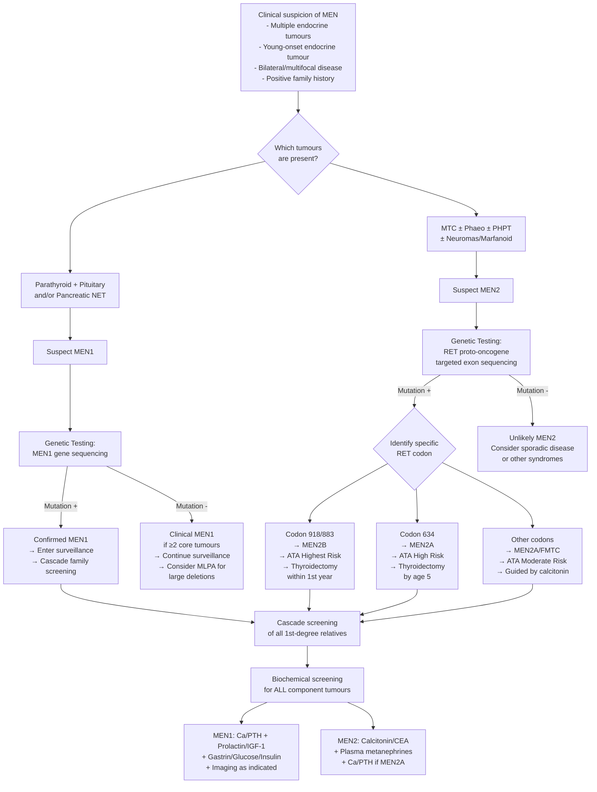

## Diagnostic Criteria, Algorithm, and Investigations for MEN Syndromes

### 10. Diagnostic Criteria

#### 10.1 Overarching Diagnostic Framework

MEN syndromes are diagnosed through a combination of **clinical criteria** and **genetic confirmation**. The logic is straightforward: you either have the right combination of tumours (clinical diagnosis), or you carry the causative mutation (genetic diagnosis). In practice, both are used together.

There are **three routes** to a MEN diagnosis:

1. **Clinical diagnosis (index case)**: a patient who develops ≥2 of the characteristic tumours for that MEN subtype
2. **Familial clinical diagnosis**: a patient with ≥1 characteristic tumour AND a first-degree relative with a confirmed MEN diagnosis
3. **Genetic diagnosis**: identification of a pathogenic germline mutation in *MEN1* or *RET*, regardless of whether tumours have yet manifested (this includes presymptomatic carriers identified through cascade screening)

<Callout title="Why Genetic Diagnosis Matters More Than Clinical Diagnosis">
The clinical criteria are useful for identifying index cases, but **genetic testing is the gold standard** because:
- It confirms the diagnosis definitively
- It enables **presymptomatic identification** of at-risk family members (cascade screening)
- In MEN2, the **specific RET codon** determines the timing of prophylactic thyroidectomy — clinical criteria alone cannot guide this
- ~50% of MEN2B cases are **de novo** (no family history), so clinical suspicion + genetic testing is the only way to catch them
</Callout>

#### 10.2 MEN1 Diagnostic Criteria

***MEN1 is diagnosed when any ONE of the following is met*** [1]:

| Criterion | Definition |
|:----------|:----------|
| **Clinical** | **≥2 of the 3 main MEN1 tumour types** in one individual: (1) Primary hyperparathyroidism, (2) Pituitary adenoma, (3) Enteropancreatic neuroendocrine tumour |
| **Familial** | **≥1 MEN1-associated tumour** + a first-degree relative with clinically or genetically confirmed MEN1 |
| **Genetic** | Identification of a **pathogenic germline *MEN1* mutation**, even in an asymptomatic individual |

**Important nuances:**
- The clinical criteria require the tumours to be *primary* (not secondary or iatrogenic)
- Carcinoid tumours, adrenocortical tumours, angiofibromas, and collagenomas are **supportive** but not part of the core triad for clinical diagnosis
- ***Incidence: 1-18% in parathyroid adenoma, 16-38% in gastrinoma, < 3% in pituitary adenoma*** — so the yield of MEN1 genetic testing varies depending on the presenting tumour [1]

**Who should be tested for MEN1?**
- Any patient with ≥2 of the 3 main MEN1-associated tumours
- Young-onset (< 40y) primary hyperparathyroidism, especially with **multigland disease**
- ***Multiple insulinomas → consider MEN1 syndrome*** (sporadic insulinomas are usually solitary) [4]
- Gastrinoma (***20-30% associated with MEN1***) [1][6]
- Pituitary macroadenoma in young patient, especially if treatment-resistant
- ***Angiofibromas (64%) and collagenomas (62%)*** — cutaneous clues that may predate endocrine tumours [1]
- First-degree relatives of a confirmed MEN1 patient

#### 10.3 MEN2 Diagnostic Criteria

***MEN2 is diagnosed by clinical + genetic criteria*** [1]:

> ***Ix and Mx: clinical + genetic diagnosis (≥1 classical features + FHx or genetics, or ≥2 features of MEN2A alone or majority of features of MEN2B alone)*** [1]

| Criterion | MEN2A | MEN2B |
|:----------|:------|:------|
| **Clinical** | **≥2 of**: MTC, phaeochromocytoma, primary hyperparathyroidism | **Majority of**: MTC, phaeochromocytoma, mucosal neuromas, intestinal ganglioneuromas, Marfanoid habitus |
| **Familial** | **≥1 classical feature** + first-degree relative with confirmed MEN2A or positive RET | **≥1 classical feature** + confirmed RET codon 918/883 mutation |
| **Genetic** | Pathogenic **RET gain-of-function mutation** in MEN2A-associated codons | Pathogenic **RET mutation in codon 918 or 883** |

**Critical rule for MEN2:**
- ***All patients with MTC should be tested for RET mutation*** [2][5] — this is non-negotiable because ~20% of MTC is familial, and missing MEN2 means missing the opportunity for cascade screening and prophylactic thyroidectomy in relatives
- ***Genetic screening: identify mutation → screen 1st degree relatives*** [1]

#### 10.4 ATA Risk Stratification for MEN2 (2015 — Current Standard)

Once a RET mutation is identified, the specific codon determines the **ATA risk category**, which guides surveillance and timing of prophylactic thyroidectomy:

| ATA Risk | RET Codon | MEN Subtype | MTC Risk | Prophylactic Thyroidectomy |
|:---------|:----------|:-----------|:---------|:--------------------------|
| ***Highest*** | ***918 (M918T), 883*** | ***MEN2B*** | Earliest, most aggressive | ***Thyroidectomy during 1st year of life*** [1] |
| ***High*** | ***634 (C634R)*** | ***MEN2A*** | Early childhood | ***Thyroidectomy at or before 5 years, guided by ↑serum calcitonin*** [1] |
| ***Moderate*** | ***609, 611, 618, 620, 630, 804, 891*** | ***MEN2A / FMTC*** | Later, variable | ***Thyroidectomy during childhood or young adulthood, guided by ↑serum calcitonin*** [1] |

---

### 11. Investigations — Systematic Approach

The investigation of MEN syndromes has two phases:

1. **Phase 1 — Confirm the syndrome**: genetic testing + biochemical screening for all component tumours
2. **Phase 2 — Characterise each tumour**: localisation imaging, staging, and assessment for surgical planning

Let me walk through each component systematically.

---

#### 11.1 Genetic Testing (The Cornerstone)

##### A. MEN1 Gene Testing
- **Gene**: *MEN1* at chromosome 11q13, encoding menin
- **Method**: Sanger sequencing or next-generation sequencing (NGS) of the entire coding region + splice sites; multiplex ligation-dependent probe amplification (MLPA) for large deletions
- **Yield**: ~80-90% of clinically defined MEN1 families have an identifiable *MEN1* mutation; ~10-20% are mutation-negative (possible intronic/regulatory mutations or phenocopies)
- **Interpretation**: > 1,500 different mutations described; **no genotype-phenotype correlation** — you cannot predict which tumours will develop or their timing based on the specific mutation
- **Cascade screening**: all first-degree relatives should be offered testing once the familial mutation is identified
  - **Mutation-positive**: enter surveillance programme
  - **Mutation-negative**: can be discharged from surveillance (if the familial mutation is known)

##### B. RET Proto-oncogene Testing
- **Gene**: *RET* at chromosome 10q11.2
- **Method**: targeted sequencing of known hotspot exons (exons 10, 11, 13, 14, 15, 16); if negative and clinical suspicion remains high, full gene sequencing
- **Yield**: > 98% of clinically defined MEN2 families have an identifiable RET mutation
- **Interpretation**: **strong genotype-phenotype correlation** — the specific codon determines MEN2A vs MEN2B, aggressiveness, and management timing (see ATA table above)
- ***Genetic analysis for RET proto-oncogene mutation (Tyr kinase receptor) for MEN2*** [5]
- ***Also screen asymptomatic relatives → prophylactic thyroidectomy (best done < 5-10y)*** [5]

<Callout title="Exam Pearl: MEN1 vs MEN2 Genetic Testing" type="idea">
- **MEN1**: No genotype-phenotype correlation → genetic test confirms the diagnosis but does NOT change management timing
- **MEN2**: Strong genotype-phenotype correlation → the **specific codon** directly determines the ATA risk category and the timing of prophylactic thyroidectomy. This is one of the best examples in medicine of **personalised genomic medicine**.
</Callout>

---

#### 11.2 Biochemical Investigations — By Component Tumour

The principle is: once MEN is suspected or confirmed, **screen for ALL component tumours**, not just the presenting one. An undiagnosed phaeochromocytoma can kill a patient on the operating table; an undiagnosed gastrinoma can cause GI perforation.

##### A. Primary Hyperparathyroidism (MEN1, MEN2A)

| Investigation | Expected Finding | Rationale |
|:-------------|:----------------|:----------|
| ***Serum calcium (adjusted for albumin)*** | ***↑ (hyperCa)*** | PTH-driven bone resorption + renal Ca reabsorption + intestinal absorption |
| ***Serum PTH*** | ***↑ or inappropriately normal*** | Even a "normal" PTH in the presence of hypercalcaemia is inappropriate — it should be suppressed [3][11] |
| Serum phosphate | ↓ (hypophosphataemia) | PTH inhibits renal phosphate reabsorption via NPT2a/c downregulation in PCT |
| Vitamin D (25-OH) | Check to rule out concurrent vitamin D deficiency | Vitamin D deficiency can mask the severity of hypercalcaemia or coexist |
| ***24h urine calcium*** | ***↑ (hypercalciuria)*** — **MUST check** to rule out FHH | FHH has LOW urine Ca (Ca:Cr clearance ratio < 0.01); operating on FHH is futile [3] |
| ALP | ↑ if significant bone disease | ***↑ ALP level predicts risk of hungry bone syndrome post-op*** [3] |
| Renal function (Cr, eGFR) | Assess for renal impairment from nephrocalcinosis | Chronic hypercalcaemia can cause tubulointerstitial nephritis |
| KUB / USG kidney | Nephrolithiasis / nephrocalcinosis | Screen for renal complications of hypercalcaemia |
| DEXA bone scan | Osteoporosis (T-score < -2.5) | Chronic PTH excess → cortical bone loss |

##### B. Medullary Thyroid Carcinoma (MEN2A, MEN2B)

| Investigation | Expected Finding | Rationale |
|:-------------|:----------------|:----------|
| ***Serum calcitonin*** | ***↑*** | ***95% of MTC produces calcitonin*** [2]; calcitonin is the primary tumour marker; levels correlate with tumour burden |
| ***Serum CEA*** | ***↑*** | ***80% of MTC produces CEA*** [2]; rising CEA with stable/falling calcitonin suggests dedifferentiation (worse prognosis) |
| ***USG thyroid*** | Hypoechoic solid nodule(s), often bilateral; ± cervical lymphadenopathy (esp level VI) | ***Dx: USG thyroid, FNAC, serum calcitonin/CEA*** [1]; MEN2-associated MTC is typically bilateral and multifocal |
| ***FNAC (fine needle aspiration cytology)*** | MTC cells with amyloid deposits (Congo red stain); immunohistochemistry positive for calcitonin | Confirms MTC histologically; amyloid is derived from calcitonin polymerisation |
| Stimulated calcitonin test (pentagastrin or calcium stimulation) | Exaggerated calcitonin rise | Can detect C-cell hyperplasia (pre-MTC stage) in RET carriers with normal baseline calcitonin; less commonly used now with genetic testing available |

> ***Calcitonin if Hx or clinical suspicion of familial medullary carcinoma or MEN2*** [8]

**Why calcitonin is such a good tumour marker for MTC:**
- C cells are the ONLY significant source of calcitonin in the body
- Calcitonin has a short half-life (~10 min) so levels respond quickly to changes in tumour burden
- Post-thyroidectomy, calcitonin should become undetectable — persistent or rising levels indicate residual/recurrent disease
- ***Postop: serum calcitonin and CEA 6mo post-op; ↑calcitonin → screen for residual or metastatic disease*** [5]

##### C. Phaeochromocytoma (MEN2A, MEN2B)

This is the investigation that **must be done before any surgery** in MEN2 patients.

| Investigation | Expected Finding | Rationale |
|:-------------|:----------------|:----------|
| ***Plasma free metanephrines (metanephrine + normetanephrine)*** | ***↑↑*** | **Most sensitive screening test** (~99% sensitivity); metanephrines are produced continuously by COMT within the tumour, not just during catecholamine "spells" — this is why they are more sensitive than measuring catecholamines directly |
| ***24h urine fractionated metanephrines*** | ***↑↑*** | ***24h urine metanephrines*** — alternative to plasma; slightly lower sensitivity but higher specificity [3][7] |
| 24h urine catecholamines (adrenaline, noradrenaline, dopamine) | ↑ | Less sensitive than metanephrines; useful as adjunct |
| 24h urine VMA (vanillylmandelic acid) | ↑ | Terminal metabolite of catecholamines; least sensitive — largely replaced by metanephrines |
| Chromogranin A | ↑ | Non-specific neuroendocrine marker; useful for follow-up |

**Why metanephrines are superior to catecholamines:**
- Phaeochromocytomas express COMT (catechol-O-methyltransferase) within the tumour cells
- COMT continuously converts noradrenaline → **normetanephrine** and adrenaline → **metanephrine** *within the tumour itself*, independent of catecholamine secretion into the bloodstream
- Therefore metanephrine levels are **continuously elevated** even between paroxysms, while catecholamine levels may be normal between episodes
- This gives metanephrines their near-perfect sensitivity

***Screening tests for functional adrenal tumours: ONDST + spot ARR + 24h urine metanephrines*** [3]

**Confirmation test (if borderline results):**
- **Clonidine suppression test**: clonidine (α₂ agonist) normally suppresses central sympathetic outflow → ↓plasma normetanephrine. In phaeochromocytoma, tumour catecholamine production is autonomous → **failure to suppress** [3]

##### D. Pituitary Adenoma (MEN1)

| Investigation | Expected Finding | Rationale |
|:-------------|:----------------|:----------|
| ***Prolactin*** | ***↑ if prolactinoma*** | Most common MEN1-associated pituitary tumour; prolactin > 200 μg/L virtually diagnostic of macroprolactinoma (hook effect may cause falsely normal levels in giant prolactinomas — request serial dilution) |
| IGF-1 ± GH after OGTT | ↑ IGF-1, failure of GH suppression after 75g OGTT | Screens for GH-secreting adenoma (acromegaly) |
| 24h UFC or ONDST | ↑ UFC or failure of cortisol suppression | Screens for ACTH-secreting adenoma (Cushing's disease) |
| TFT (TSH, fT4) | ↑ TSH + ↑ fT4 (inappropriate) | Screens for TSH-secreting adenoma (very rare) |
| LH, FSH, oestradiol/testosterone | Variable | Screens for gonadotroph adenoma (usually non-functioning) or hypogonadism from mass effect |
| ***MRI pituitary with gadolinium*** | Macroadenoma (***85% in MEN1*** vs 42% sporadic) [1]; look for suprasellar extension compressing chiasm | MRI is the imaging gold standard for pituitary; CT is inferior for soft tissue detail in the sella |
| Formal visual field testing (Goldmann/Humphrey) | Bitemporal hemianopia if chiasm compression | All patients with macroadenoma or suprasellar extension need visual field assessment |

##### E. Enteropancreatic Neuroendocrine Tumours (MEN1)

| Investigation | Expected Finding | Rationale |
|:-------------|:----------------|:----------|
| ***Fasting serum gastrin*** | ***↑ > 10× ULN + gastric pH < 2 → diagnostic of ZES*** [4][6] | Gastrinoma is the most common functional pNET in MEN1; PPI must be stopped before testing (PPI causes reactive hypergastrinaemia → false positive) |
| ***Secretin stimulation test*** | ***↑ serum gastrin > 200 pg/mL post-secretin*** | ***Normal G cells are inhibited by secretin; gastrinoma cells are paradoxically stimulated*** (aberrant secretin receptors on tumour cells) [4][6] |
| Fasting glucose, insulin, C-peptide | Hypoglycaemia + ↑insulin + ↑C-peptide = insulinoma | ***Exclude MEN1 in insulinoma: CaPO₄, PTH, prolactin, gastrin*** [4] |
| ***Prolonged fasting test (72h fast)*** | Documented hypoglycaemia (BG < 3.0) with inappropriately ↑insulin and ↑C-peptide | Gold standard confirmatory test for insulinoma [4] |
| VIP | ↑ | VIPoma (Verner-Morrison syndrome) |
| Glucagon | ↑ | Glucagonoma |
| ***Chromogranin A (CgA)*** | ↑ | Non-specific but useful neuroendocrine tumour marker for follow-up [6] |
| Pancreatic polypeptide | ↑ | Non-functioning pNETs may secrete PP |

---

#### 11.3 Localisation and Imaging Investigations

Once a biochemical diagnosis is established, imaging serves to **localise the tumour, stage the disease, and plan surgery**.

##### A. Parathyroid Localisation (MEN1, MEN2A)

| Imaging | Technique and Key Findings | Role |
|:--------|:--------------------------|:-----|
| ***USG neck*** | Parathyroid adenomas appear as **hypoechoic** lesions posterior to thyroid; non-invasive, readily available | First-line; but sensitivity limited for ectopic/multigland disease |
| ***⁹⁹ᵐTc-Sestamibi scan*** | ***Sestamibi accumulates in mitochondria; parathyroid adenomas are rich in oxyphilic cells (lots of mitochondria) → slow washout compared to thyroid gland. Protocol: images at 10 min + 2h washout*** [3] | Key localisation study; combined with USG for concordance |
| ***SPECT (Single-photon emission CT)*** | 3D reconstruction with higher resolution than planar sestamibi | Better for detecting ectopic glands (mediastinal, retroesophageal) |
| ***4D CT scan*** | Multiphase CT: arterial enhancement → washout pattern characterises parathyroid adenomas; high spatial resolution | Used when USG + sestamibi discordant or negative; **high radiation dose** [3] |
| ***Selective venous sampling*** | ***Parathyroid angiography with selective venous sampling: invasive, reserved for re-operative cases*** [3] | Last resort for refractory/recurrent disease |

> ***Localisation studies of hyperfunctioning parathyroid: USG + Sestamibi scan*** [3]

**Why sestamibi works — from first principles:** Sestamibi (⁹⁹ᵐTc-MIBI) is a lipophilic cation that enters cells and accumulates in **mitochondria** (driven by the mitochondrial membrane potential). Parathyroid adenomas/hyperplastic glands contain abundant **oxyphilic cells** (oncocytes) which are packed with mitochondria. Therefore sestamibi washes out of normal thyroid tissue quickly but is **retained** in parathyroid tissue. On dual-phase imaging, the persistent "hot spot" at 2 hours is the parathyroid lesion. ***False positive: Hurthle cell adenoma*** (also rich in mitochondria/oxyphilic cells) [3].

**Special consideration in MEN:**
- MEN1 and MEN2A typically have **multigland hyperplasia** (all 4 glands affected), not a single adenoma
- Sestamibi sensitivity is **lower for multigland disease** than for single adenomas (~50-60% vs ~80-90%)
- This is why ***bilateral neck exploration (BCE) is preferred in MEN1/2A***, rather than focused/minimally invasive parathyroidectomy [3]

##### B. Thyroid / MTC Imaging (MEN2)

| Imaging | Key Findings | Role |
|:--------|:------------|:-----|
| ***USG thyroid*** | Hypoechoic solid nodule(s), bilateral/multifocal; microcalcifications; ± suspicious cervical LNs (loss of hilum, round shape, microcalcification, intranodal cystic necrosis) | First-line; guides FNAC; assesses nodal involvement [1][8] |
| ***FNAC with calcitonin washout*** | MTC cells + amyloid on cytology; calcitonin immunocytochemistry positive; calcitonin measured in FNAC washout fluid (very sensitive for confirming MTC in suspicious nodes) | Diagnostic confirmation |
| CT neck/chest/abdomen with contrast | Staging: local invasion, nodal disease, distant metastases (lungs, liver, bone) | Pre-operative staging for known MTC |
| ***68Ga-DOTATATE PET-CT*** | Somatostatin receptor-positive: well-differentiated MTC shows uptake | ***Somatostatin-receptor-based imaging*** for staging and detecting metastases [6] |
| ***18F-DOPA PET-CT*** | High sensitivity for MTC (MTC cells take up and decarboxylate DOPA as part of APUD/neuroendocrine metabolism) | Increasingly used for MTC staging; superior sensitivity to conventional CT for small metastases |

##### C. Phaeochromocytoma / Paraganglioma Imaging (MEN2)

| Imaging | Key Findings | Role |
|:--------|:------------|:-----|
| **CT adrenals (with contrast)** | Phaeochromocytoma: typically > 3cm, heterogeneous, **high attenuation on non-contrast CT ( > 10 HU)** (lipid-poor, unlike benign adenomas which are lipid-rich < 10 HU); may show areas of necrosis/haemorrhage; bilateral in MEN2 | First-line imaging; ***CT/MRI more accurate in primary tumours*** [7] |
| **MRI adrenals** | "Light bulb" sign: markedly hyperintense on T2W (due to high water content from cystic/necrotic areas and rich vascularity); does not lose signal on out-of-phase (no intracellular lipid unlike adenoma) | Preferred in young patients/pregnancy (no radiation); excellent soft tissue characterisation |
| ***¹²³I or ¹³¹I-MIBG scan*** | MIBG (metaiodobenzylguanidine) is a noradrenaline analogue taken up by the noradrenaline transporter (NET) into chromaffin cells; ***85% sensitivity, 95% specificity*** [7] | ***Less sensitive for primary tumours than CT/MRI but more sensitive for extra-adrenal tumours*** and metastatic disease [7] |
| ***68Ga-DOTATATE PET-CT*** | High sensitivity for detecting metastatic/extra-adrenal disease via somatostatin receptor expression | Increasingly first-line for staging; superior to MIBG for SDHB-related tumours |
| ***18F-FDG PET-CT*** | Increased glucose metabolism in malignant/aggressive phaeo | Useful for suspected malignant phaeochromocytoma |
| ***18F-DOPA PET-CT or 18F-FDA PET-CT*** | Catecholamine synthesis pathway tracers | ***PET/CT tracers: 18F-FDA, 18F-DOPA, 11C-epinephrine, 18FDG, 68Ga dotatate*** [7] |

**Why MIBG works — from first principles:** MIBG (meta-iodobenzylguanidine) is structurally similar to noradrenaline. It is taken up by the **noradrenaline transporter (NET / uptake-1)** on the surface of chromaffin cells and stored in catecholamine storage vesicles. Since phaeochromocytomas are derived from chromaffin cells, they avidly take up and retain MIBG, producing a "hot spot" on scintigraphy. Labelling with ¹²³I (for diagnostic imaging) or ¹³¹I (for therapy) enables both diagnosis and targeted radionuclide therapy.

##### D. Pancreatic NET Localisation (MEN1)

| Imaging | Key Findings | Role |
|:--------|:------------|:-----|
| ***Contrast CT/MRI pancreas*** | ***Highly vascular (early arterial enhancement with portal venous washout) with T1W-hypointense and T2W-hyperintense*** [6] | First-line; sensitivity 60–70% for small tumours [4] |
| ***EUS (endoscopic ultrasound)*** | ***Detects lesions as small as 2-3mm in diameter*** [6]; can perform FNA for tissue diagnosis | Highest pre-operative sensitivity for small pancreatic NETs |
| ***68Ga-DOTATATE PET-CT*** | Somatostatin receptor-avid uptake in well-differentiated NETs | ***Somatostatin-receptor-based imaging; less useful for poorly differentiated NETs with low sstr expression*** [6] |
| ***Arterial stimulation with hepatic venous sampling (ASVS)*** | ***Inject 10% Ca gluconate at 4 different arteries (GDA, SMA, splenic a., hepatic a.); sample R hepatic vein for 30s & 60s; 2-fold increase in insulin localises to that arterial territory*** [4] | Reserved for insulinomas not localised by cross-sectional imaging |
| ***Intraoperative ultrasound (IOUS)*** | ***Gold standard for localisation*** [4]; direct visualisation of tumour relationship to pancreatic duct | Essential during surgery to guide extent of resection |

##### E. Pituitary Imaging (MEN1)

| Imaging | Key Findings | Role |
|:--------|:------------|:-----|
| ***MRI pituitary with gadolinium*** | Microadenoma: hypointense focus in pituitary that enhances less than normal pituitary on early post-contrast images; Macroadenoma: > 10mm, may extend suprasellarly into optic chiasm or laterally into cavernous sinus | Gold standard for pituitary imaging; ***85% macroadenoma in MEN1*** [1] |

---

### 12. Surveillance Protocols for Confirmed MEN Carriers

Once a genetic diagnosis is confirmed, lifelong biochemical and imaging surveillance is required. The schedules differ by syndrome.

#### 12.1 MEN1 Surveillance Protocol

| Component | Screening Test | Frequency | Start Age |
|:----------|:--------------|:----------|:----------|
| Hyperparathyroidism | Serum Ca, PTH, albumin | Annually | 8 years |
| Pituitary adenoma | Prolactin, IGF-1 + MRI pituitary | Annually (biochemistry); MRI every 3 years | 5 years |
| Enteropancreatic NET | Fasting gastrin, fasting glucose, insulin, chromogranin A + CT/MRI or EUS | Annually (biochemistry); imaging every 1-3 years | 8 years |
| Carcinoid (thymic/bronchial) | CT chest | Every 1-2 years | 15 years |
| Adrenocortical tumour | CT abdomen (when doing pancreatic imaging) | Every 1-3 years | 10 years |

#### 12.2 MEN2 Surveillance Protocol

***Monitoring and screening*** [1]:

| Component | Screening Test | Frequency | Start Age |
|:----------|:--------------|:----------|:----------|
| ***MTC*** | ***Serum calcitonin*** ± CEA | ***Annually; guides timing of prophylactic thyroidectomy*** | Highest risk (MEN2B): from birth; High risk: from age 3-5; Moderate risk: from age 5 |
| ***Phaeochromocytoma*** | ***Annual screening by plasma/urine metanephrines*** | ***Annually*** | ***From 11y or 16y depending on risk*** [1] |
| ***Hyperparathyroidism*** (MEN2A only) | ***Annual screening by serum Ca ± PTH*** | ***Annually*** | ***From 11y or 16y depending on risk (or NOT needed if MEN2B)*** [1] |

<Callout title="Surveillance Timing by ATA Risk" type="idea">

| ATA Risk | Phaeo Screening Start | PHPT Screening Start | Thyroidectomy |
|:---------|:---------------------|:--------------------|:-------------|
| Highest (codon 918) | 11 years | Not needed (MEN2B) | Within 1st year of life |
| High (codon 634) | 11 years | 11 years | By age 5 |
| Moderate (other codons) | 16 years | 16 years | Guided by calcitonin |

</Callout>

---

### 13. Diagnostic Algorithm — Master Flowchart

---

### 14. Interpretation Pitfalls and Special Considerations

#### 14.1 Key Biochemical Interpretation Points

| Scenario | Pitfall | Solution |
|:---------|:-------|:---------|
| "Normal" PTH with hypercalcaemia | ***Even if PTH is within reference range, a hyperCa of non-parathyroid cause should have appropriately suppressed PTH → workup for 1° hyperparathyroidism should ensue*** [11] | Always interpret PTH in context of calcium level |
| Gastrin elevation on PPI | PPI-induced achlorhydria → reactive hypergastrinaemia (feedback: low acid → ↑gastrin from normal G cells) → false positive | ***PPI should be stopped before evaluation*** for ZES [6] |
| Giant prolactinoma with "normal" prolactin | Hook effect: very high prolactin saturates both capture and detection antibodies → falsely normal result | Request **serial dilution** of the sample |
| Phaeochromocytoma with "normal" catecholamines | Catecholamines are secreted episodically; metanephrines are produced continuously within the tumour | Always use **plasma free metanephrines** or 24h urine fractionated metanephrines, NOT spot catecholamines |
| Sestamibi scan negative in MEN | Multigland hyperplasia has lower sestamibi sensitivity (~50-60%) than single adenoma (~80-90%) | In MEN, favour bilateral neck exploration regardless of imaging; ***false positive: Hurthle cell adenoma*** [3] |

#### 14.2 Order of Investigations in MEN2

This is a critical operational principle:

> **Step 1**: Screen for phaeochromocytoma (plasma metanephrines)
> **Step 2**: If phaeo present → treat phaeo FIRST (alpha blockade → surgery)
> **Step 3**: THEN proceed to thyroidectomy for MTC
> **Step 4**: THEN address hyperparathyroidism if present

**Why this order?** An undiagnosed phaeochromocytoma under general anaesthesia for thyroidectomy can cause a **catecholamine crisis** (massive surge of adrenaline/noradrenaline → hypertensive emergency → arrhythmias → cardiac arrest → death). This is why screening for phaeo is the FIRST investigation in any MEN2 patient being considered for surgery.

<Callout title="Critical Safety Rule" type="error">
***In MEN2, ALWAYS screen for and exclude phaeochromocytoma BEFORE thyroidectomy or any other surgery.*** The sequence is: phaeo screen → phaeo treatment (if present) → thyroidectomy → parathyroid management. Violating this order can be fatal.
</Callout>

---

<Callout title="High Yield Summary">

**Diagnostic Criteria:**
- MEN1: ≥2 of 3 core tumours (PHPT, pituitary, pNET) OR ≥1 tumour + affected 1st-degree relative OR pathogenic MEN1 mutation
- MEN2: ≥2 classical features OR ≥1 feature + FHx/genetics OR RET mutation alone

**Genetic Testing:**
- MEN1: MEN1 gene sequencing (no genotype-phenotype correlation; > 1500 mutations described)
- MEN2: RET proto-oncogene targeted exon sequencing (strong genotype-phenotype correlation; specific codon guides management)
- ALL MTC patients must be tested for RET regardless of family history

**Key Biochemical Investigations:**
- PHPT: hyperCa + ↑/normal PTH + ↑urine Ca (must exclude FHH)
- MTC: serum calcitonin (95%) + CEA (80%)
- Phaeo: plasma free metanephrines (most sensitive) or 24h urine fractionated metanephrines
- pNETs: fasting gastrin (ZES), fasting glucose/insulin/C-peptide (insulinoma), chromogranin A
- Pituitary: prolactin, IGF-1, cortisol, TFT, gonadotropins + MRI pituitary

**Key Imaging:**
- Parathyroid: USG + Sestamibi scan (sestamibi accumulates in mitochondria-rich oxyphilic cells)
- MTC: USG thyroid + FNAC + CT staging
- Phaeo: CT/MRI adrenals (first-line) + MIBG scan (85% sens, 95% spec) or 68Ga-DOTATATE PET-CT
- pNETs: contrast CT/MRI + EUS (detects lesions as small as 2-3mm) + 68Ga-DOTATATE PET-CT

**Critical Operational Rule:** In MEN2, screen for phaeo FIRST → treat phaeo → then thyroidectomy → then parathyroid.

</Callout>

---

<ActiveRecallQuiz
  title="Active Recall - Diagnostic Criteria, Algorithm, and Investigations"
  items={[
    {
      question: "What are the three routes to diagnosing MEN1? State the clinical criterion specifically.",
      markscheme: "1. Clinical: 2 or more of the 3 core tumour types in one individual (PHPT, pituitary adenoma, enteropancreatic NET). 2. Familial: 1 or more MEN1-associated tumour plus a first-degree relative with confirmed MEN1. 3. Genetic: pathogenic germline MEN1 mutation identified, even if asymptomatic."
    },
    {
      question: "Explain the mechanism of the sestamibi scan for parathyroid localisation. Why is it less sensitive in MEN-associated hyperparathyroidism?",
      markscheme: "Sestamibi (99mTc-MIBI) is a lipophilic cation that accumulates in mitochondria. Parathyroid adenomas are rich in oxyphilic cells containing abundant mitochondria, causing slow washout compared to thyroid tissue (imaged at 10 min and 2h). In MEN, the pathology is multigland hyperplasia rather than a single adenoma - hyperplastic glands have fewer oxyphilic cells and less mitochondrial density, reducing sestamibi sensitivity to approximately 50-60% versus 80-90% for single adenomas."
    },
    {
      question: "Why must plasma metanephrines be used rather than plasma catecholamines for screening phaeochromocytoma?",
      markscheme: "Phaeochromocytomas express COMT within tumour cells which continuously converts noradrenaline to normetanephrine and adrenaline to metanephrine regardless of catecholamine secretion episodes. Catecholamines are secreted episodically and may be normal between paroxysms. Metanephrines are therefore continuously elevated giving near 99% sensitivity. Plasma free metanephrines is the most sensitive screening test."
    },
    {
      question: "A patient with confirmed MEN2A requires thyroidectomy for MTC. What investigation must be done first, and what is the consequence of skipping it?",
      markscheme: "Must screen for phaeochromocytoma with plasma free metanephrines or 24h urine fractionated metanephrines BEFORE thyroidectomy. If phaeo is present and undiagnosed, surgical manipulation and anaesthesia can trigger a catecholamine crisis (massive catecholamine surge causing hypertensive emergency, arrhythmias, cardiac arrest, and potentially death). If phaeo is found, it must be treated first with alpha blockade followed by adrenalectomy before proceeding to thyroidectomy."
    },
    {
      question: "State the ATA risk categories for MEN2, the key RET codons for each, and the recommended timing of prophylactic thyroidectomy.",
      markscheme: "Highest risk: codon 918 (M918T) and 883 - MEN2B - thyroidectomy within the first year of life (ideally first 6 months). High risk: codon 634 (C634R) - MEN2A - thyroidectomy at or before age 5 years. Moderate risk: codons 609, 611, 618, 620, 630, 804, 891 - MEN2A or FMTC - thyroidectomy during childhood or young adulthood guided by rising serum calcitonin levels."
    }
  ]}
/>

## References

[1] Senior notes: Ryan Ho Endocrine.pdf (pages 132–133 — MEN1 and MEN2 clinical presentation, surveillance, and diagnostic criteria)
[2] Senior notes: felixlai.md (Diagnosis section — calcitonin, CEA, RET testing for MTC)
[3] Senior notes: maxim.md (Primary hyperparathyroidism — biochemical diagnosis, sestamibi, FHH; Adrenal incidentaloma — screening tests; Phaeochromocytoma — clonidine suppression test; Bilateral neck exploration in MEN)
[4] Senior notes: maxim.md (Insulinoma — MEN1 screening tests, prolonged fasting test, ASVS; Gastrinoma — fasting gastrin, secretin test)
[5] Senior notes: Ryan Ho Endocrine.pdf (page 38 — MTC diagnosis, RET testing, prophylactic thyroidectomy, calcitonin/CEA follow-up)
[6] Senior notes: Ryan Ho Endocrine.pdf (pages 100, 102 — Pancreatic NETs approach, gastrinoma diagnosis, somatostatin receptor imaging, chromogranin A)
[7] Senior notes: Ryan Ho Diagnostic Radiology.pdf (page 72 — Functional imaging for adrenal tumours, MIBG, PET/CT tracers)
[8] Senior notes: Ryan Ho Fundamentals.pdf (page 427 — Thyroid workup, calcitonin for familial MTC/MEN2, USG findings)
[11] Senior notes: Ryan Ho Chemical Path.pdf (page 23 — Hypercalcaemia workup, PTH interpretation, MEN screening)
