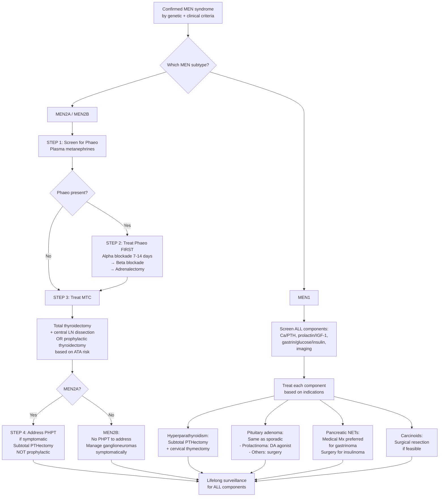

## Management of MEN Syndromes

### 15. Management Principles — The Big Picture

Managing MEN syndromes is fundamentally different from managing sporadic endocrine tumours. Here's why:

1. **Multiple tumours develop sequentially over a lifetime** — you're not curing one disease, you're managing a lifelong genetic predisposition
2. **The order of treatment matters** — treating the wrong tumour first can be fatal (e.g. thyroidectomy before addressing phaeochromocytoma)
3. **Multifocality changes the surgical strategy** — you can't just excise one gland and declare victory; recurrence is the rule, not the exception
4. **Prophylactic surgery is part of the armamentarium** — particularly thyroidectomy in MEN2
5. **Lifelong surveillance is mandatory** — new tumours can develop at any time
6. **Genetic cascade screening** saves lives in the family — identifying at-risk relatives and intervening before tumours develop

The management of each MEN component follows the principle: **screen → biochemically confirm → localise → treat (in the correct order) → lifelong follow-up**.

---

### 16. Master Management Algorithm

The **cardinal rule** in MEN2 is the treatment priority sequence. In MEN1, there is more flexibility, but the general approach is to address the most life-threatening or symptomatic component first.

<Callout title="Treatment Priority in MEN2" type="error">
The sequence is absolute and non-negotiable:
1. **Phaeochromocytoma FIRST** (alpha-blockade → surgery) — because undiagnosed phaeo under GA = catecholamine crisis = death
2. **Medullary thyroid carcinoma SECOND** (total thyroidectomy + central LN dissection)
3. **Hyperparathyroidism THIRD** (only if symptomatic, and only in MEN2A)

Violating this order can be fatal.
</Callout>

---

### 17. Management of Each Component

#### 17.1 Phaeochromocytoma (MEN2A and MEN2B)

##### Why Treat First?

An undiagnosed or untreated phaeochromocytoma during anaesthesia can cause a massive catecholamine surge → **hypertensive crisis** (systolic BP > 250 mmHg), **malignant arrhythmias** (VT, VF), **acute pulmonary oedema**, **intracranial haemorrhage**, or **cardiovascular collapse**. The surgical manipulation itself, intubation, and anaesthetic agents can all trigger catecholamine release. This is why phaeochromocytoma is always addressed before any other surgery.

##### A. Pre-operative Medical Preparation

***Medical therapy: pre-operative prevention of crisis by combined α/β-blockade*** [1]

| Step | Drug | Mechanism | Duration | Key Points |
|:-----|:-----|:----------|:---------|:-----------|
| ***Step 1: α-blockade*** | ***Phenoxybenzamine*** (irreversible, non-selective α-blocker) | Blocks α₁ receptors on vascular smooth muscle → ↓peripheral vascular resistance → ↓BP; also blocks α₂ presynaptic receptors → ↑NA release (reflex tachycardia) | ***At least 7-14 days before surgery*** [1] | ***Adequate α-blockade indicated by postural BP drop*** [1]; start 10mg BD, titrate up; target seated BP < 130/80 with no orthostatic hypotension below 80/45 |
| ***Step 2: β-blockade*** | ***Propranolol*** (or atenolol, metoprolol) | Blocks β₁ → ↓HR, ↓contractility; controls reflex tachycardia from α-blockade | Added 2-3 days AFTER adequate α-blockade | ***β-blockade alone will cause unopposed α-adrenergic activity → exacerbate HTN*** [1]; ALWAYS α before β |
| Step 3: Volume expansion | High-sodium diet ( > 5g/day) + liberal fluids | ***↑Na diet and fluid intake to reverse catecholamine-induced intravascular volume contraction (to prevent postop hypotension)*** [1] | Throughout pre-op period | Chronic catecholamine excess causes vasoconstriction → ↓intravascular volume; once tumour is removed, sudden loss of catecholamine drive → vasodilation → hypotension unless volume is pre-expanded |

**Alternative α-blockers:**
- **Doxazosin** (selective α₁-blocker): fewer side effects than phenoxybenzamine, easier to titrate, but reversible (shorter duration of action)
- ***Dipine CCBs*** (e.g. nifedipine, amlodipine): useful adjunct; direct vasodilator, no postural hypotension [1]
- ***Metyrosine*** (α-methylparatyrosine): ***inhibits catecholamine synthesis*** at the tyrosine hydroxylase step; used in combination with α-blockade for difficult-to-control cases [1]

<Callout title="Why Alpha Before Beta — From First Principles" type="error">
If you give a β-blocker alone to a patient with phaeochromocytoma:
- β₂ receptors on skeletal muscle arterioles normally cause vasodilation (when stimulated by adrenaline)
- Blocking β₂ removes this vasodilatory counterbalance
- α₁ receptors on vascular smooth muscle remain fully active and unopposed
- Result: **unopposed α₁-mediated vasoconstriction → catastrophic hypertensive crisis**

This is why ***ALWAYS initiate α-blockade before β-blockade*** [1].
</Callout>

##### B. Surgical Treatment

***Mx: similar to sporadic cases with alpha blockade followed by adrenalectomy (unilateral suffice)*** [1]

| Aspect | Details |
|:-------|:-------|
| **Approach** | ***Laparoscopic, robotic with retroperitoneal or transabdominal approach*** [1]; laparoscopic preferred for tumours < 6cm [3] |
| **Extent** | **Unilateral adrenalectomy** for unilateral phaeo; **bilateral adrenalectomy** if bilateral (common in MEN2, 30-100%) |
| **Cortical-sparing adrenalectomy** | Increasingly favoured in MEN2 when bilateral phaeo → preserves adrenal cortex to avoid lifelong steroid replacement; removes medulla (where the phaeo arises) while leaving cortical rim; risk of recurrence (~10-15%) but avoids Addisonian crisis |
| **Open adrenalectomy** | Reserved for tumours > 6cm or suspected malignancy [3] |

**Why cortical-sparing matters in MEN2:**
- In MEN2, phaeo is bilateral in 30-100% of cases → bilateral total adrenalectomy would leave the patient with **permanent adrenal insufficiency** (requiring lifelong glucocorticoid AND mineralocorticoid replacement)
- **Addisonian crisis** (acute adrenal insufficiency: hypotension, hypoglycaemia, hyperkalaemia, shock) can be life-threatening if the patient forgets to take steroids or becomes unwell
- Cortical-sparing surgery preserves enough cortex to maintain basal steroid production, avoiding this lifelong dependency

##### C. Post-operative Monitoring

***Postop complications: HTN crisis, hypotension, rebound hypoglycaemia → monitor BP, HR, H'stix closely postop*** [1]

| Complication | Mechanism | Management |
|:-------------|:----------|:-----------|
| **Hypotension** | Sudden loss of catecholamine drive → vasodilation + depleted intravascular volume | IV fluid resuscitation; pre-op volume expansion minimises this |
| **Rebound hypoglycaemia** | Catecholamines normally suppress insulin and promote glycogenolysis; sudden loss of catecholamines → unopposed insulin action | Monitor H'stix Q1-2h for 24h post-op; IV dextrose if needed |
| **Persistent HTN** | Incomplete resection, metastatic disease, or volume overload | Re-evaluate with biochemistry and imaging |
| **Adrenal insufficiency** (if bilateral total adrenalectomy) | Loss of cortisol and aldosterone production | Lifelong hydrocortisone + fludrocortisone replacement |

##### D. Management of Phaeochromocytoma Crisis

***Management of phaeochromocytoma crisis: classified as hypertensive urgency*** [1]
- **ICU monitoring**
- **IV phentolamine** (short-acting α-blocker): bolus 2-5mg IV, repeat as needed; or IV infusion
- **Nitroprusside** infusion: if phentolamine insufficient
- **β-blocker** (e.g. esmolol IV): ONLY after adequate α-blockade
- **Magnesium sulphate** IV: direct vasodilator + antiarrhythmic
- Emergency surgery if refractory

---

#### 17.2 Medullary Thyroid Carcinoma (MEN2A and MEN2B)

##### A. Prophylactic Thyroidectomy

This is one of the most important and unique aspects of MEN2 management. Because ***virtually all MEN2 patients develop clinically apparent MTC*** [2], prophylactic removal of the thyroid before MTC develops (or while it's still at the C-cell hyperplasia stage) is potentially curative.

***Monitor calcitonin with prophylactic thyroidectomy depending on risk of mutation and calcitonin level*** [1]:

| ***ATA Risk*** | ***Timing*** | ***Rationale*** |
|:------------|:----------|:------------|
| ***Highest (MEN2B: codon 918/883)*** | ***Thyroidectomy during 1st year of life*** [1] | MTC can develop in infancy; delay means metastatic disease |
| ***High (MEN2A: codon 634)*** | ***Thyroidectomy at or before 5 years, guided by ↑serum calcitonin*** [1] | MTC typically develops in childhood; early thyroidectomy prevents clinically significant disease |
| ***Moderate (other codons)*** | ***Thyroidectomy during childhood or young adulthood, guided by ↑serum calcitonin*** [1] | MTC onset is later and more variable; annual calcitonin monitoring can guide timing; some advocate delaying until calcitonin rises above baseline |

##### B. Therapeutic Thyroidectomy (Established MTC)

***Mx: total thyroidectomy + central LN dissection*** [1]

| Procedure | Details | Rationale |
|:----------|:--------|:----------|
| **Total thyroidectomy** | Removal of entire thyroid gland including both lobes and isthmus | MTC in MEN2 is **bilateral and multifocal** — hemithyroidectomy is insufficient [1][5] |
| ***Central lymph node dissection (level VI)*** | ***Routine central ± neck dissection (depending on calcitonin level and imaging evidence of nodal mets)*** [5] | MTC metastasises early via lymphatics; level VI (central compartment) is the first echelon of nodal spread |
| **Lateral neck dissection** | Selective lateral neck dissection (levels II-V) if imaging or calcitonin suggests lateral nodal disease | Calcitonin > 200 pg/mL or positive lateral nodes on imaging |

##### C. Post-operative Management

***Postop: no need suppressive doses of T4 (not TSH-responsive), serum calcitonin/CEA screening*** [1]

| Aspect | Details | Rationale |
|:-------|:--------|:----------|
| **Thyroid hormone replacement** | Levothyroxine to maintain **euthyroid** (normal TSH) | Unlike differentiated thyroid cancer (papillary/follicular), MTC arises from C cells which do NOT express TSH receptors → TSH suppression is pointless and harmful (causes iatrogenic thyrotoxicosis) [5] |
| ***Calcitonin and CEA monitoring*** | ***Serum calcitonin and CEA 6mo post-op*** [5]; then 6-12 monthly | Calcitonin is the most sensitive marker for residual/recurrent MTC; ***↑calcitonin → screen for residual or metastatic disease → surgical Tx ± chemo/RT*** [5] |
| **Interpretation of post-op calcitonin** | Undetectable = biochemical cure; detectable but stable = watch; rising = recurrence/metastasis | Calcitonin doubling time < 6 months = aggressive; > 2 years = indolent |
| **Imaging for recurrence** | USG neck, CT neck/chest/abdomen, ***68Ga-DOTATATE PET-CT*** or ***18F-DOPA PET-CT*** | If calcitonin rising, localise the recurrence for possible surgical salvage |

##### D. Adjuvant / Palliative Treatment for Advanced MTC

***No good adjuvant Tx*** for MTC [5] — it does not respond to radioactive iodine (MTC cells don't express NIS/thyroglobulin), and conventional chemotherapy has limited efficacy. However:

| Treatment | Indication | Mechanism |
|:----------|:----------|:----------|
| **Vandetanib** | Locally advanced or metastatic MTC | Multi-kinase inhibitor targeting RET, VEGFR, EGFR → "vandetanib" = "VAN-det-a-nib" — inhibits the very RET kinase that drives MEN2 |
| **Cabozantinib** | Progressive metastatic MTC | Multi-kinase inhibitor targeting RET, MET, VEGFR2 |
| **Selpercatinib / Pralsetinib** | RET-mutant advanced MTC (2020+ approvals) | **Highly selective RET inhibitors** — represent a breakthrough in MEN2-associated MTC; directly target the constitutively active RET kinase; better response rates and tolerability than non-selective TKIs |
| External beam radiotherapy | Locally advanced, unresectable disease; palliative | Limited role; MTC is relatively radioresistant |
| Systemic chemotherapy | Refractory disease | Dacarbazine-based regimens; poor response rates |

<Callout title="Selpercatinib — The RET Revolution" type="idea">
**Selpercatinib** (LOXO-292, brand name Retevmo) is a **highly selective RET kinase inhibitor** approved in 2020 for RET-mutant MTC. This is a perfect example of precision medicine — the drug directly targets the exact molecular defect (constitutively active RET) that causes MEN2. In the LIBRETTO-001 trial, selpercatinib achieved an overall response rate of ~73% in treatment-naïve RET-mutant MTC. This is now considered first-line for advanced/metastatic RET-mutant MTC.
</Callout>

---

#### 17.3 Primary Hyperparathyroidism

The surgical approach to hyperparathyroidism in MEN differs fundamentally from sporadic disease because the pathology is **multigland hyperplasia** (all 4 glands affected) rather than a single adenoma.

##### A. MEN1 Hyperparathyroidism

***Management: indication of surgery same as sporadic; favours subtotal PTHectomy (3.5 glands) + cervical thymectomy (↓thymic carcinoid)*** [1]

**Indications for surgery** (same as sporadic PHPT) [1][3][12]:
- ***ALL symptomatic patients*** (renal stones, bone disease, neuromuscular symptoms) [12]
- Asymptomatic patients meeting criteria (***mnemonic: CASR***) [3]:
  - ***Ca: adjusted Ca ≥ 2.8 mmol/L*** (i.e. > 0.25 mmol/L above ULN)
  - ***Age < 50***
  - ***Skeletal: DEXA T-score < -2.5 or vertebral fracture***
  - ***Renal: CrCl < 60 mL/min, or 24h urine Ca > 10 mmol/L, or nephrolithiasis/nephrocalcinosis on imaging***

**Surgical approach — why NOT focused parathyroidectomy in MEN:**

| Approach | When to Use | Technique |
|:---------|:-----------|:----------|
| ***Focused parathyroidectomy*** | ***Indication: adenoma identified on pre-op localization*** [3] — this is for **SPORADIC** PHPT (single adenoma premise, 80% of cases) | Small incision, pre-op localisation, intra-op PTH assay (***Miami criteria: PTH drop to normal range + < 50% of max value at 10min post-resection***) [3] |
| ***Bilateral neck exploration (BCE)*** | ***Indications: MEN1/2A, uncertain imaging, conversion from focused parathyroidectomy*** [3] | Kocher's incision |

In MEN, focused parathyroidectomy is **inappropriate** because:
- The disease is **multigland hyperplasia** — removing one gland leaves 3 hyperplastic glands behind → guaranteed recurrence
- Sestamibi is less sensitive for multigland disease → may miss affected glands

**MEN1 surgical options:**

| Procedure | Technique | Pros | Cons |
|:----------|:----------|:-----|:-----|
| ***Subtotal parathyroidectomy ("3.5 glands")*** | ***3 glands resected; fourth gland: ½ gland taken out for frozen section (to confirm parathyroid tissue), remaining ½ gland left in situ, marked with non-absorbable sutures*** [3] | Avoids permanent hypoparathyroidism; marked remnant aids re-operation if recurrence | ***High recurrence rate ( > 50% in 12 years if subtotal)*** [1] |
| **Total parathyroidectomy with autotransplantation** | All 4 glands removed; small fragments autotransplanted to forearm (brachioradialis) or neck (SCM) | Easier to access transplanted tissue if recurrence; lower recurrence rate | Risk of permanent hypoparathyroidism if graft fails; requires cryopreservation of tissue as backup |
| ***± Cervical thymectomy*** | ***Indicated if MEN1 to resect supernumerary glands in thymus*** [3] and ***↓thymic carcinoid*** [1] | Removes ectopic/supernumerary parathyroid tissue; reduces risk of thymic carcinoid (a known MEN1 complication) | Additional surgical morbidity |

**Why "3.5 glands" in MEN?**
The reasoning is pragmatic: you want to remove as much hyperplastic tissue as possible to control hypercalcaemia, while leaving enough parathyroid tissue to prevent **permanent hypoparathyroidism** (which requires lifelong calcium + vitamin D supplementation and carries risks of hypocalcaemic seizures, arrhythmias, and cataracts). The ***frozen section*** of the excised half-gland confirms you are indeed leaving parathyroid tissue behind (not a lymph node or fat) [3].

**Post-operative complications specific to parathyroidectomy in MEN** [3]:

| Complication | Mechanism | Management |
|:-------------|:----------|:-----------|
| ***Hungry bone syndrome*** | ***Rapid, profound hypocalcaemia due to sudden drop in PTH → rapid deposition of Ca into demineralised bone*** [3] | ***Predicted by ↑ALP pre-op*** [3]; IV calcium gluconate + high-dose oral calcium + calcitriol |
| **Transient hypocalcaemia** | Suppressed remaining gland(s) or remnant takes time to recover | Calcium and vitamin D supplementation; usually resolves in days-weeks |
| ***Permanent hypoparathyroidism*** | Insufficient remnant tissue or devascularised remnant; ***requiring Ca/vit D supplement 1 year post-op*** [3] | Lifelong calcium + calcitriol replacement |
| **Recurrence** | New hyperplasia in remnant or autograft; ***> 50% in 12 years*** [1] | Re-operation guided by sestamibi/4D-CT localisation |
| **RLN injury** | Intraoperative damage to recurrent laryngeal nerve | ***Bilateral RLN injury can be life-threatening*** [12] → stridor, need for tracheostomy |

##### B. MEN2A Hyperparathyroidism

***Mx: similar to MEN1, NOT for prophylactic parathyroidectomy during thyroidectomy (usually asymptomatic)*** [1]

Key differences from MEN1:
- Usually **mild and asymptomatic** → most patients do NOT require surgery
- If symptomatic or meeting surgical criteria, same approach as MEN1 (subtotal parathyroidectomy)
- During thyroidectomy for MTC, the surgeon should **inspect but NOT routinely remove** normal-appearing parathyroid glands — removing asymptomatic normal glands causes unnecessary hypoparathyroidism
- If inadvertently devascularised during thyroidectomy → **autotransplant** into the forearm or SCM

---

#### 17.4 Pituitary Adenomas (MEN1)

***Management: same as sporadic adenomas*** [1]

| Tumour Type | First-Line Treatment | Second-Line | Rationale |
|:-----------|:-------------------|:-----------|:----------|
| **Prolactinoma** | ***Dopamine agonist*** (cabergoline > bromocriptine) | Transsphenoidal surgery if DA-resistant or intolerant | Prolactinomas express D₂ receptors; DA agonists shrink tumour + normalise prolactin in ~80-90%; surgery rarely needed |
| **GH-secreting (acromegaly)** | **Transsphenoidal surgery** | Somatostatin analogues (octreotide, lanreotide), pegvisomant, RT | Surgery is first-line because DA agonists are much less effective for GH tumours |
| **ACTH-secreting (Cushing's)** | **Transsphenoidal surgery** | Medical (metyrapone, ketoconazole, pasireotide), bilateral adrenalectomy, pituitary RT | Surgery aims for biochemical cure (undetectable post-op cortisol) |
| **Non-functioning** | **Transsphenoidal surgery** (if mass effect) | Surveillance if small and no mass effect | No hormonal target for medical therapy |

**Special considerations in MEN1:**
- ***85% are macroadenomas*** (larger at diagnosis than sporadic) [1] → more likely to cause mass effect and be treatment-resistant
- **Recurrence is more common** → need closer MRI follow-up (every 1-3 years lifelong)
- ***Lactotroph (prolactin-secreting) tumours are most common (20%)*** [1] — but you MUST screen for co-secretion (GH + prolactin is possible in mammosomatotroph adenomas)

---

#### 17.5 Enteropancreatic Neuroendocrine Tumours (MEN1)

The management of pNETs in MEN1 is fundamentally different from sporadic pNETs because of **multifocality** — there are often dozens of small tumours throughout the pancreas and duodenum. This means surgical cure is very difficult, and the approach must balance tumour control against the morbidity of extensive pancreatic surgery.

##### A. Gastrinoma / Zollinger-Ellison Syndrome (Most Common Functional pNET in MEN1)

***Mx: generally prefer medical treatment by high-dose PPI due to multifocality → low cure rate by OT*** [1]

| Treatment | Indication | Details |
|:----------|:----------|:-------|
| ***High-dose PPI*** | ***All MEN1-associated gastrinoma*** [1][4][6] | Controls acid hypersecretion and heals ulcers; e.g. omeprazole 40-60mg BD; does NOT address the tumour itself but prevents the clinical consequences |
| **Surgical resection** | ***Sporadic gastrinoma (non-metastatic)*** [4]; in MEN1, surgery is considered only if a dominant/large tumour ( > 2cm) is identified | ***Pancreatic gastrinomas: enucleation + peripancreatic LN dissection; Duodenal gastrinomas: enucleation if small, full-thickness excision if large*** [4] |
| **Octreotide** (somatostatin analogue) | Adjunct; metastatic disease | Binds somatostatin receptors on tumour cells → ↓gastrin secretion; also antiproliferative |
| **Systemic chemotherapy** | Metastatic disease | Streptozocin/5-FU, temozolomide/capecitabine, everolimus, sunitinib |
| ***Liver-directed therapy*** | Hepatic metastases | ***Hepatic resection (curative), hepatic artery embolisation (palliative)*** [6] |

**Why medical over surgical for MEN1-associated gastrinoma?**
- MEN1 gastrinomas are **multifocal** (dozens of microadenomas in the duodenal wall and pancreas) [1][6]
- ***50-88% sporadic and 70-100% MEN1-associated gastrinomas are in the duodenum*** [6] — scattered along the wall
- Surgical cure rate is very low (~0-10%) because you simply cannot remove them all without destroying the entire duodenum and pancreas
- PPI effectively controls the clinical consequences (ulcers, diarrhoea) even though the tumour persists
- Surgery is reserved for large ( > 2cm), dominant tumours to prevent or treat metastatic spread

##### B. Insulinoma

***Surgical treatment: advised for ALL patients*** [4]

Unlike gastrinoma, insulinoma in MEN1 is usually a **dominant single tumour** (even if multiple are present) causing the hypoglycaemia, and surgical cure is achievable.

| Treatment | Details |
|:----------|:-------|
| **Medical (bridging)** | ***Diazoxide: ↓insulin release*** (opens K-ATP channels on β-cells → inhibits insulin secretion); S/E: oedema, hirsutism [4]. ***Octreotide*** (2nd line): inhibits insulin secretion via sst₂/sst₅ receptors [4] |
| **Surgery** | ***Open surgery with extended Kocher manoeuvre and mobilisation of entire pancreas → IOUS to locate tumour and identify relation to duct → determine surgical extent*** [4] |
| **Enucleation** | ***For superficial tumours*** not involving the pancreatic duct [4] |
| **Distal pancreatectomy** | ***For tumours deep in body/tail of pancreas or ductal involvement*** [4] |
| **Whipple's operation** | ***For tumours deep in head/neck of pancreas*** [4] |
| **Alternative** | ***EUS-guided alcohol ablation*** [4] |
| **Inoperable/metastatic** | ***Chemotherapy: doxorubicin, everolimus*** [4]; PRRT (¹⁷⁷Lu-DOTATATE) |

##### C. Non-Functioning pNETs

***Management: in general resect if > 1-2cm or functional, otherwise observe*** [6]

- In MEN1, many non-functioning pNETs are < 1cm and indolent → surveillance with annual imaging
- Surgery (distal pancreatectomy or enucleation) is considered for tumours > 2cm or with evidence of growth (risk of lymph node metastasis increases significantly above 2cm)
- Debulking surgery for metastatic disease to improve quality of life and enable medical therapy

##### D. Other Functional pNETs (VIPoma, Glucagonoma, Somatostatinoma)

- These are rare even in MEN1
- Principles: **symptom control** (octreotide) + **surgical resection** if resectable
- Metastatic: targeted therapy (everolimus, sunitinib), PRRT (¹⁷⁷Lu-DOTATATE), chemotherapy

---

#### 17.6 Carcinoid Tumours (MEN1)

| Type | Clinical Significance | Management |
|:-----|:---------------------|:-----------|
| **Thymic carcinoid** | ***Aggressive***; predominantly in **male smokers**; poor prognosis even after resection | Surgical resection if feasible; ***cervical thymectomy during parathyroidectomy*** is recommended in MEN1 to reduce risk [1][3] |
| **Bronchial carcinoid** | Usually indolent; rarely causes carcinoid syndrome | Surgical resection if symptomatic or growing; surveillance for small, stable lesions |
| **Gastric carcinoid (Type 2)** | Associated with hypergastrinaemia (from gastrinoma-driven chronic acid suppression or direct gastrin-trophic effect on ECL cells) | Endoscopic resection for small ( < 2cm), localised lesions; surgery for larger/invasive tumours |

---

#### 17.7 Management Summary Table — All Components

| Component | MEN1 Mx | MEN2A Mx | MEN2B Mx |
|:----------|:--------|:---------|:---------|
| **PHPT** | Subtotal PTHectomy (3.5 glands) + cervical thymectomy; indication same as sporadic | If symptomatic: same as MEN1; ***NOT prophylactic PTHectomy during thyroidectomy*** [1] | Not applicable (no PHPT in MEN2B) |
| **Pituitary** | Same as sporadic (DA agonist for prolactinoma, TSS for others) | Not applicable | Not applicable |
| **Pancreatic NETs** | Gastrinoma: high-dose PPI (medical preferred); Insulinoma: surgery | Not applicable | Not applicable |
| **MTC** | Not applicable | ***Total thyroidectomy + central LN dissection*** [1]; prophylactic by ATA risk | ***Thyroidectomy within 1st year of life*** [1]; total thyroidectomy + central LN dissection if established MTC |
| **Phaeo** | Not applicable | ***Alpha blockade → beta blockade → adrenalectomy*** [1]; cortical-sparing if bilateral | Same as MEN2A |
| **Mucosal neuromas** | Not applicable | Not applicable | Symptomatic management only; not resectable |
| **Ganglioneuromas** | Not applicable | Not applicable | Symptomatic (laxatives for constipation); surgery for obstruction/megacolon |

---

### 18. Genetic Counselling and Cascade Screening

This is not a separate "treatment" but is an integral part of MEN management.

***Genetic screening: identify mutation → screen 1st degree relatives*** [1]

| Aspect | Details |
|:-------|:-------|
| **Who to test** | ALL first-degree relatives (parents, siblings, children) of a confirmed MEN mutation carrier |
| **When to test** | As early as possible; in MEN2B, within the first weeks of life (to enable prophylactic thyroidectomy in the first year); in MEN2A, by age 3-5; in MEN1, by age 5-10 |
| **How** | Targeted sequencing of the known familial mutation (much simpler than full gene sequencing) |
| **If positive** | Enter lifelong surveillance programme + consider prophylactic surgery (MEN2) |
| **If negative** | Can be discharged from surveillance (if the familial mutation is known and confirmed absent) — this provides enormous psychological relief |
| **Counselling** | Pre-test and post-test genetic counselling is mandatory; discuss implications for reproductive planning, insurance, psychological impact; 50% chance of transmission to each offspring |

---

### 19. Contraindications and Special Situations

#### 19.1 Contraindications to Surgery

| Situation | Explanation |
|:----------|:-----------|
| ***Familial hypocalciuric hypercalcaemia (FHH)*** | ***Surgical intervention does not result in cure*** [12] — the CaSR mutation means hypercalcaemia persists regardless of how many glands you remove; must exclude before parathyroidectomy |
| ***Known bilateral RLN injury*** | ***Can be life-threatening*** [12] — bilateral vocal cord paralysis → airway obstruction; relative contraindication to further neck surgery |
| **Undiagnosed phaeochromocytoma** | Absolute contraindication to ANY elective surgery (thyroidectomy, parathyroidectomy, pancreatic surgery) in MEN2 until phaeo is excluded or treated |
| **Pregnancy** | Phaeochromocytoma surgery ideally deferred to 2nd trimester if possible; laparoscopic approach preferred; phenoxybenzamine crosses placenta but is used if needed; MRI preferred over CT for localisation |
| **Unfit for surgery** | ***Calcimimetics (e.g. cinacalcet): indicated when parathyroidectomy indicated but C/I surgery*** [1]; for phaeo: chronic alpha-blockade for medical management |
| **Metastatic/inoperable pNETs** | ***Medical treatment: buy time for surgery / unfit for surgery / metastatic disease*** [4] |

#### 19.2 Post-operative Surveillance — Lifelong

| Component | Follow-up Protocol |
|:----------|:------------------|
| Post-thyroidectomy (MTC) | ***T4 replacement to keep euthyroid; serum calcitonin and CEA 6mo post-op then 6-12 monthly*** [5]; USG neck annually; CT/PET if calcitonin rising |
| Post-adrenalectomy (phaeo) | Annual plasma metanephrines (risk of contralateral phaeo developing later); if bilateral total → lifelong steroid replacement + Addisonian crisis education |
| Post-parathyroidectomy | Serum Ca, PTH annually; DEXA every 1-2 years; renal imaging if symptoms |
| Pituitary | MRI pituitary every 1-3 years; hormonal panel annually |
| Pancreatic NETs | Imaging (CT/MRI or EUS) every 1-3 years; tumour markers annually |

---

<Callout title="High Yield Summary">

**MEN2 Treatment Priority:** Phaeo → MTC → PHPT (this order is non-negotiable)

**Phaeochromocytoma:**
- Pre-op: α-blockade (phenoxybenzamine) for 7-14 days → THEN β-blockade → volume expansion
- NEVER β before α (causes unopposed α → hypertensive crisis)
- Surgery: laparoscopic adrenalectomy; cortical-sparing preferred for bilateral MEN2 phaeo
- Post-op: watch for hypotension and rebound hypoglycaemia

**MTC:**
- Prophylactic thyroidectomy: Highest risk (MEN2B) = 1st year of life; High risk (codon 634) = by age 5; Moderate risk = guided by calcitonin
- Therapeutic: total thyroidectomy + central LN dissection
- Post-op: levothyroxine for euthyroid (NOT TSH suppression); calcitonin/CEA monitoring
- Advanced MTC: selpercatinib/pralsetinib (selective RET inhibitors) — a breakthrough in precision medicine

**Hyperparathyroidism in MEN:**
- MEN1: subtotal parathyroidectomy (3.5 glands) + cervical thymectomy; high recurrence (> 50% in 12y)
- MEN2A: only if symptomatic; NOT prophylactic; same surgical approach if needed
- Indications same as sporadic (CASR mnemonic): Ca ≥ 2.8, Age < 50, Skeletal T < -2.5, Renal CrCl < 60

**MEN1 pNETs:**
- Gastrinoma: medical (high-dose PPI) preferred over surgery due to multifocality
- Insulinoma: surgery for ALL patients
- Non-functioning: observe if < 2cm, resect if > 2cm or growing

**Genetic cascade screening:** Test all 1st-degree relatives; enables prophylactic thyroidectomy in MEN2 and early surveillance in MEN1.

</Callout>

---

<ActiveRecallQuiz
  title="Active Recall - Management of MEN Syndromes"
  items={[
    {
      question: "A patient with MEN2A has both a phaeochromocytoma and medullary thyroid carcinoma. Describe the correct treatment sequence and explain why.",
      markscheme: "Step 1: Treat phaeochromocytoma FIRST with alpha-blockade (phenoxybenzamine for at least 7-14 days) then beta-blockade then adrenalectomy. Step 2: THEN total thyroidectomy plus central lymph node dissection for MTC. Reason: operating on MTC with an undiagnosed or untreated phaeochromocytoma risks catecholamine crisis under anaesthesia (hypertensive emergency, arrhythmias, cardiac arrest, death). Step 3: Address hyperparathyroidism if symptomatic."
    },
    {
      question: "Why is focused parathyroidectomy inappropriate for MEN1-associated hyperparathyroidism? What surgical approach should be used instead?",
      markscheme: "Focused parathyroidectomy targets a single adenoma (appropriate for sporadic PHPT where 80% have single adenoma). MEN1 causes multigland hyperplasia affecting all 4 glands. Removing one leaves 3 hyperplastic glands causing persistent disease. Also, sestamibi sensitivity is lower for multigland disease. Instead: bilateral neck exploration with subtotal parathyroidectomy (3.5 glands: 3 glands removed, half of fourth removed for frozen section, remaining half left in situ marked with sutures) plus cervical thymectomy to remove supernumerary glands and reduce thymic carcinoid risk."
    },
    {
      question: "Why is high-dose PPI preferred over surgery for MEN1-associated gastrinoma, and when would you consider surgery?",
      markscheme: "MEN1-associated gastrinomas are multifocal (dozens of microadenomas scattered throughout duodenum and pancreas), so surgical cure rate is very low (0-10%). PPI effectively controls the clinical consequences (acid hypersecretion, peptic ulcers, diarrhoea) even though the tumour persists. Surgery is considered only if there is a dominant large tumour greater than 2cm (risk of metastasis) or for sporadic (non-MEN1) gastrinoma where surgical cure is achievable."
    },
    {
      question: "Why must alpha-blockade always precede beta-blockade in phaeochromocytoma management? What happens if you give a beta-blocker first?",
      markscheme: "Beta-blocker alone blocks beta-2 mediated vasodilation in skeletal muscle arterioles, removing the counterbalance to alpha-1 mediated vasoconstriction. Result: unopposed alpha-1 vasoconstriction causes catastrophic hypertensive crisis. Alpha-blockade must be given first for at least 7-14 days. Adequate alpha-blockade is indicated by a postural BP drop. Only then add beta-blockade to control reflex tachycardia."
    },
    {
      question: "A newborn is found to have RET codon 918 mutation on genetic screening. What is the recommended management, and what key post-operative consideration is different from differentiated thyroid cancer?",
      markscheme: "Prophylactic total thyroidectomy within the first year of life (ideally within first 6 months) as this is ATA highest risk for MEN2B. Must screen for phaeochromocytoma before surgery (though rare at this age). Post-operatively: levothyroxine replacement to maintain euthyroid state (normal TSH). Unlike differentiated thyroid cancer (papillary/follicular), TSH suppression is NOT indicated because MTC arises from C cells which do not express TSH receptors. Monitor serum calcitonin and CEA."
    },
    {
      question: "What is hungry bone syndrome, when does it occur, and how is it predicted and managed?",
      markscheme: "Hungry bone syndrome is rapid, profound hypocalcaemia occurring after parathyroidectomy due to sudden drop in PTH causing rapid deposition of calcium into previously demineralised bone (the 'hungry' bone avidly takes up calcium). Predicted by elevated pre-operative ALP (indicates high bone turnover and significant bone disease). Managed with IV calcium gluconate acutely plus high-dose oral calcium and calcitriol (active vitamin D)."
    }
  ]}
/>

## References

[1] Senior notes: Ryan Ho Endocrine.pdf (pages 67, 132–133 — MEN1 and MEN2 management, phaeochromocytoma medical/surgical therapy, pituitary management)
[2] Senior notes: felixlai.md (Etiology section — prophylactic thyroidectomy for MEN2)
[3] Senior notes: maxim.md (Primary hyperparathyroidism — surgical indications CASR, focused PTHectomy vs BCE, subtotal PTHectomy technique, cervical thymectomy, complications, adrenalectomy approach and preparation)
[4] Senior notes: maxim.md (Insulinoma — medical and surgical treatment, gastrinoma — medical and surgical management, pancreatic NET surgical approach)
[5] Senior notes: Ryan Ho Endocrine.pdf (page 38 — MTC management, total thyroidectomy, calcitonin/CEA monitoring, prophylactic thyroidectomy)
[6] Senior notes: Ryan Ho Endocrine.pdf (pages 100, 102 — pNET management principles, gastrinoma medical vs surgical, liver-directed therapy)
[7] Senior notes: Ryan Ho Diagnostic Radiology.pdf (page 72 — MIBG, functional imaging tracers)
[12] Senior notes: felixlai.md (Treatment section — surgical indications, contraindications including FHH and bilateral RLN injury, focused PTHectomy technique)
