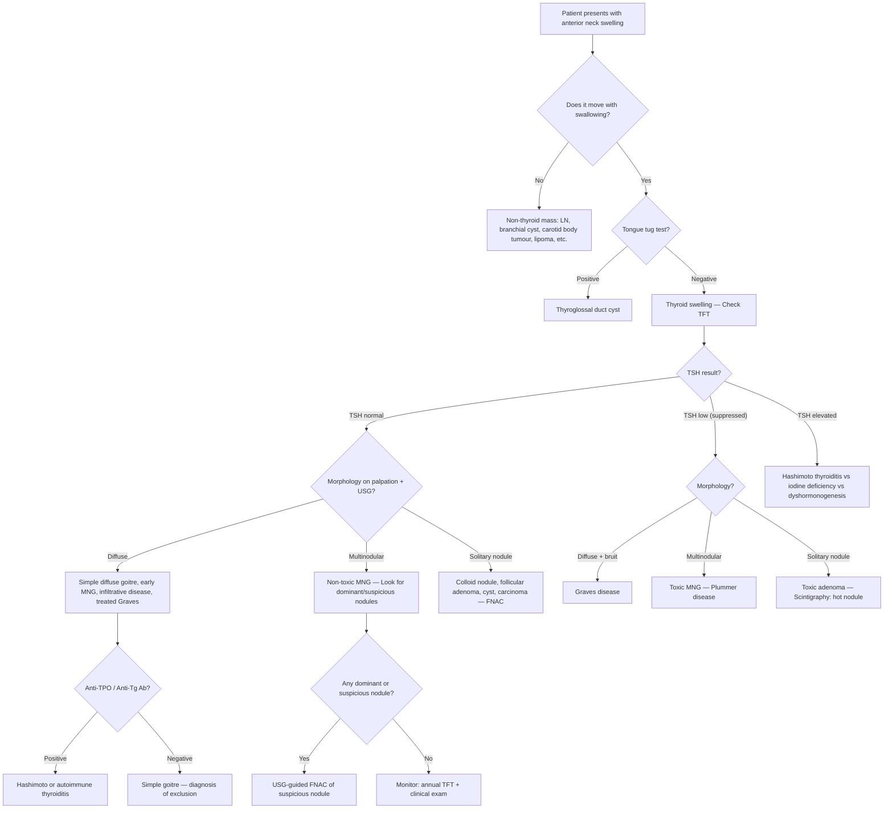

## Differential Diagnosis of Non-Toxic / Simple Goitre

### The Core Problem: A Patient Presents with a Thyroid Swelling — What Is It?

When a patient walks into clinic with an anterior neck mass that moves with swallowing, your brain must instantly start running through the differential diagnosis. The question is not just "is this a simple goitre?" — the question is **"what else could this thyroid swelling be, and which of those alternatives am I legally obligated not to miss?"**

Simple goitre is, remember, a ***diagnosis of exclusion*** [2]. You must systematically rule out neoplasia, inflammation (thyroiditis), autoimmune disease, and toxic states before you can comfortably label a goitre as "simple." The differential diagnosis is therefore framed around the clinical presentation of the thyroid swelling itself.

---

### 1. Organising Framework: DDx by Morphology and Thyroid Function

The most clinically useful way to approach the differential of a thyroid swelling is to **cross-reference the morphology** (what it looks/feels like) **with the thyroid functional status** (TFT result). This is the framework used in both the lecture slides and senior notes [1][2][3].

#### 1.1 Diffuse Goitre

A diffuse, smooth enlargement of the entire gland without distinct nodules.

| Thyroid Status | Differential Diagnosis | Key Distinguishing Features |
|---|---|---|
| ***Euthyroid*** | ***Simple diffuse goitre (e.g., pregnancy, iodine deficiency, goitrogen, pubertal)*** | Soft, non-tender, no bruit, no Ab, TFT normal — diagnosis of exclusion |
| ***Euthyroid*** | ***Early MNG*** | May feel diffuse on palpation but USG reveals early nodularity |
| ***Euthyroid*** | ***Infiltrative disease (e.g., lymphoma)*** | Rapid enlargement, firm/rubbery, may have B-symptoms (fever, night sweats, weight loss); long-standing Hashimoto's is a risk factor |
| ***Euthyroid*** | ***Treated Graves' disease*** | History of prior RAI or ATD treatment; may still have a palpable goitre |
| ***Hypothyroid*** | ***Hashimoto's thyroiditis*** | Firm, "rubbery" goitre; anti-TPO and anti-Tg antibodies strongly positive (90–100% and 80–90% respectively [8]); ↑ TSH, ↓ fT4 |
| ***Hyperthyroid*** | ***Graves' disease*** | ***Diffuse toxic goitre***: diffuse, non-tender, **vascular with audible bruit**; eye signs (proptosis, lid retraction, ophthalmoplegia); TRAb positive; scintigraphy shows diffuse ↑ uptake |
| ***Mixed (fluctuating)*** | ***Destructive thyroiditis (de Quervain's / subacute)*** | Tender goitre, preceding viral illness, pain radiating to jaw/ears, ↑ ESR; fluctuating thyroid status (thyrotoxic → hypothyroid → resolution); ***↓ iodine uptake on scintigraphy*** |

**Why does this framework matter?** Because the TFT result immediately narrows your differential. If you get a normal TSH back, you've already excluded Graves', toxic MNG, and overt Hashimoto's in one test. That's why ***TFT (ultrasensitive TSH ± fT4) is the first-line investigation*** [2][3].

#### 1.2 Multinodular Goitre

Multiple palpable nodules of varying size — the gland feels irregular, lumpy, asymmetric.

| Thyroid Status | Differential Diagnosis | Key Distinguishing Features |
|---|---|---|
| ***Euthyroid*** | ***Non-toxic multinodular goitre*** | The direct "evolved" form of simple goitre; TFT normal; may be large with compressive symptoms or retrosternal extension |
| ***Hyperthyroid (overt or subclinical)*** | ***Toxic multinodular goitre (Plummer's disease)*** | ***Classically AF + multinodular goitre in elderly*** [2]; ↓ TSH ± ↑ fT4/fT3; scintigraphy shows patchy uptake with hot and cold areas |
| Either | ***Malignancy within MNG*** | Any ***dominant nodule*** in an MNG must be evaluated separately — the risk of malignancy in a dominant nodule is the same as for a solitary nodule (~5–10%) |

> ***Around 10–15% of nodules are malignant*** [5]. A multinodular goitre does NOT protect you from cancer — always look for and investigate dominant or suspicious nodules within an MNG.

#### 1.3 Solitary / Nodular Goitre

A single palpable nodule within the thyroid, or a dominant nodule against a background of MNG.

| Category | Differential Diagnosis | Key Features |
|---|---|---|
| ***Non-neoplastic (70%)*** | ***Colloid nodule, haemorrhagic nodule, complex/cystic nodule, hyperplastic/adenomatous nodule, dominant nodule in MNG*** | These are by far the most common cause of a solitary thyroid nodule; usually benign on FNAC |
| ***Benign neoplasm (15%)*** | ***Follicular adenoma*** — non-toxic (more common) or ***toxic adenoma*** | Toxic adenoma: ***functioning/hot on scintigraphy***, autonomously secreting T4, ↓ TSH; non-toxic adenoma: euthyroid, cold/indeterminate on scintigraphy |
| ***Malignant neoplasm (~10–15%)*** | ***Papillary carcinoma*** (most common ~80%), ***Follicular carcinoma***, ***Medullary carcinoma***, ***Anaplastic carcinoma***, ***Thyroid lymphoma***, ***Metastatic disease*** | See section below for features suggesting malignancy |

<Callout title="Simple Cyst vs Colloid Nodule vs Neoplasm" type="idea">
A **true simple cyst** (purely fluid-filled, thin-walled, no solid component) is almost always benign. A **colloid nodule** is a follicle distended with colloid from cycles of hyperplasia and involution — also benign. The danger lies in **complex cystic nodules** (mixed solid-cystic with irregular septa or eccentric solid component) which may harbour malignancy within the solid component. This is why USG characterisation is critical.
</Callout>

---

### 2. Non-Thyroid Differential Diagnoses (The "It Might Not Be Thyroid" List)

Not every anterior neck mass is a goitre. If the mass does **not** move with swallowing, or has atypical features, consider:

| Condition | Location / Features | How to Distinguish from Goitre |
|---|---|---|
| ***Thyroglossal duct cyst*** | **Midline**, upper neck (60% at thyrohyoid membrane level); ***tongue tug test positive*** (moves with tongue protrusion because it is attached to the foramen caecum via the thyroglossal duct) [5] | Goitre: swallowing test +ve, tongue tug -ve. Thyroglossal cyst: BOTH swallowing test +ve (attached to hyoid) AND tongue tug +ve |
| **Branchial cleft cyst** | ***Anterior to SCM***, usually at angle of mandible (2nd cleft = most common); smooth, fluctuant | Does not move with swallowing; lateral position; presents in late childhood/early adulthood [8] |
| **Cervical lymphadenopathy** | Multiple rubbery or hard nodes; may be in any cervical level | Does not move with swallowing; consider reactive, infective (TB in HK!), lymphoma, metastatic (NPC in HK!) |
| **Dermoid cyst** | Midline, subcutaneous, doughy, does not transilluminate well | Fixed to skin (unlike goitre which is deep to strap muscles); does not move with swallowing |
| **Lymphoma** | Rapidly enlarging, rubbery, non-tender mass; may involve thyroid itself (primary thyroid lymphoma) or cervical nodes | B-symptoms; association with long-standing Hashimoto's thyroiditis |
| **Carotid body tumour (paraganglioma)** | At **carotid bifurcation** (level II); pulsatile; mobile laterally but NOT vertically (Fontaine's sign) | Pulsatile; does not move with swallowing; Doppler USG shows hypervascular mass |
| **Laryngocele / Pharyngeal pouch** | Lateral neck; may increase in size with Valsalva | Does not move with swallowing in the same way as thyroid |
| **Lipoma** | Soft, mobile, subcutaneous, "slip sign" positive | Superficial; does not move with swallowing |

> ***Summary from lecture [9]: Diagnosis of a neck mass depends on age, location, and clinical features. Investigation includes imaging, FNA, and excision. Treatment depends on nature of pathology.***

---

### 3. Features Suggesting Malignancy Within a Goitre

When you are evaluating a goitre or thyroid nodule, you must actively look for "red flags" that shift the probability from simple goitre towards malignancy. This is where the differential diagnosis directly influences your investigation pathway.

| Domain | Feature | Why It's Concerning |
|---|---|---|
| ***Demographics*** | ***Male sex*** | Thyroid nodules are less common in males but ***more likely to be malignant*** when they occur [3] |
| ***Demographics*** | ***Age < 14 or > 70*** | Nodules in the 3rd–6th decade are usually benign; extremes of age carry higher risk [3] |
| ***Symptom*** | ***Solitary or dominant nodule*** | ***More likely to be malignant than multiple nodules*** [3] |
| ***Symptom*** | ***Slow but progressive growth (weeks to months)*** | Suggests neoplastic growth; simple goitre grows very slowly over years |
| ***Symptom*** | ***Pressure symptoms / RLN palsy (hoarseness)*** | ***Indicates rapid growth rate with invasion*** — highly suspicious for malignancy (can be absent in well-differentiated CA) [3] |
| ***Symptom*** | ***Rapid painless enlargement*** | Think anaplastic carcinoma, primary thyroid lymphoma, or haemorrhage into necrotic nodule [3] |
| ***Sign*** | ***Firm/hard consistency, fixation to surrounding tissues*** | Soft = reassuring; hard and fixed = invasion of surrounding structures → malignancy |
| ***Sign*** | ***Cervical lymphadenopathy (esp Level VI)*** | ***Level VI is the first site of metastasis*** for thyroid CA [3] |
| ***PMHx*** | ***Previous neck irradiation*** | ↑ Risk of papillary carcinoma; ask about previous H&N cancer, NPC, thymoma [3] |
| ***FHx*** | ***Family history of thyroid CA*** | ***~20% of medullary CA (MEN II), ~5% of papillary CA*** are familial [3] |

---

### 4. Algorithmic Approach to Differential Diagnosis

The following flowchart shows how you systematically work through the differential diagnosis when a patient presents with a thyroid swelling, starting from the clinical examination and TFT, to arrive at a working diagnosis:

**Key reasoning at each branch:**

1. **Swallowing test** — Quickly separates thyroid from non-thyroid masses (the pretracheal fascia attaches the thyroid to the larynx → swallowing elevates the larynx → thyroid mass rises).
2. **Tongue tug test** — Thyroglossal duct remnant is connected to the foramen caecum of the tongue → protrusion of the tongue pulls the cyst upward. A goitre does NOT move with tongue protrusion.
3. **TFT (TSH)** — The single most important discriminator. Normal TSH immediately excludes Graves', toxic adenoma, and overt Hashimoto's. ***TSH level is the MOST sensitive indicator of thyroid function*** [8].
4. **USG** — Defines morphology (diffuse vs nodular vs solitary), identifies suspicious features, guides FNAC.
5. **Anti-thyroid antibodies** — If TSH is normal but you're still not sure it's "simple," check anti-TPO and anti-Tg. If positive, consider early/subclinical autoimmune thyroiditis. ***In simple goitre: TFT normal, no anti-thyroid Ab*** [2].
6. ***Thyroid scintigraphy: only indicated if nodule + ↓ TSH*** [2][3] — to determine if the nodule is "hot" (functioning/autonomous → rarely malignant) or "cold" (non-functioning → 10–20% malignancy risk → needs FNAC).

---

### 5. Differentiating Simple Goitre from Its Key Mimics — Side-by-Side

| Feature | Simple Goitre | Graves' Disease | Hashimoto's | De Quervain's Thyroiditis | Thyroid Malignancy | Toxic MNG |
|---|---|---|---|---|---|---|
| **Morphology** | Diffuse or multinodular | ***Diffuse*** | Diffuse (firm, rubbery) | Diffuse, may be asymmetric | Solitary hard nodule or dominant nodule | Multinodular |
| **Consistency** | ***Soft*** | Soft–firm | ***Firm, rubbery*** | Firm, tender | ***Hard, fixed*** | Variable, firm |
| **Tenderness** | ***No*** | No | No (unless flare) | ***Yes*** (pain radiates to jaw) | Usually no (unless anaplastic) | No |
| **Bruit** | ***No*** | ***Yes (vascular)*** | No | No | No | No |
| **Lymphadenopathy** | ***No*** | No | Possible | No | ***Yes (Level VI first)*** | No |
| **TFT** | ***Normal*** | ↓ TSH, ↑ fT4 | ↑ TSH, ↓ fT4 (or normal early) | Fluctuating | Usually normal | ↓ TSH ± ↑ fT4 |
| **Antibodies** | ***Negative*** | TRAb +ve (80–90%) | Anti-TPO +ve (90–100%) | Low-titre Ab (transient) | N/A (check Tg, calcitonin) | Usually negative |
| **ESR** | Normal | Normal | May be mildly ↑ | ***Markedly ↑*** | Normal (unless anaplastic) | Normal |
| **Scintigraphy** | Normal or patchy | ***Diffuse ↑ uptake*** | Normal or ↓ uptake | ***↓ uptake (globally)*** | Cold nodule | Patchy hot + cold |
| **Eye signs** | No | ***Yes (GO in 20–25%)*** | No | No | No | No |

<Callout title="The Big Three to Exclude" type="error">
Before calling any goitre "simple," you must confidently exclude:
1. **Hashimoto's thyroiditis** — check anti-TPO antibodies (the most sensitive marker; positive in 90–100% of Hashimoto's [8])
2. **Graves' disease** — check TFT (↓ TSH, ↑ fT4) and look for bruit, eye signs
3. **Malignancy** — USG for suspicious features, FNAC of any suspicious nodule

If TFT is normal, antibodies are negative, and USG shows no suspicious features, THEN you can call it simple goitre.
</Callout>

---

### 6. Special Differential: Retrosternal Goitre vs Other Mediastinal Masses

When a goitre extends retrosternally, it enters the differential for **superior mediastinal masses**. The differential for an anterior superior mediastinal mass follows the classic **"4 T's"** mnemonic:

| "T" | Examples |
|---|---|
| **T**hyroid (retrosternal goitre) | The most common cause of a superior mediastinal mass; usually extension of a cervical MNG |
| **T**hymoma | Associated with myasthenia gravis, pure red cell aplasia, hypogammaglobulinaemia |
| **T**errible lymphoma | Hodgkin's or non-Hodgkin's lymphoma |
| **T**eratoma / germ cell tumour | May contain fat, calcification, teeth on CT |

**How to distinguish retrosternal goitre from other mediastinal masses:**
- **Continuity with cervical thyroid** on CT/MRI — retrosternal goitre shows direct extension from the neck
- **Calcification pattern** — coarse/eggshell calcification typical of long-standing MNG
- **Thyroid scintigraphy** — functioning thyroid tissue lights up in the mediastinum (thymoma/lymphoma will not)
- **Clinical**: cannot get below the swelling on palpation; positive Pemberton's sign; moves (at least partially) with swallowing

> ***Retrosternal goitre requires CT because: (1) cannot be visualised by USG, (2) surgical planning, (3) retrosternal goitre may be malignant*** [5]

---

### 7. Summary Differential Diagnosis Table — Thyroid Masses

This integrates the framework from the lecture and senior notes [1][2][3]:

| Morphology | Thyroid Status | Differential Diagnoses |
|---|---|---|
| ***Diffuse goitre*** | ***Euthyroid*** | ***Simple diffuse goitre (pregnancy, iodine deficiency, goitrogen, pubertal), early MNG, infiltrative disease (lymphoma), treated Graves*** |
| ***Diffuse goitre*** | ***Hypothyroid*** | ***Hashimoto's thyroiditis*** |
| ***Diffuse goitre*** | ***Hyperthyroid*** | ***Graves' disease*** |
| ***Diffuse goitre*** | ***Mixed / fluctuating*** | ***Destructive thyroiditis (de Quervain's, postpartum, subacute lymphocytic)*** |
| ***Multinodular goitre*** | ***Euthyroid*** | ***Non-toxic multinodular goitre*** |
| ***Multinodular goitre*** | ***Hyperthyroid*** | ***Toxic multinodular goitre (Plummer's disease)*** |
| ***Nodular goitre*** | ***Any*** | ***Non-neoplastic nodules (70%): colloid, haemorrhagic, complex, cystic, hyperplastic, adenomatous nodules, dominant nodule in MNG*** |
| ***Nodular goitre*** | ***Any*** | ***Benign follicular adenoma (15%): non-toxic (more common), toxic*** |
| ***Nodular goitre*** | ***Any*** | ***Thyroid malignancies: follicular, papillary, medullary, anaplastic, lymphoma, metastatic*** |

---

<Callout title="High Yield Summary">

1. **Simple goitre is a diagnosis of exclusion** — must rule out Hashimoto's (anti-TPO), Graves' (TFT + bruit + eye signs), destructive thyroiditis (ESR, pain), and malignancy (USG ± FNAC).

2. **Framework**: Cross-reference morphology (diffuse / multinodular / solitary nodule) with thyroid function (euthyroid / hypo / hyper / mixed) to narrow the differential.

3. **Swallowing test** separates thyroid from non-thyroid masses. **Tongue tug test** distinguishes thyroglossal cyst from goitre.

4. **TFT is the single most important first-line discriminator**: normal TSH essentially excludes Graves' and toxic states.

5. **Around 10–15% of thyroid nodules are malignant** — always evaluate dominant/suspicious nodules even within an MNG.

6. **Red flags for malignancy**: male sex, age extremes ( < 14 or > 70), solitary/hard/fixed nodule, RLN palsy (hoarseness), cervical lymphadenopathy (esp. Level VI), prior neck irradiation, family history of thyroid CA/MEN II.

7. **Scintigraphy only if ↓ TSH + nodule**: hot nodules are rarely malignant ( < 1%); cold nodules have 10–20% malignancy risk.

8. **Retrosternal goitre DDx**: anterior superior mediastinal mass — "4 T's" (Thyroid, Thymoma, Terrible lymphoma, Teratoma). CT is essential because USG cannot visualise below the thoracic inlet.

</Callout>

---

<ActiveRecallQuiz
  title="Active Recall - Differential Diagnosis of Non-Toxic / Simple Goitre"
  items={[
    {
      question: "A patient presents with a diffuse, soft, non-tender goitre. TFT is normal. What three conditions must you exclude before labelling this as simple goitre, and how do you exclude each?",
      markscheme: "1. Hashimoto thyroiditis: check anti-TPO and anti-Tg antibodies (positive in 90-100% and 80-90% respectively). 2. Graves disease: TFT shows normal TSH (excludes), no bruit, no eye signs. 3. Malignancy: USG thyroid to look for suspicious features; FNAC of any suspicious nodule. Also exclude destructive thyroiditis (no tenderness, normal ESR). Simple goitre = diagnosis of exclusion."
    },
    {
      question: "List the differential diagnosis for a DIFFUSE goitre, organised by thyroid functional status (euthyroid, hypothyroid, hyperthyroid, mixed).",
      markscheme: "Euthyroid: simple diffuse goitre (pregnancy, puberty, iodine deficiency, goitrogen), early MNG, infiltrative disease (lymphoma), treated Graves. Hypothyroid: Hashimoto thyroiditis. Hyperthyroid: Graves disease. Mixed/fluctuating: destructive thyroiditis (de Quervain, postpartum, subacute lymphocytic)."
    },
    {
      question: "A patient has an anterior neck mass. How do you clinically differentiate between a thyroid goitre, a thyroglossal duct cyst, and a cervical lymph node?",
      markscheme: "Thyroid goitre: moves with swallowing (positive swallowing test), tongue tug test negative. Thyroglossal duct cyst: moves with swallowing AND moves with tongue protrusion (positive tongue tug test); midline, usually at thyrohyoid membrane level. Cervical lymph node: does NOT move with swallowing or tongue protrusion; may be in any cervical level."
    },
    {
      question: "List 5 clinical features that suggest a thyroid nodule is malignant rather than a benign part of a simple or multinodular goitre.",
      markscheme: "Any 5 of: (1) Male sex, (2) Age extremes (under 14 or over 70), (3) Solitary hard fixed nodule, (4) Rapid progressive growth, (5) Hoarseness/RLN palsy (indicates invasion), (6) Cervical lymphadenopathy especially Level VI, (7) History of neck irradiation, (8) Family history of thyroid CA or MEN II, (9) Pressure symptoms with fixation to surrounding structures."
    },
    {
      question: "When is thyroid scintigraphy indicated in the workup of a thyroid nodule, and what do hot and cold nodules signify?",
      markscheme: "Indicated when there is a thyroid nodule AND suppressed TSH (i.e., suspected autonomous function). Hot nodule: increased uptake, autonomously functioning, rarely malignant (less than 1%). Cold nodule: decreased uptake, non-functioning, 10-20% risk of malignancy — warrants FNAC. Scintigraphy should NOT be used if TSH is normal because most cold nodules are benign and it would lead to unnecessary biopsies."
    }
  ]}
/>

---

## References

[1] Lecture slides: GC 177. A thyroid nodule benign thyroid nodules; thyroid cancer.pdf (p4 — Goitre Classification; p13 — Other investigations)
[2] Senior notes: Ryan Ho Endocrine.pdf (p17, p19, p31–32 — Goitre DDx, Investigations, Simple and Multinodular Goitre)
[3] Senior notes: Ryan Ho Fundamentals.pdf (p172, p425–427, p429 — Thyroid mass DDx, Examination, Investigations)
[5] Senior notes: maxim.md (Approach to thyroid nodules DDx table, Retrosternal goitre CT indications, Thyroglossal cysts)
[7] Senior notes: Ryan Ho Diagnostic Radiology.pdf (p59–60 — Thyroid scintigraphy, principles and indications)
[8] Senior notes: felixlai.md (Thyroid antibodies table, Bethesda classification, Evaluation flowcharts, Branchial cleft cysts, Biochemical tests)
[9] Lecture slides: GC 218. I have a swelling in the neck Neck mass.pdf (p13 — Summary: diagnosis by age, location, clinical features)
