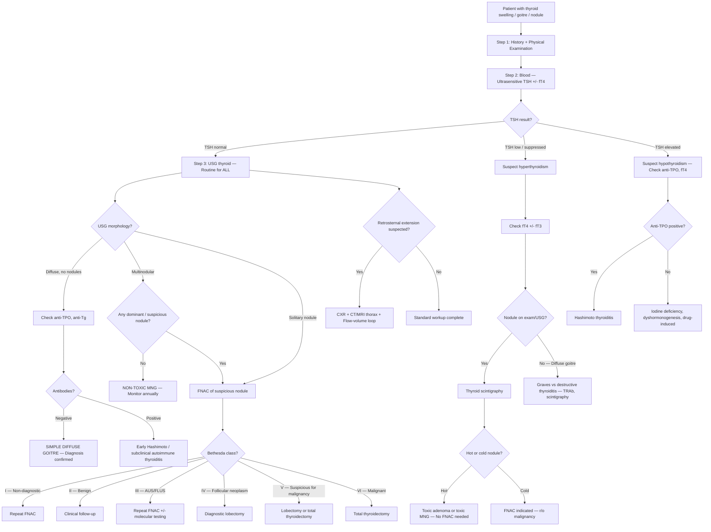

## Diagnostic Criteria, Algorithm and Investigations for Non-Toxic / Simple Goitre

---

### 1. Diagnostic Criteria — Why Simple Goitre Is a Diagnosis of Exclusion

There is **no single diagnostic criterion or scoring system** for simple (non-toxic) goitre. Unlike Graves' disease (where TRAb is nearly pathognomonic) or Hashimoto's thyroiditis (where anti-TPO titres clinch it), simple goitre is established by **systematically excluding** every other cause of thyroid enlargement.

Think of it this way: the thyroid is big, but everything else is normal. The diagnosis rests on **three pillars**:

| Pillar | What It Confirms | What It Excludes |
|---|---|---|
| **1. Normal TFT** (normal TSH ± fT4) | Euthyroid state | Graves' disease, toxic MNG, toxic adenoma (all have ↓ TSH); Hashimoto's with overt hypothyroidism (↑ TSH) |
| **2. Negative anti-thyroid antibodies** (anti-TPO, anti-Tg) | No autoimmune process | Hashimoto's thyroiditis (anti-TPO +ve 90–100%), Graves' disease (TRAb +ve 80–90%) [8] |
| **3. No suspicious features on USG ± FNAC** | No neoplasia | Thyroid malignancy, follicular neoplasm |

Additionally:
- No **tenderness** or **↑ ESR** → excludes subacute (de Quervain's) thyroiditis
- No **bruit** → excludes Graves' disease
- No **cervical lymphadenopathy** → excludes malignancy

> ***Simple goitre: Ix → TFT normal, no anti-thyroid Ab*** [2]. ***Tx: not required*** [2].

<Callout title="The Diagnosis in One Sentence">
Simple goitre = enlarged thyroid + **normal TSH** + **negative thyroid antibodies** + **no suspicious USG features** + **no evidence of inflammation**. If all of these are met, you've excluded Graves', Hashimoto's, thyroiditis, and malignancy — what's left is simple goitre.
</Callout>

---

### 2. Master Diagnostic Algorithm

The following algorithm shows the systematic approach from the moment a patient presents with a thyroid swelling to the point of reaching a working diagnosis. The logic at each branch point is explained below the diagram.

**Logic at each branch point:**

1. ***TSH is the single most important first test*** because it immediately triages the patient into euthyroid, hyperthyroid, or hypothyroid — each of which has a completely different differential [2][3].
2. ***USG is routine for ALL goitres/nodules*** [1][2][3] — it extends the physical examination, defines anatomy, identifies suspicious features, and guides FNAC.
3. ***Thyroid scintigraphy is only indicated when there is a nodule + ↓ TSH*** [2][3][8] — because you need to determine if the nodule is "hot" (autonomous, rarely malignant) or "cold" (non-functioning, 10–20% malignancy risk). ***If TSH is normal, scintigraphy should NOT be done*** because even cold nodules are mostly benign and it would lead to unnecessary biopsies [3].
4. ***FNAC is selective*** — only for nodules with suspicious USG features, cold nodules on scintigraphy, dominant/atypical nodules in MNG, nodules associated with abnormal LN, or complex/recurrent cystic nodules [8].
5. ***Anti-thyroid antibodies*** (anti-TPO, anti-Tg) are checked when you want to exclude autoimmune thyroiditis in a euthyroid diffuse goitre, or to establish Hashimoto's in a hypothyroid patient [2][8].

---

### 3. Investigation Modalities — Comprehensive Detail

#### 3.1 Routine Investigations (For ALL Patients with Goitre/Nodule)

> ***Routine for all patients: History + Physical exam, TFT, thyroid USG +/− FNAC*** [5]

##### 3.1.1 Thyroid Function Tests (TFT)

***Blood tests: TSH + free T4*** [1]

| Test | What It Measures | Why It Matters |
|---|---|---|
| ***Ultrasensitive TSH*** | Pituitary TSH level (most sensitive indicator of thyroid function) | ***TSH is the MOST sensitive indicator of thyroid function due to its short half-life*** [8] — even subtle thyroid dysfunction is reflected in TSH before fT4 changes. A normal TSH essentially confirms euthyroid status. |
| ***Free T4 (fT4)*** | Unbound, biologically active thyroxine | Confirms the degree of hyper- or hypothyroidism if TSH is abnormal. fT4 is preferred over total T4 because it is not affected by changes in binding proteins (e.g., ↑ TBG in pregnancy, OCP) [8]. |
| ***Free T3 (fT3)*** | Unbound triiodothyronine | Only needed if TSH is low but fT4 is normal → to detect **T3 thyrotoxicosis** (occurs in 2–5% of thyrotoxic patients) [8]. Not routine. |

**Interpretation in simple goitre:**
- TSH: **normal** (within reference range)
- fT4: **normal**
- If TSH is suppressed (even mildly): think subclinical thyrotoxicosis — ***25% of MNG patients have complete suppression of TSH*** [2]

**Why measure fT4 rather than total T4?** Because T3 and T4 are highly protein-bound (~99.97% for T4). Many factors alter thyroxine-binding globulin (TBG) levels — pregnancy and OCP increase TBG, androgens and hypoalbuminaemia decrease TBG. Total T4 changes with TBG levels even when the patient is euthyroid. Free T4 reflects only the biologically active fraction and is therefore more reliable [8].

##### 3.1.2 Ultrasound of Thyroid (USG)

***USG is the cornerstone investigation for all patients with goitre or palpable nodules*** [1][2][3].

***Investigation: Ultrasonography (USG)*** [1]:
- ***B-mode real-time***
- ***Non-invasive, no radiation, convenient and cheap***
- ***Highly sensitive but relatively low specificity***
- ***Role:***
  - ***Extend physical examination***
  - ***Select nodules for FNAC***
  - ***Guide needle aspiration***
  - ***For all patients with goitre/palpable nodule***
  - ***Not recommended as a screening test***

**Technical details**: ***7.5 or 10 MHz probes, B mode*** [2][3]. High-frequency probes give excellent resolution for superficial structures like the thyroid (typically < 4 cm from skin surface).

**What USG assesses:**

| Domain | What to Look For | Significance |
|---|---|---|
| **Thyroid gland** | Overall size, volume, echogenicity | Diffuse enlargement with normal echogenicity = simple goitre; heterogeneous echogenicity = Hashimoto's, MNG |
| **Nodule characteristics** | See TI-RADS features below | Risk-stratify for malignancy → decide FNAC |
| **Cervical lymph nodes** | ***Especially deep nodes, e.g., Level VI*** [5] | Suspicious LN features suggest metastatic thyroid CA |
| **Trachea** | Position, compression | Deviated = large goitre compressing; midline = reassuring |
| **Retrosternal extension** | Can partially assess but limited by sternum | If suspected → CT/MRI needed (USG cannot visualise below thoracic inlet) |

**USG Features of the Nodule Itself (Suspicious vs Reassuring):**

| Feature | ***Suspicious (High Risk of CA)*** | ***Reassuring (Low Risk of CA)*** |
|---|---|---|
| ***Echogenicity*** | ***Hypoechoic, heterogeneous*** | ***Hyperechoic, isoechoic*** |
| ***Calcification*** | ***Microcalcifications ( < 0.2 mm)*** — represents Psammoma bodies of papillary CA | ***Large coarse calcifications*** (dystrophic, from degeneration) |
| ***Shape*** | ***Taller than wide*** (AP dimension > transverse — suggests growth against tissue planes) | ***Wider than tall*** |
| ***Margins*** | ***Irregular (infiltrative/microlobulated)*** | Regular, smooth |
| ***Internal structure*** | ***Solid, or cystic with irregular septa*** | ***Spongiform appearance*** (multiple microcystic spaces > 50% of volume — very reassuring, < 1% malignancy) |
| ***Perilesional halo*** | ***Absent or incomplete*** (halo = compressed tissue without invasion) | Complete halo |
| ***Vascularity*** | ***Intranodular (central) vascularity*** | Peripheral vascularity |
| ***Extrathyroidal extension*** | ***Local invasion, esp. into strap muscles*** | Contained within thyroid |

> Mnemonic from senior notes for suspicious sonographic features: ***"SHIT CME"*** — ***Solid, Hypoechoic*** (most important), ***Irregular margins, Taller than wide, Calcification (micro), Margin irregular, Extrathyroidal extension*** [5]

**USG Features of Surrounding Tissues:**

| Feature | Suspicious Finding |
|---|---|
| ***Other nodules*** | Presence of multiple nodules (likely MNG) is somewhat reassuring but does NOT exclude malignancy in any individual nodule |
| ***Parenchymal abnormalities*** | Heterogeneous background → Hashimoto's |
| ***Cervical lymph nodes*** | ***Suspicious LN: absent hilum, microcalcification, round shape (loss of normal kidney-bean shape), peripheral vascularity, hyperechoic, > 2 cm, intranodal cystic/coagulative necrosis*** [2][3][8] |

##### 3.1.3 ATA Sonographic Risk Stratification (TI-RADS Principles)

The **American Thyroid Association (ATA) 2015 guidelines** (still current as of 2025/2026) stratify nodules into patterns that determine whether FNAC is indicated and at what size threshold:

| ***Sonographic Pattern*** | ***USG Findings*** | ***Risk of Malignancy*** | ***Size Cutoff for FNAC*** |
|---|---|---|---|
| ***High suspicion*** | ***Solid hypoechoic nodule OR solid hypoechoic component of partially cystic nodule + ≥ 1 of: microcalcifications, rim calcification with extrusive soft tissue, taller than wide, irregular margins, extrathyroidal extension*** | ***> 70–90%*** | *** > 1 cm*** |
| ***Intermediate suspicion*** | ***Hypoechoic solid nodule WITHOUT microcalcifications, taller-than-wide, or extrathyroidal extension*** | ***10–20%*** | *** > 1 cm*** |
| ***Low suspicion*** | ***Hyperechoic or isoechoic solid nodule, OR partially cystic with eccentric solid areas, WITHOUT suspicious features*** | ***5–10%*** | *** > 1.5 cm*** |
| ***Very low suspicion*** | ***Spongiform or partially cystic WITHOUT any suspicious features*** | *** < 3%*** | *** > 2 cm (or observe)*** |
| ***Benign*** | ***Purely cystic (no solid component)*** | *** < 1%*** | ***No FNAC*** |

<Callout title="Key Principle" type="idea">
The worse the USG looks, the smaller the nodule needs to be before you stick a needle in it. A highly suspicious nodule gets FNAC at > 1 cm; a very-low-suspicion spongiform nodule may not need FNAC until > 2 cm (or may just be observed). A purely cystic nodule needs no FNAC at all.
</Callout>

---

#### 3.2 Selective Investigations (Based on Clinical Scenario)

##### 3.2.1 Fine Needle Aspiration Cytology (FNAC)

***FNAC (+molecular testing)*** [1]

- **Technique**: 23–27 gauge needle, usually USG-guided, aspirating cells from the nodule for cytological examination.
- ***Core needle biopsy is NOT performed*** for thyroid nodules because ***the thyroid is a very vascularised structure → risk of massive bleeding***; also, ***FNAC is very accurate in identifying the type of thyroid cancer*** [8].

**Indications for FNAC** [8]:
- ***Sonographic criteria for FNAC*** (as per ATA risk stratification above)
- ***Hypofunctioning (cold) nodules on thyroid scintigraphy***
- ***Dominant or atypical nodule in multinodular goitre***
- ***Nodules associated with abnormal cervical lymph nodes***
- ***Complex or recurrent cystic nodules***

**Bethesda System for Reporting Thyroid Cytopathology** (the universal classification for FNA results):

| ***Class*** | ***Diagnostic Category*** | ***Cancer Risk*** | ***Recommended Management*** |
|---|---|---|---|
| ***I*** | ***Non-diagnostic / Unsatisfactory*** | ***1–4%*** | ***Repeat FNAC*** |
| ***II*** | ***Benign*** | ***0–3%*** | ***Clinical follow-up*** |
| ***III*** | ***Atypia of undetermined significance (AUS) OR Follicular lesion of undetermined significance (FLUS)*** | ***5–15%*** (updated to ~6–18% in Bethesda III 2023) | ***Repeat FNAC ± molecular testing*** |
| ***IV*** | ***Follicular neoplasm / Suspicious for follicular neoplasm*** | ***15–30%*** | ***Diagnostic surgical lobectomy*** |
| ***V*** | ***Suspicious for malignancy*** | ***60–75%*** | ***Lobectomy ± frozen section → total thyroidectomy*** |
| ***VI*** | ***Malignant*** | ***97–99%*** | ***Total thyroidectomy*** |

**Why can't FNAC distinguish follicular adenoma from follicular carcinoma?**
This is a classic exam question. Follicular carcinoma is defined by **capsular and/or vascular invasion** — features that can only be assessed on **histological examination** of the entire nodule, not on cytology (which only shows individual cells). That's why Bethesda IV ("follicular neoplasm") always goes to **diagnostic lobectomy** — you need the whole specimen under the microscope [8].

> ***Thyroidectomy: diagnostic ± therapeutic*** [1][2] — In cases where FNAC is indeterminate (Bethesda III–IV), surgical excision serves both a diagnostic and therapeutic purpose.

**Molecular testing** (e.g., Afirma Gene Expression Classifier, ThyroSeq): Increasingly used for Bethesda III/IV nodules to further risk-stratify and potentially avoid unnecessary surgery. Detects mutations like BRAF V600E (highly specific for papillary CA), RAS, RET/PTC rearrangements, etc.

##### 3.2.2 Thyroid Scintigraphy (Radio-isotope Scan)

***Radio-isotope scintigraphy (I-123 or Tc-99m)*** [1]

**When to order (indications):**

> ***Thyroid scintigraphy: only indicated if nodule + ↓ TSH*** [2][3]

The reason is logical: if TSH is suppressed, something is autonomously making thyroid hormone. You need to know if it's the **nodule** (toxic adenoma → hot), the **whole gland** (Graves' → diffuse uptake), or **multiple nodules** (toxic MNG → heterogeneous uptake). If TSH is normal, the nodule by definition is NOT hyperfunctioning, so scintigraphy adds nothing — cold nodules at normal TSH are mostly benign and you'd just do USG-guided FNAC directly [3].

***From the lecture slides*** [1]:
- ***Diagnosis of malignancy: low sensitivity and specificity***
- ***Functional assessment in thyrotoxic patients***

**Radiopharmaceuticals** [7]:
- ***99mTc pertechnetate*** (trapped by NIS only — does not undergo organification; ***similar ionic size as iodide*** [7])
- ***123I or 131I*** (trapped AND organified — more physiological but more expensive, less available)

**Principle**: ***Radioactive iodine is handled in the same manner as normal iodine. Level of uptake (and hence metabolic activity) is reflected by localisation of radioactive iodine*** [7].

**Interpretation:**

| ***Scintigraphy Pattern*** | ***Interpretation*** | ***Clinical Significance*** |
|---|---|---|
| ***Diffuse ↑ uptake*** | ***Graves' disease vs secondary hyperthyroidism*** | Diffuse autonomous stimulation of entire gland |
| ***Heterogeneous ↑ uptake*** | ***Toxic MNG*** | Patchy areas of autonomous function amidst suppressed normal tissue |
| ***Focal ↑ uptake with ↓ uptake elsewhere*** | ***Toxic adenoma*** | Single autonomously functioning nodule suppressing the rest of the gland via negative feedback (↓ TSH → rest of gland suppressed) |
| ***Diffuse ↓ uptake*** | ***Destructive thyroiditis vs factitious thyrotoxicosis*** | Follicles are damaged and cannot trap iodine; or no endogenous thyroid activity (exogenous T4 intake) |
| ***"Hot" nodule*** | ***Hyperfunctioning — uptake > surrounding tissue*** | ***Rarely malignant ( < 1%) → does NOT require FNAC*** [2][3][8] |
| ***"Cold" nodule*** | ***Hypofunctioning — uptake < surrounding tissue*** | ***10–20% risk of malignancy → requires FNAC*** (provided sonographic criteria met) [2][3][8] |

<Callout title="Why Hot Nodules Are Rarely Malignant" type="idea">
A "hot" nodule is one that is **actively trapping iodine and making thyroid hormone** — it is a well-differentiated, functioning follicular cell. Malignant thyroid cells (especially papillary and follicular carcinomas) are generally **less differentiated** and **less efficient** at iodine trapping compared to normal thyroid tissue, so they tend to appear as "cold" (reduced uptake) on scintigraphy. The rare exception is some follicular carcinomas that retain enough differentiation to appear warm/hot.
</Callout>

##### 3.2.3 Further Investigations for Retrosternal/Obstructive Goitre

***Further Ix for obstructive/retrosternal goitre*** [2][3]:

| Investigation | Indication | Key Findings / Interpretation |
|---|---|---|
| ***CXR (thoracic inlet)*** [1] | Screen for mediastinal extension, tracheal deviation | Superior mediastinal widening; tracheal deviation to contralateral side; calcification within the mass; retrosternal soft tissue shadow |
| ***CT scan / MRI*** [1][2][3] | ***Retrosternal goitre*** (cannot be visualised by USG) [5]; ***surgical planning***; ***retrosternal goitre may be malignant*** [5]; locally advanced thyroid cancer | Defines extent of retrosternal extension, degree of tracheal compression/displacement, relationship to great vessels and oesophagus; ***CT/MRI for retrosternal extension and staging — NOT routine*** [2][3] |
| ***Flow-volume loop (spirometry)*** | ***Screen for significant tracheal compression*** [2][3] | ***Upper airway obstruction (UAO) results in a blunted flow-volume loop*** [2][3]: fixed UAO → flattened inspiratory AND expiratory limbs; variable extrathoracic UAO → flattened inspiratory limb; variable intrathoracic UAO → flattened expiratory limb |

<Callout title="CT Contrast and Radioactive Iodine" type="error">
***The use of iodinated contrast (for CT) may affect post-operative radioactive iodine body scan*** [2]. Iodinated contrast delivers a massive iodine load → saturates the NIS → ↓ uptake of subsequent RAI for 6–12 weeks. If you anticipate the patient may need RAI therapy (e.g., for thyroid cancer), avoid iodinated contrast or plan RAI accordingly. Use MRI instead if possible.
</Callout>

##### 3.2.4 Other Selective Blood Tests

| Test | Indication | Interpretation |
|---|---|---|
| ***ESR, anti-thyroid antibodies (ATA)*** | ***For thyroiditis*** [2][3] | ↑ ESR + painful goitre = de Quervain's; anti-TPO/anti-Tg positive = autoimmune (Hashimoto's, subclinical autoimmune thyroiditis) |
| ***Calcitonin*** | ***If Hx or clinical suspicion of familial medullary carcinoma or MEN2*** [2][3] | Elevated calcitonin = medullary thyroid carcinoma (95% of MTC produce calcitonin); also used as tumour marker for monitoring |
| ***Serum thyroglobulin (Tg)*** | Baseline tumour marker if suspected/confirmed differentiated thyroid CA | NOT useful for diagnosis (elevated in many benign conditions); useful post-thyroidectomy as recurrence marker |
| ***Anti-Tg antibodies*** | ***Measured to assess whether thyroglobulin can be used as a tumour marker*** [8] | If anti-Tg Ab are present, they interfere with Tg assays → Tg levels are unreliable for monitoring |
| ***CEA*** | Baseline marker in medullary thyroid CA | 80% of MTC produce CEA [8] |
| ***Genetic testing (RET proto-oncogene)*** | All patients with MTC | ***All patients with MTC should be tested for RET mutation*** [8] → genetic counselling and family screening |
| **Serum calcium, phosphate** | Pre-operative baseline; exclude hypercalcaemia of malignancy | Hypercalcaemia may indicate parathyroid involvement or metastatic disease; also critical as post-op baseline for hypoparathyroidism |

##### 3.2.5 Endoscopy

| Procedure | Indication | What It Shows |
|---|---|---|
| ***Direct laryngoscopy*** | ***For RLN palsy*** [2][3] — should be done pre-operatively in ALL patients undergoing thyroidectomy to document baseline vocal cord function | Vocal cord mobility; unilateral cord paralysis = RLN palsy (suggests malignancy if pre-operative; iatrogenic if post-operative) |
| ***OGD*** | ***For oesophageal involvement*** [2][3] | Extrinsic compression or direct invasion of oesophagus by aggressive thyroid malignancy |

##### 3.2.6 PET Scan

- ***PET scan*** [1]: ***No diagnostic role*** in the routine workup of a thyroid nodule or goitre [5].
- However, incidental thyroid uptake on FDG-PET (performed for other reasons) is found in ~1–2% of PET scans and has a **~30–35% risk of malignancy** — these warrant USG + FNAC.
- PET is used in **post-treatment surveillance** of thyroid cancer (especially RAI-refractory differentiated thyroid CA and anaplastic/medullary CA).

---

### 4. Putting It All Together — Summary Investigation Table

| Investigation | ***Routine or Selective*** | Key Purpose |
|---|---|---|
| History + Physical exam | ***Routine ✓*** | Clinical assessment, morphology, thyroid status, red flags for malignancy |
| TFT | ***Routine ✓*** | Determine thyroid functional status; triage into euthyroid/hypo/hyper |
| USG thyroid ± FNAC | ***Routine ✓*** | Define anatomy, identify nodules, risk-stratify for malignancy, guide FNAC |
| Thyroid scintigraphy | ***Selective*** — ***only in ↓ TSH + nodules*** | Determine hot vs cold nodule; functional assessment in thyrotoxicosis |
| CT scan / MRI | ***Selective*** — ***only for retrosternal goitre or locally advanced CA*** | Cannot be visualised by USG; surgical planning; delineation of cervical fascia structures |
| PET scan | ***Selective*** — ***no diagnostic role*** | Post-treatment surveillance; incidental thyroid FDG uptake warrants USG + FNAC |
| Anti-thyroid Ab (TPO, Tg) | ***Selective*** — if autoimmune thyroiditis suspected | Exclude Hashimoto's; assess if Tg reliable as tumour marker |
| ESR | ***Selective*** — if thyroiditis suspected | ↑ in de Quervain's |
| Calcitonin, CEA | ***Selective*** — if MTC suspected | Tumour markers for medullary CA |
| RET mutation testing | ***Selective*** — all confirmed MTC | Identify hereditary MTC / MEN2 |
| Flow-volume loop | ***Selective*** — retrosternal / obstructive goitre | Screen for UAO |
| Direct laryngoscopy | ***Selective*** — pre-op or if hoarseness present | Document vocal cord function |
| Thyroidectomy | ***Selective*** — ***diagnostic ± therapeutic*** | Definitive histological diagnosis when FNAC indeterminate (Bethesda III–V) |

> ***From the lecture [1]: Thyroid nodule investigations → Blood tests: TSH + free T4; Ultrasound; FNAC (+molecular testing); ESR, thyroid antibodies, calcitonin, genetic testing; Imaging: radioisotope scan, CT scan/MRI, PET scan; Endoscopy; Thyroidectomy: diagnostic + therapeutic***

---

### 5. Specific Findings in Simple / Non-Toxic Goitre

To bring this full circle — what do you actually find in simple goitre on each investigation?

| Investigation | Expected Finding in Simple Goitre |
|---|---|
| **TFT** | Normal TSH, normal fT4 |
| **Anti-TPO, anti-Tg** | Negative |
| **ESR** | Normal |
| **USG** | Diffuse enlargement OR multinodular pattern; **no suspicious features** (no microcalcifications, no solid hypoechoic nodules, no taller-than-wide, no irregular margins); possibly colloid nodules, cystic change |
| **FNAC** (if performed for dominant nodule) | Bethesda II — benign (colloid, macrophages, benign follicular cells) |
| **Scintigraphy** (if performed — usually not needed) | Normal or slightly heterogeneous uptake; no focal hot or cold areas |
| **CXR** | Normal if no retrosternal extension; mediastinal widening + tracheal deviation if retrosternal |
| **CT thorax** (if retrosternal) | Goitre extending below thoracic inlet; may show tracheal compression/deviation; no invasion |
| **Flow-volume loop** (if retrosternal) | May show blunted loop if significant UAO; normal if no obstruction |

---

<Callout title="High Yield Summary">

1. **Simple goitre has no specific diagnostic test** — it is a **diagnosis of exclusion** requiring: normal TFT + negative anti-thyroid Ab + no suspicious USG features + no inflammation.

2. **Three routine investigations for ALL goitres**: (1) TFT (ultrasensitive TSH ± fT4), (2) USG thyroid, (3) FNAC of suspicious nodules only.

3. **Thyroid scintigraphy**: ONLY if ↓ TSH + nodule. Hot nodules are rarely malignant ( < 1%), do not need FNAC. Cold nodules have 10–20% malignancy risk → FNAC.

4. **USG risk stratification (ATA)**: High suspicion (solid hypoechoic + microcalcifications/taller-than-wide/irregular margins) → FNAC at > 1 cm. Purely cystic → no FNAC.

5. **Bethesda classification**: I = repeat; II = follow-up; III = repeat/molecular; IV = lobectomy; V = lobectomy ± total; VI = total thyroidectomy.

6. **Retrosternal goitre needs**: CXR + CT/MRI (USG cannot visualise below thoracic inlet) + flow-volume loop (UAO → blunted loop). Avoid iodinated contrast if RAI planned.

7. **FNAC cannot distinguish follicular adenoma from carcinoma** (needs capsular/vascular invasion on histology) → Bethesda IV always goes to diagnostic lobectomy.

8. **Pre-op laryngoscopy** for ALL thyroidectomy patients to document baseline vocal cord function.

</Callout>

---

<ActiveRecallQuiz
  title="Active Recall - Diagnostic Criteria, Algorithm and Investigations"
  items={[
    {
      question: "What three criteria must be met to diagnose simple (non-toxic) goitre? Why is it called a diagnosis of exclusion?",
      markscheme: "(1) Normal TFT (normal TSH and fT4), (2) Negative anti-thyroid antibodies (anti-TPO, anti-Tg), (3) No suspicious features on USG and no malignancy on FNAC. It is a diagnosis of exclusion because you must rule out Graves (TFT/TRAb), Hashimoto (anti-TPO), thyroiditis (ESR/tenderness), and neoplasia (USG/FNAC) before confirming simple goitre."
    },
    {
      question: "List the three routine investigations for ANY patient with a goitre or thyroid nodule, and state what each one achieves.",
      markscheme: "(1) TFT (ultrasensitive TSH +/- fT4): determines thyroid functional status, triages into euthyroid/hypo/hyper. (2) USG thyroid: defines anatomy and size, identifies suspicious nodule features (TI-RADS), guides FNAC, assesses cervical LN. (3) FNAC: only for suspicious nodules — provides cytological diagnosis via Bethesda classification."
    },
    {
      question: "A patient has a thyroid nodule with a suppressed TSH. What investigation should you order next and why? What are the possible findings and their significance?",
      markscheme: "Thyroid scintigraphy (99mTc pertechnetate or I-123). Rationale: suppressed TSH suggests autonomous function — need to identify if the nodule is hot or cold. Hot nodule: uptake greater than surrounding tissue, rarely malignant (less than 1%), no FNAC needed, manage as toxic adenoma. Cold nodule: uptake less than surrounding tissue, 10-20% malignancy risk, requires FNAC."
    },
    {
      question: "State the ATA sonographic pattern for 'high suspicion' of malignancy. What is the size cutoff for FNAC?",
      markscheme: "High suspicion: solid hypoechoic nodule OR solid hypoechoic component of partially cystic nodule with at least one of: microcalcifications, rim calcification with extrusive soft tissue, taller-than-wide shape, irregular margins (infiltrative/microlobulated), extrathyroidal extension. Risk of malignancy > 70-90%. FNAC at > 1 cm."
    },
    {
      question: "Why can FNAC not distinguish follicular adenoma from follicular carcinoma? What is the management for a Bethesda IV result?",
      markscheme: "Follicular carcinoma is defined by capsular and/or vascular invasion, which can only be assessed on histological examination of the whole excised specimen, not on cytology (which only shows individual cells without architecture). Management of Bethesda IV (follicular neoplasm): diagnostic surgical lobectomy to obtain the entire nodule for histological assessment."
    },
    {
      question: "A patient with a large MNG has suspected retrosternal extension. Name 3 investigations you would order specifically for this and explain what each shows.",
      markscheme: "(1) CXR: mediastinal widening, tracheal deviation, calcification. (2) CT or MRI thorax: defines extent of retrosternal extension, degree of tracheal compression/displacement, relationship to great vessels, surgical planning. (3) Flow-volume loop (spirometry): screens for upper airway obstruction — UAO produces a blunted flow-volume loop (fixed obstruction = flattened both inspiratory and expiratory limbs). Note: avoid iodinated CT contrast if RAI therapy anticipated."
    }
  ]}
/>

---

## References

[1] Lecture slides: GC 177. A thyroid nodule benign thyroid nodules; thyroid cancer.pdf (p4 — Classification; p5 — Pathology; p7 — Investigations; p8 — USG; p13 — Other investigations/scintigraphy; p14 — Benign nodule indications for treatment)
[2] Senior notes: Ryan Ho Endocrine.pdf (p13 — Scintigraphy indications/findings; p17 — Goitre DDx, subclinical thyrotoxicosis; p19 — Investigations, USG features; p32 — Simple goitre and MNG)
[3] Senior notes: Ryan Ho Fundamentals.pdf (p425–429 — Goitre investigations, USG, scintigraphy, management of benign goitre)
[5] Senior notes: maxim.md (Routine vs selective investigations table, retrosternal goitre CT indications, SHIT CME mnemonic)
[7] Senior notes: Ryan Ho Diagnostic Radiology.pdf (p59–60 — Thyroid scintigraphy principles, radiopharmaceuticals, congenital hypothyroidism)
[8] Senior notes: felixlai.md (TFT interpretation, thyroid antibodies table, USG suspicious features, ATA sonographic criteria for FNAC, Bethesda classification, scintigraphy interpretation, FNAC indications)
