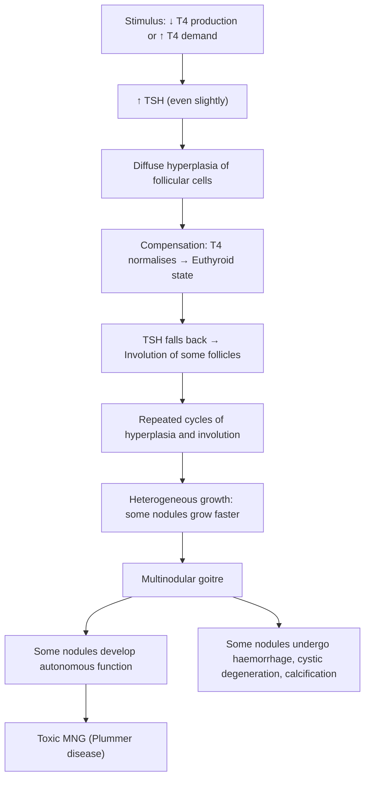
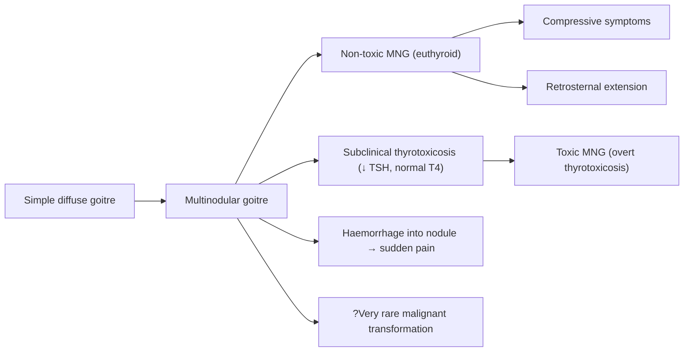

# Non-Toxic / Simple Goitre (Including Retrosternal Goitre)

---

## 1. Definition

***Simple goitre*** (also called **non-toxic goitre**) is defined as ***any thyroid enlargement that is not a result of neoplasia or inflammation***, and that is ***not associated with thyrotoxicosis or hypothyroidism*** (i.e., the patient is **euthyroid**) [1][2].

- The word "goitre" comes from the Latin *guttur* = throat. It simply means an **enlarged thyroid gland**.
- "Non-toxic" = no excess thyroid hormone secretion (i.e., no thyrotoxicosis).
- "Simple" = the enlargement is due to a **benign, non-inflammatory, non-neoplastic** process.
- It is essentially a **diagnosis of exclusion** — you must rule out Hashimoto's thyroiditis, destructive thyroiditis, Graves' disease, and neoplasia before labelling a goitre as "simple" [2].

It may present as either:
- ***Diffuse*** — uniform enlargement of the entire gland
- ***Nodular*** — one or more nodules (multinodular goitre, MNG) [1][3]

> The key concept: the thyroid is enlarged, but thyroid *function* is normal. The gland is simply bigger than it should be.

**Retrosternal (substernal) goitre** refers to extension of an enlarged thyroid gland below the thoracic inlet into the superior mediastinum. By convention, a goitre is called retrosternal when **>50% of the gland lies below the thoracic inlet**, although some define it as any thyroid tissue extending below the plane of the sternal notch. This is important because it can cause significant **compressive symptoms** on the trachea, oesophagus, and great vessels.

---

## 2. Epidemiology

### 2.1 Prevalence

- ***Prevalence of thyroid nodules is extraordinarily common*** [2]:
  - **3–7%** by palpation
  - **>30%** by autopsy or ultrasound
  - Prevalence depends on **iodine status**, **ionising radiation exposure**, **gender**, and **age**
- **Simple diffuse goitre** usually presents in the **15–25 year** age group [2]
- **Multinodular goitre (MNG)** usually presents in patients **>35 years** [2]
- Female predominance: **F:M ≈ 4–5:1** (oestrogen may play a role in thyroid growth)

### 2.2 Endemic vs Sporadic

| Feature | ***Endemic Goitre*** | ***Sporadic Goitre*** |
|---|---|---|
| Definition | Goitre affecting **>5%** of the population in a geographic region | Occurs in non-endemic areas |
| Main cause | ***Dietary iodine deficiency*** (mountainous/inland regions) | ***Unknown aetiology*** (?goitrogens, ?mild synthesis defects) |
| Geography | Himalayas, Andes, central Africa, parts of inland China | Worldwide, including Hong Kong |
| Mechanism | ↓ Iodine → ↓ T4 synthesis → ↑ TSH → thyroid hyperplasia | Exacerbated by ↑ thyroid hormone requirement (puberty, pregnancy) |

### 2.3 Hong Kong Context

- Hong Kong is **not** an iodine-deficient region (coastal, seafood-rich diet), so endemic goitre due to iodine deficiency is **rare**.
- Most simple goitres in HK are **sporadic**.
- However, **multinodular goitre** is extremely common in the elderly Hong Kong population and is a frequent cause of **subclinical thyrotoxicosis** and **atrial fibrillation** in this group [2].
- The prevalence of thyroid nodules detected incidentally on imaging (USG, CT, PET) is rising due to widespread use of cross-sectional imaging.

---

## 3. Anatomy and Function

### 3.1 Gross Anatomy of the Thyroid

- The thyroid gland is a butterfly-shaped endocrine organ located in the anterior neck, at the level of **C5–T1 vertebrae**.
- It consists of **two lateral lobes** connected by an **isthmus** across the 2nd–4th tracheal rings.
- A **pyramidal lobe** (remnant of the thyroglossal duct) is present in ~50% of people, extending superiorly from the isthmus.
- Weight: normally **15–25 g** in adults.

**Key anatomical relations (critical for understanding compressive symptoms and surgical risks):**

| Structure | Relation | Clinical Relevance |
|---|---|---|
| **Trachea** | Directly posterior to isthmus | Tracheal compression/deviation → stridor, dyspnoea |
| **Oesophagus** | Posterolateral (left side) | Dysphagia from posterior goitre extension |
| **Recurrent laryngeal nerve (RLN)** | Runs in the tracheo-oesophageal groove | Hoarseness of voice if invaded by malignancy or injured in surgery |
| **Superior laryngeal nerve (external branch)** | Runs with superior thyroid artery near upper pole | Injury → loss of high-pitched phonation (cricothyroid palsy) |
| **Parathyroid glands** | Posterior surface of thyroid (2 superior, 2 inferior) | Hypocalcaemia if removed during thyroidectomy |
| **Carotid sheath** | Lateral | Carotid body tumour in differential of neck mass |
| **Strap muscles** | Anterior | Invasion suggests aggressive malignancy |
| **Thoracic inlet** | Inferior | Retrosternal extension |

### 3.2 Blood Supply

- **Superior thyroid artery** (first branch of external carotid artery)
- **Inferior thyroid artery** (from thyrocervical trunk of subclavian artery)
- **Thyroidea ima artery** (variable, from brachiocephalic trunk or aortic arch — present in ~3%; important in retrosternal goitre surgery)
- Venous drainage: superior, middle, and inferior thyroid veins → internal jugular vein and brachiocephalic veins

### 3.3 Lymphatic Drainage

- Central compartment (Level VI) nodes → lateral neck (Levels II–V) → mediastinal nodes
- Level VI is the **first echelon** of thyroid lymphatic drainage — critical in thyroid cancer staging

### 3.4 Thyroid Physiology (First Principles)

Understanding thyroid hormone synthesis is essential to understanding why goitres form:

1. **Iodine trapping**: The **sodium-iodide symporter (NIS)** on the basolateral membrane of thyroid follicular cells actively transports iodide (I⁻) into the cell against its concentration gradient (this is what radioactive iodine and pertechnetate exploit for scintigraphy).
2. **Organification**: Iodide is oxidised by **thyroid peroxidase (TPO)** and bound to tyrosine residues on **thyroglobulin (Tg)** at the apical membrane → monoiodotyrosine (MIT) and diiodotyrosine (DIT).
3. **Coupling**: MIT + DIT → **T3** (triiodothyronine); DIT + DIT → **T4** (thyroxine).
4. **Storage**: T3 and T4 are stored as part of the thyroglobulin colloid in the follicular lumen.
5. **Secretion**: TSH stimulates endocytosis of colloid → proteolysis → release of T4 (90%) and T3 (10%) into the bloodstream.
6. **Peripheral conversion**: T4 → T3 (the active form) by deiodinases in peripheral tissues (liver, kidney, muscle).
7. **Feedback**: T3/T4 → negative feedback on the **hypothalamus** (↓ TRH) and **anterior pituitary** (↓ TSH).

**Why does the gland enlarge in simple goitre?**
- If there is any impairment in T4 synthesis (e.g., iodine deficiency, goitrogens, mild enzyme defects), T4 levels dip slightly → TSH rises even marginally → TSH stimulates **hyperplasia** and **hypertrophy** of follicular cells → the gland enlarges to maintain adequate T4 output → the patient remains **euthyroid** at the cost of a bigger gland.
- Over time, if this cycle repeats, you get **recurrent episodes of hyperplasia and involution** → this is the pathogenesis of multinodular goitre [2].

---

## 4. Etiology (Focus on Hong Kong)

### 4.1 Causes of Simple / Non-Toxic Goitre

| Category | Examples | Mechanism |
|---|---|---|
| ***Iodine deficiency*** (endemic) | Mountainous/inland regions (rare in HK) | ↓ I₂ → ↓ T4 synthesis → ↑ TSH → thyroid hyperplasia |
| ***Iodine excess*** | Kelp, seaweed, iodinated contrast, amiodarone | **Wolff-Chaikoff effect**: acute excess iodine paradoxically blocks organification → transient ↓ T4 → ↑ TSH → goitre (if escape mechanism fails) |
| ***Goitrogens*** | Cassava (thiocyanate), cruciferous vegetables (cabbage, broccoli), soy, lithium, amiodarone | Interfere with iodine uptake or organification → ↓ T4 → ↑ TSH |
| ***Increased physiological demand*** | ***Puberty, pregnancy*** | ↑ TBG (oestrogen-driven), ↑ renal iodine clearance in pregnancy, ↑ metabolic demands → relative T4 insufficiency → ↑ TSH |
| ***Mild thyroid hormone synthesis defects*** (sporadic) | Subtle/subclinical enzymatic defects (e.g., mild TPO deficiency) | Subclinically impaired T4 production → compensatory TSH rise |
| ***Dyshormonogenesis*** | Genetic defects in NIS, TPO, thyroglobulin, Pendrin (Pendred syndrome) | Defective hormone synthesis → ↑ TSH → goitre (often presents in childhood) |

<Callout title="Hong Kong Specific">
In Hong Kong, **sporadic non-toxic goitre** is by far the most common form. Iodine deficiency is rare because of the coastal diet rich in seafood. Think of puberty, pregnancy, and goitrogens (including medications like lithium) as the main precipitants. Multinodular goitre in elderly patients is the most clinically significant presentation — often presenting with atrial fibrillation or compressive symptoms.
</Callout>

### 4.2 Goitrogens — A Closer Look

"Goitrogen" = *goitre* + Greek *-gen* (to produce) = substances that produce goitre.

| Goitrogen | Source | Mechanism |
|---|---|---|
| **Thiocyanate** | Cassava, smoking | Competitively inhibits NIS → ↓ iodine uptake |
| **Perchlorate** | Environmental contaminant | Competitively inhibits NIS |
| **Lithium** | Psychiatric medication (bipolar disorder) | Inhibits thyroid hormone release; also inhibits organification |
| **Amiodarone** | Anti-arrhythmic (37% iodine by weight) | Can cause goitre via Wolff-Chaikoff effect OR thyrotoxicosis (Jod-Basedow effect) |
| **Cruciferous vegetables** | Cabbage, broccoli, kale, cauliflower | Contain thioglucosides → thiocyanate → ↓ iodine uptake (clinically significant only with extreme consumption + borderline iodine intake) |
| **Soy isoflavones** | Soy products | Inhibit TPO → ↓ organification (mainly relevant in iodine-deficient states) |

---

## 5. Pathophysiology

### 5.1 Simple Diffuse Goitre → Multinodular Goitre: The Natural History

This is a **continuum**. The pathophysiology of non-toxic goitre proceeds through predictable stages:

***The key pathological principle:*** **recurrent episodes of hyperplasia and involution** (due to unknown/multiple stimuli) → ***hyperplastic nodules growing at varying rates*** [2].

**Why do nodules form rather than uniform enlargement?**
- Not all thyroid follicular cells respond equally to TSH stimulation. There is **intrinsic heterogeneity** in growth potential among follicular cells.
- Cells with higher intrinsic growth rates form nodules; cells that involute more readily form colloid-filled areas.
- Over time, some nodules develop **somatic mutations** (e.g., activating mutations in TSH receptor or Gsα) that allow **autonomous function** independent of TSH — this is how a non-toxic MNG can evolve into a **toxic MNG (Plummer's disease)** [2].

### 5.2 Pathology

| Feature | Simple Diffuse Goitre | Multinodular Goitre |
|---|---|---|
| Gross | Diffusely enlarged, smooth, soft | Asymmetrically enlarged, nodular, may be very large (>100 g) |
| Cut surface | Glistening, homogeneous colloid | Heterogeneous: areas of haemorrhage, fibrosis, calcification, cystic change |
| Microscopy | Hyperplastic follicles with ↑ cellularity, small colloid | Variable: hyperplastic follicles, involuted follicles distended with colloid, areas of haemorrhage, fibrosis, calcification |
| Capsule | No true capsule | Nodules may have partial pseudocapsules from compressed tissue |

### 5.3 Why Does Retrosternal Extension Occur?

- The thyroid gland is enclosed by the **pretracheal fascia** but the fascial planes of the neck are continuous with the superior mediastinum.
- As the gland enlarges, the path of least resistance is **inferiorly** through the thoracic inlet, because:
  - Superiorly: restricted by the hyoid bone and strap muscles
  - Laterally: restricted by the carotid sheaths and sternocleidomastoid
  - Posteriorly: trachea and oesophagus
  - **Inferiorly**: the thoracic inlet is relatively open — gravity and negative intrathoracic pressure during inspiration **pull** the enlarged gland downward
- Most retrosternal goitres extend into the **anterior mediastinum** (in front of the trachea and great vessels)
- Less commonly, extension is **posterior** to the trachea/oesophagus (posterior mediastinum) — this is more likely to cause dysphagia and airway compromise

<Callout title="Retrosternal Goitre — Why It Matters" type="error">
A retrosternal goitre can be entirely asymptomatic or can present as a **surgical emergency** with acute airway obstruction. Always assess the lower border of a goitre — ***if you cannot get below it***, think retrosternal extension. This is a classic physical examination finding.
</Callout>

---

## 6. Classification

### 6.1 Classification of Goitre (from Lecture Slides) [1]

***Goitre Classification:***

| Category | Subtypes |
|---|---|
| ***Simple goitre (endemic or sporadic)*** | ***Diffuse*** / ***Nodular*** |
| ***Toxic goitre*** | ***Diffuse toxic (Graves')*** / ***Toxic nodular (Plummer's)*** / ***Toxic/functioning adenoma*** |
| ***Neoplastic goitre*** | ***Benign*** / ***Malignant*** |
| ***Thyroiditis*** | ***Bacterial (acute suppurative)*** / ***Viral (subacute)*** / ***Lymphocytic/Hashimoto/autoimmune (chronic)*** |

### 6.2 WHO Classification of Goitre by Size

| Grade | Description |
|---|---|
| **0** | No goitre (thyroid not palpable or visible) |
| **1** | Palpable goitre but not visible with neck in normal position |
| **1a** | Palpable but not visible even with neck extended |
| **1b** | Palpable and visible only with neck extended |
| **2** | Visible goitre with neck in normal position |
| **3** | Very large goitre visible from a distance |

### 6.3 Classification by Morphology

| Type | Description |
|---|---|
| **Diffuse goitre** | Uniform enlargement without palpable nodules |
| **Uninodular goitre** | Single palpable nodule (must exclude neoplasm) |
| **Multinodular goitre (MNG)** | Multiple palpable nodules of varying size |

### 6.4 Classification by Function

| Type | TSH | fT4/fT3 | Clinical State |
|---|---|---|---|
| **Non-toxic (simple) goitre** | Normal | Normal | Euthyroid |
| **Subclinical toxic MNG** | ↓ (suppressed) | Normal (upper range) | Clinically euthyroid but biochemically suppressed TSH |
| **Toxic MNG (Plummer's)** | ↓↓ | ↑ | Thyrotoxic |

> ***25% of MNG patients have complete suppression of TSH, with T4/T3 within reference range (subclinical thyrotoxicosis) or elevated (toxic MNG)*** [2].

### 6.5 Classification by Location

| Type | Location |
|---|---|
| **Cervical goitre** | Entirely within the neck |
| **Retrosternal/substernal goitre** | Extends below the thoracic inlet into the mediastinum |
| **Intrathoracic goitre** | Entirely within the thorax (rare; may have separate blood supply from intrathoracic vessels) |

---

## 7. Clinical Features

### 7.1 Symptoms

The symptoms of simple/non-toxic goitre can be divided into those from the **mass itself**, **compressive symptoms**, and **systemic symptoms** (which should be absent in true non-toxic goitre).

#### 7.1.1 Mass-Related Symptoms

| Symptom | Pathophysiological Basis |
|---|---|
| ***Neck swelling*** (the presenting complaint) | Direct enlargement of the thyroid gland due to hyperplasia/nodule formation; moves with swallowing because the gland is enclosed in pretracheal fascia which is attached to the larynx |
| ***Cosmetic concern*** | Visible anterior neck mass, especially in thin patients; may be the only reason for presentation |
| ***Awareness of a lump / tightness*** | Stretching of the thyroid capsule and surrounding tissues |
| ***Pain*** (uncommon in simple goitre) | **Not typical** for simple goitre; if present, think of haemorrhage into a nodule/cyst (sudden painful swelling), subacute thyroiditis, or anaplastic carcinoma |

***Key point from the lecture:*** ***Acute painful enlargement can arise from haemorrhage into a nodule/cyst*** [2][3]. If a patient with known MNG presents with sudden neck pain and rapid enlargement, haemorrhage into a degenerating nodule is the most likely cause.

#### 7.1.2 Compressive Symptoms (Especially in Large/Retrosternal Goitre)

| Symptom | Structure Compressed | Pathophysiological Basis |
|---|---|---|
| ***Dyspnoea / stridor*** | **Trachea** | Large goitre (especially retrosternal) compresses or deviates the trachea → narrowing of airway lumen → inspiratory stridor (extrathoracic) or biphasic stridor (intrathoracic/fixed) |
| ***Dysphagia*** | **Oesophagus** | Posterior extension of goitre compresses the oesophagus against the vertebral column → difficulty swallowing solids initially, then liquids |
| ***Hoarseness of voice (HOV) / dysphonia*** | **Recurrent laryngeal nerve (RLN)** | In **simple goitre**, RLN compression is very rare (the nerve is displaced, not invaded). HOV in the setting of a goitre should raise suspicion for **malignancy** (invasion of the nerve) |
| ***Facial plethora / SVC obstruction symptoms*** | **Superior vena cava (SVC) or brachiocephalic veins** | Large retrosternal goitre can compress the great veins in the thoracic inlet → venous congestion of the face, neck, and upper extremities (SVC syndrome); Pemberton's sign positive |
| ***Horner syndrome*** (rare) | **Sympathetic chain** | Very large retrosternal goitre compressing the cervical sympathetic chain → ipsilateral miosis, ptosis, anhidrosis |
| ***Phrenic nerve palsy*** (rare) | **Phrenic nerve** | Retrosternal extension compressing the phrenic nerve → diaphragmatic paralysis → dyspnoea |

<Callout title="Pemberton's Sign" type="idea">
**Pemberton's sign** is a clinical test for thoracic inlet obstruction by a retrosternal goitre: ask the patient to raise both arms above the head for 1–2 minutes. A positive sign = facial plethora, cyanosis, distension of neck veins, and respiratory distress. This occurs because raising the arms further narrows the thoracic inlet, compressing the already-compromised venous return.
</Callout>

#### 7.1.3 Symptoms That Should Be ABSENT in Simple Non-Toxic Goitre

| Symptom | What It Suggests |
|---|---|
| ***Thyrotoxic symptoms*** (weight loss, heat intolerance, tremor, palpitations, diarrhoea, anxiety, sweating) | Toxic MNG, Graves' disease, toxic adenoma |
| ***Hypothyroid symptoms*** (fatigue, weight gain, cold intolerance, constipation, bradycardia) | Hashimoto's thyroiditis, late-stage MNG with gland destruction |
| ***Rapid, painless enlargement*** | Lymphoma, anaplastic carcinoma |
| ***Fixation / cervical lymphadenopathy*** | Malignancy |

> ***The classic presentation of toxic MNG in the elderly: AF + multinodular goitre*** [2]. Always check TFTs in any patient with MNG to exclude subclinical or overt thyrotoxicosis.

---

### 7.2 Signs

Physical examination of a goitre should follow a structured approach: ***inspection → palpation → percussion → auscultation → thyroid status assessment → complications*** [3][4].

#### 7.2.1 Inspection

| Sign | Pathophysiological Basis / Significance |
|---|---|
| **Visible anterior neck swelling** | Enlarged thyroid gland; may be symmetrical (diffuse goitre) or asymmetrical (dominant nodule in MNG) |
| ***Swallowing test positive***: mass rises with swallowing | The thyroid is invested by the **pretracheal fascia**, which is attached to the laryngeal cartilages; swallowing elevates the larynx → thyroid gland and any thyroid mass moves up |
| **Tongue tug test negative** | Positive tongue tug test = mass moves with tongue protrusion → this suggests **thyroglossal cyst** (attached to foramen caecum via thyroglossal duct), NOT thyroid goitre |
| **Surgical scars** | Previous thyroid surgery (hemithyroidectomy, total thyroidectomy) |
| **Skin changes** | Radiotherapy marks (previous H&N radiation); dilated veins over the chest/neck (SVC obstruction from retrosternal goitre) |

#### 7.2.2 Palpation

Stand behind the patient. Ask about tenderness before palpating.

| Sign | Description | Pathophysiological Basis / Significance |
|---|---|---|
| ***Diffuse goitre vs nodular goitre vs solitary nodule vs dominant nodule in MNG*** | Careful palpation distinguishes these | Diffuse → simple goitre, Graves', Hashimoto's; Nodular → MNG; Solitary → adenoma, cyst, carcinoma; Dominant nodule in MNG → must exclude malignancy |
| ***Size*** | Estimated by palpation (measure with tape measure) | Document for follow-up comparison |
| ***Consistency*** | **Soft**: simple diffuse goitre. **Firm**: MNG, Hashimoto's. **Hard**: calcification, malignancy. **Rubbery**: lymphoma | ***Simple goitre is characteristically soft and diffuse without tenderness, lymphadenopathy, or overlying bruit*** [2] |
| ***Tenderness*** | Present → thyroiditis (de Quervain's), haemorrhage into cyst, anaplastic CA | ***Not a feature of simple goitre*** |
| **Surface** | Smooth → diffuse goitre; Lobulated/irregular → MNG | |
| ***Lower border*** | **Can you get below it?** If you ***cannot feel the lower border***, suspect **retrosternal extension** | This is a **critical** clinical finding — the thoracic inlet prevents your fingers from reaching below the gland |
| **Tracheal position** | Midline or deviated? | Large goitre can push the trachea to the contralateral side |
| ***Cervical lymph nodes*** | Palpate all levels (I–VI) | Lymphadenopathy suggests malignancy or lymphoma; ***absent in simple goitre*** |

#### 7.2.3 Percussion

| Sign | Technique | Significance |
|---|---|---|
| ***Retrosternal dullness*** | Percuss over the **manubrium/upper sternum** | Dullness to percussion suggests retrosternal extension of the goitre (normally resonant over the lung/trachea) |

> ***Percussion is only relevant in assessing retrosternal extension of goitre*** [4].

#### 7.2.4 Auscultation

| Sign | Significance |
|---|---|
| ***No bruit*** (in simple goitre) | A **thyroid bruit** suggests ***increased vascularity*** — think **Graves' disease** (diffuse, vascular, hyperfunctioning gland). A simple goitre should NOT have a bruit |

#### 7.2.5 Thyroid Status Assessment

In simple/non-toxic goitre, the thyroid status examination should be **entirely normal**. However, always perform a full thyroid status assessment to confirm euthyroid status and to exclude the differential diagnoses:

| Domain | What to Check | Finding in Simple Goitre |
|---|---|---|
| **Eyes** | Proptosis, lid retraction, lid lag, chemosis, ophthalmoplegia | All normal (these are features of Graves' ophthalmopathy) |
| **Hands** | Tremor, sweating, tachycardia, thyroid acropachy, palmar erythema | All normal |
| **Pulse** | Rate and rhythm | Regular, normal rate (tachycardia/AF suggests thyrotoxicosis) |
| **Lower limbs** | Proximal myopathy, pretibial myxoedema, reflexes | Normal (pretibial myxoedema = Graves'; delayed relaxation of reflexes = hypothyroidism) |

#### 7.2.6 Summary of Signs in Simple Goitre

> ***Simple goitre: soft, diffuse goiter without tenderness, lymphadenopathy and overlying bruit*** [2]

> ***TFT normal, no anti-thyroid Ab*** [2]

---

## 8. Special Consideration: Retrosternal Goitre

### 8.1 Definition and Epidemiology

- Retrosternal goitre accounts for **~5–15% of mediastinal masses** and is the **most common cause of a superior mediastinal mass** in the anterior compartment.
- Most retrosternal goitres (>95%) are extensions of a cervical goitre — truly ectopic intrathoracic thyroid tissue (with an intrathoracic blood supply) is very rare (~1%).
- More common in **long-standing MNG** (years to decades of progressive growth).

### 8.2 Clinical Features Specific to Retrosternal Goitre

| Feature | Explanation |
|---|---|
| ***Cannot palpate the lower border*** | The lower pole extends below the thoracic inlet |
| ***Pemberton's sign positive*** | Raising arms → further thoracic inlet narrowing → venous congestion → facial plethora, cyanosis, JVD, stridor |
| ***Retrosternal dullness*** | Percussion over manubrium is dull rather than resonant |
| ***Tracheal deviation on CXR*** | Goitre displaces the trachea laterally |
| ***Superior mediastinal widening on CXR*** | The mass is visible on chest X-ray as a mediastinal shadow, often with calcification |
| ***Stridor*** (may be positional) | Tracheal compression; may worsen when lying flat or with neck flexion |
| ***SVC obstruction syndrome*** | Compression of SVC → facial plethora, neck vein distension, upper limb oedema |

<Callout title="Exam Tip: 'Getting Below the Swelling'" type="error">
A common exam mistake is forgetting to assess the **lower border** of a thyroid swelling. If you cannot get your fingers beneath the lower pole of the goitre, you MUST mention retrosternal extension as a possibility and describe the relevant further investigations (CXR, CT thorax, flow-volume loop).
</Callout>

### 8.3 Investigations Specific to Retrosternal Goitre

| Investigation | Purpose |
|---|---|
| ***CXR*** | Superior mediastinal widening, tracheal deviation, calcification |
| ***CT/MRI thorax*** | ***Assessment of extent of retrosternal extension, degree of tracheal displacement or compression*** [2][3] |
| ***Flow-volume loop (spirometry)*** | ***Screen for significant tracheal compression*** — ***upper airway obstruction (UAO) results in a blunted flow-volume loop*** [2][3] |
| **Thyroid scintigraphy** | Can show functioning thyroid tissue in the mediastinum; may help distinguish from other mediastinal masses |

> ***Further Ix for obstructive/retrosternal goitre: CXR/CT/MRI thorax for assessment of extent + Flow-volume loop study for airway obstruction*** [2][3]

---

## 9. Natural History and Progression

Key points:
- ***Simple goitre usually presents 15–25 years*** [2]
- ***MNG usually presents >35 years*** [2]
- The natural history is one of **progressive enlargement** over years to decades
- ***Some nodules may secrete thyroid hormone autonomously (toxic MNG, Plummer disease)*** [2]
- ***Haemorrhage into a nodule/cyst → sudden painful swelling*** [2]
- Long-standing MNG may rarely harbour malignancy (especially papillary carcinoma); however, the **risk of malignancy in any individual nodule within an MNG is the same as for a solitary nodule** (~5–10%)
- The progression from non-toxic → toxic MNG is driven by somatic activating mutations in TSH receptor or Gsα in autonomously functioning nodules

---

<Callout title="High Yield Summary">

1. **Definition**: Simple/non-toxic goitre = thyroid enlargement **not due to neoplasia or inflammation**, with **normal thyroid function** (euthyroid). It is a **diagnosis of exclusion**.

2. **Types**: Endemic (iodine deficiency) vs Sporadic (unknown, ?goitrogens, ?↑ demand); Diffuse vs Nodular (MNG).

3. **Epidemiology**: Diffuse simple goitre peaks at 15–25y; MNG peaks at >35y; extraordinarily common (>30% on USG).

4. **Hong Kong**: Sporadic goitre is the common form (not iodine deficient). MNG in elderly is very common — watch for AF.

5. **Pathophysiology**: Recurrent cycles of TSH-driven hyperplasia and involution → heterogeneous nodule formation → MNG. Some nodules may develop autonomous function (→ toxic MNG).

6. **Classification (from lecture)**: Simple (diffuse/nodular) | Toxic (Graves'/Plummer's/toxic adenoma) | Neoplastic (benign/malignant) | Thyroiditis (bacterial/viral/autoimmune).

7. **Clinical features**: Soft, diffuse/nodular goitre; **no tenderness, no lymphadenopathy, no bruit**; moves with swallowing; euthyroid status.

8. **Compressive symptoms**: Dyspnoea/stridor (trachea), dysphagia (oesophagus), dysphonia (RLN — think malignancy), SVC syndrome (great veins).

9. **Retrosternal goitre**: Cannot get below the swelling; Pemberton's sign positive; retrosternal dullness; investigate with CXR, CT/MRI thorax, flow-volume loop.

10. **Key investigations**: TFT (must be normal), USG (for all goitres), ± FNAC of suspicious nodules, scintigraphy if ↓ TSH, CT/flow-volume loop if retrosternal.

11. **25% of MNG patients have suppressed TSH** — subclinical thyrotoxicosis is common and clinically important (risk of AF, osteoporosis).

</Callout>

---

<ActiveRecallQuiz
  title="Active Recall - Non-Toxic / Simple Goitre"
  items={[
    {
      question: "Define simple (non-toxic) goitre. What must be excluded before making this diagnosis?",
      markscheme: "Any thyroid enlargement not due to neoplasia or inflammation, with normal thyroid function (euthyroid). Must exclude: Hashimoto thyroiditis, destructive thyroiditis, Graves disease, and neoplasia. It is a diagnosis of exclusion."
    },
    {
      question: "Explain the pathophysiology of how a simple diffuse goitre progresses to a multinodular goitre over time.",
      markscheme: "Recurrent cycles of TSH-driven hyperplasia (from any cause of mildly reduced T4) followed by involution. Follicular cells have intrinsic heterogeneity in growth potential, leading to nodules growing at varying rates. Some nodules undergo haemorrhage, cystic degeneration, fibrosis, calcification. Some develop somatic mutations leading to autonomous function (toxic MNG)."
    },
    {
      question: "A patient with a known MNG cannot have the lower border of the goitre palpated. What is the likely diagnosis? Name 3 investigations you would order and explain why.",
      markscheme: "Retrosternal goitre. Investigations: (1) CXR - mediastinal widening, tracheal deviation; (2) CT or MRI thorax - extent of retrosternal extension, tracheal compression/displacement; (3) Flow-volume loop (spirometry) - screen for upper airway obstruction (blunted flow-volume loop in UAO)."
    },
    {
      question: "What is Pemberton's sign? Describe the test and explain the pathophysiology of a positive result.",
      markscheme: "Patient raises both arms above head for 1-2 minutes. Positive sign: facial plethora, cyanosis, JVD, respiratory distress. Pathophysiology: raising arms narrows the thoracic inlet, further compressing already-compromised great veins (SVC/brachiocephalic veins) by the retrosternal goitre, causing venous congestion of the head, neck and upper extremities."
    },
    {
      question: "List the classification of goitre as given in the lecture slides with subtypes.",
      markscheme: "Simple goitre (endemic or sporadic): diffuse, nodular. Toxic goitre: diffuse toxic (Graves), toxic nodular (Plummer), toxic/functioning adenoma. Neoplastic goitre: benign, malignant. Thyroiditis: bacterial (acute suppurative), viral (subacute), lymphocytic/Hashimoto/autoimmune (chronic)."
    },
    {
      question: "Describe the expected physical examination findings in a patient with a simple non-toxic goitre. What specific findings would make you reconsider the diagnosis?",
      markscheme: "Expected: soft, diffuse or nodular goitre, non-tender, mobile, moves with swallowing, no cervical lymphadenopathy, no bruit, euthyroid status (normal eyes, hands, pulse, reflexes). Findings suggesting alternative diagnosis: tenderness (thyroiditis/haemorrhage), bruit (Graves), hard/fixed mass (malignancy), lymphadenopathy (malignancy/lymphoma), thyrotoxic or hypothyroid signs."
    }
  ]}
/>

---

## References

[1] Lecture slides: GC 177. A thyroid nodule benign thyroid nodules; thyroid cancer.pdf (p4 — Goitre Classification)
[2] Senior notes: Ryan Ho Endocrine.pdf (p17, p31–32 — Goitre, Thyroid Nodules, Simple and Multinodular Goitre)
[3] Senior notes: Ryan Ho Fundamentals.pdf (p425–429 — Goitre and Thyroid Nodules)
[4] Senior notes: Ryan Ho Rheumatology.pdf (p160 — Examination of Lumps and Bumps: percussion for retrosternal goitre)
[5] Senior notes: maxim.md (Approach to thyroid nodules, Physical examination)
[6] Senior notes: felixlai.md (Definitions, Causes of thyrotoxicosis)
[7] Senior notes: Ryan Ho Diagnostic Radiology.pdf (p59–60 — Thyroid Scintigraphy)
