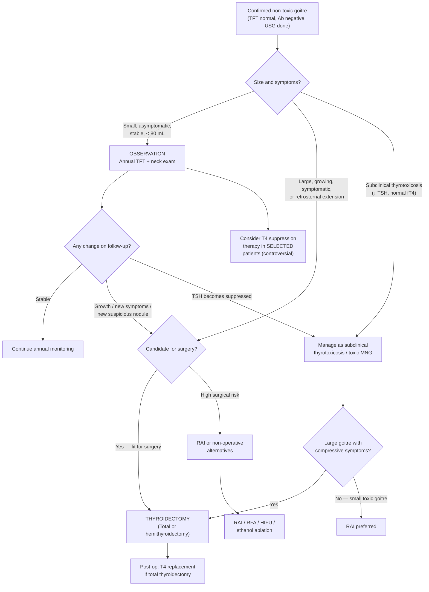

## Management of Non-Toxic / Simple Goitre (Including Retrosternal Goitre)

---

### 1. Overarching Principles

Before diving into the algorithm, let's establish the fundamental logic of managing simple/non-toxic goitre:

1. **Simple goitre is benign and euthyroid** — there is no hormonal emergency, no malignancy, no inflammation. Many patients require **no treatment at all**.
2. The decision to treat is driven entirely by **symptoms, size, growth trajectory, complications (compression/retrosternal extension), suspicion of malignancy, or cosmesis** — NOT by the mere existence of a goitre.
3. ***Treatment (Tx) is not required*** for small, asymptomatic, stable simple goitres [2].
4. For **MNG**: the natural history is progressive enlargement → ***early definitive treatment for large or toxic MNG, as relapse is invariable after cessation of ATD*** [2]. This is fundamentally different from Graves' disease, where antithyroid drugs (ATD) are first-line because the autoimmune process may spontaneously remit after 12–18 months. In MNG, there is no autoimmune process to remit — the nodules keep growing.
5. The **"4C" mnemonic** for indications for thyroidectomy in benign thyroid disease is invaluable:

> **3Cs** (from senior notes) — **Cancer** (confirmed or suspicious FNAC Bethesda IV–VI), **Compressive symptoms** (dysphagia, dysphonia, dyspnoea, retrosternal goitre), **Cannot be treated medically** (frequent relapses requiring definitive Tx, when RAI unsuitable or large goitre > 80 g) + **Cosmesis** [2]

---

### 2. Indications for Treatment of Benign Thyroid Nodules / Non-Toxic Goitre

***Benign thyroid nodules — Indications of treatment*** [1]:

| Indication | Explanation |
|---|---|
| ***Symptomatic (size of goitre/nodule)*** | Pressure sensation, neck tightness, discomfort with swallowing |
| ***Increase in goitre size*** | Progressive enlargement despite observation → suggests ongoing stimulus or autonomous growth |
| ***Trachea compression or deviation*** | Airway compromise → dyspnoea, stridor; this is potentially life-threatening |
| ***Retrosternal extension*** | Even if asymptomatic, retrosternal goitres tend to grow and can cause acute airway obstruction; surgical access becomes more difficult with time |
| ***Suspected malignancy*** | Suspicious FNAC (Bethesda IV–VI), suspicious USG features, or clinical red flags |
| ***Cosmetic considerations / patient wish*** | Visible goitre causing psychological distress; patient preference after counselling |

---

### 3. Management Algorithm

---

### 4. Treatment Modalities — Detailed Breakdown

#### 4.1 Observation (Conservative Management / Watch-and-Wait)

This is the management for the majority of patients with small, asymptomatic, non-toxic goitres.

***No treatment + annual TFT to screen for toxic MNG in small, non-toxic MNG*** [2]

| Aspect | Detail |
|---|---|
| **Who** | Small goitre ( < 80 mL), asymptomatic, euthyroid, no suspicious nodules, no retrosternal extension |
| **What to monitor** | ***TFT + neck exam every 1 year*** [2][3] — to detect progression to subclinical/overt thyrotoxicosis (toxic MNG) or significant growth |
| **USG follow-up** | Repeat USG if clinical change (new symptoms, palpable growth, new nodule); some guidelines suggest USG at 12–24 months then less frequently if stable |
| **When to escalate** | Growth causing symptoms, development of compressive symptoms, TSH suppression, new suspicious features |

**Why is observation reasonable?** Because simple goitre is benign, most are slow-growing, and the risk of malignancy in a goitre with no suspicious features is very low. Intervention carries its own risks (surgical complications, lifelong T4 replacement). The cost-benefit ratio favours watchful waiting unless there is a clear indication to act.

#### 4.2 T4 Suppression Therapy (TSH-Suppressive Levothyroxine)

***Consider T4 suppression therapy in selected patients → aim low-normal TSH*** [2]

| Aspect | Detail |
|---|---|
| **Mechanism** | Administration of exogenous levothyroxine (T4) → negative feedback on pituitary → ***↓ TSH → ↓ size of goitre*** [3]. TSH is the main growth factor for thyroid follicular cells; removing the TSH drive theoretically shrinks the goitre. |
| **Target** | Aim for TSH at the **low-normal end** of the reference range (~0.4–1.0 mU/L). Do NOT fully suppress TSH (that would cause iatrogenic subclinical hyperthyroidism). |
| **Who benefits** | Patients with goitre associated with ***↑ TSH*** (e.g., Hashimoto's thyroiditis, subclinical hypothyroidism, iodine deficiency) — in these patients, removing the elevated TSH stimulus genuinely helps. |
| **Controversy** | ***Efficacy in euthyroid patients is controversial*** [3] — if TSH is already normal, further suppressing it yields marginal benefit on goitre size (typically < 20% reduction) and exposes the patient to long-term side effects of subclinical hyperthyroidism. |
| **Side effects** | ***Long-term S/E of subclinical hyperthyroidism: bone (↑ bone resorption → osteoporosis, especially postmenopausal women) and heart (↑ risk of AF, cardiac hypertrophy)*** [3] |
| **Current consensus** | NOT recommended routinely for euthyroid simple goitre. May be considered in young patients with small diffuse goitres in iodine-deficient areas. ETA guidelines discourage this in iodine-sufficient regions. |

<Callout title="Why ATD Don't Work for Simple/Non-Toxic Goitre" type="error">
A common misconception is trying antithyroid drugs (ATD) for non-toxic MNG. ***ATD is 1st line in Graves' disease because the underlying autoimmune process may subside after 18 months. This is not the case in MNG or simple goitre*** [2]. In toxic MNG, ATD can control thyrotoxicosis temporarily but ***relapse is invariable after cessation*** [2] — so ATD is NOT definitive. For non-toxic MNG, there is no excess hormone to suppress in the first place. ATD have no role.
</Callout>

#### 4.3 Thyroidectomy (Surgical Management) — The Mainstay of Active Treatment

***Thyroidectomy*** is the preferred active treatment for most patients with large, symptomatic, or growing goitres [2][3].

##### 4.3.1 Indications for Thyroidectomy in Benign Thyroid Disease

***Indications: 3Cs*** [2]:

| Indication | Detail |
|---|---|
| ***Cancer (or suspicion)*** | Confirmed CA or suspicious FNAC (Bethesda IV–VI) |
| ***Compressive symptoms*** | Dysphagia, dysphonia, dyspnoea, ***trachea compression or deviation***, ***retrosternal extension*** [1] |
| ***Cannot be treated medically*** | Frequent relapses of thyrotoxicosis (toxic MNG), require definitive Tx when RAI unsuitable (e.g., large goitre > 80 g) |
| + ***Cosmesis*** | ***Cosmetic considerations / patient wish*** [1] |

Additional specific indications from the lecture slides [1]:
- ***Symptomatic (size of goitre/nodule)***
- ***Increase in goitre size***
- ***Suspected malignancy***

##### 4.3.2 Types of Thyroidectomy

| Procedure | What Is Removed | Indications | Advantages | Disadvantages |
|---|---|---|---|---|
| ***Hemithyroidectomy (lobectomy)*** | One lobe + isthmus ± pyramidal lobe | ***Usually for suspicious thyroid nodules*** [2]; unilateral benign goitre; Bethesda IV–V | Preserves contralateral lobe → often avoids lifelong T4 replacement; lower risk of bilateral RLN injury and hypoparathyroidism | ***Risk of re-operation (recurrence rate 8.4%)*** [2][3] if disease is bilateral; may need completion thyroidectomy if histology shows cancer |
| ***Total / near-total thyroidectomy*** | Entire gland ± preservation of small remnant near RLN | Large bilateral MNG, compressive symptoms, retrosternal goitre, ***cosmetic concerns*** [2]; confirmed malignancy; Bethesda VI | ***Recurrence rate 0.2%*** [3]; no need for re-operation; allows RAI remnant ablation if cancer found | ***Lifelong T4 replacement*** required; ***↑ risk of hypoparathyroidism (1–2%)*** [2][3]; risk of bilateral RLN injury |

**Decision framework (from senior notes) [5]:**

| | ***Solitary nodule*** | ***Multinodular*** |
|---|---|---|
| ***Euthyroid*** | Observe; Hemithyroidectomy if 3Cs/4Cs | Observe; Total thyroidectomy if 3Cs/4Cs |
| ***Hyperthyroid*** | Hemithyroidectomy | Total thyroidectomy |

> ***Total thyroidectomy for large goitres with compression or cosmetic concerns*** [2]

##### 4.3.3 Pre-operative Preparation

For **euthyroid** simple goitre, pre-operative preparation is straightforward (no thyrotoxicosis to control). However, if the patient has **subclinical or overt thyrotoxicosis** (toxic MNG), special pre-operative measures are critical to prevent **thyroid storm**:

***Patients should be brought to euthyroid before surgery to avoid possible thyroid storm*** [8]

| Step | Drug/Measure | Rationale |
|---|---|---|
| 1 | ***Antithyroid medications until euthyroid*** | Block new hormone synthesis (carbimazole/methimazole inhibit TPO → ↓ organification and coupling → ↓ T3/T4 production) |
| 2 | ***β-blockers for 2 weeks*** | Control adrenergic symptoms (tachycardia, tremor, sweating) until euthyroid state achieved |
| 3 | ***Lugol's iodine solution 10 days prior*** | ***↓ thyroid secretion and ↓ vascularity and size of thyroid gland*** [2] — the **Wolff-Chaikoff effect**: acute excess iodine transiently blocks organification + inhibits thyroglobulin proteolysis → ↓ hormone release; also ↓ blood flow to the gland → makes surgery technically easier (less bleeding) |
| 4 | **Direct laryngoscopy** | Document baseline vocal cord function pre-operatively [3] |
| 5 | **Serum calcium** | Baseline for post-op monitoring of hypoparathyroidism |
| 6 | **Cross-match blood** | Thyroid is highly vascular; risk of intra-operative haemorrhage |

<Callout title="Lugol's Iodine — Timing Matters">
Lugol's iodine must be given ***10 days before surgery*** and ***only AFTER antithyroid drugs have been started*** (at least 1 hour after the first thionamide dose). If you give iodine to a thyrotoxic patient without prior ATD blockade, the iodine becomes substrate for new hormone synthesis (Jod-Basedow effect) and can precipitate thyroid storm. The Wolff-Chaikoff effect is transient — "escape" occurs after ~10–14 days, so surgery must happen within this window [2][8].
</Callout>

##### 4.3.4 Post-operative Management

| Concern | Detail |
|---|---|
| **T4 replacement** | ***Lifelong T4 replacement after total thyroidectomy*** — typically levothyroxine 1.6 μg/kg/day, adjusted to TSH. Not always needed after hemithyroidectomy (remaining lobe compensates in ~80%). |
| **Calcium monitoring** | Check serum calcium and PTH at 6–12 h post-op → early detection of hypoparathyroidism. If symptomatic (perioral tingling, Chvostek's/Trousseau's sign, tetany): IV calcium gluconate. |
| **Vocal cord assessment** | If voice changes → direct laryngoscopy to assess RLN function. |
| **Histology** | Await final histology for incidental malignancy (found in ~5–10% of thyroidectomy specimens for "benign" disease). |

#### 4.4 Radioactive Iodine (RAI, ¹³¹I)

RAI is an alternative to surgery, particularly useful in patients who are **not surgical candidates** or who have **small toxic goitres**.

| Aspect | Detail |
|---|---|
| **Mechanism** | ***Taken up and processed by thyroid gland in the same way as normal iodide → specificity to thyroid is due to preferential uptake via Na-I cotransporter (NIS) → becomes incorporated into thyroglobulin → emits β-radiation → destruction of thyroid gland (necrosis of follicular cells)*** [8] |
| **Indications for non-toxic/toxic MNG** | ***RAI for small toxic goitres*** [2]; ***RAI if high surgical risk*** [3]; patients who refuse or are unfit for surgery |
| **Not suitable for** | ***Large goitre > 50 mL*** (or > 80 g) — RAI may worsen goitre transiently (due to radiation thyroiditis and swelling) + cause obstruction in the short term, especially in retrosternal goitre [2]; suspected malignancy (need histology) |

**Advantages** [3]:
- ***↓ Cost, ↓ subjective side effects, can be repeated if needed***

**Disadvantages** [3]:
- ***Restricted proximity to other persons (especially if there are kids at home)*** — radiation safety precautions
- ***Slow response*** — goitre shrinkage occurs over months
- ***Risk of thyroiditis (3%)*** — radiation-induced inflammation
- ***Transition to Graves' disease (5%)*** — ?destruction of radiosensitive intrathyroid T-suppressor cells or ?release of thyroid antigens
- ***Hypothyroidism (15–20%)*** — expected outcome in many cases; requires lifelong T4 replacement

**Contraindications** [8]:
- ***Pregnancy and lactation*** — ¹³¹I crosses the placenta and is concentrated by fetal thyroid (after 12 weeks gestation); secreted in breast milk → absolute contraindication
- ***Children and adolescents*** — avoid potential teratogenicity
- Large goitre with compressive symptoms (risk of acute airway compromise from transient swelling)
- Active moderate-to-severe Graves' orbitopathy (can worsen)

**Preparation for RAI** [8]:
- Discussion of treatment options + patient consent
- ***Avoid iodine-containing food, medicine, or radiological contrast for ≥ 4 weeks before ¹³¹I therapy*** (to maximise RAI uptake by depleting stable iodine pools)
- ***Avoid antithyroid medications for ≥ 4 weeks before ¹³¹I therapy*** (thionamides ↓ organification → ↓ RAI retention in gland)
- Pregnancy test for women of childbearing potential
- Symptomatic control with β-blockers (propranolol)

**Post-RAI** [8]:
- Symptomatic control with β-blockers
- Radiation safety: limit close contact, especially with children and pregnant women
- Monitor TFT at 6–8 weeks, then Q3 months for the first year → lifelong annual monitoring for hypothyroidism

#### 4.5 Non-Operative Alternatives (Minimally Invasive)

These modalities are increasingly available and offer options for patients who decline or are unfit for surgery and are not ideal candidates for RAI:

| Modality | Mechanism | Indications | Notes |
|---|---|---|---|
| ***HIFU (High-Intensity Focused Ultrasound)*** | Focused ultrasound energy → thermal ablation of nodule tissue | ***Benign nodule < 5 cm*** [3]; cosmetic/symptomatic; patient declines surgery | Non-invasive (no skin incision); emerging modality; not 100% curative |
| ***RFA (Radiofrequency Ablation)*** | Needle electrode inserted into nodule → radiofrequency energy → thermal coagulative necrosis | Benign symptomatic/growing nodules; recurrent benign cysts | Increasingly established; can achieve 50–80% volume reduction; may need repeat sessions |
| ***Ethanol Ablation (PEI)*** | USG-guided injection of ethanol into nodule → chemical necrosis, thrombosis of vessels | Primarily for benign thyroid **cysts** (especially recurrent after aspiration) | Cheap and effective for cysts; less effective for solid nodules; risk of pain, transient voice change |

> ***Non-operative measures, e.g., RFA, HIFU, ethanol ablation (not 100% curative)*** [3]

<Callout title="Key Principle for Non-Operative Treatments">
All non-operative treatments (RFA, HIFU, ethanol ablation) are **palliative / volume-reducing** — they shrink the nodule/goitre but do NOT provide histological diagnosis and are NOT considered curative. If there is any suspicion of malignancy, these are **not appropriate** — the patient needs surgery for histology.
</Callout>

---

### 5. Special Scenario: Management of Retrosternal Goitre

Retrosternal goitre deserves separate emphasis because the management considerations are unique:

| Aspect | Detail |
|---|---|
| **General principle** | ***Retrosternal extension*** is itself an ***indication for treatment*** [1] — even if asymptomatic, because: (a) it will continue to grow, (b) acute airway obstruction can occur, (c) surgical access becomes harder with time, (d) malignancy cannot be excluded |
| **Preferred treatment** | **Total thyroidectomy** — via cervical approach in the vast majority (~95%) of cases. The blood supply of retrosternal goitres is almost always from the cervical thyroid vessels (inferior thyroid artery), so the gland can be delivered upward through the thoracic inlet. A sternotomy is rarely needed ( < 5% of cases) and is reserved for: (a) truly intrathoracic goitre with an ectopic mediastinal blood supply, (b) very large posterior mediastinal extension, (c) invasion into mediastinal structures. |
| **Pre-operative workup** | CT/MRI thorax (extent, tracheal compression, vessel relationships); flow-volume loop (assess UAO); direct laryngoscopy (baseline vocal cords) |
| **Anaesthetic considerations** | May have **difficult airway** due to tracheal deviation/compression → awake fibre-optic intubation may be needed; anticipate the possibility of tracheomalacia after excision (weakened tracheal rings from chronic compression → airway collapse post-removal) |
| **RAI for retrosternal goitre** | Generally **not preferred** — risk of transient swelling causing acute airway obstruction; also, retrosternal tissue may not take up RAI as well as cervical tissue. May be considered only in patients truly unfit for surgery. |

---

### 6. Special Scenario: Management of Subclinical Thyrotoxicosis in MNG

This is a common clinical scenario in Hong Kong: an elderly patient with a known MNG is found to have a suppressed TSH on routine screening but normal fT4/fT3.

***Subclinical thyrotoxicosis: often found in older patients with multinodular goiter*** [3]

| TSH Level | Risk Profile | Management |
|---|---|---|
| ***TSH < 0.1 mIU/L*** | ***↑ Risk of AF (1.68×), osteoporosis, IHD*** [2] | ***Workup + treat*** [2][3] — definitive treatment (RAI for small goitre, thyroidectomy for large/compressive) |
| ***TSH 0.1–0.4 mIU/L*** | Lower but not negligible risk | Consider treatment if ***> 65 years***, at risk of osteoporosis, underlying IHD [3]; otherwise **observe + monitor** |

---

### 7. Summary Management Table

| Clinical Scenario | Management |
|---|---|
| **Small, asymptomatic, stable, euthyroid simple goitre** | ***No treatment + annual TFT monitoring*** [2] |
| **Goitre with ↑ TSH (e.g., Hashimoto's)** | ***T4 suppression therapy*** to normalise TSH → ↓ goitre size [3] |
| **Euthyroid goitre — selected young patients** | ***Consider T4 suppression (controversial)*** → aim low-normal TSH [2] |
| **Large/growing goitre with compressive symptoms** | ***Total thyroidectomy*** [2] |
| **Retrosternal goitre** | ***Thyroidectomy*** (even if asymptomatic) [1] |
| **Cosmetic concern / patient wish** | ***Thyroidectomy*** or ***non-operative (RFA/HIFU)*** [1][3] |
| **Suspected malignancy (Bethesda IV–VI)** | ***Thyroidectomy (hemi or total)*** per Bethesda management [8] |
| **Small toxic MNG (subclinical or overt thyrotoxicosis)** | ***RAI preferred*** [2] |
| **Large toxic MNG** | ***Total thyroidectomy*** (after pre-op preparation to render euthyroid) [2] |
| **High surgical risk, not suitable for surgery** | ***RAI*** [3]; or ***RFA / HIFU / ethanol ablation*** [3] |
| **Benign nodule < 5 cm, symptomatic/cosmetic** | ***HIFU or RFA*** [3] |
| **Recurrent benign cyst** | ***Ethanol ablation (PEI)*** [3] |

---

### 8. Contraindications Summary

| Treatment | Contraindications |
|---|---|
| **T4 suppression therapy** | Elderly patients, osteoporosis, cardiac disease (risk of iatrogenic subclinical hyperthyroidism → AF, bone loss); already euthyroid with normal TSH (controversial benefit) |
| **Thyroidectomy** | Uncontrolled thyrotoxicosis (must render euthyroid first → risk of thyroid storm); unfit for general anaesthesia (severe comorbidities); uncorrectable coagulopathy |
| **RAI** | ***Pregnancy and lactation (absolute)*** [8]; children/adolescents; large goitre with compressive symptoms (risk of acute obstruction from transient swelling); suspected malignancy (need histology); active moderate-severe Graves' orbitopathy |
| **RFA / HIFU / Ethanol ablation** | Suspected malignancy (no histology obtainable); very large goitres (limited efficacy); significant retrosternal extension (inaccessible) |

---

<Callout title="High Yield Summary">

1. **Most small, stable, euthyroid simple goitres need NO treatment** — just annual TFT + clinical monitoring.

2. **Indications for treatment (lecture slides)**: symptomatic size, increasing goitre, tracheal compression/deviation, retrosternal extension, suspected malignancy, cosmetic/patient wish.

3. **Surgery (thyroidectomy)** is the mainstay of active treatment: hemithyroidectomy for unilateral/solitary nodule; **total thyroidectomy for large bilateral MNG, compression, retrosternal extension, cosmesis** (3Cs + Cosmesis).

4. **RAI** is preferred for small toxic goitres and high surgical risk patients. **Not for large/retrosternal goitres** (risk of transient swelling → airway obstruction).

5. **T4 suppression** only useful if TSH is elevated (Hashimoto's, iodine deficiency). Controversial in euthyroid patients. Risks: subclinical hyperthyroidism → AF + osteoporosis.

6. **Non-operative alternatives** (RFA, HIFU, ethanol ablation): for selected benign nodules; not 100% curative; no histology.

7. **ATD have NO role in non-toxic goitre** and are NOT definitive in toxic MNG (relapse invariable after cessation).

8. **Pre-op for thyrotoxic patients**: ATD until euthyroid → β-blocker for 2 weeks → Lugol's iodine 10 days prior → surgery.

9. **Retrosternal goitre = indication for surgery** even if asymptomatic (risk of progressive growth and acute airway obstruction).

10. **Post-total thyroidectomy**: lifelong T4 replacement; monitor calcium for hypoparathyroidism; check vocal cords.

</Callout>

---

<ActiveRecallQuiz
  title="Active Recall - Management of Non-Toxic / Simple Goitre"
  items={[
    {
      question: "List the indications for treatment of benign thyroid nodules as stated in the lecture slides.",
      markscheme: "Six indications: (1) Symptomatic (size of goitre/nodule), (2) Increase in goitre size, (3) Trachea compression or deviation, (4) Retrosternal extension, (5) Suspected malignancy, (6) Cosmetic considerations/patient wish."
    },
    {
      question: "A 70-year-old woman has a large non-toxic MNG with tracheal deviation. What is the definitive management, and what key pre-operative steps are needed if she were thyrotoxic?",
      markscheme: "Total thyroidectomy for large MNG with compressive symptoms. If thyrotoxic: (1) Antithyroid drugs until euthyroid, (2) Beta-blockers for 2 weeks for symptom control, (3) Lugol iodine solution for 10 days before surgery (decreases thyroid vascularity and hormone release via Wolff-Chaikoff effect). Also: pre-op laryngoscopy (baseline vocal cords), serum calcium (baseline), cross-match blood."
    },
    {
      question: "Explain why antithyroid drugs are NOT appropriate as long-term management for toxic MNG, unlike in Graves disease.",
      markscheme: "In Graves disease, ATD is 1st line because the underlying autoimmune process (TRAb production) may spontaneously remit after 12-18 months of ATD. In toxic MNG, there is no autoimmune process — the autonomous nodules arise from somatic mutations (TSH receptor, Gs-alpha). Relapse is invariable after cessation of ATD. Therefore, definitive treatment (thyroidectomy or RAI) is preferred for toxic MNG."
    },
    {
      question: "Compare the advantages and disadvantages of hemithyroidectomy vs total thyroidectomy for benign goitre.",
      markscheme: "Hemithyroidectomy: Advantages — often avoids lifelong T4 replacement (remaining lobe compensates), lower risk of bilateral RLN injury and hypoparathyroidism. Disadvantages — recurrence rate 8.4%, may need re-operation (completion thyroidectomy). Total thyroidectomy: Advantages — very low recurrence rate (0.2%), no re-operation needed, allows RAI if cancer found. Disadvantages — lifelong T4 replacement, higher risk of hypoparathyroidism (1-2%), risk of bilateral RLN injury."
    },
    {
      question: "When is RAI appropriate for a non-toxic or toxic MNG, and when is it contraindicated? Name 3 specific contraindications.",
      markscheme: "RAI appropriate for: small toxic goitres, patients with high surgical risk who are unfit for surgery. Contraindicated in: (1) Pregnancy and lactation (absolute — crosses placenta, concentrated by fetal thyroid, secreted in breast milk), (2) Large goitre greater than 50 mL or with retrosternal extension (risk of transient swelling causing acute airway obstruction), (3) Suspected malignancy (need histological diagnosis). Also: children/adolescents, active moderate-severe Graves orbitopathy."
    },
    {
      question: "What non-operative alternatives exist for benign thyroid nodules? State their key limitation.",
      markscheme: "Non-operative alternatives: RFA (radiofrequency ablation), HIFU (high-intensity focused ultrasound, for benign nodule less than 5 cm), ethanol ablation (percutaneous ethanol injection, mainly for recurrent benign cysts). Key limitation: they are NOT 100% curative, provide volume reduction only (palliative), and do NOT provide histological diagnosis — therefore contraindicated if malignancy is suspected."
    }
  ]}
/>

---

## References

[1] Lecture slides: GC 177. A thyroid nodule benign thyroid nodules; thyroid cancer.pdf (p14 — Benign thyroid nodules: indications of treatment)
[2] Senior notes: Ryan Ho Endocrine.pdf (p21 — Mx for benign goitre; p25 — Thyroid surgery, RAI, pre-op preparation; p32 — Simple goitre Tx not required, MNG management, ATD vs definitive Tx)
[3] Senior notes: Ryan Ho Fundamentals.pdf (p425 — Subclinical thyrotoxicosis management; p429 — Mx for benign goitre: monitoring, thyroidectomy, HIFU, RAI, RFA, T4 suppression)
[5] Senior notes: maxim.md (Solitary/multinodular decision table, pre-op preparation, thyrotoxicosis treatment indications)
[8] Senior notes: felixlai.md (Treatment of hyperthyroidism: thionamides/RAI/surgery details, RAI contraindications and preparation, Bethesda classification management, tracheostomy for retrosternal goitre)
[10] Senior notes: Ryan Ho Psychiatry.pdf (p53 — Lithium-induced goitre and thyroid effects)
