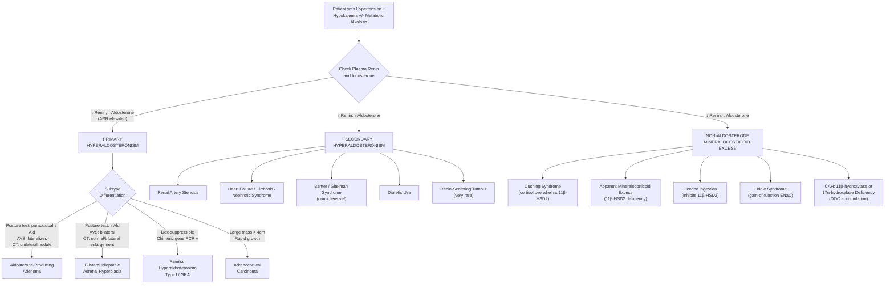

## Differential Diagnosis of Primary Hyperaldosteronism

The differential diagnosis of primary hyperaldosteronism (PA) operates on **two levels**, and it is critical to separate them conceptually:

1. **Level 1 — Is this truly primary hyperaldosteronism, or does the clinical picture (hypertension ± hypokalemia ± metabolic alkalosis) have another cause?** This is the differential of the *presenting syndrome*.
2. **Level 2 — If PA is confirmed, what is the specific *subtype*?** This determines whether you treat with surgery or medication. ***Differentiated by salt-loaded balance study (9am supine + 1pm erect)*** and adrenal vein sampling [4].

Both levels must be addressed systematically.

---

### Level 1: Differential Diagnosis of the Clinical Syndrome (Hypertension + Hypokalemia ± Metabolic Alkalosis)

The clinical triad of **hypertension + hypokalemia + metabolic alkalosis** is NOT pathognomonic for PA. Several conditions share this presentation. The key discriminating tool is the **renin-aldosterone axis** — measuring plasma renin activity (PRA) and serum aldosterone allows you to sort virtually every cause into one of three boxes [1][2][5]:

| Category | Renin | Aldosterone | Examples |
|:---------|:------|:------------|:---------|
| **Primary hyperaldosteronism** | **↓↓** | **↑↑** | APA, BIAH, FH, unilateral hyperplasia, carcinoma |
| **Secondary hyperaldosteronism** | **↑↑** | **↑↑** | Renal artery stenosis, HF, cirrhosis, nephrotic syndrome, Bartter/Gitelman, renin-secreting tumour |
| **Non-aldosterone mineralocorticoid excess** | **↓↓** | **↓↓** | Liddle syndrome, AME, licorice, Cushing syndrome, DOC-secreting tumour, CAH (11β-hydroxylase / 17α-hydroxylase deficiency) |

Let's go through each differential systematically, explaining *why* they mimic PA and *how* to distinguish them.

---

#### A. Secondary Hyperaldosteronism (↑ Renin, ↑ Aldosterone)

In all these conditions, the kidney senses hypoperfusion or hypovolemia → juxtaglomerular cells release renin → RAAS activation → aldosterone is high but *appropriately* so. The key distinguishing point from PA is that **renin is elevated, not suppressed** [1][2].

##### 1. Renal Artery Stenosis (RAS)

- **Mechanism**: Stenosis of one or both renal arteries → ↓ glomerular perfusion pressure → JGA interprets this as hypovolemia → ↑ renin → ↑ Ang II → ↑ aldosterone → Na⁺/H₂O retention + K⁺ loss → hypertension + hypokalemia [5].
- **Clinical clues**: ***Abrupt onset or worsening HTN***, ***flash pulmonary oedema***, renal bruit on auscultation, ***early onset HTN especially in women*** (fibromuscular dysplasia — young females) or atherosclerotic RAS (older males with diffuse vascular disease), ***worsening renal function after starting ACEI/ARB*** (because you block the Ang II–mediated efferent arteriolar constriction that was maintaining GFR in the stenotic kidney) [5].
- **Screen by**: ***Renal duplex USG***, MRA, CT angiography [5].
- **Differentiation from PA**: Renin is **high** (not suppressed). ARR is low or normal.

##### 2. Heart Failure

- **Mechanism**: ↓ Cardiac output → ↓ effective circulating volume → baroreceptor-mediated RAAS activation → secondary hyperaldosteronism.
- **Differentiation from PA**: Obvious clinical context (dyspnoea, oedema, elevated JVP, cardiomegaly). Renin is high. Not typically a diagnostic dilemma.

##### 3. Cirrhosis / Nephrotic Syndrome

- **Mechanism**: ↓ Effective circulating volume (portal hypertension in cirrhosis; hypoalbuminaemia in nephrotic syndrome) → RAAS activation.
- **Differentiation from PA**: Clinical features of liver disease or nephrotic syndrome are usually apparent. Renin is high. Significant oedema and ascites (unlike PA where aldosterone escape limits oedema).

##### 4. Bartter and Gitelman Syndromes

- **Mechanism**: Genetic defects in tubular sodium/chloride reabsorption → salt wasting → volume contraction → secondary RAAS activation → hypokalemic metabolic alkalosis.
  - Bartter syndrome: defect in Na⁺/K⁺/2Cl⁻ cotransporter (NKCC2) in the thick ascending limb (mimics loop diuretic).
  - Gitelman syndrome: defect in NaCl cotransporter (NCC) in DCT (mimics thiazide diuretic).
- **Key difference from PA**: Both syndromes cause hypokalemia and alkalosis but are associated with **normal or LOW blood pressure** (because salt wasting → volume depletion), whereas PA causes **hypertension**. Renin is high [7].
- These are often confused with diuretic abuse — urine chloride and genetic testing help distinguish.

##### 5. Renin-Secreting Tumour (Juxtaglomerular Cell Tumour)

- **Extremely rare**. Autonomous renin production → massively elevated renin → secondary hyperaldosteronism.
- **Differentiation from PA**: Renin is **very high** (not suppressed). Young patients with severe hypertension and hypokalemia. CT/MRI may show a small renal mass.

##### 6. Diuretic Use

- **Mechanism**: Thiazide and loop diuretics → volume depletion → ↑ renin + ↑ aldosterone. Also directly cause K⁺ wasting via ↑ distal Na⁺ delivery and secondary hyperaldosteronism.
- **This is the single most common cause of hypokalemia in hypertensive patients** and must be excluded before attributing hypokalemia to PA [2].
- **Differentiation**: Detailed drug history. ***Exclude other causes of hypoK, e.g. diuretics, GI loss, renal tubular acidosis*** [2]. Note: ***diuretics ↑ renin*** and will therefore confound ARR testing, which is why ***majority of antihypertensives affect renin and aldosterone secretion (except α-blocker, CCB)*** and ***should be stopped for ≥ 2 weeks before dynamic testing*** [2].

<Callout title="Drug Interference with ARR" type="error">
When interpreting the ARR, you MUST account for drug effects:
- **Diuretics** → ↑ renin (can mask PA by lowering the ratio)
- **β-blockers** → ↓ renin (can falsely elevate the ratio, mimicking PA)
- **ACEI/ARB** → ↓ aldosterone, ↑ renin (can mask PA)
- **Spironolactone/eplerenone** → ↑ renin (MUST be stopped ≥ 6 weeks before testing)
- **α-blockers and CCBs** are the least interfering agents and can usually be continued [2].
</Callout>

---

#### B. Non-Aldosterone Mineralocorticoid Excess (↓ Renin, ↓ Aldosterone)

These conditions cause hypertension + hypokalemia + metabolic alkalosis through mineralocorticoid receptor activation or ENaC activation **without aldosterone**. Both renin AND aldosterone are suppressed because the volume expansion from the non-aldosterone mineralocorticoid agent suppresses RAAS, and aldosterone itself is not being produced in excess [1][2].

##### 1. Cushing Syndrome

- **Mechanism**: Cortisol excess → when cortisol levels overwhelm the capacity of 11β-HSD2 in the kidney, cortisol directly activates MR → Na⁺ retention, K⁺ wasting, HTN [3].
- ***Malignant tumour with ectopic ACTH: usually hypoK instead of classical Cushingoid features*** — the onset is usually rapid with very high cortisol that overwhelms 11β-HSD2 [3].
- **Clinical clues**: Cushingoid features (moon face, buffalo hump, striae, proximal myopathy, hyperglycaemia). ***Screen by overnight 1mg dexamethasone suppression test*** [5].
- **Differentiation from PA**: In Cushing, aldosterone is typically **low or normal** (not elevated) because renin is suppressed by volume expansion and the mineralocorticoid effect is from cortisol, not aldosterone. The ***ONDST + spot ARR + 24h urine metanephrines*** are the standard screening trio for functional adrenal tumours [8].

##### 2. Apparent Mineralocorticoid Excess (AME)

- **Mechanism**: Congenital deficiency of **11β-HSD2** → cortisol is not inactivated in MR-expressing renal tubular cells → cortisol activates MR constitutively → same downstream effects as aldosterone (Na⁺ retention, K⁺ loss, HTN).
- **Clinical clues**: Severe hypertension presenting in **childhood**, hypokalemia, metabolic alkalosis, ↓ aldosterone, ↓ renin. Autosomal recessive.
- **Differentiation from PA**: Both renin and aldosterone are **suppressed**. Urine cortisol:cortisone ratio is markedly elevated (normally cortisone predominates in urine because 11β-HSD2 converts cortisol to cortisone; in AME, this conversion fails → urine is dominated by cortisol).

##### 3. Licorice (Liquorice) Ingestion

- **Mechanism**: Glycyrrhizic acid (and its metabolite glycyrrhetinic acid) in licorice **inhibits 11β-HSD2** → same mechanism as AME but acquired, not genetic [3].
- **Clinical clues**: Dietary history! Particularly relevant in Hong Kong where herbal remedies containing licorice root (甘草) are common.
- **Differentiation from PA**: ↓ renin, ↓ aldosterone. Resolves on cessation of licorice intake.

##### 4. Liddle Syndrome

- **"Pseudo-hyperaldosteronism"** — "Liddle" = gain-of-function mutation in **ENaC** (epithelial Na⁺ channel) subunits (β or γ) → constitutive Na⁺ reabsorption in the collecting duct, independent of aldosterone.
- **Mechanism**: The mutations delete the PY motif on the ENaC subunit that is normally recognized by the ubiquitin ligase Nedd4-2 → impaired internalization of ENaC → the channel stays on the apical membrane permanently → continuous Na⁺ reabsorption → volume expansion + K⁺ wasting.
- **Clinical clues**: Autosomal dominant, early-onset severe HTN, hypokalemia. Does NOT respond to spironolactone (because the defect is downstream of MR). **Responds to amiloride or triamterene** (which directly block ENaC) [7].
- **Differentiation from PA**: ↓ renin, ↓ aldosterone. Failure to respond to MRA. Genetic testing confirms.

##### 5. Congenital Adrenal Hyperplasia (CAH) — 11β-Hydroxylase or 17α-Hydroxylase Deficiency

- **Mechanism (11β-hydroxylase deficiency)**: Block in cortisol synthesis → ↑ ACTH → adrenal hyperplasia → accumulation of **11-deoxycorticosterone (DOC)**, a potent mineralocorticoid → Na⁺ retention, K⁺ wasting, HTN [3].
- **Mechanism (17α-hydroxylase deficiency)**: Block upstream → accumulation of DOC + corticosterone → mineralocorticoid excess + HTN. Also causes sexual infantilism (no sex steroids produced).
- **Clinical clues**: Virilization in 11β-hydroxylase deficiency (excess androgens); sexual infantilism in 17α-hydroxylase deficiency. Both present in childhood/adolescence.
- **Differentiation from PA**: ↓ renin, ↓ aldosterone. Elevated 11-deoxycortisol (11β-hydroxylase def) or elevated DOC (both). Genetic testing [3].

##### 6. DOC-Secreting Adrenal Tumour

- Rare adrenal tumour secreting deoxycorticosterone.
- **Differentiation from PA**: ↓ renin, ↓ aldosterone, elevated serum DOC, adrenal mass on imaging.

---

#### C. Other Causes of Hypertension with Hypokalemia (Not Related to Mineralocorticoid Axis)

##### 1. Phaeochromocytoma

- **Mechanism**: Catecholamine excess → paroxysmal/sustained HTN. Hypokalemia can occur via catecholamine-induced β₂-mediated transcellular K⁺ shift (K⁺ driven into cells).
- ***Classic triad: paroxysmal headache, sweating, palpitations*** [4].
- ***5 P's: Pressure (HT), Pain (headache, chest pain), Palpitation, Perspiration, Pallor (vasoconstriction)*** [4].
- **Differentiation from PA**: Paroxysmal nature, dramatic BP swings, postural hypotension (paradoxical — due to chronic volume contraction from catecholamine-mediated vasoconstriction and desensitization). Screen by ***24h urine fractionated metanephrines*** or plasma metanephrines [4][5][8].

##### 2. Essential Hypertension + Diuretic-Induced Hypokalemia

- The **most common clinical scenario** mistaken for PA: patient on thiazide/loop diuretics for essential HTN develops hypokalemia.
- **Differentiation**: Stop diuretics → recheck K⁺. If K⁺ normalizes, the diuretic was the cause. If hypokalemia persists, proceed with ARR screening [2].

##### 3. Chronic Vomiting / GI Losses

- Vomiting → loss of H⁺ and Cl⁻ → metabolic alkalosis → secondary renal K⁺ wasting (kidneys excrete K⁺ to compensate for alkalosis) + volume depletion → secondary hyperaldosteronism → further K⁺ loss [6][7].
- **Differentiation**: History, low urine Cl⁻ (< 10–20 mmol/L = saline-responsive alkalosis), ↑ renin [7].

##### 4. Renal Tubular Acidosis (Types 1 and 2)

- These cause hypokalemia with **metabolic acidosis** (not alkalosis) — this is a crucial differentiating point [6].
- Type 1 (distal) RTA: failure of H⁺ secretion in α-intercalated cells → ↑ K⁺ secretion as compensation.
- Type 2 (proximal) RTA: failure of HCO₃⁻ reabsorption → ↑ Na⁺ delivery distally → exchange for K⁺.
- **Differentiation**: Metabolic acidosis (not alkalosis), urine pH, urine K⁺ > 20 mmol/L, ↑ renin [6].

---

### Level 2: Subtype Differentiation Within Confirmed PA

Once PA is biochemically confirmed (↓ renin, ↑ aldosterone, failure to suppress with salt loading), the critical clinical question becomes: **Is this unilateral (surgical) or bilateral (medical)?** [1][4]

***The two main subtypes are differentiated by salt-loaded balance study (9am supine + 1pm erect)*** [4]:

| Feature | ***Aldosterone-Producing Adenoma (APA)*** | ***Bilateral Idiopathic Adrenal Hyperplasia (BIAH)*** |
|:--------|:----------------------------------------|:-----------------------------------------------------|
| **Laterality** | ***Unilateral*** | ***Bilateral*** |
| **Dependence** | ***ACTH-dependent*** | ***Angiotensin II–dependent*** |
| **Biochemical severity** | ***More significant biochemical disturbance*** | ***Less significant biochemical disturbance*** |
| **Plasma K⁺** | ***Very low to normal*** | ***Low to normal*** |
| **Basal aldosterone** | ***High to very high*** | ***High-normal to high*** |
| **Basal PRA** | ***Low*** | ***Low to low-normal*** |
| **Salt-loading test** | ***Failure or inadequate suppression*** | ***Failure or inadequate suppression*** |
| **Postural test** | ***↓ Ald in 70–90%*** (due to ↓ ACTH drive at noon — ***paradoxical aldosterone, ACTH-dependent production***) | ***↑ Ald in 90%*** (due to ***exaggerated response to ↑ Ang in erect posture — sensitive to postural change***) |
| **Adrenal venous sampling** | ***↑ ipsilaterally, ↓ contralaterally*** | ***↑ bilaterally*** |
| **CT/MRI** | ***Unilateral tumour*** | ***Normal or slightly enlarged*** |

[1][2][4]

#### Explanation of the Postural Test from First Principles

Why does the posture test work? It exploits the different regulatory mechanisms driving aldosterone production in each subtype:

1. **Morning supine position (8–9 am)**: ACTH is at its **diurnal peak** (early morning cortisol surge). Angiotensin II is relatively low because the patient has been lying down all night (no postural RAAS stimulation).

2. **Midday erect position (12–1 pm)**: ACTH has **fallen** from its morning peak (normal diurnal decline). Angiotensin II has **risen** because upright posture → venous pooling → ↓ venous return → ↓ renal perfusion → ↑ renin → ↑ Ang II.

3. **In APA**: The adenoma produces aldosterone in response to **ACTH** (not Ang II). So from morning to noon, ACTH falls → aldosterone falls. This is the ***paradoxical fall*** — paradoxical because you'd normally expect aldosterone to rise on standing [4].

4. **In BIAH**: The hyperplastic tissue responds to **Ang II** (retains normal regulation). From morning to noon, Ang II rises with upright posture → aldosterone rises. This is the ***normal/exaggerated rise*** [4].

<Callout title="Posture Test vs AVS">
The posture test is a nice physiological test but has limitations (sensitivity ~80–90%). **Adrenal vein sampling (AVS) is the gold standard** for lateralization and has largely superseded the posture test in clinical practice. AVS directly measures aldosterone gradients from each adrenal vein.
</Callout>

#### Other Subtypes to Consider

| Subtype | How to Differentiate |
|:--------|:--------------------|
| **Unilateral (primary) adrenal hyperplasia** | Lateralizes on AVS like APA; CT may show diffuse adrenal thickening rather than a discrete nodule; responds to adrenalectomy |
| ***Familial hyperaldosteronism type I (GRA)*** | ***Dexamethasone-suppressible***; elevated 18-oxocortisol and 18-hydroxycortisol in urine; confirmed by ***long-range PCR for chimeric CYP11B1/CYP11B2 gene***. Screen in patients with PA and ***family history of early-onset HTN or cerebrovascular event < 40 years*** [1][2] |
| **FH-II, FH-III, FH-IV** | Clinical PA with strong family history; genetic testing (CLCN2, KCNJ5 germline, CACNA1H respectively) |
| **Aldosterone-producing adrenocortical carcinoma** | Large mass ( > 4 cm), heterogeneous on CT, may co-secrete cortisol/androgens, rapid progression |

---

### Comprehensive Differential Diagnosis Flowchart

---

### Key Differentiating Investigations at a Glance

| Differential | Key Investigation | Expected Finding |
|:-------------|:-----------------|:-----------------|
| PA vs secondary hyperaldosteronism | ARR | PA: ↑ ARR (↓ renin, ↑ aldo). Secondary: ↓ ARR (↑ renin, ↑ aldo) |
| PA vs non-aldo mineralocorticoid excess | Serum aldosterone | PA: ↑. Non-aldo excess: ↓ |
| APA vs BIAH | ***Postural test*** | ***APA: paradoxical ↓ Ald. BIAH: ↑ Ald*** |
| APA vs BIAH | ***Adrenal venous sampling*** | ***APA: ↑ ipsilateral, ↓ contralateral. BIAH: ↑ bilateral*** |
| APA vs BIAH | ***CT/MRI*** | ***APA: unilateral tumour. BIAH: normal or slightly enlarged*** |
| FH-I (GRA) | Dexamethasone suppression + genetic test | Aldosterone suppresses; chimeric gene positive on long-range PCR |
| Cushing syndrome | ***1mg ONDST*** | Cortisol > 50 nmol/L (failure to suppress) |
| Phaeochromocytoma | ***24h urine metanephrines*** | Elevated fractionated metanephrines |
| RAS | ***Renal duplex USG*** / MRA | Stenosis demonstrated |
| Liddle syndrome | Trial of amiloride; genetic testing | Responds to amiloride but NOT spironolactone; ENaC mutation confirmed |
| AME / Licorice | Urine cortisol:cortisone ratio | Elevated ratio (cortisol not converted to cortisone) |

[1][2][4][5][8]

---

### Common Exam Pitfalls

<Callout title="Classic Exam Traps" type="error">

1. **Assuming hypokalemia is required for PA diagnosis**: Most PA patients are **normokalemic**. Hypokalemia has only ~50% sensitivity. Always screen with ARR, not K⁺ alone.

2. **Forgetting to stop interfering drugs before ARR testing**: β-blockers ↓ renin → false-positive ARR. Diuretics ↑ renin → false-negative ARR. ***Stop antihypertensives for ≥ 2 weeks before dynamic testing*** (except α-blockers and CCBs) [2].

3. **Confusing Bartter/Gitelman with PA**: Both cause hypokalemic alkalosis, but Bartter/Gitelman patients are **normotensive or hypotensive** (salt wasting!) with **high renin**. PA patients are **hypertensive** with **low renin**.

4. **Forgetting Liddle syndrome**: Presents identically to PA but does NOT respond to spironolactone (because the defect is ENaC, downstream of MR). Responds to amiloride. Aldosterone is **low**.

5. **CT alone cannot distinguish APA from BIAH**: Small adenomas may be missed; non-functioning incidentalomas are common (especially > 40 years). ***Adrenal venous sampling is the gold standard*** for lateralization [1][9].

</Callout>

---

<Callout title="High Yield Summary">

**Level 1 — Is this PA or something else?**

Use the renin-aldosterone framework:
- **↓ Renin + ↑ Aldosterone** → Primary hyperaldosteronism (PA)
- **↑ Renin + ↑ Aldosterone** → Secondary hyperaldosteronism (RAS, HF, cirrhosis, diuretics, Bartter/Gitelman)
- **↓ Renin + ↓ Aldosterone** → Non-aldosterone mineralocorticoid excess (Cushing, AME, licorice, Liddle, CAH)

Most important differentials to exclude: diuretic use (commonest cause of hypoK in HTN patients), Cushing syndrome, phaeochromocytoma, RAS.

Standard screening panel for secondary HTN / adrenal incidentaloma: **ONDST + spot ARR + 24h urine metanephrines** [8].

**Level 2 — Subtype differentiation within PA (APA vs BIAH):**

| | APA | BIAH |
|:--|:----|:-----|
| Regulation | ACTH-dependent | Ang II–dependent |
| Posture test | Paradoxical ↓ Ald | ↑ Ald |
| AVS | Lateralizes | Bilateral |
| CT | Unilateral | Normal/bilateral |
| Treatment | Surgery | Medical (MRA) |

Special subtypes: FH-I (GRA) — dexamethasone-suppressible, chimeric gene on PCR; adrenal carcinoma — large, aggressive.

</Callout>

---

<ActiveRecallQuiz
  title="Active Recall - Differential Diagnosis of Primary Hyperaldosteronism"
  items={[
    {
      question: "A patient has hypertension, hypokalemia, and metabolic alkalosis. Renin is suppressed but aldosterone is also suppressed. What is the most likely category of diagnosis, and name three specific conditions.",
      markscheme: "Non-aldosterone mineralocorticoid excess. Examples (any 3): Liddle syndrome, apparent mineralocorticoid excess (11-beta-HSD2 deficiency), licorice ingestion, Cushing syndrome (cortisol overwhelming 11-beta-HSD2), CAH (11-beta-hydroxylase or 17-alpha-hydroxylase deficiency causing DOC accumulation), DOC-secreting tumour."
    },
    {
      question: "Why does an aldosterone-producing adenoma show a paradoxical fall in aldosterone on the postural stimulation test, while bilateral idiopathic hyperplasia shows a rise?",
      markscheme: "APA is ACTH-dependent: ACTH peaks in the early morning and falls by noon, so aldosterone follows the diurnal ACTH decline regardless of posture. BIAH retains angiotensin II responsiveness: standing increases renin/Ang II, which drives aldosterone up in the hyperplastic tissue."
    },
    {
      question: "A young woman presents with severe hypertension and hypokalemia. Renin and aldosterone are both suppressed. She does not respond to spironolactone but responds well to amiloride. What is the diagnosis and what is the underlying mechanism?",
      markscheme: "Liddle syndrome. Gain-of-function mutation in ENaC beta or gamma subunit (deletion of PY motif) leading to impaired Nedd4-2-mediated channel internalization. Constitutive Na reabsorption independent of aldosterone. Spironolactone is ineffective because the defect is downstream of the mineralocorticoid receptor. Amiloride directly blocks ENaC."
    },
    {
      question: "Name three classes of antihypertensives that interfere with the ARR and explain the direction of their effect on the ratio.",
      markscheme: "1. Beta-blockers: decrease renin, which falsely elevates ARR (false positive). 2. Diuretics: increase renin, which falsely lowers ARR (false negative). 3. ACEI/ARB: decrease aldosterone and increase renin, which falsely lowers ARR (false negative). Alpha-blockers and CCBs have minimal effect and can be continued."
    },
    {
      question: "How do you differentiate Bartter/Gitelman syndrome from primary hyperaldosteronism? Both cause hypokalemic metabolic alkalosis.",
      markscheme: "Bartter/Gitelman: normotensive or hypotensive (salt wasting), HIGH renin, HIGH aldosterone (secondary hyperaldosteronism). PA: HYPERTENSIVE, LOW renin, HIGH aldosterone. Bartter mimics loop diuretic use (NKCC2 defect), Gitelman mimics thiazide use (NCC defect)."
    }
  ]}
/>

## References

[1] Senior notes: Ryan Ho Endocrine.pdf (Section 3.2.1 Primary Hyperaldosteronism, p.57–59)
[2] Senior notes: Ryan Ho Fundamentals.pdf (Section 3.8.3 Primary Hyperaldosteronism, p.433–434)
[3] Senior notes: Adrian Lui Pediatrics.pdf (Section 8.3.2 Cushing's Syndrome, p.283–285)
[4] Senior notes: maxim.md (Conn's syndrome — Differential diagnosis section)
[5] Senior notes: Ryan Ho Cardiology.pdf (Section 3.6 Hypertension — Secondary HTN workup, p.176–178)
[6] Senior notes: Ryan Ho Chemical Path.pdf (Hypokalemia approach, p.18)
[7] Senior notes: Ryan Ho Urogenital.pdf (Metabolic alkalosis and Type IV RTA, p.45–51)
[8] Senior notes: maxim.md (Adrenal incidentaloma — Screening tests: ONDST + spot ARR + 24h urine metanephrines)
[9] Senior notes: Ryan Ho Diagnostic Radiology.pdf (Interventional Radiology — Adrenal venous sampling, p.79)
