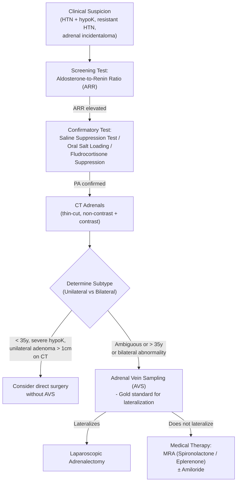

# Primary Hyperaldosteronism (Conn's Syndrome)

## 1. Definition

Primary hyperaldosteronism (PA) refers to a group of conditions in which aldosterone production by the adrenal glands is **inappropriately high**, **relatively autonomous of the renin-angiotensin-aldosterone system (RAAS)**, and **non-suppressible by sodium loading** [1][2].

Let's break down the name:
- **"Primary"** = the problem originates in the adrenal gland itself (as opposed to secondary hyperaldosteronism, where the adrenal is being driven by elevated renin from elsewhere).
- **"Hyper-aldo-steronism"** = excessive ("hyper") production of aldosterone (an adrenal steroid hormone).
- **"Conn's syndrome"** — strictly speaking, this eponym refers specifically to an **aldosterone-producing adenoma (APA)**, first described by Jerome Conn in 1955, but it is often used loosely as a synonym for all forms of primary hyperaldosteronism.

The hallmark biochemical signature is:

| Hormone | Primary Hyperaldosteronism | Secondary Hyperaldosteronism |
|:--------|:--------------------------|:----------------------------|
| Renin | **↓↓ (suppressed)** | ↑↑ |
| Aldosterone | **↑↑** | ↑↑ |

Why is renin suppressed? Because the autonomous aldosterone causes sodium and water retention → expanded plasma volume → the juxtaglomerular apparatus senses adequate (or excess) perfusion and shuts off renin production via negative feedback. This is the critical distinguishing feature from secondary causes [1][2].

<Callout title="Key Concept">
Primary hyperaldosteronism = **↓ renin + ↑ aldosterone**. This is what separates it from secondary hyperaldosteronism (↑ renin + ↑ aldosterone), where the adrenal is responding appropriately to a signal from the kidney.
</Callout>

---

## 2. Epidemiology

- **Prevalence**: PA is the **most common cause of secondary hypertension** [1][2].
  - Found in approximately **5–13% of all hypertensive patients** (much higher than the previously quoted 1–2%).
  - Among patients with **resistant hypertension** (BP uncontrolled on ≥ 3 drugs), prevalence rises to **17–23%**.
  - Among hypertensive patients with **spontaneous hypokalemia**, prevalence may exceed **30–40%** [2].

- **Demographics**:
  - Slight **female predominance** for aldosterone-producing adenomas (APA) (F > M).
  - Peak age of diagnosis: **30–50 years** (typically younger than essential hypertension).
  - Bilateral idiopathic hyperplasia (BIH/BIAH) is slightly more common in **older males** [1].

- **Hong Kong perspective**: Given the high prevalence of hypertension in Hong Kong (~27% of adults), PA is significantly under-diagnosed. Increased awareness and ARR screening have led to a rise in detected cases in Queen Mary Hospital and Prince of Wales Hospital cohorts [2].

<Callout title="High Yield for Exams" type="idea">
PA is NOT rare. It is the **single most common curable cause of secondary hypertension**. The old teaching that PA presents with hypokalemia is misleading — **most patients with PA are normokalemic** at presentation (only ~30–50% are hypokalemic). Screen with ARR, not with potassium alone.
</Callout>

---

## 3. Anatomy and Physiology of the Adrenal Cortex (Relevant to Aldosterone)

### 3.1 Adrenal Cortex Layers

The adrenal cortex has three histological zones — think **"GFR" = salt, sugar, sex**:

| Zone | Product | Mnemonic |
|:-----|:--------|:---------|
| **Zona Glomerulosa** (outermost) | **Mineralocorticoids (Aldosterone)** | "Salt" |
| Zona Fasciculata (middle) | Glucocorticoids (Cortisol) | "Sugar" |
| Zona Reticularis (innermost) | Androgens (DHEA, androstenedione) | "Sex" |

Aldosterone is synthesized exclusively in the **zona glomerulosa** because this is the only zone that expresses **aldosterone synthase (CYP11B2)** — the final enzyme converting corticosterone → 18-hydroxycorticosterone → aldosterone [1][3].

### 3.2 Normal Regulation of Aldosterone Secretion

***Aldosterone secretion is primarily controlled by:*** [1]

1. **Renin-Angiotensin-Aldosterone System (RAAS)** — the **dominant regulator**:
   - ↓ Renal perfusion pressure / ↓ Na delivery to the macula densa / sympathetic stimulation → **juxtaglomerular cells** release **renin** → renin cleaves angiotensinogen (from liver) → **angiotensin I** → converted by **ACE** (mainly in pulmonary endothelium) → **angiotensin II** → stimulates zona glomerulosa → **↑ aldosterone** [1].

2. **Serum potassium (K⁺)**: Even small increases in K⁺ (0.1–0.2 mmol/L) directly stimulate aldosterone release. This is a critical safety mechanism to prevent fatal hyperkalemia [1].

3. **ACTH**: Has a **minor, short-term** stimulatory effect. It causes a transient rise in aldosterone but this is not sustained (unlike cortisol). However, in **aldosterone-producing adenomas**, some tumours are more ACTH-responsive — this becomes important in lateralization testing [1][4].

4. **Other factors**: Atrial natriuretic peptide (ANP) → inhibits aldosterone; dopamine → inhibits aldosterone [1].

### 3.3 Mechanism of Aldosterone Action

***Aldosterone acts on the mineralocorticoid receptor (MR)*** in the **principal cells** of the **distal convoluted tubule (DCT) and cortical collecting duct (CCD)** [1][2]:

1. Aldosterone → binds intracellular MR → nuclear translocation → ↑ transcription of:
   - **ENaC (epithelial sodium channel)** on the apical membrane → ↑ Na⁺ reabsorption from lumen into cell
   - **Na⁺/K⁺-ATPase** on the basolateral membrane → pumps Na⁺ into interstitium, K⁺ into cell
   - **ROMK (renal outer medullary K⁺ channel)** → ↑ K⁺ secretion into lumen

2. Net effect:
   - **↑ Na⁺ and water reabsorption** → volume expansion → hypertension
   - **↑ K⁺ secretion** → hypokalemia
   - **↑ H⁺ secretion** (via H⁺/K⁺ exchange and ↑ electrochemical gradient) → metabolic alkalosis

<Callout title="Why Metabolic Alkalosis?">
When aldosterone drives K⁺ out of the body, the kidney tries to compensate by excreting H⁺ in place of K⁺ via the H⁺/K⁺-ATPase in α-intercalated cells. Additionally, the lumen-negative transepithelial voltage (created by Na⁺ reabsorption through ENaC) favours H⁺ secretion. The result: you lose H⁺ in the urine → the blood becomes alkalotic.
</Callout>

### 3.4 Why Does Cortisol Not Normally Activate Mineralocorticoid Receptors?

This is a critical concept. Cortisol circulates at concentrations **100–1000× higher** than aldosterone and has equal affinity for the MR. So why doesn't cortisol cause mineralocorticoid excess?

**Answer: 11β-Hydroxysteroid Dehydrogenase type 2 (11β-HSD2)**

This enzyme sits in MR-expressing cells (DCT/CCD) and converts **cortisol → cortisone** (which is inactive at MR). It acts as a "gatekeeper," ensuring only aldosterone activates the MR [3].

When 11β-HSD2 is deficient or inhibited (e.g., by **liquorice/licorice** containing glycyrrhizic acid), cortisol floods the MR → **apparent mineralocorticoid excess (AME) syndrome** — clinically mimics PA but with ↓ aldosterone and ↓ renin [3].

---

## 4. Etiology (with Hong Kong Focus)

### 4.1 Causes of Primary Hyperaldosteronism

| Cause | Frequency | Key Features |
|:------|:----------|:-------------|
| ***Bilateral idiopathic adrenal hyperplasia (BIAH/IHA)*** | ***60–70%*** | Most common overall; bilateral; aldosterone responds to posture (angiotensin II–sensitive) |
| ***Aldosterone-producing adenoma (APA / Conn's syndrome)*** | ***30–40%*** | Younger patients; more severe hypokalemia and HTN; usually unilateral |
| **Unilateral (primary) adrenal hyperplasia** | ~2–3% | Behaves like APA; lateralizes on AVS |
| ***Familial hyperaldosteronism (FH)*** | ~1–5% | FH-I (GRA), FH-II, FH-III, FH-IV |
| **Aldosterone-producing adrenocortical carcinoma** | < 1% | Very rare; large mass; suspect if > 4 cm |
| **Ectopic aldosterone-producing adenoma** | Extremely rare | Case reports only (e.g., ovarian, renal) |

[1][2][4]

<Callout title="Exam Trap" type="error">
Note that different sources quote different frequencies. **Ryan Ho Fundamentals** [2] lists adenoma as 60–70% and hyperplasia as 20–40%, while **Ryan Ho Endocrine** [1] lists the reverse (adenoma 30–40%, BIAH 60–70%). The **current (2025 Endocrine Society)** consensus and most international references state **BIAH is more common (60–70%)** and APA is 30–40%. The shift occurred because widespread ARR screening now detects milder, bilateral disease that was previously missed. Use the updated figures.
</Callout>

### 4.2 Detailed Pathophysiology by Etiology

#### A. Aldosterone-Producing Adenoma (APA) — "Classic Conn's Syndrome"

- A **benign adrenocortical neoplasm** arising from zona glomerulosa cells.
- The adenoma **autonomously** secretes aldosterone independent of RAAS — it does NOT require angiotensin II stimulation.
- Many APAs harbour somatic **gain-of-function mutations** in ion channels/pumps:
  - **KCNJ5 mutations** (most common, ~40–70% of APAs, especially in East Asian populations including Hong Kong): Encodes GIRK4 (G-protein–activated inwardly rectifying K⁺ channel) in glomerulosa cells. Mutations cause Na⁺ influx → membrane depolarization → Ca²⁺ entry → constitutive aldosterone production and cell proliferation [1].
  - **ATP1A1** (Na⁺/K⁺-ATPase α1 subunit) and **ATP2B3** (Ca²⁺-ATPase) mutations
  - **CACNA1D** (voltage-gated Ca²⁺ channel) mutations
  - **CTNNB1** (β-catenin / Wnt pathway) mutations
- Because production is ACTH-dependent to a degree (but NOT angiotensin II–dependent), aldosterone shows a ***paradoxical response*** during posture testing — aldosterone ***falls or does not rise*** on standing because the adenoma follows the diurnal ACTH pattern (ACTH is highest in the morning supine sample and falls throughout the day) rather than responding to upright-posture–stimulated renin [4].
- Typically presents with ***younger age***, ***more severe hypokalemia***, and ***higher aldosterone levels*** than BIAH [1].
- **Surgically curable** by laparoscopic adrenalectomy [4].

#### B. Bilateral Idiopathic Adrenal Hyperplasia (BIAH / IHA)

- **Bilateral zona glomerulosa hyperplasia** → excessive aldosterone from both glands.
- The pathogenesis is incompletely understood; the hyperplastic tissue **retains responsiveness to angiotensin II** (unlike APA).
- Therefore, aldosterone ***rises with upright posture*** (because standing → ↑ renin → ↑ Ang II → ↑ aldosterone in the still-responsive hyperplastic tissue) [4].
- Typically presents with **milder** hypokalemia (or normokalemia) and **less severe** hypertension than APA.
- **NOT curable surgically** (bilateral adrenalectomy would cause Addisonian crisis) → managed **medically** with mineralocorticoid receptor antagonists (MRAs) [4].

#### C. Familial Hyperaldosteronism (FH)

There are now **four recognized types** (the Endocrine Society 2024 classification):

| Type | Gene/Mechanism | Key Features |
|:-----|:---------------|:-------------|
| ***FH-I (Glucocorticoid-remediable aldosteronism, GRA)*** | **Chimeric CYP11B1/CYP11B2 gene** (AD inheritance) | Aldosterone secretion driven by ACTH (from zona fasciculata); **suppressible by dexamethasone**; associated with **early-onset HTN** and **haemorrhagic stroke** (berry aneurysms); diagnose by **long-range PCR** for the chimeric gene |
| FH-II | *CLCN2* (chloride channel) mutations | Clinically indistinguishable from sporadic PA; does NOT suppress with dexamethasone |
| FH-III | *KCNJ5* germline mutations | Severe, early-onset PA often requiring bilateral adrenalectomy |
| FH-IV | *CACNA1H* (T-type Ca²⁺ channel) mutations | Rare; variable severity |

***FH-I (GRA) deserves special attention*** [1][2]:
- The CYP11B1 (11β-hydroxylase, normally in zona fasciculata) and CYP11B2 (aldosterone synthase, normally in zona glomerulosa) genes sit next to each other on chromosome 8q.
- An unequal crossover during meiosis creates a **chimeric gene** with the **ACTH-responsive promoter of CYP11B1** fused to the **coding sequence of CYP11B2**.
- Result: aldosterone synthase activity is now expressed in the **zona fasciculata** and driven by **ACTH** instead of angiotensin II.
- This means aldosterone follows the **diurnal cortisol/ACTH rhythm** and can be **suppressed by exogenous glucocorticoids** (hence "glucocorticoid-remediable").
- Also produces **18-oxocortisol** and **18-hydroxycortisol** (hybrid steroids) — these are diagnostic markers.

#### D. Unilateral Primary Adrenal Hyperplasia

- Zona glomerulosa hyperplasia confined to **one adrenal gland**.
- Behaves clinically like APA — lateralizes on adrenal vein sampling (AVS).
- Responds to **unilateral adrenalectomy**.

#### E. Aldosterone-Producing Adrenocortical Carcinoma

- **Extremely rare** (< 1%).
- Suspect when: adrenal mass **> 4 cm**, irregular margins, heterogeneous enhancement, local invasion.
- May co-secrete cortisol, androgens.
- Poor prognosis.

### 4.3 Secondary Hyperaldosteronism (for Comparison)

These are NOT "primary" but are important differential diagnoses [1][2]:

| Mechanism | Examples |
|:----------|:---------|
| ↓ Renal perfusion | Renal artery stenosis, heart failure |
| Third-space fluid loss | Cirrhosis (↓ effective circulating volume), nephrotic syndrome |
| Salt-losing states | Bartter syndrome, Gitelman syndrome |
| Renin-secreting tumours | Juxtaglomerular cell tumour (very rare) |

In all these, **renin is elevated** because the kidney perceives hypovolaemia or hypoperfusion → drives RAAS → aldosterone rises appropriately. The aldosterone is **not autonomous** — it is a physiological response.

### 4.4 Conditions That Mimic Primary Hyperaldosteronism

These present with **hypertension + hypokalemia + metabolic alkalosis** but through **non-aldosterone mineralocorticoid pathways** (both renin AND aldosterone are suppressed):

| Condition | Mechanism |
|:----------|:----------|
| **Apparent mineralocorticoid excess (AME)** | 11β-HSD2 deficiency → cortisol activates MR |
| **Licorice ingestion** | Glycyrrhizic acid inhibits 11β-HSD2 |
| **Cushing syndrome** | Cortisol overwhelms 11β-HSD2 capacity |
| **Liddle syndrome** | Gain-of-function ENaC mutation → constitutive Na⁺ reabsorption |
| **Congenital adrenal hyperplasia (11β-hydroxylase or 17α-hydroxylase deficiency)** | Accumulation of DOC (deoxycorticosterone), a potent mineralocorticoid |

<Callout title="Distinguishing Low-Renin Hypertension">

**↓ Renin + ↑ Aldosterone** = Primary hyperaldosteronism

**↓ Renin + ↓ Aldosterone** = Non-aldosterone mineralocorticoid excess (Liddle, AME, licorice, CAH, DOC-secreting tumour)

**↑ Renin + ↑ Aldosterone** = Secondary hyperaldosteronism

This simple 2×2 framework covers all the differentials.
</Callout>

---

## 5. Classification

### 5.1 By Pathology (as above)

1. **Aldosterone-producing adenoma (APA)** — 30–40%
2. **Bilateral idiopathic adrenal hyperplasia (BIAH/IHA)** — 60–70%
3. **Unilateral (primary) adrenal hyperplasia** — ~2–3%
4. **Familial hyperaldosteronism (FH-I through FH-IV)** — ~1–5%
5. **Aldosterone-producing adrenocortical carcinoma** — < 1%
6. **Ectopic aldosterone-secreting tumour** — extremely rare

### 5.2 By Laterality (Drives Management)

This is the **most clinically important classification** because it determines treatment:

| Unilateral | Bilateral |
|:-----------|:----------|
| APA | BIAH |
| Unilateral adrenal hyperplasia | FH-I, FH-II |
| Adrenocortical carcinoma | FH-III (some require bilateral adrenalectomy) |
| **Treatment: Surgery (adrenalectomy)** | **Treatment: Medical (MRA)** |

[1][4]

### 5.3 By Posture Test Response (Used Historically for Subtyping)

***Differentiated by salt-loaded posture study (9am supine + 1pm erect):*** [4]

| Subtype | Posture Response | Reason |
|:--------|:----------------|:-------|
| ***APA*** | ***Paradoxical ↓ aldosterone*** (or no change) | Tumour follows ACTH rhythm (falls after morning peak), NOT Ang II |
| ***BIAH*** | ***↑ Aldosterone*** (rises on standing) | Hyperplastic tissue retains angiotensin II responsiveness; upright posture → ↑ renin → ↑ Ang II → ↑ aldosterone |

This test has largely been **superseded by adrenal vein sampling (AVS)** for lateralization but remains conceptually important for understanding the biology [4].

---

## 6. Clinical Features

### 6.1 Overview: Why Does PA Cause Symptoms?

The clinical picture is driven entirely by **excessive aldosterone action**:

```
Excessive Aldosterone
├── ↑ Na⁺ reabsorption → Volume expansion → HYPERTENSION
├── ↑ K⁺ secretion → HYPOKALEMIA
│   ├── Neuromuscular dysfunction
│   ├── Cardiac arrhythmias
│   └── Renal concentrating defect → Polyuria
├── ↑ H⁺ secretion → METABOLIC ALKALOSIS
│   └── ↓ Ionized Ca²⁺ → Tetany
└── Direct end-organ damage (independent of BP)
    ├── Cardiac fibrosis / LVH
    ├── Renal damage
    ├── Vascular stiffness
    └── Metabolic syndrome features
```

### 6.2 Symptoms

#### A. Hypertension-Related Symptoms

- **Headache, dizziness, visual disturbance**: From sustained hypertension. PA should be suspected in any **young-onset**, **drug-resistant**, or **severe** hypertension [2][5].
- **Epistaxis**: Hypertensive vascular fragility in nasal mucosa.
- Often **asymptomatic** — detected incidentally on routine BP check or blood tests.

*Why is HTN in PA often resistant to treatment?* Because conventional antihypertensives don't address the root cause — autonomous aldosterone excess. The volume expansion from Na⁺ retention persists unless you specifically block the MR or remove the source.

#### B. Hypokalemia-Related Symptoms [2]

> **Important caveat**: ***Only 30–50% of PA patients are hypokalemic*** at presentation. Normokalemia does NOT exclude PA. Hypokalemia becomes more likely with:
> - More severe/autonomous aldosterone excess (APA > BIAH)
> - Higher dietary Na⁺ intake (more Na⁺ delivered to DCT for exchange with K⁺)
> - Concurrent diuretic use

- ***Neuromuscular symptoms:***
  - **Muscle weakness, cramps, flaccid paralysis** — because hypokalemia hyperpolarizes the resting membrane potential of muscle cells (more negative Vm), making it harder to reach threshold → ↓ excitability → weakness. Severe hypokalemia (< 2.5 mmol/L) can cause **rhabdomyolysis** [2].
  - **Paraesthesiae** — partly due to hypokalemia, partly due to **hypomagnesemia** (aldosterone also increases Mg²⁺ loss in the DCT) [2].

- ***Renal symptoms:***
  - **Polydipsia, polyuria, nocturia** — because chronic hypokalemia damages the renal collecting duct epithelium and impairs the response to ADH (aquaporin-2 downregulation) → **nephrogenic diabetes insipidus** → inability to concentrate urine → polyuria → compensatory polydipsia [2].

- ***Cardiac symptoms:***
  - **Palpitations** — hypokalemia predisposes to cardiac arrhythmias (prolonged QT, U waves, atrial and ventricular ectopics, potentially VT/VF in severe cases). Hypokalemia hyperpolarizes myocytes but also prolongs repolarization by ↓ IKr and IKs currents.

#### C. Metabolic Alkalosis-Related Symptoms [2]

- ***Latent or overt tetany*** — metabolic alkalosis increases the binding of Ca²⁺ to albumin (H⁺ and Ca²⁺ compete for albumin binding sites; when blood is alkalotic, fewer H⁺ compete → more Ca²⁺ binds albumin → ↓ ionized/free Ca²⁺) → nerve hyperexcitability → tetany [2].
- **Chvostek's and Trousseau's signs** may be positive.

#### D. Volume Expansion-Related Symptoms

- ***Mild peripheral oedema*** — Na⁺ and water retention causes transient volume expansion. However, in PA, "aldosterone escape" occurs: the initial Na⁺ retention expands volume → ↑ ANP release → ↓ proximal tubule Na⁺ reabsorption → limits further Na⁺ retention. This is why **massive oedema and frank heart failure are unusual** in PA (unlike in secondary hyperaldosteronism where the RAAS drive is continuous) [1].

<Callout title="Aldosterone Escape">
In PA, after initial volume expansion, the body adapts through increased ANP secretion and pressure natriuresis. Na⁺ reabsorption partially normalizes. This explains why: (1) serum Na⁺ is usually only at the **upper end of normal** rather than frankly elevated, and (2) oedema is often minimal. K⁺ wasting, however, does NOT escape — it continues unabated because the distal tubule mechanisms for K⁺ secretion remain driven by aldosterone.
</Callout>

#### E. End-Organ Damage Symptoms (Beyond What BP Alone Would Cause)

Modern evidence shows that aldosterone has **direct pathological effects** on the heart, vessels, and kidneys **independent of blood pressure**:

- **Disproportionate LVH** (compared to essential hypertension with the same BP level) — aldosterone directly stimulates cardiac fibroblasts → collagen deposition → myocardial fibrosis.
- **↑ Risk of stroke, MI, and atrial fibrillation** — out of proportion to BP elevation.
- **↑ Albuminuria / proteinuria** — aldosterone causes renal endothelial dysfunction and podocyte injury.
- **Metabolic syndrome features**: aldosterone impairs insulin signalling → ↑ risk of glucose intolerance / diabetes.

### 6.3 Signs

| Sign | Pathophysiological Basis |
|:-----|:------------------------|
| **Hypertension** (often moderate-to-severe, may be resistant) | Aldosterone → ↑ Na⁺/H₂O reabsorption → volume expansion → ↑ BP. Also: aldosterone → vascular smooth muscle hypertrophy and ↑ vascular stiffness |
| **Usually NO peripheral oedema** (or only mild) | Aldosterone escape phenomenon (ANP-mediated pressure natriuresis) limits Na⁺ retention |
| **Hypertensive retinopathy** (fundoscopy) | Chronic hypertension → arteriolar wall changes → AV nipping, cotton wool spots, flame haemorrhages |
| **LVH** (displaced apex beat, S4 gallop on auscultation) | Direct fibrotic effect of aldosterone on myocardium + afterload from HTN |
| **Proximal myopathy / hypotonia** | Severe hypokalemia → impaired muscle depolarization |
| **Hyporeflexia** | Hypokalemia → hyperpolarized motor neuron and muscle membrane → ↓ reflex arc |
| **Chvostek's / Trousseau's signs** (if severe alkalosis) | Metabolic alkalosis → ↓ ionized Ca²⁺ → neuromuscular hyperexcitability |
| **Postural hypotension (occasionally)** | Paradoxical — despite volume expansion, chronic hypokalemia can impair vascular tone and autonomic function |

<Callout title="What You Will NOT Typically See in PA">
- **Gross oedema** — aldosterone escape prevents this.
- **Hypernatremia** — aldosterone escape also limits Na⁺ accumulation; Na⁺ is usually only at the upper end of normal (140–145 mmol/L).
- **Cushingoid features** — unless there is co-secretion of cortisol (adrenocortical carcinoma or ACTH-dependent causes).
</Callout>

### 6.4 Summary of Typical Clinical Presentation

The "classic" patient with PA:
1. **Young or middle-aged** (30–50 years)
2. **Moderate-to-severe or drug-resistant hypertension**
3. **Spontaneous hypokalemia** (but may be normokalemic!)
4. **Metabolic alkalosis** on ABG/VBG
5. **Serum Na⁺** at the upper end of the normal range
6. **Urine K⁺ > 30 mmol/day** (inappropriate kaliuresis — the kidney is wasting K⁺ despite hypokalemia)
7. Symptoms of neuromuscular irritability, polyuria, nocturia

### 6.5 When to Suspect PA — Screening Indications (Endocrine Society 2024 / ACC/AHA)

***Screen for PA with ARR when:*** [1][2][5]

- ***Sustained BP > 150/100 mmHg*** (or resistant HTN on ≥ 3 drugs)
- ***Hypertension with spontaneous or diuretic-induced hypokalemia***
- ***Hypertension with adrenal incidentaloma***
- ***Hypertension with sleep apnea***
- ***Hypertension with a family history of early-onset hypertension or cerebrovascular event at young age (< 40)***
- ***Hypertension with a first-degree relative who has confirmed PA***
- ***All hypertensive patients (some guidelines now recommend universal screening)***

> **The Endocrine Society 2024 guidelines have broadened the indications for PA screening. Given that PA is the most common cause of secondary hypertension and is associated with excess cardiovascular morbidity beyond BP alone, there is a strong argument for screening all hypertensive patients.**

---

## 7. Approach to the Patient with Suspected Primary Hyperaldosteronism



*This algorithmic approach will be elaborated in the subsequent diagnostic and management sections.*

---

<Callout title="High Yield Summary">

**Definition**: Primary hyperaldosteronism = autonomous, non-suppressible aldosterone excess → ↓ renin + ↑ aldosterone.

**Epidemiology**: Most common cause of secondary HTN (5–13% of HTN patients; up to 20% of resistant HTN). Under-diagnosed.

**Causes (by frequency)**:
1. Bilateral idiopathic adrenal hyperplasia (BIAH) — 60–70%
2. Aldosterone-producing adenoma (APA) — 30–40%
3. Familial hyperaldosteronism — 1–5%
4. Others (unilateral hyperplasia, carcinoma) — rare

**Biochemical hallmark**: ↓ Renin, ↑ Aldosterone (vs. secondary: ↑↑ Renin, ↑ Aldosterone).

**Pathophysiology**: Aldosterone → ↑ ENaC activity → ↑ Na⁺/H₂O retention (HTN) + ↑ K⁺ excretion (hypokalemia) + ↑ H⁺ excretion (metabolic alkalosis). Direct end-organ damage (cardiac fibrosis, vascular stiffness, renal injury) independent of BP.

**Clinical Features**:
- Moderate-severe or resistant hypertension
- Hypokalemia (only 30–50%; normokalemia does NOT exclude PA)
- Metabolic alkalosis
- Neuromuscular symptoms: weakness, cramps, paraesthesiae, tetany
- Renal symptoms: polyuria, nocturia (nephrogenic DI from hypoK)
- Disproportionate LVH, ↑ CV risk

**Posture Test**: APA = paradoxical fall (ACTH-dependent); BIAH = appropriate rise (Ang II–responsive).

**Screening**: ARR (aldosterone-to-renin ratio). Confirm with saline suppression test or oral salt loading.

**Key Distinction for Management**: Unilateral → surgery; Bilateral → medical (MRA).

</Callout>

---

<ActiveRecallQuiz
  title="Active Recall - Primary Hyperaldosteronism (Conn's)"
  items={[
    {
      question: "What is the biochemical hallmark that distinguishes primary from secondary hyperaldosteronism?",
      markscheme: "Primary: LOW renin, HIGH aldosterone. Secondary: HIGH renin, HIGH aldosterone. In primary disease, autonomous aldosterone suppresses renin via negative feedback (volume expansion sensed by JGA)."
    },
    {
      question: "Why are most patients with primary hyperaldosteronism NOT frankly hypernatremic or oedematous despite sodium retention?",
      markscheme: "Aldosterone escape phenomenon: initial volume expansion triggers ANP release and pressure natriuresis, which limits further Na and water retention. K wasting does NOT escape."
    },
    {
      question: "Explain why chronic hypokalemia in PA causes polyuria and nocturia.",
      markscheme: "Chronic hypokalemia damages collecting duct epithelium and downregulates aquaporin-2 channels, impairing ADH response (nephrogenic diabetes insipidus). The kidney cannot concentrate urine, leading to dilute polyuria."
    },
    {
      question: "How does the posture (salt-loaded balance) study differentiate APA from BIAH, and what is the physiological basis?",
      markscheme: "APA: aldosterone falls or is unchanged on standing (paradoxical) because the adenoma is ACTH-dependent, not angiotensin II-responsive, and ACTH follows a diurnal fall. BIAH: aldosterone rises on standing because hyperplastic tissue retains angiotensin II responsiveness, and upright posture stimulates renin/Ang II."
    },
    {
      question: "What is glucocorticoid-remediable aldosteronism (FH-I) and how is it diagnosed?",
      markscheme: "Caused by chimeric CYP11B1/CYP11B2 gene from unequal crossover on chromosome 8q. Aldosterone synthase is driven by ACTH (zona fasciculata promoter). Aldosterone is suppressible by dexamethasone. Diagnosed by long-range PCR for the chimeric gene. Associated with early-onset HTN and haemorrhagic stroke."
    },
    {
      question: "Why does metabolic alkalosis in PA cause tetany? Explain the calcium mechanism.",
      markscheme: "Metabolic alkalosis raises blood pH. H+ and Ca2+ compete for albumin binding sites. In alkalosis, fewer H+ ions compete, so more Ca2+ binds albumin, reducing ionized (free) Ca2+. Low ionized Ca2+ increases neuromuscular excitability, causing tetany."
    }
  ]}
/>

---

## References

[1] Senior notes: Ryan Ho Endocrine.pdf (Section 3.2 Mineralocorticoid Disorders, p.57)
[2] Senior notes: Ryan Ho Fundamentals.pdf (Section 3.8.3 Primary Hyperaldosteronism, p.433)
[3] Senior notes: Adrian Lui Pediatrics.pdf (Section 8.3.2 Cushing's Syndrome — 11β-HSD2 discussion, p.284)
[4] Senior notes: maxim.md (Conn's syndrome section, entries 434–435)
[5] Senior notes: Ryan Ho Cardiology.pdf (Section 3.6 Hypertension — Secondary HTN workup, p.175–177)
[6] Senior notes: Ryan Ho Chemical Path.pdf (Hypokalemia approach, p.18)
[7] Senior notes: Ryan Ho Urogenital.pdf (Metabolic alkalosis and Type IV RTA, p.45–51)
