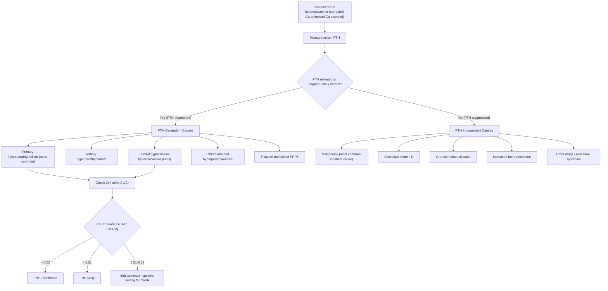

## Differential Diagnosis of Primary Hyperparathyroidism

The differential diagnosis of PHPT is really a two-step problem. First, you're usually starting from the finding of **hypercalcaemia** — so you need to work through the DDx of hypercalcaemia. Second, even once you've identified **PTH-dependent** hypercalcaemia, there are a few conditions that can mimic PHPT. Let's think through this systematically from first principles.

---

### Step 1: The PTH Pivot — PTH-Dependent vs PTH-Independent Hypercalcaemia

The single most important investigation when you encounter hypercalcaemia is the **serum PTH level**. This splits the entire differential into two clean branches [6][9]:

- **PTH-dependent (PTH elevated or inappropriately normal):** The parathyroid glands are driving the hypercalcaemia.
- **PTH-independent (PTH suppressed):** Something *else* is raising calcium, and the parathyroids are appropriately shutting down.

Why does this work? Because the calcium-sensing receptor (CaSR) on parathyroid chief cells normally suppresses PTH when serum Ca²⁺ rises. ***If PTH is NOT suppressed in the setting of hypercalcaemia, either the parathyroid glands are autonomous (PHPT/tertiary) or the set point is shifted (FHH, lithium)*** [9][10].

> ***Even if PTH is within the reference range, a hypercalcaemia of non-parathyroid cause should be accompanied by appropriately suppressed PTH. A "normal" PTH in the face of hypercalcaemia is inappropriately non-suppressed and should trigger workup for primary hyperparathyroidism*** [10].

---

### Step 2: Differential Diagnosis Algorithm

---

### Step 3: Detailed Differential Diagnosis

#### A. PTH-Dependent Causes (↑ or inappropriately normal PTH) [6][9]

| Condition | Key Distinguishing Features | Why PTH is Elevated/Non-Suppressed |
|:--|:--|:--|
| ***Primary hyperparathyroidism*** | Most common outpatient cause of hyperCa. ↑Ca, ↑/N PTH, ↓PO₄, ↑ALP. ***24h urine Ca elevated (CCCR > 0.02)***. Adenoma ~85%, hyperplasia ~10–15%, carcinoma < 1% | Autonomous secretion from abnormal parathyroid tissue — the adenomatous/hyperplastic cells have a shifted calcium set point and proliferate beyond normal feedback control |
| **Tertiary hyperparathyroidism** | History of ***chronic renal failure*** (often on dialysis). Previously had secondary hyperPTH → prolonged parathyroid stimulation → ***glands become autonomous***. Hypercalcaemia persists even after correction of the underlying cause (e.g. post-renal transplant) [3] | Long-standing secondary hyperparathyroidism → parathyroid hyperplasia → eventually some cells acquire autonomous (monoclonal) growth → adenoma formation within hyperplastic glands. The glands no longer respond to normalised calcium levels |
| ***Familial hypocalciuric hypercalcaemia (FHH)*** | ***AD inheritance. Mild, usually asymptomatic hypercalcaemia. Normal or mildly ↑PTH. Low urine Ca, CCCR < 0.01. Normal PO₄.*** Family history of mild hypercalcaemia. ***Does NOT require surgery*** [2][10] | ***Inactivating mutation of CaSR*** → both the parathyroids and the kidneys "think" calcium is lower than it really is. Parathyroids don't suppress PTH; kidneys avidly reabsorb calcium (low urinary Ca). This is NOT a disease — it's a benign reset of the calcium thermostat |
| ***Lithium-induced hyperparathyroidism*** | ***Patient on lithium therapy*** (for bipolar disorder). ***Should stop lithium to evaluate (if safe to do so)*** [1] | Lithium shifts the calcium-PTH set point to the right (similar mechanism to FHH but pharmacological rather than genetic). The parathyroids require a higher Ca²⁺ to suppress PTH → chronic overstimulation → may cause hyperplasia or adenoma over time |
| ***Thiazide-unmasked PHPT*** | Patient on thiazide diuretics with hypercalcaemia. ***Should stop thiazide to evaluate (if safe)*** [1] | Thiazides ↓renal calcium excretion (enhance Ca²⁺ reabsorption in DCT via NCC-related mechanisms). In a patient with subclinical PHPT, thiazide use can tip them over into overt hypercalcaemia. The thiazide itself doesn't cause PHPT but unmasks it. If hypercalcaemia persists after stopping the thiazide, the patient has true PHPT |

<Callout title="FHH — The Trap You Must Not Fall Into" type="error">
***FHH is the most important differential to exclude before committing a patient to parathyroidectomy.*** It mimics PHPT biochemically (↑Ca, ↑/N PTH) but is a benign, lifelong condition requiring NO treatment. Operating on FHH patients does NOT cure the hypercalcaemia (because the renal CaSR is also mutated — they will continue to reabsorb calcium avidly). The key test is the ***24-hour urine calcium and calcium-creatinine clearance ratio (CCCR)***:
- CCCR < 0.01 → FHH
- CCCR > 0.02 → PHPT
- CCCR 0.01–0.02 → indeterminate; consider genetic testing for CaSR mutation

Always check ***family history*** — FHH is autosomal dominant, so multiple family members may have mild asymptomatic hypercalcaemia.
</Callout>

#### B. PTH-Independent Causes (↓ PTH — appropriately suppressed) [6][9][10]

These are the conditions where something other than the parathyroid glands is raising calcium. The intact parathyroid feedback loop correctly suppresses PTH in response.

| Condition | Frequency | Key Features | Mechanism of Hypercalcaemia |
|:--|:--|:--|:--|
| ***Hypercalcaemia of malignancy*** | ***Most common cause of hyperCa in hospitalised patients. HyperCa in ~20% of cancer patients*** | ***PTH suppressed. Ca usually much higher and symptomatic*** (cf. PHPT which is often mild). Common cancers: ***breast, lung, kidney, prostate, multiple myeloma, lymphoma*** [10] | Several mechanisms: (1) ***Ectopic PTHrP production*** (humoral hypercalcaemia of malignancy — "HHM"): PTHrP mimics PTH action on bone and kidney but is NOT detected by standard PTH assays, hence PTH is suppressed. Common in SCC lung, HCC, breast cancer. (2) ***Local osteolysis***: bone metastases directly destroy bone via mechanical compression + local cytokines (IL-6, TNF-β) — common in breast cancer, multiple myeloma. (3) ***Ectopic calcitriol production***: lymphoma cells contain 1α-hydroxylase → ↑1,25-(OH)₂-D |
| ***Granulomatous disease*** | Uncommon | ***↑1,25-(OH)₂-D level***. TB, sarcoidosis, histoplasmosis, coccidioidomycosis, leprosy, berylliosis. In HK, think TB and sarcoidosis | ***Activated macrophages within granulomas express 1α-hydroxylase*** → unregulated conversion of 25-(OH)-D to 1,25-(OH)₂-D (calcitriol) → ↑intestinal Ca absorption and ↑bone resorption. This is extra-renal and NOT regulated by normal feedback [6] |
| **Vitamin D intoxication** | Uncommon | ***↑25-(OH)-D level***, normal or ↑1,25-(OH)₂-D | Excessive exogenous vitamin D supplementation (or consumption of fortified foods) → ↑25-(OH)-D → substrate-driven ↑calcitriol production → ↑Ca absorption. Can also directly act at high concentrations |
| **Milk-alkali syndrome** | Uncommon | History of excessive calcium + absorbable alkali intake (e.g. calcium carbonate antacids). ↑Ca, metabolic alkalosis, renal impairment | Large oral Ca load → mild hyperCa → ↑renal Ca excretion → but alkali component → metabolic alkalosis → ↑renal Ca reabsorption (alkalosis enhances DCT Ca transport) → vicious cycle of worsening hyperCa and renal impairment |
| **Drugs** | Variable | ***Thiazides*** (usually unmask PHPT rather than cause de novo hyperCa), ***lithium*** (shifts set point), ***ranitidine*** (rare), calcium supplements, vitamin A intoxication | Drug-specific mechanisms; always take a thorough drug history |
| **Increased bone resorption (non-malignant)** | Uncommon | ***Thyrotoxicosis*** (↑bone turnover from excess T3/T4), ***Paget's disease*** (especially if immobilised), ***prolonged immobilisation*** (e.g. spinal cord injury, bedbound patient) | Accelerated osteoclastic activity from various stimuli → release of skeletal calcium stores faster than renal excretion can compensate. Usually mild unless coexisting renal impairment |
| **Adrenal insufficiency** | Rare | Features of Addison's disease; ↑Ca usually mild | Mechanism multifactorial: haemoconcentration (↓intravascular volume), ↑renal Ca reabsorption (loss of cortisol's calciuretic effect), ↑bone resorption |
| ***Paraproteinaemia (e.g. MGUS, myeloma)*** | Uncommon | ***↑total protein with normal albumin → ↑globulin. Apparent high Ca may be factitious*** (paraproteins bind calcium → ↑total Ca but normal ionised Ca). Check serum protein electrophoresis [10] | ***Paraproteins can bind calcium***, inflating the total calcium measurement without changing the biologically active ionised fraction. Also, in myeloma, true hyperCa occurs via osteoclast activation (RANKL:OPG imbalance). ***Mnemonic for myeloma: CRAB — Ca↑, Renal insufficiency, Anaemia, Bone lytic lesions*** [10] |

<Callout title="PHPT vs Malignancy — The Two Giants">
These two account for > 90% of all hypercalcaemia cases combined. The clinical distinction is usually straightforward:

| Feature | PHPT | Malignancy |
|:--|:--|:--|
| Setting | Outpatient, incidental | Inpatient, symptomatic |
| Calcium level | Usually mild (< 3.0 mmol/L) | Often markedly elevated ( > 3.0 mmol/L) |
| PTH | ↑ or inappropriately normal | Suppressed |
| Patient | Looks well | Looks unwell (weight loss, cachexia) |
| PO₄ | ↓ (PTH-driven phosphaturia) | Variable (↓ if PTHrP; ↑ if bone mets) |
| ALP | ↑ if bone disease | ↑ if bone mets or PTHrP |
| Chronicity | Chronic, indolent | Acute/subacute onset |
| Urine Ca | ↑ | ↑ |

***A suppressed PTH with hypercalcaemia should trigger workup for occult malignancy*** [6][10].
</Callout>

---

### Step 4: Differentiating Subtypes Within PHPT

Once PHPT is confirmed (↑Ca + ↑/N PTH + ↑urine Ca + normal RFT), you need to think about the underlying pathology:

| Feature | Solitary Adenoma | Double Adenoma | Multigland Hyperplasia | Parathyroid Carcinoma |
|:--|:--|:--|:--|:--|
| **Frequency** | ~80–85% | ~1–5% | ~10–15% | < 1% |
| **Ca level** | Mild–moderate ↑ | Mild–moderate ↑ | Mild–moderate ↑ | ***Often markedly ↑ ( > 3.5 mmol/L)*** |
| **PTH** | ↑ | ↑ | ↑ | ***Very high ( > 5–10× ULN)*** |
| **Palpable mass** | No (too small) | No | No | ***May be palpable*** |
| **Hoarseness** | No | No | No | ***Yes (RLN invasion)*** |
| **Genetic association** | Sporadic; MEN2A | Sporadic | ***MEN1, MEN2A, lithium*** | ***CDC73/HPT-JT*** |
| **Family history** | Usually negative | Usually negative | ***May be positive (MEN)*** | ***May be positive (HPT-JT)*** |
| **Localisation imaging** | ***Single focus on USG + sestamibi*** | Two foci | ***Diffuse uptake / multigland on sestamibi*** (may be negative) | Single focus, may show invasion |
| **Surgery** | Focused parathyroidectomy | Bilateral exploration | Subtotal (3.5 glands) ± thymectomy | ***En bloc resection*** |

> ***A negative sestamibi scan does NOT preclude the diagnosis of PHPT*** — it can be unrevealing in parathyroid hyperplasia, multiple adenomas, or coexisting thyroid disease [3][4]. Localisation studies are for surgical planning, ***NOT*** for diagnosis [3][4].

---

### Step 5: Differentiating Primary vs Secondary vs Tertiary Hyperparathyroidism

This is a conceptual distinction that examiners love:

| Feature | Primary | Secondary | Tertiary |
|:--|:--|:--|:--|
| **Definition** | ***Autonomous PTH secretion from abnormal parathyroid tissue*** | ***Physiological ↑PTH as a response to chronic hypocalcaemia*** | ***Autonomous PTH secretion that has evolved FROM prolonged secondary hyperPTH*** |
| **Serum Ca** | ***↑*** | ***↓ or low-normal*** | ***↑*** |
| **Serum PTH** | ***↑ or inappropriately N*** | ***↑ (appropriately)*** | ***↑*** |
| **Serum PO₄** | ***↓*** | ***↑ (in CKD)*** or ↓ (in vit D deficiency) | ***Variable*** |
| **RFT** | ***Normal*** | ***Usually abnormal (CKD)*** | ***History of CKD, often post-transplant*** |
| **Key cause** | Adenoma, hyperplasia, carcinoma | CKD (↑PO₄ → ↓ionised Ca → ↓1,25-D), vitamin D deficiency, dietary Ca deficiency [3] | ***Prolonged secondary hyperPTH*** → parathyroid hyperplasia → glands acquire autonomy (adenoma formation within hyperplastic glands). ***Glands do NOT respond to Ca²⁺ level in blood*** [3] |
| **Pathology** | Usually adenoma | ***Diffuse hyperplasia (reactive)*** | ***Nodular hyperplasia with possible adenomatous transformation*** |

**Why does tertiary hyperPTH develop?** Think of it as a "point of no return." In secondary hyperPTH, all four glands undergo diffuse hyperplasia in response to chronic hypocalcaemia. Over years (especially in dialysis patients), some hyperplastic cells acquire further mutations (somatic *MEN1* or *CCND1* changes) and become monoclonal — essentially forming adenomas within the hyperplastic glands. These cells no longer respond to calcium feedback and continue to secrete PTH autonomously, even if the patient receives a renal transplant and calcium normalises [3].

---

### Step 6: Don't Forget Factitious Hypercalcaemia

Before going down the entire pathway, ***always rule out factitious (spurious) hypercalcaemia*** [6]:

| Cause | Mechanism | How to Detect |
|:--|:--|:--|
| **Hypoalbuminaemia** | ↓albumin → ↓total Ca but normal ionised Ca. NOT true hypercalcaemia | Check ***albumin-corrected Ca*** or ***ionised Ca*** |
| ***Paraproteinaemia*** | ***↑globulin binds Ca → ↑total Ca but normal ionised Ca*** [10] | Check ***ionised Ca*** (will be normal), serum protein electrophoresis |
| **Prolonged tourniquet** | Venous stasis → haemoconcentration → spuriously ↑Ca | Repeat sample with proper venepuncture technique |
| **Dehydration** | Haemoconcentration → ↑total Ca | Recheck after rehydration |

---

### Summary: A Logical Approach to the Differential

> When you encounter hypercalcaemia, think in three steps:
> 1. **Is it real?** Rule out factitious causes (check corrected/ionised Ca, albumin, protein electrophoresis)
> 2. **Is it PTH-dependent?** Measure PTH → splits into two clean categories
> 3. **If PTH-dependent — is it PHPT or a mimic?** Check 24h urine Ca (CCCR) to exclude FHH; check RFT to exclude tertiary hyperPTH; review drug history (lithium, thiazides)

<Callout title="High Yield Summary — Differential Diagnosis of PHPT">

1. **PTH is the pivot:** ↑/N PTH + hyperCa = PTH-dependent; ↓PTH + hyperCa = PTH-independent
2. **Two most common causes of hypercalcaemia overall:** PHPT (outpatient) and malignancy (inpatient)
3. ***FHH is the critical mimic:*** inactivating CaSR mutation → mild hyperCa + normal/↑PTH + LOW urine Ca (CCCR < 0.01). Benign, does NOT need surgery. Missing this → unnecessary failed parathyroidectomy
4. ***Malignancy:*** PTH is suppressed, Ca usually markedly elevated, patient looks unwell. Mechanisms: PTHrP (HHM), local osteolysis, ectopic calcitriol (lymphoma)
5. **Lithium and thiazides** should be stopped (if safe) before confirming PHPT diagnosis
6. **Tertiary hyperPTH:** distinguish from PHPT by history of CKD/dialysis
7. **Paraproteinaemia** can cause factitious hypercalcaemia (↑total Ca, normal ionised Ca) — check SPE
8. **Within PHPT:** suspect carcinoma if Ca > 3.5, PTH > 5–10× ULN, palpable mass, hoarseness
9. **Negative sestamibi does NOT exclude PHPT** — localisation studies are for surgical planning, not diagnosis

</Callout>

---

<ActiveRecallQuiz
  title="Active Recall - Differential Diagnosis of PHPT"
  items={[
    {
      question: "A patient has mild hypercalcaemia with a PTH level in the upper half of the normal range. The PTH is 'normal' — does this exclude PHPT?",
      markscheme: "No. A 'normal' PTH in the setting of hypercalcaemia is inappropriately non-suppressed. In a non-parathyroid cause of hypercalcaemia, PTH should be suppressed by the CaSR feedback. A non-suppressed PTH with hypercalcaemia should trigger workup for PHPT."
    },
    {
      question: "List the PTH-dependent causes of hypercalcaemia and the key investigation to differentiate them.",
      markscheme: "PTH-dependent causes: (1) Primary hyperparathyroidism, (2) Tertiary hyperparathyroidism, (3) Familial hypocalciuric hypercalcaemia (FHH), (4) Lithium-induced, (5) Thiazide-unmasked PHPT. Key Ix: 24h urine Ca and CCCR to differentiate PHPT (CCCR > 0.02) from FHH (CCCR < 0.01); RFT to exclude tertiary; drug history for lithium/thiazide."
    },
    {
      question: "A hospitalised patient with known lung cancer develops severe hypercalcaemia (Ca 3.8 mmol/L). PTH is suppressed. What is the most likely mechanism and how would you confirm it?",
      markscheme: "Most likely: humoral hypercalcaemia of malignancy (HHM) via ectopic PTHrP production (especially if SCC lung). PTHrP mimics PTH action on bone and kidney but is not detected on PTH assay, so PTH is suppressed. Confirm: measure serum PTHrP level. Other mechanisms include local osteolysis from bone metastases and ectopic calcitriol in lymphoma."
    },
    {
      question: "Why does operating on a patient with FHH NOT cure their hypercalcaemia?",
      markscheme: "FHH is caused by an inactivating CaSR mutation that is systemic, not confined to the parathyroids. The kidneys also have the defective CaSR, causing avid calcium reabsorption. Even after parathyroidectomy, the kidneys continue to avidly reabsorb calcium, so hypercalcaemia persists. Additionally, the calcium set point in any remaining parathyroid tissue is also shifted."
    },
    {
      question: "How do you distinguish primary from tertiary hyperparathyroidism?",
      markscheme: "Both show elevated Ca and elevated PTH. Key distinction: Tertiary hyperPTH has a history of chronic renal failure or prolonged secondary hyperPTH (e.g. dialysis, post-renal transplant). In tertiary, glands become autonomous after prolonged stimulation. Primary has normal RFT (unless complicated by nephrocalcinosis). Pathology: PHPT usually single adenoma; tertiary usually nodular hyperplasia with adenomatous transformation."
    },
    {
      question: "What is the mnemonic for multiple myeloma end-organ damage, and what is the mechanism of hypercalcaemia in myeloma?",
      markscheme: "CRAB: Calcium elevation, Renal insufficiency, Anaemia, Bone lytic lesions. Mechanism of hypercalcaemia: myeloma cells activate osteoclasts via increased RANKL:OPG ratio and cytokines (IL-6, TNF-beta), causing purely osteolytic bone lesions and release of calcium into blood. PTH is appropriately suppressed."
    }
  ]}
/>

## References

[1] Senior notes: Ryan Ho Endocrine.pdf (p. 42 — D/dx of PHPT)
[2] Senior notes: maxim.md (Primary hyperparathyroidism section)
[3] Senior notes: felixlai.md (Hyperparathyroidism section — types of hyperPTH, pp. 1506–1521)
[4] Senior notes: Ryan Ho Diagnostic Radiology.pdf (p. 60 — Parathyroid Scintigraphy)
[6] Senior notes: Ryan Ho Fundamentals.pdf (p. 430 — Hypercalcemia approach and DDx table)
[9] Senior notes: Ryan Ho Cardiology.pdf (p. 177 — Secondary HTN, hyperPTH as cause)
[10] Senior notes: Ryan Ho Chemical Path.pdf (p. 23 — Causes of hypercalcaemia)
