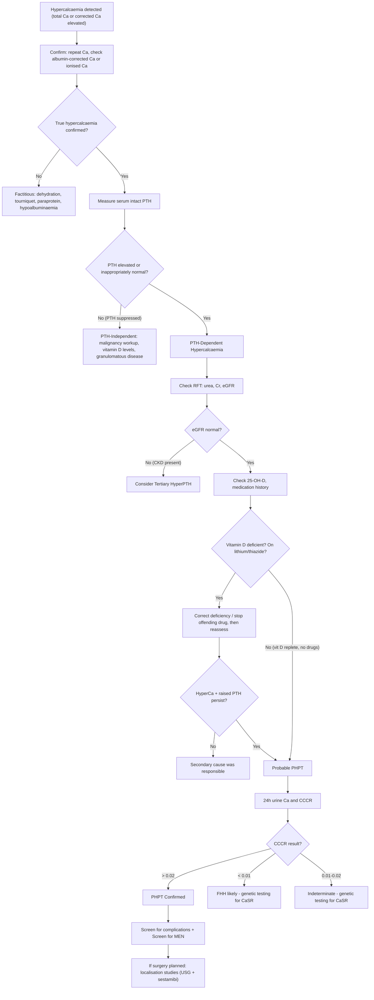

## Diagnostic Criteria, Diagnostic Algorithm, and Investigation Modalities

### 1. Diagnostic Criteria for Primary Hyperparathyroidism

PHPT does not have a single "set of criteria" like, say, the Jones criteria for rheumatic fever. Instead, the diagnosis is **biochemical** — it rests on demonstrating a characteristic laboratory pattern and then systematically excluding mimics. Let's build the diagnostic requirements from first principles.

#### 1.1 Core Biochemical Diagnosis [1][2][6]

***The diagnosis of PHPT = elevated serum calcium + inappropriately elevated (or non-suppressed) PTH, in the setting of normal renal function.***

This can be broken down into three mandatory components:

| Component | Requirement | Rationale |
|:--|:--|:--|
| **1. Confirmed true hypercalcaemia** | ***Albumin-corrected Ca elevated*** (typically > 2.55–2.60 mmol/L, lab-specific) ***OR*** elevated ionised Ca, on **at least two occasions** | A single elevated reading can be spurious (tourniquet, dehydration, lab error). Always correct for albumin: corrected Ca = total Ca + 0.02 × (40 − albumin in g/L). Alternatively, ionised Ca directly measures the biologically active fraction and bypasses albumin/paraprotein confounders [6] |
| **2. Inappropriately elevated or non-suppressed PTH** | ***PTH elevated above the reference range, OR PTH "normal" in the context of hypercalcaemia*** | This is the conceptual lynchpin. Normally, hypercalcaemia activates the CaSR on parathyroid chief cells → suppresses PTH. ***If PTH is not suppressed, the feedback loop is broken.*** Even a PTH in the "normal range" (e.g. 3.5 pmol/L in a patient with Ca 2.85 mmol/L) is ***inappropriately non-suppressed*** — it should be low/undetectable. This counts as PHPT [10] |
| **3. Normal renal function** | ***Normal urea, creatinine, eGFR*** | To exclude tertiary hyperparathyroidism (autonomous PTH from prolonged CKD-related secondary hyperPTH). If the patient has CKD with ↑Ca and ↑PTH, the diagnosis shifts to tertiary, not primary [1][3] |

#### 1.2 Additional Required Exclusions

| Exclusion | How | Why |
|:--|:--|:--|
| ***Rule out FHH*** | ***24-hour urine calcium and calcium-creatinine clearance ratio (CCCR)*** [2] | FHH mimics PHPT biochemically. CCCR < 0.01 → FHH likely (benign, no surgery needed). CCCR > 0.02 → PHPT. 0.01–0.02 → indeterminate, consider genetic testing for CaSR mutation |
| ***Rule out vitamin D deficiency*** | ***Serum 25-(OH)-D*** [1][2] | Vitamin D deficiency causes secondary hyperPTH (↑PTH is a *physiological* response to ↓Ca from ↓intestinal Ca absorption). It can also coexist with PHPT and mask the degree of hypercalcaemia. If 25-(OH)-D is low, replete it first, then reassess Ca and PTH |
| ***Rule out drug causes*** | ***Medication review: stop lithium and thiazides if safe*** [1] | Lithium shifts the CaSR set point → ↑PTH. Thiazides ↓renal Ca excretion → can unmask subclinical PHPT. Must stop and recheck before confirming diagnosis |

<Callout title="Normocalcaemic PHPT — The Emerging Entity">
***Normocalcaemic PHPT*** is defined as persistently elevated PTH with consistently normal total and ionised calcium, after **all secondary causes of elevated PTH have been rigorously excluded** (vitamin D deficiency, CKD, medications, malabsorption). This is thought to represent the earliest form of PHPT. It is a diagnosis of exclusion — you cannot make this diagnosis without first ensuring 25-(OH)-D is > 50 nmol/L (ideally > 75 nmol/L), eGFR is > 60, and no offending drugs are present. These patients may eventually progress to classical hypercalcaemic PHPT and should be monitored.
</Callout>

---

### 2. Complete Diagnostic Algorithm

---

### 3. Investigation Modalities — Systematic Approach

The investigations in PHPT serve **three distinct purposes**, and it is critical to understand *why* each test is ordered:

1. **Confirm the biochemical diagnosis** (is it really PHPT?)
2. **Screen for complications** (has the disease damaged anything?)
3. **Localise the abnormal gland** (where is it, to guide surgery?)

> ***Localisation studies are NOT used for diagnosis of PHPT NOR to determine the need for surgery. They are indicated ONLY when PHPT is biochemically confirmed AND a decision for surgery has been made*** [3][4].

---

#### 3.1 Investigations to Confirm the Diagnosis

| Investigation | Key Findings in PHPT | Interpretation / Why It's Ordered |
|:--|:--|:--|
| ***Serum calcium (total + corrected)*** | ***↑*** (typically 2.6–3.0 mmol/L in most cases; > 3.5 mmol/L raises concern for carcinoma) | The albumin-corrected Ca accounts for the ~50% of calcium that is protein-bound. In hypoalbuminaemia, total Ca is falsely low; in hyperproteinaemia (e.g. myeloma), total Ca is falsely high. Corrected Ca = total Ca + 0.02 × (40 − albumin) [6] |
| **Ionised calcium** | ↑ | Directly measures the biologically active (free) fraction. Unaffected by albumin or acid-base status. Most accurate but not always available. Particularly useful when albumin is very abnormal or acid-base disturbance present [6] |
| ***Serum intact PTH*** | ***↑ or inappropriately normal*** | The "intact" PTH assay measures the whole 1-84 PTH molecule. ***Even a mid-range "normal" PTH is pathological if calcium is elevated*** — it should be suppressed to < lower limit of normal [10]. Third-generation PTH assays (1-84 specific) are preferred over second-generation (which may cross-react with PTH fragments in CKD) |
| ***Serum phosphate*** | ***↓ or low-normal*** | PTH causes phosphaturia by downregulating NaPi-IIa cotransporter in PCT → renal phosphate wasting. A low PO₄ in the setting of ↑Ca + ↑PTH is the classic triad. ***↑PTH + ↑Ca + ↓PO₄ suggests hyperparathyroidism*** [3] |
| ***Serum ALP (alkaline phosphatase)*** | ***↑ (if bone involvement)*** | Reflects osteoblastic activity (osteoblasts produce ALP). In hyperparathyroid bone disease, there is ↑osteoclastic resorption *and* compensatory ↑osteoblastic activity → ↑ALP. ***↑ALP level predicts risk of hungry bone syndrome post-operatively*** [2] — the higher the ALP, the greater the expected post-op calcium "crash" as bone suddenly shifts from net resorption to net formation |
| ***Serum 25-(OH)-vitamin D*** | Variable; often ↓ | ***Must check to rule out vitamin D deficiency*** [2], which can: (1) be a secondary cause of ↑PTH mimicking PHPT, or (2) coexist with PHPT and mask the true severity of hypercalcaemia. If deficient, replete cautiously (may worsen hypercalcaemia if true PHPT is present) then reassess |
| ***24-hour urine calcium*** | ***↑ (> 250 mg/day women, > 300 mg/day men)*** | ***Must check to rule out FHH*** [2]. The filtered calcium load in PHPT overwhelms tubular reabsorption → net hypercalciuria. In FHH, the mutant renal CaSR causes avid Ca reabsorption → paradoxically low urine Ca |
| ***Calcium-creatinine clearance ratio (CCCR)*** | ***> 0.02 in PHPT; < 0.01 in FHH*** | CCCR = (urine Ca / serum Ca) ÷ (urine Cr / serum Cr). This ratio corrects for GFR and is more discriminating than 24h urine Ca alone. Essential to calculate [2] |
| ***Urea, creatinine, eGFR (RFT)*** | ***Normal in PHPT*** (unless complicated by nephrocalcinosis) | ***Rules out tertiary hyperparathyroidism*** (CKD + autonomous PTH) [1]. Also establishes baseline renal function for surgical planning and to assess if renal impairment is a complication of PHPT itself |
| **Serum magnesium** | Usually normal | Severe hypomagnesaemia can impair PTH secretion and action → low Ca refractory to replacement. Not a typical finding in PHPT but should be checked if calcium/PTH levels are discordant |
| **Serum chloride** | ↑ (mild hyperchloraemic acidosis) | PTH inhibits bicarbonate reabsorption in PCT → mild non-anion-gap metabolic acidosis with compensatory chloride retention. A Cl:PO₄ ratio > 33 was historically used (rarely relied upon now) |

***Summary biochemical profile of PHPT*** [1][3][6]:

> ***↑Ca, ↑PTH (or inappropriately normal), ↓PO₄, ↑ALP, ↑urine Ca (CCCR > 0.02), normal RFT***

---

#### 3.2 Investigations to Screen for Complications

These are ordered once the diagnosis of PHPT is confirmed — they document end-organ damage and help determine whether surgery is indicated (especially in asymptomatic patients).

| Investigation | Target Complication | Key Findings | Clinical Significance |
|:--|:--|:--|:--|
| ***DEXA bone densitometry*** | ***Osteoporosis*** | ***T-score ≤ −2.5*** at any site is a surgical indication. PHPT preferentially affects cortical bone → ***measure at three sites: lumbar spine, hip (femoral neck), and distal 1/3 radius*** [1][3] | PTH causes cortical > trabecular bone loss. The distal 1/3 radius is predominantly cortical bone and may show the earliest/most severe ↓BMD, whereas the lumbar spine (predominantly trabecular) may be relatively preserved or even paradoxically increased (intermittent PTH has anabolic effects on trabecular bone, but continuous elevation does not) |
| ***Abdominal X-ray (KUB) / USG kidneys*** | ***Nephrolithiasis, nephrocalcinosis*** | Renal calculi (radio-opaque calcium stones on KUB), nephrocalcinosis (diffuse renal parenchymal calcification on USG) [2] | Presence of stones or nephrocalcinosis = surgical indication even in asymptomatic patients. Calcium stones (oxalate and phosphate) are the most common stone type in PHPT |
| **Lateral thoracolumbar spine X-ray or VFA** | ***Vertebral fracture*** | Vertebral compression fractures may be asymptomatic and occlude on plain X-ray; Vertebral Fracture Assessment (VFA) on DEXA can also detect these | Presence of vertebral fracture = surgical indication (per 2022 international guidelines) |
| **ECG** | Cardiac effects of hypercalcaemia | ***Short QT interval*** (↑Ca²⁺ shortens phase 2 plateau of cardiac AP → shortens overall QT). In severe cases: ST elevation mimicking MI, Osborne/J waves, arrhythmias | Baseline ECG recommended especially if Ca > 3.0 mmol/L. Short QT is the earliest ECG sign |
| **Serum creatinine / eGFR** | Renal impairment | ***eGFR < 60 mL/min*** is a surgical indication | CKD can result from chronic hypercalcaemia-induced nephrocalcinosis, tubular damage, and dehydration |

---

#### 3.3 Investigations to Screen for Genetic/MEN Syndromes

***Should perform workup for MEN*** in every PHPT patient, especially if [1][7][10]:
- Age < 40
- Multigland disease
- Family history of PHPT, MEN, or related tumours
- Parathyroid carcinoma (→ CDC73 testing)

| Investigation | When to Order | What You're Looking For |
|:--|:--|:--|
| **Detailed family history** | All PHPT patients | FHH, MEN1, MEN2A, HPT-JT syndrome |
| ***Genetic testing: MEN1 gene*** | Young onset, multigland, positive FHx | ***MEN1 = parathyroid hyperplasia/adenoma + pancreatic NETs + pituitary adenoma*** [7] |
| ***Genetic testing: RET proto-oncogene*** | Positive FHx, coexisting MTC or phaeochromocytoma | ***MEN2A = MTC + phaeochromocytoma + parathyroid hyperplasia*** [7] |
| **Genetic testing: CDC73/HRPT2** | Suspected parathyroid carcinoma, HPT-JT syndrome | CDC73 mutations → ↑risk of parathyroid carcinoma, ossifying fibromas of jaw |
| **Genetic testing: CaSR** | CCCR 0.01–0.02 (indeterminate) or suspected FHH | Inactivating CaSR mutation confirms FHH |
| **Serum prolactin, IGF-1** | Suspected MEN1 | Screen for pituitary adenoma (prolactinoma most common in MEN1) |
| **Fasting gastrin** | Suspected MEN1, symptoms of ZES | Zollinger-Ellison syndrome (gastrinoma, 60% of MEN1) |
| **Urine/plasma metanephrines** | Suspected MEN2A/2B | Screen for phaeochromocytoma (50% in MEN2) — ***must exclude phaeochromocytoma before any surgery to avoid intraoperative HTN crisis*** |
| **Serum calcitonin, CEA** | Suspected MEN2A/2B | Screen for medullary thyroid carcinoma |

<Callout title="Must Exclude Phaeochromocytoma Before Surgery" type="error">
In any patient with suspected MEN2, ***always screen for phaeochromocytoma (urine/plasma metanephrines) BEFORE proceeding to parathyroidectomy or any surgery***. An undiagnosed phaeochromocytoma can cause a fatal intraoperative hypertensive crisis during anaesthesia induction. If positive, the phaeochromocytoma must be treated first (alpha-blockade → adrenalectomy) before addressing the parathyroid disease.
</Callout>

---

#### 3.4 Localisation Studies — For Surgical Planning Only

This is one of the most commonly tested concepts. Let me emphasise again:

> ***Localisation studies are NOT for diagnosis. They are NOT used to determine the need for surgery. They are performed ONLY after PHPT is biochemically confirmed and the decision for surgery has been made, to guide the surgical approach*** [3][4].

The role of localisation is to determine:
1. Whether a **focused/minimally invasive parathyroidectomy** (MIP) is feasible (requires a single, clearly identified adenoma)
2. Whether there is **multigland disease** (→ bilateral neck exploration needed)
3. Whether an **ectopic parathyroid** is present (mediastinal, intrathymic, retroesophageal)

##### A. Non-Invasive Localisation

| Modality | Technique / Mechanism | Key Findings | Strengths and Limitations |
|:--|:--|:--|:--|
| ***USG neck*** | High-frequency linear probe; operator-dependent | ***Parathyroid adenomas appear as homogeneous hypoechoic nodules*** posterior to the thyroid, often with ***an extra-thyroidal feeding vessel with peripheral vascularity on Doppler*** [3] | **Strengths:** non-invasive, no radiation, inexpensive, can be done at bedside, ***good for neck lesions***. **Limitations:** operator-dependent, poor for mediastinal/ectopic glands, sensitivity ↓ in coexisting multinodular goitre, misses small adenomas and hyperplasia |
| ***⁹⁹ᵐTc-Sestamibi scintigraphy*** | Radiotracer that ***accumulates in mitochondria***. ***Parathyroid adenomas are rich in oxyphilic cells (which have abundant mitochondria) → slow washout*** compared to thyroid tissue. ***Dual-phase technique: early image at ~10–20 min (tracer in both thyroid + parathyroid), delayed image at 2h (faster thyroid washout → parathyroid more apparent)*** [2][4] | Persistent focal uptake on delayed images localises the hyperfunctioning gland. Can be performed as: (1) ***single isotope dual-phase scan***, (2) ***dual isotope subtraction imaging*** (⁹⁹ᵐTc-sestamibi minus ⁹⁹ᵐTc-pertechnetate to subtract thyroid signal) [2] | **Strengths:** functional imaging (identifies *hyperfunctioning* tissue, not just anatomy), can detect ectopic glands (mediastinal), sensitivity ~75–90% for single adenomas. **Limitations:** ***false positive: Hürthle cell adenoma*** (also mitochondria-rich) [2]; poor sensitivity for hyperplasia, double adenomas, and small adenomas; ***negative sestamibi does NOT preclude the diagnosis of PHPT*** [3] |
| ***SPECT/CT (Single-photon emission CT)*** | ***3D sestamibi scan fused with CT*** for anatomical co-registration | Better spatial resolution than planar sestamibi; precise anatomical localisation | Higher sensitivity than planar sestamibi alone (~85–90%); better for ectopic and small glands; ↑radiation dose |
| ***4D CT scan*** | ***Multiphase CT imaging*** (non-contrast, arterial, venous, delayed phases). The "4th dimension" is time — perfusion characteristics over multiple phases | Parathyroid adenomas show characteristic rapid arterial enhancement with washout pattern, distinguishable from lymph nodes and thyroid nodules | ***High spatial resolution, excellent for re-operative cases and when USG/sestamibi are discordant.*** **Limitation: high radiation dose** [2]. Increasingly used as first-line in some centres |
| **MRI** | Multiplanar imaging without radiation | ***Parathyroid adenomas: low signal on T1, high signal on T2*** [3] | Useful when CT is contraindicated (e.g. pregnancy, radiation concerns), ***good for mediastinal glands***. Less commonly used as first-line |
| **PET scan** | ***¹¹C-methionine*** or ***¹⁸F-fluorocholine PET/CT*** | Increased amino acid / choline uptake in hyperfunctioning parathyroid tissue | Emerging modality with high sensitivity, especially for re-operative cases and when conventional imaging is negative. ¹⁸F-fluorocholine PET/CT increasingly used [3] |

<Callout title="The Standard First-Line Localisation Package">
***USG neck + sestamibi scan (± SPECT/CT)*** is the standard first-line localisation strategy [2][4]. The two modalities are complementary:
- USG provides anatomical detail and is excellent for intrathyroidal or perithyroidal adenomas
- Sestamibi provides functional information and can detect ectopic glands
- When both agree ("concordant"), there is > 95% likelihood of finding a single adenoma at surgery → patient is a good candidate for focused/minimally invasive parathyroidectomy
- ***When discordant or negative, consider 4D CT, SPECT/CT, or ¹⁸F-choline PET/CT***
</Callout>

##### B. Invasive Localisation — Reserved for Re-operative or Challenging Cases

| Modality | Technique | When to Use |
|:--|:--|:--|
| ***Selective venous sampling*** | ***Catheterisation of cervical veins (superior/middle/inferior thyroid, thymic, vertebral veins). PTH measured at each location. A ≥ 1.5–2× increase in PTH compared to peripheral sample is considered abnormal and localises the gland*** [3] | ***Most common invasive modality for parathyroid localisation. Reserved for patients with prior neck surgery or unrevealing non-invasive tests*** [2][3] |
| ***Selective arteriography with transarterial hypocalcaemic stimulation*** | Injection of sodium citrate into feeding arteries → induces local hypocalcaemia → stimulates PTH release from the hyperfunctioning gland → measured in effluent veins | ***Reserved for re-operative cases or when non-invasive and venous sampling are inconclusive*** [3] |
| **Intraoperative ultrasound** | USG probe applied directly to neck tissues during surgery | Adjunct during bilateral exploration; helps identify glands not found by standard dissection |
| **Imaging-guided FNAC with PTH washout** | USG-guided FNA of a suspected parathyroid lesion → aspirate sent for PTH level (not cytology) | Can confirm a lesion is parathyroid tissue (PTH in aspirate >> serum PTH). Useful when a nodule's identity is ambiguous on imaging |

---

#### 3.5 Intraoperative Investigations

| Investigation | Technique | Significance |
|:--|:--|:--|
| ***Intraoperative PTH assay (ioPTH)*** | ***Takes advantage of the short half-life of PTH (~3–5 minutes)***. Serum PTH measured pre-incision and at 5 and 10 minutes after excision of the suspected adenoma. ***Miami criteria: PTH drops to normal range AND falls > 50% of the maximum pre-excision value by 10 minutes post-excision*** [2][3] | ***Confirms that all hyperfunctioning tissue has been removed.*** If criteria are met → surgery successful, can close. If criteria NOT met → suspect multigland disease → ***convert to bilateral neck exploration*** [2] |
| **Frozen section** | Intraoperative histological examination of excised tissue | Confirms tissue is parathyroid (not lymph node, thyroid, fat). ***Especially important during subtotal parathyroidectomy (3.5 gland resection) to confirm the remnant tissue is indeed parathyroid*** [2] |

<Callout title="Why ioPTH Works">
PTH has a half-life of only ***~3–5 minutes***. After removing the hyperfunctioning adenoma, serum PTH should plummet rapidly. If you measure PTH at 10 minutes post-excision and it has dropped by > 50% and fallen into the normal range, you can be confident that:
1. The removed gland was indeed the source of excess PTH
2. There is no second hyperfunctioning gland remaining (i.e. no double adenoma or hyperplasia)

If PTH does NOT fall adequately, the surgeon should suspect multigland disease and convert from focused parathyroidectomy to bilateral neck exploration. This is one of the most elegant uses of a rapid biochemical assay in surgery.
</Callout>

---

#### 3.6 Radiological Findings of Hyperparathyroid Bone Disease

While not used for diagnosis per se, recognising the radiological features of advanced PHPT is high-yield for exams [1]:

| Finding | Location | Description | Pathophysiology |
|:--|:--|:--|:--|
| ***Subperiosteal bone resorption*** | ***Radial aspect of middle phalanges*** (most sensitive site) | Thinning/irregularity of the bony cortex at the subperiosteal surface | PTH → ↑osteoclastic resorption preferentially at cortical bone surfaces |
| ***"Salt and pepper" skull*** | Skull vault | ***Multiple tiny well-defined lucencies*** on skull X-ray/CT | Resorption of trabecular bone within the diploë of the skull vault |
| ***Brown tumours*** | Jaw, long bones, ribs, pelvis | Well-defined lytic lesions with fibrous tissue and hemosiderin (brown colour) | ***Osteoclastic aggregations intermixed with fibrous tissue and poorly mineralised woven bone***; brown due to hemosiderin from microhaemorrhages [1] |
| **Bone cysts** | MCP shafts, ribs, pelvis | Central medullary lucencies | Focal areas of intense resorption |
| ***Tapering of distal clavicles*** | Acromioclavicular joints | Loss of the normal rounded distal clavicular end | Subperiosteal/subchondral resorption |
| **Chondrocalcinosis** | Knee (meniscus), wrist (TFCC), pubic symphysis | Linear calcification in cartilage on X-ray | CPPD crystal deposition secondary to hypercalcaemia (PHPT is a metabolic cause of pseudogout) |
| ***Osteopenia / osteoporosis*** | Cortical sites: distal 1/3 radius, femoral neck > lumbar spine | ↓BMD on DEXA | Continuous PTH elevation → net cortical bone loss (cortical > trabecular) [1] |
| ***"Rugger-jersey" spine*** | Thoracolumbar spine | Alternating bands of sclerosis and lucency | More characteristic of secondary/tertiary hyperPTH (renal osteodystrophy) than primary, but can occur |

> The classical ***osteitis fibrosa cystica*** (the full triad of subperiosteal resorption + brown tumours + bone cysts) is ***uncommon*** today because most PHPT is caught early on biochemical screening before advanced bone disease develops [1].

---

### 4. Standard Investigation Set — Putting It All Together

***Per JCEM/AES 2022 guidelines*** (updated from JCEM 2014 referenced in the notes) [1]:

| Category | Investigations |
|:--|:--|
| **Confirm PHPT** | Serum total Ca (corrected for albumin), ionised Ca, intact PTH, serum PO₄, serum ALP |
| **Rule out other causes** | Serum 25-(OH)-D (vitamin D deficiency), urea/Cr/eGFR (CKD → tertiary), ***24h urine Ca and CCCR (FHH)***, medication review (lithium, thiazides) |
| **Screen for complications** | ***DEXA at 3 sites (lumbar spine, hip, distal 1/3 radius)***, ***KUB / USG kidneys (stones, nephrocalcinosis)***, lateral spine X-ray or VFA (vertebral fracture), ECG, baseline RFT |
| **Screen for MEN** | Family history, ± genetic testing (MEN1, RET, CDC73), ± biochemical screening (prolactin, gastrin, metanephrines, calcitonin) |
| **Localisation (if surgery planned)** | ***USG neck + ⁹⁹ᵐTc-sestamibi scan (± SPECT/CT)*** [2][4]. If discordant/negative: 4D CT, choline PET/CT, or invasive methods |

---

<Callout title="High Yield Summary — Diagnostics">

1. ***Diagnosis = ↑Ca + ↑/inappropriately normal PTH + normal RFT***. That's the core.
2. ***"Normal" PTH with hypercalcaemia IS abnormal*** — it should be suppressed → workup for PHPT.
3. ***Must check 24h urine Ca and CCCR in ALL patients*** to exclude FHH (CCCR < 0.01 = FHH; > 0.02 = PHPT).
4. ***Must check 25-(OH)-D*** to exclude vitamin D deficiency as cause of secondary ↑PTH.
5. ***ALP predicts hungry bone syndrome risk*** post-op: higher ALP = worse post-op hypoCa.
6. ***DEXA at THREE sites*** (spine, hip, distal 1/3 radius) — cortical bone loss earliest at radius.
7. ***Localisation studies are for surgical planning, NOT diagnosis, NOT to determine need for surgery.***
8. ***Standard localisation: USG + sestamibi (± SPECT/CT).***
9. ***Sestamibi works because oxyphilic cells are rich in mitochondria → slow tracer washout. Dual-phase: 10–20 min early, 2h delayed.***
10. ***False positive for sestamibi: Hürthle cell adenoma*** (also mitochondria-rich).
11. ***Negative sestamibi does NOT exclude PHPT*** — poor for hyperplasia and multigland disease.
12. ***ioPTH: PTH t½ ~3–5 min. Miami criteria: > 50% drop + return to normal range at 10 min post-excision.***
13. ***If ioPTH criteria NOT met → suspect multigland disease → convert to bilateral exploration.***

</Callout>

---

<ActiveRecallQuiz
  title="Active Recall - Diagnosis and Investigation of PHPT"
  items={[
    {
      question: "A patient has Ca 2.85 mmol/L and PTH 5.2 pmol/L (normal range 1.6-6.9 pmol/L). The PTH is 'within normal range.' Is this consistent with PHPT? Explain.",
      markscheme: "Yes, this is consistent with PHPT. Although PTH is within the reference range, it is inappropriately non-suppressed for the degree of hypercalcaemia. In a non-parathyroid cause of hypercalcaemia, PTH should be suppressed (below lower limit of normal) by CaSR-mediated feedback. A 'normal' PTH in the face of hypercalcaemia = inappropriate = primary hyperparathyroidism until proven otherwise."
    },
    {
      question: "List three purposes of investigations in PHPT and give one example investigation for each.",
      markscheme: "(1) Confirm diagnosis: serum Ca, PTH, PO4, 24h urine Ca/CCCR. (2) Screen for complications: DEXA (osteoporosis), USG kidneys/KUB (nephrolithiasis/nephrocalcinosis), ECG (short QT). (3) Localise the gland for surgical planning: USG neck + sestamibi scan. Localisation is NOT for diagnosis."
    },
    {
      question: "Explain the mechanism of sestamibi scintigraphy for parathyroid localisation, including the dual-phase technique and a known false positive.",
      markscheme: "Sestamibi accumulates in mitochondria. Parathyroid adenomas contain abundant oxyphilic cells (rich in mitochondria) causing slow tracer washout compared to thyroid tissue. Dual-phase technique: early image at 10-20 min shows uptake in both thyroid and parathyroid; delayed image at 2 hours shows faster thyroid washout so parathyroid retention becomes more apparent. False positive: Hurthle cell adenoma of thyroid (also mitochondria-rich, retains sestamibi)."
    },
    {
      question: "What are the Miami criteria for intraoperative PTH assay and what do you do if the criteria are not met?",
      markscheme: "Miami criteria: PTH must drop to normal range AND fall by greater than 50% of the maximum pre-excision value, measured at 10 minutes post-gland excision. Based on PTH half-life of approximately 3-5 minutes. If criteria NOT met, suspect multigland disease (double adenoma or hyperplasia) and convert from focused parathyroidectomy to bilateral neck exploration."
    },
    {
      question: "Why is DEXA performed at three sites (lumbar spine, hip, distal 1/3 radius) in PHPT rather than the usual two?",
      markscheme: "PTH causes preferential cortical bone loss (cortical greater than trabecular). The distal 1/3 radius is predominantly cortical bone and may show the earliest or most severe BMD reduction. The lumbar spine is predominantly trabecular and may be relatively preserved or even paradoxically increased. Therefore, measuring only spine and hip (as in routine osteoporosis screening) may miss the characteristic cortical bone loss pattern. A T-score of -2.5 or less at any site is a surgical indication."
    },
    {
      question: "Name three investigations required to exclude mimics of PHPT before confirming the diagnosis.",
      markscheme: "(1) 24h urine Ca and CCCR to exclude FHH (CCCR less than 0.01). (2) Serum 25-OH-D to exclude vitamin D deficiency causing secondary hyperPTH. (3) RFT (urea, Cr, eGFR) to exclude tertiary hyperPTH from CKD. Also: medication review to identify lithium or thiazide use."
    }
  ]}
/>

## References

[1] Senior notes: Ryan Ho Endocrine.pdf (pp. 41–42 — PHPT diagnosis, standard Ix, bone disease)
[2] Senior notes: maxim.md (Primary hyperparathyroidism — investigations, localisation, surgical criteria)
[3] Senior notes: felixlai.md (Hyperparathyroidism — localisation studies, case study, pp. 1516–1522)
[4] Senior notes: Ryan Ho Diagnostic Radiology.pdf (p. 60 — Parathyroid Scintigraphy)
[6] Senior notes: Ryan Ho Fundamentals.pdf (p. 430 — Hypercalcaemia approach)
[7] Senior notes: Ryan Ho Endocrine.pdf (pp. 132–133 — MEN syndromes)
[10] Senior notes: Ryan Ho Chemical Path.pdf (p. 23 — Causes of hypercalcaemia, PTH interpretation)
