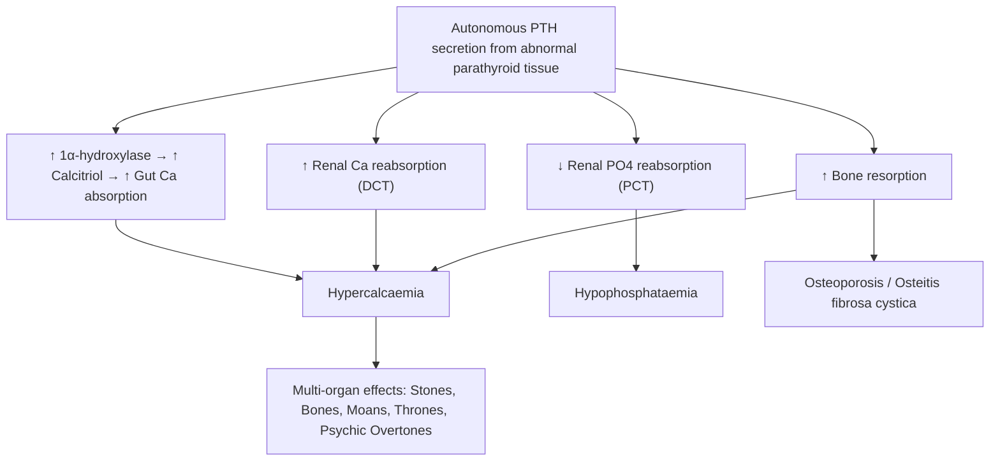
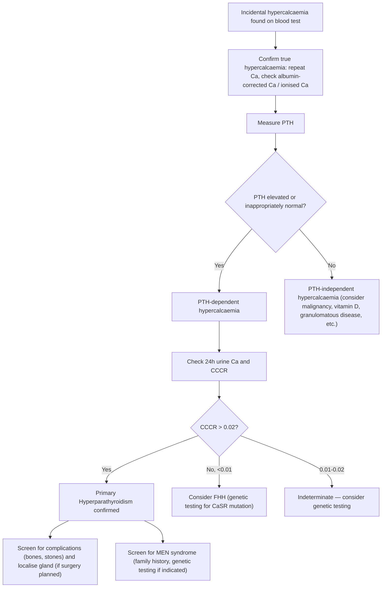

# Primary Hyperparathyroidism (PHPT)

## 1. Definition

Primary hyperparathyroidism (PHPT) is a condition of **autonomous, excessive secretion of parathyroid hormone (PTH)** from one or more parathyroid glands, independent of the normal calcium-sensing feedback mechanism [1][2]. This leads to hypercalcaemia (elevated serum calcium), which is the biochemical hallmark.

Let's break down the name:
- **Primary** = the problem originates *in* the parathyroid gland itself (cf. secondary = reactive to hypocalcaemia from renal failure/vitamin D deficiency; tertiary = autonomous secretion that has evolved *from* long-standing secondary hyperparathyroidism)
- **Hyper** = excessive
- **Parathyroidism** = function of the parathyroid glands

> The key distinction: in PHPT, PTH is **inappropriately elevated (or non-suppressed)** in the setting of hypercalcaemia. Normally, hypercalcaemia should suppress PTH via the calcium-sensing receptor (CaSR) — in PHPT, this feedback loop is broken [1][2].

---

## 2. Epidemiology

***PHPT is the most common cause of hypercalcaemia in the outpatient/ambulatory setting*** [1][2].

| Parameter | Detail |
|:--|:--|
| ***Prevalence*** | ***~1–2 per 1,000*** in the general population [1] |
| ***Peak age*** | ***6th–7th decade*** (average age ~59 years) [1] |
| ***Sex ratio*** | ***M:F ≈ 1:2–3*** (female predominance, especially postmenopausal women) [1] |
| Discovery | Majority (~80%) now discovered **incidentally** on routine blood tests (asymptomatic hypercalcaemia) rather than with classic "stones, bones, moans" — this is a shift from historical presentation |
| Incidence | Roughly 20–66 per 100,000 person-years in Western populations; lower reported incidence in Hong Kong/East Asia but likely underdiagnosed |

**Hong Kong context:** In Hong Kong, PHPT is increasingly recognised due to routine inclusion of calcium in biochemical panels. It remains less common than in Western populations, but awareness is growing. A significant proportion present late with symptomatic disease (renal stones, osteoporosis) compared to Western centres where asymptomatic PHPT predominates [1].

---

## 3. Risk Factors

| Risk Factor | Explanation |
|:--|:--|
| **Female sex** | 2–3× more common in women, especially postmenopausal (loss of oestrogen → ↑bone resorption → may unmask/promote PHPT) |
| **Age > 50** | Incidence rises with age |
| ***Previous head and neck irradiation*** | Radiation to the neck (e.g. childhood leukaemia treatment, total body irradiation for bone marrow transplant, environmental radiation exposure) increases parathyroid cell mutagenesis [3] |
| **Lithium therapy** | Lithium shifts the calcium-PTH set point to the right → parathyroid glands require a higher calcium level to suppress PTH → chronic stimulation → hyperplasia/adenoma |
| **Thiazide diuretics** | Can unmask mild PHPT (thiazides ↓urinary Ca excretion → ↑serum Ca) |
| ***Familial/genetic syndromes*** | MEN1, MEN2A, hyperparathyroidism-jaw tumour (HPT-JT) syndrome, familial isolated hyperparathyroidism (FIHP) [1][3] |
| **Vitamin D deficiency** | Co-existing vitamin D deficiency is common and can mask the degree of hypercalcaemia while worsening bone disease |

---

## 4. Anatomy and Physiology of the Parathyroid Glands

### 4.1 Anatomy

- **Number:** Typically **four** parathyroid glands (two superior, two inferior), though 5–13% of people have supernumerary glands (important for surgery — missed gland = persistent disease)
- **Location:**
  - **Superior glands:** posterolateral to the upper thyroid poles, relatively constant position (derived from the 4th pharyngeal pouch)
  - **Inferior glands:** more variable position (derived from the 3rd pharyngeal pouch, migrating with the thymus) — can be found anywhere from the angle of the mandible to the anterior mediastinum
- **Size:** Each gland is ~5 mm × 3 mm × 1 mm, weighing ~30–50 mg (a normal gland is about the size of a grain of rice)
- **Blood supply:** Inferior thyroid artery (primarily), with contributions from superior thyroid artery
- **Histology:** Two main cell types:
  - **Chief cells:** secrete PTH (the workhorse)
  - ***Oxyphil cells:*** larger, packed with ***mitochondria*** (this is why they retain ***sestamibi*** on nuclear scans — critical for parathyroid scintigraphy) [2][4]

### 4.2 Parathyroid Hormone (PTH) — Physiology

PTH is an 84-amino acid polypeptide. Its net effect is to **↑ serum calcium** and **↓ serum phosphate** [5].

**Three target organs of PTH action:**

| Target | Action | Mechanism |
|:--|:--|:--|
| **Bone** | ↑ Osteoclastic bone resorption (and ↑ osteoblastic activity → ***↑ ALP***) — net effect is bone resorption | PTH binds PTH1R on osteoblasts → osteoblasts release RANKL → RANKL activates osteoclasts via RANK → ↑ bone resorption → releases Ca²⁺ and PO₄³⁻ into blood |
| **Kidney (DCT)** | ↑ Calcium reabsorption at the **distal convoluted tubule (DCT)**, ↓ phosphate reabsorption at the **proximal convoluted tubule (PCT)** | Upregulates TRPV5 channels in DCT for Ca²⁺; downregulates NaPi-IIa cotransporter in PCT for PO₄³⁻ |
| **Kidney (vitamin D)** | ↑ 1α-hydroxylation of 25-(OH)-D → ***↑ 1,25-(OH)₂-D (calcitriol)*** → ↑ intestinal calcium absorption | Stimulates 1α-hydroxylase enzyme in PCT cells |

> **Why does PTH raise calcium but lower phosphate?** Because PTH simultaneously causes phosphaturia (renal phosphate wasting) while increasing calcium reabsorption. The phosphaturic effect ensures that the calcium × phosphate product doesn't rise dangerously (which would cause metastatic calcification). Clever homeostasis!

### 4.3 Calcium Homeostasis Overview [5]

Three calciotropic hormones:
1. **PTH:** ↑Ca, ↓PO₄, ↑ALP
2. **Calcitriol (1,25-(OH)₂-D₃):** ↑Ca, ↑PO₄, ↑ALP (↑intestinal absorption of both Ca and PO₄; at high doses also ↑bone resorption)
3. **Calcitonin** (from thyroid parafollicular C cells): ↓Ca, ↓PO₄ — *physiologically negligible* (thyroidectomy does NOT significantly affect serum Ca) [5]

**Important modifiers of total serum calcium:**
- **Albumin:** ~50% of plasma Ca is albumin-bound → hypoalbuminaemia causes a factitiously low total Ca
  - ***Corrected Ca (mmol/L) = total Ca + 0.02 × (40 – albumin in g/L)*** [5]
- **Phosphate:** can precipitate Ca out of serum
- **pH:** alkalosis → ↓ionised Ca (H⁺ normally competes with Ca²⁺ for albumin binding sites; in alkalosis, fewer H⁺ → more Ca²⁺ binds albumin → ↓free ionised Ca) [5]

<Callout title="The Calcium-Sensing Receptor (CaSR)" type="idea">
The CaSR on parathyroid chief cells is the gatekeeper. When serum Ca rises, CaSR is activated → suppresses PTH secretion. In PHPT, the parathyroid cells (adenoma/hyperplastic) have a **shifted set point** — they require a higher Ca level to suppress PTH, or in some cases, ignore the signal entirely. This is why PTH remains elevated or non-suppressed despite hypercalcaemia. Contrast this with Familial Hypocalciuric Hypercalcaemia (FHH), where an **inactivating mutation** of the CaSR throughout the body (including parathyroids and kidneys) leads to mild hypercalcaemia with inappropriately normal PTH — a critical mimic of PHPT.
</Callout>

---

## 5. Etiology

### 5.1 Causes of PHPT [1][2][6]

| Cause | Frequency | Key Features |
|:--|:--|:--|
| ***Solitary parathyroid adenoma*** | ***~80–85%*** | Single enlarged gland; remaining glands are normal/atrophic. Most common cause of sporadic PHPT |
| ***Parathyroid hyperplasia (multigland disease)*** | ***~10–15%*** | All four glands enlarged. Think **MEN1** or **MEN2A** or lithium use |
| ***Double adenomas*** | ***~1–5%*** | Two abnormal glands; distinction from asymmetric hyperplasia is debated |
| ***Parathyroid carcinoma*** | ***< 1% (up to 5% in some series)*** | Rare but important — suspect if Ca > 3.5 mmol/L, very high PTH (often > 5–10× ULN), palpable neck mass, hoarseness (RLN invasion) |

### 5.2 Sporadic vs Familial PHPT

#### Sporadic PHPT (~90–95%)
- No identifiable genetic syndrome
- ***Risk factor: previous head and neck irradiation*** [2]
- Molecular: somatic mutations in *CCND1* (cyclin D1 overexpression), *MEN1* gene, *CDC73/HRPT2* gene

#### Familial PHPT (~5–10%) [1][3][7]

***Associated with Multiple Endocrine Neoplasia (MEN) syndromes:***

| Syndrome | Gene | Parathyroid Pathology | Other Features |
|:--|:--|:--|:--|
| ***MEN1*** | ***MEN1 gene (encoding menin) at 11q13*** | ***Parathyroid hyperplasia/adenoma*** (almost 100% penetrance by age 40–50) | Pancreatic NETs (gastrinoma 60%, insulinoma 10%), pituitary adenoma (prolactinoma most common) |
| ***MEN2A*** | ***RET proto-oncogene (ch10)*** | ***Parathyroid hyperplasia/adenoma*** (10–25% penetrance, usually mild) | Medullary thyroid carcinoma (100%), phaeochromocytoma (50%) |
| ***MEN2B*** | ***RET proto-oncogene*** | Rare/not typically associated | MTC, phaeochromocytoma, mucosal neuromas, Marfanoid habitus |
| **HPT-JT syndrome** | *CDC73* (HRPT2) gene | Parathyroid adenoma/carcinoma (higher risk of carcinoma!) | Ossifying fibromas of jaw, renal cysts/tumours, uterine tumours |
| **Familial isolated HPT (FIHP)** | Various (*MEN1*, *CDC73*, *CaSR*, *GCM2*) | Adenoma or hyperplasia | No other endocrine tumours |

<Callout title="MEN Syndromes – High Yield Mnemonic" type="idea">
- **MEN1 = 3 P's:** Parathyroid, Pituitary, Pancreatic (tumour)
- **MEN2A = 2 P's + 1 M:** Phaeochromocytoma, Parathyroid hyperplasia, Medullary thyroid carcinoma
- **MEN2B = 2 P's + 1 M + neuromas:** Phaeochromocytoma, (no Parathyroid), Medullary thyroid carcinoma + Mucosal neuromas + Marfanoid habitus
</Callout>

> ***MEN1 has the highest penetrance for PHPT (~100% by age 40–50).*** Typically presents with ***multiple parathyroid adenomas*** with a ***high recurrence rate (> 50% in 12 years if subtotal parathyroidectomy)***. Management ***favours subtotal parathyroidectomy (3.5 glands) + cervical thymectomy*** (to reduce risk of thymic carcinoid) [7].

> ***MEN2A PHPT*** is usually ***mild and asymptomatic***; management is similar to sporadic PHPT. ***NOT indicated for prophylactic parathyroidectomy during thyroidectomy*** (as PHPT is usually asymptomatic in MEN2A) [7].

### 5.3 Parathyroid Carcinoma — Special Mention

- Accounts for < 1% of PHPT [1][2]
- **Suspect when:**
  - Markedly elevated calcium ( > 3.5 mmol/L)
  - Very high PTH (often > 5–10× upper limit of normal)
  - Palpable neck mass (parathyroid adenomas are almost never palpable)
  - Hoarseness (recurrent laryngeal nerve invasion)
  - ***Associated with CDC73/HRPT2 gene mutations*** (HPT-JT syndrome)
- **En bloc resection** is the treatment of choice (not simple parathyroidectomy)
- Prognosis is variable; local recurrence is common

---

## 6. Pathophysiology of PHPT

The core problem: **autonomous PTH secretion → persistent hypercalcaemia**.

### 6.1 Molecular Pathogenesis

| Pathology | Mechanism |
|:--|:--|
| **Parathyroid adenoma** | Clonal proliferation of a single abnormal parathyroid cell. Common molecular alterations: *CCND1* rearrangement (overexpression of cyclin D1 → cell cycle progression), somatic *MEN1* mutations (loss of tumour suppressor menin). The abnormal cells have a **shifted calcium set point** — requiring higher Ca²⁺ to suppress PTH secretion, plus increased proliferative capacity |
| **Parathyroid hyperplasia** | Polyclonal (or oligoclonal) proliferation of all four glands. Driven by germline mutations in *MEN1*, *RET*, or other genes. The increased cell mass → increased total PTH output, even if individual cells may still partially respond to Ca²⁺ |
| **Parathyroid carcinoma** | Loss of *CDC73/HRPT2* gene (encodes parafibromin, a tumour suppressor) → uncontrolled cell growth. May also have *CCND1* overexpression. Markedly autonomous PTH secretion with very high PTH levels |

### 6.2 Downstream Pathophysiology (Organ-by-Organ)

Let's trace each downstream effect:

#### A. Bones
- **↑ PTH → ↑ osteoclast activity → ↑ bone resorption**
  - Cortical bone preferentially affected (PTH has catabolic effect on cortical bone but can be anabolic to trabecular bone — this is why the distal 1/3 radius BMD drops first)
  - In severe/prolonged disease: ***osteitis fibrosa cystica*** — subperiosteal bone resorption (classically at radial aspect of middle phalanges), brown tumours (focal collections of osteoclasts and fibrous tissue), "salt and pepper" skull on X-ray, bone cysts
  - ***↑ osteoblastic activity → ↑ ALP (alkaline phosphatase)*** — ALP level reflects bone turnover and predicts risk of ***hungry bone syndrome*** post-operatively [2]

#### B. Kidneys (Stones)
- **Hypercalcaemia → hypercalciuria → calcium-containing renal stones** (calcium oxalate and calcium phosphate)
  - Despite PTH's action to reabsorb Ca in DCT, the **filtered load of Ca²⁺ overwhelms reabsorption** → net hypercalciuria
  - Long-standing → **nephrocalcinosis** (calcium deposition in renal parenchyma)
  - **Nephrogenic diabetes insipidus (NDI):** hypercalcaemia inhibits adenylyl cyclase → ↓cAMP → ↓aquaporin-2 insertion in collecting duct → concentrating defect → polyuria and polydipsia [6]
  - Chronic hypercalcaemia can cause **renal impairment** from nephrocalcinosis and tubular damage

#### C. GI tract (Moans)
- **Hypercalcaemia → smooth muscle dysfunction:**
  - Constipation (↓GI motility — Ca²⁺ interferes with smooth muscle contraction/relaxation cycle)
  - Anorexia, nausea, vomiting (central and peripheral effects)
  - Abdominal pain
  - **Peptic ulcer disease:** ↑Ca²⁺ stimulates gastrin secretion → ↑gastric acid
  - **Acute pancreatitis:** Ca²⁺ may activate trypsinogen within pancreatic duct → autodigestion (though association is somewhat controversial)

#### D. Neuromuscular / Psychiatric (Psychic Overtones)
- **Hypercalcaemia → ↑ membrane threshold potential:**
  - Ca²⁺ stabilises neuronal membranes → neurons require a greater stimulus to fire
  - This causes: fatigue, lethargy, depression, impaired concentration, confusion
  - Severe: psychosis, coma
  - ***Proximal muscle weakness*** (often subtle)

#### E. Cardiovascular
- **Short QT interval** on ECG (↑Ca²⁺ accelerates phase 2 repolarisation → shortens action potential)
- **Hypertension** (~40% of PHPT patients; mechanism multifactorial: vascular smooth muscle tone, renal effects, RAAS activation)
- Long-standing: vascular and valvular calcification, LVH

#### F. Other
- **CPPD deposition disease (pseudogout):** PHPT is a recognised secondary cause of calcium pyrophosphate crystal deposition (hyperPTH odds ratio ~3.35× for CPPD) [8]
- **Band keratopathy:** calcium deposition in the cornea (medial and lateral limbus) — seen on slit-lamp examination
- **Chondrocalcinosis:** radiographic calcification in cartilage

<Callout title="Stones, Bones, Moans, Thrones, Psychic Overtones" type="idea">
This is the classic mnemonic for hypercalcaemia symptoms, not just PHPT. But the vast majority of PHPT patients today are **asymptomatic** — picked up incidentally on routine blood tests. Only ~20% present with classic symptomatic disease.
- **Stones** = renal stones, nephrocalcinosis
- **Bones** = bone pain, osteoporosis, osteitis fibrosa cystica, fractures
- **Moans** = constipation, nausea, abdominal pain, peptic ulcer, pancreatitis
- **Thrones** = polyuria (nephrogenic DI), polydipsia, dehydration
- **Psychic overtones** = depression, confusion, lethargy, psychosis
</Callout>

---

## 7. Classification

### 7.1 By Pathological Subtype

| Type | Frequency | Characteristics |
|:--|:--|:--|
| **Solitary adenoma** | ~80–85% | Single enlarged gland; remaining 3 glands normal/suppressed |
| **Double adenoma** | ~1–5% | Two abnormal glands |
| **Multigland hyperplasia** | ~10–15% | All 4 glands enlarged; strongly associated with MEN syndromes and lithium |
| **Parathyroid carcinoma** | < 1% | Very high Ca/PTH, palpable mass, RLN invasion, CDC73 mutations |

### 7.2 By Clinical Presentation

| Category | Description |
|:--|:--|
| **Symptomatic PHPT** | Classic presentation with end-organ complications (stones, bones, moans, etc.) |
| **Asymptomatic PHPT** | Hypercalcaemia discovered incidentally on routine bloodwork; no overt symptoms |
| ***Normocalcaemic PHPT*** | ***Persistently elevated PTH with consistently normal total and ionised calcium, after excluding all secondary causes of elevated PTH*** (vitamin D deficiency, CKD, medications). This is a recognised entity and may represent the earliest phase of PHPT |

### 7.3 By Genetic Context

| Category | Examples |
|:--|:--|
| Sporadic (~90–95%) | No identifiable genetic syndrome |
| Familial (~5–10%) | MEN1, MEN2A, HPT-JT, FIHP |

---

## 8. Clinical Features

### 8.1 Symptoms (with Pathophysiological Basis)

The majority of patients today are **asymptomatic** (picked up incidentally). When symptoms occur, they are attributable to hypercalcaemia and/or end-organ damage from chronically elevated PTH.

| System | Symptom | Pathophysiological Basis |
|:--|:--|:--|
| **General** | Fatigue, malaise, weakness | Hypercalcaemia stabilises neuronal and muscle cell membranes → ↑threshold for depolarisation → reduced excitability → generalised weakness and lethargy |
| **Renal ("Thrones")** | ***Polyuria, polydipsia, nocturia*** | ***Hypercalcaemia inhibits adenylyl cyclase in collecting duct → ↓cAMP → ↓aquaporin-2 expression → nephrogenic diabetes insipidus*** [6] |
| | Renal colic (flank pain) | Hypercalciuria → calcium stone formation → ureteric obstruction |
| | Recurrent urinary tract infections | Secondary to nephrolithiasis/stasis |
| **Skeletal ("Bones")** | Bone pain, backache | ↑ PTH → ↑ osteoclastic resorption → cortical bone thinning, microfractures |
| | Pathological fractures | Osteoporosis/osteitis fibrosa cystica → structural weakness |
| | Joint pain | CPPD crystal deposition (pseudogout) secondary to ↑Ca and ↑PPi |
| **GI ("Moans")** | ***Constipation*** | Hypercalcaemia → ↓smooth muscle motility in GI tract (Ca²⁺ impairs normal contractile cycling) |
| | Anorexia, nausea, vomiting | Central and peripheral neuronal effects of hypercalcaemia, ↑gastric acid |
| | Abdominal pain | Peptic ulceration (↑Ca²⁺ → ↑gastrin → ↑acid), pancreatitis, constipation |
| **Neuropsychiatric ("Psychic Overtones")** | ***Depression, anxiety, cognitive impairment*** | Ca²⁺ affects neurotransmitter release and neuronal excitability; also vascular effects on cerebral blood flow |
| | Confusion, drowsiness (if severe) | Severe hypercalcaemia → global cerebral depression |
| | Hallucinations (rare, severe) | Severe hypercalcaemia > 3.5 mmol/L |
| **Cardiovascular** | Hypertension (often asymptomatic) | Multifactorial: ↑vascular smooth muscle tone (Ca²⁺-dependent), ↑RAAS, renal impairment |
| | Palpitations | Short QT → potential arrhythmia substrate |

### 8.2 Signs (with Pathophysiological Basis)

| System | Sign | Pathophysiological Basis |
|:--|:--|:--|
| **Neck** | ***Palpable neck mass*** (rare, concerning) | ***Parathyroid adenomas are almost never palpable***. A palpable mass should raise suspicion for ***parathyroid carcinoma*** |
| **Eyes** | Band keratopathy | Calcium phosphate deposition in the cornea (medial and lateral limbus) — occurs when Ca × PO₄ product is chronically elevated; seen on slit-lamp exam |
| **Musculoskeletal** | Proximal muscle weakness (subtle) | Hypercalcaemia → ↑membrane threshold → reduced muscle fibre excitability |
| | Bone tenderness | Subperiosteal resorption, pathological fractures |
| | Joint swelling/warmth (pseudogout) | CPPD crystal-induced synovitis (PHPT is a recognised metabolic cause of pseudogout) [8] |
| **Skin** | Pruritus (uncommon) | Metastatic calcification in skin |
| **Cardiovascular** | Hypertension | As above |
| | ***Short QT interval on ECG*** | ***Hypercalcaemia shortens phase 2 (plateau) of cardiac action potential → shortened QT*** |
| **Abdominal** | Epigastric tenderness | Peptic ulcer disease or acute pancreatitis |
| **Neurological** | Decreased deep tendon reflexes | Hypercalcaemia → ↑neuronal membrane threshold → hyporeflexia |
| | Altered mental status (severe) | Severe hypercalcaemia → CNS depression |
| **Renal** | Signs of dehydration | Polyuria → volume depletion (if compensatory intake is insufficient) |

<Callout title="Clinical Pearl — Hypercalcaemic Crisis" type="error">
Severe hypercalcaemia ( > 3.5 mmol/L) is a medical emergency. It creates a **vicious cycle**: hypercalcaemia → polyuria → dehydration → ↓GFR → ↓renal Ca excretion → worsening hypercalcaemia. Patients may present with severe dehydration, confusion, oliguria, and cardiac arrhythmias. This requires **urgent IV normal saline rehydration** as the first step.
</Callout>

### 8.3 Biochemical Profile of PHPT

| Parameter | Expected Finding | Why |
|:--|:--|:--|
| **Serum calcium** | ***↑ (or high-normal in normocalcaemic PHPT)*** | Autonomous PTH → ↑bone resorption, ↑renal Ca reabsorption, ↑calcitriol → ↑gut absorption |
| **Serum PTH** | ***↑ or inappropriately normal*** | ***Even a "normal" PTH in the setting of hypercalcaemia is abnormal*** — it should be suppressed. This counts as "inappropriately non-suppressed" [2][6] |
| **Serum phosphate** | ***↓ (or low-normal)*** | PTH causes phosphaturia (↓PO₄ reabsorption at PCT) |
| **ALP** | ***↑ (if significant bone involvement)*** | ↑ osteoblastic activity in response to ↑ bone resorption → ↑ALP [2] |
| **Chloride** | ↑ (mild hyperchloraemic metabolic acidosis) | PTH inhibits bicarbonate reabsorption in PCT → mild RTA-like picture → compensatory Cl⁻ retention |
| **24-hour urine calcium** | ***↑ (> 250 mg/day in women, > 300 mg/day in men)*** | Filtered Ca load overwhelms tubular reabsorption; ***must check to rule out FHH*** [2] |
| **Vitamin D (25-OH-D)** | Variable (often low) | Coincident vitamin D deficiency is common; if present, correcting it may unmask the full degree of hypercalcaemia |
| **1,25-(OH)₂-D (calcitriol)** | ↑ (or high-normal) | PTH stimulates 1α-hydroxylase → ↑calcitriol production |

> ***Biochemical diagnosis of PHPT = hypercalcaemia + high or inappropriately normal PTH*** [2]

<Callout title="Familial Hypocalciuric Hypercalcaemia (FHH) — The Critical Mimic" type="error">
***FHH must be excluded before diagnosing PHPT.*** FHH is caused by an inactivating mutation in the **calcium-sensing receptor (CaSR)**. Both the parathyroids and the kidneys fail to "sense" calcium properly:
- Parathyroids: PTH remains normal or mildly elevated despite hypercalcaemia
- Kidneys: Avid reabsorption of calcium → **low urinary calcium excretion**

**Key differentiator:** ***24-hour urine calcium:***
- **PHPT:** urine calcium is **elevated** (calcium:creatinine clearance ratio > 0.02)
- **FHH:** urine calcium is **low** (calcium:creatinine clearance ratio < 0.01)

FHH is **benign** — it does NOT require surgery. Misdiagnosing FHH as PHPT leads to unnecessary parathyroidectomy with persistent hypercalcaemia post-op.

The ***calcium:creatinine clearance ratio (CCCR) = (urine Ca / serum Ca) ÷ (urine Cr / serum Cr)***.
- CCCR < 0.01: likely FHH
- CCCR 0.01–0.02: indeterminate (consider genetic testing)
- CCCR > 0.02: likely PHPT
</Callout>

---

## 9. Approach to Suspected PHPT — Logical Clinical Framework

---

## 10. Summary of Pathology-Specific Features

| Feature | Adenoma | Hyperplasia | Carcinoma |
|:--|:--|:--|:--|
| **Frequency** | 80–85% | 10–15% | < 1% |
| **Glands involved** | Usually single | All four | Usually single |
| **Serum calcium** | Mild–moderate ↑ | Mild–moderate ↑ | Often markedly ↑ ( > 3.5 mmol/L) |
| **PTH level** | ↑ | ↑ | Very high (often > 5–10× ULN) |
| **Palpable mass** | Almost never | No | May be palpable |
| **Genetic association** | Sporadic; MEN2A | MEN1, MEN2A, lithium | HPT-JT syndrome (CDC73) |
| **Surgery** | Focused parathyroidectomy | Subtotal (3.5 glands) or total + autotransplant | En bloc resection |
| **Recurrence** | Low (~1–4%) | Higher (especially MEN1 > 50% in 12y) | High (local recurrence common) |

---

<Callout title="High Yield Summary">

1. **PHPT = autonomous PTH secretion → hypercalcaemia** — most commonly from a solitary parathyroid adenoma (~85%)
2. **Most common cause of hypercalcaemia in ambulatory patients** (vs malignancy in inpatients)
3. **Demographics:** F > M (2–3:1), peaks 6th–7th decade
4. **Biochemical hallmark:** ***↑Ca + ↑/inappropriately normal PTH + ↓PO₄ + ↑ALP (if bone disease)***
5. **Must check 24h urine calcium** to rule out FHH (CCCR < 0.01 = FHH; > 0.02 = PHPT)
6. **Even a "normal" PTH in the setting of hypercalcaemia is abnormal** — should be suppressed
7. **Clinical features:** Majority asymptomatic; symptomatic = "Stones, Bones, Moans, Thrones, Psychic Overtones"
8. **MEN associations:** MEN1 (parathyroid hyperplasia, ~100% penetrance), MEN2A (10–25%, usually mild)
9. **Parathyroid carcinoma:** < 1%, suspect if Ca > 3.5, very high PTH, palpable mass, hoarseness, CDC73 mutation
10. **Localisation (NOT diagnosis):** ***USG + sestamibi scan*** — sestamibi retained by mitochondria-rich oxyphil cells
11. **Parathyroid scintigraphy:** ***dual-phase technique — early (20 min) and delayed (2h) images; faster thyroid washout makes parathyroid more apparent on delayed images***
12. **ALP level predicts risk of hungry bone syndrome post-parathyroidectomy**

</Callout>

---

<ActiveRecallQuiz
  title="Active Recall - Primary Hyperparathyroidism (Definition to Clinical Features)"
  items={[
    {
      question: "What is the expected biochemical profile (Ca, PTH, PO4, ALP, urine Ca) in primary hyperparathyroidism?",
      markscheme: "Elevated (or high-normal) Ca; elevated or inappropriately normal PTH; low PO4 (phosphaturia from PTH effect on PCT); elevated ALP (if bone involvement, reflecting osteoblastic activity); elevated 24h urine calcium (filtered load overwhelms reabsorption). Even a normal PTH in the setting of hypercalcaemia is considered inappropriately non-suppressed."
    },
    {
      question: "How do you differentiate PHPT from familial hypocalciuric hypercalcaemia (FHH)?",
      markscheme: "24-hour urine calcium and calcium-creatinine clearance ratio (CCCR). FHH: low urine Ca, CCCR less than 0.01, due to inactivating CaSR mutation causing avid renal Ca reabsorption. PHPT: elevated urine Ca, CCCR greater than 0.02. FHH is benign and does NOT require surgery."
    },
    {
      question: "What clinical features should make you suspect parathyroid carcinoma rather than adenoma?",
      markscheme: "Markedly elevated calcium (greater than 3.5 mmol/L); very high PTH (greater than 5-10x ULN); palpable neck mass (adenomas are almost never palpable); hoarseness (recurrent laryngeal nerve invasion); associated with CDC73/HRPT2 mutations (HPT-JT syndrome). Requires en bloc resection, not simple parathyroidectomy."
    },
    {
      question: "Why does hypercalcaemia cause polyuria and polydipsia?",
      markscheme: "Hypercalcaemia inhibits adenylyl cyclase in the renal collecting duct, leading to decreased cAMP and reduced aquaporin-2 insertion. This produces a nephrogenic diabetes insipidus-like concentrating defect, causing polyuria. Polydipsia is compensatory."
    },
    {
      question: "Name the MEN syndrome most strongly associated with PHPT and describe its parathyroid features.",
      markscheme: "MEN1 (menin gene at 11q13). Almost 100% penetrance for PHPT by age 40-50. Typically multiple parathyroid adenomas or hyperplasia. High recurrence rate (greater than 50% in 12 years after subtotal parathyroidectomy). Management favours subtotal parathyroidectomy (3.5 glands) plus cervical thymectomy."
    },
    {
      question: "Explain the mechanism by which sestamibi parathyroid scintigraphy localises parathyroid adenomas.",
      markscheme: "Sestamibi accumulates in mitochondria. Parathyroid adenomas are rich in oxyphil cells which contain abundant mitochondria, causing slow washout compared to normal thyroid tissue. Dual-phase imaging: early image at 20 minutes shows uptake in both thyroid and parathyroid; delayed image at 2 hours shows faster thyroid washout, making the retained parathyroid uptake more apparent."
    }
  ]}
/>

---

## References

[1] Senior notes: Ryan Ho Endocrine.pdf (pp. 41, 132–133)
[2] Senior notes: maxim.md (Primary hyperparathyroidism section)
[3] Senior notes: felixlai.md (Hyperparathyroidism section, pp. 1469–1470, 1506–1521)
[4] Senior notes: Ryan Ho Diagnostic Radiology.pdf (p. 60 — Parathyroid Scintigraphy)
[5] Senior notes: Adrian Lui Pediatrics.pdf (pp. 276–278 — Physiology of Serum Calcium)
[6] Senior notes: Ryan Ho Fundamentals.pdf (pp. 430–438 — Hypercalcemia)
[7] Senior notes: Ryan Ho Endocrine.pdf (pp. 132–133 — MEN syndromes)
[8] Senior notes: Ryan Ho Rheumatology.pdf (p. 41 — CPPD Crystal Deposition Disease)
