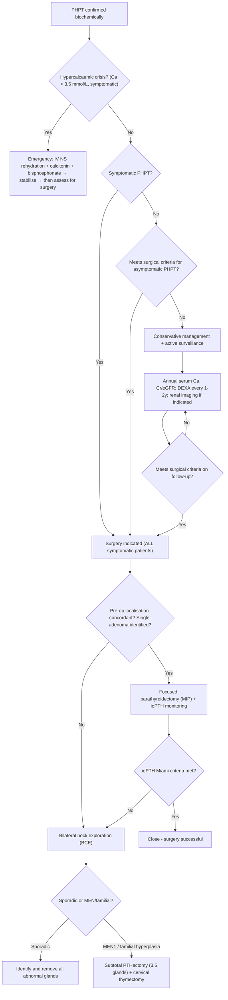
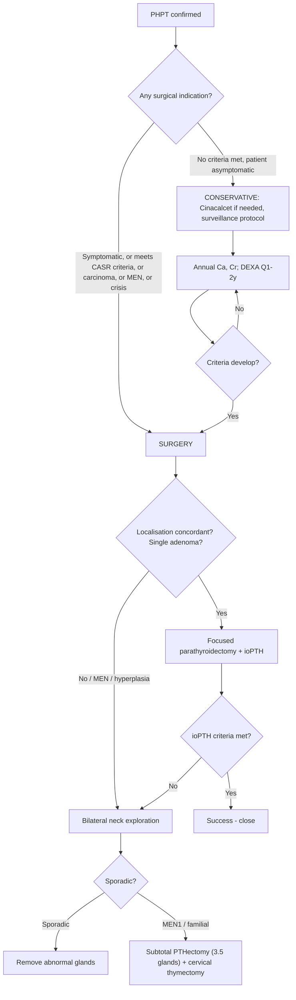

## Management of Primary Hyperparathyroidism

The management of PHPT follows a clear decision tree: **Is the patient a candidate for surgery? If yes, operate. If not, monitor and manage medically.** Surgery is the only curative treatment. Let's walk through the entire management framework systematically.

---

### 1. Overall Management Algorithm

---

### 2. Emergency Management of Severe Hypercalcaemia / Parathyroid Crisis

Before discussing definitive surgery, any patient presenting with **severe symptomatic hypercalcaemia (Ca > 3.5 mmol/L)** — sometimes called "parathyroid crisis" — needs **urgent medical stabilisation** [1]:

***Clinical setting: often associated with dehydration*** (hypercalcaemia → polyuria → volume depletion → ↓GFR → ↓renal Ca excretion → worsening hypercalcaemia — a vicious cycle) [1].

***Management aims: (1) rapid control of severe hypercalcaemia, (2) early diagnosis of cause*** [1].

| Step | Treatment | Dose / Regimen | Mechanism | Notes |
|:--|:--|:--|:--|:--|
| **1. Stop precipitants** | ***Remove offending drugs*** | ***Stop calcium supplements, vitamin D, thiazides, lithium, ranitidine*** | These drugs all contribute to ↑Ca via different mechanisms | Always take a drug history first [1] |
| **2. Rehydrate** | ***IV normal saline (NS)*** | ***100–500 mL/h until euvolaemic (est. 3–4 L/day)*** | ***Restores intravascular volume → ↓Na resorption in PCT/Loop → ↓Ca resorption*** (majority of Ca reabsorption in the kidney is Na-dependent and passive-paracellular in the PCT and thick ascending Loop of Henle) [1] | The single most important first step. Most patients are significantly dehydrated |
| **3. Loop diuretic** | ***Furosemide (lasix)*** | ***20–40 mg IV Q4–12H*** (only AFTER adequate hydration) | ***Inhibits Na⁺/K⁺/2Cl⁻ cotransporter in thick ascending LoH → ↓lumen-positive potential → ↓paracellular Ca²⁺ reabsorption → ↑urinary Ca excretion*** [1] | ***Must give ONLY after adequate hydration*** — otherwise worsens dehydration and hypercalcaemia. Monitor U/O (~200 mL/h target), Na/K/Ca/Mg |
| **4a. ↓ Bone resorption (rapid onset)** | ***Salmon calcitonin*** | ***4 U/kg IM/SC Q12H*** | Directly inhibits osteoclast activity → ↓bone resorption → ↓Ca release | ***Onset ≤ 2–3h (fast!) but tachyphylaxis sets in within 2–3 days*** → use as a bridge while waiting for bisphosphonate to take effect [1] |
| **4b. ↓ Bone resorption (sustained)** | ***IV bisphosphonate*** | ***Pamidronate 30–90 mg in 250–500 mL NS over 4–6 h*** OR ***zoledronate 4 mg IV over 15 min*** | Bisphosphonates are pyrophosphate analogues incorporated into bone matrix → taken up by osteoclasts during resorption → induce osteoclast apoptosis → ↓bone resorption | ***Pamidronate: max effect in several days, do NOT repeat before 7 days, effect lasts 2–4 weeks. Zoledronate: max effect at 72h.*** Precaution: ***C/I if eGFR < 30; renal dosing if eGFR < 60*** [1] |
| **5. Special situations** | ***Corticosteroids*** | ***Hydrocortisone 50 mg IV Q8H*** then PO 40–60 mg/day | ***↓calcitriol production*** — inhibit macrophage 1α-hydroxylase | Onset 3–5 days. ***Mainly for haem malignancy, vitamin D intoxication, granulomatous disease*** — NOT first-line for PHPT [1] |
| **6. Refractory / CKD** | ***Denosumab*** | Dose uncertain | RANKL inhibitor → ↓osteoclast activation | Especially useful in renal impairment (not renally cleared) [1] |
| | ***Cinacalcet*** | Calcimimetic | ***Allosteric agonist of CaSR → ↑CaSR sensitivity to Ca²⁺ → ↓PTH secretion*** | Powerful hypocalcaemic effect; can bridge to surgery [1][3] |
| | ***Haemodialysis*** | Zero/low Ca dialysate | Physically removes Ca from blood | ***Treatment of last resort*** [1] |

| | ***Pamidronate*** | ***Calcitonin*** |
|:--|:--|:--|
| **Onset** | ***Slow (several days)*** | ***Rapid (2–3 hours)*** |
| **Duration** | ***Long (2–4 weeks)*** | ***Short (tachyphylaxis in 2–3 days)*** |
| **Clinical use** | ***Mainstay — most potent*** | ***Bridge at the beginning while awaiting bisphosphonate effect*** |
| **Renal precaution** | ***C/I eGFR < 30; dose adjust eGFR < 60*** | None |

> ***Strategy: give calcitonin + bisphosphonate simultaneously at the start. Calcitonin provides rapid Ca lowering in the first 2–3 days while bisphosphonate's effect builds up. By the time calcitonin loses efficacy from tachyphylaxis, bisphosphonate has taken over*** [1].

---

### 3. Surgical Management — The Definitive Cure

Surgery (parathyroidectomy) is the **only curative treatment** for PHPT. It has a ***cure rate of ~95–98%*** and provides durable normalisation of calcium, improvement in BMD, reduction in fracture risk, and resolution of symptoms [1][3].

#### 3.1 Indications for Surgery

##### A. ***ALL symptomatic patients*** [2][3]

This is straightforward — any patient with symptoms attributable to PHPT should be offered surgery:
- Renal stones / nephrocalcinosis
- Symptomatic bone disease (fractures, significant bone pain)
- Symptomatic hypercalcaemia (psychic overtones, GI symptoms, polyuria)
- Parathyroid crisis

##### B. ***Asymptomatic patients meeting specific criteria*** [1][2][3]

Most PHPT patients today are asymptomatic. The question becomes: who among these should still be offered surgery? The guidelines (based on 5th International Workshop on PHPT, 2022, building on JCEM 2014) identify patients at highest risk of developing complications if left untreated:

<Callout title="Surgical Indications for Asymptomatic PHPT — Mnemonic: CASR">
***CASR*** (like the calcium-sensing receptor!) [2]:
- ***C — Calcium: adjusted Ca ≥ 0.25 mmol/L (1 mg/dL) above upper limit of normal*** (i.e. typically ≥ 2.85 mmol/L)
- ***A — Age: < 50 years*** (longer lifetime exposure to PTH → cumulative skeletal and renal damage)
- ***S — Skeletal: DEXA T-score ≤ −2.5*** at lumbar spine, total hip, femoral neck, ***or distal 1/3 radius***; ***OR vertebral fracture on imaging*** (XR, CT, MRI, or VFA)
- ***R — Renal:*** any of the following:
  - ***CrCl < 60 mL/min*** (eGFR < 60)
  - ***24h urine Ca > 400 mg/day*** (10 mmol/day) + ↑stone risk by biochemical stone risk analysis
  - ***Nephrolithiasis or nephrocalcinosis on imaging*** (XR, USG, or CT)
</Callout>

##### C. Other absolute surgical indications [3]

- ***Persistent or recurrent PHPT*** (after previous surgery)
- ***Familial PHPT*** (MEN1, MEN2A, HPT-JT)
- ***Parathyroid carcinoma*** (suspected or confirmed)
- ***Parathyroid crisis*** (severe hypercalcaemia with haemodynamic compromise)

> The logic behind these criteria: we are trying to identify patients who will progress to end-organ damage. A young patient (< 50) has decades of PTH exposure ahead. Markedly elevated calcium (≥ 2.85 mmol/L) predicts faster disease progression. Skeletal and renal damage, once established, may be partially irreversible. Surgery before damage accumulates is therefore recommended [1][3].

#### 3.2 Contraindications to Surgery [3]

| Contraindication | Rationale |
|:--|:--|
| ***Familial hypocalciuric hypercalcaemia (FHH)*** | ***Not PHPT. Surgery does not cure FHH*** because the CaSR defect is systemic (including renal). Patient will remain hypercalcaemic post-op |
| ***Known contralateral recurrent laryngeal nerve (RLN) injury*** | ***Bilateral RLN injury is life-threatening*** — causes bilateral vocal cord paralysis → airway obstruction requiring tracheostomy. If one RLN is already damaged, operating on the other side carries unacceptable risk |
| **Patient medically unfit for surgery** | Severe comorbidities precluding general/regional anaesthesia. These patients should be managed medically (calcimimetics, bisphosphonates) |
| Symptomatic cervical disc disease (relative) | May complicate neck positioning during surgery |

#### 3.3 Pre-operative Preparation

1. ***Pre-operative localisation studies*** — USG neck + sestamibi scan (± SPECT/CT, 4D CT) — to ***guide surgical strategy, NOT for diagnosis*** [3][4]
2. Review of vocal cord function (indirect laryngoscopy) — baseline RLN assessment
3. Optimise calcium if severely hypercalcaemic — IV hydration, calcitonin, bisphosphonate as needed
4. If MEN2 suspected: ***exclude phaeochromocytoma BEFORE any surgery*** (urine/plasma metanephrines)
5. Vitamin D repletion: if deficient, replete pre-op (reduces severity of post-op hungry bone syndrome)

#### 3.4 Surgical Options

##### A. ***Focused Parathyroidectomy (Minimally Invasive Parathyroidectomy — MIP)*** [2][3]

***This is the preferred approach when a single adenoma is identified on pre-operative localisation*** [2].

| Feature | Detail |
|:--|:--|
| **Indication** | ***Adenoma identified on pre-op localisation studies*** (concordant USG + sestamibi) [2] |
| **Rationale** | ***Based on the premise that ~80–85% of PHPT is due to a single adenoma*** [2] |
| **Approach** | ***Open with < 3 cm incision*** (fig.), video-assisted, or imaging-guided. Can be done under local/regional anaesthesia [1] |
| **Key requirement** | ***Intraoperative PTH (ioPTH) assay*** to confirm all hyperfunctioning tissue has been removed |
| **ioPTH — Miami criteria** | ***PTH must drop to normal range AND fall > 50% of the maximum pre-excision value, measured at 10 min post-gland excision*** (comparing pre-skin-incision or pre-manipulation level with 10 min post-excision level). This works because ***PTH half-life is only ~3–5 minutes*** [2][3] |
| **If Miami criteria NOT met** | ***Suspect multigland disease → convert to bilateral neck exploration (BCE)*** [2] |
| **Benefits** | ***↓surgery time, ↓dissection, ↓cost, smaller incision, ↓post-op hypocalcaemia*** (remaining normal glands are not disturbed), equal cure rate (~97–98%) when compared with BCE [3] |
| **Cure rate** | ***~98% curative, < 1% nerve injury*** [1] |

##### B. ***Bilateral Neck Exploration (BCE)*** [2][3]

| Feature | Detail |
|:--|:--|
| **Indications** | ***Conversion from focused parathyroidectomy*** (failed ioPTH criteria), ***MEN1/MEN2A***, ***uncertain/discordant imaging*** (USG not consistent with sestamibi), suspected multigland disease, negative localisation |
| **Approach** | ***Kocher's incision*** (transverse collar scar ~2 cm above sternal notch) [2] |
| **Goal** | Identify all four glands, determine which are abnormal, and remove appropriately |

Within BCE, the extent of resection depends on the pathology:

**i. Subtotal parathyroidectomy ("3.5 gland resection")** [2][3]

- ***3 glands completely resected***
- ***Fourth gland: half excised for frozen section*** (to confirm the tissue is indeed parathyroid), ***remaining half left in situ, marked with non-absorbable sutures*** (to aid identification if re-operation is needed) [2]
- ***50–80 mg of vascularised gland preserved*** [1]
- **Advantage:** ↓ risk of permanent hypoparathyroidism (some functioning tissue remains)
- **Disadvantage:** ↑ risk of persistent/recurrent hyperparathyroidism; re-operation in the neck is technically difficult if recurrence occurs

**ii. Total parathyroidectomy with autotransplantation** [3]

- ***All identifiable parathyroid glands removed***
- ***A small portion (~60 mg) of the most normal-appearing gland is diced into 1 mm³ fragments and autotransplanted into the non-dominant forearm*** (brachioradialis muscle) or neck (SCM) [2][3]
- **Rationale for forearm placement:**
  - ***Allows easy re-exploration under local anaesthesia*** if graft becomes hyperplastic/recurrent [3]
  - ***Graft function can be monitored*** by comparing PTH levels in ipsilateral vs contralateral forearm veins — a gradient confirms functioning graft [3]
  - ***Cryopreservation*** of remaining tissue allows delayed autotransplantation if graft fails [1][3]
- **Advantage:** Lower recurrence than subtotal; better symptom improvement [3]
- **Disadvantage:** Risk of profound hypoparathyroidism if autograft fails (countered by cryopreserved tissue); period of transient hypoparathyroidism before graft takes (~2–4 weeks)

**iii. Total parathyroidectomy without autotransplantation**

- ***Highest risk of permanent hypocalcaemia*** → reserved for severe cases where risk of leaving any parathyroid tissue is deemed too high (e.g. severe recurrent tertiary hyperPTH) [3]

##### C. ***Cervical Thymectomy*** [2][3][7]

- ***Performed in both total and subtotal parathyroidectomy*** (especially in MEN1)
- **Rationale:** Supernumerary parathyroid glands (5th, 6th glands) are most commonly located ***within the thymus*** (because inferior parathyroid glands and thymus share embryological origin from the 3rd pharyngeal pouch and co-migrate during development) [3]
- ***Indicated if MEN1 to resect supernumerary glands*** + also reduces risk of thymic carcinoid (a MEN1-associated tumour) [2][7]
- Important for patients with ***a missing inferior parathyroid gland or suspected supernumerary glands*** [3]

##### D. ***En Bloc Resection — For Parathyroid Carcinoma***

- Suspected parathyroid carcinoma (markedly ↑Ca, very high PTH, palpable mass, adherent to surrounding structures) requires ***en bloc resection*** of the tumour with the ipsilateral thyroid lobe, isthmus, and any adherent tissue
- Do NOT simply shell out the tumour — capsular rupture risks local seeding (parathyromatosis)
- Ipsilateral central neck dissection if lymph nodes are involved

#### 3.5 MEN-Specific Surgical Considerations [7]

| MEN Syndrome | Surgical Approach | Key Points |
|:--|:--|:--|
| ***MEN1*** | ***Subtotal parathyroidectomy (3.5 glands) + cervical thymectomy*** | Indications same as sporadic. ***High recurrence rate ( > 50% in 12 years)*** due to multiple adenomas/hyperplasia. Cervical thymectomy to ↓thymic carcinoid risk and remove supernumerary glands [7] |
| ***MEN2A*** | Similar to sporadic (focused or BCE depending on extent) | ***Usually mild, asymptomatic. NOT for prophylactic parathyroidectomy during thyroidectomy*** (as PHPT is usually mild in MEN2A). Manage only if symptomatic or meets criteria [7] |

---

### 4. Conservative / Medical Management

Medical management is for patients who ***do not meet surgical criteria OR are surgically unfit*** [1][2].

#### 4.1 Indications for Conservative Management

- Asymptomatic PHPT not meeting any surgical criteria
- Patient medically unfit for surgery (severe comorbidities, advanced age with limited life expectancy)
- Patient declines surgery

#### 4.2 General Measures

| Measure | Rationale |
|:--|:--|
| **Adequate hydration** (≥ 2 L/day) | Prevents dehydration → maintains renal Ca excretion |
| **Avoid dehydration, immobilisation** | Both worsen hypercalcaemia (dehydration → ↓GFR → ↓Ca excretion; immobilisation → ↑bone resorption) |
| **Moderate calcium intake** (~1000 mg/day) | Neither restrict nor load — restriction paradoxically stimulates PTH further; excess loads Ca into the system |
| **Replete vitamin D** (if deficient) | Co-existing vitamin D deficiency worsens hyperPTH and bone disease. Cautious repletion with monitoring of serum Ca |
| **Avoid thiazide diuretics** | Thiazides ↓urinary Ca excretion → worsen hypercalcaemia |
| **Exercise** | Weight-bearing exercise ↓bone resorption |

#### 4.3 Pharmacological Options [1][2]

| Agent | Mechanism | Effect in PHPT | Indications / Notes |
|:--|:--|:--|:--|
| ***Cinacalcet (calcimimetic)*** | ***Mimics action of Ca²⁺ on tissues by allosteric activation of the CaSR → ↑CaSR sensitivity → ↓PTH secretion*** [1][3] | ***Effective in lowering/normalising serum Ca but less consistent effect on serum PTH and NO consistent improvement in BMD*** [1] | ***Indicated when parathyroidectomy is indicated but surgery is contraindicated or refused*** [1][3]. Can be used as a bridge to surgery in hypercalcaemic crisis |
| **Bisphosphonates (e.g. alendronate)** | Inhibit osteoclast-mediated bone resorption | ↑BMD (especially at lumbar spine), but minimal effect on serum Ca or PTH | Primarily to address skeletal complications (osteoporosis) in non-surgical PHPT patients |
| **Denosumab** | RANKL inhibitor → ↓osteoclast activation → ↓bone resorption | ↑BMD, may ↓serum Ca | Emerging option, especially useful in renal impairment (not renally cleared). Monitor for rebound hypercalcaemia on cessation |
| **SERMs (e.g. raloxifene)** | Selective oestrogen receptor modulators → ↓bone resorption | Modest ↑BMD, modest ↓Ca | Limited evidence; occasionally used in postmenopausal women [2] |
| **HRT (oestrogen replacement)** | ↓bone resorption via oestrogen action on osteoblasts/osteoclasts | ↓Ca, ↑BMD | Historical option; now rarely used due to HRT-related risks (VTE, breast cancer) |

<Callout title="Cinacalcet — The Key Medical Agent">
"Cinacalcet" → "cina" = mimics calcium; "calcet" = calcium-related. It is a ***calcimimetic*** — it fools the CaSR into thinking calcium is higher than it really is.

**How it works from first principles:** Cinacalcet binds to an allosteric site on the CaSR (not the Ca²⁺-binding site itself). This makes the CaSR more sensitive to circulating Ca²⁺ → at any given Ca²⁺ level, the receptor signals more strongly → PTH secretion is suppressed → serum Ca drops.

**Why doesn't it improve BMD?** Because while it lowers Ca and partially ↓PTH, the remaining PTH that is still secreted continues to drive bone turnover. The bone benefits of surgery (complete PTH normalisation) are not fully replicated.

***Bottom line: cinacalcet normalises calcium, but surgery normalises everything (Ca, PTH, and BMD).***
</Callout>

#### 4.4 Active Surveillance Protocol for Non-Surgical Patients [1]

***Regular monitoring*** is mandatory for any patient with PHPT not undergoing surgery:

| Parameter | Frequency | Rationale |
|:--|:--|:--|
| ***Serum calcium*** | ***Annually*** | Detect worsening hypercalcaemia |
| ***Serum creatinine / eGFR*** | ***Annually*** | Detect progressive renal impairment |
| ***DEXA at 3 sites*** (L-spine, hip, distal 1/3 radius) | ***Every 1–2 years*** | Detect progressive bone loss (T-score ≤ −2.5 triggers surgical referral) |
| ***Spine imaging*** (XR/VFA) | If clinically indicated (height loss, back pain) | Detect new vertebral fractures |
| ***Renal imaging*** (USG/CT) + 24h urine | If stone symptoms or biochemical stone risk analysis changes | Detect new nephrolithiasis |

> ***If at any point during surveillance the patient meets surgical criteria → refer for surgery*** [1].

---

### 5. Post-Operative Management and Monitoring

#### 5.1 Immediate Post-Op Care

| Issue | Management |
|:--|:--|
| ***Serum Ca monitoring*** | ***Routinely check Ca on post-op Day 1*** [2]. In high-risk patients (high pre-op ALP, large adenoma, severe bone disease), check Ca Q6–8h |
| ***Hypocalcaemia (most common post-op complication)*** | Expected and usually transient. Causes: (1) ***Transient suppression of remaining normal parathyroid glands*** — they have been chronically suppressed by the adenoma's autonomous PTH secretion and need time to "wake up" (days to weeks) [2]; (2) ***Hungry bone syndrome*** |
| ***Hungry bone syndrome*** | ***Rapid, profound hypocalcaemia*** due to ***sudden drop in PTH → abrupt shift from net bone resorption to net bone formation → calcium, phosphate, and magnesium are rapidly deposited into demineralised bone*** → serum Ca crashes [2][5]. ***Predicted by high pre-op ALP*** [2]. Mx: aggressive IV Ca gluconate + oral calcium + calcitriol |
| **Airway monitoring** | Watch for neck haematoma (reactionary haemorrhage) → can cause airway compression. Keep clip removers at bedside |
| **Voice assessment** | Assess for hoarseness (RLN injury) |

#### 5.2 Long-Term Follow-Up

| Monitoring | Details |
|:--|:--|
| **Serum Ca, PTH** | Confirm cure (normalised Ca and PTH). Check at 6 months and annually |
| **DEXA** | Repeat at 1–2 years to document BMD improvement (expected to improve after curative surgery) |
| **Renal function** | Annual Cr/eGFR |
| ***Permanent hypoparathyroidism*** | Defined as ***requirement for calcium and/or vitamin D supplementation at 1 year post-op*** [2]. Occurs in < 1–3% after focused parathyroidectomy; higher risk after total parathyroidectomy |

#### 5.3 Persistent vs Recurrent PHPT [2]

| Term | Definition | Usual Cause | Management |
|:--|:--|:--|:--|
| ***Persistent PHPT*** | ***Hypercalcaemia persisting < 6 months post-op*** | ***Missed pathology*** (unidentified second adenoma, ectopic gland, supernumerary gland) | ***Re-localisation imaging (sestamibi, 4D CT) → bilateral neck exploration*** |
| ***Recurrent PHPT*** | ***Hypercalcaemia recurring > 6 months post-op*** (after initial documented cure) | ***Missed pathology; parathyromatosis*** (disseminated parathyroid tissue seeded during initial surgery from capsule rupture — rare but troublesome) | ***Re-localisation → targeted re-exploration; parathyromatosis is very difficult to cure*** [2] |

---

### 6. Summary: Choosing the Right Approach

---

<Callout title="High Yield Summary — Management of PHPT">

1. **Surgery is the only cure.** Cure rate ~95–98%.
2. ***ALL symptomatic patients → surgery.***
3. ***Asymptomatic surgical criteria (CASR):*** Ca ≥ 2.85 (0.25 above ULN), Age < 50, Skeletal (T ≤ −2.5 or vertebral fracture), Renal (CrCl < 60 / urine Ca > 400 mg/d / stones on imaging).
4. ***Other absolute indications:*** parathyroid carcinoma, parathyroid crisis, familial PHPT, persistent/recurrent PHPT.
5. ***Contraindications:*** FHH (surgery won't cure it), contralateral RLN injury, medically unfit.
6. ***Focused parathyroidectomy:*** when single adenoma identified on concordant USG + sestamibi. Small incision, ioPTH monitoring, ↓complications.
7. ***ioPTH Miami criteria:*** PTH drops > 50% of max AND returns to normal at 10 min post-excision. If NOT met → convert to BCE.
8. ***MEN1:*** subtotal (3.5 glands) + cervical thymectomy. High recurrence ( > 50% in 12y).
9. ***MEN2A:*** NOT prophylactic PTHectomy during thyroidectomy (usually mild/asymptomatic).
10. ***Medical Mx:*** Cinacalcet (normalises Ca, not BMD), bisphosphonates (↑BMD), denosumab. For non-surgical candidates.
11. ***Surveillance:*** annual Ca, Cr; DEXA Q1–2y at 3 sites; spine/renal imaging prn. Refer for surgery if criteria develop.
12. ***Post-op:*** watch for hypocalcaemia (transient gland suppression, hungry bone syndrome). Check Ca Day 1. ↑ALP pre-op predicts hungry bone.
13. ***Hungry bone syndrome:*** sudden ↓PTH → bone shifts from resorption to formation → Ca/PO₄/Mg crash. Mx: IV Ca + calcitriol.
14. ***Persistent ( < 6 mo) vs recurrent ( > 6 mo) PHPT:*** usually missed pathology. Parathyromatosis from capsule rupture is rare but devastating.
15. ***Permanent hypoparathyroidism:*** needing Ca/vitamin D at 1 year post-op. < 1–3% after focused PTHectomy.

</Callout>

---

<ActiveRecallQuiz
  title="Active Recall - Management of PHPT"
  items={[
    {
      question: "List the surgical indications for asymptomatic PHPT using the CASR mnemonic.",
      markscheme: "C = Calcium: adjusted Ca at least 0.25 mmol/L above upper limit of normal (i.e. typically 2.85 mmol/L or above). A = Age less than 50. S = Skeletal: DEXA T-score -2.5 or worse at any of 4 sites (lumbar spine, total hip, femoral neck, distal 1/3 radius) OR vertebral fracture on imaging. R = Renal: CrCl less than 60, OR 24h urine Ca greater than 400 mg/day plus increased stone risk, OR nephrolithiasis/nephrocalcinosis on imaging."
    },
    {
      question: "Describe the emergency management of severe hypercalcaemia in PHPT, in order of steps.",
      markscheme: "1. Stop precipitants (Ca supplements, vitamin D, thiazides, lithium). 2. IV normal saline rehydration 100-500 mL/h until euvolaemic (mechanism: restores volume, reduces Na and Ca reabsorption in PCT/LoH). 3. Loop diuretic ONLY after adequate hydration (inhibits Na/K/2Cl cotransporter in LoH, reduces paracellular Ca reabsorption). 4. Calcitonin 4 U/kg SC/IM Q12H for rapid onset (2-3h) but tachyphylaxis in 2-3 days. 5. IV bisphosphonate (pamidronate or zoledronate) for sustained effect (max several days, lasts 2-4 weeks). 6. If refractory: denosumab, cinacalcet, or HD with low-Ca dialysate."
    },
    {
      question: "What are the Miami criteria for intraoperative PTH assay, and what action do you take if criteria are not met?",
      markscheme: "Miami criteria: PTH must drop to normal range AND decrease by greater than 50% compared to the highest of either the pre-manipulation or pre-excision sample, measured at 10 minutes after gland excision. This works because PTH half-life is 3-5 minutes. If criteria not met: suspect multigland disease (double adenoma or hyperplasia) and convert from focused parathyroidectomy to bilateral neck exploration."
    },
    {
      question: "Why is cinacalcet effective at lowering serum calcium but does NOT consistently improve BMD?",
      markscheme: "Cinacalcet is a calcimimetic that allosterically activates the CaSR on parathyroid chief cells, making them more sensitive to circulating calcium. This suppresses PTH secretion and lowers serum calcium. However, it does not fully normalise PTH levels, so residual PTH continues to drive bone turnover. Surgery, which completely removes the autonomous source of PTH, normalises both calcium and bone metabolism, leading to BMD improvement."
    },
    {
      question: "Define hungry bone syndrome: when does it occur, what predicts it, and how is it managed?",
      markscheme: "Hungry bone syndrome is rapid, profound hypocalcaemia (also hypophosphataemia and hypomagnesaemia) occurring immediately after parathyroidectomy/thyroidectomy. Mechanism: sudden loss of PTH stimulation causes an abrupt shift from net bone resorption to net bone formation, so calcium, phosphate, and magnesium are rapidly deposited into previously demineralised bone. Predicted by elevated pre-operative ALP (reflects high bone turnover). Management: aggressive IV calcium gluconate, oral calcium supplements, and calcitriol (active vitamin D). Close monitoring of serum Ca Q6-8h."
    },
    {
      question: "Why is FHH a contraindication to parathyroidectomy?",
      markscheme: "FHH is caused by an inactivating CaSR mutation that is systemic, affecting both the parathyroid glands and the kidneys. Even if parathyroid glands are removed, the kidneys continue to avidly reabsorb calcium due to their own defective CaSR, so hypercalcaemia persists. Surgery does not cure FHH and exposes the patient to unnecessary surgical risks including permanent hypoparathyroidism."
    }
  ]}
/>

## References

[1] Senior notes: Ryan Ho Endocrine.pdf (pp. 41–43 — Management of severe hypercalcaemia, PHPT surgical indications, conservative Tx)
[2] Senior notes: maxim.md (Primary hyperparathyroidism — surgical indications CASR, focused PTHectomy, BCE, complications)
[3] Senior notes: felixlai.md (Hyperparathyroidism — medical Tx, surgical indications, focused PTHectomy, BCE, subtotal/total, thymectomy, pp. 1517–1519)
[4] Senior notes: Ryan Ho Diagnostic Radiology.pdf (p. 60 — Parathyroid scintigraphy, localisation)
[5] Senior notes: Adrian Lui Pediatrics.pdf (p. 278 — Hungry bone syndrome definition)
[7] Senior notes: Ryan Ho Endocrine.pdf (pp. 132–133 — MEN1 and MEN2 surgical management)
