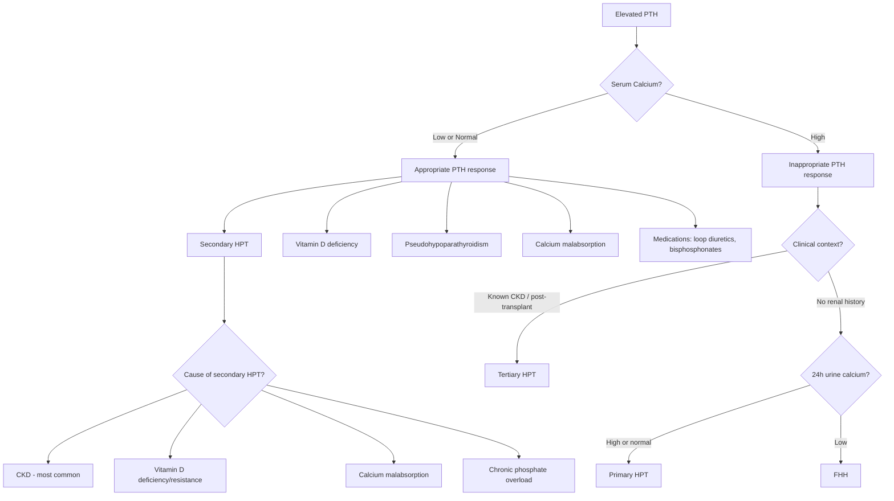

## Differential Diagnosis of Secondary & Tertiary Hyperparathyroidism

The differential diagnosis here is really about two clinical scenarios: (1) a patient with **elevated PTH** — what is driving it? and (2) a patient with **disordered calcium** (hypo- or hypercalcaemia) in the context of CKD or post-transplant — what else could explain the biochemistry?

Let's think about this systematically from first principles.

---

### The Core Diagnostic Question

When you encounter **elevated PTH**, the first branch point is: **Is the calcium high, low, or normal?**

- **↑ PTH + ↓/normal Ca²⁺** → The PTH elevation is **appropriate** (compensatory) → **Secondary HPT** or its mimics
- **↑ PTH + ↑ Ca²⁺** → The PTH elevation is **inappropriate** (autonomous) → **Primary HPT**, **Tertiary HPT**, or **Familial Hypocalciuric Hypercalcaemia (FHH)**

This is the fundamental framework. Everything else is refining which specific diagnosis within each branch.

---

### Differential Diagnosis Algorithm

---

### Detailed Differential Diagnosis

#### A. Differentials for Elevated PTH with Low/Normal Calcium (i.e., DDx of Secondary HPT)

The question here is: **Why is the calcium chronically low, driving compensatory PTH secretion?**

| Differential | How to Distinguish | Key Investigations |
|---|---|---|
| **CKD (most common cause of secondary HPT)** | History of CKD, diabetes, hypertension. Progressive over years. Elevated creatinine, low GFR. Hyperphosphataemia is characteristic | RFT (↑creatinine, ↑urea, ↓eGFR), ↑PO₄, ↓1,25-(OH)₂-D₃, ↑FGF-23 |
| **Vitamin D deficiency** (dietary, malabsorption, lack of sunlight) | No CKD. Low 25-OH-D is the hallmark. PO₄ may be low/normal (PTH drives phosphaturia, and kidneys are working). Often elderly, institutionalised, dark-skinned, or malabsorption history | **25-OH vitamin D** (will be low, < 50 nmol/L). Normal RFT. PO₄ normal or ↓ |
| **Calcium malabsorption** (coeliac disease, post-gastrectomy, chronic pancreatitis, short bowel syndrome) | Malabsorption history, steatorrhoea, weight loss. Low calcium despite adequate diet | Tissue transglutaminase Ab (coeliac), faecal elastase (pancreatic insufficiency), endoscopy with duodenal biopsy |
| **Pseudohypoparathyroidism (PHP)** | **↓Ca, ↑PO₄, ↑PTH** — looks biochemically like hypoparathyroidism but PTH is actually high (end-organ resistance to PTH). Phenotypic features: ***Albright hereditary osteodystrophy*** — short stature, round face, shortened 4th/5th metacarpals, mental retardation [8]. Cause: maternal *GNAS1* mutation → defective Gsα → PTH receptor cannot signal | Genetic testing for GNAS1 mutation. Ellsworth-Howard test (infuse PTH → measure urinary cAMP and phosphate response — in PHP, no increase) |
| **Chronic liver disease** | Impaired 25-hydroxylation of vitamin D (first hydroxylation step occurs in liver). History of alcohol, viral hepatitis, etc. | LFT, 25-OH vitamin D (low), normal 1α-hydroxylase function (so 1,25-D₃ may be appropriate for the 25-OH-D level) |
| **Medications** | **Loop diuretics** (furosemide) → inhibit Na⁺/K⁺/2Cl⁻ cotransporter in thick ascending limb → abolish lumen-positive potential → ↓ paracellular Ca²⁺ reabsorption → hypocalciuria and hypocalcaemia [3]. **Bisphosphonates** → ↓ bone resorption → transient ↓Ca. **Phenytoin/carbamazepine** → induce CYP450 → accelerate vitamin D metabolism → ↓ vitamin D | Drug history! |
| **Hungry bone syndrome** (post-parathyroidectomy) | Acute profound hypocalcaemia after parathyroidectomy. Sudden drop in PTH → rapid deposition of calcium into demineralised bone that was previously being resorbed by excess PTH [2] | Timing: occurs post-operatively. ↓↓Ca, ↓PO₄, ↓Mg. PTH appropriately rising in response |

<Callout title="Vitamin D Deficiency vs CKD as Causes of Secondary HPT — How to Tell Apart" type="idea">
The key distinguishing features:
- **Phosphate**: In CKD, PO₄ is **high** (can't excrete it). In vitamin D deficiency with normal kidneys, PO₄ is **low or normal** (PTH drives phosphaturia and the kidneys comply).
- **25-OH vitamin D**: Low in vitamin D deficiency. May also be low in CKD but is not the primary driver.
- **1,25-(OH)₂-D₃**: Low in CKD (↓1α-hydroxylase). In pure vitamin D deficiency, the 1α-hydroxylase is intact, so 1,25-D₃ may be inappropriately normal or even high (driven by the elevated PTH stimulating the remaining substrate).
- **RFT**: Abnormal in CKD, normal in vitamin D deficiency.
</Callout>

#### B. Differentials for Elevated PTH with High Calcium (i.e., DDx of Tertiary HPT)

This is the critical differential because the management differs dramatically.

| Differential | How to Distinguish | Key Investigations |
|---|---|---|
| **Tertiary HPT** | History of **prolonged CKD/dialysis** ± **renal transplantation**. Hypercalcaemia persists > 6–12 months post-transplant. All 4 glands typically enlarged | Clinical context is key. ↑Ca, ↑PTH, history of CKD. Imaging: USG + Sestamibi may show multigland enlargement |
| **Primary HPT** | **No history of CKD**. Sporadic or familial (MEN1, MEN2A). Usually **single adenoma (85%)** [2][3]. Can present at any age but peak in postmenopausal women | ***24h urine calcium (must check!)*** — will be high/normal in primary HPT [2]. Localisation: ***USG + Sestamibi scan*** [2][9] |
| **Familial Hypocalciuric Hypercalcaemia (FHH)** | Autosomal dominant. Inactivating mutation in **CaSR** → parathyroid gland "set point" for calcium is raised → mild hypercalcaemia with **inappropriately normal or mildly elevated PTH**. Crucially: ***24h urine calcium is LOW*** (Ca/Cr clearance ratio < 0.01) because the renal CaSR is also affected → kidney reabsorbs too much calcium [2][5]. Lifelong, often asymptomatic, **does NOT require surgery** | ***24h urine Ca/Cr clearance ratio*** — this is the key test to differentiate FHH from primary HPT. FHH: < 0.01. Primary HPT: > 0.02. Grey zone: 0.01–0.02 (consider genetic testing) |
| **Hypercalcaemia of malignancy** | Usually **PTH is suppressed** (appropriately) because hypercalcaemia is PTH-independent. Mechanisms: ectopic PTHrP (SCC lung, HCC, breast), local osteolysis (breast, myeloma), ectopic 1,25-D₃ (lymphoma) [5]. Very rarely, ectopic PTH production can occur | PTH is **low/suppressed** (unlike tertiary HPT where PTH is high). PTHrP may be elevated. Cancer screen: CT CAP, serum/urine protein electrophoresis, tumour markers |
| **Lithium use** | Lithium shifts the CaSR set point → higher calcium required to suppress PTH → mild hypercalcaemia with inappropriately normal/elevated PTH. Can mimic primary HPT | Drug history! Lithium use in psychiatric patients (bipolar disorder). Resolves on cessation (though some develop true adenoma with prolonged use) |

> **Exam pearl**: The single most important investigation to distinguish **primary HPT from FHH** is the ***24h urine calcium*** [2]. FHH is a benign condition that does NOT require parathyroidectomy — operating on an FHH patient is a classic exam pitfall.

<Callout title="Common Exam Mistake" type="error">
Students often confuse tertiary HPT with primary HPT because both present with **↑Ca and ↑PTH**. The distinction is entirely **clinical context**:
- **Primary HPT**: No prior renal disease. Sporadic adenoma or MEN-associated.
- **Tertiary HPT**: Always has a background of **prolonged secondary HPT** (CKD/dialysis). Usually post-transplant.

Biochemically they can look identical — the history is what separates them. Also, in primary HPT you expect a **single adenoma** in ~85% of cases, whereas in tertiary HPT, **all 4 glands** are typically enlarged (diffuse/nodular hyperplasia with autonomous transformation).
</Callout>

#### C. Differentials for Hypocalcaemia in CKD (Beyond Secondary HPT)

When managing a CKD patient with hypocalcaemia, don't automatically assume it's all secondary HPT — there may be additional contributing factors:

| Differential | Distinguishing Features |
|---|---|
| **Hypomagnesaemia** | Severe hypoMg (< 0.3 mmol/L) → **inhibits both PTH secretion and PTH action** → hypocalcaemia ***refractory to calcium replacement*** [8]. Classic triad: hypoCa + hypoK + hypoMg. Common in CKD patients on loop diuretics, proton pump inhibitors, or with GI losses |
| **Aluminium toxicity** | Historical cause — aluminium-containing phosphate binders (now rarely used). Aluminium deposits in bone → impairs mineralisation → osteomalacia variant. Also deposits at the mineralisation front → adynamic bone disease. Diagnosed by aluminium levels, desferrioxamine test |
| **Adynamic bone disease** (iatrogenic over-suppression of PTH) | ***Over-treatment with vitamin D analogues or calcimimetics*** → excessive PTH suppression → too little bone turnover → hypocalcaemia can paradoxically occur because the bone can't buffer calcium normally [4]. PTH is **inappropriately low** for a CKD patient |
| **Post-parathyroidectomy hypoparathyroidism** | If the patient has had prior parathyroid surgery → permanent hypoparathyroidism → ↓PTH → ↓Ca [2] |
| **Acute pancreatitis** | Saponification of calcium in necrotic fat → acute drop in ionised Ca²⁺ |
| **Massive transfusion / citrate toxicity** | Citrate in stored blood chelates ionised calcium → acute hypocalcaemia |

#### D. Differentials for Bone Disease in CKD (Beyond Renal Osteodystrophy)

| Differential | How to Distinguish |
|---|---|
| **Osteoporosis** (age-related, post-menopausal, steroid-induced) | DEXA scan shows ↓BMD. Normal Ca/PO₄/PTH. CKD patients on long-term steroids post-transplant are at high risk |
| **Myeloma bone disease** | Lytic lesions (not blastic), anaemia, renal impairment, hypercalcaemia with **suppressed PTH**, ↑globulin, Bence Jones proteinuria. Serum/urine protein electrophoresis, bone marrow biopsy |
| **Paget's disease of bone** | Localised (not generalised). **Markedly elevated ALP** with **normal Ca and PO₄** (unless immobilised → then ↑Ca). Characteristic radiological features: cortical thickening, mixed lytic/sclerotic lesions, bowing of long bones [3]. Can coexist with CKD-MBD |
| **Metastatic bone disease** | History of primary malignancy (breast, prostate, lung, kidney, thyroid). Focal bone pain, pathological fractures. Bone scan shows focal uptake (vs. superscan in secondary HPT which is diffuse symmetric) [9] |
| **Myelofibrosis** | Bone marrow fibrosis — can be associated with secondary HPT as a non-haematological cause of marrow fibrosis [10]. Distinguished by blood film (tear-drop cells, leucoerythroblastic picture), splenomegaly, and bone marrow biopsy |

---

### Approach to Differentiating Secondary vs Tertiary HPT — A Practical Summary

| Feature | Secondary HPT | Tertiary HPT | Primary HPT | FHH |
|---------|--------------|-------------|-------------|-----|
| **Serum Ca²⁺** | ↓ or normal | **↑** | **↑** | Mild ↑ |
| **Serum PO₄** | ↑ (CKD) | Variable | ↓ or normal | Normal |
| **PTH** | ↑ (appropriate) | ↑ (inappropriate) | ↑ (inappropriate) | Normal or mild ↑ |
| **25-OH Vit D** | Often ↓ | Variable | Check to rule out deficiency | Normal |
| **1,25-(OH)₂-D₃** | ↓ | May normalise post-Tx | ↑ (PTH stimulates 1α-hydroxylase) | Normal |
| **24h urine Ca** | ↓ (CKD) | Variable | **↑** | **↓↓** (< 0.01 Ca/Cr ratio) |
| **RFT** | Abnormal | Often abnormal (prior CKD) | **Normal** | Normal |
| **Gland pathology** | 4-gland hyperplasia | Nodular hyperplasia / adenomatous | Single adenoma (85%) | Normal glands |
| **CKD/dialysis Hx** | **Yes** | **Yes** | **No** | No |
| **Surgery needed?** | Rarely (medical Mx first) | Often yes | Often yes | **No** |

<Callout title="High Yield Summary — Differential Diagnosis">

**When you see ↑PTH, always ask: What is the calcium?**
- **↑PTH + ↓/normal Ca** → Secondary HPT (CKD > vitamin D deficiency > calcium malabsorption > pseudohypoparathyroidism > medications)
- **↑PTH + ↑Ca** → Tertiary HPT (if CKD/transplant background), Primary HPT (if no renal history), or FHH (if low urine calcium)
- **↓PTH + ↑Ca** → NOT hyperparathyroidism at all — think malignancy, vitamin D intoxication, granulomatous disease, thiazide diuretics

**Key distinguishing tests:**
1. **RFT and eGFR** — separates CKD-related causes from non-CKD
2. **25-OH Vitamin D** — identifies vitamin D deficiency
3. **24h urine calcium** — separates primary HPT from FHH (must check!) [2]
4. **Serum phosphate** — high in CKD, low/normal in primary HPT and vitamin D deficiency
5. **Clinical context** — history of CKD, dialysis, transplantation is what separates secondary/tertiary HPT from primary HPT

**Don't forget**: Pseudohypoparathyroidism (PTH resistance — GNAS1 mutation) mimics hypoparathyroidism biochemically but has HIGH PTH. Distinguished by Albright hereditary osteodystrophy phenotype and genetic testing [8].
</Callout>

---

<ActiveRecallQuiz
  title="Active Recall - Differential Diagnosis of Secondary & Tertiary HPT"
  items={[
    {
      question: "A post-renal transplant patient has persistent hypercalcaemia with elevated PTH. What are the top 3 differentials and how would you distinguish them?",
      markscheme: "1. Tertiary HPT (most likely — prolonged CKD/dialysis history, multigland disease, autonomous PTH secretion persisting >6-12 months post-transplant). 2. Primary HPT (less likely but possible — single adenoma, no prior CKD, check 24h urine calcium which is high). 3. FHH (low 24h urine calcium, Ca/Cr clearance ratio <0.01, benign, does not need surgery). Distinguish by: clinical context (CKD history), 24h urine calcium, imaging (multigland vs single adenoma)."
    },
    {
      question: "How does the serum phosphate help you differentiate between secondary HPT due to CKD versus secondary HPT due to vitamin D deficiency?",
      markscheme: "In CKD: phosphate is HIGH because the kidneys cannot excrete it (reduced GFR leads to phosphate retention). In vitamin D deficiency with normal kidneys: phosphate is LOW or NORMAL because PTH drives phosphaturia and the kidneys comply with normal function. This is because the phosphaturic action of PTH requires functioning kidneys."
    },
    {
      question: "What is the single most important investigation to distinguish primary HPT from FHH, and what result would you expect in each?",
      markscheme: "24-hour urine calcium (or calcium-to-creatinine clearance ratio). Primary HPT: urinary calcium is HIGH or normal (Ca/Cr ratio >0.02) because high serum calcium leads to filtered calcium exceeding reabsorptive capacity. FHH: urinary calcium is LOW (Ca/Cr ratio <0.01) because the inactivating CaSR mutation in the kidney causes excessive calcium reabsorption. This distinction is critical because FHH does NOT require surgery."
    },
    {
      question: "A CKD Stage 5 patient on dialysis has hypocalcaemia refractory to calcium and vitamin D replacement. PTH is paradoxically low. What should you suspect and why?",
      markscheme: "Two main possibilities: 1. Hypomagnesaemia — severe hypoMg (<0.3 mmol/L) inhibits both PTH secretion and PTH action, causing hypocalcaemia refractory to replacement. Classic triad: hypoCa + hypoK + hypoMg. Check magnesium. 2. Adynamic bone disease from over-suppression of PTH — iatrogenic from excessive vitamin D analogues or calcimimetics, leading to inappropriately low PTH for a CKD patient. Bone biopsy would show low turnover."
    },
    {
      question: "Why is hypercalcaemia of malignancy NOT a differential for secondary or tertiary HPT? What is the key biochemical distinction?",
      markscheme: "Hypercalcaemia of malignancy is PTH-INDEPENDENT — the PTH level is appropriately SUPPRESSED (low) because the hypercalcaemia is driven by PTHrP, local osteolysis, or ectopic vitamin D production, not by the parathyroid glands. In contrast, secondary and tertiary HPT are both PTH-DEPENDENT with elevated PTH. The key distinction is the PTH level: suppressed in malignancy, elevated in hyperparathyroidism."
    }
  ]}
/>

---

## References

[2] Senior notes: maxim.md (Primary hyperparathyroidism, Tertiary hyperparathyroidism sections)
[3] Senior notes: Ryan Ho Endocrine.pdf (p41 — Hyperparathyroidism classification; p53 — Paget's disease)
[4] Senior notes: Ryan Ho Urogenital.pdf (p107 — CKD-MBD, adynamic bone disease, iatrogenic contributions)
[5] Senior notes: Ryan Ho Fundamentals.pdf (p430 — Hypercalcemia approach, PTH-dependent vs independent)
[8] Senior notes: Ryan Ho Chemical Path.pdf (p25 — Pseudohypoparathyroidism, hypomagnesaemia, renal failure hypocalcaemia)
[9] Senior notes: Ryan Ho Diagnostic Radiology.pdf (p60 — Parathyroid scintigraphy; p68 — Bone scan, superscan)
[10] Senior notes: Ryan Ho Haemtology.pdf (p77 — Myelofibrosis, secondary HPT as associated condition)
