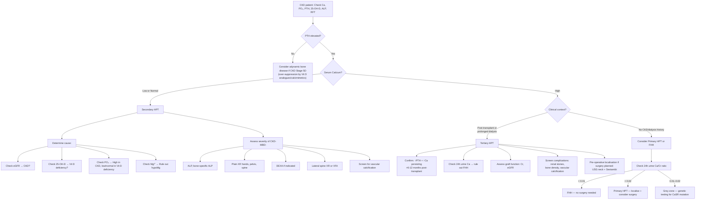

## Diagnostic Criteria, Algorithm & Investigations for Secondary & Tertiary HPT

### Important Framing: There Are No "Diagnostic Criteria" in the Traditional Sense

Unlike primary HPT (where you need ↑Ca + inappropriately ↑PTH + normal RFT as a diagnostic triad [3]), secondary and tertiary HPT are **diagnosed by the combination of biochemistry + clinical context**. There is no single threshold or consensus "criteria set" like the Jones criteria for rheumatic fever. Instead, the diagnosis rests on:

1. **Demonstrating elevated PTH**
2. **Interpreting the PTH in the context of calcium, phosphate, vitamin D, and renal function**
3. **Determining whether the PTH elevation is appropriate (secondary) or autonomous (tertiary)**

Let's build the diagnostic framework systematically.

---

### Diagnostic Definitions (Working Criteria)

| Diagnosis | Biochemical Pattern | Clinical Context Required |
|---|---|---|
| **Secondary HPT** | ↑PTH + ↓ or normal Ca²⁺ + usually ↑PO₄ (if CKD) or ↓PO₄ (if vit D deficiency) | Known CKD (most common), vitamin D deficiency, calcium malabsorption, or other cause of chronic hypocalcaemia |
| **Tertiary HPT** | ↑PTH + **↑Ca²⁺** (hypercalcaemia) | History of **prolonged secondary HPT** (CKD/dialysis), typically diagnosed **> 6–12 months post-renal transplant** when hypercalcaemia persists despite restoration of renal function [2][4] |

<Callout title="When Exactly Does Secondary Become Tertiary?">
There is no single PTH cutoff that defines the transition. The key distinction is **autonomy**: if you remove the stimulus (e.g., by transplanting a kidney) and the PTH **still doesn't come down** and the patient is **hypercalcaemic**, the glands have become autonomous = tertiary HPT. Practically, most clinicians allow **6–12 months post-transplant** for regression before labelling it tertiary. On dialysis without transplant, "tertiary" is diagnosed when the patient develops **persistent hypercalcaemia** despite optimal medical management of secondary HPT.
</Callout>

---

### KDIGO Target Ranges for Secondary HPT in CKD (2017 Updated Guidelines)

While not "diagnostic criteria," the **KDIGO (Kidney Disease: Improving Global Outcomes)** guidelines provide target ranges for biochemical markers in CKD-MBD that define when secondary HPT is clinically significant and needs treatment:

| Parameter | CKD Stage 3–5 (not on dialysis) | CKD Stage 5D (on dialysis) |
|---|---|---|
| **PTH** | Maintain within normal range for the assay | Maintain at **2–9× the upper limit of normal** for the assay (typically ~130–600 pg/mL for intact PTH assays with ULN ~65 pg/mL) |
| **Serum Calcium** | Maintain within normal range | Maintain within normal range |
| **Serum Phosphate** | Maintain within normal range | Lower towards normal range (target ~1.13–1.78 mmol/L) |
| **ALP** | Monitor trends | Monitor trends — persistent elevation suggests high turnover bone disease |

> **Why is the PTH target so high in dialysis patients (2–9× ULN)?** Because some degree of elevated PTH is actually *needed* to maintain adequate bone turnover. Suppressing PTH too aggressively leads to **adynamic bone disease** (low turnover → brittle bone → fractures, and inability to buffer calcium → hypercalcaemia episodes) [4]. The PTH target intentionally accepts mild hyperparathyroidism to avoid over-suppression.

<Callout title="Exam Pearl" type="error">
A common mistake is treating PTH to normal levels in a dialysis patient. **You should NOT aim for normal PTH in dialysis patients** — the target is 2–9× ULN. Over-suppression causes adynamic bone disease, which is increasingly the most common form of renal osteodystrophy [4].
</Callout>

---

### Diagnostic Algorithm

---

### Investigation Modalities: Detailed Breakdown

#### A. First-Line Biochemical Investigations

These are done in **every patient** with suspected or confirmed secondary/tertiary HPT.

| Investigation | What It Tells You | Key Findings & Interpretation |
|---|---|---|
| **Serum Calcium (total + albumin-corrected, or ionised)** | The central parameter — determines whether HPT is secondary (↓/normal Ca) or tertiary (↑Ca) | Corrected Ca = total Ca + 0.02 × (40 – albumin in g/L). In CKD, hypoalbuminaemia is common → total Ca may be falsely low → always correct for albumin or use **ionised calcium** (gold standard). Ionised Ca is also affected by acid-base status: acidosis → ↑ ionised Ca (H⁺ displaces Ca²⁺ from albumin), alkalosis → ↓ ionised Ca |
| **Serum Phosphate** | Reflects GFR and dietary phosphate load | ↑ in CKD (can't excrete). ↓ or normal in vitamin D deficiency (PTH-driven phosphaturia works because kidneys are functioning). ↑PO₄ is a key driver of the entire CKD-MBD cascade and a treatment target |
| **Intact PTH (iPTH)** | Confirms hyperparathyroidism and guides treatment | Measured by **2nd-generation immunometric assays** (detect 1–84 PTH). Normal range varies by assay (~10–65 pg/mL). In CKD 5D, target 2–9× ULN (~130–600 pg/mL). Note: PTH should be interpreted in context — an "in-range" PTH may be **inappropriately normal** if Ca is high (suggesting autonomy in tertiary HPT) [5] |
| **25-OH Vitamin D** | Reflects vitamin D stores (intake + cutaneous production) | **Must check in all patients** [3]. Low 25-OH-D (< 75 nmol/L insufficient, < 50 nmol/L deficient) → contributing to secondary HPT. Should be repleted before assuming secondary HPT is purely renal. KDIGO recommends correcting vitamin D deficiency in CKD patients as a first-line measure |
| **1,25-(OH)₂-D₃ (calcitriol)** | Reflects active vitamin D (produced by renal 1α-hydroxylase) | ↓ in CKD (↓ renal mass → ↓ 1α-hydroxylase). Not routinely measured in CKD (because it's expected to be low). More useful for distinguishing vitamin D-dependent rickets type I (low) from type II (high/normal) [8][11] |
| **Serum ALP (total and bone-specific)** | Marker of bone turnover (osteoblastic activity) | ↑ ALP = high bone turnover (osteitis fibrosa cystica). Trends in ALP are more useful than single values. ***↑ ALP predicts risk of hungry bone syndrome post-operatively*** [2] — because it indicates highly active bone that will "soak up" calcium rapidly when PTH drops after surgery. Bone-specific ALP is more specific than total ALP (which can also rise in liver disease) |
| **RFT (urea, creatinine, eGFR, electrolytes)** | Confirms CKD and stages severity | eGFR determines CKD stage and guides treatment targets. Also check potassium (CKD → hyperkalaemia), bicarbonate (metabolic acidosis of CKD contributes to bone buffering → worsens bone disease) |
| **Serum Magnesium** | Rule out hypomagnesaemia as contributor | Severe hypoMg (< 0.3 mmol/L) → **inhibits PTH secretion and action** → hypocalcaemia **refractory to calcium replacement** [5][8]. Classic triad: hypoCa + hypoK + hypoMg. Must check in any refractory case |
| **Serum Albumin** | Needed for calcium correction | Hypoalbuminaemia (common in CKD — nephrotic syndrome, malnutrition, chronic inflammation) → ↓ total Ca but ionised Ca may be normal |

#### B. Second-Line Biochemical Investigations

| Investigation | When to Order | Key Findings & Interpretation |
|---|---|---|
| ***24-hour urine calcium*** | **Must check** when hypercalcaemia + ↑PTH to **rule out FHH** [2][3] — essential in tertiary HPT to differentiate from FHH. Also done in primary HPT workup. Less useful in dialysis patients (anuric or oliguric) | FHH: Ca/Cr clearance ratio **< 0.01**. Primary/Tertiary HPT: **> 0.02**. Grey zone 0.01–0.02 → genetic testing. Formula: (urine Ca × serum Cr) / (serum Ca × urine Cr) |
| **FGF-23** | Research interest / specialised centres. Earliest marker of CKD-MBD — rises before PTH or PO₄ | ↑ in CKD from early stages. Not yet routinely measured in clinical practice (no established treatment target). May become more important as targeted therapies develop |
| **Aluminium level** | If suspicion of aluminium toxicity (increasingly rare) — patients on aluminium-containing phosphate binders or using aluminium-contaminated dialysate | ↑ serum aluminium → consider desferrioxamine (DFO) test. Aluminium deposits in bone → osteomalacia/adynamic bone disease variant |

#### C. Investigations to Screen for Complications of Secondary/Tertiary HPT

| Investigation | Purpose | Key Findings |
|---|---|---|
| **Plain XR hands (AP)** | Screen for **subperiosteal resorption** — the pathognomonic radiological sign of hyperPTH | Look at the **radial side of the middle phalanges** — earliest and most sensitive site. Cortex appears "moth-eaten" or eroded. Also check for **tuft resorption** (acro-osteolysis) of distal phalanges |
| **Plain XR pelvis / spine** | Assess for bone disease and fractures | **Rugger jersey spine**: alternating sclerotic endplates and lucent vertebral body centres (sclerosis from new bone formation at endplates where stress is maximal, lucency from resorption centrally). **Brown tumours**: well-defined lytic lesions. Vertebral compression fractures. **Looser zones** (osteomalacia) |
| **Skull XR** | Classical but less commonly done now | ***Salt and pepper skull***: diffuse granular mottling from trabecular bone resorption throughout the calvarium [3] |
| **KUB / USG kidneys** | Screen for nephrolithiasis and nephrocalcinosis | Calcium-containing stones (calcium oxalate, calcium phosphate). **Nephrocalcinosis**: diffuse medullary calcification from chronic hypercalciuria [1] |
| **DEXA scan** | Assess bone mineral density | KDIGO recommends DEXA in CKD Stage 3–5D if results will influence treatment. In hyperPTH: **cortical bone (1/3 radius, hip)** more affected than trabecular (spine) because PTH preferentially resorbs cortical bone [3]. Note: DEXA can underestimate fracture risk in CKD because it doesn't distinguish between bone quality issues |
| **Lateral spine XR or VFA** | Screen for **vertebral fractures** | Vertebral fracture assessment (VFA) on DEXA or lateral spine XR — many vertebral fractures are asymptomatic ("morphometric fractures") |
| **ECG** | Screen for cardiac effects of calcium disturbance | **Hypocalcaemia**: prolonged QT interval → risk of arrhythmia. **Hypercalcaemia** (tertiary HPT): shortened QT interval, possible Osborn (J) waves in severe cases |
| **Echocardiogram** | Assess for cardiac calcification and LVH | Valve calcification (aortic, mitral), LVH (from hypertension and uraemia), pericardial effusion. Vascular calcification is a major component of CKD-MBD |
| **CT coronary calcium score / plain lateral abdominal XR** | Screen for **vascular calcification** | KDIGO suggests using lateral abdominal XR or echocardiography as alternatives to CT for detecting vascular calcification. Presence of vascular calcification should influence choice of phosphate binder (avoid calcium-based binders) [4] |

#### D. Localisation Studies (Pre-operative — Primarily for Tertiary HPT When Surgery Is Planned)

<Callout title="Critical Concept">
***Localisation studies are NOT for diagnosis of hyperparathyroidism*** [1][9]. They are performed **only after the biochemical diagnosis is confirmed and a decision for surgery has been made**. Their role is to guide the **surgical approach** (minimally invasive vs bilateral exploration). A negative localisation study does **not** exclude the diagnosis and does **not** preclude surgery.
</Callout>

| Modality | Mechanism & Technique | Key Findings | Limitations |
|---|---|---|---|
| ***USG neck*** | Non-invasive, real-time imaging. Parathyroid adenomas/hyperplastic glands appear as **hypoechoic**, well-defined, ovoid masses posterior to the thyroid, often with a **feeding vessel on Doppler** [1][2] | Enlarged parathyroid gland(s). In tertiary HPT, typically **all 4 glands enlarged** (vs. single adenoma in primary HPT). Can also detect concomitant thyroid nodules | Operator-dependent. Poor for ectopic glands (mediastinal, retroesophageal). Cannot detect glands behind air-filled trachea or oesophagus. Sensitivity ~70–80% for single adenomas, lower for multigland disease |
| ***99mTc-Sestamibi scan (parathyroid scintigraphy)*** [2][9] | ***Sestamibi accumulates in mitochondria*** — parathyroid tissue is rich in ***oxyphilic cells*** (lots of mitochondria) → ***slow washout*** compared to thyroid tissue. **Dual-phase technique**: early image (10–20 min) shows uptake in both thyroid and parathyroid → delayed image **(2 hours)** shows washout from thyroid but **retained activity in parathyroid** [2][9] | Focal retained activity on delayed imaging = hyperfunctioning parathyroid tissue. In tertiary HPT, may show **multiple foci** of retention (multigland disease) | **False positive**: ***Hurthle cell adenoma*** of thyroid (also mitochondria-rich) [2]. **False negative**: common in **multigland hyperplasia** (sensitivity lower than for single adenomas — ~50–60% for multigland vs ~85–90% for single adenoma), small glands, concurrent thyroid disease. Sensitivity is **lower in secondary/tertiary HPT** than in primary HPT because the disease is multigland |
| **SPECT/CT (single-photon emission CT)** | Fuses Sestamibi scintigraphy with CT → 3D anatomical localisation | **Higher resolution** than planar Sestamibi. Better for ectopic glands (mediastinal, intrathyroidal) [2] | Radiation dose. Still limited sensitivity in multigland disease |
| **4D-CT scan** | Multiphase CT imaging (non-contrast, arterial, delayed phases). Parathyroid adenomas enhance avidly in arterial phase and wash out on delayed phase (4th dimension = time) | Very high spatial resolution. Increasingly used when Sestamibi/USG are discordant or negative | **High radiation dose** [2]. Less widely available. Better for re-operative cases |
| **MRI neck** | Parathyroid tissue shows **low signal on T1, high signal on T2** [1]. Useful for mediastinal ectopic glands | Alternative when radiation is a concern. Good for mediastinal assessment | Lower sensitivity than Sestamibi for typical neck glands |
| **PET/CT (11C-methionine or 18F-fluorocholine)** | Newer tracer — amino acid analogue taken up by metabolically active parathyroid cells. 18F-fluorocholine PET/CT is emerging as superior to Sestamibi in some studies | Higher sensitivity than Sestamibi, especially for multigland disease and small glands. Increasingly used in tertiary HPT where Sestamibi sensitivity is limited | Limited availability, cost, not yet standard of care everywhere |
| ***Parathyroid angiography with selective venous sampling*** | **Invasive**, ***reserved for re-operative cases*** or when non-invasive imaging is unrevealing [2]. Selective catheterisation of cervical veins → PTH sampling from different venous drainage territories. A **1.5–2× increase in PTH** from a specific cervical vein compared to peripheral suggests ipsilateral hyperfunctioning gland [1] | Lateralises the hyperfunctioning tissue. Can also combine with **selective arterial stimulation** (inject sodium citrate to induce local hypocalcaemia → stimulate PTH release from abnormal gland) | Invasive, requires experienced interventional radiologist. Reserved for failed first surgery or discordant non-invasive imaging |

> **Practical point for tertiary HPT**: Because tertiary HPT is almost always **multigland disease** (all 4 glands enlarged), localisation is less about finding a single culprit and more about (a) confirming all glands are enlarged, (b) excluding ectopic/supernumerary glands, and (c) planning the surgical approach (bilateral neck exploration is usually required, not focused parathyroidectomy).

#### E. Intraoperative Investigations

| Investigation | When Used | Interpretation |
|---|---|---|
| **Intraoperative PTH (ioPTH) monitoring** | During parathyroidectomy for tertiary HPT — blood samples taken before resection and at defined intervals post-resection (typically 5, 10, 15 min) | ***Miami criteria***: PTH should drop to **normal range + < 50% of the highest pre-incision or pre-excision value** at **10 minutes post-resection** [2]. If criteria not met → suspect residual hyperfunctioning tissue → extend exploration. Note: In subtotal parathyroidectomy for tertiary HPT, the remnant will still produce some PTH, so ioPTH interpretation is modified |
| **Frozen section** | During subtotal parathyroidectomy — the resected half of the "remnant" gland is sent for frozen section [2] | **Confirms the tissue is parathyroid** (not fat, thyroid, lymph node). Essential to ensure the remnant left in situ is actually parathyroid tissue |

#### F. Bone Biopsy (Rarely Performed — Gold Standard for Renal Osteodystrophy Classification)

| Investigation | When to Consider | What It Shows |
|---|---|---|
| **Transiliac bone biopsy** (after double tetracycline labelling) | When clinical and biochemical data are discordant (e.g., fractures despite seemingly adequate PTH levels), suspected aluminium toxicity, unexplained hypercalcaemia in dialysis, before starting anti-resorptive therapy in CKD | **TMV classification**: Turnover (high/low), Mineralisation (normal/abnormal), Volume (high/low). Distinguishes: osteitis fibrosa cystica (high turnover), osteomalacia (low turnover, abnormal mineralisation), adynamic bone disease (low turnover, normal mineralisation), mixed uraemic osteodystrophy [4] |

---

### Comprehensive Biochemical Comparison Table (Diagnostic Aid)

This integrates all the biochemical patterns for quick reference and examination recall [1][3][5]:

| Condition | Ca²⁺ | PO₄ | PTH | 25-OH-D | 1,25-(OH)₂-D | ALP | 24h Urine Ca |
|---|---|---|---|---|---|---|---|
| **Secondary HPT (CKD)** | ↓/N | ↑ | ↑ | Often ↓ | ↓ | ↑ | ↓ (anuric) |
| **Secondary HPT (Vit D deficiency)** | ↓/N | ↓/N | ↑ | ↓↓ | Variable | ↑ | ↓ |
| **Tertiary HPT** | **↑** | ↑ or N | ↑ | Variable | May normalise | ↑ | Variable |
| **Primary HPT** | ↑ | ↓/N | ↑ | Check | ↑ | ↑ if bone disease | ↑/N |
| **FHH** | Mild ↑ | N | N/mild ↑ | N | N | N | **↓↓** |
| **Malignancy (PTHrP)** | ↑ | ↓/N | **↓** | N | N | ↑ if bone mets | ↑ |
| **Malignancy (bone mets)** | ↑ | ↑/N | **↓** | N | N | ↑ | ↑ |
| **Vit D intoxication** | ↑ | ↑ | ↓ | ↑↑ | ↑ | N | ↑ |
| **Granulomatous disease** | ↑ | N | ↓ | N | ↑↑ | N | ↑ |

---

### Summary of Stepwise Diagnostic Approach

**Step 1: Confirm the biochemistry** — Ca (corrected or ionised), PO₄, PTH, 25-OH vitamin D, ALP, RFT, Mg²⁺

**Step 2: Classify the HPT**
- ↑PTH + ↓/N Ca → Secondary HPT → Determine cause (CKD vs vitamin D deficiency vs other)
- ↑PTH + ↑Ca + CKD/transplant history → Tertiary HPT → Check 24h urine Ca to rule out FHH

**Step 3: Assess severity and screen for complications**
- Bone: XR hands, spine, pelvis; DEXA; lateral spine XR
- Renal: KUB / USG kidneys (stones, nephrocalcinosis)
- Cardiovascular: ECG, echo, vascular calcification screening
- Bloods: FBC (anaemia), lipids (CV risk)

**Step 4: Pre-operative localisation (if surgery planned)**
- ***USG neck + Sestamibi scan*** [2][9] as first-line
- SPECT/CT or 4D-CT if discordant or negative
- ***Selective venous sampling reserved for re-operative cases*** [2]

**Step 5: Intraoperative confirmation**
- ioPTH monitoring (Miami criteria) [2]
- Frozen section of remnant tissue [2]

<Callout title="High Yield Summary — Diagnosis of Secondary & Tertiary HPT">

1. **No formal diagnostic criteria exist** — diagnosis is biochemistry + clinical context.
2. **Secondary HPT**: ↑PTH + ↓/N Ca + known cause of chronic hypocalcaemia (CKD, vitamin D deficiency).
3. **Tertiary HPT**: ↑PTH + ↑Ca persisting > 6–12 months post-transplant (or on dialysis with hypercalcaemia despite medical Mx).
4. **KDIGO targets for CKD 5D**: PTH 2–9× ULN. Do NOT suppress PTH to normal → adynamic bone disease [4].
5. **Must-check investigations**: RFT, Ca (corrected), PO₄, PTH, 25-OH-D, ALP, Mg²⁺. In hypercalcaemia: 24h urine Ca to rule out FHH [2].
6. **Localisation studies (USG + Sestamibi) are NOT diagnostic** — only for surgical planning after biochemical confirmation [1][9].
7. **Sestamibi mechanism**: accumulates in mitochondria-rich oxyphilic cells → slow washout from parathyroid vs thyroid on dual-phase imaging [2][9]. False positive: Hurthle cell adenoma. Lower sensitivity in multigland disease (i.e., secondary/tertiary HPT).
8. **ioPTH monitoring**: Miami criteria — PTH drops to normal range + < 50% of max value at 10 min post-excision [2].
9. **Bone biopsy** (transiliac, double tetracycline labelling) = gold standard for classifying renal osteodystrophy (TMV system) but rarely needed in practice [4].

</Callout>

---

<ActiveRecallQuiz
  title="Active Recall - Diagnosis of Secondary & Tertiary HPT"
  items={[
    {
      question: "What is the KDIGO PTH target for CKD Stage 5D patients on dialysis, and why is it not the normal range?",
      markscheme: "Target: 2-9 times the upper limit of normal for the assay (approximately 130-600 pg/mL). Reason: some degree of elevated PTH is needed to maintain adequate bone turnover. Suppressing PTH to normal levels in dialysis patients leads to adynamic bone disease (too little bone remodelling, resulting in fragile bones that fracture easily and inability to buffer calcium)."
    },
    {
      question: "Explain the mechanism of Sestamibi scanning for parathyroid localisation. Why can it give false positives with Hurthle cell adenomas?",
      markscheme: "99mTc-Sestamibi accumulates in mitochondria. Parathyroid tissue (especially adenomas) is rich in oxyphilic cells which contain abundant mitochondria, causing slow washout compared to thyroid tissue. Dual-phase technique: early image (10-20 min) shows uptake in both thyroid and parathyroid; delayed image (2 hours) shows washout from thyroid but retained activity in parathyroid. Hurthle cell adenomas of the thyroid are also mitochondria-rich, so they also show slow washout, mimicking parathyroid pathology (false positive)."
    },
    {
      question: "Why is Sestamibi scanning less sensitive in secondary and tertiary HPT compared to primary HPT?",
      markscheme: "Primary HPT is typically caused by a single adenoma (85%) which is large, metabolically active, and has abundant oxyphilic cells — making it easy to detect with Sestamibi. Secondary and tertiary HPT involve multigland hyperplasia (all 4 glands) where each gland may be only moderately enlarged. The tracer uptake may be more diffuse and less focal, making individual gland identification more difficult. Sensitivity drops from approximately 85-90% for single adenomas to approximately 50-60% for multigland disease."
    },
    {
      question: "A CKD Stage 5D patient has PTH of 1200 pg/mL with corrected calcium of 2.85 mmol/L. How do you interpret this and what key investigations would you order?",
      markscheme: "Interpretation: PTH is markedly elevated well above KDIGO target (2-9x ULN) AND calcium is elevated (hypercalcaemia) in the context of CKD 5D. This suggests tertiary HPT — the parathyroid glands have become autonomous. Key investigations: (1) Confirm biochemistry: repeat Ca (corrected/ionised), PO4, ALP, 25-OH-D. (2) 24h urine Ca/Cr ratio to rule out FHH (if patient has residual urine output). (3) Screen complications: XR hands (subperiosteal resorption), KUB/USG kidneys (stones), ECG (short QT), lateral spine XR (fractures), vascular calcification screening. (4) If surgery planned: localisation with USG neck + Sestamibi/SPECT-CT."
    },
    {
      question: "What are the Miami criteria for intraoperative PTH monitoring and how do you interpret them in subtotal parathyroidectomy for tertiary HPT?",
      markscheme: "Miami criteria: PTH should drop to within the normal range AND fall to less than 50% of the highest pre-incision or pre-excision value, measured at 10 minutes post-resection. In subtotal parathyroidectomy for tertiary HPT, interpretation is modified because the deliberately preserved remnant gland will still produce PTH. A significant drop (more than 50%) is expected but PTH may not normalise completely. The key is confirming adequate reduction rather than complete normalisation. If PTH fails to drop adequately, suspect residual hyperfunctioning tissue or missed supernumerary gland."
    },
    {
      question: "List the full set of first-line biochemical investigations you would order for a patient with suspected secondary HPT and explain the rationale for each.",
      markscheme: "1. Corrected calcium or ionised calcium — determines if HPT is secondary (low/normal Ca) vs tertiary (high Ca). 2. Serum phosphate — high in CKD (retention), low/normal in vitamin D deficiency (kidneys can excrete). 3. Intact PTH — confirms hyperparathyroidism, guides severity and treatment targets. 4. 25-OH vitamin D — identifies vitamin D deficiency as contributing/primary cause; must correct before attributing entirely to CKD. 5. ALP (total or bone-specific) — marker of bone turnover; elevated in high turnover disease; predicts hungry bone syndrome risk post-surgery. 6. RFT (creatinine, eGFR) — confirms and stages CKD. 7. Serum magnesium — rules out hypomagnesaemia causing refractory hypocalcaemia. 8. Serum albumin — needed for calcium correction."
    }
  ]}
/>

---

## References

[1] Senior notes: felixlai.md (Localisation studies, biochemical tests, case study)
[2] Senior notes: maxim.md (Primary hyperparathyroidism investigations, Sestamibi mechanism, Miami criteria, surgical options)
[3] Senior notes: Ryan Ho Endocrine.pdf (p42 — Diagnosis, standard Ix, D/dx of primary HPT)
[4] Senior notes: Ryan Ho Urogenital.pdf (p107 — CKD-MBD pathogenesis, iatrogenic contributions, adynamic bone disease)
[5] Senior notes: Ryan Ho Fundamentals.pdf (p430–432 — Hypercalcemia approach, hypocalcaemia management, vitamin D failure)
[8] Senior notes: Ryan Ho Chemical Path.pdf (p25–26 — Renal failure hypocalcaemia, vitamin D metabolism, pseudohypoparathyroidism)
[9] Senior notes: Ryan Ho Diagnostic Radiology.pdf (p60 — Parathyroid scintigraphy, localisation role; p68 — Bone scan)
[11] Senior notes: Ryan Ho Chemical Path.pdf (p26 — Vitamin D metabolism investigations)
