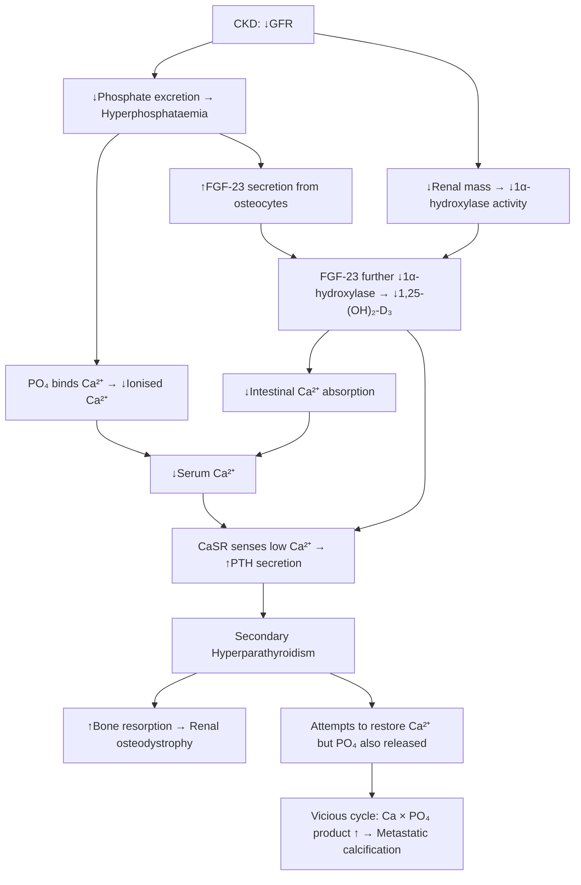

# Secondary & Tertiary Hyperparathyroidism

## 1. Definition

Let's break down the terminology first to understand exactly what we're dealing with.

- **Hyperparathyroidism (HPT)** → "hyper" = excessive, "para" = beside, "thyroid" = thyroid gland, "-ism" = condition. So: a condition of excessive hormone secretion from the glands beside the thyroid.
- **Parathyroid hormone (PTH)** is the key hormone — its job is to **raise serum calcium** and **lower serum phosphate**.

Now, the classification hinges on **why** the parathyroid glands are overactive:

| Type | Definition | Core Mechanism |
|------|-----------|----------------|
| **Primary HPT** | Autonomous PTH secretion from an intrinsic parathyroid lesion (adenoma, hyperplasia, carcinoma) | The gland itself is abnormal → secretes PTH regardless of calcium level |
| **Secondary HPT** | **Physiological, compensatory ↑PTH secretion** in response to chronic hypocalcaemia and/or hyperphosphataemia [1][2] | The glands are reactive — they are doing their job, but the stimulus (low Ca²⁺) never goes away |
| **Tertiary HPT** | **Persistent autonomous hypercalcaemic hyperparathyroidism** that develops after prolonged secondary HPT — classically after renal replacement therapy (transplantation) where the original stimulus has been removed but the glands have become autonomous [2][3] | Prolonged stimulation → parathyroid gland hyperplasia → nodular transformation → monoclonal adenomatous change → glands no longer respond to calcium feedback |

<Callout title="The Key Conceptual Distinction">
- **Secondary HPT** = appropriate PTH response to an inappropriate environment (chronic hypocalcaemia/hyperphosphataemia). Calcium is usually **low or low-normal**.
- **Tertiary HPT** = inappropriate PTH response in a corrected environment (post-transplant or after prolonged secondary HPT). Calcium is **elevated** because the glands have become autonomous.
- Think of it as a spectrum: secondary HPT is the "physiological extreme," and tertiary HPT is when the glands "cross the line" into autonomy.
</Callout>

---

## 2. Epidemiology and Risk Factors

### Secondary HPT

- **Prevalence**: Extremely common in CKD patients — present in virtually all patients with **CKD Stage 4–5** (GFR < 30 mL/min/1.73m²) [4]
  - PTH levels begin to rise as early as **CKD Stage 3** (GFR < 60 mL/min/1.73m²) [4]
  - By the time patients are on dialysis, >90% have biochemical evidence of secondary HPT
- **In Hong Kong context**:
  - CKD is increasingly prevalent due to the high burden of **diabetes mellitus** (Hong Kong prevalence ~10%) and **hypertension** — the two leading causes of ESRD in Hong Kong
  - As of recent Hong Kong Renal Registry data, there are >6,000 patients on dialysis in Hong Kong, almost all of whom have some degree of secondary HPT
- **Other causes** (non-renal): Vitamin D deficiency is extremely common in Hong Kong (up to 40–70% of the elderly population have insufficient 25-OH vitamin D), though this typically causes milder secondary HPT
- **Risk factors for secondary HPT**:
  - CKD (the dominant cause)
  - Chronic vitamin D deficiency (dietary, malabsorption, lack of sun exposure — relevant in Hong Kong's elderly and institutionalised populations)
  - Chronic calcium malabsorption (coeliac disease, post-gastrectomy, chronic pancreatitis)
  - Chronic phosphate load (high dietary phosphate, dialysis inadequacy)

### Tertiary HPT

- **Prevalence**: Develops in approximately **10–30%** of patients after successful **renal transplantation** [3]
  - Usually becomes clinically apparent within **6–12 months** post-transplant if it fails to regress
  - Most cases of secondary HPT regress spontaneously post-transplant within 6–12 months; those that persist beyond this are considered tertiary
- Can also (rarely) develop in patients on **long-term dialysis** without transplantation, where glands become progressively autonomous
- **Risk factors for tertiary HPT**:
  - **Duration and severity of preceding secondary HPT** (the longer and more severe the CKD, the greater the parathyroid hyperplasia)
  - **Duration on dialysis** before transplantation
  - **Inadequate treatment of secondary HPT** during CKD/dialysis period
  - **High pre-transplant PTH levels** and **large gland mass**

---

## 3. Anatomy and Function of the Parathyroid Glands

Understanding the anatomy is crucial for surgery and understanding pathophysiology.

### Gross Anatomy

- **Number**: Typically **4 glands** (2 superior + 2 inferior), though **supernumerary glands** (5th or 6th) occur in **5–13%** of people — this is surgically important because a missed supernumerary gland can cause persistent/recurrent HPT [2]
- **Size**: Each gland is tiny — about **5 × 3 × 1 mm**, weighing ~30–50 mg (about the size of a grain of rice)
- **Location**:
  - **Superior glands**: Located posteriorly, typically at the level of the **upper 1/3 of the thyroid** near the **cricothyroid junction**, dorsal to the recurrent laryngeal nerve (RLN). Their position is relatively **constant** because they derive from the **4th pharyngeal pouch** (short embryological migration distance)
  - **Inferior glands**: Located near the **lower pole of the thyroid** or within the thyrothymic ligament. Their position is more **variable** because they derive from the **3rd pharyngeal pouch** and migrate a longer distance with the thymus — they can end up anywhere from the **angle of the mandible** to the **anterior mediastinum**
- **Ectopic locations**: Intrathyroidal (2–5%), mediastinal (especially in thymus), retroesophageal, carotid sheath — important to know for failed explorations

### Blood Supply

- Predominantly from the **inferior thyroid artery** (a branch of the thyrocervical trunk from the subclavian artery)
- Superior glands may also receive supply from the **superior thyroid artery** (external carotid branch)
- The glands are very sensitive to devascularisation — this is why **surgical technique** must preserve the blood supply to any remnant gland

### Histology

- **Chief cells**: The main functional cell — synthesises and secretes PTH
- **Oxyphil cells**: Larger cells packed with **mitochondria** — their function is debated, but they are the basis for **Sestamibi scanning** (99mTc-sestamibi accumulates in mitochondria-rich cells and washes out slowly from parathyroid tissue compared to thyroid) [2]
- **Fat cells**: In normal glands, ~50% of the volume is fat. In hyperplasia, fat is replaced by parathyroid cells

### PTH Physiology — What PTH Does

PTH is an 84-amino acid polypeptide. Its **sole purpose is to raise serum calcium** (and lower phosphate). It acts on three target organs:

| Target Organ | Action | Mechanism |
|-------------|--------|-----------|
| **Bone** | ↑ Ca²⁺ release (bone resorption) | Stimulates **osteoclasts** (indirectly via RANKL on osteoblasts → activates osteoclast precursors) |
| **Kidney** | ↑ Ca²⁺ reabsorption (DCT) | Upregulates TRPV5 calcium channels in the distal convoluted tubule |
| | ↓ PO₄³⁻ reabsorption (PCT) | Downregulates NaPi-IIa and NaPi-IIc sodium-phosphate cotransporters in proximal tubule → phosphaturia |
| | ↑ 1,25-(OH)₂-D₃ production | Stimulates **1α-hydroxylase** in proximal tubule → converts 25-OH-D to active 1,25-(OH)₂-D₃ |
| **Gut** (indirect) | ↑ Ca²⁺ and PO₄³⁻ absorption | Via 1,25-(OH)₂-D₃ which upregulates intestinal calcium-binding protein (calbindin) |

**Net effect of PTH**: ↑ Ca²⁺, ↓ PO₄³⁻ (because the phosphaturic effect outweighs the bone + gut phosphate release)

### Calcium-Sensing Receptor (CaSR)

- Located on the **chief cells** of the parathyroid gland
- Detects **ionised calcium** in the blood
- When Ca²⁺ is **high** → CaSR activated → **suppresses** PTH secretion
- When Ca²⁺ is **low** → CaSR not activated → **stimulates** PTH secretion
- This is the normal **negative feedback loop**
- In tertiary HPT, the glands become autonomous and **no longer respond appropriately** to CaSR signalling — this is the fundamental defect [1][3]

<Callout title="Why does CaSR matter clinically?" type="idea">
**Cinacalcet** (a calcimimetic drug) works by **allosterically activating the CaSR**, making the parathyroid gland "think" calcium is higher than it actually is → suppresses PTH secretion. This is a key medical treatment for both secondary and tertiary HPT. The name "calci-mimetic" literally means "calcium-mimicking."
</Callout>

---

## 4. Etiology (Focus on Hong Kong)

### Causes of Secondary HPT

The common theme: **anything that chronically lowers ionised calcium or raises phosphate**.

#### A. Chronic Kidney Disease (CKD) — The Dominant Cause in Hong Kong

This is by far the most important and most common cause. In Hong Kong, the leading causes of CKD/ESRD are:

1. **Diabetic nephropathy** (~45% of new ESRD in HK)
2. **Hypertensive nephrosclerosis** (~15%)
3. **Glomerulonephritis** (including IgA nephropathy, which is the most common primary GN in Asia) (~15–20%)
4. **Polycystic kidney disease**
5. **Others**: obstructive uropathy, reflux nephropathy, lupus nephritis

#### B. Vitamin D Deficiency

- Dietary deficiency, inadequate sunlight (common in institutionalised elderly in HK)
- Malabsorption: coeliac disease, inflammatory bowel disease, chronic pancreatitis, post-bariatric surgery
- Impaired 25-hydroxylation: chronic liver disease (the liver performs the first hydroxylation step — 25-hydroxylase)
- Impaired 1α-hydroxylation: CKD (the kidney performs the second, activating hydroxylation step — 1α-hydroxylase) — this overlaps with the CKD mechanism

#### C. Calcium Malabsorption / Deficiency

- Dietary calcium deficiency
- Post-gastrectomy (duodenal bypass → loss of the primary calcium absorption site)
- Coeliac disease, short bowel syndrome

#### D. Phosphate Excess

- High phosphate diet (processed foods, preserved meats — common in HK diet)
- Inadequate dialysis clearance

### Causes of Tertiary HPT

- Almost exclusively arises from **prolonged, inadequately treated secondary HPT** in CKD patients
- **Post-renal transplantation** is the classic scenario: the kidney transplant corrects the GFR and phosphate/vitamin D abnormalities, but the hypertrophied parathyroid glands have undergone **monoclonal adenomatous transformation** and continue to secrete PTH autonomously [2][3][4]
- Can also occur in long-term dialysis patients even without transplantation

---

## 5. Pathophysiology

This is the most important section to understand deeply. Let's build it from first principles.

### 5A. Pathogenesis of Secondary HPT in CKD (Step-by-Step)

**Detailed stepwise explanation**: [4]

1. **Early CKD (GFR < 60 mL/min — Stage 3)**:
   - The kidneys lose their ability to excrete phosphate efficiently → **mild hyperphosphataemia**
   - Phosphate directly **binds ionised calcium** in blood → **↓ ionised Ca²⁺** (calcium-phosphate precipitation)
   - Phosphate also **directly stimulates PTH secretion** at the parathyroid gland (independent of calcium)
   - Phosphate stimulates **FGF-23** (fibroblast growth factor 23) secretion from **osteocytes and osteoblasts**
     - FGF-23 acts on the kidney to **increase phosphate excretion** (phosphaturic — this is initially compensatory)
     - But FGF-23 also **inhibits 1α-hydroxylase** → **↓ 1,25-(OH)₂-D₃** production
   - Simultaneously, **↓ renal mass** → **↓ 1α-hydroxylase** activity → **↓ 1,25-(OH)₂-D₃**
   - ↓ 1,25-(OH)₂-D₃ → **↓ intestinal calcium absorption** → further ↓ serum Ca²⁺
   - ↓ 1,25-(OH)₂-D₃ also **removes the suppressive effect on PTH gene transcription** (vitamin D normally directly suppresses PTH mRNA) → more PTH produced
   - Net result at this stage: PTH rises to **compensate** — and actually succeeds in keeping serum Ca and PO₄ relatively normal. But the price paid is **elevated PTH** and **increased bone turnover**.

2. **Late CKD (GFR < 20 mL/min — Stage 4–5)**:
   - The compensatory mechanisms decompensate
   - ↓↓ GFR → **progressive PO₄ retention** that overwhelms FGF-23 and PTH → **overt hyperphosphataemia**
   - ↓↓ Renal mass → **severely ↓ 1,25-(OH)₂-D₃** → **overt hypocalcaemia**
   - PTH rises further but cannot restore normal Ca and PO₄ levels
   - **Parathyroid gland hyperplasia** becomes established — all 4 glands enlarge
   - The elevated **Ca × PO₄ product** drives **metastatic/vascular calcification** [4]

3. **On Dialysis**:
   - Dialysis partially corrects phosphate and calcium, but:
     - Phosphate clearance is often inadequate (dietary intake exceeds dialysis clearance)
     - Intermittent nature of haemodialysis means calcium and phosphate fluctuate
     - Secondary HPT often **persists or worsens** despite dialysis
   - **Iatrogenic factors** can contribute:
     - **Calcium-based phosphate binders** (e.g., calcium carbonate) → can cause **positive calcium balance** → contributes to vascular calcification
     - **Overtreatment with vitamin D analogues** → may excessively suppress PTH → **adynamic bone disease** (too little bone turnover → fragile bones) [4]

<Callout title="FGF-23: The Early Warning Signal" type="idea">
FGF-23 is now recognised as the **earliest biochemical abnormality** in CKD-MBD — it rises even before PTH or phosphate become abnormal. It's a phosphatonin produced by osteocytes. While initially compensatory (increases phosphate excretion), its inhibition of 1α-hydroxylase is a key driver of the cascade leading to secondary HPT. Think of FGF-23 as the body's first attempt to deal with phosphate retention, but it inadvertently worsens vitamin D status and calcium balance.
</Callout>

### 5B. Transition from Secondary to Tertiary HPT

This is the critical conceptual piece:

1. In prolonged secondary HPT, the parathyroid glands undergo a stepwise transformation [1][3]:
   - **Diffuse polyclonal hyperplasia** → all chief cells proliferate (still responsive to calcium feedback, but mass is increased)
   - **Nodular hyperplasia** → within the hyperplastic glands, nodules develop that are **less responsive to calcium and vitamin D suppression** (they express fewer CaSR and vitamin D receptors)
   - **Monoclonal adenomatous transformation** → some nodules become effectively autonomous — they are monoclonal growths that secrete PTH regardless of serum calcium

2. The key molecular changes in the nodular/autonomous tissue:
   - **Downregulation of CaSR expression** → the gland cannot "sense" that calcium is high → keeps secreting PTH
   - **Downregulation of vitamin D receptor (VDR)** → the gland cannot be suppressed by 1,25-(OH)₂-D₃
   - **Upregulation of cell cycle promoters** → continued cell proliferation

3. **After renal transplantation**:
   - The new kidney restores GFR → normalises phosphate excretion and 1α-hydroxylase activity
   - Serum calcium should normalise
   - In most patients, PTH gradually falls over **6–12 months** as the hyperplastic glands involute
   - But if the glands have undergone **nodular/adenomatous transformation**, they **do not involute** — they continue to secrete PTH autonomously
   - Result: **hypercalcaemia** (because PTH is driving calcium up, and the kidney is now working normally so calcium reabsorption from PTH action is efficient) + **elevated PTH** = tertiary HPT [2][3]

> **Exam pearl**: The hallmark biochemical difference: Secondary HPT = ↑PTH with **↓ or normal Ca²⁺** | Tertiary HPT = ↑PTH with **↑ Ca²⁺** (hypercalcaemia)

### 5C. CKD-Mineral and Bone Disorder (CKD-MBD) [4]

Secondary and tertiary HPT are components of the broader syndrome of **CKD-MBD**, which encompasses:

1. **Biochemical abnormalities**: Ca, PO₄, PTH, FGF-23, vitamin D
2. **Bone abnormalities** (Renal Osteodystrophy — the histological component):
   - **High turnover bone disease** (due to ↑PTH):
     - ***Osteitis fibrosa cystica***: classic bone lesion of hyperPTH — excessive osteoclastic resorption with fibrous replacement. **Subperiosteal resorption** (especially radial side of middle phalanges), **brown tumours** (collections of osteoclasts and fibrous tissue), **salt and pepper skull** [4]
     - ***Osteomalacia***: defective mineralisation due to ↓ vitamin D and ↓ calcium; also historically associated with **aluminium deposition** in bone (from aluminium-containing phosphate binders — rarely used now)
   - **Low turnover bone disease**:
     - ***Adynamic bone disease***: over-suppression of PTH (iatrogenic from excessive vitamin D or calcimimetics) → too little bone remodelling → bone is brittle. Increasingly common [4]
3. **Extraskeletal calcification**:
   - **Vascular calcification**: coronary arteries, peripheral arteries, cardiac valves → accelerated cardiovascular disease (the #1 cause of death in dialysis patients)
   - **Soft tissue calcification**: periarticular (tumoral calcinosis), visceral
   - ***Calciphylaxis*** (calcific uraemic arteriolopathy): rare but devastating — calcification of dermal arterioles → skin necrosis, extremely painful, high mortality [4]

---

## 6. Classification

### By Underlying Mechanism

| Feature | Secondary HPT | Tertiary HPT |
|---------|--------------|-------------|
| **Underlying cause** | Chronic hypocalcaemia / hyperphosphataemia (usually CKD) | Prolonged secondary HPT → autonomous transformation |
| **Gland behaviour** | Reactive (appropriate response) | Autonomous (inappropriate) |
| **Serum calcium** | Low or low-normal | **Elevated** (hypercalcaemia) |
| **Serum phosphate** | Usually elevated (in CKD) | Variable (may be normal post-transplant) |
| **PTH** | Elevated (appropriately) | Elevated (inappropriately — not suppressed by high Ca) |
| **Gland histology** | Diffuse hyperplasia (polyclonal) | Nodular hyperplasia / adenomatous change (monoclonal) |
| **Classic clinical context** | CKD Stage 3–5D (on dialysis) | Post-renal transplant (or prolonged dialysis) |

### By Bone Histology (Renal Osteodystrophy Classification — TMV System)

The 2006 KDIGO classification uses the **TMV system** for bone biopsy:

- **T** = Turnover (high vs. low)
- **M** = Mineralisation (normal vs. abnormal)
- **V** = Volume (high vs. low vs. normal)

| Pattern | Turnover | Mineralisation | Volume | Association |
|---------|----------|---------------|--------|-------------|
| **Osteitis fibrosa cystica** | High | Normal | High | Severe secondary/tertiary HPT |
| **Osteomalacia** | Low | Abnormal | Low | ↓ Vitamin D, aluminium toxicity |
| **Mixed uraemic osteodystrophy** | High | Abnormal | Variable | Combination |
| **Adynamic bone disease** | Low | Normal | Low | Over-suppression of PTH, diabetes, elderly |

---

## 7. Clinical Features

### 7A. Symptoms

Many patients with secondary HPT are **asymptomatic** — the features of CKD-MBD develop insidiously over years.

#### Bone-Related Symptoms

| Symptom | Pathophysiological Basis |
|---------|------------------------|
| **Diffuse bone pain** (especially back, hips, lower limbs) | ↑PTH → excessive osteoclastic bone resorption → microfractures, periosteal stretching from subperiosteal resorption; also osteomalacia (defective mineralisation) causes deep, aching bone pain |
| **Fractures** (fragility fractures — vertebral compression, hip, rib) | Bone weakened by both high turnover disease (osteitis fibrosa → abnormal bone architecture) and osteomalacia (undermineralised bone). In adynamic bone disease, low remodelling also → brittle bone |
| **Proximal myopathy** (difficulty rising from chair, climbing stairs) | ↓ 1,25-(OH)₂-D₃ → impaired calcium-dependent muscle contraction (vitamin D has direct effects on muscle via VDR) → proximal muscle weakness. Also, hypocalcaemia contributes to neuromuscular dysfunction |
| **Height loss / kyphosis** | Vertebral compression fractures from weakened vertebral bodies |

#### Symptoms of Hypocalcaemia (More Prominent in Secondary HPT)

| Symptom | Pathophysiological Basis |
|---------|------------------------|
| **Paraesthesiae** (perioral, fingers, toes) | ↓ ionised Ca²⁺ → ↓ threshold for nerve depolarisation → spontaneous nerve firing → tingling sensations |
| **Muscle cramps / tetany** | Same mechanism — enhanced neuromuscular excitability → involuntary sustained muscle contraction |
| **Carpopedal spasm** | Severe hypocalcaemia → tonic spasm of hand (obstetric hand) and foot muscles |
| **Seizures** | Severe hypocalcaemia → ↑ neuronal excitability → generalised seizures |
| **Laryngospasm** | ↓ Ca²⁺ → spasm of laryngeal muscles → stridor — a life-threatening emergency |

#### Symptoms of Hypercalcaemia (More Prominent in Tertiary HPT)

The classic mnemonic: ***"Stones, Bones, Moans, Thrones, and Psychic Overtones"*** [5]

| Symptom | Pathophysiological Basis |
|---------|------------------------|
| **Stones** (renal colic, haematuria) | ↑ Ca²⁺ → hypercalciuria → calcium oxalate/phosphate stone formation. Also ↑ urinary pH from PTH action promotes calcium phosphate precipitation |
| **Bones** (bone pain — see above) | ↑ PTH → ↑ osteoclastic resorption → bone pain, fractures |
| **Moans** (abdominal pain, constipation, nausea, vomiting, anorexia) | Hypercalcaemia → ↓ smooth muscle contractility (Ca²⁺ stabilises cell membranes → ↓ excitability) → gastroparesis, constipation. Also: pancreatitis (calcium activates trypsinogen in pancreas), peptic ulcer (Ca²⁺ stimulates gastrin secretion) |
| **Thrones** (polyuria, polydipsia, dehydration) | ↑ Ca²⁺ → inhibits adenylyl cyclase in collecting duct → ↓ cAMP → ↓ aquaporin-2 insertion → **nephrogenic diabetes insipidus** → polyuria → dehydration → polydipsia [5] |
| **Psychic overtones** (confusion, lethargy, depression, anxiety, psychosis) | Hypercalcaemia affects neuronal function — exact mechanism multifactorial but includes altered neurotransmitter release and neuronal membrane stabilisation |

#### Other Symptoms

| Symptom | Pathophysiological Basis |
|---------|------------------------|
| **Pruritus** (itch) | Multifactorial in CKD: metastatic calcium-phosphate deposition in skin, uraemic toxins, histamine release. ↑ Ca × PO₄ product specifically drives cutaneous microprecipitation |
| **Fatigue / malaise** | Multifactorial: hypercalcaemia effects on CNS, CKD-associated anaemia, uraemia |
| **Joint pain** (pseudogout) | Calcium pyrophosphate crystal deposition in joints → acute inflammatory arthritis. ↑ PTH → ↑ pyrophosphate production → CPPD disease |

### 7B. Physical Signs

#### Signs Related to Bone Disease

| Sign | Pathophysiological Basis |
|------|------------------------|
| **Bone tenderness** (especially sternum, tibiae, ribs) | Subperiosteal resorption and microfractures cause localised tenderness |
| **Kyphosis / spinal deformity** | Vertebral compression fractures |
| **Proximal myopathy** (waddling gait, difficulty standing from squat) | Vitamin D deficiency → impaired muscle function (see above) |
| **Growth retardation** (in paediatric CKD) | Chronic hypocalcaemia, hyperphosphataemia, and ↓ vitamin D impair growth plate function; ↑ PTH disrupts endochondral ossification → **renal rickets** |

#### Signs of Hypocalcaemia (Secondary HPT)

| Sign | Pathophysiological Basis |
|------|------------------------|
| **Chvostek's sign** (tapping facial nerve → ipsilateral facial muscle twitching) | Enhanced neuromuscular excitability from hypocalcaemia → mechanical stimulation of facial nerve → reflex muscle contraction. Sensitivity ~10–30% (can be positive in normocalcaemic individuals) |
| **Trousseau's sign** (inflate BP cuff above systolic for 3 min → carpopedal spasm) | Ischaemia from cuff + hypocalcaemia → enhanced neuromuscular excitability → carpal spasm (more specific than Chvostek's — ~94% specificity) |
| **Prolonged QT interval on ECG** | Ca²⁺ is critical for phase 2 (plateau) of the cardiac action potential. ↓ Ca²⁺ → prolonged phase 2 → prolonged QT → risk of Torsades de Pointes |

#### Signs of Hypercalcaemia (Tertiary HPT)

| Sign | Pathophysiological Basis |
|------|------------------------|
| **Shortened QT interval on ECG** | ↑ Ca²⁺ → shortened phase 2 of cardiac action potential |
| **Band keratopathy** (corneal calcification — seen on slit lamp) | Calcium phosphate deposition at the medial and lateral limbus of the cornea (where pH is highest — CO₂ escapes from the cornea peripherally → more alkaline → favours CaPO₄ precipitation) |
| **Hypertension** | Hypercalcaemia → vasoconstriction (Ca²⁺ enhances vascular smooth muscle contraction) and ↑ renal vascular resistance [6] |
| **Dehydration** (poor skin turgor, dry mucous membranes) | Nephrogenic DI from hypercalcaemia → polyuria → volume depletion |

#### Signs Related to Vascular/Soft Tissue Calcification (CKD-MBD)

| Sign | Pathophysiological Basis |
|------|------------------------|
| **Calciphylaxis** (violaceous, reticular, painful skin lesions → necrotic eschar, especially on thighs, abdomen, buttocks) | Calcification of dermal and subcutaneous arterioles → thrombosis → ischaemic skin necrosis. ↑ Ca × PO₄ product and ↑ PTH are risk factors [4] |
| **Tumoral calcinosis** (periarticular soft tissue masses) | Massive calcium-phosphate deposits in periarticular tissue when Ca × PO₄ product chronically elevated |
| **Absent peripheral pulses / bruits** | Arterial medial calcification (Mönckeberg's) → stiff, non-compressible vessels |
| **Red eyes** (conjunctival calcification) | Calcium-phosphate deposition in conjunctiva |

#### Signs Specific to the Neck (Relevant in Tertiary HPT / Surgical Consideration)

- **Palpable neck mass**: Extremely rare — parathyroid glands have to be massively enlarged to be palpable. If a parathyroid mass is palpable, think **parathyroid carcinoma** rather than hyperplasia
- **Previous surgical scars**: Look for thyroidectomy/parathyroidectomy scars, AV fistula (indicating dialysis), renal transplant scar (iliac fossa — "hockey stick" incision)

<Callout title="Bedside Assessment Tips for Exams" type="idea">
When examining a patient with suspected secondary/tertiary HPT, systematically look for:
1. **Hands**: AV fistula (dialysis access), tendon xanthomata (dyslipidaemia of CKD), periarticular calcification, nail changes (Lindsay's nails — half-and-half nails of CKD)
2. **Face**: Pallor (renal anaemia), conjunctival calcification, band keratopathy
3. **Neck**: Surgical scars, parathyroid mass
4. **Abdomen**: Renal transplant scar (iliac fossa), peritoneal dialysis catheter (Tenckhoff), palpable kidneys (ADPKD)
5. **Skin**: Calciphylaxis lesions, excoriation marks (pruritus), uraemic frost (severe)
6. **Neuromuscular**: Proximal myopathy, Chvostek's/Trousseau's signs
</Callout>

---

## 8. Relevant Radiological Findings (Not Diagnostic Criteria — Just Clinical Features)

***Bone scan (99mTc-MDP)***: may show a **superscan pattern** — intense symmetric bone activity with diminished renal and soft tissue activity — seen in **secondary hyperparathyroidism, renal osteodystrophy, and osteomalacia** [7]

**Plain radiograph findings in secondary/tertiary HPT**:

| Finding | Explanation |
|---------|------------|
| **Subperiosteal resorption** (radial aspect of middle phalanges — pathognomonic) | PTH-driven osteoclastic resorption occurs at the subperiosteal surface; the radial side of the middle phalanx is the classic site because cortical bone here is thin and resorption is most visible |
| **Salt and pepper skull** | Diffuse granular mottling due to trabecular resorption in the calvarium |
| **Brown tumours** (cystic lucencies) | Focal collections of osteoclasts, fibrous tissue, and haemosiderin (hence "brown") — represent extreme localised bone resorption |
| **Rugger jersey spine** | Alternating bands of sclerosis (dense) and lucency (resorbed) in the vertebral bodies — sclerotic endplates with osteopenic centres |
| **Soft tissue / vascular calcification** | Calcium-phosphate deposition in vessel walls, periarticular tissues |
| **Looser zones / pseudofractures** (if osteomalacia component) | Radiolucent lines perpendicular to bone cortex — represent unmineralised osteoid at sites of stress |

---

## 9. Key Biochemical Patterns — A Summary Table

| Parameter | Secondary HPT (CKD) | Tertiary HPT |
|-----------|---------------------|-------------|
| **Serum Ca²⁺** | ↓ or low-normal | **↑** (hypercalcaemia) |
| **Serum PO₄³⁻** | ↑ (due to ↓ renal excretion) | Variable (often normal or ↓ post-transplant because the new kidney excretes PO₄) |
| **PTH** | ↑ (appropriately) | ↑ (inappropriately — not suppressed by ↑ Ca) |
| **25-OH Vitamin D** | Often ↓ | Variable |
| **1,25-(OH)₂-D₃** | ↓ (due to ↓ 1α-hydroxylase) | May normalise post-transplant |
| **ALP** | ↑ (high bone turnover) | ↑ |
| **FGF-23** | ↑↑ (early marker) | May normalise post-transplant |
| **Ca × PO₄ product** | Often ↑ (> 4.4 mmol²/L²) | Variable |

<Callout title="High Yield Summary">

**Secondary HPT:**
- **Definition**: Compensatory ↑PTH in response to chronic hypocalcaemia/hyperphosphataemia — the glands are reactive, not autonomous
- **Cause**: Overwhelmingly CKD (in Hong Kong: DM nephropathy #1) — also vitamin D deficiency, calcium malabsorption
- **Pathophysiology**: ↓GFR → ↓PO₄ excretion + ↓1α-hydroxylase → ↑PO₄, ↓Ca²⁺, ↓1,25-D₃ → ↑PTH → bone resorption, renal osteodystrophy, vascular calcification
- **FGF-23** rises earliest; PTH rises as compensation fails
- **Biochemistry**: ↑PTH, ↓Ca, ↑PO₄, ↓1,25-D₃
- **Bone disease**: High turnover (osteitis fibrosa cystica, subperiosteal resorption) or low turnover (adynamic bone disease from over-treatment)

**Tertiary HPT:**
- **Definition**: Persistent autonomous ↑PTH after removal of the original stimulus (classically post-renal transplant) — glands have become autonomous
- **Mechanism**: Prolonged secondary HPT → polyclonal hyperplasia → nodular hyperplasia → monoclonal adenomatous change → ↓CaSR and ↓VDR expression → autonomous PTH secretion
- **Biochemistry**: ↑PTH + **↑Ca²⁺** (the distinguishing feature from secondary HPT)
- **Clinical features**: Hypercalcaemia symptoms (stones, bones, moans, thrones, psychic overtones) + may impair renal graft function

**Clinical features** of both: bone pain, fractures, proximal myopathy (vitamin D deficiency), pruritus, vascular calcification, calciphylaxis (CKD-MBD spectrum). Secondary HPT → hypocalcaemia signs (Chvostek's, Trousseau's). Tertiary HPT → hypercalcaemia signs.

**Key radiological findings**: Subperiosteal resorption (pathognomonic), salt and pepper skull, rugger jersey spine, brown tumours, superscan on bone scan.
</Callout>

---

<ActiveRecallQuiz
  title="Active Recall - Secondary & Tertiary HPT: Definition, Epidemiology, Pathophysiology, Clinical Features"
  items={[
    {
      question: "What is the fundamental biochemical difference between secondary and tertiary hyperparathyroidism?",
      markscheme: "Secondary HPT: elevated PTH with LOW or low-normal calcium (appropriate compensatory response). Tertiary HPT: elevated PTH with HIGH calcium (autonomous secretion, glands no longer respond to calcium feedback). Both have elevated PTH, but calcium distinguishes them."
    },
    {
      question: "Describe the step-by-step pathogenesis of secondary HPT in CKD, starting from reduced GFR.",
      markscheme: "1. Reduced GFR leads to decreased phosphate excretion causing hyperphosphataemia. 2. Reduced renal mass leads to decreased 1-alpha-hydroxylase activity causing reduced 1,25-(OH)2-D3. 3. Hyperphosphataemia stimulates FGF-23 from osteocytes, which further inhibits 1-alpha-hydroxylase. 4. Low 1,25-D3 reduces intestinal calcium absorption causing hypocalcaemia. 5. Phosphate binds ionised calcium directly. 6. Low Ca2+ sensed by CaSR on parathyroid glands stimulates PTH secretion. 7. Low vitamin D removes suppression of PTH gene transcription. 8. Result: compensatory hyperparathyroidism with parathyroid hyperplasia."
    },
    {
      question: "Explain the mechanism by which secondary HPT transitions to tertiary HPT at the cellular level.",
      markscheme: "Prolonged secondary HPT causes stepwise parathyroid gland transformation: diffuse polyclonal hyperplasia leads to nodular hyperplasia leads to monoclonal adenomatous transformation. The nodular or autonomous tissue has downregulated CaSR expression (cannot sense high calcium) and downregulated VDR expression (cannot be suppressed by vitamin D). This makes PTH secretion autonomous and independent of serum calcium, persisting even after renal transplantation corrects the original stimulus."
    },
    {
      question: "Why does hypercalcaemia cause polyuria? What is the mechanism?",
      markscheme: "Hypercalcaemia inhibits adenylyl cyclase in the renal collecting duct, leading to decreased cAMP, which reduces aquaporin-2 insertion into the apical membrane. This causes nephrogenic diabetes insipidus (the collecting duct cannot concentrate urine despite ADH), resulting in polyuria, dehydration, and compensatory polydipsia."
    },
    {
      question: "What are the three components of CKD-MBD and give one specific example of each?",
      markscheme: "1. Biochemical abnormalities: e.g., hyperphosphataemia, hypocalcaemia, elevated PTH, elevated FGF-23, low 1,25-vitamin D. 2. Bone abnormalities (renal osteodystrophy): e.g., osteitis fibrosa cystica (high turnover) or adynamic bone disease (low turnover) or osteomalacia. 3. Extraskeletal calcification: e.g., vascular calcification (coronary artery), calciphylaxis, tumoral calcinosis, periarticular or soft tissue calcification."
    },
    {
      question: "A patient post-renal transplant has persistent hypercalcaemia with elevated PTH at 12 months. What is the diagnosis, what histological changes do you expect in the parathyroid glands, and what are the surgical options?",
      markscheme: "Diagnosis: Tertiary hyperparathyroidism. Histology: nodular hyperplasia with monoclonal adenomatous transformation, decreased CaSR and VDR expression. Surgical options: (1) Total parathyroidectomy with autotransplantation (forearm brachioradialis or neck SCM), (2) Subtotal parathyroidectomy (three-and-a-half gland resection, leaving half of the most normal gland), (3) Total parathyroidectomy without autotransplant (only if transplant highly unlikely)."
    }
  ]}
/>

---

## References

[1] Senior notes: felixlai.md (Hyperparathyroidism section)
[2] Senior notes: maxim.md (Tertiary hyperparathyroidism, Primary hyperparathyroidism sections)
[3] Senior notes: Ryan Ho Endocrine.pdf (p41 — Hyperparathyroidism classification)
[4] Senior notes: Ryan Ho Urogenital.pdf (p107 — CKD-related Mineral and Bone Disorders)
[5] Senior notes: Ryan Ho Fundamentals.pdf (p430 — Hypercalcemia presenting problems)
[6] Senior notes: Ryan Ho Cardiology.pdf (p177 — Secondary hypertension, hyperPTH as cause)
[7] Senior notes: Ryan Ho Diagnostic Radiology.pdf (p60 — Parathyroid scintigraphy; p68 — Bone scan, superscan)
