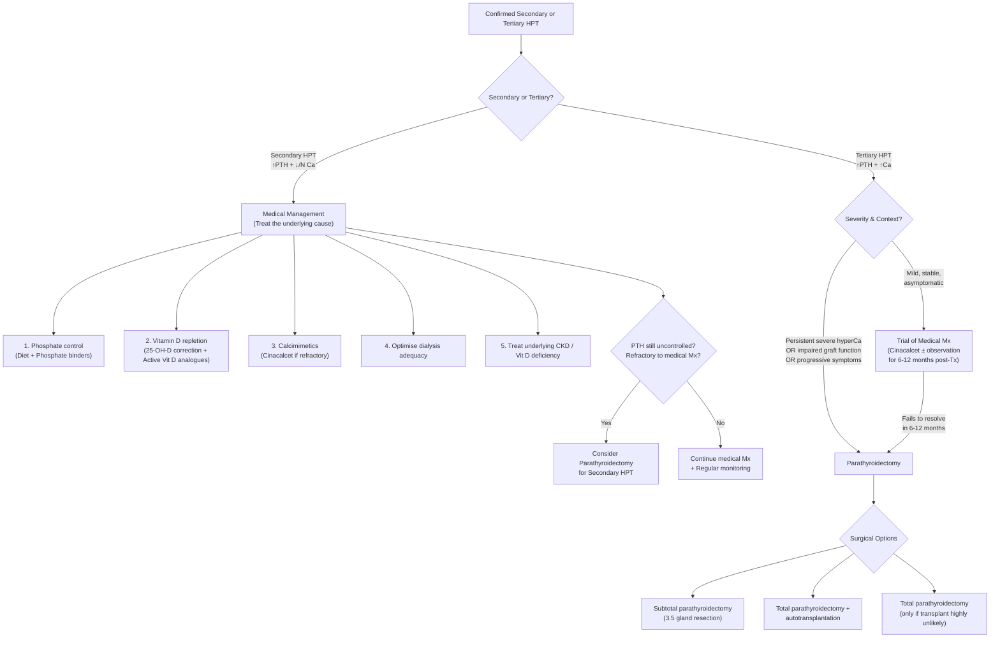

## Management of Secondary & Tertiary Hyperparathyroidism

The management of secondary and tertiary HPT is fundamentally different because the underlying problem is different:

- **Secondary HPT**: The glands are doing their job — the problem is the *environment* (CKD, vitamin D deficiency). Fix the environment → glands settle down. Management is **overwhelmingly medical**.
- **Tertiary HPT**: The glands have become autonomous — the environment has been fixed (e.g., transplant) but the glands won't stop. Management is often **surgical**.

Let's build this systematically.

---

### Management Algorithm Overview

---

### PART 1: Management of Secondary HPT

The principle is simple: **remove the stimulus driving PTH secretion**. In CKD, that means correcting hyperphosphataemia, hypocalcaemia, and vitamin D deficiency.

#### A. Phosphate Control — The Foundation of Treatment

Why start here? Because **hyperphosphataemia is the initial trigger** of the entire CKD-MBD cascade [4]. If you don't control phosphate, nothing else will work properly.

##### 1. Dietary Phosphate Restriction

| Aspect | Details |
|---|---|
| **Target** | Serum PO₄ towards **normal range** (KDIGO: lower towards normal in CKD 3–5; ~1.13–1.78 mmol/L in CKD 5D) |
| **Approach** | Restrict dietary phosphate to **800–1000 mg/day**. Focus on reducing processed foods, preserved meats, cola drinks (phosphoric acid), dairy products. In Hong Kong, common high-phosphate foods include preserved eggs (皮蛋), organ meats, dried seafood, instant noodles |
| **Rationale** | Phosphate is ubiquitous in food — restriction alone is usually insufficient (dialysis only clears ~300 mg PO₄ per session, while dietary intake can be 1000–1500 mg/day). Hence binders are almost always needed |
| **Limitation** | Overly strict restriction risks protein-energy malnutrition (phosphate correlates with protein intake) — must balance phosphate restriction with adequate protein nutrition, especially in dialysis patients |

##### 2. Phosphate Binders

These are taken **with meals** to bind dietary phosphate in the gut and prevent absorption. Think of them as "phosphate sponges."

| Binder | Mechanism | Advantages | Disadvantages |
|---|---|---|---|
| **Calcium carbonate** | Ca²⁺ binds PO₄ in gut → insoluble CaPO₄ → excreted in stool | Cheap, widely available, also provides calcium supplementation | **Net positive calcium balance** → risk of hypercalcaemia and **vascular calcification** [4]. KDIGO recommends **restricting calcium-based binders** in patients with vascular calcification, adynamic bone disease, or persistent hypercalcaemia |
| **Calcium acetate** | Same as above but binds more PO₄ per unit of calcium absorbed | More efficient phosphate binding per calcium load | Same risks as calcium carbonate but slightly less calcium absorption per tablet |
| **Sevelamer** ("sevel" = "sever" the link between phosphate and absorption) | Non-calcium, non-aluminium polymer that binds PO₄ in gut via ion exchange | No calcium load → avoids vascular calcification. Also ↓LDL cholesterol (a bonus in CKD patients with high CV risk). May reduce FGF-23 levels | Expensive. Large pill burden (multiple large tablets with each meal). Can cause GI side effects (nausea, bloating) |
| **Lanthanum carbonate** | Lanthanum (a rare earth metal) binds PO₄ in gut | Potent PO₄ binding. Low systemic absorption. Non-calcium | Expensive. Theoretical concern about lanthanum accumulation (though clinical significance uncertain). Chewable tablets |
| **Sucroferric oxyhydroxide** | Iron-based PO₄ binder | Lower pill burden than sevelamer. Non-calcium | Dark stools (iron). GI side effects |
| **Aluminium hydroxide** | Aluminium binds PO₄ very effectively | Very effective | **Largely abandoned** due to **aluminium toxicity** — accumulates in bone (osteomalacia), brain (dialysis dementia/encephalopathy), and marrow (microcytic anaemia). Only used short-term for severe refractory hyperphosphataemia [4] |

<Callout title="Choosing a Phosphate Binder — The Key Decision" type="idea">
The main clinical decision is **calcium-based vs non-calcium-based binders**. KDIGO 2017 suggests **restricting the dose of calcium-based phosphate binders** in all CKD patients, and **avoiding them entirely** in patients with: (1) vascular/soft tissue calcification, (2) adynamic bone disease (low PTH — can't deposit calcium into bone), (3) persistent hypercalcaemia. In these patients, use sevelamer or lanthanum instead [4].
</Callout>

#### B. Vitamin D Therapy

This operates on two levels: correcting **nutritional vitamin D deficiency** and providing **active vitamin D analogues** to directly suppress PTH.

##### 1. Nutritional Vitamin D (Cholecalciferol / Ergocalciferol)

| Aspect | Details |
|---|---|
| **Goal** | Correct 25-OH vitamin D to > 75 nmol/L (30 ng/mL) |
| **Rationale** | Vitamin D deficiency is extremely common in CKD patients AND contributes independently to secondary HPT. KDIGO recommends correcting vitamin D deficiency/insufficiency **before** starting active vitamin D analogues |
| **Agents** | Cholecalciferol (D₃ — from animal/sunlight) or Ergocalciferol (D₂ — from plants). D₃ is generally preferred (longer half-life, more potent) |
| **Limitation** | In advanced CKD (Stage 4–5), even repleted 25-OH-D cannot be activated because **1α-hydroxylase activity is severely reduced** → need active analogues |

##### 2. Active Vitamin D Analogues

| Agent | Mechanism | Indications | Key Side Effects |
|---|---|---|---|
| **Calcitriol** (1,25-(OH)₂-D₃) | The active form of vitamin D — bypasses the need for renal 1α-hydroxylation. Directly: (a) ↑ intestinal Ca absorption, (b) **suppresses PTH gene transcription** via VDR on parathyroid cells, (c) ↑ CaSR expression on parathyroid glands | Secondary HPT in CKD 3–5D when PTH is progressively rising above target despite phosphate control and nutritional vitamin D repletion | **Hypercalcaemia and hyperphosphataemia** (increases gut absorption of both Ca and PO₄). Must monitor Ca and PO₄ closely. Can cause **adynamic bone disease** if PTH is over-suppressed [4] |
| **Alfacalcidol** (1α-OH-D₃) | Requires only 25-hydroxylation in liver (not renal 1α-hydroxylation) → effectively an active vitamin D analogue. Widely used in Hong Kong | Same as calcitriol | Same as calcitriol. Slightly longer half-life |
| **Paricalcitol** | Selective VDR activator — activates VDR in parathyroid gland (suppresses PTH) but has **less effect on gut calcium/phosphate absorption** | Secondary HPT when calcitriol/alfacalcidol cause hypercalcaemia or hyperphosphataemia. Theoretically "safer" profile | Still can cause hypercalcaemia (though less than calcitriol). Expensive |
| **Doxercalciferol** | Pro-drug, activated by hepatic 25-hydroxylase | Alternative to paricalcitol | Similar to paricalcitol |

> **Why does vitamin D suppress PTH?** Calcitriol binds to the **Vitamin D Receptor (VDR)** in parathyroid chief cells → the VDR-calcitriol complex binds to negative regulatory elements on the PTH gene promoter → **directly suppresses PTH mRNA transcription**. It also **upregulates CaSR expression** → makes the gland more sensitive to calcium → less PTH secretion. This dual mechanism makes vitamin D a potent PTH suppressor [4].

<Callout title="The Over-Suppression Trap" type="error">
Over-treatment with active vitamin D analogues is one of the most common iatrogenic problems in CKD-MBD management. If you suppress PTH **too much** (below 2× ULN in dialysis patients), you push the patient into ***adynamic bone disease*** — the bone can't remodel, becomes brittle, fractures occur, and the bone can't buffer calcium → episodes of hypercalcaemia. Always monitor PTH trends and avoid driving it to normal [4].
</Callout>

#### C. Calcimimetics

***Calcimimetics*** — "calci" = calcium, "mimetic" = mimicking. These drugs **mimic the action of calcium on the CaSR**.

| Agent | Mechanism | Indications | Key Details |
|---|---|---|---|
| ***Cinacalcet*** (oral) | **Allosteric activator of the CaSR** on parathyroid chief cells → makes the receptor "think" calcium is higher than it actually is → **↓ PTH secretion**. Also ↓ parathyroid cell proliferation over time [1][2][3] | ***Secondary HPT in CKD 5D*** (on dialysis) **refractory to phosphate binders and vitamin D analogues**. Also used in ***tertiary HPT when surgery is contraindicated or patient is unfit*** [2]. Also used in ***primary HPT when parathyroidectomy is indicated but contraindicated*** [1][3] | Dose: start 30 mg daily, titrate up (max 180 mg/day). **Side effects**: nausea, vomiting (very common — up to 30%), hypocalcaemia (must monitor Ca closely), QT prolongation. **Contraindication**: hypocalcaemia (will worsen it) |
| **Etelcalcetide** (IV) | Same mechanism as cinacalcet but given **IV at the end of dialysis sessions** | Secondary HPT in CKD 5D, especially for patients who cannot tolerate oral cinacalcet (GI side effects) or have compliance issues | Avoids GI side effects. Must be given thrice weekly with dialysis. Can cause hypocalcaemia |

> ***Cinacalcet is effective in lowering/normalising serum calcium but has less consistent effect on serum PTH and no consistent effect on BMD*** [3]. This is an important nuance — it controls hypercalcaemia well but doesn't necessarily fix the bone disease.

#### D. Optimise Dialysis

| Strategy | Rationale |
|---|---|
| **Adequate dialysis clearance** (Kt/V > 1.2 for HD) | Better phosphate and uraemic toxin clearance → less stimulus for PTH |
| **Dialysate calcium concentration** | Typically 1.25–1.5 mmol/L. Higher dialysate Ca → suppresses PTH during dialysis but risk of positive Ca balance and vascular calcification. Lower dialysate Ca → may worsen secondary HPT. Must individualise |
| **Longer/more frequent dialysis sessions** | Nocturnal HD or daily HD improves phosphate clearance significantly (conventional thrice-weekly HD only removes ~300 mg PO₄/session, while intake can be ~1000 mg/day) |

#### E. Other Medical Measures

| Measure | Rationale |
|---|---|
| **Correct metabolic acidosis** (oral sodium bicarbonate) | Chronic metabolic acidosis in CKD → bone acts as a buffer → releases calcium carbonate from bone → worsens bone loss. Correcting acidosis ↓ bone buffering need |
| **Avoid excessive calcium supplementation** | Net positive calcium balance → vascular calcification. KDIGO recommends total elemental calcium intake (diet + binders + supplements) should not exceed ~1500–2000 mg/day |
| **Treat anaemia** (ESA, iron) | Anaemia worsens fatigue and bone marrow function. Not directly related to PTH but part of holistic CKD management |

#### F. Parathyroidectomy for Refractory Secondary HPT

Surgery is **not first-line** for secondary HPT — it is reserved for cases that fail medical management.

**Indications for parathyroidectomy in secondary HPT** (KDIGO 2017):
- ***Severe secondary HPT*** (PTH **persistently > 800–1000 pg/mL** or > ~10× ULN) **refractory to medical therapy**
- **Refractory hypercalcaemia or hyperphosphataemia** despite optimal medical management
- **Progressive/symptomatic bone disease** (fractures, severe bone pain, calciphylaxis) despite medical therapy
- Failed medical management (intolerance or contraindication to calcimimetics and vitamin D analogues)

---

### PART 2: Management of Tertiary HPT

Tertiary HPT is a **surgical disease** in most cases, because the fundamental problem is **autonomous gland tissue** that will not respond to medical manipulation.

#### A. When to Intervene

***Indications for parathyroidectomy in tertiary HPT*** [2]:
- ***Persistent severe hypercalcaemia*** (typically adjusted Ca > 2.8 mmol/L persisting > 6–12 months post-transplant)
- ***Impaired graft function*** attributable to hypercalcaemia (hypercalcaemia → nephrocalcinosis, renal vasoconstriction → damages the transplanted kidney)
- ***Progressive symptoms*** (e.g., ***osteoporotic fractures***, renal stones, calciphylaxis, severe bone pain) [2]
- Persistent significantly elevated PTH with biochemical evidence of high bone turnover

**When NOT to intervene immediately**:
- Within the first **6–12 months post-transplant** — many cases of secondary HPT **regress spontaneously** as gland hyperplasia involutes with normalised kidney function. Patience is warranted unless hypercalcaemia is severe (> 3.0 mmol/L) or causing acute problems

#### B. Surgical Options for Tertiary HPT

Because tertiary HPT is **multigland disease** (all 4 glands are hyperplastic/autonomous), **focused parathyroidectomy is NOT appropriate** — you must address all glands. The options are:

| Procedure | Description | When to Choose | Advantages | Disadvantages |
|---|---|---|---|---|
| ***Subtotal parathyroidectomy ("three-and-a-half resection")*** [2] | **3 glands completely resected** + **half of the 4th (most normal-appearing) gland resected** (sent for ***frozen section*** to confirm parathyroid tissue). The remaining **half gland is left in situ**, marked with **non-absorbable sutures** for identification if re-operation needed [2] | Most common approach for tertiary HPT, especially in transplant patients | Preserves some parathyroid function → lower risk of permanent hypoparathyroidism. Allows some PTH production to maintain bone health | Risk of **recurrence** (the remnant can re-hypertrophy). If recurrence occurs, re-operative neck surgery is needed (more difficult) |
| ***Total parathyroidectomy with autotransplantation*** [2] | All 4 glands completely resected. Small fragments of the **most normal-appearing gland** are **implanted into a muscle pocket** — typically the ***forearm (brachioradialis)*** or ***neck (SCM)*** [2] | Preferred when recurrence risk is high or when easy access for future surgery is desired | If the autograft hypertrophies and causes recurrence, it can be **excised under local anaesthesia from the forearm** (much easier than re-operating on the neck). Complete removal of all neck parathyroid tissue | Risk of permanent hypoparathyroidism if autograft fails to function. Period of hypoparathyroidism while graft takes (typically days to weeks — patient needs calcium + vitamin D supplementation) |
| ***Total parathyroidectomy*** (without autotransplantation) | All 4 glands resected, no graft | ***Only considered when renal transplant is highly unlikely*** (i.e., patient will remain on dialysis indefinitely and will never have functional kidneys) [2] | Eliminates all autonomous tissue → no recurrence possible | Results in **permanent hypoparathyroidism** → lifelong calcium and vitamin D supplementation. Acceptable if patient is on dialysis (where calcium is managed via dialysate) but not acceptable if transplant is planned |

<Callout title="Why Autotransplant to the Forearm?">
The ***forearm (brachioradialis)*** is chosen because: (1) it is a superficial, easily accessible site — if the graft hypertrophies and causes recurrent HPT, it can be excised under **local anaesthesia** in clinic without a neck re-operation; (2) adequate blood supply for graft survival; (3) graft function can be confirmed by sampling PTH from the **antecubital veins** on that arm (gradient between grafted and non-grafted arm). The ***neck (SCM)*** is an alternative site. Graft tissue is typically implanted as **small fragments (1 mm pieces)** into muscle pockets [2].
</Callout>

##### Surgical Approach and Intraoperative Considerations

| Aspect | Details |
|---|---|
| **Incision** | ***Kocher's incision*** (transverse collar incision) — same as for thyroidectomy. Bilateral neck exploration is required |
| **Identification of all 4 glands** | Essential — must find and inspect all 4 glands. Difficulty arises with ectopic glands or supernumerary glands |
| ***Cervical thymectomy*** | Should be performed routinely (or at least considered) to **remove supernumerary glands** that may reside in the thymus (recall: inferior parathyroids derive from the 3rd pharyngeal pouch and migrate with the thymus) [2] |
| ***Intraoperative PTH monitoring*** | Blood samples pre-incision and at intervals post-excision (5, 10, 15 min). ***Miami criteria: PTH drops to normal range + < 50% of the highest pre-incision or pre-excision value at 10 min post-resection*** [1][2][3]. In subtotal parathyroidectomy, the remnant will still produce PTH, so absolute normalisation is not expected — look for a **significant drop** (> 50%) |
| ***Frozen section*** | The resected half of the remnant gland is sent for frozen section to ***confirm the tissue is parathyroid*** (not fat, thyroid, or lymph node) [2] |
| **Cryopreservation** | Some centres cryopreserve parathyroid tissue at the time of total parathyroidectomy — can be used for **delayed autotransplantation** if the initial autograft fails [3] |

##### Post-Operative Complications of Parathyroidectomy

| Complication | Mechanism & Management |
|---|---|
| ***Hungry bone syndrome*** | ***Rapid, profound hypocalcaemia*** due to sudden drop in PTH → **rapid deposition of calcium into demineralised bone** that was previously being resorbed by excess PTH [2]. Typically occurs within **24–72 hours** post-op. Presents with severe tetany, seizures, cardiac arrhythmia. **Risk predicted by ↑ pre-op ALP** (high ALP = highly active bone that will "soak up" calcium) [2]. **Management**: aggressive IV calcium gluconate infusion + oral calcium + vitamin D (calcitriol). May need **days to weeks** of IV calcium. Monitor Mg (often co-depleted) |
| ***Transient hypocalcaemia*** | After removal of hyperfunctioning glands, the **remaining suppressed glands take time to "wake up"** → transient hypoparathyroidism. Usually resolves within days to weeks [2] |
| ***Permanent hypoparathyroidism*** | Defined as **requiring calcium/vitamin D supplementation > 1 year post-op** [2]. Due to removal of too much parathyroid tissue or devascularisation of remnant. Risk is higher with total parathyroidectomy |
| ***Recurrent laryngeal nerve (RLN) injury*** | Unilateral → hoarseness (vocal cord paralysis). **Bilateral → airway obstruction** (both cords adducted) → emergency tracheostomy. Risk: ~1–2% for experienced surgeons. In re-operative surgery, risk is higher |
| ***Reactionary haemorrhage*** | Bleeding from the operative bed → expanding neck haematoma → airway compression. **Emergency**: open wound at bedside, evacuate clot, return to theatre |
| **Persistent HPT** (< 6 months post-op) | Due to ***missed pathology*** — supernumerary gland, ectopic gland, incomplete resection. Management: re-imaging (Sestamibi, 4D-CT), bilateral neck exploration [2] |
| **Recurrent HPT** (> 6 months post-op) | Due to ***missed pathology or parathyromatosis*** (disseminated parathyroid tissue from gland rupture during surgery) or **regrowth of autograft/remnant** [2]. Management: Sestamibi/SPECT-CT, selective venous sampling → re-operation |

<Callout title="Routinely Check Calcium on Post-Op Day 1" type="error">
After parathyroidectomy, ***routinely check Ca level on post-op Day 1*** [2]. Hungry bone syndrome can be life-threatening if not anticipated. Patients with high pre-op ALP or large gland mass are at highest risk. Pre-operative calcium and vitamin D loading can help mitigate the severity.
</Callout>

#### C. Medical Management of Tertiary HPT (When Surgery Is Contraindicated or Deferred)

| Agent | Role | Details |
|---|---|---|
| ***Cinacalcet*** | First-line medical Mx when ***surgery is contraindicated*** or patient is ***unfit for surgery*** [1][2][3] | Activates CaSR → ↓ PTH secretion → ↓ serum calcium. ***Effective in lowering/normalising serum Ca but less consistent effect on serum PTH and no consistent effect on BMD*** [3]. Dose: 30–90 mg daily. Side effects: GI (nausea, vomiting), hypocalcaemia |
| **Bisphosphonates** | Adjunct for bone protection [2] | ↓ Bone resorption → may help with bone pain and fracture risk. However, accumulate in CKD (renally cleared) → risk of adynamic bone disease with prolonged use. Generally **avoided in severe CKD** (eGFR < 30) unless bone biopsy confirms high turnover. Can be used post-transplant (eGFR usually improved) |
| **Denosumab** | Alternative anti-resorptive (RANKL inhibitor) | Unlike bisphosphonates, **not renally cleared** → can be used in CKD. However, risk of **severe rebound hypercalcaemia** when stopped → must not be discontinued abruptly. Limited data in tertiary HPT specifically |
| ***SERM*** (e.g., raloxifene) | Used in **postmenopausal women** with osteoporosis component [2] | Selective estrogen receptor modulator → ↓ bone resorption. Modest effect. Not a primary treatment for tertiary HPT |

---

### PART 3: Management of Acute Hypercalcaemic Crisis (Relevant to Tertiary HPT)

If a patient with tertiary HPT presents with **severe symptomatic hypercalcaemia** (corrected Ca > 3.5 mmol/L, or symptomatic at lower levels), this is a medical emergency requiring urgent treatment BEFORE definitive parathyroidectomy.

| Step | Treatment | Mechanism | Notes |
|---|---|---|---|
| **1. Aggressive IV saline hydration** | 0.9% NaCl at 200–500 mL/hr (adjust for cardiac status) | ↑ GFR → ↑ renal Ca excretion. ↑ Na delivery to proximal tubule → ↓ Na-dependent paracellular Ca reabsorption. Also corrects dehydration (hypercalcaemia causes nephrogenic DI → polyuria → dehydration → concentrated blood → worsens hypercalcaemia) [1] | First-line therapy. Monitor fluid balance, CVP in cardiac patients |
| **2. Loop diuretics (furosemide)** | 20–40 mg IV after adequate hydration | Inhibits Na⁺/K⁺/2Cl⁻ cotransporter in thick ascending limb → abolishes lumen-positive potential → ↓ paracellular Ca reabsorption → calciuresis. Also prevents fluid overload from aggressive saline | **Only AFTER adequate hydration** — giving furosemide to a dehydrated patient worsens hypercalcaemia by further concentrating the blood. Use in patients with heart failure or renal insufficiency to prevent fluid overload [1] |
| **3. Calcitonin** | Salmon calcitonin 4 IU/kg SC/IM Q12h | Directly **inhibits osteoclastic bone resorption** → ↓ Ca release from bone. Also ↑ renal Ca excretion. Rapid onset (hours) | ***Immediate short-term management*** [1]. Effect is modest and short-lived (tachyphylaxis develops within 48–72h due to receptor downregulation). Bridge to more definitive therapy |
| **4. Bisphosphonates** | Zoledronate 4 mg IV over 15 min OR Pamidronate 60–90 mg IV over 2–4h | Potent inhibitors of osteoclast function → ↓ bone resorption → ↓ Ca release. Onset of action: 2–4 days, peak at 4–7 days | ***Long-term management of hypercalcaemia*** due to excessive bone resorption [1]. Caution in severe CKD (accumulation, risk of osteonecrosis of jaw) |
| **5. Cinacalcet** | 30–60 mg oral | Activates CaSR → ↓ PTH → ↓ Ca. Can be started immediately | Useful bridge to surgery |
| **6. Dialysis** (if on dialysis) | Low-calcium or calcium-free dialysate | Direct removal of calcium across the dialysis membrane | In dialysis-dependent patients, this is the fastest way to lower calcium. Effective but only temporary |
| **7. Definitive surgery** | Parathyroidectomy once medically stabilised | Removes the source of autonomous PTH | Should not be delayed excessively — surgery is the cure |

---

### PART 4: Monitoring and Follow-Up

#### For Secondary HPT (CKD patients on medical management)

| Parameter | Frequency (KDIGO 2017) | Target |
|---|---|---|
| **Serum Ca, PO₄** | CKD 3: every 6–12 months. CKD 4: every 3–6 months. CKD 5/5D: every 1–3 months | Normal range |
| **PTH** | CKD 3: baseline then as needed. CKD 4: every 6–12 months. CKD 5/5D: every 3–6 months | CKD 3–5: within normal range. CKD 5D: **2–9× ULN** |
| **25-OH Vitamin D** | Annually or after supplementation dose change | > 75 nmol/L (30 ng/mL) |
| **ALP** | Every 12 months (or more often if elevated PTH) | Monitor trends — persistent ↑ suggests high turnover |
| **Bone density (DEXA)** | If results will influence treatment decisions (KDIGO) | — |

#### For Tertiary HPT (Post-parathyroidectomy)

| Parameter | Frequency | Notes |
|---|---|---|
| **Serum Ca** | ***Post-op Day 1*** [2], then Q6–8h in immediate post-op period, then daily until stable | Watch for hungry bone syndrome (typically Day 1–3) |
| **Serum Mg** | Post-op Day 1 and as needed | Often co-depleted with Ca in hungry bone syndrome |
| **PTH** | Post-op Day 1, then periodically | Should be reduced. If persistently elevated → missed pathology |
| **Long-term monitoring** | Ca, PO₄, PTH every 3–6 months then annually when stable | Watch for recurrence (PTH rising + hypercalcaemia > 6 months post-op) or permanent hypoparathyroidism (requiring supplements > 1 year) |

---

### Summary Table: Medical vs Surgical Management

| Feature | Secondary HPT | Tertiary HPT |
|---|---|---|
| **First-line** | Medical (phosphate binders, vitamin D, calcimimetics) | **Surgical** (if symptomatic/severe/impaired graft) |
| **Surgery indicated when** | Refractory to medical Mx (PTH > 800–1000, refractory hyperCa/hyperPO₄, progressive symptoms/calciphylaxis) | Persistent severe hypercalcaemia, impaired graft function, progressive symptoms [2] |
| **Surgical procedure** | Subtotal or total + autotransplantation (same options as tertiary) | Subtotal (3.5 resection) or total + autotransplantation or total without graft [2] |
| **Medical alternative** | Cinacalcet + vitamin D analogues + phosphate binders | Cinacalcet (if surgery unfit) [2] |
| **Key post-op risk** | Hungry bone syndrome [2] | Hungry bone syndrome, permanent hypoparathyroidism [2] |

<Callout title="High Yield Summary — Management of Secondary & Tertiary HPT">

**Secondary HPT — Medical first:**
1. **Phosphate control**: Diet restriction + phosphate binders (avoid calcium-based if vascular calcification; prefer sevelamer/lanthanum)
2. **Vitamin D**: Correct 25-OH-D deficiency first → then active analogues (calcitriol/alfacalcidol/paricalcitol) to suppress PTH
3. **Calcimimetics** (cinacalcet/etelcalcetide): for refractory secondary HPT on dialysis
4. **Surgery** only if refractory (PTH persistently very high, refractory hypercalcaemia/hyperphosphataemia, progressive symptoms)
5. **KDIGO PTH target for CKD 5D**: 2–9× ULN — do NOT over-suppress [4]

**Tertiary HPT — Surgery is definitive:**
1. **Indications**: persistent severe hypercalcaemia (> 6–12 months post-Tx), impaired graft function, progressive symptoms [2]
2. **Options**: Subtotal parathyroidectomy (3.5 resection) OR Total parathyroidectomy + autotransplantation (forearm brachioradialis or neck SCM) OR Total without graft (only if transplant unlikely) [2]
3. **Intraoperative**: Miami criteria (PTH drop > 50% + to normal at 10 min), frozen section of remnant [2]
4. **Post-op**: Check Ca Day 1 — watch for hungry bone syndrome (predicted by ↑ pre-op ALP). Rx: IV Ca gluconate + oral Ca + vitamin D [2]
5. **Medical alternative**: Cinacalcet if surgery contraindicated — controls Ca but less effect on PTH and BMD [3]
6. **Post-op complications**: Hungry bone syndrome, RLN injury, reactionary haemorrhage, transient/permanent hypoparathyroidism, persistent/recurrent HPT [2]

</Callout>

---

<ActiveRecallQuiz
  title="Active Recall - Management of Secondary & Tertiary HPT"
  items={[
    {
      question: "What are the three surgical options for tertiary HPT and when would you choose each?",
      markscheme: "(1) Subtotal parathyroidectomy (3.5 gland resection) — most common; preserves some parathyroid function, lower risk of permanent hypoparathyroidism; risk of recurrence from remnant regrowth. (2) Total parathyroidectomy with autotransplantation to forearm (brachioradialis) or neck (SCM) — preferred when recurrence risk is high; autograft can be excised under local anaesthesia if it regrows; period of hypoparathyroidism while graft takes. (3) Total parathyroidectomy without graft — only when renal transplant is highly unlikely; results in permanent hypoparathyroidism. All require bilateral neck exploration and cervical thymectomy should be considered."
    },
    {
      question: "Explain the mechanism, indication, and key limitation of cinacalcet in managing tertiary HPT.",
      markscheme: "Mechanism: Cinacalcet is a calcimimetic — allosteric activator of the calcium-sensing receptor (CaSR) on parathyroid chief cells. It makes the receptor think calcium is higher than actual, suppressing PTH secretion. Indication: tertiary HPT when parathyroidectomy is contraindicated or patient is unfit for surgery. Also used in refractory secondary HPT on dialysis. Key limitation: effective in lowering/normalising serum calcium but has less consistent effect on serum PTH and no consistent effect on bone mineral density. Side effects: GI (nausea/vomiting), hypocalcaemia."
    },
    {
      question: "A patient develops severe tetany and a calcium of 1.5 mmol/L 24 hours after parathyroidectomy for tertiary HPT. Their pre-op ALP was 450 U/L. What is the diagnosis, mechanism, and management?",
      markscheme: "Diagnosis: Hungry bone syndrome. Mechanism: Sudden drop in PTH post-parathyroidectomy leads to rapid deposition of calcium into demineralised bone that was previously being resorbed by excessive PTH. High pre-op ALP predicted this — it indicates highly active bone remodelling that will rapidly take up calcium. Management: Aggressive IV calcium gluconate infusion (may need days to weeks), oral calcium supplementation, calcitriol (active vitamin D to increase gut calcium absorption), check and replace magnesium (often co-depleted). Close monitoring of serum calcium every 6-8 hours."
    },
    {
      question: "Why does KDIGO recommend restricting calcium-based phosphate binders in CKD patients with vascular calcification? What alternatives exist?",
      markscheme: "Calcium-based phosphate binders (calcium carbonate, calcium acetate) contribute to net positive calcium balance. In patients with existing vascular calcification, the excess absorbed calcium deposits in vessel walls (coronary arteries, peripheral arteries), worsening cardiovascular disease — which is the number one cause of death in dialysis patients. Also contraindicated in adynamic bone disease (bone cannot take up excess calcium) and persistent hypercalcaemia. Alternatives: Sevelamer (non-calcium polymer, also lowers LDL), Lanthanum carbonate (rare earth metal binder), Sucroferric oxyhydroxide (iron-based binder). All bind phosphate in the gut without adding calcium load."
    },
    {
      question: "Outline the stepwise acute management of a hypercalcaemic crisis (Ca > 3.5 mmol/L) in a patient with tertiary HPT.",
      markscheme: "Step 1: Aggressive IV 0.9% NaCl hydration (200-500 mL/hr) — increases GFR and renal calcium excretion, corrects dehydration from nephrogenic DI. Step 2: Loop diuretic (furosemide) ONLY AFTER adequate hydration — promotes calciuresis by inhibiting paracellular calcium reabsorption in thick ascending limb. Step 3: Calcitonin (salmon calcitonin 4 IU/kg SC/IM Q12h) — immediate but short-term effect, inhibits osteoclastic bone resorption. Step 4: Bisphosphonate (zoledronate 4 mg IV) — potent osteoclast inhibition, onset 2-4 days, caution in severe CKD. Step 5: Cinacalcet orally — activates CaSR to suppress PTH. Step 6: Low-calcium dialysis if patient is on dialysis. Step 7: Definitive parathyroidectomy once medically stabilised."
    }
  ]}
/>

---

## References

[1] Senior notes: felixlai.md (Medical treatment, surgical indications, focused parathyroidectomy, intraoperative PTH assay)
[2] Senior notes: maxim.md (Tertiary HPT procedures, autotransplantation, subtotal parathyroidectomy, complications — hungry bone syndrome, persistent/recurrent HPT, RLN injury, permanent hypoparathyroidism, frozen section, cervical thymectomy, medical management)
[3] Senior notes: Ryan Ho Endocrine.pdf (p43 — Surgical treatment indications JCEM 2014, cinacalcet mechanism and limitations, intra-op PTH assay Miami criteria, conservative Tx, cryopreservation)
[4] Senior notes: Ryan Ho Urogenital.pdf (p107 — CKD-MBD pathogenesis, iatrogenic contributions, calcium-based binders, adynamic bone disease, over-treatment risks)
