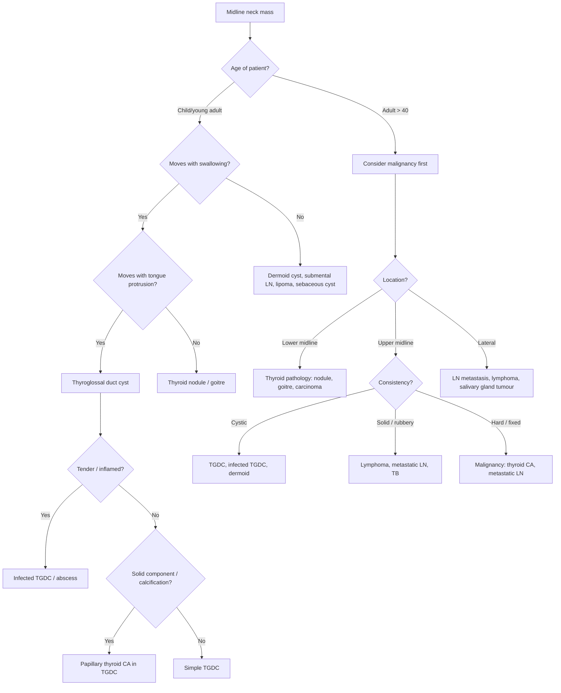

## Differential Diagnosis of a Thyroglossal Duct Cyst

### Framing the Problem

When a patient presents with a **midline or near-midline neck mass**, your job is to systematically work through what it could be. The differential diagnosis of a thyroglossal duct cyst is really the differential diagnosis of a **midline neck mass**, stratified by the patient's age and the mass characteristics.

The key clinical reasoning principle here is: **location narrows the differential more than anything else**. A midline neck mass has a completely different list of causes from a lateral neck mass. Let's build the differential from first principles.

> ***The age of the patient and status of the mass since it has been noticed are the two important clues towards the determination of the nature of the mass. Lesions occurring in young patients are probably congenital while those in old patients are likely to be malignant. Benign lesions grow slowly while malignant lesions increase in size rapidly.*** [1]

> ***The location of the neck mass frequently gives clue to the nature of the neck mass.*** [1]

---

### Systematic Approach to the Differential

***When approaching a neck mass, consider:*** [1][7]

- ***Age*** — congenital in children, malignant in older adults
- ***Rate of growth*** — slow (benign) vs. rapid (malignant or infected)
- ***Clinical features:*** [7]
  1. ***Location*** (midline vs. lateral; upper vs. lower neck)
  2. ***Consistency, transillumination***
  3. ***Size, mobility, surface, edge***
  4. ***Tenderness, pulsation***

***Midline neck mass differential:*** [1][7]
- ***Lower neck midline → lesions from the thyroid gland***
- ***Upper neck midline → thyroglossal cyst***

***D/dx of anterior neck lump:*** [4][8]
- ***Thyroid enlargement***
- ***Lymphadenopathy***
- ***Skin lumps and bumps***
- ***Branchial cyst (if paediatric)***
- ***Thyroglossal duct cyst (if paediatric)***

---

### Differential Diagnosis of a Midline Neck Mass

I'll organise this by aetiology, because that's how you should think on a ward round — "Is this congenital, inflammatory, or neoplastic?"

#### A. Congenital Causes

| Condition | Key Distinguishing Features | Why It's in the Differential |
|---|---|---|
| ***Thyroglossal duct cyst*** | Midline, at/near hyoid level; moves with swallowing AND tongue protrusion; cystic; transilluminant | The index condition — midline cyst from thyroglossal duct remnant |
| ***Dermoid cyst*** | Midline (submental); does NOT move with swallowing or tongue protrusion; doughy/rubbery consistency; non-transilluminant; may have a dermal sinus (pit) on overlying skin [9] | Also a midline cyst, but it sits in the subcutaneous plane — it has no connection to the hyoid bone or foramen caecum, so it is **fixed to skin but mobile over deeper structures**. Arises from entrapment of ectodermal tissue during embryonic fusion of facial processes [2][9] |
| ***Thymic cyst*** | Midline or slightly lateral; can present anywhere between the angle of mandible and the midline of the neck [2] | Results from implantation of thymic tissue during embryological descent of the thymus from the 3rd pharyngeal pouch. The thymus descends through the neck to the mediastinum — remnants can form cysts along this path |
| **Ectopic/lingual thyroid** | Midline mass at tongue base; may cause hypothyroidism; does NOT have a tract to the hyoid | Thyroid tissue that failed to descend from the foramen caecum. Unlike TGDC, this is solid thyroid tissue, not a cyst of a duct remnant |
| ***Ranula (plunging)*** | Painless, slow-growing, translucent/bluish mass in the floor of mouth or submental region [2] | A mucocele/pseudocyst from obstruction of the sublingual gland; a "plunging" ranula extends through the mylohyoid muscle into the submental/upper neck midline. Key: it transilluminates and is bluish [2] |
| ***Laryngocele*** | Air-filled cyst in the anterior neck; extends through thyrohyoid membrane; associated with hoarseness, cough, foreign body sensation [2] | Herniation of the saccule of the larynx; can present as a midline/paramedian anterior neck mass. Distinguishing feature: it is air-filled (not fluid-filled), may enlarge with Valsalva manoeuvre |

<Callout title="Dermoid vs. Thyroglossal Duct Cyst — The Classic Exam Distinction" type="idea">

Both are midline, both present in young patients. The key differentiator:

- **TGDC**: Moves with swallowing AND tongue protrusion (attached to hyoid and foramen caecum). Cystic, transilluminant.
- **Dermoid cyst**: Does NOT move with swallowing or tongue protrusion (subcutaneous, no connection to hyoid). Doughy, non-transilluminant, may have a punctum/dermal sinus. [9]

This is a favourite OSCE station question.
</Callout>

#### B. Thyroid-Related Causes

| Condition | Key Distinguishing Features | Why It's in the Differential |
|---|---|---|
| ***Thyroid nodule / goitre*** | Lower midline neck; moves with swallowing but NOT tongue protrusion; may be solid on palpation; check thyroid function [4] | The thyroid sits in the lower midline neck. A goitre or dominant nodule can present as a midline mass. It moves with swallowing because the thyroid is invested in the pretracheal fascia, but it has no connection to the foramen caecum |
| **Pyramidal lobe enlargement** | Midline mass extending superiorly from the isthmus; moves with swallowing; connected to thyroid | The pyramidal lobe is a vestigial remnant of the thyroglossal duct's inferior end. When the thyroid enlarges (e.g., Graves' disease, Hashimoto's), the pyramidal lobe can enlarge and present as a midline mass above the isthmus |
| ***Thyroid malignancy*** | Hard, fixed, irregular; may have cervical lymphadenopathy; may have pressure symptoms (dysphagia, dysphonia, stridor) [4] | Important to consider especially in adults > 40 with a midline neck mass. ***Solitary or dominant nodule: more likely to be malignant than multiple.*** ***Clinical features suggesting increased risk of malignancy: male sex, age < 14 or > 70, slow progressive growth, firm/hard consistency, fixation to surrounding tissues, pressure symptoms/RLN palsy, cervical LNs especially level VI*** [4] |

#### C. Inflammatory / Infective Causes

| Condition | Key Distinguishing Features | Why It's in the Differential |
|---|---|---|
| **Infected thyroglossal duct cyst** | Previously noticed midline mass that becomes suddenly painful, tender, erythematous ± fever; often precipitated by URTI [2][3] | This is not a separate diagnosis but rather a complication of TGDC. The cyst fluid is a good culture medium, and URTIs can seed the cyst |
| ***Reactive submental/midline lymphadenopathy*** | Tender, may be multiple; often in context of oral/dental infection or URTI; no movement with swallowing or tongue protrusion; solid on palpation | Submental lymph nodes (level IA) sit in the midline submental triangle. They drain the lower lip, floor of mouth, and tip of tongue. Reactive enlargement from infection can mimic a midline cyst |
| **Tuberculous lymphadenitis (scrofula)** | ***Should be suspected in patients with poor nutritional status*** [1]; matted nodes; may form a "cold abscess" with sinus formation; in Hong Kong, TB remains relatively prevalent | TB can involve cervical lymph nodes, sometimes in the midline. Matted, non-tender, caseous nodes with overlying violaceous skin are classic |
| **Acute suppurative lymphadenitis / abscess** | Acute onset, tender, warm, fluctuant; overlying erythema; associated fever | Bacterial infection of a submental/midline lymph node can form an abscess mimicking an infected TGDC |

#### D. Neoplastic Causes

| Condition | Key Distinguishing Features | Why It's in the Differential |
|---|---|---|
| ***Lymphoma*** | ***Rubbery consistency in a young patient → suspect lymphoma*** [1]; may have B symptoms (fever, night sweats, weight loss); often multiple nodes | ***When the lymph node is rubbery in consistency and occurs in a young patient, lymphoma should be suspected. Excision of the lymph node is necessary to obtain fresh tissue for pathological examination and staging.*** [1] |
| ***Metastatic lymph node*** | Hard, fixed; often in older patients; look for primary (head & neck, thyroid, GI tract) | ***Supraclavicular fossa mass may be secondary deposits from primary malignancies in the gastrointestinal tract*** [1]. ***In southern Chinese, when FNA showed undifferentiated SCC, consider lymph node metastasis from nasopharyngeal carcinoma (NPC). EBV DNA in blood should be checked.*** [1] |
| **Papillary thyroid CA within a TGDC** | Midline cystic mass with a solid component or calcification on imaging; ~1% of TGDCs | Ectopic thyroid tissue within the cyst wall can undergo malignant transformation — almost always papillary thyroid CA [3][6] |
| ***Skin lumps and bumps (lipoma, sebaceous cyst)*** | Lipoma: soft, mobile, slip sign positive [10]. Sebaceous cyst: punctum, attached to skin, non-transilluminant [11] | ***D/dx of anterior neck lump includes skin lumps and bumps*** [4][8]. These are superficial and do not move with swallowing or tongue protrusion |

#### E. Vascular Causes

| Condition | Key Distinguishing Features | Why It's in the Differential |
|---|---|---|
| ***Cystic hygroma (lymphatic malformation)*** | ***Transilluminates brilliantly*** [1]; soft, compressible; typically posterior triangle but can extend to midline; usually presents at birth or early infancy [2] | A macrocystic lymphatic malformation. Brilliant transillumination is essentially pathognomonic. It is composed of large, interconnected lymphatic cysts lined by thin endothelium [2] |
| ***Haemangioma*** | Compressible, red/bluish, bruit on auscultation; rapid growth then slow regression [2] | Vascular tumour with endothelial proliferation. Usually presents in infancy with a growth phase followed by involution. Intervention only if symptomatic (bleeding, airway compromise) [2] |

---

### Differential Diagnosis Decision Flowchart

---

### Key Examination Manoeuvres That Narrow the Differential

| Manoeuvre | What It Tests | Positive = | Negative = |
|---|---|---|---|
| **Swallowing test** | Is the mass attached to the laryngeal/hyoid complex? | TGDC, thyroid pathology | Dermoid cyst, lipoma, LN, sebaceous cyst |
| ***Tongue tug test (protrusion)*** | Is the mass attached to the foramen caecum via the thyroglossal duct? | ***TGDC (pathognomonic)*** | Thyroid nodule, dermoid, all other causes |
| **Transillumination** | Is the mass cystic/fluid-filled? | TGDC, cystic hygroma (brilliant), ranula | Solid masses (LN, thyroid nodule, lipoma) |
| **Pulsation / bruit** | Is the mass vascular? | Carotid body tumour, haemangioma | All non-vascular masses |
| ***Valsalva manoeuvre*** | Does it enlarge with increased intrathoracic pressure? | Laryngocele | All other midline masses |

---

### Summary Table: Distinguishing the Major Midline Neck Mass Differentials

| Feature | ***TGDC*** | ***Thyroid nodule*** | ***Dermoid cyst*** | ***Submental LN*** | ***Cystic hygroma*** |
|---|---|---|---|---|---|
| **Location** | Upper-mid midline (thyrohyoid level) | Lower midline | Submental/sublingual midline | Submental | Posterior triangle ± midline |
| **Moves with swallowing** | ***Yes*** | ***Yes*** | **No** | **No** | **No** |
| **Moves with tongue protrusion** | ***Yes*** | **No** | **No** | **No** | **No** |
| **Consistency** | Cystic, smooth | Firm/solid | Doughy/rubbery | Firm, may be tender | Soft, compressible |
| **Transillumination** | Yes | No | No | No | ***Brilliant*** [1] |
| **Tenderness** | Only if infected | Only if haemorrhage/thyroiditis | No | If reactive/infected | No |
| **Key distinguishing feature** | Tongue tug test positive | TFTs, USG, FNAC | Subcutaneous; punctum/pit | Multiple; context of infection | Brilliantly transilluminant; infancy |

---

### Special Consideration: Hong Kong Context

In Hong Kong, certain diagnoses deserve extra attention in the differential of neck masses:

- ***Nasopharyngeal carcinoma (NPC)***: Extremely prevalent in southern Chinese populations. ***In southern Chinese, when FNA showed undifferentiated squamous cell carcinoma, one of the differential diagnoses is lymph node metastasis from NPC. EBV DNA in blood should be checked. If elevated, endoscopic examination and random biopsies of the nasopharynx are indicated.*** [1]
- **Tuberculous lymphadenitis**: Still relatively common in Hong Kong. ***TB should be suspected in patients with poor nutritional status*** [1], immigrants, or immunocompromised patients. Matted, non-tender cervical nodes with caseation and sinus formation are characteristic.
- **Thyroid malignancy**: Hong Kong has a relatively high incidence of thyroid cancer (especially papillary thyroid carcinoma). Any midline neck mass in an adult should prompt thyroid assessment.

<Callout title="Exam Trap" type="error">
Do not assume a midline neck mass in an adult is a thyroglossal duct cyst without ruling out thyroid pathology and lymphadenopathy first. While TGDC is classically a "paediatric" diagnosis, it can present in adults — but in adults > 40, always think malignancy first. A hard, fixed midline mass in an older patient is thyroid cancer or metastatic lymphadenopathy until proven otherwise.
</Callout>

---

### Approach Algorithm: "I Have a Midline Neck Mass"

> ***Congenital lesions in general should be removed surgically at the appropriate age. These include cystic hygroma, branchial cyst or thyroglossal cyst. Otherwise these lesions may increase in size leading to functional disturbances later.*** [1]

> ***Lymph node should be investigated first rather than excised. FNA generally gives a clue to the aetiology of the enlarged lymph node. When a metastatic cervical lymph node is suspected, endoscopic examination and/or even examination under anaesthesia should be carried out. Every effort should be spent to locate the primary tumour.*** [1]

> ***Fine needle aspiration cytology is useful in the diagnosis of neck swelling. This should be done for most neck masses and the associated morbidity is low.*** [1]

> ***Excisional biopsy of the lymph node is only done as a last resort or when the diagnosis of lymphoma is suspected.*** [1]

---

<Callout title="High Yield Summary">

**Differential diagnosis of thyroglossal duct cyst = differential of a midline neck mass:**

1. **Congenital**: TGDC (moves with swallowing + tongue protrusion), dermoid cyst (does NOT move with either), thymic cyst, ectopic thyroid, ranula, laryngocele, cystic hygroma

2. **Thyroid**: Goitre/nodule (moves with swallowing but NOT tongue protrusion), pyramidal lobe enlargement, thyroid carcinoma

3. **Inflammatory/Infective**: Infected TGDC, reactive submental lymphadenopathy, TB lymphadenitis, abscess

4. **Neoplastic**: Lymphoma (rubbery, young patient), metastatic LN (hard, fixed, older patient — in HK consider NPC), papillary thyroid CA within TGDC (~1%)

5. **Two key examination tests**: Swallowing test (positive in TGDC and thyroid) and tongue tug test (positive ONLY in TGDC)

6. **Age rule**: Young patient → congenital; Older patient → malignancy until proven otherwise

7. **Hong Kong**: Always consider NPC (check EBV DNA), TB lymphadenitis, and thyroid CA

</Callout>

---

<ActiveRecallQuiz
  title="Active Recall - Differential Diagnosis of Thyroglossal Duct Cyst"
  items={[
    {
      question: "List the five main categories of differential diagnosis for a midline neck mass, and give one example from each.",
      markscheme: "1. Congenital: thyroglossal duct cyst, dermoid cyst, thymic cyst, cystic hygroma. 2. Thyroid-related: goitre, thyroid nodule, thyroid carcinoma. 3. Inflammatory/Infective: reactive lymphadenopathy, TB lymphadenitis, infected TGDC. 4. Neoplastic: lymphoma, metastatic lymph node, papillary CA in TGDC. 5. Vascular: haemangioma. One example from each category required."
    },
    {
      question: "How do you clinically distinguish a thyroglossal duct cyst from a dermoid cyst and a thyroid nodule using bedside examination manoeuvres?",
      markscheme: "TGDC: moves with swallowing AND tongue protrusion (attached to hyoid and foramen caecum). Thyroid nodule: moves with swallowing but NOT tongue protrusion (in pretracheal fascia, no connection to foramen caecum). Dermoid cyst: does NOT move with swallowing or tongue protrusion (subcutaneous, no deep attachment). Additional: dermoid is doughy, non-transilluminant, may have a dermal sinus/pit."
    },
    {
      question: "A 55-year-old southern Chinese man presents with an enlarging, hard, fixed lateral neck mass. FNA shows undifferentiated squamous cell carcinoma. What is the most important diagnosis to consider and what investigation should you order next?",
      markscheme: "Most important diagnosis: metastatic lymph node from nasopharyngeal carcinoma (NPC), which is highly prevalent in southern Chinese. Next investigations: check serum EBV DNA level; if elevated, perform endoscopic examination of the nasopharynx with random biopsies. Also consider CT/MRI for staging."
    },
    {
      question: "A young patient presents with a rubbery, non-tender lateral neck mass. What diagnosis should you suspect and what is the preferred diagnostic approach?",
      markscheme: "Suspect lymphoma (rubbery consistency + young patient). Preferred approach: excisional biopsy of the lymph node to obtain fresh tissue for pathological examination, immunohistochemistry, and staging. FNA alone is often insufficient for lymphoma subtyping. Excisional biopsy is justified when lymphoma is suspected."
    },
    {
      question: "Name three congenital neck cysts and explain the embryological origin of each.",
      markscheme: "1. Thyroglossal duct cyst: failure of thyroglossal duct (from foramen caecum to thyroid) to obliterate by weeks 7-10. 2. Branchial cleft cyst: remnant of pharyngeal (branchial) apparatus; 2nd branchial cleft is most common, presents anterior to SCM. 3. Cystic hygroma (lymphatic malformation): sequestered lymphatic channels that fail to communicate with the venous system; macrocystic, brilliantly transilluminant. Others acceptable: thymic cyst (from thymic remnants during descent from 3rd pharyngeal pouch), dermoid cyst (entrapment of ectodermal tissue during embryonic fusion)."
    }
  ]}
/>

---

## References

[1] Lecture slides: GC 218. I have a swelling in the neck Neck mass (Notes).pdf
[2] Senior notes: felixlai.md (Neck mass / Congenital neck mass section)
[3] Senior notes: maxim.md (Thyroglossal cysts section)
[4] Senior notes: Ryan Ho Endocrine.pdf (p18, Thyroid nodule approach and D/dx of anterior neck lump)
[6] Lecture slides: GC 177. A thyroid nodule benign thyroid nodules; thyroid cancer.pdf
[7] Lecture slides: GC 218. I have a swelling in the neck Neck mass.pdf (slide p3)
[8] Senior notes: Ryan Ho Fundamentals.pdf (p426, D/dx of anterior neck lump)
[9] Senior notes: Ryan Ho Rheumatology.pdf (p167–168, Dermoid cyst)
[10] Senior notes: Ryan Ho Rheumatology.pdf (p169, Lipoma)
[11] Senior notes: Ryan Ho Rheumatology.pdf (p164, Sebaceous cyst)
