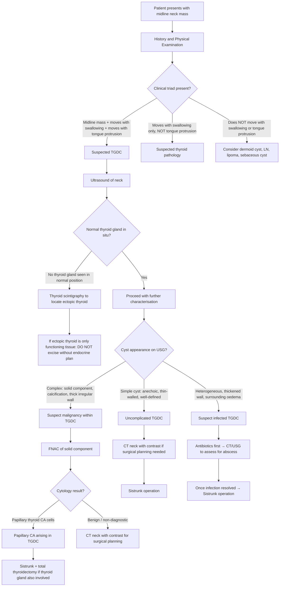

## Diagnostic Criteria, Algorithm, and Investigations for Thyroglossal Duct Cyst

### Diagnostic Criteria

Unlike many medical conditions, there is no formal "consensus diagnostic criteria" or scoring system for thyroglossal duct cyst. The diagnosis is made through a **combination of clinical features, examination findings, and supportive imaging**. Let me walk you through the logic.

#### Clinical Diagnostic Triad

In practice, the diagnosis of TGDC is strongly suspected when all three of the following are present:

| Criterion | Rationale |
|---|---|
| **1. Midline or near-midline neck mass** (typically at or near the hyoid bone / thyrohyoid membrane level) | The thyroglossal duct descends in the midline; 60% of cysts are at the thyrohyoid membrane level [3] |
| **2. Mass elevates with swallowing** | The cyst is attached to the hyoid bone via the persistent tract; swallowing elevates the hyoid → cyst moves up |
| **3. Mass elevates with tongue protrusion (positive tongue tug test)** | The tract maintains its embryological connection to the foramen caecum at the tongue base; tongue protrusion transmits traction → cyst elevates. This is **essentially pathognomonic** [3] |

> The diagnosis is **clinical** in the vast majority of cases. Imaging is used to **confirm** the diagnosis, **delineate anatomical relationships** (especially with the hyoid bone), and — critically — to **confirm the presence of a normally positioned thyroid gland** before surgery.

#### Definitive (Histological) Diagnosis

The **definitive diagnosis** is histopathological, confirmed on the excised specimen after Sistrunk operation:
- Cyst lined by **squamous or ciliated pseudostratified columnar (respiratory-type) epithelium**
- May contain **thyroid follicular tissue** in the cyst wall (up to 20% of cases)
- **Mucoid/gelatinous cyst contents**
- Tract intimately related to or passing through the **body of the hyoid bone**

<Callout title="Key Principle">
TGDC is a **clinical diagnosis confirmed by imaging and ultimately by histopathology**. There is no blood test or single imaging feature that alone is diagnostic. The clinical triad (midline mass + moves with swallowing + moves with tongue protrusion) is the cornerstone.
</Callout>

---

### Diagnostic Algorithm

The approach to diagnosing a suspected TGDC follows a logical stepwise framework: **clinical assessment → imaging → tissue diagnosis if indicated**.

---

### Investigation Modalities

Let me go through each investigation in detail — **what it is, why we do it, what we look for, and how to interpret the findings**.

---

#### 1. Ultrasound (USG) of the Neck — First-Line Imaging

***Ultrasound is the first-line investigation for any neck mass.*** [12]

**Why USG first?**
- Non-invasive, no radiation, readily available, inexpensive
- Excellent for superficial structures in the neck
- Can differentiate cystic from solid masses
- ***Confirms the origin of the mass*** [12]
- ***Can identify enlarged neck lymph nodes*** [12]

**What to look for in TGDC on USG:**

| USG Finding | Interpretation | Pathophysiological Basis |
|---|---|---|
| **Well-defined, anechoic (black) cystic lesion** | Classic uncomplicated TGDC | Fluid-filled cyst with no internal echoes — mucoid content is homogeneous |
| **Midline or paramedian location, at/near hyoid level** | Consistent with TGDC | The thyroglossal duct passes through/around the hyoid in the midline |
| **Thin, smooth cyst wall** | Uncomplicated cyst | Epithelial lining without inflammation or solid tissue |
| **Posterior acoustic enhancement** | Confirms cystic nature | Sound waves pass through fluid with less attenuation → brighter signal behind the cyst |
| **Pseudosolid / heterogeneous echotexture** | May be seen in infected TGDC or proteinaceous content | High protein content or debris from infection increases internal echoes, making it appear "solid" — this is a **pitfall**: an infected TGDC can mimic a solid mass on USG |
| **Solid component / mural nodule within the cyst** | Suspicious for malignancy (papillary thyroid CA) | Thyroid follicular tissue in the cyst wall has undergone neoplastic transformation |
| **Calcification within the cyst** | Suspicious for papillary thyroid CA | Microcalcifications (psammoma bodies) are characteristic of papillary thyroid carcinoma |

**Critical second role of USG — Confirm the normal thyroid gland:**

> ***USG ± FNAC: confirm presence of normal thyroid gland (otherwise removal of thyroglossal duct might cause hypothyroidism)*** [3]

This is non-negotiable. Before any surgery, the ultrasound must demonstrate a **normally positioned thyroid gland in the lower neck** (two lobes + isthmus, anterior to the 2nd–4th tracheal rings). If no normal thyroid is seen, the patient may have **thyroid ectopia** — and the ectopic tissue (e.g., lingual thyroid, tissue within the TGDC itself) may be their only functioning thyroid.

**Limitation of USG for TGDC:**

> ***USG cannot delineate relations with the hyoid bone*** [3] — the hyoid is bony and causes acoustic shadowing, making it difficult to trace the tract's relationship to the hyoid. This is why CT is needed for surgical planning.

<Callout title="Clinical Pearl" type="idea">
USG of a TGDC may show a "pseudosolid" appearance when the cyst is infected or contains proteinaceous/mucoid debris. Do not confuse this with a solid neoplasm. Clinical context (fever, tenderness, recent URTI) helps differentiate. If in doubt, FNAC the lesion.
</Callout>

---

#### 2. CT Neck with Contrast — For Surgical Planning

***CT neck with contrast is the key imaging modality for delineating the anatomical relationships of TGDC, especially with the hyoid bone.*** [3]

**Why CT?**
- Excellent bony detail → clearly shows the **relationship of the cyst/tract to the body of the hyoid bone**
- Delineates the full extent of the tract (from foramen caecum to cyst)
- Identifies complications (abscess, fistula)
- Essential for **pre-operative surgical planning** (the Sistrunk operation requires precise knowledge of the tract's course)
- Can detect solid components suggestive of malignancy

**What to look for on CT:**

| CT Finding | Interpretation |
|---|---|
| **Well-defined, low-density (hypodense) cystic lesion in midline** | Classic TGDC — fluid density similar to water |
| **Located at thyrohyoid membrane level, embedded in/near strap muscles** | Typical infrahyoid TGDC (most common location) |
| **Intimate relationship with body of hyoid bone** | Pathognomonic — the tract passes through or around the hyoid |
| **Tract extending superiorly towards tongue base / foramen caecum** | Visible in some cases; confirms the diagnosis |
| **Rim enhancement with contrast** | Thin, smooth rim enhancement = uncomplicated cyst with a vascular epithelial lining |
| **Thick, irregular rim enhancement + surrounding fat stranding** | Infected TGDC / abscess — inflammation of the cyst wall and surrounding tissues |
| **Solid enhancing component / calcification within the cyst** | Suspicious for carcinoma arising within the TGDC (papillary thyroid CA) |
| **Normal thyroid gland visible in lower neck** | Confirms that the patient has a normally positioned thyroid — safe to proceed with excision |

**CT vs. MRI:**
- CT is preferred in most centres for TGDC because of its excellent **bony detail** (hyoid bone relationships), faster acquisition, and wider availability
- MRI provides superior **soft tissue contrast** and is radiation-free — useful in children or when the relationship to the tongue base needs detailed assessment
- On MRI, TGDC appears as: **T1-weighted: low to intermediate signal (depending on protein content); T2-weighted: high signal (bright, as expected for fluid)**

---

#### 3. Fine Needle Aspiration Cytology (FNAC)

***Fine needle aspiration cytology is useful in the diagnosis of neck swelling. This should be done for most neck masses and the associated morbidity is low.*** [1]

**When to perform FNAC on a suspected TGDC:**

FNAC is **not routinely required** for a classic, uncomplicated TGDC where the clinical and imaging diagnosis is clear. However, it is indicated in specific situations:

| Indication for FNAC | Rationale |
|---|---|
| **Solid component or mural nodule on imaging** | Rule out papillary thyroid CA arising within the TGDC |
| **Atypical imaging features** (calcification, irregular wall, non-cystic) | Exclude malignancy |
| **Diagnostic uncertainty** — cannot distinguish TGDC from other pathologies | Cytological analysis to clarify the diagnosis |
| **Infected cyst — to guide antibiotic therapy** | Culture and sensitivity of aspirated pus |

**FNAC Findings in TGDC:**

| Finding | Interpretation |
|---|---|
| **Mucoid/colloid material** | Consistent with TGDC — the cyst contains mucoid secretions from its epithelial lining |
| **Squamous epithelial cells or ciliated columnar cells** | Represents the cyst lining — consistent with TGDC |
| **Thyroid follicular cells** | Can be seen in ~20% of TGDC — represents thyroid tissue in the cyst wall. Benign if no atypia |
| **Papillary thyroid carcinoma cells** (nuclear grooves, intranuclear inclusions "Orphan Annie eyes", psammoma bodies) | **Malignant transformation within TGDC** — requires Sistrunk + consideration of total thyroidectomy |
| **Inflammatory cells / neutrophils** | Infected TGDC |

> ***FNAC accuracy is 90–95% for thyroid nodules*** [4]. For TGDC specifically, FNAC is less standardised but can be very helpful when malignancy is suspected.

<Callout title="Exam Trap" type="error">
Finding thyroid follicular cells on FNAC of a TGDC does NOT automatically mean malignancy. Up to 20% of TGDCs contain normal thyroid follicular tissue in their walls. You need to look for features of papillary thyroid carcinoma (nuclear grooves, intranuclear pseudoinclusions, psammoma bodies) to diagnose malignancy.
</Callout>

---

#### 4. Thyroid Function Tests (TFTs)

***TFT (ultrasensitive TSH ± fT4) should be performed routinely.*** [4]

**Why check TFTs in a suspected TGDC?**
- To assess whether the patient's thyroid is functioning normally
- If the TGDC or associated ectopic thyroid is the patient's **only functioning thyroid tissue**, the patient may be **hypothyroid**
- A baseline TFT is needed before any surgical intervention (Sistrunk operation)
- To exclude concurrent thyroid pathology (e.g., Graves' disease, Hashimoto's thyroiditis) if there is associated thyroid enlargement

| TFT Result | Interpretation in TGDC Context |
|---|---|
| **Normal TSH and fT4** | Normal thyroid function — most common scenario. Suggests the patient has a normally functioning thyroid gland separate from the cyst |
| **Elevated TSH, low fT4 (hypothyroid)** | Raises concern that the TGDC or ectopic thyroid (e.g., lingual thyroid) may be the only functioning thyroid tissue. Must confirm with imaging before excision |
| **Low TSH, elevated fT4 (hyperthyroid)** | Uncommon in TGDC. Consider concurrent thyroid pathology (e.g., toxic nodule, Graves'). Ectopic thyroid tissue in the cyst very rarely becomes hyperfunctioning |

---

#### 5. Thyroid Scintigraphy (Radionuclide Scan)

**Not a routine investigation for TGDC**, but indicated in specific scenarios:

| Indication | Rationale |
|---|---|
| **No normal thyroid gland seen on USG** | To locate ectopic functioning thyroid tissue (e.g., lingual thyroid, tissue within the TGDC) |
| **Hypothyroidism on TFTs** | To determine whether the ectopic tissue is the patient's only source of thyroid hormone |
| **To confirm ectopic thyroid vs. TGDC** | Ectopic thyroid will take up radiotracer; a simple TGDC without functioning thyroid tissue will not |

**Radiopharmaceutical**: Technetium-99m pertechnetate (⁹⁹ᵐTc) or Iodine-123 (¹²³I)

**Interpretation:**

| Finding | Meaning |
|---|---|
| **Normal uptake in lower neck (thyroid position)** | Normal thyroid gland present → safe to proceed with excision |
| **Uptake at tongue base (lingual thyroid) with NO uptake in lower neck** | Ectopic lingual thyroid is the only functioning thyroid tissue → excision of TGDC will cause permanent hypothyroidism unless thyroid replacement is given |
| **Uptake within the cyst itself** | The TGDC contains functioning thyroid tissue — may be the only source |
| **No uptake anywhere** | Could be athyreosis (rare) or technical issue — needs correlation |

> ***Thyroid scintigraphy can differentiate causes of congenital hypothyroidism including lingual ectopic thyroid (requires lifelong T4 replacement)*** [13]

---

#### 6. Additional Investigations (Situational)

| Investigation | When Indicated | What It Shows |
|---|---|---|
| **MRI neck** | Paediatric patients (avoid radiation); complex cases; need to delineate tongue base involvement | Excellent soft tissue contrast; shows tract to foramen caecum; T2-bright cystic lesion |
| **Chest X-ray** | If concurrent thyroid pathology suspected with retrosternal extension | Mediastinal widening, tracheal deviation |
| **Blood tests: CBC, CRP** | If infected TGDC suspected | Leucocytosis, raised CRP — confirms active infection/abscess |
| **EBV DNA** | ***In southern Chinese with suspicious neck mass*** [1] | To exclude NPC metastasis — relevant in Hong Kong |
| **Thyroglobulin level** | If papillary CA found in TGDC | Baseline tumour marker for post-operative surveillance |

---

### Summary: Investigation Hierarchy for Suspected TGDC

| Priority | Investigation | Purpose |
|---|---|---|
| **1st** | **Clinical examination** (tongue tug test, swallowing test) | Establish clinical diagnosis |
| **2nd** | ***USG of neck*** | Confirm cystic nature; confirm normal thyroid gland in situ; assess for solid components [3][12] |
| **3rd** | ***CT neck with contrast*** | Delineate relationship with hyoid bone; surgical planning; cannot be done by USG alone [3] |
| **4th** | **TFTs** | Baseline thyroid function; exclude hypothyroidism from ectopic thyroid |
| **5th (selective)** | **FNAC** | Only if solid component, atypical features, or diagnostic uncertainty [1] |
| **6th (selective)** | **Thyroid scintigraphy** | Only if no normal thyroid seen on USG or if hypothyroid [13] |

---

### Comparison of Imaging Modalities for TGDC

| Feature | USG | CT with Contrast | MRI | Scintigraphy |
|---|---|---|---|---|
| **First-line?** | ***Yes*** [12] | No (2nd-line for planning) | No (selective) | No (selective) |
| **Radiation** | None | Yes | None | Yes (low) |
| **Cyst characterisation** | Good | Excellent | Excellent | N/A |
| **Hyoid bone relationship** | ***Poor (acoustic shadow)*** [3] | ***Excellent*** | Good | N/A |
| **Tract visualisation** | Limited | Good | Best (T2 sequences) | N/A |
| **Normal thyroid confirmation** | ***Excellent*** [3] | Good | Good | ***Excellent for ectopic thyroid*** [13] |
| **Detects solid component / Ca** | Good | Good | Good | Shows uptake in functioning tissue |
| **Paediatric preference** | Yes (no radiation) | Less preferred | Yes (no radiation) | Selective |

---

<Callout title="High Yield Summary">

**Diagnosis of Thyroglossal Duct Cyst:**

1. **Clinical diagnosis**: Midline mass + moves with swallowing + moves with tongue protrusion (positive tongue tug test). No formal scoring system — clinical triad is the cornerstone.

2. **USG neck (first-line imaging)**: Confirm cystic nature, confirm normal thyroid gland in situ. Limitation: cannot delineate hyoid bone relationships.

3. **CT neck with contrast (surgical planning)**: Delineates cyst-hyoid-tract anatomy for Sistrunk operation. Shows extent of tract, complications (abscess, fistula), and solid components.

4. **FNAC**: Not routine. Indicated when solid component, calcification, or diagnostic uncertainty. Look for papillary CA cells if malignancy suspected.

5. **TFTs**: Baseline thyroid function. Hypothyroidism suggests ectopic thyroid may be only functioning tissue.

6. **Thyroid scintigraphy**: Only if no normal thyroid on USG or if hypothyroid — to locate ectopic functioning thyroid tissue.

7. **Critical pre-operative rule**: ALWAYS confirm normal thyroid gland exists before Sistrunk operation (USG ± scintigraphy). Removing TGDC that contains the patient's only thyroid tissue → permanent hypothyroidism.

8. **Definitive diagnosis**: Histopathology of excised specimen (Sistrunk operation).

</Callout>

---

<ActiveRecallQuiz
  title="Active Recall - Diagnosis and Investigations for TGDC"
  items={[
    {
      question: "What is the clinical diagnostic triad for thyroglossal duct cyst, and which element is essentially pathognomonic?",
      markscheme: "Triad: 1. Midline or near-midline neck mass (typically at thyrohyoid membrane level), 2. Mass elevates with swallowing, 3. Mass elevates with tongue protrusion (positive tongue tug test). The tongue tug test is essentially pathognomonic because only TGDC has a tract connected to the foramen caecum at the tongue base."
    },
    {
      question: "Why is ultrasound the first-line imaging for a suspected TGDC, and what is its key limitation for this condition?",
      markscheme: "USG is first-line because it is non-invasive, no radiation, readily available, can confirm cystic nature, identify solid components, and critically confirm the presence of a normal thyroid gland in situ. Key limitation: USG cannot delineate the relationship of the cyst/tract with the hyoid bone due to acoustic shadowing from bone — this is why CT with contrast is needed for surgical planning."
    },
    {
      question: "A child has a suspected TGDC but ultrasound shows no thyroid gland in the normal lower neck position. What investigation should you order next and why?",
      markscheme: "Order thyroid scintigraphy (Tc-99m pertechnetate or I-123 scan) to locate ectopic functioning thyroid tissue (e.g., lingual thyroid or within the cyst itself). This is critical because if the ectopic tissue is the patient's only functioning thyroid, excising the TGDC would cause permanent hypothyroidism. Also check TFTs for hypothyroidism."
    },
    {
      question: "When is FNAC indicated for a thyroglossal duct cyst, and what cytological finding would raise concern for malignancy?",
      markscheme: "FNAC is indicated when there is a solid component or mural nodule on imaging, calcification, atypical features, or diagnostic uncertainty. Malignancy is suggested by papillary thyroid carcinoma cells showing nuclear grooves, intranuclear pseudoinclusions (Orphan Annie eyes), and psammoma bodies. Note: finding normal thyroid follicular cells alone does NOT indicate malignancy — up to 20% of TGDCs contain benign thyroid tissue."
    },
    {
      question: "What are the key findings on CT neck with contrast that characterise a thyroglossal duct cyst, and what finding would suggest an infected cyst vs. malignancy?",
      markscheme: "Classic TGDC: well-defined, midline, hypodense cystic lesion at thyrohyoid membrane level with thin rim enhancement, intimately related to the body of the hyoid bone. Infected cyst: thick irregular rim enhancement with surrounding fat stranding and oedema. Malignancy: solid enhancing component or calcification within the cyst wall."
    }
  ]}
/>

---

## References

[1] Lecture slides: GC 218. I have a swelling in the neck Neck mass (Notes).pdf
[3] Senior notes: maxim.md (Thyroglossal cysts section)
[4] Senior notes: Ryan Ho Endocrine.pdf (p18–20, Thyroid nodule investigations)
[12] Lecture slides: GC 217. Facial nerve palsy and salivary gland diseases.pdf (p43 — USG as first-line for neck mass)
[13] Senior notes: Ryan Ho Diagnostic Radiology.pdf (p60, Thyroid scintigraphy for ectopic thyroid)
