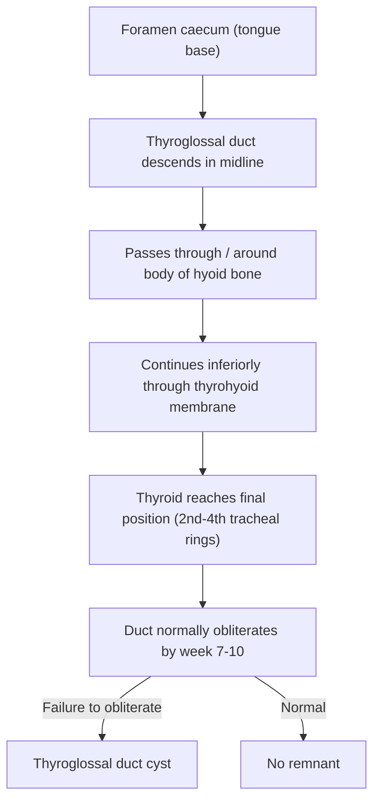
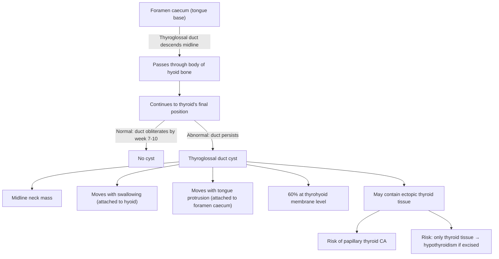

# Thyroglossal Duct Cyst

## Definition

A **thyroglossal duct cyst (TGDC)** is a congenital cystic mass that arises from the failure of the thyroglossal duct (tract) to obliterate during embryological development. Let's break the name down:

- **Thyro-** = thyroid
- **-glossal** = tongue (Greek: *glossa* = tongue)
- **Duct** = the embryological tube connecting the tongue base to the thyroid's final position
- **Cyst** = a fluid-filled sac lined by epithelium

So the name literally tells you: it is a cyst arising from the duct that once connected the tongue to the thyroid gland.

> ***The thyroglossal duct cyst is the most common congenital midline neck mass in children and adults.*** [1][2][3]

<Callout title="Key Concept">
The thyroglossal duct is an embryological structure that normally regresses by gestational weeks 7–10. If any part of this tract persists, it can undergo cystic dilatation — forming a thyroglossal duct cyst at any point along the tract's original path from the foramen caecum of the tongue to the pyramidal lobe of the thyroid.
</Callout>

---

## Epidemiology

- ***Most common congenital cervical (neck) anomaly*** — accounts for approximately **70% of all congenital neck masses** [1][2]
- Represents about **2–4% of all neck masses** overall
- **Incidence**: ~7% of the population has thyroglossal duct remnants, but only a minority become clinically symptomatic
- **Age of presentation**: Although congenital, most present in **childhood (peak: < 10 years old)**, but can present at any age including adulthood (often when a previously quiescent cyst becomes infected)
- **Sex**: Roughly equal male-to-female ratio (some studies show slight male predominance)
- ***60% are located at the level of the thyrohyoid membrane*** (i.e., between the hyoid bone and the thyroid cartilage) — this is the single most common location [3]

### Location Distribution Along the Tract

| Location | Approximate % |
|---|---|
| Suprahyoid (between tongue base and hyoid) | ~20–25% |
| **At the level of the hyoid bone** | ~15–20% |
| ***Infrahyoid / thyrohyoid membrane level*** | ***~60%*** |
| Intralingual (within the tongue) | Rare |
| At or near the thyroid gland | Rare |

> The fact that 60% occur at the thyrohyoid membrane level is a favourite exam factoid. Understand why: this is where the duct passes most closely to the hyoid bone, and the hyoid bone is the key anatomical landmark for this condition.

---

## Risk Factors

There are no well-established modifiable risk factors. This is a **congenital developmental anomaly**. Key associations include:

- **Failure of embryological obliteration** — the fundamental cause; why some tracts fail to obliterate is not fully understood
- **Thyroid ectopia** — ***associated with ectopic thyroid tissue (mostly lingual thyroid) → may cause hypothyroidism*** [3]. In some patients, the only functioning thyroid tissue is ectopic (e.g., within the cyst or at the tongue base). Removing it without checking for a normal thyroid gland can render the patient permanently hypothyroid
- **Recurrent upper respiratory tract infections** — may trigger enlargement or infection of a previously occult cyst, prompting clinical presentation
- **Family history** — rare familial cases described, but the vast majority are sporadic

---

## Anatomy and Embryology

This is arguably the most important section to understand, because everything about TGDC — its location, its movement with swallowing and tongue protrusion, its surgical management — flows directly from the embryology.

### Embryological Development of the Thyroid Gland

***The thyroid gland originates from the endoderm of the primitive foregut.*** [4]

Here is the step-by-step sequence:

1. **Week 3–4 of gestation**: A thickening of endodermal cells appears at the **foramen caecum** of the developing tongue
   - ***The foramen caecum is located at the apex (junction) of the sulcus terminalis — the V-shaped groove separating the anterior 2/3 from the posterior 1/3 of the tongue*** [4]
   - This is the site where the circumvallate (vallate) papillae are arranged

2. **The thyroglossal duct extends inferiorly** from the foramen caecum, descending in the midline through the developing neck tissues

3. **Critical relationship with the hyoid bone**: As the thyroglossal duct descends, it passes **anterior to, through, or posterior to the body of the developing hyoid bone**. This intimate relationship with the hyoid is crucial — it is why the hyoid must be resected in surgery.

4. ***By gestational week 7, the thyroid anlage (primordium) reaches its final position in the midline of the neck, anterior to the larynx, at the level of the 2nd–4th tracheal rings*** [4]

5. ***By gestational weeks 7–10, the thyroglossal duct normally involutes (regresses) completely*** [3][4]

6. If any portion of the duct **fails to obliterate**, the residual epithelial remnant can accumulate secretions and undergo **cystic dilatation** → thyroglossal duct cyst

### Relevant Anatomy of the Thyroid Gland

***Anatomy of the thyroid:*** [4]
- **Site**: Two lobes joined by an isthmus, lying anterior to the **2nd–4th tracheal rings**, with the upper border marked by the **cricoid cartilage**
- **Arterial supply**:
  - ***Superior thyroid artery*** — from the **external carotid artery**
  - ***Inferior thyroid artery*** — from the **thyrocervical trunk** (branch of 1st part of subclavian artery)
- **Close anatomical relations important for surgery**:
  - ***External branch of the superior laryngeal nerve (from CN X)*** — travels with the superior thyroid artery, supplies the cricothyroid muscle → ***prone to injury when dissecting the upper pole of the thyroid → results in inability to sing high-pitched notes and easy voice fatigability*** [4]
  - **Recurrent laryngeal nerve** — lies in the tracheo-oesophageal groove, supplies all intrinsic laryngeal muscles except cricothyroid → injury causes hoarseness (unilateral) or airway obstruction (bilateral)
  - **Parathyroid glands** — typically 4, lie posterior to the thyroid lobes

### The Tract's Relationship to the Hyoid Bone

This is the single most surgically important anatomical fact about TGDC:

> ***The thyroglossal duct has an intimate relationship with the body of the hyoid bone — it may pass anterior to, through, or posterior to it. This is why the Sistrunk operation requires excision of the central body of the hyoid bone.*** [1][2][3]

The hyoid bone develops from the 2nd and 3rd pharyngeal (branchial) arches. As the thyroglossal duct descends during embryogenesis, the hyoid bone forms around the duct. Remnants of the duct can be embedded within the hyoid itself.

### Why the Cyst Is in the Midline

The thyroid descends strictly in the **midline**. Therefore, the thyroglossal duct and any cyst arising from it are characteristically **midline or near-midline** structures. However, ***it can be slightly lateral to the midline***, particularly at the infrahyoid level where the tract may deviate slightly (usually to the left) [3].

---

## Etiology and Pathophysiology

### Fundamental Cause

***Failure of the thyroglossal tract to obliterate by gestational weeks 7–10 → cystic expansion of the remnant.*** [3]

### Pathophysiology — Step by Step

1. **Persistent epithelial remnant**: Any segment of the thyroglossal duct that does not involute retains its epithelial lining
2. **Secretion of mucus**: The lining epithelium (which can be squamous, columnar, or transitional/pseudostratified ciliated columnar epithelium — reflecting its endodermal origin) secretes mucus or serous fluid
3. **Cystic dilatation**: Accumulated secretions cause the remnant to expand into a cyst
4. **Why it elevates with swallowing**: The thyroglossal duct remnant is **attached to the hyoid bone** (or passes through it) and may have fibrous connections superiorly to the foramen caecum. When the patient swallows, the hyoid bone and laryngeal complex move superiorly → this pulls the cyst upward. This is the basis of the classic clinical sign.
5. **Why it elevates with tongue protrusion**: The tract's superior attachment to the **foramen caecum at the tongue base** means protruding the tongue pulls on the tract → elevates the cyst. This is the ***tongue tug test*** [3].

### Histopathology

- The cyst is lined by **epithelium** that varies depending on location:
  - **Squamous epithelium** — more common in suprahyoid cysts (closer to the oropharynx)
  - **Ciliated pseudostratified columnar epithelium (respiratory-type)** — more common in infrahyoid cysts (closer to the trachea/thyroid)
  - **Thyroid follicular tissue** may be found in the cyst wall in up to **20% of cases** — this is relevant because it can give rise to **thyroid carcinoma within the cyst** (almost always **papillary thyroid carcinoma**)
- The cyst contains **mucoid or gelatinous fluid** (may become purulent if infected)

### Associated Conditions

- ***Thyroid ectopia (ectopic thyroid tissue)*** — ***mostly lingual thyroid*** [3]
  - In approximately **1–2%** of TGDC patients, the only functioning thyroid tissue is ectopic (e.g., within the tongue base or within the cyst itself)
  - ***This association with ectopic thyroid can cause hypothyroidism*** [3]
  - **Clinical significance**: Before excising the cyst, you **must** confirm the presence of a **normally positioned thyroid gland** — otherwise, removing the TGDC may render the patient **permanently hypothyroid**

<Callout title="Must-Know for Exams" type="error">
Before performing a Sistrunk operation, always confirm there is a normal thyroid gland in situ (usually by ultrasound). If the thyroglossal duct cyst contains the patient's only functioning thyroid tissue, removing it will cause permanent hypothyroidism. This is an exam classic.
</Callout>

---

## Classification

### By Location Along the Thyroglossal Tract

| Type | Location | Notes |
|---|---|---|
| **Intralingual** | Within the tongue substance | Rare; near the foramen caecum |
| **Suprahyoid** | Between tongue base and hyoid bone | ~20–25% |
| **At the hyoid** | At the level of the hyoid bone body | ~15–20% |
| ***Infrahyoid (thyrohyoid level)*** | ***Between hyoid bone and thyroid cartilage*** | ***~60% — most common*** [3] |
| **Suprasternal** | At or near the thyroid gland | Rare |

### By Clinical Presentation

- **Uncomplicated cyst**: Painless midline neck mass
- ***Infected cyst / Abscess***: ***Tenderness, erythema, fever*** [3]
- ***Fistula formation***: ***Secondary to infection or incomplete excision*** [3] — a sinus tract may open to the skin surface
- ***Malignant transformation***: ***Rare; almost always papillary thyroid carcinoma*** [3]

### By Histological Lining

- Squamous epithelium–lined
- Respiratory epithelium–lined
- Mixed

---

## Clinical Features

### Symptoms

| Symptom | Pathophysiological Basis |
|---|---|
| ***Painless midline upper neck mass*** | Cystic dilatation of the thyroglossal duct remnant; midline because the thyroid descends in the midline |
| **Mass moves with swallowing** | The cyst is attached to the hyoid bone via the remnant tract; swallowing elevates the hyoid and larynx, pulling the cyst upward |
| **Mass moves with tongue protrusion** | The tract extends superiorly to the foramen caecum at the tongue base; protruding the tongue puts traction on the tract, elevating the cyst — this is the ***tongue tug test*** [3] |
| ***Recurrent swelling/infections*** | Cyst fluid is a good culture medium; upper respiratory infections can seed the cyst via lymphatic or direct spread; once infected, it may swell, become painful, and recur [2] |
| ***Pain, redness, tenderness (when infected)*** | ***Abscess formation*** within the cyst → local inflammation [3] |
| **Dysphagia (rare)** | Large cysts, especially suprahyoid ones, can compress the pharynx or oropharynx |
| **Dysphonia/change in voice (rare)** | Large infrahyoid cysts may compress the larynx |
| ***Draining sinus/fistula*** | ***If the cyst ruptures (spontaneously or after incision and drainage), a fistula tract may form to the skin surface*** [3] |
| **Symptoms of hypothyroidism (rare)** | If the cyst or ectopic lingual thyroid is the patient's only functioning thyroid tissue, they may present with hypothyroidism features (fatigue, cold intolerance, constipation, etc.) |

### Signs

| Sign | Pathophysiological Basis |
|---|---|
| ***Midline or slightly paramedian neck mass*** | The thyroglossal duct descends midline; the cyst arises from remnants of this midline tract. ***Can be slightly lateral.*** [3] |
| ***Located at or near the hyoid bone (most commonly at thyrohyoid membrane level)*** | ***60% at the thyrohyoid membrane level*** [3]; this is where the duct is most closely related to the hyoid |
| **Smooth, well-circumscribed, soft/cystic swelling** | Fluid-filled cyst with a well-defined epithelial lining; not infiltrative |
| **Non-tender (unless infected)** | Uncomplicated cysts are asymptomatic fluid collections |
| ***Elevates with swallowing*** | Attachment to hyoid/laryngeal complex — swallowing elevates hyoid → cyst moves up |
| ***Elevates with tongue protrusion (positive tongue tug test)*** | ***Tract attached to foramen caecum at tongue base → tongue protrusion → traction → cyst moves superiorly*** [3] |
| **Transilluminant** | Cystic (fluid-filled) mass transilluminates; distinguishes it from solid masses |
| **Overlying skin normal (unless infected)** | No skin involvement unless fistula or abscess has formed |
| ***Sinus opening with mucoid discharge (if fistula present)*** | Secondary to rupture or infection → epithelialized tract to skin [3] |
| **Firm/hard mass (if malignant transformation)** | Solid component within the cyst suggests carcinoma (usually papillary thyroid CA) |

### Distinguishing Clinical Feature: The "Tongue Tug Test"

This is the **pathognomonic clinical test** for TGDC:

1. Ask the patient to protrude (stick out) their tongue
2. Observe the neck mass
3. **Positive result**: The mass elevates (moves superiorly) with tongue protrusion

**Why does it work?** The thyroglossal duct remnant maintains its embryological connection to the **foramen caecum** at the base of the tongue. Protruding the tongue stretches the tongue base, which transmits traction through the tract to the cyst. No other neck mass has this attachment to the tongue base, making this test essentially **diagnostic**.

> Note: A thyroid nodule also moves with swallowing (because the thyroid is invested in the pretracheal fascia and moves with the laryngotracheal complex), but it does **not** move with tongue protrusion. This distinguishes TGDC from thyroid nodules.

<Callout title="Clinical Pearl" type="idea">
**How to differentiate a thyroglossal duct cyst from a thyroid nodule or other midline neck mass on examination:**
- Both move with swallowing (because both are connected to the hyoid-laryngeal complex)
- Only a thyroglossal duct cyst moves with tongue protrusion (positive tongue tug test)
- A dermoid cyst is midline but does NOT move with swallowing or tongue protrusion (it is in the subcutaneous plane, not connected to the hyoid or foramen caecum)
</Callout>

---

## Comparison with Other Congenital Neck Masses

To place TGDC in context, here is how it compares with the other major congenital neck masses:

| Feature | ***Thyroglossal Duct Cyst*** | ***Branchial Cleft Cyst*** | **Dermoid Cyst** | **Cystic Hygroma (Lymphatic Malformation)** |
|---|---|---|---|---|
| **Origin** | Thyroglossal duct remnant | Branchial (pharyngeal) apparatus remnant | Trapped ectodermal tissue | Lymphatic channels (sequestered) |
| **Location** | ***Midline*** (near hyoid) | ***Lateral neck*** (anterior to SCM) | Midline (submental/sublingual) | Posterior triangle; may extend to axilla |
| **Moves with swallowing** | **Yes** | No | No | No |
| **Moves with tongue protrusion** | ***Yes*** | No | No | No |
| **Most common type** | — | ***2nd branchial cleft cyst (most common)*** [2] | — | — |
| **Transilluminant** | Yes | Variable | No (usually solid/doughy) | ***Brilliantly transilluminant*** |
| **Age at presentation** | Childhood to young adult | Late childhood/early adulthood | Any age | Present at birth or early infancy |

***Branchial cleft cysts account for ~20% of paediatric neck masses*** [2]. Key points from the notes:

- ***1st branchial cleft cyst ( < 1%)*** — closely related to the **external auditory canal** and **facial nerve (CN VII)**, passes through the **parotid gland** [2]
- ***2nd branchial cleft cyst (most common)*** — presents ***inferior to the angle of the mandible and anterior to SCM***; sinus tract travels deep through the neck and ***opens into the tonsillar fossa*** [2]
- ***3rd branchial cleft cyst*** — presents ***lower in the neck, anterior to SCM***; ends in the pharynx at the ***thyrohyoid membrane or pyriform sinus*** [2]
- ***Branchial cleft cysts can present with recurrent infections, fistula tract to skin, and pharyngeal oedema leading to airway and swallowing disorders*** [2]

---

## Relevant Points from Lecture Slides

### ***Neck Masses — General Approach*** [1]

***When evaluating any neck mass, consider:***
- ***Age of the patient*** (congenital vs. acquired; paediatric masses are more likely benign/congenital; in adults > 40, think malignancy)
- ***Location*** (midline vs. lateral; anterior triangle vs. posterior triangle)
- ***Duration and rate of growth***
- ***Associated symptoms*** (dysphagia, dysphonia, weight loss, B symptoms → concerning for malignancy)
- ***Examination findings*** (mobility, consistency, tenderness, overlying skin changes)

***For a midline neck mass, the differential diagnosis includes:***
- ***Thyroglossal duct cyst*** (moves with swallowing AND tongue protrusion)
- ***Thyroid nodule/goitre*** (moves with swallowing but NOT tongue protrusion)
- ***Dermoid cyst*** (does NOT move with swallowing or tongue protrusion)
- ***Submental lymph node***
- ***Lipoma***

### ***Infections and Tumours in Pharynx and Oral Cavity*** [5]

- ***Relevant because the thyroglossal duct opens at the foramen caecum — infections of the oral cavity/pharynx can rarely seed the duct remnant***

### ***Thyroid Nodules — Benign Thyroid Nodules; Thyroid Cancer*** [6]

- ***A thyroglossal duct cyst with a solid component or calcification on imaging should raise suspicion for malignancy — almost always papillary thyroid carcinoma***
- ***~1% of TGDCs harbour carcinoma*** (though some series report up to 3%)

---

## Summary Diagram: From Embryology to Clinical Feature

---

<Callout title="High Yield Summary">

1. **Thyroglossal duct cyst** = most common congenital midline neck mass; arises from failure of the thyroglossal duct to obliterate by gestational weeks 7–10

2. **Embryology**: Thyroid originates from endoderm at the foramen caecum → descends via the thyroglossal duct through/around the body of the hyoid bone → reaches final position at 2nd–4th tracheal rings → duct normally obliterates

3. **Most common location**: 60% at the thyrohyoid membrane level (infrahyoid)

4. **Classic presentation**: Painless midline neck mass that **moves with swallowing AND tongue protrusion** (positive tongue tug test)

5. **Tongue tug test**: Pathognomonic — mass elevates when patient protrudes tongue (because of tract attachment to foramen caecum)

6. **Complications**: Infection/abscess, fistula formation, malignant transformation (almost always papillary thyroid CA — ~1%)

7. **Critical pre-operative step**: Confirm presence of normal thyroid gland (USG) before excision — ectopic thyroid (especially lingual thyroid) may be patient's only thyroid tissue

8. **Definitive treatment**: Sistrunk operation = excision of cyst + entire tract + central body of hyoid bone + tissue up to foramen caecum

9. **Distinguish from other midline neck masses**: Thyroid nodule moves with swallowing but NOT tongue protrusion; dermoid cyst moves with neither

</Callout>

---

<ActiveRecallQuiz
  title="Active Recall - Thyroglossal Duct Cyst"
  items={[
    {
      question: "What is the embryological origin of the thyroglossal duct, and by when should it normally obliterate?",
      markscheme: "The thyroglossal duct arises from the foramen caecum at the tongue base (endoderm of primitive foregut). It descends in the midline through/around the body of the hyoid bone to the thyroid's final position. It normally obliterates by gestational weeks 7-10."
    },
    {
      question: "What is the most common location for a thyroglossal duct cyst, and why?",
      markscheme: "60% occur at the thyrohyoid membrane level (infrahyoid). This is because the duct passes most intimately through/around the hyoid bone at this level, and remnants are most likely to persist here."
    },
    {
      question: "Describe the tongue tug test and explain its pathophysiological basis.",
      markscheme: "Ask the patient to protrude their tongue. A positive test = the neck mass elevates with tongue protrusion. Basis: the thyroglossal duct remnant maintains its embryological connection to the foramen caecum at the tongue base. Tongue protrusion transmits traction through the tract, pulling the cyst superiorly."
    },
    {
      question: "Why must you confirm the presence of a normally positioned thyroid gland before excising a thyroglossal duct cyst?",
      markscheme: "TGDC is associated with thyroid ectopia (especially lingual thyroid). In 1-2% of cases, the ectopic thyroid within the cyst or at the tongue base may be the patient's only functioning thyroid tissue. Excision without confirming a normal thyroid gland risks permanent hypothyroidism."
    },
    {
      question: "What is the Sistrunk operation and why is the body of the hyoid bone excised?",
      markscheme: "Sistrunk operation = excision of the cyst, the entire thyroglossal duct tract, the central body of the hyoid bone, and tissue up to the foramen caecum. The hyoid bone body is excised because the duct passes through or is intimately associated with it; leaving it behind risks recurrence from duct remnants within the bone."
    },
    {
      question: "How do you clinically differentiate a thyroglossal duct cyst from a thyroid nodule and a dermoid cyst?",
      markscheme: "TGDC: moves with swallowing AND tongue protrusion. Thyroid nodule: moves with swallowing but NOT tongue protrusion. Dermoid cyst: does NOT move with swallowing or tongue protrusion. TGDC is midline/near-midline, typically at or near the hyoid level."
    }
  ]}
/>

---

## References

[1] Lecture slides: GC 218. I have a swelling in the neck Neck mass (Notes).pdf
[2] Senior notes: felixlai.md (Neck mass / Congenital neck mass section)
[3] Senior notes: maxim.md (Thyroglossal cysts section)
[4] Senior notes: Ryan Ho Endocrine.pdf (p4, Thyroid Anatomy and Embryology)
[5] Lecture slides: GC 219. Infections and tumours in pharynx and oral cavity.pdf
[6] Lecture slides: GC 177. A thyroid nodule benign thyroid nodules; thyroid cancer.pdf
