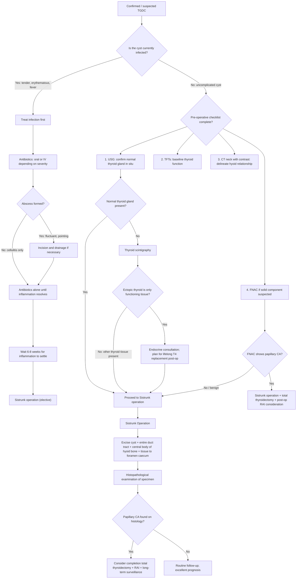

## Management of Thyroglossal Duct Cyst

### Management Principles — Thinking from First Principles

Before diving into specifics, let's understand **why** we manage TGDC the way we do:

1. **TGDC will not resolve spontaneously** — unlike some vascular anomalies (e.g., haemangiomas that involute), a thyroglossal duct cyst is an epithelium-lined cavity that persists and accumulates secretions. It will remain, recurrently swell, and eventually complicate.

2. **Complications are inevitable if left untreated** — ***recurrent infections, abscess formation, fistula development, and (rarely) malignant transformation to papillary thyroid carcinoma*** [3]. Each episode of infection makes subsequent surgery more difficult due to scarring and distortion of tissue planes.

3. **Simple aspiration or incision and drainage (I&D) is NOT definitive treatment** — the epithelial lining remains, the tract remains, and the cyst will **recur**. Worse, I&D of an infected cyst can create a **fistula** to the skin surface that would not otherwise have formed.

4. **The entire tract must be removed** — because the thyroglossal duct extends from the foramen caecum to the thyroid's final position, any remnant left behind can regenerate and cause recurrence. This is why simple "cystectomy" (removing just the cyst) has an **unacceptably high recurrence rate (~50%)** compared to the Sistrunk operation (~3–5%).

> ***Congenital lesions in general should be removed surgically at the appropriate age. These include cystic hygroma, branchial cyst or thyroglossal cyst. Otherwise these lesions may increase in size leading to functional disturbances later.*** [1]

---

### Management Algorithm

---

### Treatment Modalities

#### 1. The Sistrunk Operation — Definitive Treatment

This is the **gold standard** and the only procedure you need to know well for exams.

**What is it?**

The operation was first described by **Walter Ellis Sistrunk** in 1920. Let's break it down:

> ***Sistrunk operation: remove cyst + duct + whole tract (including body of hyoid bone up to foramen cecum) to prevent recurrence*** [3]

> ***Excision of cyst and tract which often passes through central portion of hyoid bone to base of tongue*** [2]

**Surgical steps — and why each matters:**

| Step | What Is Done | Why It Matters |
|---|---|---|
| **1. Skin incision** | Transverse incision over the cyst (usually at the level of the hyoid bone), following a skin crease for cosmesis | Transverse incisions in the neck heal better and are less visible than vertical ones (Langer's lines) |
| **2. Cyst dissection** | The cyst is dissected free from surrounding tissues (strap muscles, subcutaneous tissue) | The cyst is intimately embedded in the infrahyoid strap muscles; careful dissection avoids rupture (which increases recurrence risk) |
| ***3. Excision of the central body of the hyoid bone*** | ***The central portion (body) of the hyoid bone is transected and removed en bloc with the cyst*** | ***This is the single most important step.*** The thyroglossal duct passes through or is intimately embedded within the hyoid bone body. If you leave the hyoid intact, duct remnants within the bone can regenerate → recurrence. Simple cystectomy without hyoid resection has ~50% recurrence vs. ~3–5% with Sistrunk [3] |
| **4. Tract dissection to foramen caecum** | The tract (or core of tissue) is followed superiorly from the hyoid bone through the tongue base musculature up to the **foramen caecum** | The duct may branch or have multiple tracts above the hyoid. Taking a core of tissue (rather than trying to identify a single duct) up to the foramen caecum ensures all remnants are removed |
| **5. Closure of tongue base musculature** | The defect in the tongue base musculature (created by removal of the superior tract) is closed | Prevents dead space and reduces risk of seroma/haematoma |
| **6. Layered closure** | Strap muscles, platysma, and skin are closed in layers | Standard wound closure principles |

**Indications for Sistrunk operation:**

| Indication | Explanation |
|---|---|
| **All confirmed TGDC** — even if asymptomatic | Because TGDC will not resolve spontaneously, will inevitably become infected, and carries a small risk of malignant transformation. Elective excision prevents complications |
| **Recurrent TGDC after prior incomplete excision** | Prior simple cystectomy (without hyoid removal) has a high recurrence rate. Revision Sistrunk is required |
| **TGDC with fistula** | The fistula tract and any sinus openings must be excised en bloc with the cyst, duct, and hyoid |
| **TGDC with suspected malignancy** | Sistrunk operation provides the specimen for definitive histopathological diagnosis |

**Contraindications / Situations requiring modification:**

| Scenario | Management Approach |
|---|---|
| ***Actively infected cyst*** | ***Antibiotics first → Sistrunk operation once infection has settled (usually 6–8 weeks)*** [3]. Operating on an acutely infected cyst is technically difficult (inflamed tissue planes are obscured, tissue is friable) and risks incomplete excision, wound infection, and fistula formation |
| **No normal thyroid gland identified on imaging** | Do NOT proceed until the thyroid status is clarified. If the only functioning thyroid is within the cyst or is ectopic (e.g., lingual thyroid), removing the cyst will cause permanent hypothyroidism. The patient needs endocrine consultation and a plan for lifelong thyroxine replacement before surgery |
| **Papillary thyroid carcinoma diagnosed on FNAC** | Sistrunk operation is still performed (to remove the primary tumour), but **total thyroidectomy** should also be considered if the thyroid gland itself harbours disease. Post-operative radioactive iodine (RAI) ablation and long-term thyroglobulin surveillance may be needed |
| **Patient unfit for general anaesthesia** | Relative contraindication. In practice, Sistrunk is a relatively short procedure (~45–60 minutes) with low morbidity, so most patients tolerate it well. If the patient is truly unfit, conservative management with antibiotic treatment of infections and surveillance is an option (but not ideal) |

<Callout title="Why Remove the Hyoid Bone?" type="idea">
This is the most commonly asked exam question about TGDC management. The answer lies in embryology:

The thyroglossal duct passes **through or around the body of the hyoid bone** during descent. The duct can be embedded within the hyoid bone substance itself, not just running alongside it. Therefore:

- **Simple cystectomy alone** (removing just the cyst): Recurrence rate **~50%** — because duct remnants in the hyoid bone and above are left behind
- **Cystectomy + central hyoid bone excision** (Sistrunk): Recurrence rate **~3–5%** — because the key reservoir of duct remnants (the hyoid) is removed, and the tract is followed all the way to the foramen caecum

The Sistrunk operation reduced recurrence by an order of magnitude. This is why it became the standard of care over 100 years ago and remains so today.
</Callout>

---

#### 2. Management of Infected TGDC

***Infected cyst: antibiotics → Sistrunk operation*** [3]

**Why not operate on an acutely infected TGDC?**
- Inflamed tissues are **oedematous, friable, and vascular** → obscured tissue planes → difficulty identifying the tract and its relationship to the hyoid
- Higher risk of **incomplete excision** → higher recurrence
- Higher risk of **wound complications** (infection, dehiscence, fistula)
- Higher risk of **damage to surrounding structures**

**Step-by-step management of infected TGDC:**

| Step | Action | Rationale |
|---|---|---|
| **1. Antibiotics** | Empiric oral antibiotics for mild cellulitis (amoxicillin-clavulanate covers oral flora); IV antibiotics (e.g., IV co-amoxiclav or ceftriaxone + metronidazole) for severe infection / abscess | The cyst becomes seeded by oral flora (Streptococci, Staphylococci, anaerobes) — typically following URTI. Broad-spectrum coverage of oral/skin organisms is needed |
| **2. Incision and drainage (I&D) — only if frank abscess** | If the infected cyst is fluctuant and pointing (i.e., a true abscess has formed), needle aspiration or I&D may be needed for source control | Antibiotics alone cannot resolve an abscess (enclosed pus collection). However, I&D is a **temporising measure only** — it is NOT definitive treatment. Warn the patient that a fistula may form at the I&D site |
| **3. Allow inflammation to settle** | Wait **6–8 weeks** after infection resolution before definitive surgery | This allows tissue oedema to resolve, tissue planes to become identifiable again, and reduces operative risk |
| **4. Definitive Sistrunk operation** | Once the infection has fully settled, proceed with elective Sistrunk operation as described above | The definitive cure; removes the cyst, tract, and hyoid to prevent further recurrent infections |

<Callout title="Common Exam Scenario" type="error">
A child presents with a painful, red, swollen midline neck mass with fever following a URTI. The temptation is to excise it immediately. **Do not operate on an acutely infected TGDC.** Treat the infection first (antibiotics ± I&D if abscess), let it settle for 6–8 weeks, then perform an elective Sistrunk operation. Operating on an inflamed cyst leads to incomplete excision and high recurrence.
</Callout>

---

#### 3. Management of Papillary Thyroid Carcinoma Arising in TGDC

This is rare (~1–3% of TGDCs) but high-yield for exams.

**Key facts:**
- Almost always **papillary thyroid carcinoma** (reflecting that thyroid follicular tissue in the cyst wall undergoes the same mutations — e.g., BRAF V600E, RET/PTC rearrangements — as papillary CA in the thyroid gland itself)
- **Prognosis is excellent** — comparable to or better than intrathyroidal papillary CA, because TGDCs are usually small, well-encapsulated, and detected early

**Management approach:**

| Clinical Scenario | Surgical Management | Adjuvant Treatment |
|---|---|---|
| **Papillary CA confined to TGDC, normal thyroid gland, no suspicious thyroid nodules** | **Sistrunk operation alone** may be sufficient (controversial — some centres advocate total thyroidectomy in all cases) | RAI ablation considered if tumour > 1 cm, extrathyroidal extension, or lymph node metastasis |
| **Papillary CA in TGDC + suspicious nodule in thyroid gland** | **Sistrunk operation + total thyroidectomy** | RAI ablation + long-term TSH suppression with levothyroxine + thyroglobulin surveillance |
| **Papillary CA in TGDC + cervical lymph node metastasis** | **Sistrunk + total thyroidectomy + therapeutic neck dissection** | RAI ablation + levothyroxine + thyroglobulin surveillance |

> The rationale for considering total thyroidectomy even when the thyroid looks normal is that **papillary thyroid CA is frequently multifocal** — there may be occult disease in the thyroid gland. However, if the thyroid gland is carefully imaged (USG) and biopsied (FNAC) and is truly normal, Sistrunk alone may suffice. This remains a **case-by-case decision**.

---

#### 4. Management When No Normal Thyroid Gland Is Present

If pre-operative imaging reveals **no thyroid gland in the normal lower neck position**, the management changes significantly:

1. **Thyroid scintigraphy** to locate ectopic functioning thyroid tissue
2. **TFTs** to assess functional status
3. **Endocrine consultation** — if the ectopic thyroid (lingual thyroid or tissue within the TGDC) is the patient's only source of thyroid hormone:
   - Surgery can still proceed if the cyst is symptomatic or recurrently infected
   - But the patient **must be started on lifelong levothyroxine (T4) replacement** post-operatively (or even pre-operatively if already hypothyroid)
   - Some surgeons elect **not to excise** if the cyst is small and asymptomatic and it contains the only functioning thyroid tissue — instead opting for surveillance
4. **If lingual thyroid alone (no TGDC)**: This is a different entity. Management includes levothyroxine replacement ± surgical excision or radioactive iodine ablation if symptomatic (dysphagia, airway obstruction, haemorrhage)

---

#### 5. Conservative / Non-Surgical Management

**Is there a role for non-surgical management?**

In general, **no** — surgery (Sistrunk) is the standard of care for all diagnosed TGDCs. However, there are limited situations where non-surgical management may be considered:

| Scenario | Approach |
|---|---|
| **Patient/parents decline surgery** | Observation with serial USG; patient must be counselled about risk of infection, fistula, and (rare) malignant transformation |
| **Patient unfit for general anaesthesia** | Observation; treat infections with antibiotics as they arise |
| **Asymptomatic TGDC in a patient with no normal thyroid gland, and cyst contains only functioning thyroid tissue** | Case-by-case decision — observation with levothyroxine supplementation may be preferred over surgery |
| **Aspiration** | Needle aspiration of cyst fluid is a **temporising measure only**; the cyst will recur because the epithelial lining is not removed. **Not recommended as definitive treatment** |

<Callout title="Key Management Principle">
The Sistrunk operation is the only definitive treatment for TGDC. Simple cystectomy, aspiration, and I&D are all associated with unacceptably high recurrence rates. The central body of the hyoid bone must be excised as part of the operation.
</Callout>

---

### Outcomes and Recurrence

| Procedure | Recurrence Rate | Why |
|---|---|---|
| **Simple cystectomy (cyst only)** | **~50%** | Duct remnants within the hyoid bone and above are left behind → regeneration |
| ***Sistrunk operation (cyst + tract + hyoid body + tissue to foramen caecum)*** | ***~3–5%*** | Removes the entire tract and its key anatomical anchor (the hyoid body) |
| **Revision Sistrunk (for recurrence after prior Sistrunk)** | ~10–15% | Scarring from prior surgery distorts tissue planes; higher incomplete excision rate |

**Risk factors for recurrence after Sistrunk:**
- Prior infection (scarring distorts anatomy)
- Prior I&D or incomplete excision
- Cyst rupture during surgery (seeding of epithelial cells)
- Failure to remove a sufficient core of tissue from hyoid to foramen caecum
- Failure to excise the central body of the hyoid bone

---

### Post-Operative Care and Follow-Up

| Aspect | Details |
|---|---|
| **Immediate post-op** | Routine wound care; oral diet as tolerated (the tongue base is involved, so some patients may have mild dysphagia for a few days) |
| **Pain management** | Simple analgesia (paracetamol ± NSAIDs); rarely requires opioids |
| **Wound review** | At 1–2 weeks; check for wound infection, haematoma, seroma |
| **Histopathology review** | Essential — to confirm the diagnosis and rule out incidental papillary thyroid CA in the cyst wall |
| **Long-term follow-up** | If histology is benign: minimal follow-up needed (excellent prognosis). If papillary CA found: oncological follow-up (TFTs, thyroglobulin, USG neck, consider completion thyroidectomy + RAI) |

---

### Summary: Management Decision Matrix

| Clinical Scenario | Management |
|---|---|
| **Uncomplicated TGDC** | Pre-op workup (USG, TFT, CT) → elective Sistrunk operation |
| ***Infected TGDC*** | ***Antibiotics (± I&D if abscess) → wait 6–8 weeks → elective Sistrunk*** [3] |
| **Recurrent TGDC** | Revision Sistrunk operation (ensure hyoid body excised if not done previously) |
| **TGDC with fistula** | Sistrunk + excision of fistula tract en bloc |
| **TGDC with papillary CA** | Sistrunk ± total thyroidectomy ± RAI (depending on extent of disease) |
| **TGDC but no normal thyroid gland** | Endocrine consultation; thyroid scintigraphy; plan for T4 replacement; then Sistrunk if symptomatic |

---

<Callout title="High Yield Summary">

**Management of Thyroglossal Duct Cyst:**

1. **Definitive treatment**: Sistrunk operation — excision of cyst + entire duct tract + central body of hyoid bone + core of tissue up to foramen caecum. Recurrence rate ~3–5%.

2. **Why remove the hyoid body?** The duct passes through/is embedded in the hyoid bone. Leaving it behind → 50% recurrence (simple cystectomy) vs. 3–5% (Sistrunk).

3. **Infected TGDC**: Never operate acutely. Antibiotics first (± I&D for abscess) → wait 6–8 weeks → elective Sistrunk.

4. **Pre-operative essentials**: USG (confirm normal thyroid in situ), TFTs (baseline), CT with contrast (surgical planning / hyoid relationship).

5. **No normal thyroid on imaging**: Thyroid scintigraphy to locate ectopic thyroid. If it is the only functioning tissue → endocrine plan for T4 replacement before/after surgery.

6. **Papillary CA in TGDC (~1%)**: Sistrunk ± total thyroidectomy ± RAI depending on disease extent. Prognosis is excellent.

7. **Simple aspiration/I&D is NOT definitive** — the epithelial lining persists → cyst recurs.

</Callout>

---

<ActiveRecallQuiz
  title="Active Recall - Management of Thyroglossal Duct Cyst"
  items={[
    {
      question: "Describe the key steps of the Sistrunk operation and explain why each step is necessary.",
      markscheme: "Sistrunk operation: 1. Transverse skin incision over the cyst. 2. Dissect cyst free from surrounding tissues. 3. Excise the central body of the hyoid bone en bloc (because duct passes through/is embedded in hyoid — leaving it causes ~50% recurrence). 4. Follow the tract superiorly through tongue base musculature up to the foramen caecum, excising a core of tissue (to remove all duct remnants/branches). 5. Close tongue base musculature and layered wound closure. Recurrence rate: ~3-5% with Sistrunk vs ~50% with simple cystectomy."
    },
    {
      question: "A 6-year-old presents with an acutely infected thyroglossal duct cyst with a pointing abscess. Outline your management plan.",
      markscheme: "1. Do NOT operate acutely. 2. Start empiric antibiotics covering oral flora (e.g., amoxicillin-clavulanate). 3. If frank abscess with pointing/fluctuance: incision and drainage for source control (temporising only, not definitive). 4. Allow inflammation to settle for 6-8 weeks. 5. Elective Sistrunk operation once infection fully resolved. Rationale: operating on inflamed tissue leads to obscured planes, incomplete excision, higher recurrence, and wound complications."
    },
    {
      question: "Why does simple cystectomy have a ~50% recurrence rate compared to ~3-5% for the Sistrunk operation?",
      markscheme: "Simple cystectomy removes only the cyst itself, leaving behind: 1. Duct remnants embedded within the body of the hyoid bone. 2. Duct remnants extending superiorly from the hyoid to the foramen caecum. These residual epithelial remnants can regenerate and re-accumulate secretions, forming a recurrent cyst. The Sistrunk operation removes the cyst, the entire tract, the central hyoid body, and tissue up to the foramen caecum, eliminating all potential sites of recurrence."
    },
    {
      question: "How should you manage a thyroglossal duct cyst in which FNAC reveals papillary thyroid carcinoma?",
      markscheme: "1. Sistrunk operation to remove the primary tumour (cyst + tract + hyoid body + tissue to foramen caecum). 2. Assess the thyroid gland: USG + FNAC of any suspicious thyroid nodules. 3. If thyroid gland also involved or high-risk features present: total thyroidectomy. 4. Consider post-operative radioactive iodine ablation if tumour > 1 cm, extrathyroidal extension, or lymph node metastasis. 5. Long-term surveillance: TSH suppression with levothyroxine, serial thyroglobulin levels, neck USG. Prognosis is excellent."
    },
    {
      question: "What pre-operative investigation is absolutely essential before any surgical excision of a TGDC, and what are the consequences of omitting it?",
      markscheme: "Ultrasound of the neck to confirm the presence of a normally positioned thyroid gland. If omitted and the TGDC (or associated ectopic thyroid such as lingual thyroid) contains the patient's only functioning thyroid tissue, excision will render the patient permanently hypothyroid. If no normal thyroid is seen, thyroid scintigraphy should be performed and endocrine consultation obtained before proceeding."
    }
  ]}
/>

---

## References

[1] Lecture slides: GC 218. I have a swelling in the neck Neck mass (Notes).pdf
[2] Senior notes: felixlai.md (Thyroglossal duct cyst section)
[3] Senior notes: maxim.md (Thyroglossal cysts section)
