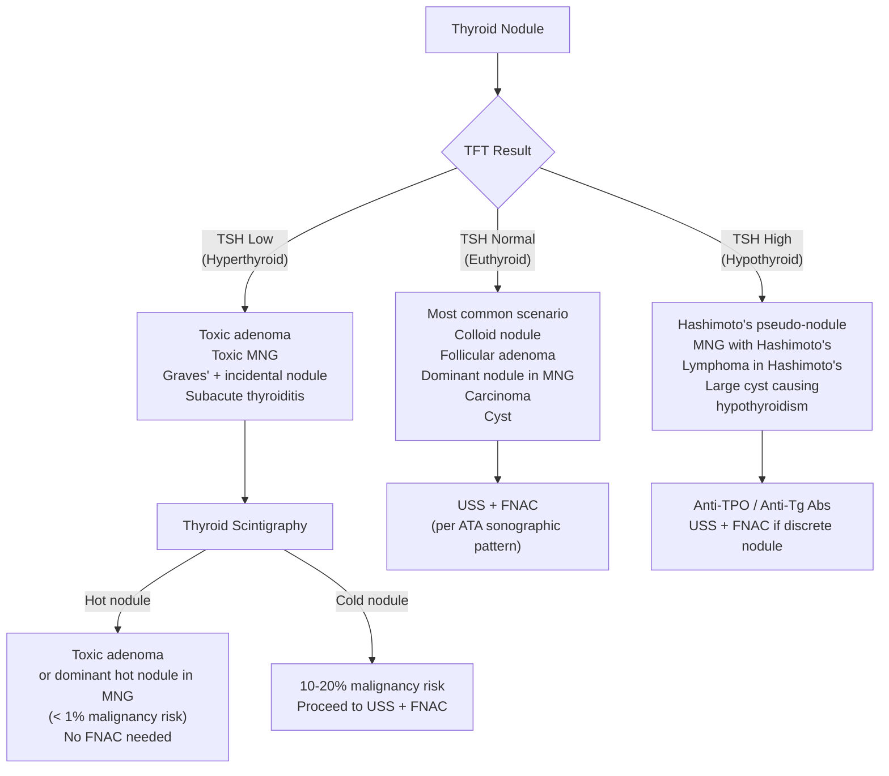

## Differential Diagnosis of a Thyroid Nodule

### Organising Framework

When a patient presents with a thyroid nodule (or, more broadly, an anterior neck lump), the differential diagnosis must be constructed **systematically**. The most efficient approach is to think in layers:

1. **Is the lump actually thyroid?** (vs non-thyroid anterior neck lump)
2. **If thyroid — what is the morphological pattern?** (solitary nodule vs multiple nodules vs diffuse enlargement)
3. **What is the thyroid functional status?** (hyperthyroid, euthyroid, hypothyroid) — because this dramatically narrows the differential
4. **What is the pathological nature?** (non-neoplastic vs benign neoplasm vs malignant)

The entire purpose of the USS + Bethesda FNAC workup is to navigate this differential and arrive at a tissue diagnosis — or at least a risk-stratified management plan.

---

### 1. Differential Diagnosis of an Anterior Neck Lump

Before you even think "thyroid nodule," you need to confirm the lump is thyroid in origin. The ***D/dx of an anterior neck lump*** [2][3][5]:

| Category | Differentials | How to distinguish |
|---|---|---|
| ***Thyroid enlargement*** | Solitary nodule, MNG, diffuse goitre, thyroid cyst, thyroid carcinoma | ***Moves with swallowing*** (thyroid is enclosed in pretracheal fascia, which is attached to the laryngeal skeleton) |
| ***Thyroglossal duct cyst*** | Midline developmental cyst (embryological remnant of thyroid descent from foramen caecum → tongue base to neck) | ***Moves with tongue protrusion*** (attached to foramen caecum via fibrous thyroglossal duct remnant) AND moves with swallowing |
| ***Lymphadenopathy*** | Reactive, infective (TB — common in HK), metastatic (NPC, thyroid CA, other H&N cancers), lymphoma | Does NOT move with swallowing; location often lateral to midline; may be multiple |
| ***Branchial cyst*** | Lateral developmental cyst (remnant of 2nd branchial cleft) — more common in paediatric/young adults | Anterior border of SCM, smooth, fluctuant; does NOT move with swallowing |
| ***Skin lumps*** | Sebaceous (epidermoid) cyst, lipoma, dermoid cyst | Superficial to strap muscles; moves with skin; NOT deep |
| ***Vascular*** | Carotid body tumour (paraganglioma at carotid bifurcation) | Pulsatile, mobile side-to-side but NOT vertically (Fontaine sign); at level of carotid bifurcation |
| ***Other*** | Laryngocoele, pharyngeal pouch, cervical rib | Rare; specific clinical/radiological features |

<Callout title="Exam Tip — Swallowing Test vs Tongue Protrusion Test" type="idea">
Both thyroid lumps AND thyroglossal duct cysts move with swallowing (both are attached to pretracheal structures). The **tongue protrusion test** differentiates them: only a thyroglossal duct cyst moves upward on tongue protrusion (because the duct remnant connects to the foramen caecum at the tongue base). A thyroid nodule does NOT move with tongue protrusion.
</Callout>

---

### 2. Differential Diagnosis of a Thyroid Nodule — By Morphological Pattern

Once you have confirmed the lump is thyroid, classify by what you feel on examination and see on USS [2][5]:

#### ***2A. Solitary Thyroid Nodule***

| Pathology | Explanation / Why it presents as a solitary nodule |
|---|---|
| ***Dominant nodule in MNG*** | The most common "solitary" nodule is actually a dominant nodule in a MNG that is not yet clinically apparent — USS often reveals additional smaller nodules. The remaining nodules are too small to palpate [5] |
| ***Cyst*** | True simple cyst (rare, < 2%), colloid nodule with cystic degeneration (common) — fluid accumulation within a follicle or from haemorrhage into a pre-existing nodule |
| ***Benign follicular adenoma*** | Clonal, encapsulated neoplasm of follicular cells; usually non-toxic (does not secrete excess thyroid hormone). Uncommonly, somatic gain-of-function TSH-receptor mutation → ***toxic adenoma*** (autonomous T3/T4 secretion → suppressed TSH → "hot" on scintigraphy) [5] |
| ***Carcinoma*** | Papillary (most common), follicular, medullary, anaplastic, or rarely metastatic. A solitary nodule is ***more likely to be malignant than a nodule in a multinodular gland*** [2][3] |

> ***Key point***: ***Around 10–15% of thyroid nodules are malignant*** [5]. The differential of a solitary nodule therefore **always** includes carcinoma until proven otherwise by FNAC.

#### ***2B. Multiple Thyroid Nodules***

| Pathology | Explanation |
|---|---|
| ***Multinodular goitre (MNG)*** | ***Hyperplastic/adenomatous nodules with varying degree of cystic degeneration*** — result of recurrent cycles of TSH-driven hyperplasia and involution [2][3]. Some nodules may become autonomous → ***toxic MNG (Plummer disease)*** [5] |
| ***Multiple cysts*** | Multiple colloid cysts or haemorrhagic cysts within a background of MNG |
| ***Multiple adenomas*** | Rare; multiple independent clonal neoplasms |
| ***Malignancy within MNG*** | A MNG does NOT protect against cancer — any suspicious nodule within a MNG must be biopsied. ***Malignancy risk is lower overall in multinodular glands, but USS must assess EACH nodule separately*** [5] |

#### ***2C. Diffuse Thyroid Enlargement (Goitre)***

| Thyroid status | Differential | Pathophysiology |
|---|---|---|
| ***Hypothyroid*** | ***Hashimoto's thyroiditis*** | Autoimmune destruction of follicular cells (anti-TPO, anti-Tg) → compensatory TSH-driven hypertrophy → diffuse firm goitre. Eventually progresses to atrophic gland with fibrosis |
| ***Euthyroid*** | ***Simple diffuse goitre*** (physiological: pregnancy, puberty; iodine deficiency; goitrogen exposure) | ↑ Thyroid hormone demand or ↓ synthesis → ↑ TSH → diffuse hyperplasia. Often self-limiting (e.g. puberty) |
| | Early MNG | Before individual nodules become clinically palpable |
| | ***Infiltrative disease*** (e.g. lymphoma) | Lymphoid proliferation expanding the gland diffusely |
| | Treated Graves' disease | After antithyroid drug/RAI → gland remains enlarged but function normalised |
| ***Hyperthyroid*** | ***Graves' disease*** | TSH-receptor stimulating antibodies (TRAb) → constitutive TSH-receptor activation → diffuse hyperplasia + excess T3/T4 secretion → diffuse, smooth, symmetrical goitre with bruit |
| ***Mixed / fluctuating*** | ***Destructive thyroiditis*** (subacute/de Quervain's, postpartum, painless) | Thyrotoxic phase (stored hormone release from damaged follicles) → hypothyroid phase (depleted stores + damaged cells) → recovery |

---

### 3. Differential Diagnosis — By Thyroid Functional Status

This is clinically the most useful framework because **TFT is the first investigation** and immediately narrows the differential [2][3]:

<Callout title="Why does scintigraphy come BEFORE USS/FNAC when TSH is low?">
If TSH is suppressed, the nodule might be a **hot (autonomously functioning) nodule**. Hot nodules are almost never malignant (< 1%) because the very features that make a cell malignant (de-differentiation) also make it lose the ability to trap iodine efficiently. If the nodule is confirmed "hot" on scintigraphy, you save the patient an unnecessary and uncomfortable FNAC. That's why the ***ATA algorithm directs you to scintigraphy first when TSH is low, and USS/FNAC first when TSH is normal or elevated*** [1][6].
</Callout>

---

### 4. Differential Diagnosis — By Pathological Nature

This is the framework that FNAC (Bethesda system) addresses directly. For completeness, let's lay it out with the pathophysiology of each entity [1][2][3][5]:

#### 4A. Non-Neoplastic Nodules (~70%) [1]

| Entity | Pathophysiology | Key features |
|---|---|---|
| ***Colloid nodule*** | Focal accumulation of colloid (thyroglobulin-rich material) within enlarged follicles — often within a MNG | USS: isoechoic/hyperechoic, partially cystic, "comet-tail" artefact (from colloid crystals). FNAC: abundant colloid, scant follicular cells → Bethesda II |
| ***Hyperplastic / adenomatous nodule*** | Focal hyperplasia of follicular cells driven by TSH or local growth factors; NOT a true neoplasm (polyclonal) | Part of the MNG spectrum. Can undergo cystic degeneration, haemorrhage, calcification |
| ***Haemorrhagic cyst*** | Bleeding into a pre-existing nodule (vessels within the nodule rupture) → sudden painful enlargement | History of acute onset pain; USS: complex cystic lesion with internal echoes (blood). FNAC: haemosiderin-laden macrophages, old blood |
| ***Simple cyst*** | True epithelial-lined cyst; very rare (< 2% of all thyroid nodules) | USS: purely anechoic, thin smooth wall, posterior acoustic enhancement. ***Purely cystic nodules are almost always benign (< 1% malignancy risk) → no FNAC needed*** [4] |
| ***Thyroiditis presenting as pseudo-nodule*** | Focal lymphocytic infiltration in Hashimoto's, or focal inflammation in subacute thyroiditis, mimicking a discrete nodule on palpation | USS: ill-defined hypoechoic area within diffusely heterogeneous gland. FNAC: lymphocytes and Hürthle cells (Hashimoto's); granulomatous inflammation with giant cells (de Quervain's) → Bethesda II |

#### 4B. Benign Neoplasms (~15%) [1]

| Entity | Pathophysiology | Key features |
|---|---|---|
| ***Follicular adenoma (non-toxic)*** | Monoclonal proliferation of follicular cells → encapsulated, well-circumscribed nodule. Benign by definition (no capsular/vascular invasion) | USS: well-circumscribed, complete halo, isoechoic. FNAC: microfollicular pattern, scant colloid → ***Bethesda IV ("follicular neoplasm")*** — **FNAC cannot distinguish from follicular carcinoma** [2][3] |
| ***Toxic adenoma*** | Somatic activating mutation of TSH-receptor or Gsα → autonomous cAMP activation → excess T3/T4 production independent of TSH | ***Suppressed TSH; "hot" on scintigraphy; < 1% malignancy risk; does NOT require FNAC*** [4]. Managed with hemithyroidectomy or RAI |
| ***Hürthle cell (oncocytic) adenoma*** | Variant with mitochondria-rich eosinophilic follicular cells. Benign but cannot be distinguished from Hürthle cell carcinoma on FNAC | ***Not amenable to RAI*** (Hürthle cells lose NIS expression → cannot trap iodine) → requires surgical treatment [5] |

#### 4C. Primary Thyroid Malignancies (~10%) [1][5]

| Type | % | Typical age | Pathophysiology / Mutations | Key distinguishing features |
|---|---|---|---|---|
| ***Papillary CA*** | ***85%*** | Young adult | ***RET/PTC rearrangements, BRAF V600E, RAS*** → well-differentiated follicular cell origin | ***Multifocal, non-encapsulated; Orphan-Annie nuclei; psammoma bodies (microcalcifications on USS); lymphatic spread → Level VI nodes*** |
| ***Follicular CA*** | ***10–15%*** | 40–60y | ***RAS, PAX8-PPARγ fusion*** → well-differentiated follicular cell origin | ***Focal, encapsulated; diagnosed ONLY by capsular/vascular invasion on histology; haematogenous spread → bone, lung*** |
| ***Medullary CA (MTC)*** | ***3–7%*** | Sporadic > 50y; Familial < 30y | ***RET proto-oncogene mutation (germline in MEN2, somatic in sporadic)*** → parafollicular C-cell origin | ***Amyloid deposits (Congo red); calcitonin (95%); CEA (80%); 25% genetic (MEN2A/2B); lymphatic spread*** |
| ***Anaplastic CA*** | ***1–3%*** | > 60y | ***TP53, TERT promoter mutations; often de-differentiation from prior papillary/follicular CA or longstanding goitre*** | ***Rapidly enlarging hard mass over weeks; undifferentiated small blue round cells; almost uniformly fatal (median survival < 6 months)*** |
| ***Primary thyroid lymphoma*** | Rare | Elderly with Hashimoto's | ***Chronic antigenic stimulation in Hashimoto's → MALT lymphoma → DLBCL transformation*** | Rapidly enlarging goitre; ***requires core biopsy*** (FNAC insufficient — need tissue architecture for lymphoma subtyping) [5] |

#### 4D. Metastatic Thyroid Disease (Rare) [5]

| Primary site | Notes |
|---|---|
| ***Renal cell carcinoma (most common metastasis to thyroid)*** | RCC is notoriously vascular and has a propensity for unusual metastatic sites; thyroid has rich blood supply → haematogenous seeding |
| Colorectal, lung, breast, uterine | Less common; usually in context of widely disseminated disease |

#### 4E. Miscellaneous (~5%) [1]

- ***Other thyroid malignancies***: SCC, poorly differentiated carcinoma
- ***Thyroiditis*** presenting as a nodule (overlap with 4A above)

---

### 5. The "Rapid-Fire" Differential Diagnosis Table — By Presentation Pattern

This table, adapted from the senior notes [5], is the high-yield exam summary:

| Presentation | Differentials (with thyroid status) |
|---|---|
| ***Solitary nodule*** | Dominant nodule in MNG; Cyst (true simple cyst, colloid nodule); Neoplastic: adenoma, ***toxic adenoma***, carcinoma |
| ***Multiple nodules*** | MNG (hyperplastic/adenomatous nodules with varying cystic degeneration), ***toxic MNG***; Multiple cysts; Neoplastic: multiple adenoma |
| ***Diffuse*** | Graves' disease; Physiological (pregnancy, puberty); Hashimoto's thyroiditis; De Quervain's/subacute thyroiditis |

> ***Around 10–15% of nodules are malignant*** [5].

---

### 6. How Each Investigation Narrows the Differential

Understanding which investigation eliminates which differential is the key to the workup:

| Investigation | What it tells you | Which differentials it separates |
|---|---|---|
| ***TFT (TSH)*** | Functional status | Toxic adenoma/toxic MNG (↓ TSH) vs euthyroid nodule vs Hashimoto's (↑ TSH). ***Determines whether scintigraphy or USS/FNAC comes next*** [1][6] |
| ***Thyroid scintigraphy*** | Functional status of individual nodule | ***Hot nodule (< 1% cancer → no FNAC) vs cold nodule (10–20% cancer → FNAC)*** [4][7] |
| ***USS*** | Morphology + risk stratification | Classifies nodule by ATA sonographic pattern → determines whether FNAC is needed and at what size threshold. Evaluates cervical LN (especially Level VI — not palpable clinically). Detects retrosternal extension [2][3] |
| ***FNAC (Bethesda)*** | Cytological nature | Separates benign (II) from malignant (VI), with intermediate categories (III–V) requiring further action. ***Cannot distinguish follicular adenoma from follicular carcinoma*** [2][3] |
| ***CT*** | Anatomical extent | ***Only for retrosternal goitre (USS cannot see mediastinum) or locally advanced CA (delineation of cervical fascia structures)*** [5]. ***PET has NO diagnostic role*** [5] |
| ***Calcitonin*** | C-cell origin | ***Elevated calcitonin → medullary thyroid carcinoma*** (95% sensitivity). Must be ordered if clinical suspicion of MTC or MEN2 [2][3] |
| ***Anti-TPO / Anti-Tg Abs*** | Autoimmune thyroiditis | Elevated in Hashimoto's → explains diffuse goitre or pseudo-nodule |
| ***Molecular testing*** | Genetic mutations | BRAF V600E (papillary CA), RAS, RET/PTC, PAX8-PPARγ → helps reclassify Bethesda III/IV nodules [2][3] |

---

### 7. Specific Clues — Matching History/Exam to Differential

This is the "clinical reasoning" layer. When you take a history and examine the patient, certain constellations of features point you strongly toward specific diagnoses:

| Clinical scenario | Most likely diagnosis | Why |
|---|---|---|
| Young woman + painless solitary nodule + euthyroid + microcalcifications on USS | ***Papillary thyroid carcinoma*** | Most common thyroid CA; young adults; psammoma bodies cause microcalcifications |
| Middle-aged woman + solitary nodule + cold on scintigraphy + USS shows encapsulated lesion with complete halo | ***Follicular neoplasm (adenoma or carcinoma — need excision to tell)*** | Encapsulated follicular lesion; cold because not functioning normally; requires histology for definitive dx |
| ***Elderly + rapidly enlarging hard neck mass over weeks + dysphagia/stridor/hoarseness*** | ***Anaplastic carcinoma*** | ***Aggressive, undifferentiated; rapid growth; locally invasive; median survival < 6 months*** [2][5] |
| Elderly + AF + large MNG | ***Toxic MNG (Plummer disease)*** | ***Classically AF + multinodular goitre in elderly*** [3]; autonomous nodules produce excess T3/T4 → AF |
| Solitary nodule + suppressed TSH + hot on scintigraphy | ***Toxic adenoma*** | Autonomous T3/T4 secretion; < 1% malignancy risk |
| ***Firm nodule + FHx of MEN2 + elevated calcitonin*** | ***Medullary thyroid carcinoma*** | ***Parafollicular C cells; 25% genetic (RET mutation); calcitonin is the tumour marker*** [5] |
| ***Painful thyroid swelling post-viral illness + fever + ↑ ESR + fluctuating thyroid function*** | ***Subacute (de Quervain's) thyroiditis*** | ***Viral-triggered granulomatous inflammation; thyrotoxic → hypothyroid → recovery*** |
| ***Rapidly enlarging goitre in elderly with known Hashimoto's*** | ***Primary thyroid lymphoma*** | ***Chronic Hashimoto's → MALT → DLBCL transformation; requires core biopsy (not FNAC)*** [5] |
| ***Sudden painful enlargement of a previously stable nodule*** | ***Haemorrhage into cyst/necrotic nodule*** | Vessel rupture within nodule → acute distension |
| ***History of NPC with prior neck radiotherapy + now thyroid nodule*** | ***Papillary carcinoma (radiation-induced)*** | Radiation causes RET/PTC rearrangements; ***ask about H&N cancer history, especially NPC in HK*** [3] |

---

### 8. Approach to Multiple Nodules — Special Considerations [5]

- ***Overall malignancy risk is lower in a multinodular gland*** than a solitary nodule — but it is NOT zero.
- ***USS must assess EACH nodule separately*** — each nodule gets its own risk stratification.
- ***FNAC strategy***:
  - ***If no suspicious nodules → FNA the largest nodule***
  - ***If any suspicious nodules → FNA ALL suspicious nodules***
- Do NOT assume that because the gland is multinodular, all nodules are benign. A classic mistake is to dismiss a suspicious-looking nodule within a MNG.

<Callout title="Common Exam Pitfall" type="error">
Students often assume that a multinodular goitre = benign. While the overall per-nodule risk is lower, each nodule must be assessed individually by USS. ***A suspicious nodule in a MNG gets the same FNAC workup as a solitary suspicious nodule.***
</Callout>

---

### 9. Things That Look Like Thyroid Nodules But Aren't

| Mimicker | How to distinguish |
|---|---|
| ***Parathyroid adenoma*** | Usually posterior to thyroid; associated with hypercalcaemia + ↑ PTH; USS may show a well-defined hypoechoic nodule posterior to the thyroid lobe; sestamibi scan is localising |
| ***Ectopic thyroid*** | Lingual thyroid (at foramen caecum), sublingual thyroid; scintigraphy shows uptake in ectopic location with absent/diminished uptake in normal thyroid bed |
| ***Thyroglossal duct cyst*** | Midline; moves with tongue protrusion; USS: well-defined anechoic/hypoechoic cystic lesion in midline anterior to strap muscles |
| ***Prominent pyramidal lobe*** | Normal variant; can be mistaken for isthmus nodule |

---

<Callout title="High Yield Summary — Differential Diagnosis">

1. ***Always confirm the lump is thyroid first*** (moves with swallowing, does NOT move with tongue protrusion).

2. ***D/dx of anterior neck lump***: thyroid enlargement, lymphadenopathy, thyroglossal duct cyst, branchial cyst, skin lumps, carotid body tumour.

3. ***Pathological breakdown of thyroid nodules***: Non-neoplastic (70%) > Benign adenoma (15%) > Well-differentiated carcinoma (10%) > Miscellaneous (5%).

4. ***TFT is the first branch point***: Low TSH → scintigraphy (hot = safe; cold = FNAC). Normal/high TSH → USS → FNAC per ATA pattern.

5. ***Solitary nodule is more likely malignant than multiple nodules*** — but each nodule in a MNG must be assessed individually.

6. ***FNAC cannot distinguish follicular adenoma from follicular carcinoma*** — requires surgical excision for histological assessment of capsule/vascular invasion.

7. ***Hot nodules are rarely malignant (< 1%)*** because malignant cells de-differentiate and lose iodine-trapping ability.

8. ***Thyroid lymphoma requires core biopsy*** — FNAC cannot provide tissue architecture needed for lymphoma subtyping.

9. ***In Hong Kong, always ask about NPC/prior head-and-neck radiotherapy*** — major risk factor for papillary CA.

10. ***Red flag differentials***: Rapidly enlarging mass in elderly → anaplastic CA or lymphoma; hard fixed nodule + hoarseness → invasive carcinoma; FHx MEN2 + elevated calcitonin → medullary CA.

</Callout>

---

<ActiveRecallQuiz
  title="Active Recall - Differential Diagnosis of Thyroid Nodule"
  items={[
    {
      question: "A 65-year-old woman presents with a rapidly enlarging hard neck mass over 6 weeks with dysphagia and hoarseness. What is the most likely diagnosis and why?",
      markscheme: "Anaplastic thyroid carcinoma. It is the most aggressive thyroid cancer, occurring in elderly (60-70y), with rapid growth over weeks, undifferentiated cells, locally invasive causing compressive symptoms and RLN palsy. Median survival less than 6 months. Must also consider primary thyroid lymphoma if history of Hashimoto's thyroiditis.",
    },
    {
      question: "A patient has a solitary thyroid nodule with suppressed TSH. The thyroid scintigraphy shows a hot nodule. What is the malignancy risk and does the patient need FNAC? Explain why.",
      markscheme: "Malignancy risk is less than 1%. FNAC is NOT required. Hot nodules have upregulated iodine trapping and organification (NIS expression), indicating well-differentiated autonomous function. Malignant cells tend to de-differentiate and lose NIS expression, so they appear cold not hot on scintigraphy.",
    },
    {
      question: "List the differential diagnosis of a solitary thyroid nodule and state which is the most common pathology.",
      markscheme: "Dominant nodule in MNG (most common), colloid cyst, true simple cyst, benign follicular adenoma (non-toxic or toxic adenoma), carcinoma (papillary most common, follicular, medullary, anaplastic). Non-neoplastic nodules account for approximately 70% of all thyroid nodules.",
    },
    {
      question: "A thyroid nodule is found in a patient with known Hashimoto's thyroiditis. What specific malignancy should you be concerned about and why? What special investigation does this malignancy require?",
      markscheme: "Primary thyroid lymphoma (usually MALT lymphoma or DLBCL). Chronic autoimmune antigenic stimulation in Hashimoto's can lead to MALT lymphoma transformation. Requires core biopsy (not FNAC) because tissue architecture is needed for lymphoma subtyping and grading.",
    },
    {
      question: "How do you approach FNAC in a multinodular goitre? Is the malignancy risk higher or lower than a solitary nodule?",
      markscheme: "Overall malignancy risk is lower in MNG than solitary nodule. USS must assess each nodule separately. If no suspicious nodules on USS, FNA the largest nodule. If any suspicious nodules present, FNA all suspicious nodules. Do not assume all nodules are benign just because the gland is multinodular.",
    },
    {
      question: "Name two clinical tests used to confirm a neck lump is thyroid in origin and explain the mechanism of each.",
      markscheme: "1. Swallowing test: thyroid is enclosed in pretracheal fascia attached to laryngeal skeleton, so thyroid lumps rise with swallowing when the larynx elevates. 2. Tongue protrusion test: thyroglossal duct cyst moves upward with tongue protrusion because it is connected to foramen caecum via thyroglossal duct remnant. Thyroid nodules do NOT move with tongue protrusion. Both tests together distinguish thyroid nodules from thyroglossal duct cysts.",
    },
  ]}
/>

---

## References

[1] Lecture slides: GC 177. A thyroid nodule benign thyroid nodules; thyroid cancer.pdf (p5, p9, p10, p12, p13)
[2] Senior notes: Ryan Ho Endocrine.pdf (p17–p20, p32, p38)
[3] Senior notes: Ryan Ho Fundamentals.pdf (p425–p428)
[4] Senior notes: felixlai.md (USS criteria, FNA indications, Bethesda classification, Scintigraphy sections)
[5] Senior notes: maxim.md (Differential diagnosis table, Bethesda classification, Approach to multiple nodules, Thyroid cancer overview)
[6] Lecture slides: Management of differentiated thyroid carcinoma.pdf (p2)
[7] Senior notes: Ryan Ho Diagnostic Radiology.pdf (p59)
