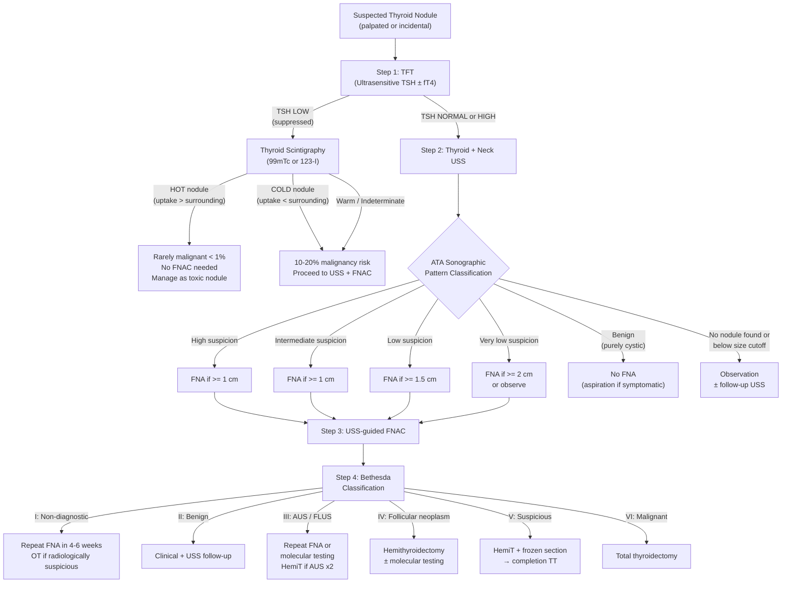

## Diagnostic Criteria, Algorithm & Investigation Modalities

### Preamble — What Are We Diagnosing?

Unlike many medical conditions that have neat "diagnostic criteria" (e.g. rheumatoid arthritis — ACR/EULAR criteria), a thyroid nodule is not a diagnosis in itself — it is a **finding** that triggers a **risk-stratification workup**. The "diagnosis" we seek is the answer to: ***Is this nodule benign or malignant?*** And if malignant, ***what type?***

There is no single test that gives a definitive answer for every nodule. Instead, the diagnostic process is a **sequential, branching algorithm** where each investigation narrows the differential and determines the next step. The three pillars are:

1. **TFT** (functional triage)
2. **USS** (morphological risk stratification)
3. **FNAC with Bethesda reporting** (cytological diagnosis)

Everything else is selective and complementary.

---

### 1. The Master Diagnostic Algorithm

This is the ***ATA 2015 guideline algorithm*** [1][6], the single most important framework to learn:

<Callout title="Why this sequence and not another?">
The algorithm is designed to be **cost-effective and minimally invasive**. TSH comes first because it is cheap, fast, and determines whether scintigraphy (an expensive nuclear medicine test) is even needed. USS comes before FNAC because it determines *whether* FNAC is indicated and *where* to target the needle. FNAC is the most invasive step in the initial workup and is reserved for nodules that meet specific size and morphology thresholds. This tiered approach avoids unnecessary procedures — which matters enormously given that > 85% of nodules are benign [1][2][3].
</Callout>

---

### 2. Investigation Modalities — Detailed Breakdown

#### 2A. Routine Investigations (For ALL Patients)

These three are ***routine for all patients*** with a thyroid nodule or goitre [1][2][3][5]:

| Investigation | Routine? |
|---|---|
| ***History + Physical examination*** | ***✓*** |
| ***Thyroid function test (TFT)*** | ***✓*** |
| ***USG thyroid ± FNAC*** | ***✓*** |

---

##### 2A-i. Thyroid Function Test (TFT)

**What to order**: ***Ultrasensitive TSH ± fT4*** [1][2][3]

**Why TSH first?**
- TSH has the ***shortest half-life*** and is the ***most sensitive indicator of thyroid functional status*** because of the log-linear relationship between TSH and free T4 — tiny changes in fT4 cause large swings in TSH [4].
- It is the **gatekeeper** that determines the next branch of the algorithm.

**Interpretation and next steps:**

| TSH result | Interpretation | Next step | Rationale |
|---|---|---|---|
| ***↓ TSH (suppressed)*** | Overt or subclinical hyperthyroidism → nodule may be autonomously functioning | ***Thyroid scintigraphy*** [1][2][4] | Need to determine if the nodule is "hot" (autonomous) — hot nodules are almost never malignant (< 1%) and do NOT need FNAC |
| ***Normal TSH*** | Euthyroid — most common scenario | ***USS → FNAC per ATA pattern*** [1][6] | Cannot be a hot nodule → proceed directly to morphological assessment |
| ***↑ TSH*** | Hypothyroidism (likely Hashimoto's or iodine deficiency) | ***USS → FNAC per ATA pattern + anti-TPO/Tg antibodies*** [2][3] | The nodule is definitely not hyperfunctioning. ↑ TSH also mildly ↑ thyroid cancer risk (chronic TSH stimulation is a growth promoter). Check for autoimmune thyroiditis |

<Callout title="Exam Pitfall" type="error">
***Scintigraphy is only indicated when TSH is LOW + nodule is present*** [2][3][4]. If TSH is normal or high, scintigraphy adds nothing — the nodule cannot be "hot" because TSH is not suppressed, so the result will not change management. Ordering scintigraphy with normal TSH wastes money and exposes the patient to radiation.
</Callout>

---

##### 2A-ii. Thyroid Ultrasound (USS)

***USG of thyroid: 7.5 or 10 MHz linear probe, B-mode*** [2][3]

**Why USS for everyone?**
- ***Readily available, non-invasive, no radiation, high sensitivity*** [2][3]
- Functions as an ***extension of the physical examination*** — can detect non-palpable nodules, characterise nodule morphology, and evaluate cervical lymph nodes (especially ***Level VI nodes which are too deep to palpate***) [2][5]
- ***Guides FNAC*** to the most suspicious area within a nodule [2][3]

**What USS is NOT:**
- ***NOT a screening test for healthy asymptomatic subjects*** — it is too sensitive (would detect clinically insignificant nodules in > 30% of the population), leading to unnecessary anxiety and procedures [2][3]
- ***NOT a confirmatory diagnostic test*** — it ***guides (not confirms) the diagnosis*** [2][3]. The definitive answer comes from cytology/histology.

**What to systematically assess on USS:**

| Domain | Features to evaluate | What each feature means |
|---|---|---|
| **The nodule itself** | | |
| — ***Echogenicity*** | Hypoechoic vs isoechoic vs hyperechoic | ***Hypoechoic = suspicious*** (less organised tissue reflects less sound back); hyperechoic/isoechoic = more reassuring [2][4] |
| — ***Composition*** | Solid vs cystic vs mixed | ***Solid = higher risk***; purely cystic = almost always benign (< 1%); spongiform (> 50% microcystic component) = very low risk [1][4] |
| — ***Shape*** | Taller than wide vs wider than tall | ***Taller than wide (AP > transverse) = suspicious*** — malignant nodules grow perpendicular to tissue planes (infiltrative growth pattern) [2][4][5] |
| — ***Margins*** | Smooth vs irregular/lobulated vs ill-defined | ***Irregular/microlobulated = suspicious*** — suggests infiltrative growth without a clear capsule [4] |
| — ***Calcifications*** | Microcalcifications vs macrocalcifications vs rim calcification | ***Microcalcifications (< 0.2 mm, punctate echogenic foci without shadowing) = highly suspicious*** — represent ***psammoma bodies of papillary CA*** [2][3][4]. Macrocalcifications and comet-tail artefacts are reassuring (represent degenerative changes/colloid crystals) |
| — ***Perilesional halo*** | Complete vs incomplete/absent | Complete halo = compressed normal thyroid tissue forming a pseudocapsule → ***reassuring*** (well-demarcated benign nodule). ***Absent/incomplete halo = suspicious*** (loss of demarcation suggests invasion) [2][3] |
| — ***Vascularity*** | Intranodular (central) vs peripheral | ***Intranodular/chaotic central vascularity = suspicious*** (neoangiogenesis within tumour). Peripheral vascularity is more typical of benign compressed rim [4][5] |
| — ***Local invasion*** | Into strap muscles, trachea, oesophagus, carotid | Direct evidence of malignancy — ***extrathyroidal extension (ETE)*** [2][4] |
| **Surrounding thyroid** | Other nodules, parenchymal abnormalities | Multiple nodules suggest MNG (slightly reassuring for per-nodule risk). Diffuse heterogeneous hypoechogenicity → Hashimoto's [2][3] |
| **Cervical lymph nodes** | See table below | Critical — Level VI nodes cannot be palpated; USS is the only way to detect them pre-operatively [2][5] |
| **Retrosternal extension** | Lower pole extending behind sternum | If present, will need CT for full assessment (USS cannot see mediastinum) [5] |

**Suspicious lymph node features on USS:**

| Feature | Why it suggests malignancy |
|---|---|
| ***Loss of fatty hilum*** | Normal LN has echogenic fatty hilum; metastatic tumour replaces it |
| ***Microcalcification within LN*** | Pathognomonic for papillary CA metastasis (psammoma bodies deposited in LN) |
| ***Round shape (L:S ratio → 1)*** | Normal LN = oval/elongated; metastatic expansion makes it round |
| ***Peripheral / chaotic vascularity*** | Normal hilar flow pattern destroyed by tumour neoangiogenesis |
| ***Hyperechoic*** | Thyroglobulin/colloid within metastatic thyroid tissue |
| ***Cystic change*** | Necrosis within large metastatic deposit |
| ***Size > 2 cm*** | Large nodes more likely pathological [4] |

> ***Mnemonic for suspicious USS features of the nodule: "SHIT CME"*** — ***Solid, Hypoechoic, Irregular margin, Taller-than-wide, Chaotic central vascularity, Microcalcifications, Extrathyroidal extension. Most important are solid & hypoechoic*** [5].

**High vs Low risk USS features — Summary Table [4]:**

| Feature | ***High risk of cancer*** | ***Low risk of cancer*** |
|---|---|---|
| ***Echogenicity*** | ***Hypoechoic*** | ***Hyperechoic*** |
| ***Calcifications*** | ***Microcalcifications*** | ***Large coarse calcifications*** |
| ***Shape*** | ***Taller than wide*** | ***Wider than tall*** |
| ***Margins*** | ***Irregular margins, incomplete halo*** | ***Spongiform appearance, comet-tail shadowing*** |
| ***Vascularity*** | ***Central (intranodular)*** | ***Peripheral*** |

---

##### 2A-iii. ATA 2015 Sonographic Pattern Classification — Determining FNAC Thresholds

The ATA 2015 guidelines [1][6] classify nodules into 5 sonographic patterns, each with a specific ***estimated malignancy risk*** and ***FNA size cutoff***:

| ***ATA Pattern*** | ***USS Description*** | ***Risk of Malignancy*** | ***FNA Size Cutoff*** |
|---|---|---|---|
| ***High suspicion*** | ***Solid hypoechoic nodule (or solid hypoechoic component of partially cystic nodule) + ≥ 1 of: microcalcifications, rim calcification with extrusive soft tissue, taller-than-wide, irregular margins, extrathyroidal extension*** | ***> 70–90%*** | ***≥ 1 cm*** |
| ***Intermediate suspicion*** | ***Hypoechoic solid nodule with smooth margins WITHOUT microcalcifications, taller-than-wide, or ETE*** | ***10–20%*** | ***≥ 1 cm*** |
| ***Low suspicion*** | ***Isoechoic or hyperechoic solid nodule, or partially cystic with eccentric solid area WITHOUT suspicious features*** | ***5–10%*** | ***≥ 1.5 cm*** |
| ***Very low suspicion*** | ***Spongiform or partially cystic without any suspicious features*** | ***< 3%*** | ***≥ 2 cm (or observe)*** |
| ***Benign*** | ***Purely cystic nodule (no solid component)*** | ***< 1%*** | ***No FNA*** |

<Callout title="Why these specific size cutoffs?">
The size thresholds exist because tiny nodules — even if they look suspicious — have a very low absolute risk of clinically significant cancer. A 5 mm papillary microcarcinoma, for example, is almost universally indolent and may never cause harm. The cutoffs balance the risk of missing a clinically significant cancer against the risk of over-investigating incidental findings. As suspicion decreases, the size threshold increases because you need a larger nodule to justify the invasiveness of FNAC.
</Callout>

---

##### 2A-iv. Fine Needle Aspiration Cytology (FNAC)

***FNAC is the single most important investigation for a thyroid nodule when TSH is not suppressed*** [2][3].

**The name tells you the technique**: "Fine needle" = 23–27G needle (thin, minimises bleeding); "aspiration" = suction applied to collect cells; "cytology" = examination of individual cells (not tissue architecture).

**Technical details:**
- ***Process: trans-isthmic approach ± USG guidance*** [2][3]
  - The needle passes through the isthmus into the target nodule — this provides a stable trajectory and avoids lateral neck structures (carotid, jugular)
  - ***USG guidance advantages***: Confirms nodule presence, targets the most suspicious region (e.g. solid component of a mixed cystic-solid nodule), avoids cystic areas (which yield non-diagnostic aspirates) [2][3]
- ***Accuracy: 90–95%*** [2][3] — can avoid unnecessary diagnostic thyroidectomy
- ***Not a core needle biopsy*** — ***core needle biopsy is NOT performed*** on the thyroid because the gland is extremely vascular → risk of massive bleeding. FNAC is sufficient because it is very accurate at identifying thyroid cancer types [4]

**Why FNAC cannot distinguish follicular adenoma from follicular carcinoma:**
- Follicular carcinoma is defined by ***capsular or vascular invasion*** — a histological diagnosis requiring assessment of the tumour–capsule interface on tissue sections [2][3]
- FNAC aspirates individual cells, not tissue architecture → cannot see the capsule → cannot assess invasion
- This is why ***Bethesda IV ("follicular neoplasm") requires surgical excision (hemithyroidectomy)*** for definitive diagnosis [1][2][3]

**Indications for FNAC [1][2][3][4]:**

| Indication | Explanation |
|---|---|
| ***Nodule meeting ATA sonographic criteria*** (see table above) | Risk-stratified approach |
| ***Hypofunctioning ("cold") nodule on scintigraphy*** | 10–20% malignancy risk [4] |
| ***Dominant or atypical nodule in MNG*** | Cannot assume all nodules in MNG are benign [4][5] |
| ***Nodules associated with abnormal cervical LN*** | Suspicious for metastatic thyroid cancer [4] |
| ***Complex or recurrent cystic nodules*** | May harbour papillary CA in the solid component [4] |
| ***Symptomatic / large cysts*** | Therapeutic aspiration (decompression) [2][3] |

**When you can bypass FNAC and proceed directly to surgery [2][3]:**
- ***Nodule > 4 cm*** — very large nodules have higher malignancy risk and are usually excised regardless of cytology
- ***Gross extrathyroidal invasion on imaging***
- ***Cervical LN metastasis confirmed*** (e.g. by FNA of LN with thyroglobulin washout)

**FNAC complications**: Pain, bleeding (usually self-limiting), false negative (~3%), non-diagnostic aspirate [5]

---

##### 2A-v. Bethesda System for Reporting Thyroid Cytopathology

***Standard reporting system for thyroid FNAC*** [1][2][3][4][5]. The following table integrates information from both the lecture slides and senior notes:

| ***Bethesda Category*** | ***Diagnostic Category*** | ***Risk of Ca (%)*** | ***Usual Management*** | ***Key Cytological Features*** |
|---|---|---|---|---|
| ***I*** | ***Non-diagnostic / Unsatisfactory*** | ***1–4*** | ***Repeat FNA; or OT if radiologically suspicious*** [1][2][3] | < 6 groups of 10 well-preserved follicular cells; excessive blood; cyst fluid only |
| ***II*** | ***Benign*** | ***0–3*** | ***Clinical follow-up*** [1][2][3] | Colloid nodule (abundant colloid, benign follicular cells); Hashimoto's (lymphocytes + Hürthle cells); granulomatous thyroiditis |
| ***III*** | ***AUS or FLUS*** | ***5–15*** | ***Repeat FNA; molecular testing; HemiT if AUS ×2*** [1][2][3] | Atypical cells that don't meet criteria for categories IV–VI; nuclear atypia or architectural atypia of uncertain significance |
| ***IV*** | ***Follicular neoplasm / Hürthle cell neoplasm*** | ***15–30*** | ***Hemithyroidectomy; ± molecular testing*** [1][2][3][6] | Microfollicular pattern, scant colloid, cellular specimen; ***CANNOT distinguish adenoma from carcinoma*** |
| ***V*** | ***Suspicious for malignancy*** | ***60–75*** | ***HemiT + frozen section → completion TT*** [1][2][3] | Features suggestive but not definitive: e.g. some but not all papillary CA nuclear features |
| ***VI*** | ***Malignant*** | ***97–99*** | ***Total thyroidectomy*** [1][2][3] | Definitive papillary CA (Orphan-Annie nuclei, nuclear grooves, pseudoinclusions, psammoma bodies); medullary CA (amyloid + calcitonin); anaplastic CA (pleomorphic bizarre cells) |

**Deep dive — Category-specific management nuances:**

**Bethesda I (Non-diagnostic):**
- Repeat FNA in ***4–6 weeks*** (allows haematoma to resolve) [5]
- ***If still non-diagnostic after repeat***: Decision depends on risk profile [5]:
  - ***Low clinical risk → observation***
  - ***High clinical risk → hemithyroidectomy***
  - ***High risk features***: Suspicious USS features; FHx of thyroid CA / prior neck radiation; voice hoarseness / hard-irregular-fixed mass / cervical LN positive; growing nodule [5]

**Bethesda IV (Follicular neoplasm) — Frozen section:**
- ***Frozen section is NOT routinely performed*** during hemithyroidectomy for follicular neoplasm [2][3][6]
- ***Diagnostic information in only 13% of cases***
- ***Modifies surgical procedure in only 3.3%***
- ***Misguided intervention in 5%*** (i.e. leads to unnecessary total thyroidectomy)
- ***The correct approach***: Wait for final histology after lobectomy [2][3][6]
  - If encapsulated and ***minimally invasive (< 5 vessel invasion + no wide invasion)*** → ***lobectomy is curative***
  - If widely invasive → ***completion total thyroidectomy + RAI ablation*** (due to ↑ risk of distant metastases) [2][3]

<Callout title="Must Know — Frozen Section in FN" type="error">
***Frozen section is NOT helpful in hemithyroidectomy for follicular neoplasm (Bethesda IV).*** This is directly stated in both the lecture slides and senior notes [2][3][6]. One should wait for the final histology report. Frozen section IS used in Bethesda V (suspicious for malignancy) to determine whether to proceed to completion total thyroidectomy intraoperatively.
</Callout>

**Bethesda III (AUS/FLUS) — The grey zone:**
- ***"Atypia" here is a morphological description, NOT a premalignant lesion*** [5] — the cytopathologist is saying "these cells look a bit off, but I can't commit to a more specific diagnosis"
- ***Repeat FNA*** reclassifies the majority to Bethesda II (benign) [2][3]
- ***Molecular testing*** (ThyroSeq, Afirma GSC) can help — currently expensive, no universal standards, not readily available [2][3]

---

#### 2B. Selective Investigations (NOT Routine)

| Investigation | ***Routine?*** | ***Indication*** | ***What it tells you*** |
|---|---|---|---|
| ***Thyroid scintigraphy*** | ***✗*** | ***Only if TSH is LOW + nodule present*** [1][2][3] | Functional status of individual nodules (hot vs cold) |
| ***CT scan*** | ***✗*** | ***Only for: (1) Retrosternal goitre, (2) Locally advanced thyroid cancer*** [5] | Anatomical extent, relationship to great vessels, tracheal compression, surgical planning |
| ***PET scan*** | ***✗*** | ***No diagnostic role at all*** [5] | — |
| ***CXR*** | ***✗*** | Retrosternal goitre, thoracic inlet assessment | Tracheal deviation, mediastinal mass |
| ***Flow-volume loop (spirometry)*** | ***✗*** | Suspected upper airway obstruction from large goitre | UAO results in a ***blunted flow-volume loop*** (plateau on both inspiratory and expiratory limbs → fixed obstruction; or variable if extrathoracic) [2][3] |
| ***Direct laryngoscopy*** | ***✗*** | Pre-operative assessment; suspected RLN palsy (hoarseness) | Documents vocal cord mobility — essential before thyroidectomy [2][3] |
| ***OGD*** | ***✗*** | Suspected oesophageal involvement | Direct visualisation of oesophageal compression/invasion [2][3] |

---

##### 2B-i. Thyroid Scintigraphy — Detailed

***Radio-isotope scintigraphy (¹²³I or ⁹⁹ᵐTc)*** [1][7]

**Principle:**
- ***Radioactive iodine is handled in the same manner as normal iodine*** by the thyroid [7]
- **Radiopharmaceuticals**:
  - ***⁹⁹ᵐTc-pertechnetate***: Taken up by the sodium-iodide symporter (NIS) due to similar ionic size to iodide — ***iodine trapping only*** (not organified) [7]
  - ***¹²³I or ¹³¹I***: ***Trapping + organification*** — more physiological but more expensive and involves higher radiation [7]
- Level of uptake reflects metabolic activity → detected by gamma camera
- ***Images obtained at anterior, left anterior oblique (LAO), and right anterior oblique (RAO)*** views [7]

**Clinical indications [1][7]:**
- ***Assessment of thyroid nodules, goitre, thyroid cancer***
- ***Evaluation of ectopic thyroid***
- ***Diagnosis of causes of thyrotoxicosis or hypothyroidism***
- ***Post-surgery/radiotherapy assessment of residual thyroid gland***

**Interpretation:**

| Finding | Definition | Malignancy risk | Next step |
|---|---|---|---|
| ***Hot nodule*** | ***Uptake > surrounding thyroid tissue*** | ***< 1%*** | ***No FNAC needed; manage as toxic nodule*** [4] |
| ***Cold nodule*** | ***Uptake < surrounding thyroid tissue*** | ***10–20%*** | ***Requires FNAC (if sonographic criteria met)*** [4] |
| Warm / Indeterminate | Uptake ≈ surrounding tissue | Intermediate | FNAC if USS suspicious |

**Classic scintigraphy patterns** [1]:

| Condition | Scintigraphy appearance | Why |
|---|---|---|
| ***Graves' disease*** | ***Diffuse, homogeneous, increased uptake throughout the gland*** | TRAb stimulates all follicular cells equally → global ↑ iodine trapping |
| ***Toxic adenoma*** | ***Single hot focus with suppressed uptake in rest of gland*** | Autonomous nodule produces excess T4 → ↓ TSH → rest of gland suppressed |
| ***Toxic multinodular goitre*** | ***Multiple hot and cold areas, patchy uptake*** | Heterogeneous autonomous function across different nodules |
| ***Cold nodule*** | ***Photopenic defect (reduced/absent uptake in nodule area)*** | Non-functioning tissue (could be benign or malignant) |

**Limitations [3]:**
- ***Radiation exposure, expensive, low specificity and sensitivity for malignancy*** [1]
- Most cold nodules are benign (only 10–20% are cancer) → low positive predictive value
- Cannot characterise nodules < 1 cm well (limited spatial resolution)
- ***Should NOT be used if TSH is normal*** — most cold nodules are benign, and the result would only lead to unnecessary biopsies [3]

---

##### 2B-ii. CT / MRI

***Not routine — only for specific indications*** [2][3][5]:

| Indication | Why CT/MRI is needed |
|---|---|
| ***Retrosternal goitre*** | ***1. Cannot be visualised by USS*** (ultrasound cannot penetrate sternum/mediastinum); ***2. Surgical planning*** (need to know extent, relationship to great vessels); ***3. Retrosternal goitre may be malignant*** [5] |
| ***Locally advanced thyroid cancer*** | ***Important structures within cervical fascia*** (carotid, jugular, trachea, oesophagus, prevertebral fascia) need ***better delineation*** for surgical planning [5] |

<Callout title="Iodinated contrast warning" type="error">
***The use of iodinated CT contrast may affect post-operative radioactive iodine (RAI) body scan and therapy*** for 6–8 weeks because the iodine load saturates the thyroid's iodine-trapping capacity [2]. If thyroid cancer is suspected and RAI is anticipated, consider non-contrast CT or MRI instead.
</Callout>

---

##### 2B-iii. Additional Blood Tests (Selective)

| Test | Indication | Interpretation |
|---|---|---|
| ***ESR, anti-thyroid antibodies (anti-TPO, anti-Tg)*** | ***Suspected thyroiditis*** (Hashimoto's, de Quervain's) [2][3] | ↑ ESR in subacute thyroiditis; ↑ anti-TPO/Tg in Hashimoto's |
| ***Calcitonin*** | ***Hx or clinical suspicion of medullary thyroid carcinoma or MEN2*** [2][3][5] | ***95% of MTC produces calcitonin***; if > 500 pg/mL → likely metastatic → CT T+A+P + bone scan [5] |
| ***CEA*** | Suspected MTC (baseline tumour marker) [5] | ***80% of MTC produces CEA***; used alongside calcitonin for follow-up |
| ***Thyroglobulin (Tg)*** | ***Baseline tumour marker for differentiated thyroid carcinoma*** (papillary/follicular) [4][5] | Used post-thyroidectomy for recurrence surveillance. NOT useful for initial diagnosis (elevated in many benign conditions) |
| ***Anti-thyroglobulin (anti-Tg) antibodies*** | ***Must be measured whenever thyroglobulin is measured*** [4] | Anti-Tg antibodies interfere with Tg assays → can cause falsely low Tg readings. If anti-Tg is positive, Tg cannot be reliably used as a tumour marker |
| ***Ca²⁺, PO₄³⁻*** | Pre-operative parathyroid function assessment [4][5] | Baseline for detecting post-operative hypoparathyroidism |
| ***24h urine metanephrines*** | ***Rule out phaeochromocytoma in suspected MEN2*** [5] | Must exclude phaeo BEFORE thyroidectomy (risk of hypertensive crisis under anaesthesia) |
| ***RET proto-oncogene mutation*** | ***All patients with MTC*** [4][5] | Identifies familial MTC/MEN2 → screen relatives → prophylactic thyroidectomy |
| ***Molecular testing (Afirma, ThyroSeq)*** | Bethesda III/IV — to help reclassify indeterminate cytology [2][3] | Currently ***expensive, no universal standards, not readily available*** [2][3] |

---

##### 2B-iv. Endoscopy (Selective)

| Test | Indication | What it shows |
|---|---|---|
| ***Direct laryngoscopy*** | ***Pre-operative vocal cord assessment; suspected RLN palsy*** [2][3] | Documents vocal cord mobility. Essential before any thyroidectomy — a pre-existing vocal cord palsy has major implications for surgical approach (contralateral RLN must be preserved at all costs) |
| ***OGD*** | Suspected oesophageal involvement by locally advanced cancer [2][3] | Direct visualisation of mucosal invasion |

---

##### 2B-v. Thyroidectomy as Diagnostic + Therapeutic

***Thyroidectomy can be both diagnostic AND therapeutic*** [2][3]:

- **Diagnostic**: Bethesda IV (follicular neoplasm) → hemithyroidectomy → final histology determines whether it is adenoma or carcinoma
- **Therapeutic**: Bethesda V–VI → definitive surgical treatment of confirmed/suspected malignancy

---

### 3. Pre-operative Workup for Medullary Thyroid Carcinoma (MTC)

If MTC is suspected or confirmed, a specific additional workup is required [5]:

1. ***Rule out familial disease (25% of MTC is familial)***:
   - Family history
   - ***24h urine metanephrines*** (to exclude phaeochromocytoma — MUST be done before surgery!)
   - ***Ca²⁺ and PTH*** (to exclude parathyroid hyperplasia in MEN2A)
2. ***Tumour markers***:
   - ***Calcitonin*** (if > 500 → suspect metastatic disease → staging CT T+A+P + bone scan)
   - ***CEA***
3. ***RET proto-oncogene mutation analysis***
4. If calcitonin > 500: ***CT thorax + abdomen + pelvis and bone scan*** for metastatic workup [5]

<Callout title="Why exclude phaeochromocytoma BEFORE thyroidectomy in MEN2?">
A patient with an undiagnosed phaeochromocytoma can develop a lethal **hypertensive crisis** during anaesthesia (catecholamine surge triggered by intubation, surgical manipulation, or stress). If 24h urine metanephrines are elevated, the phaeo must be resected FIRST (or at least alpha-blocked with phenoxybenzamine before surgery).
</Callout>

---

### 4. Staging Investigations (If Malignancy Confirmed)

Once cytology or histology confirms thyroid cancer:

| Investigation | Purpose |
|---|---|
| ***CT neck and chest*** | Staging for locally advanced disease / bulky LN; lung metastases (especially follicular CA) [5] |
| ***Bone scan*** | If MTC with calcitonin > 500; or follicular CA with bone pain |
| ***Whole-body RAI scan*** | Post-thyroidectomy for differentiated CA (papillary/follicular) — identifies residual/metastatic tissue that takes up iodine |

**TNM Staging (AJCC 8th edition) [5]:**

| Stage | Description |
|---|---|
| **T staging** | T1a: ≤ 1 cm; T1b: 1–2 cm; T2: 2–4 cm; T3: > 4 cm limited to thyroid; T4: extrathyroidal extension |
| **N staging** | ***N1a: Level VI/VII nodes***; ***N1b: Level I–V nodes*** |
| **Age-dependent staging for differentiated CA** | ***Age < 55: Stage I if M0, Stage II if M1 — never Stage III/IV*** (because prognosis is excellent in young patients regardless of T/N); ***Age ≥ 55: Up to Stage IVB*** |
| **Anaplastic CA** | ***Stage IV automatically*** (regardless of T, N, or M — because prognosis is uniformly dismal) |

---

### 5. Putting It All Together — The "Flow" of Investigations

The key insight is that investigations are ordered **sequentially, not simultaneously**. Each test answers a specific question that determines the next test:

| Step | Investigation | Question it answers | Determines |
|---|---|---|---|
| 1 | ***TFT (TSH)*** | Is the nodule functioning? | Whether to do scintigraphy (TSH low) or USS (TSH normal/high) |
| 2a | ***Scintigraphy*** (if TSH low) | Is the nodule hot or cold? | Whether FNAC is needed (cold → yes; hot → no) |
| 2b | ***USS*** (if TSH normal/high, or cold nodule) | What does the nodule look like? | ATA pattern → whether FNAC is needed and at what size threshold |
| 3 | ***FNAC*** (if USS criteria met) | What are the cells? | Bethesda category → management (observe / repeat / surgery) |
| 4 | ***Selective bloods, CT, laryngoscopy*** | Staging, pre-op assessment, specific cancer workup | Extent of surgery, need for RAI, MEN2 screening |

---

<Callout title="High Yield Summary — Diagnostic Workup">

1. ***Routine for ALL patients***: History + P/E, TFT (ultrasensitive TSH), USS thyroid/neck ± FNAC.

2. ***TSH is the gatekeeper***: Low → scintigraphy first; Normal/High → USS + FNAC per ATA pattern.

3. ***USS features suspicious for malignancy ("SHIT CME")***: Solid, Hypoechoic (most important pair), Irregular, Taller-than-wide, Chaotic central vascularity, Microcalcifications, Extrathyroidal extension.

4. ***ATA sonographic patterns with FNAC thresholds***: High/Intermediate ≥ 1 cm; Low ≥ 1.5 cm; Very low ≥ 2 cm; Benign (purely cystic) → no FNA.

5. ***Bethesda classification***: I–VI with escalating malignancy risk (1–4% → 97–99%) and management (repeat FNA → total thyroidectomy).

6. ***FNAC is the single most important Ix*** when TSH is not suppressed; accuracy 90–95%; cannot distinguish follicular adenoma from carcinoma.

7. ***Frozen section NOT helpful for Bethesda IV (follicular neoplasm)*** — wait for final histology.

8. ***Scintigraphy***: ONLY when TSH low + nodule. Hot = safe (< 1% cancer). Cold = needs FNAC (10–20% cancer).

9. ***CT only for retrosternal goitre or locally advanced cancer. PET has NO diagnostic role.***

10. ***For suspected MTC***: Calcitonin, CEA, 24h urine metanephrines (rule out phaeo before surgery!), Ca/PTH, RET mutation analysis.

</Callout>

---

<ActiveRecallQuiz
  title="Active Recall - Diagnostic Criteria and Algorithm"
  items={[
    {
      question: "A patient has a 1.2 cm thyroid nodule that is isoechoic, solid, with smooth margins and no microcalcifications on USS. TSH is normal. What is the ATA sonographic pattern, and does this nodule meet criteria for FNAC?",
      markscheme: "Low suspicion pattern (isoechoic solid nodule without suspicious features). FNA threshold is 1.5 cm or more. At 1.2 cm this does NOT meet the size cutoff for FNAC. Management is observation with follow-up USS.",
    },
    {
      question: "List the three routine investigations for ALL patients presenting with a thyroid nodule, and explain why each is performed.",
      markscheme: "1. TFT (ultrasensitive TSH): determines functional status and whether scintigraphy or USS/FNAC pathway is needed. 2. Thyroid/neck USS: morphological risk stratification of nodule, assessment of cervical LN (especially Level VI), guides FNAC. 3. FNAC (if indicated by USS criteria): cytological diagnosis, reported using Bethesda classification, accuracy 90-95%.",
    },
    {
      question: "State two indications for CT scan in the workup of a thyroid nodule and explain why USS is insufficient in these scenarios.",
      markscheme: "1. Retrosternal goitre: USS cannot visualise the mediastinum (sound waves cannot penetrate bone/air), CT needed for surgical planning and to assess for malignancy. 2. Locally advanced thyroid cancer: CT provides better delineation of important structures within cervical fascia (carotid, trachea, oesophagus) for surgical planning. Note: PET scan has no diagnostic role.",
    },
    {
      question: "Why is thyroid scintigraphy NOT indicated when TSH is normal? Explain the physiological reasoning.",
      markscheme: "If TSH is normal, the nodule is not autonomously functioning (if it were, TSH would be suppressed by negative feedback from excess T3/T4). Therefore it cannot be a hot nodule. Scintigraphy would show a cold or indeterminate nodule, but most cold nodules are benign (only 10-20% malignant), so the result would not change the next step (which is USS plus FNAC regardless). It wastes resources and exposes the patient to unnecessary radiation.",
    },
    {
      question: "A patient with confirmed medullary thyroid carcinoma is being prepared for surgery. What specific investigations must be performed before thyroidectomy and why?",
      markscheme: "1. 24h urine metanephrines: to exclude phaeochromocytoma (present in MEN2A/2B). Must be excluded before surgery because undiagnosed phaeo can cause lethal hypertensive crisis under anaesthesia. 2. Serum calcium and PTH: to exclude parathyroid hyperplasia in MEN2A. 3. Calcitonin level: if more than 500, suspect metastatic disease and perform staging CT TAP plus bone scan. 4. CEA: baseline tumour marker. 5. RET proto-oncogene mutation analysis: to identify familial MTC/MEN2 and screen relatives for prophylactic thyroidectomy.",
    },
    {
      question: "Explain why the Bethesda system classifies follicular neoplasm as Category IV with a separate management pathway from Categories V and VI.",
      markscheme: "Follicular neoplasm on FNAC shows microfollicular pattern with scant colloid, but FNAC cannot distinguish follicular adenoma from follicular carcinoma because the diagnosis of carcinoma requires histological demonstration of capsular or vascular invasion (assessment of tumour-capsule interface). Therefore Category IV requires hemithyroidectomy for definitive histological diagnosis, rather than direct total thyroidectomy (which would be overtreatment if benign). Frozen section is not helpful (diagnostic info in only 13%, misguided intervention in 5%). Wait for final histology.",
    },
  ]}
/>

---

## References

[1] Lecture slides: GC 177. A thyroid nodule benign thyroid nodules; thyroid cancer.pdf (p7, p9, p10, p12, p13)
[2] Senior notes: Ryan Ho Endocrine.pdf (p17, p19–p20, p32)
[3] Senior notes: Ryan Ho Fundamentals.pdf (p427–p429)
[4] Senior notes: felixlai.md (USS features, sonographic criteria for FNA, Bethesda classification, scintigraphy sections)
[5] Senior notes: maxim.md (Investigations table, SHIT CME, Bethesda classification, approach to multiple nodules, staging, MTC workup)
[6] Lecture slides: Management of differentiated thyroid carcinoma.pdf (p2, p21)
[7] Senior notes: Ryan Ho Diagnostic Radiology.pdf (p59–p60)
