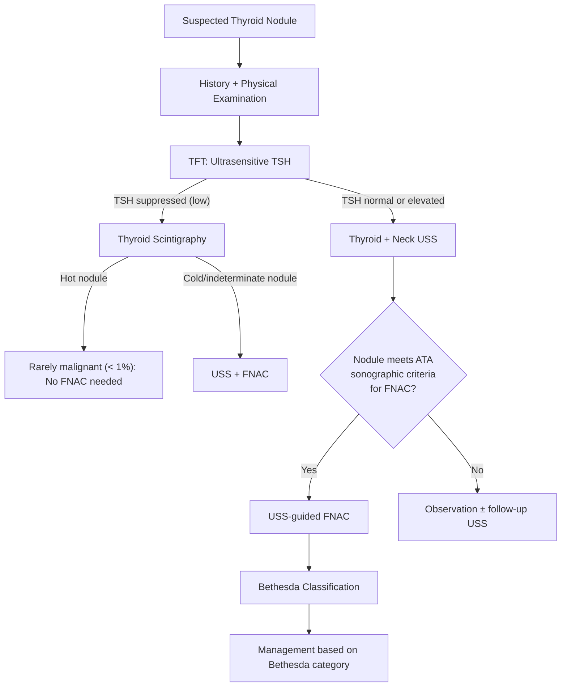

# Thyroid Nodule Workup (USS + Bethesda FNAC)

## 1. Definition

A **thyroid nodule** is a discrete lesion within the thyroid gland that is radiologically distinct from the surrounding thyroid parenchyma [1][2]. The word "nodule" comes from Latin *nodulus* = "small knot." In practical terms, it is a focal area of thyroid tissue that behaves differently (structurally and sometimes functionally) from the rest of the gland.

The "workup" of a thyroid nodule refers to the systematic clinical, biochemical, ultrasonographic, and cytological evaluation aimed at answering **one critical question**: *Is this nodule malignant or benign?*

<Callout title="Why does this matter?">
***Thyroid nodules are extraordinarily common*** — detectable in 3–7% of people by palpation, but > 30% if you do ultrasound or autopsy studies [2][3]. The vast majority (> 85–90%) are benign. The entire workup exists to identify the ~5–15% that harbour malignancy while avoiding unnecessary surgery for the rest.
</Callout>

---

## 2. Epidemiology

### 2.1 Prevalence

| Method of detection | Prevalence |
|---|---|
| ***Palpation*** | ***3–7%*** [2][3] |
| ***USG / autopsy*** | ***> 30%*** [2][3] |

- Prevalence increases with age, female sex, iodine deficiency, and prior ionizing radiation exposure [2][3].
- ***Incidental thyroid nodules*** ("thyroid incidentalomas") are increasingly discovered on imaging done for other reasons — CT, MRI, PET, carotid Doppler — and now account for the **majority** of newly discovered nodules [3].

### 2.2 Demographics

- **Female >> Male** (~4:1 for nodule prevalence) [2][4].
- However, ***a nodule in a male is more likely to be malignant*** — thyroid nodules are less common in males but carry a higher per-nodule malignancy risk [3][5].
- ***Age < 14 years or > 70 years*** carries higher malignancy risk; nodules in the 3rd–6th decade are usually benign [3][5].

### 2.3 Hong Kong context

- Hong Kong is generally **iodine-sufficient** (historically borderline); iodine deficiency shifts the histological spectrum toward follicular carcinoma and multinodular goitre (MNG).
- Nasopharyngeal carcinoma (NPC) — extremely common in southern China/HK — is treated with head-and-neck radiotherapy, which is a major risk factor for subsequent papillary thyroid carcinoma. ***Always ask about history of H&N cancer, especially NPC*** [3][5].

---

## 3. Risk Factors for Thyroid Malignancy

Understanding risk factors matters because they guide how aggressively you pursue investigation.

| Risk factor | Mechanism / Explanation |
|---|---|
| ***Female sex*** | Higher nodule prevalence (oestrogen-mediated thyroid cell proliferation), but per-nodule malignancy risk is actually higher in males [4][5] |
| ***Age extremes (< 14y or > 70y)*** | Childhood thyroid tissue is more radiosensitive; elderly nodules may harbour anaplastic transformation [3][5] |
| ***Head & neck irradiation*** | DNA double-strand breaks → RET/PTC rearrangements → papillary CA. Includes: brain irradiation for childhood leukaemia, TBI for bone marrow transplant, environmental radiation (e.g. Chernobyl, Fukushima) [4][5] |
| ***Family history of thyroid cancer*** | ~5% of papillary CA is familial; ~20% of medullary CA is familial (MEN2) [3][4][5] |
| ***Familial syndromes*** | **MEN2A/2B** (RET mutation → medullary thyroid carcinoma); **FAP** (APC mutation → papillary CA); Cowden syndrome (PTEN → follicular CA); Carney complex; Werner syndrome [4] |
| ***History of autoimmune thyroid disease*** | Hashimoto's thyroiditis → ↑ risk of thyroid lymphoma (chronic antigenic stimulation → MALT lymphoma transformation) [3][5] |
| ***Iodine deficiency*** | ↑ TSH drive → follicular hyperplasia → ↑ risk of follicular CA [4] |
| ***Prior thyroid disease / long-standing MNG*** | Long-standing goitre can harbour de-differentiation → anaplastic CA [3] |
| ***Smoking*** | Weak but documented association [3] |

<Callout title="MEN2 — Must Know" type="error">

| Type | Gene | Features |
|---|---|---|
| ***MEN1*** | *MEN1* (menin) | Pancreatic endocrine tumour, Pituitary tumour (Prolactinoma), Parathyroid hyperplasia — **"3 Ps"** |
| ***MEN2A*** | ***RET*** | ***Medullary thyroid carcinoma + Phaeochromocytoma + Parathyroid hyperplasia*** |
| ***MEN2B*** | ***RET*** | ***Medullary thyroid carcinoma + Phaeochromocytoma + Mucosal neuromas / intestinal ganglioneuromas*** |

***Prophylactic total thyroidectomy is indicated for all MEN2 carriers*** because virtually 100% develop clinically apparent MTC [4].
</Callout>

---

## 4. Anatomy and Function (Relevant to Workup)

### 4.1 Thyroid gland anatomy

- **Location**: Anterior neck, overlying the 2nd–4th tracheal rings, wrapped around the anterolateral trachea.
- **Lobes**: Right and left lobes connected by an **isthmus**; a **pyramidal lobe** (embryological remnant of the thyroglossal duct) is present in ~50%.
- **Blood supply**: Superior thyroid artery (from external carotid) and inferior thyroid artery (from thyrocervical trunk). Occasionally an **ima artery** from the aortic arch/brachiocephalic trunk.
- **Venous drainage**: Superior, middle, and inferior thyroid veins → internal jugular and brachiocephalic veins.
- **Lymphatic drainage**: First echelon = **Level VI (central compartment)** nodes — this is the first site of metastasis for differentiated thyroid carcinoma [5]. Then lateral neck levels II–V.

### 4.2 Critical adjacent structures

| Structure | Clinical relevance |
|---|---|
| **Recurrent laryngeal nerve (RLN)** | Runs in the tracheo-oesophageal groove; damage → vocal cord palsy → hoarseness (unilateral) or airway compromise (bilateral). Assessed pre-operatively by **direct laryngoscopy** [3] |
| **External branch of superior laryngeal nerve (EBSLN)** | Innervates cricothyroid muscle; damage → loss of high-pitched voice |
| **Parathyroid glands** (×4) | Sit on posterior thyroid capsule; at risk during thyroidectomy → hypocalcaemia |
| **Trachea** | Large goitres cause tracheal deviation/compression → stridor, dyspnoea |
| **Oesophagus** | Posterior compression → dysphagia |

### 4.3 Thyroid cell types

| Cell type | Hormone | Relevance to nodules |
|---|---|---|
| **Follicular cells** | T3, T4 (from thyroglobulin) | Give rise to papillary CA, follicular CA, anaplastic CA |
| **Parafollicular C cells** | **Calcitonin** | Give rise to **medullary thyroid carcinoma** |

### 4.4 Thyroid function — why we check TSH first

Thyroid hormone synthesis depends on TSH stimulation via the **HPT axis**: hypothalamus (TRH) → anterior pituitary (TSH) → thyroid (T3/T4) → negative feedback on TRH/TSH.

- A **suppressed TSH** (i.e. hyperthyroid state) suggests the nodule may be **autonomously functioning ("hot")** — these are rarely malignant (< 1%) [2][3].
- A **normal or elevated TSH** means the nodule is likely **non-functioning** — proceed with USS ± FNAC as per ATA guidelines [1][6].

This is why **TSH is the first-line blood test** in any thyroid nodule workup — it determines the subsequent pathway.

---

## 5. Etiology / Pathology of Thyroid Nodules

***The pathological breakdown of thyroid nodules is as follows*** [1]:

| Pathology | Approximate % |
|---|---|
| ***Nodular goitre*** (colloid / haemorrhagic cystic / complex / hyperplastic / adenomatous nodule) | ***70%*** |
| ***Benign follicular adenoma*** (mainly non-toxic) | ***15%*** |
| ***Well-differentiated thyroid carcinoma*** | ***10%*** |
| ***Miscellaneous*** (other thyroid malignancies, thyroiditis) | ***5%*** |

### 5.1 Benign nodules (~85–90%)

#### Nodular / Multinodular goitre (MNG)
- **Pathophysiology**: Recurrent cycles of TSH-driven **hyperplasia → involution** over years/decades → heterogeneous nodules growing at varying rates, some with cystic degeneration, haemorrhage, fibrosis, or calcification [3].
- Some nodules may acquire **autonomous function** (somatic activating mutations in TSH receptor or Gsα) → toxic MNG (Plummer disease).
- ***Note: Follicular adenoma is NOT a risk factor for follicular carcinoma*** — they are biologically distinct entities [5].

#### Follicular adenoma
- Benign, encapsulated, clonal neoplasm of follicular cells.
- Cannot be distinguished from follicular carcinoma on FNAC alone — **requires histological demonstration of capsular or vascular invasion** (this is a fundamental limitation of cytology) [2][3].

#### Cysts
- **True simple cysts**: Rare (< 2%); lined by epithelium, almost always benign.
- **Complex/colloid cysts**: Partially cystic nodules with solid components — need FNAC of solid component.
- **Haemorrhagic cysts**: Arise from bleeding into a pre-existing nodule → sudden painful enlargement.

#### Thyroiditis
- Hashimoto's thyroiditis can present as a pseudo-nodule (focal lymphocytic infiltration).
- Subacute (de Quervain's) thyroiditis: painful, tender gland post-viral illness.

### 5.2 Malignant nodules (~10–15%)

| Type | % of thyroid CA | Age | Cell of origin | Key pathological features | Spread pattern |
|---|---|---|---|---|---|
| ***Papillary*** | ***85%*** | Young adult | Well-differentiated follicular cells | ***Multifocal, non-encapsulated; papillae; psammoma bodies (microcalcifications); Orphan-Annie nuclei (nuclear clearing, grooves, pseudo-inclusions)*** | ***Lymphatic*** (to Level VI first) [5] |
| ***Follicular*** | ***10–15%*** | Middle age (40–60y) | Well-differentiated follicular cells | ***Focal, encapsulated; diagnosed by capsular/vascular invasion (cf. adenoma); Hürthle cell variant has worse prognosis*** | ***Haematogenous*** (bone, lung) [5] |
| ***Anaplastic*** | ***1–3%*** | Old (> 60y) | Undifferentiated follicular cells (de novo or de-differentiation from papillary/follicular CA) | Small blue round cells; very aggressive | Lymphatic + haematogenous [5] |
| ***Medullary*** | ***3–7%*** | Sporadic > 50y; Familial < 30y | ***Parafollicular C cells*** | ***Amyloid deposits (Congo red stain); 25% genetic (RET oncogene); tumour markers: calcitonin (95%), CEA (80%)*** | Lymphatic [5] |
| Other rare | < 1% | — | — | Lymphoma (requires core biopsy), SCC, poorly differentiated CA, metastatic (RCC most common) | — [5] |

---

## 6. Classification Systems

### 6.1 ACR TI-RADS (Thyroid Imaging Reporting and Data System)

The **ACR TI-RADS** (American College of Radiology Thyroid Imaging Reporting and Data System) is the current standard for classifying thyroid nodules on USS. It uses a **points-based system** across 5 ultrasound categories:

| Category | Options (points) |
|---|---|
| **Composition** | Cystic (0), Spongiform (0), Mixed cystic-solid (1), Solid or almost completely solid (2) |
| **Echogenicity** | Anechoic (0), Hyperechoic/isoechoic (1), Hypoechoic (2), Very hypoechoic (3) |
| **Shape** | Wider than tall (0), ***Taller than wide (3)*** |
| **Margin** | Smooth (0), Ill-defined (0), Lobulated/irregular (2), Extra-thyroidal extension (3) |
| **Echogenic foci** | None/large comet-tail artefacts (0), Macrocalcifications (1), Peripheral (rim) calcification (2), ***Punctate echogenic foci / microcalcifications (3)*** |

| TI-RADS Level | Points | Interpretation | FNAC threshold |
|---|---|---|---|
| TR1 | 0 | Benign | No FNA |
| TR2 | 2 | Not suspicious | No FNA |
| TR3 | 3 | Mildly suspicious | ≥ 2.5 cm FNA; ≥ 1.5 cm follow-up |
| TR4 | 4–6 | Moderately suspicious | ≥ 1.5 cm FNA; ≥ 1.0 cm follow-up |
| TR5 | ≥ 7 | Highly suspicious | ***≥ 1.0 cm FNA; ≥ 0.5 cm follow-up*** |

### 6.2 ATA (American Thyroid Association) 2015 Sonographic Pattern Classification

The **ATA 2015 guidelines** [1][6] use a descriptive pattern-based approach:

| ***ATA Sonographic Pattern*** | ***Description*** | ***Estimated malignancy risk*** | ***FNA size threshold*** |
|---|---|---|---|
| ***High suspicion*** | ***Solid hypoechoic nodule*** (or solid hypoechoic component of partially cystic nodule) ***with ≥ 1 of: irregular margins, microcalcifications, taller-than-wide, rim calcification with extrusive soft tissue, extrathyroidal extension*** | ***> 70–90%*** | ***≥ 1 cm*** |
| ***Intermediate suspicion*** | ***Hypoechoic solid nodule with smooth margins, WITHOUT above features*** | ***10–20%*** | ***≥ 1 cm*** |
| ***Low suspicion*** | ***Isoechoic or hyperechoic solid nodule, or partially cystic with eccentric solid component, WITHOUT above features*** | ***5–10%*** | ***≥ 1.5 cm*** |
| ***Very low suspicion*** | ***Spongiform or partially cystic without any suspicious features*** | ***< 3%*** | ***≥ 2 cm*** |
| ***Benign*** | ***Purely cystic (no solid component)*** | ***< 1%*** | ***No FNA (consider aspiration if symptomatic)*** |

<Callout title="Key Point — ATA Flowchart" type="idea">
***If TSH is normal or elevated → Thyroid/Neck USS → Classify nodule by ATA sonographic pattern → Apply size thresholds for FNAC → Report cytology using Bethesda system*** [1][6]. This is the backbone of the entire workup.
</Callout>

### 6.3 "SHIT CME" Mnemonic for Suspicious USS Features

From the senior notes, the mnemonic ***"SHIT CME"*** helps recall suspicious sonographic features [2][3]:

| Letter | Feature | Explanation |
|---|---|---|
| **S** | ***Solid*** | Solid nodules have higher malignancy risk than cystic |
| **H** | ***Hypoechoic*** | Lower echogenicity than surrounding thyroid parenchyma = suspicious |
| **I** | ***Irregular margin / shape*** | Suggests infiltrative growth |
| **T** | ***Taller than wide*** | Growth perpendicular to tissue planes = aggressive; normal benign nodules grow along tissue planes (wider than tall) |
| **C** | ***Calcification (microcalcification)*** | < 0.2mm punctate echogenic foci representing ***psammoma bodies of papillary CA*** |
| **M** | ***Missing halo (absent/incomplete perilesional halo)*** | Halo = compressed normal thyroid tissue around a well-demarcated nodule; absence suggests invasion |
| **E** | ***Extra-thyroidal Extension*** / abnormal lymph nodes / intranodular vascularity | Direct invasion into strap muscles; suspicious cervical LN features (absent hilum, microcalcification, round shape, peripheral vascularity) |

> ***The most important features are solid and hypoechoic*** [2][3].

### 6.4 Suspicious Lymph Node Features on USS

| Feature | Why suspicious |
|---|---|
| ***Loss of fatty hilum*** | Normal LNs have an echogenic fatty hilum; metastatic replacement obliterates it |
| ***Microcalcification within LN*** | Pathognomonic for papillary CA metastasis (psammoma bodies deposited in LN) |
| ***Round shape (L/S ratio approaching 1)*** | Normal LNs are elongated; metastatic LNs become round due to expansile growth |
| ***Peripheral / chaotic vascularity*** | Normal LN vascularity is hilar; neoangiogenesis in metastatic LNs is peripheral |
| ***Hyperechoic*** | Thyroid tissue within LN (colloid/thyroglobulin) |
| ***Cystic change*** | Necrosis within metastatic deposit |

---

## 7. Pathophysiology — Connecting It All

### 7.1 Why do thyroid nodules form?

Thyroid nodules result from **clonal or polyclonal proliferation** of thyroid follicular cells driven by:

1. **TSH stimulation**: Chronic ↑ TSH (e.g. iodine deficiency, Hashimoto's) → diffuse hyperplasia → focal nodular transformation (some clones grow faster → nodularity).
2. **Somatic mutations**: Gain-of-function mutations in TSH receptor or Gsα → constitutive cAMP pathway activation → autonomous growth ± hormone secretion ("toxic adenoma").
3. **Oncogenic mutations**: RET/PTC rearrangements, BRAF V600E, RAS mutations, PAX8-PPARγ fusions → malignant transformation.
4. **Radiation damage**: DNA double-strand breaks → chromosomal rearrangements (especially RET/PTC in papillary CA).

### 7.2 Why can't FNAC distinguish follicular adenoma from follicular carcinoma?

This is a **fundamental concept**. Follicular carcinoma is defined by **capsular or vascular invasion** — a feature that requires assessment of the tumour-capsule interface on **histological sections**, not individual cells aspirated through a needle. On cytology, follicular adenoma and follicular carcinoma cells look identical. This is why Bethesda Category IV ("follicular neoplasm") requires **surgical excision (hemithyroidectomy)** for definitive diagnosis [1][2][3].

### 7.3 Why are "hot" nodules rarely malignant?

A "hot" nodule on scintigraphy has **upregulated iodine-trapping and organification** — it is doing what normal thyroid cells do, just excessively. Malignant thyroid cells, by contrast, tend to **de-differentiate** and lose the ability to efficiently trap iodine (lose NIS expression). Therefore, most cancers are "cold" (non-functioning) on scintigraphy. The malignancy risk of a hot nodule is < 1% [2][3].

### 7.4 Why do psammoma bodies cause microcalcifications on USS?

Psammoma bodies are **concentric lamellated calcified structures** formed within papillary thyroid carcinoma. They result from dystrophic calcification of infarcted tips of papillae (tumour outgrows its blood supply → tip necrosis → calcium deposition). These tiny calcifications (< 0.2 mm) appear as **punctate hyperechoic foci without posterior acoustic shadowing** on USS — highly specific for papillary CA [2][3].

### 7.5 Why "taller than wide"?

Benign nodules tend to grow along tissue planes (horizontally) → wider than tall on transverse USS. Malignant nodules grow perpendicular to tissue planes (invading through normal tissue architecture) → **taller than wide** (anteroposterior dimension exceeds transverse dimension). This feature is relatively specific for malignancy.

---

## 8. Clinical Approach to a Thyroid Nodule

### 8.1 Overview — The Workup Algorithm

***Routine investigations for ALL patients with a thyroid nodule/goitre*** [2][3]:
1. **TFT** (ultrasensitive TSH ± fT4)
2. **Thyroid + neck USS**
3. **FNAC** (if indicated by USS)

***Selective investigations*** [2][3]:

| Investigation | Indication |
|---|---|
| ***Thyroid scintigraphy*** | ***Only if TSH is suppressed + nodule present*** (to determine if hot vs cold) |
| ***CT scan*** | ***Only for (1) retrosternal goitre (cannot be visualized by USS; needed for surgical planning) or (2) locally advanced thyroid cancer*** (delineation of cervical fascia structures) |
| ***PET scan*** | ***No diagnostic role at all*** |
| Calcitonin | Clinical suspicion of MTC or MEN2 |
| ESR, anti-thyroid antibodies | Suspected thyroiditis |
| Direct laryngoscopy | Assess RLN palsy pre-operatively |
| CXR / Flow-volume loop | Retrosternal goitre / upper airway obstruction |

<Callout title="Why CT and not just USS for retrosternal goitre?" type="idea">
***Retrosternal goitre requires CT because***: (1) USS cannot visualise the mediastinum (sound waves don't penetrate bone/air well), (2) surgical planning requires knowledge of extent, relationship to great vessels, tracheal deviation, (3) retrosternal goitre may be malignant [2].

***Caution***: Iodinated CT contrast can interfere with subsequent radioactive iodine (RAI) scanning/therapy for 6–8 weeks — important to consider if thyroid cancer is suspected [3].
</Callout>

---

## 9. Clinical Features

### 9.1 Symptoms

| Symptom | Pathophysiological basis |
|---|---|
| ***Neck swelling / palpable lump*** | Direct enlargement of thyroid tissue (nodular growth) |
| ***Gradual painless enlargement*** | Typical of benign nodular goitre or well-differentiated carcinoma (slow growth) |
| ***Sudden painful enlargement*** | ***Haemorrhage into a cyst/necrotic nodule*** (rupture of thin-walled vessels within the nodule → acute distension of capsule → pain) OR ***subacute thyroiditis*** OR ***anaplastic carcinoma*** (rapid growth with necrosis) [3][5] |
| ***Dysphagia*** | Posterior compression/invasion of oesophagus by large goitre or locally advanced cancer |
| ***Dyspnoea / stridor*** | Tracheal compression (large goitre, especially retrosternal) or tracheal invasion (anaplastic CA). Stridor indicates > 50% reduction in tracheal lumen |
| ***Dysphonia (hoarseness of voice)*** | ***Recurrent laryngeal nerve*** invasion or compression → vocal cord paralysis. A red flag for malignancy (especially if progressive). Note: can be absent in well-differentiated CA [3][5] |
| ***Thyrotoxic symptoms*** | Autonomous hormone secretion: weight loss despite ↑ appetite, heat intolerance, sweating, palpitations, tremor, diarrhoea, irritability |
| ***Hypothyroid symptoms*** | Hashimoto's thyroiditis presenting as a nodule: fatigue, weight gain, cold intolerance, constipation, bradycardia |
| **Incidental finding** | ***Majority of thyroid nodules*** are found incidentally on physical exam or imaging (USS, CT, PET) [3] |

### 9.2 Signs

| Sign | Pathophysiological basis |
|---|---|
| ***Solitary or dominant nodule*** | ***More likely to be malignant than multiple nodules*** (though MNG can harbour malignancy in any nodule) [3][5] |
| ***Firm / hard consistency*** | ***Suggests malignancy*** — fibrosis/desmoplasia within carcinoma makes it hard (cf. soft, rubbery benign nodules) |
| ***Fixation to surrounding tissues*** | ***Invasion beyond thyroid capsule*** into strap muscles, trachea, oesophagus, or carotid sheath — hallmark of advanced malignancy |
| **Moves with swallowing** | Pre-tracheal fascia encloses thyroid → thyroid moves with laryngeal elevation during swallowing. This confirms the lump is thyroid in origin |
| **Does NOT move with tongue protrusion** | Distinguishes thyroid nodule from thyroglossal duct cyst (which moves up with tongue protrusion due to attachment to foramen caecum via thyroglossal duct remnant) |
| ***Cervical lymphadenopathy*** | ***Metastatic spread, especially Level VI nodes*** (central compartment, first echelon drainage) [3][5]. Also lateral levels II–V |
| ***Tracheal deviation*** | Large goitre pushing trachea to contralateral side |
| ***Pemberton's sign*** | Raising arms above head → facial plethora, distended neck veins, cyanosis. Indicates **thoracic inlet obstruction** from retrosternal goitre compressing SVC/brachiocephalic veins |
| **Vocal cord palsy (on laryngoscopy)** | RLN invasion/compression → immobile vocal cord |
| Signs of **thyrotoxicosis** | Tremor, tachycardia, lid retraction, lid lag, warm moist palms, AF, hyperreflexia |
| Signs of **hypothyroidism** | Dry skin, periorbital oedema, delayed relaxation of reflexes, bradycardia, myxoedema |
| ***Eye signs (Graves')*** | ***Lid retraction, exophthalmos, chemosis, proptosis, ophthalmoplegia*** — specific to Graves' disease (autoimmune stimulation of orbital fibroblasts expressing TSH receptor) [2] |

### 9.3 Physical examination — systematic approach [2]

**Inspection:**
1. Surgical scars (previous thyroidectomy?)
2. ***Swallowing test*** — ask patient to swallow; thyroid lump rises with swallowing
3. ***Tongue protrusion test (tongue tug test)*** — ask patient to protrude tongue; thyroglossal duct cyst rises, thyroid nodule does not

**Voice assessment:** Hoarseness?

**Palpation (from behind the patient):**
1. ***Diffuse vs solitary nodule vs MNG vs dominant nodule in MNG***
2. Size
3. Consistency (soft / firm / hard)
4. Location (which lobe? isthmus?)
5. ***Lower border palpable?*** (if not → suspect retrosternal extension)
6. ***Cervical lymph nodes*** (systematic palpation of all levels, especially Level VI)
7. ***Trachea*** (central or deviated?)

**General examination — thyroid status:**
1. **Eyes**: Lid retraction, exophthalmos, chemosis, proptosis, lid lag, ophthalmoplegia
2. **Hands**: Tremor, sweating, tachycardia (radial pulse), thyroid acropachy, palmar erythema
3. **Lower limbs**: Proximal muscle weakness (thyrotoxic myopathy), pretibial myxoedema (Graves'), ankle jerk relaxation time (delayed in hypothyroidism)

---

## 10. Clinical Features Suggesting ↑ Risk of Malignancy — Summary [3][5]

This is the critical checklist that determines how aggressively you pursue FNAC:

| Category | Features |
|---|---|
| ***Demographics*** | ***Male sex; age < 14y or > 70y*** |
| ***Nodule characteristics*** | ***Solitary or dominant nodule; slow but progressive growth (weeks–months); firm/hard; fixed to surrounding tissues*** |
| ***Pressure symptoms / RLN palsy*** | ***Indicates rapid growth with invasion*** (though can be absent in well-differentiated CA) |
| ***Cervical lymphadenopathy*** | ***Especially Level VI*** |
| ***PMHx*** | ***Neck irradiation*** (NPC Tx in HK context!) |
| ***FHx*** | ***Thyroid CA (especially medullary CA, MEN2, papillary CA, FAP)*** |
| ***USS features*** | ***"SHIT CME": Solid, Hypoechoic, Irregular, Taller-than-wide, Calcification (micro), Missing halo, Extrathyroidal extension / abnormal LN*** |

<Callout title="Red Flags for Thyroid Malignancy" type="error">
Do NOT miss these in a clinical exam or OSCE:
1. Hard, fixed, painless nodule
2. Hoarseness of voice (RLN palsy)
3. Cervical lymphadenopathy
4. History of neck irradiation
5. Family history of MEN2/medullary CA
6. Rapid growth in an elderly patient (anaplastic CA)
</Callout>

---

## 11. Ultrasound of the Thyroid — Deep Dive

### 11.1 Technical aspects

- **Probe**: ***7.5 or 10 MHz linear probe, B-mode*** [2][3]
- **Advantages**: Readily available, non-invasive, no radiation, high sensitivity
- **Disadvantage**: ***High sensitivity but LOW specificity*** — many benign nodules have "suspicious" features → this is why USS is used to **guide (not confirm) diagnosis** [2][3]
- **Indication**: ***For ALL patients with goitre or palpable nodules***
- ***NOT a screening test for healthy subjects*** (too sensitive → too many false positives → unnecessary anxiety and procedures) [2][3]

### 11.2 What to look for

| Domain | Features to assess |
|---|---|
| **The nodule itself** | Composition (solid/cystic/mixed), echogenicity, shape (taller vs wider), margins, calcifications, vascularity, halo |
| **Surrounding thyroid** | Other nodules (MNG → slightly reassuring), parenchymal abnormalities (Hashimoto's = diffuse heterogeneous hypoechogenicity) |
| **Cervical lymph nodes** | ***Especially Level VI (deep, not palpable clinically)*** — USS is essential to detect these |
| **Retrosternal extension** | Lower pole of thyroid descending behind sternum |

### 11.3 USS-guided FNAC — Indications (ATA 2015) [1][6]

***FNAC is the single most important investigation for a thyroid nodule when TSH is not suppressed*** [2][3].

**Indications based on ATA sonographic pattern:**

| Pattern | FNAC size threshold |
|---|---|
| ***High suspicion*** | ***≥ 1 cm*** |
| ***Intermediate suspicion*** | ***≥ 1 cm*** (some guidelines say ≥ 1.5 cm) |
| ***Low suspicion*** | ***≥ 1.5 cm*** |
| ***Very low suspicion*** | ***≥ 2 cm*** |
| ***Benign (purely cystic)*** | ***No FNAC*** (consider aspiration if symptomatic) |

**Additional indications for FNAC** [2][4]:
- ***Hypofunctioning ("cold") nodules on scintigraphy*** (10–20% malignancy risk)
- ***Dominant or atypical nodule in MNG***
- ***Nodules associated with abnormal cervical lymph nodes***
- ***Complex or recurrent cystic nodules***
- ***Symptomatic / large cysts*** (therapeutic aspiration)

**Can proceed directly to total thyroidectomy (bypass FNAC) if** [2][3]:
- Nodule > 4 cm
- Gross extrathyroidal invasion
- Cervical lymph node metastasis confirmed

**Technical aspects:**
- ***Trans-isthmic approach ± USS guidance***
- ***USS guidance advantages***: Confirm presence of nodule, target biopsy to the most suspicious region (e.g. solid component of a mixed cystic-solid nodule), avoid vascular structures [2][3]
- ***Accuracy: 90–95%*** [2]

### 11.4 Approach to Multiple Nodules [5]

- ***Malignancy risk is much lower overall in multinodular glands***
- ***USS: assess EACH nodule separately***
- ***FNAC strategy***:
  - ***If no suspicious nodules → FNA the largest nodule***
  - ***If any suspicious nodules → FNA ALL suspicious nodules***

---

## 12. Bethesda System for Reporting Thyroid Cytopathology

### 12.1 Overview

The **Bethesda System** is the standardized international classification for thyroid FNAC cytology. "Bethesda" refers to Bethesda, Maryland, USA, where the NCI hosted the 2007 consensus conference that established it. It has been updated (most recently in 2023, 3rd edition) but the 6-tier structure remains.

### 12.2 The Six Categories

| ***Bethesda Category*** | ***Diagnostic Category*** | ***Risk of Malignancy (%)*** | ***Usual Management*** |
|---|---|---|---|
| ***I*** | ***Non-diagnostic / Unsatisfactory*** | ***1–4 (up to 5–10%)*** | ***Repeat FNA*** (or surgery if radiologically suspicious / high clinical risk) [1][2][5] |
| ***II*** | ***Benign*** | ***0–3*** | ***Clinical follow-up*** (USS monitoring) [1][2][5] |
| ***III*** | ***AUS (Atypia of Undetermined Significance) / FLUS (Follicular Lesion of Undetermined Significance)*** | ***5–15 (up to 6–18%)*** | ***Repeat FNA (low risk) OR molecular testing OR hemithyroidectomy if AUS × 2 or high clinical risk*** [1][2][5] |
| ***IV*** | ***Follicular Neoplasm / Suspicious for Follicular Neoplasm / Hürthle cell neoplasm*** | ***15–30 (up to 10–40%)*** | ***Hemithyroidectomy (lobectomy) ± molecular testing*** [1][2][5] |
| ***V*** | ***Suspicious for Malignancy*** | ***60–75 (up to 45–60%)*** | ***Hemithyroidectomy + frozen section → completion total thyroidectomy*** (or direct TT) [1][2][5] |
| ***VI*** | ***Malignant*** | ***97–99*** | ***Total thyroidectomy*** [1][2][5] |

### 12.3 Deep Dive — Each Category Explained

#### Bethesda I: Non-diagnostic

- The aspirate has **insufficient cells** for cytological interpretation (typically < 6 groups of 10 well-preserved follicular cells).
- **Causes**: Too much blood (haemodiluted), too few cells (fibrotic nodule), cystic fluid only with no follicular cells.
- ***Management***: Repeat FNA in 4–6 weeks (to allow haematoma resolution). If ***still non-diagnostic***:
  - ***Low clinical risk → observation***
  - ***High clinical risk → hemithyroidectomy***
- ***High-risk features for proceeding to surgery*** [5]:
  - Suspicious USS features
  - ***Clinical risk factors***: FHx of thyroid CA, prior neck radiation
  - ***P/E***: voice hoarseness, hard/irregular/fixed mass, cervical LN positive
  - Growing nodule

#### Bethesda II: Benign

- Includes colloid nodule, hyperplastic nodule, lymphocytic thyroiditis (Hashimoto's), granulomatous thyroiditis (de Quervain's).
- ***Still a small risk of malignancy (0–3%) due to sampling error*** [5].
- ***Management***: Observation with clinical + USS monitoring.
- ***Indications for surgery in a benign nodule*** [5]:
  1. ***Pressure symptoms*** (dysphagia, dyspnoea, dysphonia)
  2. ***Growing size***
  3. ***Cosmetic concern***
  4. ***Patient's worry***
- ***Thyroxine suppression therapy is mostly obsoleted*** [5]:
  - Controversial benefits
  - Works in < 20% of patients
  - Significant side effects (osteoporosis, AF from iatrogenic subclinical hyperthyroidism)
  - Thyroid gland regrows after cessation

<Callout title="Bethesda II — Don't forget!" type="error">
A "benign" FNAC result does NOT mean you can forget the patient. There is still a 0–3% false-negative rate. ***Patients need clinical and USS follow-up.*** If the nodule grows significantly (> 20% increase in diameter or > 50% increase in volume), repeat FNAC.
</Callout>

#### Bethesda III: AUS / FLUS

- **AUS** = Atypia of Undetermined Significance; **FLUS** = Follicular Lesion of Undetermined Significance.
- ***"Atypia" here is a morphological description rather than a premalignant lesion*** [5] — it simply means the cells look a bit "off" but don't meet criteria for follicular neoplasm or malignancy.
- This is the "grey zone" — the cytopathologist is essentially saying "I'm not sure."
- ***Management***:
  - ***Repeat FNA*** (most will be reclassified as Bethesda II on repeat)
  - ***Molecular testing*** (e.g. ThyroSeq, Afirma GSC) — can help "rule in" or "rule out" malignancy
  - ***Hemithyroidectomy if AUS × 2*** or if high clinical risk [2][3][5]

#### Bethesda IV: Follicular Neoplasm (FN) / Hürthle Cell Neoplasm

- The cytology shows a ***follicular-patterned lesion*** — microfollicular architecture with scant colloid.
- **Critical concept**: ***FNAC CANNOT distinguish follicular adenoma from follicular carcinoma*** — this requires histological assessment of the tumour capsule for capsular or vascular invasion [1][2][3].
- ***After resection, the majority turn out to be papillary CA*** (with psammoma bodies) — some lesions initially classified as "follicular neoplasm" on cytology are actually follicular variant of papillary CA on final histology [5].
- ***Hürthle cell (oncocytic) neoplasm***: A variant with abundant mitochondria-rich eosinophilic cytoplasm; worse prognosis; ***not amenable to RAI*** (Hürthle cells lose NIS expression) → requires surgical treatment [5].
- ***Management***: ***Hemithyroidectomy (lobectomy)*** [1][2][5]
  - If histology shows benign (adenoma / minimally invasive with < 5 vessel invasion + no wide invasion) → ***lobectomy is curative*** [3]
  - If malignant (widely invasive, > 5 vessel invasion) → ***completion total thyroidectomy + RAI ablation*** (due to ↑ risk of distant metastases) [3]

<Callout title="Frozen Section in Bethesda IV — Is It Helpful?" type="error">
***Frozen section (FS) is NOT helpful during hemithyroidectomy for follicular neoplasm.*** It only gives diagnostic information in 13% of cases, modifies surgical procedure in 3.3%, and causes misguided intervention in 5%. ***One should wait for the final histology report after lobectomy*** [3].
</Callout>

#### Bethesda V: Suspicious for Malignancy

- Cytological features are highly suggestive but not definitively diagnostic of malignancy (e.g. some but not all features of papillary CA).
- ***Management***: ***Hemithyroidectomy + frozen section → if positive, proceed to completion total thyroidectomy*** [1][2].
- Alternatively, some centres proceed directly to total thyroidectomy if clinical/USS suspicion is very high.

#### Bethesda VI: Malignant

- Definitive cytological diagnosis of malignancy (e.g. classic papillary CA with nuclear grooves, pseudoinclusions, psammoma bodies; or medullary CA with amyloid + positive calcitonin staining; or anaplastic CA).
- ***Management***: ***Total thyroidectomy*** [1][2][5].

### 12.4 Newer Adjuncts — Molecular Testing

- ***Veracyte Afirma Genomic Sequencing Classifier (GSC)***, ***ThyroSeq v3*** — multi-gene panels that can reclassify Bethesda III/IV nodules as "benign" (with high NPV, potentially avoiding surgery) or "suspicious" [2][3].
- ***Currently expensive, no universal standards, and not readily available*** — especially in HK [2][3].
- Genes tested include BRAF V600E, RAS, RET/PTC, PAX8-PPARγ, TERT promoter mutations.

---

## 13. Thyroid Scintigraphy — When and Why

### 13.1 Principle

- ***Radioactive iodine is handled in the same manner as normal iodine*** by thyroid follicular cells [7].
- **Radiopharmaceuticals**: ***⁹⁹ᵐTc-pertechnetate (iodine trapping only)*** or ***¹²³I / ¹³¹I (trapping + organification)*** [7].
  - ⁹⁹ᵐTc-pertechnetate has a similar ionic size to iodide → taken up by the sodium-iodide symporter (NIS) but NOT organified.
- Level of uptake = metabolic activity → detected by gamma camera.
- ***Images obtained at anterior, LAO, and RAO views*** [7].

### 13.2 Clinical Use

- ***Used in patients with nodule/MNG + suppressed TSH*** [2][3] — to determine if the nodule is the source of hyperthyroidism.
- ***"Hot" nodule***: Uptake greater than surrounding thyroid → autonomous function → ***rarely malignant (< 1%)*** → ***does NOT require FNAC*** [2][4].
- ***"Cold" nodule***: Uptake less than surrounding thyroid → ***10–20% malignancy risk*** → ***requires FNAC*** (provided sonographic criteria are met) [2][4].
- ***"Warm" / "Indeterminate" nodule***: Uptake similar to surrounding thyroid → intermediate risk → FNAC if USS suspicious.

### 13.3 Limitations

- ***Radiation exposure, expensive, low specificity/sensitivity*** [3].
- ***Most cancers are cold, but most cold nodules are benign*** — hence scintigraphy alone cannot diagnose malignancy.
- Limited spatial resolution — cannot characterise nodules < 1 cm well.

---

## 14. Putting It All Together — The Complete Workup Algorithm

***The ATA 2015 guidelines*** [1][6] provide the definitive algorithm:

1. **Suspected thyroid nodule** (palpated or incidental)
2. **Step 1: TFT (ultrasensitive TSH)**
   - ***If TSH is low (suppressed)*** → **Thyroid scintigraphy**
     - Hot nodule → Manage as toxic nodule (no FNAC needed)
     - Cold/indeterminate nodule → Proceed to USS + FNAC
   - ***If TSH is normal or elevated*** → **Thyroid + neck USS**
3. **Step 2: USS — classify by ATA sonographic pattern**
   - ***No nodule found or nodule does not meet FNA size cutoff*** → Observation/follow-up
   - ***Nodule meets criteria*** → USS-guided FNAC
4. **Step 3: FNAC — report using Bethesda system**
5. **Step 4: Management based on Bethesda category** (see table above)

### 14.1 Summary — Overview of Management by Presentation [5]

| | ***Solitary*** | ***Multinodular*** |
|---|---|---|
| ***Euthyroid*** | Observe; hemithyroidectomy if 4C's (cancer, compression, cosmesis, concern) | Observe; total thyroidectomy if 4C's |
| ***Hyperthyroid*** | Hemithyroidectomy | Total thyroidectomy |

---

## 15. Differential Diagnosis of an Anterior Neck Lump [3][8]

| Category | Differential |
|---|---|
| ***Thyroid enlargement*** | Solitary nodule, MNG, diffuse goitre (Graves', Hashimoto's, simple goitre), thyroid cyst, thyroid carcinoma |
| ***Lymphadenopathy*** | Reactive, infective (TB in HK!), metastatic (NPC, thyroid CA, other H&N cancers), lymphoma |
| ***Skin lumps*** | Sebaceous cyst, lipoma, dermoid cyst |
| ***Midline developmental*** | ***Thyroglossal duct cyst*** (moves with tongue protrusion — remnant of descent of thyroid from foramen caecum) |
| ***Lateral developmental*** | ***Branchial cyst*** (anterior border of SCM, smooth fluctuant) |
| ***Vascular*** | Carotid body tumour (pulsatile, at carotid bifurcation) |
| Other | Laryngocoele, pharyngeal pouch |

---

<Callout title="High Yield Summary">

1. **Thyroid nodules are extremely common** (> 30% on USS) but only ~5–15% are malignant. The workup exists to identify cancer while avoiding unnecessary surgery.

2. **First step is ALWAYS TSH**: Suppressed TSH → scintigraphy (hot nodules are rarely malignant, cold nodules need FNAC). Normal/elevated TSH → USS → FNAC.

3. **USS suspicious features ("SHIT CME")**: ***Solid, Hypoechoic, Irregular margin, Taller-than-wide, Calcification (micro), Missing halo, Extrathyroidal extension / abnormal LN***. Most important = solid + hypoechoic.

4. **ATA 2015 sonographic patterns** determine FNAC size thresholds: High suspicion ≥ 1 cm, Intermediate ≥ 1 cm, Low ≥ 1.5 cm, Very low ≥ 2 cm, Benign (purely cystic) → no FNA.

5. **Bethesda classification** (6 categories): I = Non-diagnostic (repeat); II = Benign (follow-up); III = AUS/FLUS (repeat FNA or molecular testing); IV = Follicular neoplasm (hemithyroidectomy — FNAC cannot distinguish adenoma from carcinoma); V = Suspicious (hemiT + FS → TT); VI = Malignant (TT).

6. **FNAC cannot distinguish follicular adenoma from follicular carcinoma** — requires histological capsular/vascular invasion assessment.

7. **Frozen section is NOT helpful for Bethesda IV (follicular neoplasm)** — wait for final histology.

8. **Risk factors for malignancy**: Male sex, extremes of age, neck irradiation (NPC Tx in HK!), FHx (MEN2, FAP), solitary/dominant nodule, hard/fixed, hoarseness, cervical LN.

9. **CT is NOT routine** — only for retrosternal goitre or locally advanced cancer. PET has no diagnostic role. Scintigraphy only if TSH is suppressed.

10. **Thyroxine suppression therapy for benign nodules is mostly obsoleted** — controversial, works in < 20%, significant side effects, regrows after cessation.

</Callout>

---

<ActiveRecallQuiz
  title="Active Recall - Thyroid Nodule Workup (USS + Bethesda FNAC)"
  items={[
    {
      question: "A patient presents with a thyroid nodule and a suppressed TSH. What is the next investigation and why?",
      markscheme: "Thyroid scintigraphy. Suppressed TSH suggests hyperfunctioning (autonomously secreting) nodule. Hot nodules are rarely malignant (less than 1%) and do NOT require FNAC. Cold nodules have 10-20% malignancy risk and require USS-guided FNAC.",
    },
    {
      question: "List the 6 Bethesda categories with their approximate malignancy risk and standard management.",
      markscheme: "I: Non-diagnostic (1-4%) - repeat FNA. II: Benign (0-3%) - clinical follow-up. III: AUS/FLUS (5-15%) - repeat FNA or molecular testing. IV: Follicular neoplasm (15-30%) - hemithyroidectomy. V: Suspicious for malignancy (60-75%) - hemiT plus frozen section then total thyroidectomy. VI: Malignant (97-99%) - total thyroidectomy.",
    },
    {
      question: "Why can FNAC not distinguish follicular adenoma from follicular carcinoma?",
      markscheme: "Follicular carcinoma is defined by capsular or vascular invasion, which requires assessment of the tumour-capsule interface on histological sections. Individual cells aspirated by FNA look identical in adenoma and carcinoma. Therefore surgical excision (hemithyroidectomy) is needed for definitive diagnosis.",
    },
    {
      question: "What does the mnemonic SHIT CME stand for in the context of suspicious USS features of a thyroid nodule?",
      markscheme: "S = Solid, H = Hypoechoic, I = Irregular margin/shape, T = Taller than wide, C = Calcification (microcalcification), M = Missing halo (absent or incomplete perilesional halo), E = Extrathyroidal extension or abnormal lymph nodes or intranodular vascularity. Most important features are solid and hypoechoic.",
    },
    {
      question: "A Bethesda IV (follicular neoplasm) is excised by hemithyroidectomy. The surgeon asks if intraoperative frozen section will help decide whether to proceed to total thyroidectomy. What is your advice?",
      markscheme: "Frozen section is NOT helpful for follicular neoplasm. It only gives diagnostic information in 13% of cases, modifies surgical procedure in 3.3%, and causes misguided intervention in 5%. Recommend waiting for final histology. If minimally invasive (less than 5 vessel invasion, no wide invasion), lobectomy is curative. If widely invasive, proceed to completion total thyroidectomy plus RAI ablation.",
    },
    {
      question: "What are the ATA 2015 FNAC size thresholds for high suspicion, low suspicion, and very low suspicion sonographic patterns?",
      markscheme: "High suspicion: FNA if 1 cm or more. Low suspicion: FNA if 1.5 cm or more. Very low suspicion: FNA if 2 cm or more. Purely cystic (benign pattern): no FNA needed.",
    },
  ]}
/>

---

## References

[1] Lecture slides: GC 177. A thyroid nodule benign thyroid nodules; thyroid cancer.pdf (p5, p10, p12)
[2] Senior notes: Ryan Ho Endocrine.pdf (p17–p21, p31–p32, p38)
[3] Senior notes: Ryan Ho Fundamentals.pdf (p425–p428)
[4] Senior notes: felixlai.md (Etiology, FNA, Bethesda sections)
[5] Senior notes: maxim.md (Bethesda classification, Approach to multiple nodules, Thyroid cancer overview)
[6] Lecture slides: Management of differentiated thyroid carcinoma.pdf (p2)
[7] Senior notes: Ryan Ho Diagnostic Radiology.pdf (p59)
[8] Lecture slides: GC 218. I have a swelling in the neck Neck mass.pdf
