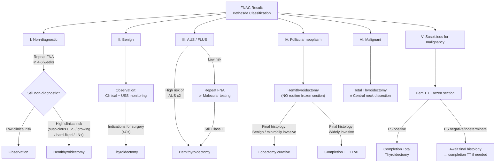
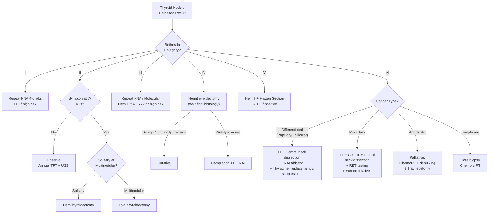

## Management Algorithm & Treatment Modalities

### Guiding Principles

Management of a thyroid nodule is driven entirely by what the workup tells you — specifically the **Bethesda category** from FNAC and, if malignancy is confirmed, the **histological type, staging, and patient risk profile**. The key philosophical tension in management is:

- **Under-treatment** = missing a cancer that could have been cured by surgery
- **Over-treatment** = performing a total thyroidectomy (with its lifelong consequences) for what turns out to be a benign lesion

The entire management algorithm is designed to navigate this tension.

---

### 1. Master Management Algorithm — By Bethesda Category

---

### 2. Management by Clinical Scenario

#### 2A. Bethesda II — Benign Nodule / Non-Suspicious Goitre

This is the most common outcome of FNAC (~60–70% of aspirates). The nodule is cytologically benign — but remember there is still a ***0–3% false-negative rate due to sampling error*** [1][2][5].

##### Default: Observation

- ***Monitor: TFT + neck exam + USS every 12 months*** for asymptomatic, stable goitre (< 80 mL) [2][3]
- Most benign nodules remain stable or grow very slowly and never need intervention
- ***Repeat FNAC if***: > 20% increase in diameter or > 50% increase in volume on follow-up USS

##### Indications for Active Treatment — the "4Cs" Mnemonic

***Indications for thyroidectomy in benign thyroid disease ("3Cs" + Cancer)*** [2][5]:

| Indication | Explanation |
|---|---|
| ***Cancer***: Confirmed CA or suspicious FNAC (Bethesda IV–VI) | Self-explanatory — primary reason for surgery |
| ***Compression***: Dysphagia, dysphonia, dyspnoea, retrosternal goitre | Large goitre compresses trachea, oesophagus, or RLN → functional impairment |
| ***Cannot be treated medically***: Frequent relapses of thyrotoxicosis, when RAI unsuitable or large goitre > 80 g | MNG that recurs after ATD cessation (unlike Graves', MNG does not undergo immunological remission) [2] |
| ***Cosmesis*** / Patient's worry | Patient preference for a visible, concerning lump |

These are also listed in the ***lecture slides as indications of treatment for benign thyroid nodules*** [1]:
- ***Symptomatic (size of goitre/nodule)***
- ***Increase in goitre size***
- ***Trachea compression or deviation***
- ***Retrosternal extension***
- ***Suspected malignancy***
- ***Cosmetic considerations / patient wish***

##### Medical Therapy — Thyroxine Suppression

***Thyroxine suppression therapy is mostly obsoleted*** [5]:
- **MoA**: Exogenous T4 → ↓ TSH via negative feedback → ↓ TSH-driven thyroid growth → ↓ goitre size
- **Problems**:
  1. ***Controversial benefits***
  2. ***Works in < 20% of patients***
  3. ***Significant side effects***: Iatrogenic subclinical hyperthyroidism → osteoporosis (↑ bone resorption), AF (cardiac risk)
  4. ***Thyroid gland regrows after cessation of thyroxine***
- **Only role**: May be considered if ↑ TSH is documented (e.g. Hashimoto's thyroiditis) where replacement is indicated anyway [2][3]

<Callout title="Why doesn't T4 suppression work well?" type="idea">
In a euthyroid patient, TSH is already normal — so suppressing it further provides minimal additional benefit to goitre size. The nodule's growth may not be TSH-dependent at all (many nodules have autonomous growth driven by somatic mutations). Meanwhile, you are giving the patient all the downsides of subclinical hyperthyroidism.
</Callout>

---

#### 2B. Overview — Surgery vs Observation by Presentation [5]

| | ***Solitary*** | ***Multinodular*** |
|---|---|---|
| ***Euthyroid*** | ***Observe; Hemi if 4Cs*** | ***Observe; Total if 4Cs*** |
| ***Hyperthyroid*** | ***Hemi*** | ***Total*** |

Why this pattern?
- **Solitary + euthyroid**: The nodule is the only problem → hemithyroidectomy suffices (removes the disease, preserves contralateral function)
- **Multinodular + euthyroid**: If surgery is needed, total thyroidectomy prevents recurrence in the remaining lobe (recurrence rate with hemiT = 8.4% vs 0.2% with TT) [2]
- **Solitary + hyperthyroid** (toxic adenoma): Hemithyroidectomy removes the autonomous nodule; contralateral lobe resumes normal function
- **Multinodular + hyperthyroid** (toxic MNG): Multiple autonomous nodules → must remove entire gland

---

### 3. Surgical Treatment Modalities

#### 3A. Types of Thyroidectomy

| ***Type*** | ***What is removed*** | ***Typical indications*** | ***Key considerations*** |
|---|---|---|---|
| ***Hemithyroidectomy (lobectomy + isthmectomy)*** | ***One lobe + isthmus + pyramidal lobe*** [5] | ***Bethesda IV (follicular neoplasm); Bethesda V (suspicious); uninodular benign goitre; toxic adenoma*** [1] | ***Safe, minimal morbidity; future reoperation on contralateral lobe without difficulty; ~10–20% chance of hypothyroidism*** [1] |
| ***Total thyroidectomy*** | ***Both lobes + isthmus + pyramidal lobe*** [5] | ***Bethesda VI (malignant); symptomatic MNG; bilateral disease; toxic MNG; completion after hemiT showing malignancy*** | ***No recurrence; but lifelong T4 replacement + ↑ risk of hypoparathyroidism (1–2%)*** [1][2] |
| ***Near-total thyroidectomy*** | Entire gland except small rim of tissue near RLN/parathyroids on one side | Graves' disease; some differentiated cancers | Reduces risk of bilateral RLN injury while achieving near-complete resection |
| ***Subtotal thyroidectomy (bilateral)*** | > 50% of both lobes + isthmus | ***Rarely indicated*** [1] | Higher recurrence rate; largely replaced by total thyroidectomy |

**Lecture slide summary** [1]:

> ***Unilateral lobectomy (hemithyroidectomy)***:
> - ***For uninodular goitre***
> - ***Safe, minimal morbidities, diagnosis and cure***
> - ***Future reoperation on contralateral lobe without difficulty***
> - ***Around 10–20% chance of hypothyroidism***
>
> ***Total/near-total thyroidectomy (bilateral thyroidectomy)***:
> - ***For symptomatic multinodular goitre***
> - ***No recurrence/need of reoperation***
> - ***Additional surgical risk (hypoparathyroidism)***
> - ***Needs long-term thyroxine replacement***
>
> ***Partial or bilateral subtotal thyroidectomy***:
> - ***Rarely indicated***

<Callout title="Hemi vs Total — The Trade-off">
Hemithyroidectomy preserves one functioning lobe → only 10–20% develop hypothyroidism (the remaining lobe compensates). But there is a recurrence rate of 8.4% (disease can develop in the contralateral lobe later, requiring a second operation — which is technically harder due to scar tissue). Total thyroidectomy has a recurrence rate of only 0.2% but guarantees lifelong thyroxine replacement and carries 1–2% risk of permanent hypoparathyroidism [2][3].
</Callout>

#### 3B. Terminology Clarification [5]

| Term | Definition |
|---|---|
| ***Total thyroidectomy*** | Resection of both lobes + isthmus + pyramidal lobe |
| ***Subtotal thyroidectomy*** | Resection of > 50% of both lobes + isthmus |
| ***Hemithyroidectomy*** | Resection of one lobe + isthmus |
| ***Lobectomy*** | Resection of one lobe (isthmus preserved) |

#### 3C. Alternative Surgical Approaches (for reference) [5]

- ***Bilateral axillo-breast approach (BABA)*** — scarless in neck
- ***Transoral vestibular approach***
- ***Retro-auricular trans-hairline approach (RATH)***
- These are cosmetic alternatives to conventional cervical incision; oncological outcomes are equivalent for selected patients

#### 3D. Pre-operative Preparation

##### For all thyroid surgery [5]:
1. ***Maintain biochemically euthyroid*** — critical to prevent intra-operative thyroid storm
2. ***Vocal cord function assessment by laryngoscopy*** — documents baseline; if pre-existing unilateral cord palsy, the surgeon must preserve the contralateral RLN at all costs (bilateral palsy = airway emergency)
3. ***Monitor Ca²⁺ and vitamin D levels*** — supplement accordingly (risk of post-op hypoparathyroidism / hungry bone syndrome)

##### Additional pre-operative preparation for thyrotoxic patients [2]:
- ***Antithyroid medications until euthyroid*** → prevents thyroid storm
- ***β-blockers for 2 weeks*** → controls symptoms until biochemically euthyroid
- ***Lugol's iodine solution for 10 days prior to surgery*** → mechanism: ***↓ thyroid hormone secretion AND ↓ vascularity and size of thyroid gland*** (Wolff-Chaikoff effect — high iodine load transiently inhibits organification) [2]

<Callout title="Why Lugol's solution before surgery?">
The thyroid in Graves' disease is extremely vascular (stimulated by TRAb). Lugol's iodine exploits the **Wolff-Chaikoff effect** — massive iodine load temporarily blocks thyroid hormone synthesis (↓ organification) AND causes involution of the hyperplastic gland, making it smaller, firmer, and less bloody. This makes surgery technically easier and safer. The effect is temporary (the thyroid "escapes" after ~10 days), so surgery must be timed within this window.
</Callout>

---

### 4. Non-Surgical Ablative Treatment Modalities

These are ***for benign nodules only*** — not for primary thyroid cancer treatment [1][2][3]:

| ***Modality*** | ***Mechanism*** | ***Indication*** | ***Notes*** |
|---|---|---|---|
| ***Ethanol injection (PEI)*** | ***Cytoplasmic protein dehydration / coagulation necrosis*** [1] | ***Cystic or predominantly cystic nodules*** [1] | Most effective for simple cysts; high recurrence for solid nodules |
| ***Radiofrequency ablation (RFA)*** | ***Thermal coagulation necrosis*** (alternating current → tissue heating) [1] | ***Complex or solid benign nodules*** [1] | Under local anaesthesia or sedation; clinic or day procedure [1]; not 100% curative [2][3] |
| ***High-intensity focused ultrasound (HIFU)*** | ***Thermal coagulation necrosis*** (focused ultrasound energy) [1] | ***Benign nodule < 5 cm*** [2] | Non-invasive (no needle insertion); under LA or sedation |
| ***Percutaneous laser ablation (LA)*** | ***Thermal coagulation necrosis*** (laser energy via fibre) [1] | Solid benign nodules | Similar to RFA |
| ***Microwave ablation (MWA)*** | ***Thermal coagulation necrosis*** (microwave energy) [1] | Solid benign nodules | Similar to RFA |

> From the ***lecture slide***: ***Ethanol injection → cytoplasmic protein dehydration/coagulation necrosis → for cystic/predominantly cystic nodules. Thermal ablation (HIFU, RFA, LA, MWA) → thermal coagulation necrosis → for complex or solid nodules. Under LA or sedation; clinic or day procedure*** [1].

<Callout title="Why can't you use ablation for thyroid cancer?">
Non-surgical ablation treats tissue **in situ** without removing it — you cannot assess surgical margins, cannot perform lymph node dissection, and cannot confirm complete tumour destruction. For malignancy, surgical excision with histological margin assessment remains the standard. Ablative techniques are reserved for **benign nodules causing symptoms or cosmetic concern** where the patient is not a surgical candidate or declines surgery.
</Callout>

---

### 5. Radioactive Iodine (RAI, ¹³¹I)

RAI serves **different roles** depending on the clinical scenario:

#### 5A. RAI for Benign Thyroid Disease [2][3]

- **Indication**: Alternative to surgery for ***toxic MNG, toxic adenoma, or large goitre in patients with high surgical risk*** [2][3]
- **MoA**: ***Oral ¹³¹I → trapped and organified like normal iodine → emits β radiation → necrosis of follicular cells with fibrosis + disappearance of colloid → ↓ T4 secretion; also ↓ replication of non-destroyed cells*** [2]
- **Advantages**: ***↓ cost, ↓ subject to side effects, can be repeated if needed*** [3]
- **Disadvantages** [3]:
  - ***Restricted proximity to other persons*** (especially children at home) — radiation safety precautions
  - ***Slow response*** (takes weeks–months for full effect)
  - ***Risk of radiation thyroiditis (3%)***
  - ***Transition to Graves' disease (5%)*** — release of thyroid antigens → stimulation of autoimmunity
  - ***Hypothyroidism (15–20%)*** — progressive destruction of functioning tissue

#### 5B. RAI for Thyroid Cancer (Post-Thyroidectomy Ablation)

- Used after total thyroidectomy for ***differentiated thyroid carcinoma (papillary/follicular)*** to:
  1. Ablate residual normal thyroid tissue (remnant ablation) → allows thyroglobulin to be used as a tumour marker
  2. Treat microscopic residual cancer / metastases
  3. Facilitate post-ablation whole-body scan (diagnostic)
- ***NOT effective for medullary CA*** (C cells do not trap iodine) or ***anaplastic CA*** (undifferentiated cells lose NIS)
- ***Hürthle cell neoplasm is NOT amenable to RAI*** (Hürthle cells lose NIS expression) → requires surgical treatment [5]

#### 5C. RAI Contraindications [2]

| ***Contraindication*** | ***Reason*** |
|---|---|
| ***Pregnancy*** | ¹³¹I crosses placenta + concentrated by fetal thyroid (after 12 weeks' gestation) → fetal thyroid destruction |
| ***Breastfeeding*** | ***¹³¹I secreted in breast milk*** → radiation exposure to infant |
| ***Contemplating pregnancy within 6 months*** | Transient radiation-induced changes in gametes → avoid conception for 4–6 months post-RAI |
| ***Large goitre > 50 mL / large nodules*** | RAI may worsen goitre acutely (radiation thyroiditis → swelling) → risk of airway obstruction; also need histological assessment |
| ***Moderate-to-severe Graves' orbitopathy*** | RAI can worsen eye disease (release of thyroid antigens → ↑ TRAb → immune stimulation of orbital fibroblasts) |

---

### 6. Management by Thyroid Cancer Type

#### 6A. Differentiated Thyroid Carcinoma (Papillary / Follicular)

##### Choice of Surgery [5]

| Scenario | Surgery |
|---|---|
| ***Low-risk papillary CA*** (unifocal, < 4 cm, no ETE, N0, M0) | ***Hemithyroidectomy (lobectomy) may be sufficient*** |
| ***Higher-risk differentiated CA*** (any of: > 4 cm, multifocal, ETE, N1, M1, aggressive histology) | ***Total thyroidectomy ± central neck dissection (Level VI)*** |

***Indications for total thyroidectomy in differentiated CA*** [5]:
- Tumour > 4 cm
- Bilateral/multifocal disease
- ETE (T4)
- N1 or M1 disease
- Aggressive histological variants: ***tall cell, columnar cell, diffuse sclerosing, poorly differentiated papillary CA***
- Need for post-operative RAI (requires near-total thyroid removal for RAI to work — any residual normal thyroid tissue would preferentially trap the RAI instead of cancer cells)

***Indications for total thyroidectomy in differentiated CA — may also accept hemithyroidectomy*** [5]:
- 1–4 cm unifocal papillary CA without aggressive features
- Minimally invasive follicular CA (encapsulated, < 5 vessel invasion, no wide invasion)

##### Follicular Carcinoma — Surgical Pathway [6]

***From the lecture slide*** [6]:
> ***FNAC → follicular lesion → Hemithyroidectomy → Frozen section not routinely performed***
> - ***Diagnostic information in 13%***
> - ***Surgical procedure modified in 3.3%***
> - ***Misguided intervention in 5%***

Wait for final histology:
- ***If encapsulated and minimally invasive (< 5 vessel invasion + no wide invasion) → lobectomy is curative*** [2][3]
- ***If widely invasive → completion total thyroidectomy + RAI ablation*** (due to ↑ risk of distant metastases) [2][3]

##### Post-operative Adjuvant Therapy

**1. RAI ablation** (see section 5B above) — for intermediate-to-high-risk patients

**2. Thyroxine — Replacement ± Suppression** [5]

| ***Risk group*** | ***Features*** | ***TSH target*** |
|---|---|---|
| ***Low risk*** | None of the high/intermediate risk features | ***No TSH suppression (0.5–2.0 mIU/L)*** — replacement dose only |
| ***Intermediate risk*** | ***T3, N1, aggressive histology, vascular invasion positive*** | ***Low TSH suppression (0.1–0.5 mIU/L)*** |
| ***High risk*** | ***T4, M1, incomplete resection*** | ***High TSH suppression (< 0.1 mIU/L)*** |

***Why TSH suppression?*** TSH is a growth factor for differentiated thyroid cancer cells (they retain TSH receptors). High TSH stimulates residual tumour growth → suppressing TSH with supraphysiological T4 doses reduces recurrence risk. However, TSH suppression carries risks of subclinical hyperthyroidism (AF, osteoporosis), so the degree of suppression is risk-adapted — ***low-risk patients do NOT need suppression*** [5].

##### Disease Monitoring [5]

- ***Neck USS every 6 months***
- ***Bloods: TSH and thyroglobulin (on thyroxine suppression) every 3 months***
  - After total thyroidectomy: ***Tg < 0.2 ng/mL*** (virtually undetectable — any residual Tg suggests residual disease)
  - After hemithyroidectomy: ***Tg < 30 ng/mL*** (remaining lobe produces some Tg)
- ***Anti-thyroglobulin antibodies*** must be measured alongside Tg (anti-Tg Ab can cause falsely low Tg → unreliable marker)

#### 6B. Medullary Thyroid Carcinoma (MTC) [2][5]

- ***Total thyroidectomy*** (even for apparently unilateral disease — high rate of bilateral/multifocal involvement)
- ***Routine central ± lateral neck dissection*** (depending on calcitonin level and imaging evidence of nodal metastases)
- ***Genetic analysis for RET proto-oncogene*** → screen asymptomatic relatives → ***prophylactic thyroidectomy (best done < 5–10 years of age)*** [2]
- ***No good adjuvant therapy*** — MTC does NOT respond to RAI (C cells don't trap iodine) or TSH suppression (C cells don't have TSH receptors)
- ***Follow-up***: T4 replacement to keep ***euthyroid (NOT TSH suppression)***; serum ***calcitonin and CEA at 6 months post-op*** → ↑ calcitonin → screen for residual/metastatic disease [2]
- ***Prognosis: 5-year survival 60–70%*** [2]

#### 6C. Anaplastic Carcinoma [2][5]

- ***Palliative intent*** — uniformly lethal, median survival < 6 months [2]
- ***Chemoirradiation ± surgical debulking***
- ***Palliative tracheostomy*** if airway compromise
- ***NOT responsive to RAI*** (undifferentiated cells lose NIS expression)
- ***Stage IV automatically regardless of T, N, or M*** [5]

#### 6D. Primary Thyroid Lymphoma [5]

- ***Requires core biopsy*** (NOT FNAC — need tissue architecture for subtyping)
- Treatment: ***chemotherapy ± radiotherapy*** (NOT surgical — lymphoma is a systemic disease)
- Usually DLBCL or MALT → treat per haematological lymphoma protocols

---

### 7. Management of Thyrotoxic Nodules [5]

| | ***Graves' disease*** | ***Toxic MNG (Plummer's)*** | ***Toxic adenoma*** |
|---|---|---|---|
| ***Antithyroid drugs*** | ***1st line*** | Ineffective (recurs upon discontinuation); prolonged use if patient declines RAI/surgery | — |
| ***Radioactive iodine*** | ***2nd line*** | ***Preferred if no 4Cs*** | ***Preferred (upfront RAI over ATD because of ↑ iodine uptake in autonomous nodule)*** |
| ***Surgery*** | ***2nd line*** | ***Preferred if 4Cs*** | Hemithyroidectomy (if no contralateral nodules) |

***Why ATD is 1st line for Graves' but not for toxic MNG?*** [2]
- In Graves' disease, the underlying autoimmune process may ***subside after 18 months*** of ATD therapy (spontaneous immunological remission). Therefore a trial of ATD makes sense before committing to definitive treatment.
- In toxic MNG, the autonomous nodules are caused by ***somatic mutations (not autoimmune)*** → they will never remit. ATD only controls symptoms while you take it; the moment you stop, the thyrotoxicosis returns. Hence ***early definitive treatment (RAI or surgery) is preferred*** [2].

---

### 8. Summary — Management Decision Tree

---

### 9. Non-Surgical Options — Comparison Table

| Modality | Benign nodule | Toxic nodule | Thyroid cancer | Key advantage | Key limitation |
|---|---|---|---|---|---|
| ***Observation*** | ✓ (stable, asymptomatic) | ✗ | ✗ | Non-invasive | Risk of missing slow growth/change |
| ***T4 suppression*** | Mostly obsoleted [5] | ✗ | ✓ (post-op, risk-adapted) | Simple, oral medication | Controversial in euthyroid; S/E of subclinical hyperthyroidism |
| ***Ethanol injection*** | ✓ (cystic) | ✗ | ✗ | Effective for cysts | High recurrence for solid nodules |
| ***Thermal ablation (RFA/HIFU/LA/MWA)*** | ✓ (solid/complex, < 5 cm) | ✗ | ✗ | Minimally invasive, day procedure | Not 100% curative; no histology [2][3] |
| ***RAI*** | ✓ (high surgical risk) | ✓ (preferred for toxic MNG without 4Cs) | ✓ (post-TT for differentiated CA) | No surgery, can be repeated | Slow, hypothyroidism, radiation precautions, C/I in pregnancy [2][3] |
| ***Surgery*** | ✓ (4Cs present) | ✓ (preferred if 4Cs) | ✓ (primary treatment) | Definitive, allows histology | Invasive, RLN/PTH risk |

---

<Callout title="High Yield Summary — Management">

1. ***Bethesda-guided management***: I = Repeat; II = Observe; III = Repeat/Molecular/HemiT if persistent; IV = HemiT (no routine frozen section); V = HemiT + FS → TT; VI = TT.

2. ***Indications for thyroidectomy in benign disease (4Cs)***: Cancer (suspicious FNAC), Compression, Cannot treat medically, Cosmesis.

3. ***HemiT vs TT***: HemiT for solitary/euthyroid/unilateral disease (10–20% hypothyroidism, 8.4% recurrence). TT for bilateral/multinodular/malignant (lifelong T4, 0.2% recurrence, 1–2% hypoparathyroidism).

4. ***Frozen section NOT routinely performed for Bethesda IV (follicular neoplasm)*** — diagnostic info in only 13%, misguided intervention in 5%. Wait for final histology.

5. ***Thyroxine post-cancer***: Low risk → no suppression (TSH 0.5–2.0); Intermediate → mild suppression (TSH 0.1–0.5); High risk → aggressive suppression (TSH < 0.1).

6. ***Non-surgical ablation (PEI, RFA, HIFU, LA, MWA)***: For benign nodules only. PEI for cystic; thermal for solid. Day procedure under LA/sedation. Not for cancer.

7. ***RAI contraindicated in***: Pregnancy, breastfeeding, large goitre > 50 mL, moderate-severe Graves' orbitopathy.

8. ***MTC***: TT + neck dissection + RET testing + screen relatives. NO RAI (C cells don't trap iodine). NO TSH suppression (C cells don't have TSH receptors).

9. ***Anaplastic CA***: Palliative only. Chemo-RT ± debulking ± tracheostomy. Stage IV automatically.

10. ***Pre-op thyrotoxic patients***: ATD until euthyroid + β-blocker 2 weeks + Lugol's iodine 10 days → ↓ vascularity, ↓ size, prevent thyroid storm.

</Callout>

---

<ActiveRecallQuiz
  title="Active Recall - Management of Thyroid Nodules"
  items={[
    {
      question: "A Bethesda IV (follicular neoplasm) is found on FNAC. The surgeon plans hemithyroidectomy. Should frozen section be performed intraoperatively? What should be done after surgery?",
      markscheme: "Frozen section is NOT routinely performed for Bethesda IV. It provides diagnostic information in only 13%, modifies procedure in 3.3%, and causes misguided intervention in 5%. Wait for final histology. If benign or minimally invasive (encapsulated, fewer than 5 vessel invasion, no wide invasion), lobectomy is curative. If widely invasive, proceed to completion total thyroidectomy plus RAI ablation due to increased risk of distant metastases.",
    },
    {
      question: "List the 4C indications for thyroidectomy in benign thyroid disease.",
      markscheme: "Cancer (confirmed CA or suspicious FNAC, Bethesda IV-VI). Compression (dysphagia, dysphonia, dyspnoea, retrosternal goitre). Cannot be treated medically (frequent relapse of thyrotoxicosis, RAI unsuitable, large goitre more than 80g). Cosmesis or patient concern.",
    },
    {
      question: "A patient with Graves' disease and a large goitre is planned for total thyroidectomy. Outline the pre-operative preparation.",
      markscheme: "1. Antithyroid drugs (carbimazole or PTU) until biochemically euthyroid to prevent thyroid storm. 2. Beta-blockers for 2 weeks for symptom control. 3. Lugol's iodine solution for 10 days pre-op: reduces thyroid vascularity and size via the Wolff-Chaikoff effect (high iodine load transiently blocks organification). 4. Vocal cord assessment by direct laryngoscopy. 5. Baseline calcium and vitamin D levels.",
    },
    {
      question: "Why is TSH suppression with thyroxine used post-operatively in differentiated thyroid cancer but NOT in medullary thyroid cancer?",
      markscheme: "Differentiated thyroid cancer cells (papillary and follicular) arise from follicular cells that retain TSH receptors. TSH is a growth factor for these cells, so suppressing TSH with supraphysiological thyroxine reduces recurrence risk. Medullary thyroid cancer arises from parafollicular C cells, which do NOT express TSH receptors. TSH suppression has no effect on MTC growth. MTC patients receive thyroxine for replacement only, targeting euthyroid status.",
    },
    {
      question: "Name the non-surgical ablative treatments for benign thyroid nodules listed in the lecture slides. Which is preferred for cystic versus solid nodules?",
      markscheme: "Ethanol injection (PEI), HIFU, RFA, percutaneous laser ablation (LA), microwave ablation (MWA). PEI is preferred for cystic or predominantly cystic nodules (mechanism: cytoplasmic protein dehydration and coagulation necrosis). Thermal ablation (RFA, HIFU, LA, MWA) is preferred for complex or solid nodules (mechanism: thermal coagulation necrosis). All are day procedures under LA or sedation. None are indicated for thyroid cancer.",
    },
    {
      question: "Compare hemithyroidectomy versus total thyroidectomy in terms of hypothyroidism rate, recurrence rate, and risk of hypoparathyroidism.",
      markscheme: "Hemithyroidectomy: 10-20% hypothyroidism rate, 8.4% recurrence rate, negligible hypoparathyroidism risk (parathyroids on resected side at risk but contralateral glands compensate). Total thyroidectomy: 100% hypothyroidism (lifelong T4 replacement), 0.2% recurrence rate, 1-2% risk of permanent hypoparathyroidism.",
    },
  ]}
/>

---

## References

[1] Lecture slides: GC 177. A thyroid nodule benign thyroid nodules; thyroid cancer.pdf (p7, p10, p12, p14, p15, p16)
[2] Senior notes: Ryan Ho Endocrine.pdf (p19, p20, p21, p25, p32)
[3] Senior notes: Ryan Ho Fundamentals.pdf (p427–p429)
[4] Senior notes: felixlai.md (Bethesda classification, scintigraphy sections)
[5] Senior notes: maxim.md (Bethesda classification, overview of management, thyroidectomy indications, thyroxine suppression, staging, MTC/anaplastic management, thyrotoxicosis indications)
[6] Lecture slides: Management of differentiated thyroid carcinoma.pdf (p2, p21)
