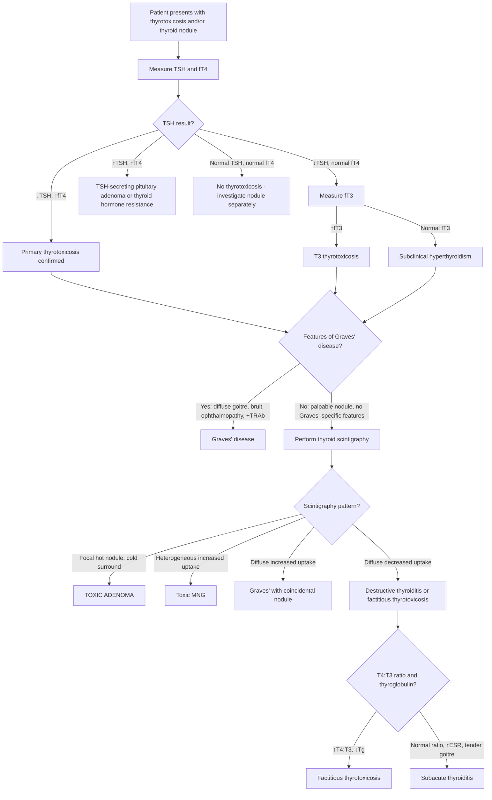

## Differential Diagnosis of Toxic Adenoma

### Framing the Problem

When a patient presents with a **thyroid nodule** and/or **thyrotoxicosis**, you are not immediately handed the diagnosis of "toxic adenoma" on a silver platter. You need to systematically work through the differential. The DDx spans two overlapping clinical problems:

1. **What is causing the thyrotoxicosis?** (if TFTs are deranged)
2. **What is this thyroid nodule?** (if a lump is palpable or found incidentally)

These two questions converge — a toxic adenoma sits at the intersection — but they each have their own differential list, and occasionally a patient has both a non-functioning nodule AND a separate cause of thyrotoxicosis (e.g. Graves' disease with a coincidental cold nodule). The clinical and investigative challenge is to determine whether the nodule IS the cause of the thyrotoxicosis, or whether they are unrelated.

---

### A. Differential Diagnosis of Thyrotoxicosis (↓TSH with ↑fT4/T3)

This is the framework from the evaluation flowchart [7]. When you confirm biochemical thyrotoxicosis, you must determine the **aetiology** — is the thyroid hyperactive (true hyperthyroidism), is stored hormone leaking out (destructive thyroiditis), or is the patient taking exogenous hormone?

#### Systematic Classification of Causes of Thyrotoxicosis

| Category | Condition | Key Distinguishing Features |
|---|---|---|
| **Primary hyperthyroidism** (thyroid overactive) | ***Graves' disease*** | ***Diffuse toxic goitre*** with bruit; ***ophthalmopathy, pretibial myxoedema*** [3]; TRAb positive; scintigraphy: ***diffuse ↑uptake*** [5] |
| | ***Toxic multinodular goitre (Plummer's)*** [1] | Multiple palpable nodules; usually **older patients**; scintigraphy: ***heterogeneous ↑uptake*** [5]; long-standing MNG with autonomous nodules |
| | **Toxic adenoma** (the index condition) | **Solitary** palpable nodule; **no Graves'-specific signs**; scintigraphy: ***focal ↑uptake with ↓uptake elsewhere*** [5][8] |
| | Metastatic thyroid cancer (rare) | Large tumour burden of well-differentiated follicular CA with functioning metastases |
| | ***Mutation of TSH receptor*** (germline) [2] | Familial non-autoimmune hyperthyroidism; presents in childhood; diffuse goitre |
| | ***Mutation of Gsα (McCune-Albright syndrome)*** [2] | Polyostotic fibrous dysplasia, café-au-lait spots, precocious puberty; mosaic activating GNAS1 mutation |
| **Secondary hyperthyroidism** (TSH-driven) | ***TSH-secreting pituitary adenoma*** [2][7] | ***↑TSH, ↑fT4, ↑T3*** [7] — TSH is NOT suppressed (this is the distinguishing biochemical clue); may have visual field defects from pituitary mass |
| | ***Chorionic gonadotropin-secreting tumour*** [2] | hCG structurally mimics TSH → stimulates TSH-R; associated with hydatidiform mole or choriocarcinoma |
| | ***Gestational thyrotoxicosis*** [2] | Physiological ↑hCG in early pregnancy (peak 10–12 weeks) → transient TSH suppression; usually mild and self-limiting; associated with hyperemesis gravidarum |
| **Thyrotoxicosis WITHOUT hyperthyroidism** (destructive or exogenous) | ***Subacute (De Quervain's) thyroiditis*** [2] | ***Preceding URTI, fever, tender goitre*** [3]; self-limiting thyrotoxic → hypothyroid → recovery phases; scintigraphy: ***diffuse ↓uptake*** [5] |
| | ***Silent/painless thyroiditis*** | Autoimmune; painless goitre; scintigraphy: diffuse ↓uptake |
| | ***Postpartum thyroiditis*** | ***Recent ( < 6 months) pregnancy*** [3]; same triphasic course as silent thyroiditis |
| | ***Destructive thyroiditis (amiodarone, irradiation)*** [2] | Drug/radiation-induced follicular destruction → release of stored T3/T4; scintigraphy: ↓uptake |
| | ***Levothyroxine (T4) overdose / factitious thyrotoxicosis*** [2] | ***Intake of ANY medications (esp slimming pills)*** [3]; ***confirmed by ↑T4:T3 ratio ( > 70:1 vs 30:1 in conventional thyrotoxicosis) and ↓serum thyroglobulin*** [5] |

<Callout title="Why Does the T4:T3 Ratio Help Identify Factitious Thyrotoxicosis?" type="idea">
In endogenous hyperthyroidism, the thyroid gland secretes both T4 and T3 directly (and T3 is also produced by peripheral deiodination of T4). In exogenous T4 ingestion, the patient's own thyroid is suppressed (no endogenous T3 secretion), and ALL circulating T3 comes from peripheral conversion of the ingested T4. Since conversion is rate-limited, the T4:T3 ratio becomes disproportionately elevated ( > 70:1). Additionally, the suppressed thyroid produces no thyroglobulin → ***↓serum thyroglobulin*** [5].
</Callout>

---

### B. Differential Diagnosis of a Thyroid Nodule

***Around 10–15% of nodules are malignant*** [6] — the majority are benign. Here is the systematic DDx of a thyroid nodule:

| Category | Differential | Key Features |
|---|---|---|
| ***Solitary nodule*** [6] | ***Dominant nodule in MNG*** | On careful examination or USG, additional nodules are present in the contralateral lobe or isthmus |
| | ***Cyst: true simple cyst, colloid nodule*** [6] | Fluctuant; USG shows anechoic fluid-filled structure; usually euthyroid |
| | ***Neoplastic: adenoma (non-toxic)*** [1][6] | ***Benign follicular adenoma: mainly non-toxic (15%)*** [1]; encapsulated, smooth; euthyroid; scintigraphy: "warm" or "cold" |
| | **Toxic adenoma** [6] | Solitary functioning nodule; thyrotoxicosis; scintigraphy: hot nodule with suppressed surround |
| | ***Carcinoma*** [6] | Papillary (85%), follicular (10–15%), medullary (3%), anaplastic (1%) [6]; hard, irregular, fixed; cervical lymphadenopathy; scintigraphy: "cold" nodule |
| ***Multiple nodules*** [6] | ***MNG (hyperplastic/adenomatous nodules with varying degree of cystic degeneration)*** [6] | Most common cause of multiple thyroid nodules; may be euthyroid or toxic |
| | ***Toxic MNG*** [6] | Multiple autonomously functioning nodules; scintigraphy: heterogeneous ↑uptake |
| | ***Multiple adenomas*** | Less common; multiple encapsulated nodules |
| ***Diffuse*** [6] | ***Graves' disease*** | Diffuse goitre + thyroid bruit + ophthalmopathy; TRAb positive |
| | ***Physiological (pregnancy, puberty)*** [6] | Mild diffuse enlargement; euthyroid or mildly hyperthyroid |
| | ***Hashimoto's thyroiditis*** [6] | Firm, rubbery goitre; hypothyroid (or euthyroid early); anti-TPO and anti-Tg positive |
| | ***De Quervain's/subacute thyroiditis*** [6] | Tender, diffuse goitre; post-viral; elevated ESR |

> **High Yield**: ***Thyroid nodule pathology*** [1]: ***Nodular goitre: colloid/haemorrhagic cystic/complex/hyperplastic/adenomatous nodule (70%); Benign follicular adenoma: mainly non-toxic (15%); Well-differentiated thyroid carcinoma (10%); Miscellaneous: other thyroid malignancies, thyroiditis (5%)*** [1].

---

### C. The Critical Overlap: Thyrotoxicosis + Thyroid Nodule

This is the key clinical scenario where the DDx becomes most relevant. When a patient presents with **↓TSH AND a thyroid nodule**, you must distinguish between:

| Scenario | Scintigraphy Finding | Interpretation |
|---|---|---|
| **Toxic adenoma** | ***Focal ↑uptake with ↓uptake elsewhere*** [5][8] | The nodule IS the cause of thyrotoxicosis |
| **Toxic MNG** | ***Heterogeneous ↑uptake*** [5][8] | Multiple hot nodules causing thyrotoxicosis |
| **Graves' disease with coincidental nodule** | ***Diffuse ↑uptake*** [5][8] with nodule that may be hot, warm, or cold | Graves' is causing the thyrotoxicosis; the nodule is incidental. If the nodule is COLD against a diffusely hot background, it may harbour malignancy → needs FNAC |
| **Non-functioning nodule with unrelated thyrotoxicosis** | Cold nodule + other pattern | The nodule is NOT causing the thyrotoxicosis; investigate both separately |

<Callout title="This is WHY Thyroid Scintigraphy is Essential" type="error">
***In the event of ↓TSH with thyroid nodule(s), thyroid scintigraphy is indicated to differentiate between Graves' disease with co-existent thyroid nodule, toxic thyroid adenoma, and toxic MNG*** [5]. Without scintigraphy, you cannot reliably determine whether the nodule is functioning (hot) or non-functioning (cold). This distinction is critical because: (1) ***hot nodules are almost never malignant*** [5] → FNAC may be deferred; (2) cold nodules in a thyrotoxic patient may represent cancer and NEED FNAC; (3) management differs completely between these entities.
</Callout>

---

### D. Differentiating Toxic Adenoma from Its Closest Mimics

#### 1. Toxic Adenoma vs Graves' Disease

| Feature | Toxic Adenoma | Graves' Disease |
|---|---|---|
| **Goitre** | Solitary nodule | Diffuse, smooth, non-tender goitre |
| **Thyroid bruit** | Absent | Often present (increased vascularity) |
| ***Ophthalmopathy*** [9] | **Absent** | Present in ~20–25% (exophthalmos, ophthalmoplegia, chemosis) |
| ***Pretibial myxoedema*** | **Absent** | Present in < 10% |
| **TRAb** | **Negative** | Positive (~100% in active disease) [3] |
| **Scintigraphy** | ***Focal ↑uptake, ↓surround*** [5][8] | ***Diffuse ↑uptake*** [5][8] |
| **Demographics** | Older (30–60), often in nodular thyroid disease | Younger (20–50), women of reproductive age [3] |
| **Thyrotoxic periodic paralysis** | Possible (any cause of thyrotoxicosis) | More commonly associated [3] |

**Why this matters**: Management is different. Graves' may be treated with a trial of antithyroid drugs for 12–18 months with a chance of remission. ***Toxic adenoma is unlikely to remit with antithyroid drugs*** — they merely control symptoms while you are taking them, and ***recur upon discontinuation*** [6]. Definitive treatment (surgery or RAI) is usually needed.

#### 2. Toxic Adenoma vs Toxic MNG

| Feature | Toxic Adenoma | Toxic MNG |
|---|---|---|
| **Number of nodules** | Single | Multiple |
| **Palpation** | Solitary, discrete nodule | Irregular, multinodular gland |
| **Scintigraphy** | ***Focal ↑uptake*** [8] | ***Heterogeneous ↑uptake*** [5] |
| **Typical patient** | Younger than toxic MNG | Older, long-standing goitre |
| **Surgery** | ***Hemithyroidectomy (if no evidence of nodules in contralateral lobe)*** [6] | ***Total thyroidectomy*** [6] |

#### 3. Toxic Adenoma vs Thyroid Carcinoma (Cold Nodule)

| Feature | Toxic Adenoma | Thyroid Carcinoma |
|---|---|---|
| **Scintigraphy** | **Hot** (functioning) | **Cold** (non-functioning) |
| **Consistency** | Smooth, firm, encapsulated | Hard, irregular, may be fixed |
| **Cervical lymphadenopathy** | Absent | May be present (especially papillary CA → level VI) [6] |
| **Hoarseness** | Very rare (benign lesion) | Possible (RLN invasion) |
| **Malignancy risk** | < 1–2% | By definition |
| **TFTs** | Thyrotoxic (↓TSH, ↑fT4) | Usually euthyroid |
| **Microcalcifications on USG** | Absent | Psammoma bodies in papillary CA |

#### 4. Toxic Adenoma vs Subacute (De Quervain's) Thyroiditis

| Feature | Toxic Adenoma | Subacute Thyroiditis |
|---|---|---|
| **Pain** | Painless (unless haemorrhage) | ***Tender goitre; pain may radiate to angle of jaw and ears*** [4] |
| **Onset** | Gradual (months) | Acute/subacute (weeks), ***preceded by URTI*** [3][4] |
| **Systemic symptoms** | Absent | ***Fever, ↑WBC, ↑ESR*** [4] |
| **Scintigraphy** | ***Focal ↑uptake*** [8] | ***Diffuse ↓uptake*** [5] (damaged follicles cannot trap iodine) |
| **Course** | Persistent/progressive | ***Self-limiting: thyrotoxic → hypothyroid → resolution*** [4] |
| **Management** | Definitive Tx needed | ***Self-limiting → do NOT give antithyroid medications*** [4] |

#### 5. Toxic Adenoma vs Factitious Thyrotoxicosis

| Feature | Toxic Adenoma | Factitious Thyrotoxicosis |
|---|---|---|
| **Thyroid gland** | Palpable nodule | Usually normal or small (suppressed) |
| **Scintigraphy** | Focal ↑uptake | ***Diffuse ↓uptake*** [5] (exogenous hormone suppresses all thyroid function) |
| **T4:T3 ratio** | Normal (~30:1) | ***↑ ( > 70:1)*** [5] |
| **Serum thyroglobulin** | Normal or elevated | ***↓ (suppressed)*** [5] |
| **History** | — | ***Intake of ANY medications (esp slimming pills)*** [3] |

---

### E. Diagnostic Algorithm — Approach to Thyrotoxicosis with a Thyroid Nodule

This algorithm integrates the evaluation of thyrotoxicosis flowchart [7] with scintigraphy findings [5][8]:

---

### F. Red Flags — When a "Toxic Adenoma" May Not Be What It Seems

| Red Flag | Think Instead |
|---|---|
| **Rapidly enlarging nodule with pain and hoarseness** | ***Anaplastic carcinoma*** [3] (although extremely rare to be hot on scintigraphy) |
| **Cervical lymphadenopathy** | Thyroid carcinoma (papillary or medullary) |
| **Ophthalmopathy or pretibial myxoedema present** | Graves' disease (even if a nodule is palpable — it may be a coincidental non-functioning nodule) |
| **Diffuse ↓uptake on scintigraphy** | Not a toxic adenoma — think destructive thyroiditis or factitious thyrotoxicosis |
| **Family history of MEN2, RET mutation** | Medullary thyroid carcinoma (cold nodule, may present with elevated calcitonin) |
| **History of head & neck irradiation** | ↑risk of papillary thyroid carcinoma |
| ***Clinical features suggesting ↑risk of malignancy***: ***Male sex; Age < 14y or > 70y; Solitary firm/hard fixed nodule with progressive growth; Pressure symptoms/RLN palsy; Cervical LNs; Neck irradiation; FHx thyroid CA*** [3] | All warrant careful evaluation even if initial TFTs suggest thyrotoxicosis — a cold nodule adjacent to a hot one can be missed |

---

<Callout title="High Yield Summary">

1. **The DDx of toxic adenoma spans two clinical problems**: (a) causes of thyrotoxicosis, and (b) causes of a thyroid nodule. Toxic adenoma sits at the intersection.

2. **Thyroid scintigraphy is the pivotal investigation** when ↓TSH + nodule: ***focal ↑uptake with ↓uptake elsewhere = toxic adenoma; heterogeneous ↑uptake = toxic MNG; diffuse ↑uptake = Graves'; diffuse ↓uptake = destructive thyroiditis/factitious*** [5][8].

3. ***Graves' disease*** is the main DDx — distinguished by ***diffuse goitre with bruit, ophthalmopathy, pretibial myxoedema, positive TRAb, diffuse ↑uptake*** [3][5].

4. **Toxic MNG** is distinguished by ***multiple nodules*** and ***heterogeneous uptake*** on scintigraphy [5].

5. **Subacute thyroiditis** is distinguished by ***tender goitre, preceding URTI, fever, ↑ESR, diffuse ↓uptake*** [3][4][5].

6. **Factitious thyrotoxicosis**: ***↑T4:T3 ratio ( > 70:1), ↓thyroglobulin, diffuse ↓uptake, history of medication/slimming pills*** [3][5].

7. ***Hot nodules are almost never malignant*** [5] — but a COLD nodule in a thyrotoxic patient (e.g. Graves' with coincidental nodule) DOES need FNAC.

8. ***Around 10–15% of thyroid nodules are malignant*** [6] — always consider malignancy in the DDx of any thyroid nodule, especially if hard, irregular, fixed, with lymphadenopathy or hoarseness.

</Callout>

---

<ActiveRecallQuiz
  title="Active Recall - Differential Diagnosis of Toxic Adenoma"
  items={[
    {
      question: "A patient has suppressed TSH and a palpable thyroid nodule but NO ophthalmopathy or diffuse goitre. What is the single most important next investigation and what are the four possible scintigraphy patterns you might see?",
      markscheme: "Thyroid scintigraphy. Four patterns: (1) Focal increased uptake with cold surround = toxic adenoma; (2) Heterogeneous increased uptake = toxic MNG; (3) Diffuse increased uptake = Graves' with coincidental nodule; (4) Diffuse decreased uptake = destructive thyroiditis or factitious thyrotoxicosis.",
    },
    {
      question: "How do you biochemically distinguish factitious thyrotoxicosis from toxic adenoma?",
      markscheme: "Factitious: T4:T3 ratio elevated more than 70:1 (vs ~30:1 in endogenous thyrotoxicosis), serum thyroglobulin is suppressed/low, scintigraphy shows diffuse decreased uptake. Toxic adenoma: normal T4:T3 ratio, normal/elevated thyroglobulin, focal hot nodule on scintigraphy.",
    },
    {
      question: "A thyrotoxic patient has a palpable nodule and diffuse increased uptake on scintigraphy. What is the most likely diagnosis and what should you do about the nodule?",
      markscheme: "Most likely Graves' disease with a coincidental thyroid nodule. The nodule should be assessed by ultrasound. If it appears cold against the diffusely hot background and/or has suspicious USG features, FNAC is indicated because cold nodules carry a risk of malignancy.",
    },
    {
      question: "Why is subacute thyroiditis unlikely to be confused with toxic adenoma on scintigraphy, and why must you NOT give antithyroid drugs for subacute thyroiditis?",
      markscheme: "Subacute thyroiditis shows diffuse decreased uptake (damaged follicles cannot trap iodine) vs focal increased uptake in toxic adenoma. Antithyroid drugs block new hormone synthesis, but in subacute thyroiditis the thyrotoxicosis is from release of preformed stored hormone from damaged follicles, not from new synthesis. Hence ATDs are ineffective and unnecessary; the condition is self-limiting.",
    },
    {
      question: "List three clinical features that, if present alongside a thyroid nodule, should raise suspicion for thyroid malignancy rather than a benign toxic adenoma.",
      markscheme: "Any three of: (1) Hard, irregular, fixed nodule; (2) Cervical lymphadenopathy especially level VI; (3) Hoarseness/RLN palsy; (4) Rapid enlargement; (5) History of neck irradiation; (6) Family history of thyroid CA or MEN2; (7) Male sex; (8) Age less than 14 or more than 70 years.",
    },
  ]}
/>

## References

[1] Lecture slides: GC 177. A thyroid nodule benign thyroid nodules; thyroid cancer.pdf (p4–5, p13)
[2] Senior notes: felixlai.md (Section III — Causes of thyrotoxicosis)
[3] Senior notes: Ryan Ho Endocrine.pdf (p12, p17–18, p23)
[4] Senior notes: Ryan Ho Endocrine.pdf (p31 — Thyroiditis)
[5] Senior notes: Adrian Lui Pediatrics.pdf (p271–272 — Etiological Ix, Thyroid scintigraphy)
[6] Senior notes: maxim.md (Approach to thyroid nodules — DDx, Thyrotoxicosis indications, Thyroid cancer)
[7] Senior notes: felixlai.md (Section V — Diagnostic protocol, Evaluation of thyrotoxicosis flowchart)
[8] Lecture slides: GC 177. A thyroid nodule benign thyroid nodules; thyroid cancer.pdf (p13 — Radio-isotope scintigraphy images)
[9] Senior notes: Ryan Ho Opthalmology.pdf (p128 — Dysthyroid Eye Disease)
