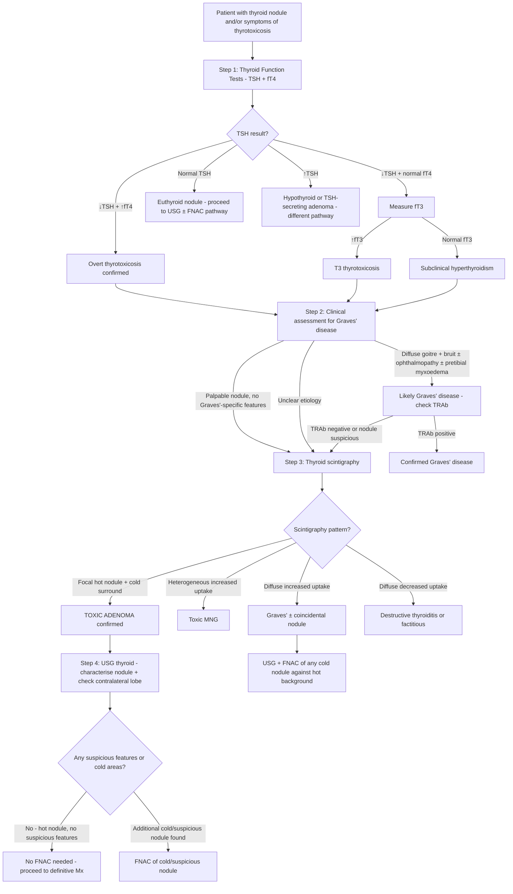
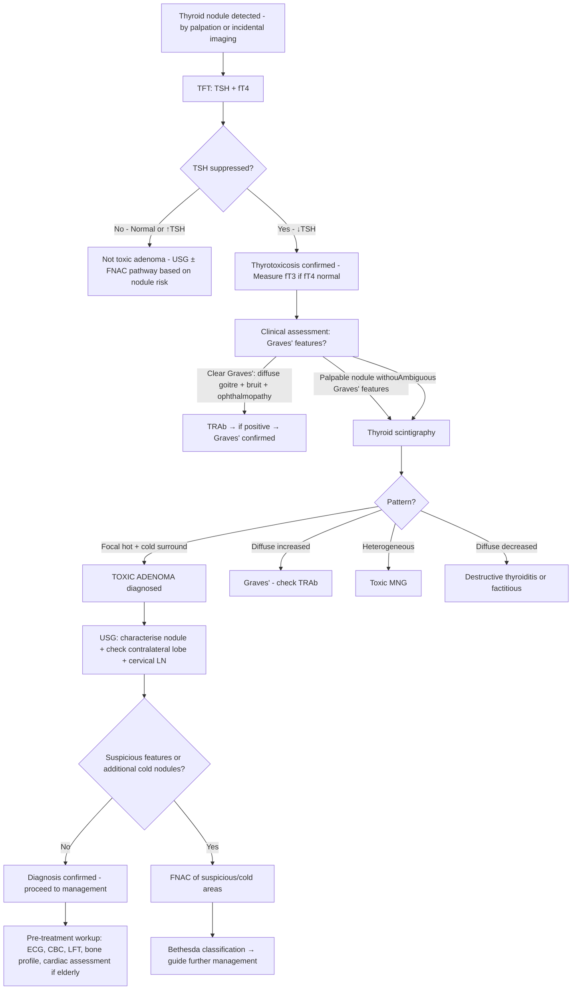

## Diagnostic Criteria, Diagnostic Algorithm, and Investigation Modalities for Toxic Adenoma

### Framing the Diagnostic Approach

There is no single "diagnostic criterion" for toxic adenoma in the way there is for, say, rheumatoid arthritis or diabetes. Instead, the diagnosis is established by a **convergence of evidence** from three pillars:

1. **Biochemical confirmation of thyrotoxicosis** (TFTs)
2. **Demonstration that a thyroid nodule is autonomously functioning** (scintigraphy)
3. **Exclusion of other causes** (clinical features, TRAb, USG)

Think of it as a jigsaw: you need each piece to fit together. Let me walk through the diagnostic criteria, the stepwise algorithm, and every investigation modality in detail.

---

## 1. Diagnostic Criteria for Toxic Adenoma

While there is no formalised "checklist," the diagnosis of toxic adenoma rests on fulfilling ALL of the following:

| Criterion | What You Need | Why |
|---|---|---|
| **1. Biochemical thyrotoxicosis OR subclinical hyperthyroidism** | ***↓TSH (usually undetectable) ± ↑fT4 and/or ↑T3*** [3][5] | The autonomous nodule is producing excess hormone → negative feedback suppresses TSH. Small nodules may only suppress TSH without elevating fT4/T3 (subclinical). |
| **2. A thyroid nodule present** | Palpable solitary nodule on examination and/or nodule on USG | There must be a structural lesion — otherwise you are dealing with Graves' or thyroiditis |
| **3. Scintigraphy showing a hyperfunctioning ("hot") nodule with suppressed surrounding tissue** | ***Focal ↑uptake with ↓uptake elsewhere → toxic adenoma*** [5][8] | This is the **pathognomonic** finding. It proves the nodule is autonomously producing hormone AND that the rest of the gland is suppressed (no TSH stimulation). This pattern excludes Graves' (diffuse uptake) and toxic MNG (heterogeneous uptake). |
| **4. Absence of Graves'-specific features** | No ophthalmopathy, no pretibial myxoedema, no diffuse goitre with bruit, TRAb negative | If present, the diagnosis is Graves' disease ± a coincidental nodule |

<Callout title="The Scintigraphy is the Diagnostic Cornerstone">
Without scintigraphy, you CANNOT definitively diagnose a toxic adenoma. A suppressed TSH + a palpable nodule could still be Graves' disease with a coincidental nodule, or a toxic MNG with one dominant nodule. ***Thyroid scintigraphy is indicated in the event of ↓TSH with thyroid nodule(s) to differentiate between Graves' disease with co-existent thyroid nodule, toxic thyroid adenoma, and toxic MNG*** [5][3]. The focal hot nodule with cold surround is pathognomonic.
</Callout>

### Overt vs Subclinical Presentation

| | Overt Toxic Adenoma | Subclinical Toxic Adenoma |
|---|---|---|
| **TSH** | ***↓ (usually undetectable)*** [3][5] | ***↓ (suppressed but may be detectable)*** [3] |
| **fT4** | **↑** | ***Normal*** [3] |
| **T3** | **↑** (may be elevated before fT4 — "T3 thyrotoxicosis") | ***Normal*** [3] |
| **Symptoms** | Present (weight loss, palpitations, tremor, etc.) | Often absent or subtle |
| **Nodule size** | Typically > 3 cm | Often 2–3 cm |
| **Clinical significance** | Requires treatment | Monitor vs treat depending on risk (see below) |

> **High Yield**: ***↓TSH, normal fT3, normal fT4 = subclinical hyperthyroidism*** [3][5]. If fT4 is normal but TSH is suppressed, **always measure fT3** — some toxic adenomas preferentially secrete T3 ("T3 thyrotoxicosis") [7].

---

## 2. Comprehensive Diagnostic Algorithm

Here is the complete stepwise approach, from initial presentation to confirmed diagnosis:

### Explanation of Each Step (First Principles)

**Step 1 — TFT (TSH + fT4)**: ***TSH is the most sensitive test*** [3][5] because the hypothalamic-pituitary-thyroid axis amplifies small changes in thyroid hormone levels into large changes in TSH. Even a small autonomous hormone production will suppress TSH before fT4 rises above normal. That's why TSH is your screening gatekeeper.

**Step 2 — Clinical Assessment**: Before ordering expensive investigations, **look at the patient**. Graves' disease has specific autoimmune stigmata (ophthalmopathy, pretibial myxoedema, diffuse bruit) that toxic adenoma does not. If these are present and obvious, TRAb confirms Graves' and you may not even need scintigraphy.

**Step 3 — Thyroid Scintigraphy**: This is the **pivotal investigation** [5][8][10]. It is ***NOT recommended for routine diagnostic use*** [10] — it is specifically indicated when ***↓TSH level + thyroid nodule(s)*** [10][3]. Why? Because:
- If TSH is normal or elevated, the nodule **cannot** be hyperfunctioning (TSH is not suppressed, so there's no autonomous production overriding the axis). In euthyroid patients, you go straight to USG ± FNAC [10].
- If TSH IS suppressed, you need to know whether the nodule is the source of the excess hormone.

**Step 4 — USG Thyroid**: Even though ***hot nodules almost never require FNAC*** [5][10], you still do USG to:
- Characterise the nodule (size, composition)
- Check the **contralateral lobe** for additional nodules (this affects surgical planning — hemithyroidectomy vs total thyroidectomy)
- Identify any **additional cold nodules** that may need FNAC

---

## 3. Investigation Modalities — Detailed Breakdown

### 3A. Blood Tests

#### Thyroid Function Tests (TFTs)

***Blood tests: TSH + free T4*** [1] — this is the first-line investigation for every thyroid patient.

| Test | Expected Finding in Toxic Adenoma | Explanation |
|---|---|---|
| **Serum TSH** (ultrasensitive) | ***↓ or undetectable*** [3][5] | Autonomous T3/T4 production → negative feedback on thyrotrophs → TSH suppression. The pituitary is exquisitely sensitive — TSH drops before peripheral hormones rise above normal. |
| **Free T4 (fT4)** | **↑ in overt; normal in subclinical** | The autonomous nodule secretes T4 (and some T3). T4 is the major secretory product. |
| **Free T3 (fT3)** | **↑ in overt; may be elevated before fT4** | Some toxic adenomas have enhanced deiodination (T4→T3 conversion) within the nodule, leading to **T3 thyrotoxicosis** where T3 rises before T4. ***T3 should be checked if suspected hyperthyroidism with concurrent illness*** [3] to distinguish from sick euthyroid syndrome. |

**Interpretation of TFT Patterns** [3][5][7]:

| Pattern | Interpretation |
|---|---|
| ***↓TSH, ↑fT4, ↑T3*** | ***Diagnostic of thyrotoxicosis (TSH usually undetectable)*** [3] |
| ***↓TSH, normal fT4, normal T3*** | ***Subclinical hyperthyroidism*** [3] |
| ***↓TSH, normal fT4, ↑T3*** | **T3 thyrotoxicosis** — measure T3 whenever fT4 is normal but TSH is suppressed |
| ***↑TSH, ↑fT4, ↑T3*** | ***TSH-dependent hyperthyroidism (very rare, due to TSH-secreting pituitary adenomas)*** [3] — this is NOT toxic adenoma |

<Callout title="Pitfall: Don't Forget to Measure T3!" type="error">
If TSH is suppressed but fT4 is normal, many students stop and call it "subclinical hyperthyroidism." But you MUST measure fT3 — it may be elevated (T3 thyrotoxicosis), which changes the clinical picture. ***Sick euthyroidism can also cause low TSH with low/normal fT4*** [3] — but in that setting, ***T3 is usually low*** [3] (because peripheral T4→T3 conversion is impaired by illness), which is the opposite of T3 thyrotoxicosis. Checking T3 helps distinguish the two.
</Callout>

#### Other Confounding Factors to Consider [3]

| Condition | TFT Pattern | How to Distinguish |
|---|---|---|
| ***Central hypothyroidism (pituitary/hypothalamic insufficiency)*** | ↓TSH, ↓/normal fT4 | fT4 is LOW, not high; clinical context of hypopituitarism |
| ***Sick euthyroidism*** | ***TSH low/low-normal, fT4 low/normal/high, T3 usually low*** [3] | Concurrent systemic illness; T3 characteristically low |
| ***Pregnancy*** | ↓TSH (1st trimester) due to hCG mimicking TSH | Transient; usually mild; clinical context |

#### Thyrotropin Receptor Antibodies (TRAb)

***TRAb (anti-TSHr): sensitivity 97%, specificity 99% with newer assays*** [3][5].

| Scenario | TRAb Result | Interpretation |
|---|---|---|
| **Toxic adenoma** | **Negative** | No autoimmune pathology — the nodule functions autonomously due to somatic mutation, not antibody stimulation |
| **Graves' disease** | **Positive** | TRAb stimulates TSH-R on all follicular cells → diffuse hyperthyroidism |
| **Graves' with coincidental nodule** | **Positive** | This scenario requires scintigraphy to determine whether the nodule is hot or cold |

TRAb is ***not routinely done*** [3] when the clinical picture is clear (e.g. obvious solitary hot nodule on scintigraphy). However, it is essential when:
- The clinical picture is ambiguous (is this Graves' with a nodule, or a toxic adenoma?)
- A ***diffuse toxic goitre with negative TRAb*** is found → suggests destructive thyroiditis, not Graves' [3][5]

---

### 3B. Thyroid Scintigraphy (Radionuclide Scan)

This is the **key etiological investigation** for toxic adenoma [5][8][10][11].

#### Principles [11]

- ***Main use: assess metabolic function of thyroid gland*** [11]
- ***Principle: radioactive iodine is handled in the same manner as normal iodine. Level of uptake (and hence metabolic activity) reflected by localisation of radioactive iodine*** [11]
- A nodule that is "hot" is avidly trapping iodine → it is metabolically active → functioning autonomously
- A nodule that is "cold" is NOT trapping iodine → it is non-functional → needs evaluation for malignancy

#### Radiopharmaceuticals [11]

| Agent | Mechanism | Pros | Cons |
|---|---|---|---|
| ***99mTc pertechnetate*** | ***Iodine trapping only*** [11] — ***has a similar ionic size as iodide ion, allowing it to be taken up by NIS*** [11] | Widely available, quick, low cost, low radiation dose | Only shows trapping, NOT organification; rare discordant nodules (trap but don't organify) |
| ***123I*** | ***Trapping + organification*** [11] | More physiological; shows full iodine metabolism | More expensive, less available |
| ***131I*** | ***Trapping + organification*** [11] | Can be used for both diagnosis and therapy | Higher radiation dose; β-emission causes tissue damage; mainly used therapeutically |

#### Indications [5][10][11]

***Thyroid scintigraphy is NOT recommended for routine diagnostic use*** [10]. It is specifically indicated in:

1. ***↓TSH level + thyroid nodule(s)*** [10][3] — to determine functional status:
   - ***↓TSH level indicates overt or subclinical hyperthyroidism and radionuclide scan can confirm whether this is due to a thyroid nodule that is hyperfunctioning (hot)*** [10]
2. ***Multinodular goitre*** — to determine functional status of different nodules [10]
3. ***When suspecting destructive thyroiditis*** [5]
4. ***Diffuse toxic goitre with negative TRAb*** [5] — to differentiate Graves' from thyroiditis

***Not performed in euthyroid (normal TSH) or ↑TSH patients since the thyroid nodule will never be hyperfunctioning and will require USG ± FNAC to confirm anyways*** [10].

#### Scintigraphy Patterns and Interpretation [5][8]

| Scintigraphy Pattern | Diagnosis | Explanation |
|---|---|---|
| ***Focal ↑uptake with ↓uptake elsewhere*** | ***→ Toxic adenoma*** [5][8] | The autonomous nodule avidly traps iodine; the suppressed normal tissue (no TSH stimulation) does not |
| ***Diffuse ↑uptake*** | ***→ Graves' disease vs secondary hyperthyroidism*** [5] | In Graves', TRAb stimulates ALL follicular cells uniformly → entire gland is hyperactive |
| ***Heterogeneous ↑uptake*** | ***→ Toxic MNG*** [5] | Multiple nodules with varying degrees of autonomous function |
| ***Diffuse ↓uptake*** | ***→ Destructive thyroiditis vs factitious thyrotoxicosis*** [5] | In destructive thyroiditis, follicles are damaged → cannot trap iodine. In factitious, TSH is suppressed → whole gland is quiescent. Distinguish by: ***factitious confirmed by ↑T4:T3 ratio and ↓serum thyroglobulin*** [5] |

***Images are often obtained at anterior, left anterior oblique (LAO) and right anterior oblique (RAO)*** [11].

> **High Yield**: ***Radio-isotope scintigraphy (I123 or Tc99m) — diagnosis of malignancy: low sensitivity and specificity — functional assessment in thyrotoxic patients*** [8]. In other words, scintigraphy is NOT good for diagnosing cancer (many benign nodules are also cold), but it IS the gold standard for determining functional status.

<Callout title="Why Hot Nodules Don't Need FNAC" type="idea">
***Hyperfunctioning (hot) nodules (uptake is greater than surrounding thyroid tissues) are almost never malignant and hence do NOT require FNAC*** [10]. ***Cold nodules (uptake is less than surrounding thyroid tissues) have 10–20% risk of being cancer and hence require FNAC provided that sonographic criteria are met*** [10]. The biological reason: TSHR/Gsα mutations that drive toxic adenomas promote differentiation and function (iodine uptake), while cancer-driving mutations (BRAF, RAS) promote dedifferentiation and loss of iodine-handling capacity. A functioning nodule is, by its very nature, well-differentiated and almost certainly benign.
</Callout>

---

### 3C. Thyroid Ultrasound (USG)

***USG thyroid: routine for ALL goitre/nodules*** [3][6][12] — this is a first-line investigation for any thyroid lump, regardless of TFT results.

#### Role in Toxic Adenoma [3][6]

| Purpose | Details |
|---|---|
| **Characterise the nodule** | Size, composition (solid/cystic/mixed), echogenicity, margins, vascularity, calcifications |
| **Assess contralateral lobe** | Check for additional nodules → affects surgical decision (hemithyroidectomy if contralateral lobe clear vs total thyroidectomy if bilateral nodules) [6] |
| **Cervical lymph nodes** | ***Cervical LN (esp deep nodes, e.g. level VI nodes)*** [6] — evaluate for suspicious lymphadenopathy |
| **Assess retrosternal extension** | Important if the nodule is large or the lower border is not palpable |
| **Guide FNAC** | If any cold or suspicious area needs biopsy |

#### Typical USG Appearance of a Toxic Adenoma

| Feature | Expected Finding | Explanation |
|---|---|---|
| **Composition** | Well-defined, solid or mixed (solid with cystic areas from degeneration) | Follicular adenomas are encapsulated neoplasms |
| **Echogenicity** | Isoechoic or hyperechoic | Well-differentiated follicular tissue; hypoechoic raises concern for malignancy |
| **Margins** | Smooth, well-defined with complete halo | The halo represents the compressed capsule; irregular margins suggest malignancy |
| **Calcifications** | Usually absent; may have coarse calcifications (benign) | ***Microcalcifications*** raise concern for papillary carcinoma (Psammoma bodies) |
| **Vascularity** | Increased peripheral ("ring") vascularity | Hyperfunctioning nodule has increased blood flow; intranodular vascularity is more concerning for malignancy |
| **Shape** | Wider than tall | ***Taller than wide*** shape is suspicious for malignancy [10][12] |

#### Sonographic Features Suspicious for Malignancy [10][12]

This is important because even though the nodule is likely a hot adenoma, you need to know what to look for in case there is an ADDITIONAL suspicious nodule:

| ***High risk of thyroid cancer*** [10] | ***Low risk of thyroid cancer*** [10] |
|---|---|
| ***Hypoechoic*** | ***Hyperechoic*** |
| ***Microcalcifications*** | ***Large coarse calcifications*** |
| ***Taller than wide*** | ***Wider than tall*** |
| ***Irregular margins / Incomplete halo*** | ***Spongiform appearance / Comet-tail shadowing*** |
| ***Central vascularity*** | ***Peripheral vascularity*** |

***Sonographic features suspicious of malignancy: "SHIT CME"*** [6] — mnemonic for: **S**olid, **H**ypoechoic, **I**rregular margins, **T**aller than wide, **C**alcification (micro), **M**icrolobulated, **E**xtrathyroidal extension — ***most important are solid and hypoechoic*** [6].

---

### 3D. Fine Needle Aspiration Cytology (FNAC)

***FNAC is the single most important investigation for thyroid nodule if TSH is not depressed*** [3][12]. However, in the specific context of a **confirmed hot nodule on scintigraphy**, FNAC is **usually NOT required**.

#### When FNAC IS and IS NOT Needed

| Scenario | FNAC Needed? | Rationale |
|---|---|---|
| **Confirmed hot nodule on scintigraphy** | ***No — hot nodules do NOT require FNAC*** [10] | < 1–2% malignancy risk; the nodule is autonomous and well-differentiated |
| **Cold nodule on scintigraphy** | ***Yes — cold nodules require FNAC*** [10] | ***10–20% risk of being cancer*** [10] |
| **Euthyroid nodule (normal TSH, no scintigraphy done)** | Yes — based on USG risk stratification | Scintigraphy was not indicated (TSH normal), so functional status is unknown → FNAC based on USG features |
| **Additional cold nodule found alongside hot nodule** | Yes | The hot nodule is benign, but the cold nodule could be malignant |

#### Bethesda Classification [10][3][12]

If FNAC IS performed (e.g. on an additional suspicious cold nodule), results are reported using the **Bethesda System**:

| ***Class*** | ***Diagnostic Category*** | ***Cancer Risk*** | ***Management*** |
|---|---|---|---|
| ***I*** | ***Non-diagnostic*** | ***1–4%*** | ***Repeat FNA*** [10] |
| ***II*** | ***Benign*** | ***0–3%*** | ***Clinical follow-up*** [10] |
| ***III*** | ***AUS or FLUS*** | ***5–15%*** | ***Repeat FNA / Molecular testing / HemiT if AUS ×2*** [3] |
| ***IV*** | ***Follicular neoplasm*** | ***15–30%*** | ***Hemithyroidectomy / Molecular testing*** [3] |
| ***V*** | ***Suspicious for malignancy*** | ***60–75%*** | ***Hemithyroidectomy + frozen section + total thyroidectomy*** [3] |
| ***VI*** | ***Malignant*** | ***97–99%*** | ***Total thyroidectomy*** [3] |

> **Key Point**: ***FNAC accuracy is 90–95%*** [3]. The major limitation is that ***histological demonstration of capsular or vascular invasion is required to diagnose whether a follicular lesion is benign or malignant*** [3][12] — FNAC cannot distinguish follicular adenoma from follicular carcinoma. This is why Bethesda IV ("follicular neoplasm") requires surgical excision for definitive diagnosis.

---

### 3E. Additional / Selective Investigations

***Investigations for thyroid nodule*** [1]: ***Blood tests: TSH + free T4; Ultrasound; FNAC (+ molecular testing); ESR, thyroid antibodies, calcitonin, genetic testing; Imaging: radioisotope scan, CT scan/MRI, PET scan; Endoscopy; Thyroidectomy: diagnostic + therapeutic*** [1].

| Investigation | Indication | Key Findings / Interpretation |
|---|---|---|
| ***CXR (thoracic inlet)*** [8] | Large goitre, suspected retrosternal extension | Tracheal deviation, retrosternal soft tissue shadow, thoracic inlet narrowing |
| ***CT scan / MRI*** [8] | ***Retrosternal goitre*** [6] (cannot be visualised by USG; needed for surgical planning); ***locally advanced thyroid cancer*** [6] (delineation of important structures within cervical fascia) | Retrosternal extension, tracheal compression/deviation, relationship to great vessels. ***Note that iodinated contrast may affect post-op radioactive iodine body scan*** [3]. |
| ***PET scan*** [8] | ***No diagnostic role*** [6] for benign thyroid nodules; occasionally useful in thyroid cancer staging | FDG-avid nodules are concerning for malignancy |
| ***Endoscopy*** [8] | Suspected RLN palsy (direct laryngoscopy); suspected oesophageal involvement | ***Direct laryngoscopy for RLN palsy*** [3]; vocal cord mobility assessment pre-operatively |
| ***Flow-volume loop study*** [3] | Suspected airway obstruction from large goitre | ***UAO results in a blunted flow-volume loop*** [3] — flattening of both inspiratory and expiratory curves indicates fixed upper airway obstruction |
| ***ESR, anti-thyroid antibodies*** [3][1] | Suspected thyroiditis | ↑ESR in subacute thyroiditis; anti-TPO/anti-Tg positive in Hashimoto's |
| ***Calcitonin*** [1] | ***If Hx or clinical suspicion of familial medullary carcinoma or MEN2*** [3] | Elevated calcitonin → medullary thyroid carcinoma |
| ***Serum thyroglobulin*** | Suspected factitious thyrotoxicosis | ***↓serum thyroglobulin in factitious*** [5] (suppressed thyroid produces no Tg); elevated in endogenous thyrotoxicosis |
| ***Genetic testing (RET mutation)*** | Suspected MEN2/familial MTC | ***All patients with MTC should be tested for RET mutation*** [10] |

<Callout title="CT Contrast and Radioactive Iodine — A Practical Trap" type="error">
If you plan to treat a toxic adenoma with radioactive iodine (RAI), do NOT order a CT with iodinated contrast beforehand. ***Iodinated contrast may affect post-operative radioactive iodine body scan*** [3] — the excess iodine from contrast saturates the NIS and competes with therapeutic 131I, reducing RAI uptake for at least 6–8 weeks. If CT is needed, use non-contrast or MRI instead, or ensure adequate washout time before RAI.
</Callout>

---

### 3F. Investigations NOT Required in Toxic Adenoma

| Investigation | Why NOT Needed |
|---|---|
| **FNAC of the hot nodule** | ***Hot nodules do NOT require FNAC*** [10] — < 1–2% malignancy risk |
| **TRAb** (routinely) | TRAb is expected to be negative; only needed if clinical picture is ambiguous |
| **Scintigraphy in euthyroid patients** | ***NOT performed in euthyroid (normal TSH) or ↑TSH*** [10] — the nodule cannot be hyperfunctioning if TSH is not suppressed |
| **PET scan** | ***No diagnostic role at all*** [6] for evaluating benign thyroid nodules |

---

## 4. Summary: Routine vs Selective Investigations

Adapted from the lecture framework [6]:

| Investigation | Routine? | Selective? | When? |
|---|---|---|---|
| ***History + Physical examination*** | ***✓*** [6] | | Always |
| ***Thyroid function test (TSH + fT4)*** | ***✓*** [6] | | Always — ***routinely done to identify potentially toxic nodules*** [6] |
| ***USG thyroid*** | ***✓*** [6] | | Always — for ALL goitre/nodules [3] |
| ***FNAC*** | | ***✓*** | Only for cold/suspicious nodules — NOT for confirmed hot nodules [10] |
| ***Thyroid scintigraphy*** | | ***✓*** — ***Only in toxic (↓TSH) + nodules*** [6] | When TSH is suppressed and a nodule is present |
| ***TRAb*** | | ***✓*** | When etiology is unclear (no obvious Graves' features) [3][5] |
| ***CT scan*** | | ***✓*** | ***Only when retrosternal goitre or locally advanced thyroid cancer*** [6] |
| ***PET scan*** | | ***✗ (no diagnostic role)*** [6] | Not indicated for toxic adenoma |

---

## 5. Putting It All Together — Complete Diagnostic Pathway for Toxic Adenoma

---

<Callout title="High Yield Summary">

1. **Diagnostic criteria for toxic adenoma** = ↓TSH ± ↑fT4/T3 + solitary thyroid nodule + ***focal hot nodule with cold surround on scintigraphy*** [5][8] + absence of Graves'-specific features + negative TRAb.

2. ***TSH is the most sensitive test*** [3] — always the first investigation. If TSH is not suppressed, the nodule is NOT autonomously functioning.

3. ***Thyroid scintigraphy is NOT for routine use*** [10] — ***only indicated when ↓TSH + thyroid nodule*** [10]. It is the pathognomonic test for toxic adenoma.

4. ***Radiopharmaceuticals***: ***99mTc pertechnetate (iodine trapping only)*** or ***123I/131I (trapping + organification)*** [11].

5. ***Hot nodules do NOT require FNAC*** [10] — < 1–2% malignancy risk. ***Cold nodules have 10–20% risk of cancer and require FNAC*** [10].

6. ***USG is routine for ALL goitre/nodules*** [3][6] — look for suspicious features using TI-RADS / ***"SHIT CME" mnemonic*** [6].

7. ***FNAC is the single most important Ix for thyroid nodule if TSH is not depressed*** [3] — reported using the ***Bethesda classification*** [3][10][12].

8. **Selective investigations**: CXR (retrosternal), CT/MRI (retrosternal or locally advanced cancer — ***avoid iodinated contrast if RAI planned*** [3]), direct laryngoscopy (RLN palsy), calcitonin (MTC suspicion).

</Callout>

---

<ActiveRecallQuiz
  title="Active Recall - Diagnosis and Investigation of Toxic Adenoma"
  items={[
    {
      question: "A patient has a palpable thyroid nodule and normal TSH. Should you order thyroid scintigraphy? Why or why not?",
      markscheme: "No. Thyroid scintigraphy is NOT indicated when TSH is normal or elevated. A normal TSH means the nodule is not autonomously functioning (no TSH suppression from autonomous hormone production). The patient should proceed to USG plus or minus FNAC based on sonographic risk stratification.",
    },
    {
      question: "What are the four scintigraphy patterns seen in thyrotoxicosis and what does each indicate?",
      markscheme: "1. Focal increased uptake with cold surround = toxic adenoma. 2. Diffuse increased uptake = Graves' disease or secondary hyperthyroidism. 3. Heterogeneous increased uptake = toxic MNG. 4. Diffuse decreased uptake = destructive thyroiditis or factitious thyrotoxicosis.",
    },
    {
      question: "Why does a confirmed hot nodule on scintigraphy NOT require FNAC?",
      markscheme: "Hot nodules have less than 1-2% risk of malignancy because the TSHR/Gs-alpha mutations that drive autonomous function promote differentiation and iodine uptake (well-differentiated behaviour), whereas thyroid cancers typically have mutations causing dedifferentiation and loss of iodine-trapping capacity. A functioning nodule is by definition well-differentiated and almost certainly benign.",
    },
    {
      question: "Name the two radiopharmaceutical categories used in thyroid scintigraphy and explain the key difference in their mechanism.",
      markscheme: "1. 99mTc pertechnetate: only shows iodine trapping by NIS (similar ionic size to iodide), does not show organification. 2. 123I or 131I: shows both trapping AND organification (full iodine metabolism pathway). 123I/131I is more physiological but less available and more expensive.",
    },
    {
      question: "A thyrotoxic patient is being considered for radioactive iodine therapy. Why should you avoid ordering a CT with iodinated contrast beforehand?",
      markscheme: "Iodinated contrast provides a large iodine load that saturates the sodium-iodide symporter and competes with therapeutic 131I, reducing RAI uptake by the thyroid for 6-8 weeks. This significantly impairs the effectiveness of RAI treatment. Use non-contrast CT or MRI instead, or wait at least 6-8 weeks for washout.",
    },
    {
      question: "What is the Bethesda classification and what are the cancer risks and management for Bethesda categories II, IV, and VI?",
      markscheme: "Bethesda is the standard reporting system for thyroid FNAC. Bethesda II (Benign): cancer risk 0-3%, management is clinical follow-up. Bethesda IV (Follicular neoplasm): cancer risk 15-30%, management is hemithyroidectomy or molecular testing. Bethesda VI (Malignant): cancer risk 97-99%, management is total thyroidectomy.",
    },
  ]}
/>

## References

[1] Lecture slides: GC 177. A thyroid nodule benign thyroid nodules; thyroid cancer.pdf (p7, p13)
[3] Senior notes: Ryan Ho Endocrine.pdf (p12–13, p17, p19–20)
[5] Senior notes: Adrian Lui Pediatrics.pdf (p271–272)
[6] Senior notes: maxim.md (Approach to thyroid nodules — Investigations, Thyrotoxicosis indications)
[7] Senior notes: felixlai.md (Section V — Diagnostic protocol, Evaluation of thyrotoxicosis flowchart)
[8] Lecture slides: GC 177. A thyroid nodule benign thyroid nodules; thyroid cancer.pdf (p13)
[10] Senior notes: felixlai.md (Radionuclide scan indications, FNAC, Sonographic criteria)
[11] Senior notes: Ryan Ho Diagnostic Radiology.pdf (p59 — Thyroid Scintigraphy)
[12] Senior notes: Ryan Ho Fundamentals.pdf (p427–428)
