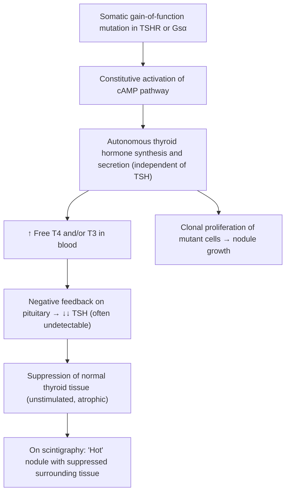

# Toxic Adenoma

## 1. Definition

A **toxic adenoma** (also known as ***toxic/functioning adenoma*** [1] or **autonomously functioning thyroid nodule, AFTN**) is a single, benign thyroid neoplasm — specifically a **follicular adenoma** — that has acquired the ability to produce thyroid hormones **independently of TSH stimulation**. The word "toxic" here means it is causing **thyrotoxicosis** (i.e. clinical thyroid hormone excess), not that the nodule itself is poisonous.

Let's break the name down:
- **"Toxic"** = causing thyrotoxicosis (excess thyroid hormones in the blood)
- **"Adenoma"** = a benign glandular neoplasm (Greek: *adēn* = gland, *-oma* = tumour)

This is distinct from:
- **Toxic multinodular goitre (MNG)** — multiple autonomously functioning nodules (***Plummer's disease*** in its original usage refers to toxic nodular goitre) [1]
- **Graves' disease** — diffuse autoimmune hyperthyroidism
- **Non-toxic adenoma** — a follicular adenoma that does NOT produce excess hormones (the vast majority of follicular adenomas are non-toxic) [1]

<Callout title="Key Distinction">
***Thyrotoxicosis ≠ Hyperthyroidism*** [2][3]. Thyrotoxicosis is the clinical syndrome of thyroid hormone excess from ANY cause (including exogenous T4 ingestion or destructive thyroiditis releasing stored hormone). Hyperthyroidism specifically refers to endogenous overactivity of the thyroid gland. A toxic adenoma causes **true hyperthyroidism** — the nodule is actively synthesising and secreting excess T3/T4.
</Callout>

---

## 2. Epidemiology

### Prevalence and Incidence
- Toxic adenoma accounts for approximately **3–5%** of all cases of thyrotoxicosis overall, though this varies geographically.
- In **iodine-deficient regions**, it is more common (up to 5–10% of thyrotoxicosis), because iodine deficiency promotes nodular thyroid disease and increases the chance of autonomous nodules developing.
- In **iodine-sufficient regions** (including most of Hong Kong), Graves' disease dominates (~70–80% of thyrotoxicosis), and toxic adenoma is less common (~3–5%).
- ***Benign follicular adenoma: mainly non-toxic (15%)*** of all thyroid nodules [1] — most adenomas do NOT become toxic. Only a minority acquire activating mutations and gain autonomous function.

### Demographics
- **Sex**: Female > Male (approximately 4–6:1), as with most thyroid diseases.
- **Age**: Typically presents in adults aged **30–60 years**, with a peak in middle age. Less common in children.
- In Hong Kong, thyroid nodules are extraordinarily common (***prevalence depends on method of detection: 3–7% by palpation, > 30% if by autopsy/USG***) [4], but only a small fraction are toxic adenomas.

### Risk Factors
| Risk Factor | Mechanism |
|---|---|
| **Iodine deficiency** (historical/geographical) | Chronic TSH stimulation → nodular hyperplasia → increased chance of somatic activating mutations |
| **Female sex** | Oestrogen may promote thyroid cell proliferation; general predisposition to thyroid disease |
| **Increasing age** | Cumulative exposure to TSH stimulation and time for somatic mutations to accumulate |
| **Pre-existing thyroid nodules / MNG** | A nodule in a multinodular goitre can acquire autonomous function |
| **Family history of thyroid disease** | Genetic predisposition to nodular thyroid disease |

<Callout title="Hong Kong Context" type="idea">
Hong Kong is generally considered iodine-sufficient (due to iodised salt and seafood consumption), so Graves' disease is the dominant cause of thyrotoxicosis here. However, toxic adenoma and toxic MNG still occur, particularly in older patients and those from backgrounds with historical iodine deficiency (e.g. migrants from inland China).
</Callout>

---

## 3. Anatomy and Function — The Thyroid Gland

### Gross Anatomy
- The thyroid is a butterfly-shaped endocrine gland located in the anterior neck, overlying the 2nd–4th tracheal rings.
- It consists of **two lateral lobes** connected by an **isthmus**.
- Blood supply: superior thyroid artery (from external carotid) and inferior thyroid artery (from thyrocervical trunk). The gland is highly vascular.
- **Important adjacent structures**:
  - **Recurrent laryngeal nerves (RLN)**: run in the tracheo-oesophageal groove — injury causes hoarseness
  - **Parathyroid glands**: four small glands on posterior thyroid surface — injury causes hypocalcaemia
  - **Trachea and oesophagus**: may be compressed by large nodules

### Histology — The Functional Unit
- The thyroid is composed of **follicles** — spherical structures lined by a single layer of **follicular epithelial cells** surrounding a central lumen filled with **colloid** (thyroglobulin-rich proteinaceous material).
- **Follicular cells** are responsible for:
  1. **Iodine trapping**: via the sodium-iodide symporter (NIS) on the basolateral membrane
  2. **Thyroglobulin (Tg) synthesis**: secreted into the colloid
  3. **Iodine organification**: iodide is oxidised by thyroid peroxidase (TPO) and attached to tyrosine residues on Tg → forms monoiodotyrosine (MIT) and diiodotyrosine (DIT)
  4. **Coupling**: MIT + DIT → T3; DIT + DIT → T4
  5. **Secretion**: colloid is endocytosed, Tg is proteolysed, and free T3/T4 are released into the blood

### The TSH Receptor (TSH-R) — Critical to Understanding Toxic Adenoma
- The **TSH receptor** is a G-protein coupled receptor (GPCR) on the basolateral surface of follicular cells.
- Normally, TSH from the anterior pituitary binds TSH-R → activates **Gsα** → stimulates **adenylyl cyclase** → ↑**cAMP** → activates protein kinase A (PKA) → promotes:
  - Iodine uptake (NIS expression)
  - Thyroglobulin synthesis
  - Hormone synthesis and secretion
  - Follicular cell growth and proliferation
- In a toxic adenoma, the TSH-R (or Gsα) is **constitutively activated** due to a somatic gain-of-function mutation — meaning it is "always on" regardless of whether TSH is bound to it.

---

## 4. Etiology and Pathophysiology

### The Core Problem: Somatic Gain-of-Function Mutations

A toxic adenoma arises because a **single follicular cell** acquires a **somatic (not germline) activating mutation** that causes constitutive activation of the TSH signalling pathway. This cell then clonally expands into an autonomous nodule.

The two most important mutations:

| Mutation | Frequency | Mechanism |
|---|---|---|
| **TSH receptor (TSHR) gene mutation** | ~60–70% of toxic adenomas | Gain-of-function point mutation in the transmembrane domain → receptor is locked in the "active" conformation → constitutive activation of Gsα → ↑cAMP even without TSH binding |
| **Gsα (GNAS1) gene mutation** | ~5–10% of toxic adenomas | Gain-of-function mutation in the alpha subunit of the stimulatory G-protein → GTPase activity impaired → Gsα remains active → constitutive ↑cAMP |

These are the same mutations (particularly Gsα) seen in **McCune-Albright syndrome** (a mosaic condition with constitutive Gsα activation causing polyostotic fibrous dysplasia, café-au-lait spots, and precocious puberty — and sometimes thyroid autonomy) [2].

### Pathophysiological Cascade

Let me walk through this step by step:

1. **Mutation occurs** → a single follicular cell gains a constitutively active TSHR or Gsα.
2. **Autonomous hormone production** → this cell (and its clonal progeny) produce T3/T4 regardless of TSH levels. The more the nodule grows, the more hormone it produces.
3. **Negative feedback** → elevated T3/T4 feeds back to the hypothalamus and anterior pituitary → **TSH is suppressed** (often to undetectable levels).
4. **Normal thyroid tissue is suppressed** → because TSH is the trophic hormone for normal follicular cells, the rest of the thyroid gland receives no stimulation → it becomes **quiescent/atrophic**. This is why on a thyroid scintigraphy scan, you see a "hot" (high-uptake) nodule with "cold" (suppressed) surrounding tissue.
5. **Progressive hormone excess** → as the nodule grows, it produces more and more hormone → eventually causes overt thyrotoxicosis.

### Natural History: From Subclinical to Overt

- **Small autonomous nodules** ( < 2.5–3 cm) may produce enough hormone to suppress TSH but not enough to elevate free T4/T3 above normal → this is **subclinical hyperthyroidism** (***↓TSH, normal fT4/T3***) [3][4].
- As the nodule **enlarges** (typically > 3 cm), hormone production exceeds the body's capacity to compensate → **overt thyrotoxicosis** (↓TSH, ↑fT4/T3).
- ***Subclinical hyperthyroidism: most commonly elderly with toxic MNG*** [4] — but toxic adenoma can also present this way.
- Toxic adenomas almost **never undergo malignant transformation** — ***hot nodules are almost never malignant*** [5].
- Progression to thyrotoxicosis is more likely with larger nodules, iodine supplementation (e.g. contrast agents, amiodarone), and in older patients.

<Callout title="Why does iodine loading precipitate thyrotoxicosis in autonomous nodules?" type="idea">
An autonomous nodule has active NIS and is avidly trapping iodine. Normally, the thyroid has a protective mechanism called the **Wolff-Chaikoff effect** — high iodine levels transiently inhibit organification. However, autonomous nodules may **escape** this inhibition more readily, and the sudden abundance of substrate (iodine) allows the already constitutively active synthetic machinery to produce a surge of thyroid hormones → **Jod-Basedow phenomenon** (iodine-induced thyrotoxicosis). This is clinically relevant when patients with nodular thyroid disease undergo CT with iodinated contrast or are started on amiodarone (which is 37% iodine by weight).
</Callout>

### Why a Toxic Adenoma is Benign (and Why Hot Nodules Are Almost Never Malignant)

- TSHR and Gsα mutations promote **differentiation and function** (hormone production, iodine uptake) rather than dedifferentiation.
- In contrast, thyroid cancers typically arise from mutations in pathways promoting **proliferation and dedifferentiation** (e.g. BRAF, RAS, RET/PTC rearrangements) — these tend to LOSE the ability to take up iodine and produce hormones efficiently.
- Therefore: a nodule that is "hot" (functioning, taking up radioiodine) is almost by definition well-differentiated and functional → overwhelmingly benign. The risk of malignancy in a hot nodule is < 1–2%.

---

## 5. Classification

### Within the Spectrum of Thyrotoxicosis

Toxic adenoma belongs to **primary hyperthyroidism** — the thyroid gland itself is overactive [2]:

| Category | Causes |
|---|---|
| ***Primary hyperthyroidism*** | ***Graves' disease*** (diffuse toxic goitre), ***Toxic multinodular goitre***, ***Toxic adenoma***, Metastatic thyroid cancer, Mutation of TSH receptor (germline), Mutation of Gsα (McCune-Albright syndrome) [2] |
| ***Secondary hyperthyroidism*** | ***TSH-secreting pituitary adenoma***, ***Chorionic gonadotropin-secreting tumour***, ***Gestational thyrotoxicosis*** [2] |
| ***Thyrotoxicosis without hyperthyroidism*** | ***Subacute (De Quervain's) thyroiditis***, ***Silent thyroiditis***, ***Destructive thyroiditis (amiodarone, irradiation)***, ***Levothyroxine overdose*** [2] |

### Classification of Goitre (Lecture Slide)

From the lecture classification [1]:

| Category | Examples |
|---|---|
| ***Simple goitre (endemic or sporadic)*** | ***Diffuse, Nodular*** |
| ***Toxic goitre*** | ***Diffuse toxic (Graves')***; ***Toxic nodular (Plummer's)***; ***Toxic/functioning adenoma*** |
| ***Neoplastic goitre*** | ***Benign, Malignant*** |
| ***Thyroiditis*** | ***Bacterial (acute suppurative), Viral (subacute), Lymphocytic/Hashimoto/autoimmune (chronic)*** |

### Classification of Thyroid Nodules [1][6]

| Category | Examples |
|---|---|
| ***Solitary nodule*** | ***Dominant nodule in MNG; Cyst (true simple cyst, colloid nodule); Neoplastic: adenoma, toxic adenoma, carcinoma*** [6] |
| ***Multiple nodules*** | ***MNG (hyperplastic/adenomatous nodules with varying cystic degeneration), toxic MNG; Cyst (multiple); Neoplastic: multiple adenoma*** [6] |
| ***Diffuse*** | ***Graves' disease; Physiological (pregnancy, puberty); Hashimoto's thyroiditis; De Quervain's/subacute thyroiditis*** [6] |

### Classification by Functional Status (Scintigraphy)

| Scintigraphy Pattern | Interpretation |
|---|---|
| ***Focal ↑uptake with ↓uptake elsewhere*** | ***→ Toxic adenoma*** [5] |
| ***Diffuse ↑uptake*** | ***→ Graves' disease vs secondary hyperthyroidism*** [5] |
| ***Heterogeneous ↑uptake*** | ***→ Toxic MNG*** [5] |
| ***Diffuse ↓uptake*** | ***→ Destructive thyroiditis vs factitious thyrotoxicosis*** [5] |

---

## 6. Clinical Features

### General Principle

The clinical features of a toxic adenoma are a combination of:
1. **Local effects** of the thyroid nodule itself (a palpable neck lump)
2. **Systemic effects of thyrotoxicosis** (due to excess circulating T3/T4)

The systemic features are identical to thyrotoxicosis from any cause, but certain features specific to Graves' disease (ophthalmopathy, pretibial myxoedema, thyroid acropachy) are **absent** — because these are autoimmune phenomena driven by TRAb acting on orbital/dermal fibroblasts, not simply due to excess thyroid hormones.

### 6A. Symptoms

#### Local Symptoms (from the Nodule)

| Symptom | Pathophysiological Basis |
|---|---|
| ***Neck swelling / palpable lump*** [4] | Physical mass effect of the growing adenoma; patients or family members may notice asymmetric anterior neck swelling |
| ***Pain or discomfort*** (uncommon) [4] | ***Acute painful enlargement can arise from haemorrhage into nodule/cyst*** [4] — sudden expansion stretches the capsule. Simple toxic adenomas are usually painless. |
| ***Dysphagia*** (difficulty swallowing) [4] | ***Local pressure symptoms*** [4] — large nodule compresses the oesophagus posteriorly. The oesophagus is relatively fixed and does not tolerate external compression well. |
| ***Dyspnoea / stridor*** [4] | ***Local pressure symptoms*** [4] — compression or deviation of the trachea, especially with large or retrosternal nodules |
| ***Dysphonia*** (hoarseness) [4] | ***Local pressure symptoms*** [4] — compression of the recurrent laryngeal nerve. In a benign adenoma this is very rare and should raise suspicion for malignancy if present. |

<Callout title="Red Flag" type="error">
Hoarseness (dysphonia) in a patient with a thyroid nodule is an alarming sign. Benign adenomas, even toxic ones, almost never cause RLN palsy because they are encapsulated and expand by pushing rather than invading. A hoarse voice should prompt consideration of **thyroid carcinoma** invading the RLN.
</Callout>

#### Systemic Symptoms of Thyrotoxicosis

The excess T3/T4 increases basal metabolic rate (BMR), enhances catecholamine sensitivity (upregulation of β-adrenergic receptors), and accelerates nearly every metabolic process.

| Symptom | Pathophysiological Basis |
|---|---|
| **Weight loss despite normal/increased appetite** | ↑BMR → ↑caloric expenditure exceeding intake. T3/T4 stimulate both lipolysis and proteolysis. |
| **Heat intolerance and sweating** | ↑BMR → ↑thermogenesis. T3 upregulates uncoupling proteins in mitochondria and increases peripheral vasodilation to dissipate heat → sweating. |
| **Palpitations** | T3 ↑cardiac β1-receptor expression → ↑heart rate and contractility. Also ↑sensitivity to circulating catecholamines. |
| **Tremor** (fine resting tremor of hands) | ↑β-adrenergic stimulation of skeletal muscle → enhanced physiological tremor |
| **Anxiety, irritability, emotional lability** | T3 has direct CNS excitatory effects + ↑catecholamine sensitivity in the brain |
| **Insomnia** | CNS hyperexcitability from excess thyroid hormone |
| **Increased frequency of bowel movements / diarrhoea** | T3 ↑GI motility by stimulating smooth muscle contractility and gut transit time |
| **Oligomenorrhoea or amenorrhoea** (women) | T3 excess → ↑SHBG → altered oestrogen/progesterone metabolism; also direct effects on HPG axis |
| **Erectile dysfunction / gynecomastia** (men) | ↑SHBG → altered androgen/oestrogen balance |
| **Proximal muscle weakness** | Thyroid myopathy — excess T3 accelerates protein catabolism in skeletal muscle; also altered muscle metabolism |
| **Dyspnoea on exertion** | ↑oxygen demand + respiratory muscle weakness |
| ***Fatigue*** | Despite hypermetabolism, patients feel exhausted due to muscle wasting and sleep disturbance |

<Callout title="Elderly Patients — Apathetic Thyrotoxicosis" type="idea">
***Cardiopulmonary symptoms may dominate in older patients*** [3]. Elderly patients with toxic adenoma may NOT present with the classic hyperadrenergic features. Instead, they may present with **AF, heart failure, or unexplained weight loss** — so-called "apathetic thyrotoxicosis." Always check TFTs in elderly patients with new-onset AF or unexplained weight loss.
</Callout>

### 6B. Signs

#### Local Signs (Thyroid Examination)

| Sign | Description and Pathophysiological Basis |
|---|---|
| **Solitary, well-defined thyroid nodule** | The adenoma is encapsulated, usually 2–5 cm (must be > ~1 cm to be palpable). Moves with swallowing (as it is part of the thyroid gland, which is attached to the pretracheal fascia). |
| **Smooth, firm, non-tender** | Follicular adenomas have a well-defined fibrous capsule and uniform follicular architecture → smooth surface, firm consistency. Pain is unusual unless haemorrhage occurs. |
| **No thyroid bruit** (unlike Graves') | In Graves' disease, the entire gland is hypervascular due to TSH-receptor antibody stimulation → audible bruit. In toxic adenoma, only the nodule is active; the rest of the gland is suppressed and less vascular. |
| **Rest of thyroid may feel small/atrophic** | TSH suppression → normal thyroid tissue is unstimulated → may atrophy over time |
| **Tracheal deviation** (if large nodule) | Mass effect pushing the trachea to the contralateral side |

***Physical examination of the thyroid should assess:*** [6]
- ***Inspection***: ***Surgical scar, swallowing test, tongue tug test***
- ***Voice hoarseness***
- ***Palpation***: ***Diffuse vs solitary nodule vs MNG vs dominant nodule in MNG; Size; Consistency; Location; Lower border; Cervical LN; Trachea***
- ***General exam***: ***Eye signs, Hands (tremor, sweating, tachycardia), Lower limbs (proximal muscle weakness, myxoedema)***

#### Systemic Signs of Thyrotoxicosis

| Sign | Pathophysiological Basis |
|---|---|
| **Tachycardia / AF** | T3 ↑β1-receptor density in cardiac myocytes → ↑chronotropy; also shortens atrial refractory period → predisposes to AF |
| **Wide pulse pressure / systolic hypertension** | ↑cardiac output + ↓peripheral vascular resistance (peripheral vasodilation for heat dissipation) |
| **Warm, moist skin** | Peripheral vasodilation + ↑sweating for thermoregulation |
| **Fine tremor of outstretched hands** | ↑β-adrenergic stimulation |
| ***Lid retraction*** | ***Due to overactive sympathetic activity (↑Müller's muscle contraction)*** [3] — Müller's muscle (superior tarsal muscle) is smooth muscle innervated by sympathetic fibres; excess thyroid hormone ↑sympathetic tone → ↑contraction → upper lid retracts, exposing sclera above limbus. ***Not specific to Graves' disease*** [3] — can occur in ANY cause of thyrotoxicosis including toxic adenoma. |
| ***Lid lag*** | ***Due to overactive sympathetic activity (↑Müller's muscle contraction)*** [3] — on downgaze, the upper lid lags behind the globe. Same mechanism as lid retraction. ***Not specific to Graves' disease*** [3]. |
| **Hyperreflexia** | ↑neuronal excitability from excess T3 → brisk tendon reflexes with rapid relaxation phase |
| **Proximal myopathy** | Thyroid hormone-induced protein catabolism in skeletal muscle; test by asking patient to rise from a squat without using hands |
| **Onycholysis (Plummer's nails)** | Separation of nail from nail bed — the mechanism is not fully understood but is associated with thyrotoxicosis; possibly related to accelerated nail growth outpacing adhesion |
| **Palmar erythema** | Peripheral vasodilation |

#### Signs ABSENT in Toxic Adenoma (Specific to Graves' Disease)

This is a crucial distinguishing point:

| Sign | Why It Is Absent |
|---|---|
| **Graves' ophthalmopathy** (exophthalmos, ophthalmoplegia, chemosis, periorbital oedema) | This is an **autoimmune** process driven by TRAb binding to TSH receptors on orbital fibroblasts → inflammation, adipogenesis, glycosaminoglycan accumulation → ↑retroorbital tissue volume. Toxic adenoma has no TRAb → no ophthalmopathy. |
| **Pretibial myxoedema** | TRAb-mediated stimulation of dermal fibroblasts in the pretibial region → GAG deposition. Absent in toxic adenoma. |
| ***Thyroid acropachy*** | ***Periosteal hypertrophy clinically indistinguishable from finger clubbing*** [3] — autoimmune mediated, specific to Graves'. |
| **Diffuse goitre with thyroid bruit** | Graves' causes diffuse gland enlargement with markedly increased vascularity → bruit. Toxic adenoma is a solitary nodule. |

<Callout title="How to Clinically Distinguish Toxic Adenoma from Graves' Disease">

| Feature | Toxic Adenoma | Graves' Disease |
|---|---|---|
| Goitre | Solitary nodule | Diffuse, non-tender, vascular |
| Thyroid bruit | Absent | Present |
| Ophthalmopathy | Absent | Present (~20–25%) |
| Pretibial myxoedema | Absent | Present ( < 10%) |
| Thyroid acropachy | Absent | Possible (rare) |
| Age | Typically older (30–60) | Younger (20–50) |
| TRAb | Negative | Positive (~100%) |
| Scintigraphy | Focal hot nodule, cold surround | Diffuse increased uptake |

</Callout>

---

## 7. Approach to a Patient with Suspected Toxic Adenoma

### Clinical Scenario
A patient presents with a **palpable solitary thyroid nodule** and **symptoms/signs of thyrotoxicosis** but WITHOUT Graves'-specific features (no ophthalmopathy, no diffuse goitre, no bruit).

### Step-by-Step Clinical Approach

1. **History**: Assess for thyrotoxic symptoms (weight loss, heat intolerance, palpitations, tremor, anxiety, bowel changes), local symptoms (neck swelling, dysphagia, dyspnoea, hoarseness), and risk factors for thyroid malignancy (***prior neck irradiation, FHx of CA thyroid: MENII, FAP***) [6].

2. **Examination**: Focused thyroid examination (solitary nodule? size? consistency? tenderness? cervical lymphadenopathy? tracheal deviation?) + systemic signs of thyrotoxicosis (heart rate, rhythm, tremor, lid retraction, lid lag, proximal myopathy). Specifically look for and document the ABSENCE of Graves'-specific signs.

3. **Thyroid function tests (TFTs)**: ***TSH is the most sensitive test*** [3].
   - ***↓TSH, ↑fT4, ↑T3*** → overt thyrotoxicosis
   - ***↓TSH, normal fT4/T3*** → subclinical hyperthyroidism

4. **Etiological investigations**: Once thyrotoxicosis is confirmed biochemically and a nodule is palpable:
   - ***Thyroid scintigraphy*** [5] → the KEY investigation to confirm toxic adenoma:
     - ***Focal ↑uptake with ↓uptake elsewhere → toxic adenoma*** [5]
     - This is the pathognomonic finding
   - ***Thyroid ultrasound*** → assess nodule characteristics, look for features suspicious for malignancy (although hot nodules are almost never malignant), and check the contralateral lobe for additional nodules
   - ***TRAb*** → should be **negative** (if positive, think Graves' with a coincidental nodule)

> **High Yield**: ***In the event of ↓TSH with thyroid nodule(s), thyroid scintigraphy is indicated to differentiate between Graves' disease with co-existent thyroid nodule, toxic thyroid adenoma, and toxic MNG, and to determine the functional status of the dominant nodule*** [5]. ***Hot nodules are almost never malignant*** [5] — therefore FNAC may not be necessary for a confirmed hot nodule.

5. **FNAC**: Generally **NOT required** for a confirmed hot/functioning nodule on scintigraphy (because < 1–2% malignancy risk). FNAC is reserved for nodules that are "cold" (non-functioning) or have suspicious ultrasound features.

---

## 8. Summary of Pathophysiology → Clinical Features Connection

| Pathophysiology | → | Clinical Feature |
|---|---|---|
| Somatic TSHR/Gsα mutation → constitutive cAMP activation | → | Autonomous hormone production, nodule growth |
| Excess T3/T4 → ↑BMR | → | Weight loss, heat intolerance, sweating |
| Excess T3/T4 → ↑β-adrenergic sensitivity | → | Tachycardia, AF, tremor, lid retraction, lid lag, anxiety |
| Excess T3/T4 → ↑cardiac output, ↓SVR | → | Wide pulse pressure, systolic hypertension, warm skin |
| Excess T3/T4 → ↑GI motility | → | Frequent stools / diarrhoea |
| Excess T3/T4 → ↑protein catabolism | → | Proximal myopathy, weight loss |
| TSH suppression → normal thyroid quiescent | → | Focal hot nodule on scintigraphy, rest of gland suppressed |
| Encapsulated adenoma → mass effect | → | Palpable neck lump, dysphagia, dyspnoea (if large) |
| No TRAb (not autoimmune) | → | NO ophthalmopathy, NO pretibial myxoedema |

---

<Callout title="High Yield Summary">

1. **Toxic adenoma** = a single benign follicular adenoma with a somatic gain-of-function mutation in **TSHR (~60–70%)** or **Gsα (~5–10%)** → constitutive cAMP activation → autonomous T3/T4 production independent of TSH.

2. **Epidemiology**: 3–5% of thyrotoxicosis; F > M; middle-aged adults; more common in iodine-deficient areas.

3. **Key pathophysiology**: Autonomous hormone production → ↑fT4/T3 → negative feedback → ↓↓TSH → suppression of normal thyroid tissue → **focal hot nodule with cold surround on scintigraphy** (pathognomonic).

4. **Clinical features**: Solitary, smooth, non-tender thyroid nodule + systemic thyrotoxicosis (weight loss, heat intolerance, palpitations, tremor, AF) but **NO Graves'-specific features** (no ophthalmopathy, no pretibial myxoedema, no diffuse goitre/bruit).

5. ***Lid retraction and lid lag can occur*** (sympathetic overactivity) — ***not specific to Graves' disease*** [3].

6. ***Hot nodules are almost never malignant*** [5] — FNAC usually not required for confirmed hot nodules.

7. ***Thyroid scintigraphy is the key etiological investigation*** when ↓TSH + thyroid nodule: ***focal ↑uptake with ↓uptake elsewhere → toxic adenoma*** [5].

8. Small nodules may present as ***subclinical hyperthyroidism (↓TSH, normal fT4/T3)*** before progressing to overt thyrotoxicosis.

</Callout>

---

<ActiveRecallQuiz
  title="Active Recall - Toxic Adenoma: Definition, Epidemiology, Etiology, Pathophysiology and Clinical Features"
  items={[
    {
      question: "What are the two most common somatic mutations responsible for toxic adenoma, and what is the downstream signalling consequence?",
      markscheme: "TSHR gain-of-function mutation (60-70%) and Gsα (GNAS1) gain-of-function mutation (5-10%). Both cause constitutive activation of adenylyl cyclase → increased cAMP → autonomous thyroid hormone production independent of TSH.",
    },
    {
      question: "On thyroid scintigraphy, what is the classic finding in toxic adenoma and why does the surrounding thyroid tissue appear cold?",
      markscheme: "Focal increased uptake (hot nodule) with suppressed/decreased uptake in surrounding tissue. Surrounding tissue is cold because autonomous T3/T4 production suppresses TSH via negative feedback → normal follicular cells are not stimulated → do not trap iodine.",
    },
    {
      question: "Name three clinical features that distinguish toxic adenoma from Graves' disease and explain why each is absent in toxic adenoma.",
      markscheme: "1. Ophthalmopathy (absent because no TRAb to stimulate orbital fibroblasts). 2. Pretibial myxoedema (absent because no TRAb to stimulate dermal fibroblasts). 3. Diffuse goitre with thyroid bruit (absent because only one nodule is hyperfunctioning, not the whole gland). Also: thyroid acropachy is absent.",
    },
    {
      question: "Why are hot nodules on scintigraphy almost never malignant?",
      markscheme: "TSHR/Gsα mutations promote differentiation and function (iodine uptake, hormone production) rather than dedifferentiation. Thyroid cancers typically have mutations (BRAF, RAS, RET/PTC) that promote proliferation and dedifferentiation → lose ability to trap iodine. Hence functioning nodules are overwhelmingly benign (malignancy risk less than 1-2%).",
    },
    {
      question: "A patient with a known autonomous thyroid nodule undergoes CT with iodinated contrast and subsequently develops severe thyrotoxicosis. Explain the mechanism.",
      markscheme: "Jod-Basedow phenomenon: the autonomous nodule has active NIS and avidly traps iodine. Sudden iodine load from contrast provides excess substrate. The nodule's constitutively active synthetic machinery escapes the Wolff-Chaikoff effect and produces a surge of thyroid hormones → acute thyrotoxicosis.",
    },
    {
      question: "Explain why lid retraction and lid lag can occur in toxic adenoma despite being classically associated with Graves' disease.",
      markscheme: "Lid retraction and lid lag are due to sympathetic overactivity causing increased Muller's muscle (superior tarsal muscle) contraction, not due to TRAb-mediated orbital inflammation. Since thyrotoxicosis from any cause increases sympathetic tone, these signs can occur in toxic adenoma. They are NOT specific to Graves' disease.",
    },
  ]}
/>

---

## References

[1] Lecture slides: GC 177. A thyroid nodule benign thyroid nodules; thyroid cancer.pdf (p4–5)
[2] Senior notes: felixlai.md (Section III — Causes of thyrotoxicosis)
[3] Senior notes: Ryan Ho Endocrine.pdf (p12, p17, p23)
[4] Senior notes: Ryan Ho Endocrine.pdf (p17 — Goitre and Thyroid Nodules; p31 — Thyroiditis)
[5] Senior notes: Adrian Lui Pediatrics.pdf (p271–272 — Etiological Ix, Thyroid scintigraphy)
[6] Senior notes: maxim.md (Approach to thyroid nodules — DDx, Physical examination)
