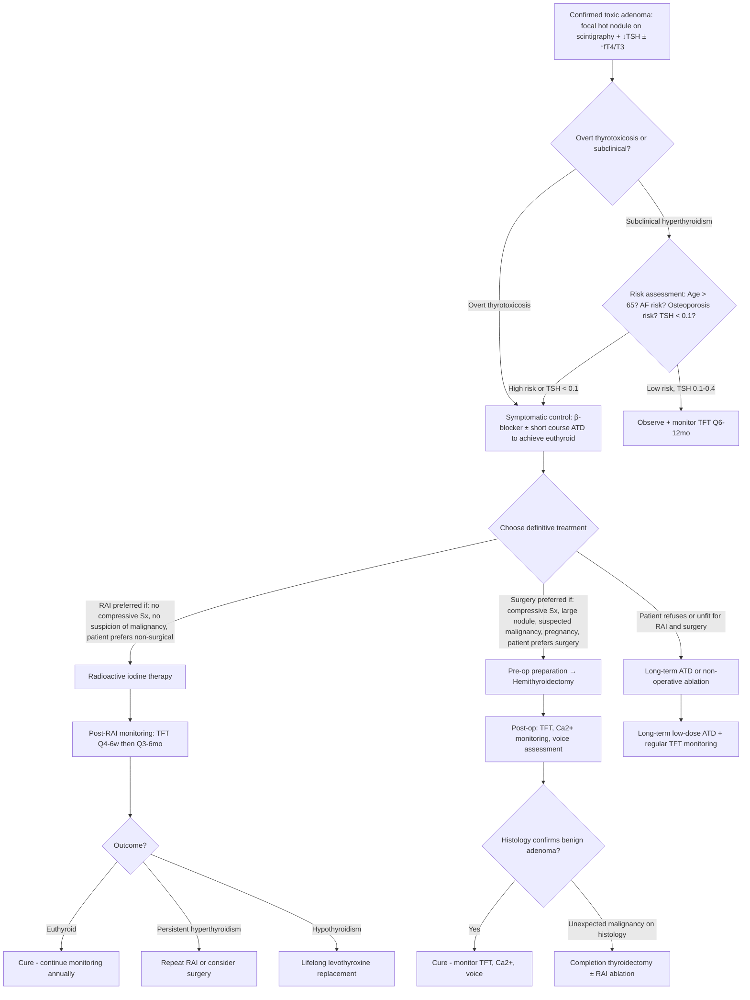

## Management of Toxic Adenoma

### Management Philosophy

Before diving into specific treatments, understand the **fundamental management principle** for toxic adenoma: unlike Graves' disease, where the underlying autoimmune process may spontaneously remit after 12–18 months of antithyroid drugs, a toxic adenoma has a **somatic gain-of-function mutation** that is permanent. The nodule will NEVER stop producing hormone on its own. Therefore:

- ***Antithyroid drugs are ineffective for toxic adenoma and toxic MNG in the long term: they recur upon discontinuation*** [6]
- **Definitive treatment** (destruction or removal of the autonomous nodule) is almost always needed
- Antithyroid drugs serve only as a **bridge** — controlling thyrotoxicosis while preparing for definitive treatment or when definitive treatment is not immediately feasible

This is a crucial distinction from Graves' disease, where ATDs are first-line with a reasonable chance of lasting remission.

---

## 1. Overview of Management Modalities

***Management of thyrotoxicosis from toxic adenoma*** [5][3]:
- ***Non-selective short-acting β-blocker (e.g. propranolol, nadolol) for short-term alleviation of S/S*** [3][5]
- ***Antithyroid drugs (ATD), e.g. carbimazole, methimazole, propylthiouracil*** [3][5] — as bridge therapy
- ***Definitive Tx, i.e. radioactive iodine (RAI) or thyroidectomy*** [3][5]

Summary comparison across thyrotoxicosis causes [6]:

| | ***Graves'*** | ***Toxic MNG (Plummer's)*** | ***Toxic nodule*** |
|---|---|---|---|
| ***Antithyroid drugs*** | ***1st line*** | ***(Ineffective: recur upon discontinuation) Prolonged use if patient does not want RAI or surgery*** | Bridge only — recur upon discontinuation |
| ***Radioactive iodine*** | ***2nd line*** | ***Preferred if no 4C*** | **Preferred** if no compressive symptoms |
| ***Surgery*** | ***2nd line*** | ***Preferred if 4C*** | ***Hemithyroidectomy*** if large nodule, compressive symptoms, or preference |

> ***"4C" = indications for thyroidectomy: Cancer (confirmed or suspicious), Compressive symptoms, Cannot be treated medically, Cosmesis*** [3].

---

## 2. Management Algorithm

---

## 3. Treatment Modalities — Detailed Breakdown

### 3A. Symptomatic Control: β-Blockers

***Non-selective short-acting β-blocker (e.g. propranolol, nadolol) for short-term alleviation of S/S*** [3][5].

| Feature | Details |
|---|---|
| **Purpose** | Rapid symptom relief while waiting for definitive treatment to take effect |
| **Mechanism** | Blocks β1 and β2 adrenergic receptors → ↓heart rate, ↓tremor, ↓anxiety, ↓sweating. Propranolol also has a minor additional effect: ***inhibits peripheral conversion of T4 → T3*** (at high doses) because peripheral 5'-deiodinase is partially catecholamine-dependent |
| **Drug of choice** | **Propranolol** 20–40 mg TDS–QDS (non-selective, also blocks peripheral T4→T3 conversion) |
| **Alternatives** | Nadolol (longer-acting, once daily), atenolol 25–50 mg/d (β1-selective — less effect on T4→T3 but more convenient) |
| **Duration** | Short-term only — until euthyroid state is achieved by ATD or definitive treatment |
| **Contraindications** | Asthma/severe COPD (β2 blockade → bronchospasm), decompensated heart failure, severe bradycardia, heart block |

**Why non-selective?** Because T3/T4 upregulate β1 AND β2 receptors. The sympathetic overactivity in thyrotoxicosis manifests through both — β1 (tachycardia, palpitations) and β2 (tremor, vasodilation). A non-selective blocker addresses both.

<Callout title="β-Blockers Do NOT Treat the Cause" type="error">
β-Blockers provide only symptomatic relief. They do NOT reduce thyroid hormone production or address the autonomous nodule. They are a bridge, not a cure. Never use β-blockers as monotherapy long-term for toxic adenoma.
</Callout>

---

### 3B. Antithyroid Drugs (ATDs) — Bridge Therapy

***Antithyroid drugs, e.g. carbimazole, methimazole, propylthiouracil*** [3][5].

#### Mechanism of Action [2][3]

| Drug | Mechanism |
|---|---|
| **Carbimazole / Methimazole** (carbimazole is a pro-drug metabolised to methimazole) | ***Inhibition of TPO → ↓organification, ↓coupling → ↓T4 synthesis*** [3]. Blocks thyroid peroxidase, the enzyme that iodinates tyrosine residues on thyroglobulin and couples MIT+DIT to form T3/T4. |
| **Propylthiouracil (PTU)** | Same TPO inhibition as above PLUS ***↓peripheral T4 to T3 conversion*** [3] (inhibits type 1 5'-deiodinase in peripheral tissues). Also has immunosuppressive effects (↓TRAb — relevant for Graves' but not toxic adenoma). |

#### Why ATDs Are Only Bridge Therapy for Toxic Adenoma

***ATDs are ineffective for toxic adenoma in the long term: they recur upon discontinuation*** [6]. Here's the reasoning from first principles:

- In Graves' disease, ATDs work on two levels: (1) block hormone synthesis, and (2) have immunosuppressive effects that may allow the autoimmune process to "burn out" → remission in ~40% after 12–18 months.
- In toxic adenoma, the problem is a **permanent somatic mutation** in TSHR/Gsα → the nodule will ALWAYS be constitutively active. There is no autoimmune process to suppress. The moment you stop ATDs, the mutant follicular cells resume autonomous hormone production.

Therefore, ATDs are used in toxic adenoma only to:
1. **Render the patient euthyroid before surgery** (critical to avoid thyroid storm)
2. **Control symptoms while awaiting RAI**
3. **Long-term low-dose maintenance** if the patient refuses or is unfit for both RAI and surgery (uncommon)

#### Practical Details [3]

| Aspect | Details |
|---|---|
| **Drug of choice** | ***Prefer carbimazole over PTU: achieve euthyroid more rapidly, once daily dosing, ↓hepatotoxicity, ↓bitter taste*** [3] |
| **When to prefer PTU** | ***(1) 1st trimester of pregnancy (↓teratogenicity), (2) thyroid storm (↓peripheral conversion of T4→T3), (3) minor reactions to carbimazole*** [3] |
| **Starting dose** | ***Carbimazole 15–60 mg/d in 2–3 divided doses (depends on initial TFT)*** [3] with baseline CBC and LFT |
| **Monitoring** | ***Monitor TFT ± CBC/LFT Q4–6 weeks until euthyroid*** [3], then tail down to maintenance dose |
| ***Slow onset*** | ***Therapy given for 12–18 months [in Graves'] — onset of euthyroid takes 3–4 weeks since the thyroid gland has large storage of hormones — hormones need to be depleted before manifestation of drug effects*** [2] |
| **Regimen types** | ***Titrating regimen: start high → titrate down by TSH*** [3]; ***Block and replace: high-dose ATD + T4 replacement*** [3] |

#### Side Effects [2][3]

| Side Effect | Frequency | Mechanism / Details |
|---|---|---|
| ***Skin rash / urticaria / pruritus*** | ***5%*** [2] | ***Allergy — trigger release of histamine — treated by antihistamine*** [2] |
| ***Agranulocytosis*** | ***0.1–0.5%*** [2][3] | ***Occurs within first 2–3 months; reversible; usually first 2 months; ↑with age ( > 40y) or high doses*** [3]; ***predicted by HLA-B*38:02:01 allele (mainly found in Asian population)*** [3]; presents with ***fever/sore throat while on ATD → advise to seek help immediately if any symptoms of infection*** [3] |
| ***Hepatotoxicity*** | Varies | ***Especially PTU, up to 1/3 associated with ↑ALT/AST but rarely associated with fulminant failure*** [3]; ***hepatic necrosis*** [2] possible with PTU |
| ***Teratogenicity*** | Rare | ***Aplasia cutis, choanal atresia (methimazole/carbimazole >> PTU)*** [3]; ***PTU is preferred in 1st trimester*** |
| ***Fever, arthritis/arthralgia*** | Uncommon | [2] |

<Callout title="Agranulocytosis — The Dreaded Complication">
***Agranulocytosis (0.1–0.5%)*** [2] is the most dangerous side effect. It typically presents with sudden-onset sore throat and fever. You MUST counsel every patient starting ATDs: **"If you develop a sore throat, fever, or mouth ulcers, stop the medication and come to hospital IMMEDIATELY for a blood test (CBC)."** If neutrophils are severely depressed, stop ATD permanently, give G-CSF and broad-spectrum antibiotics, and switch to an alternative treatment modality (RAI or surgery).
</Callout>

---

### 3C. Radioactive Iodine (RAI) — Definitive Treatment

This is often the **preferred definitive treatment** for toxic adenoma, particularly when there are no compressive symptoms (no "4C" indications for surgery).

***For toxic adenoma, upfront RAI (over antithyroid drug) is preferred because of ↑iodine uptake*** [3].

#### Mechanism [2]

***Taken up and processed by thyroid gland in the same way as normal iodide — specificity to thyroid is due to preferential thyroid uptake via Na-I cotransporter → becomes incorporated into thyroglobulin → emits β-radiation in thyroid gland → destruction of thyroid gland — necrosis of follicular cells*** [2].

Let's break this down from first principles:
1. **131I** is administered orally (as sodium iodide solution or capsule).
2. It is absorbed from the GI tract into the blood.
3. The **NIS** (sodium-iodide symporter) on thyroid follicular cells avidly takes it up — just like normal iodine.
4. In a toxic adenoma, the autonomous nodule has **HIGHLY active NIS** (the constitutively active TSHR/Gsα pathway upregulates NIS expression). Meanwhile, the suppressed normal thyroid has LOW NIS activity (no TSH stimulation).
5. **Result**: 131I concentrates preferentially in the hot nodule, NOT in the surrounding normal tissue.
6. 131I emits **β-particles** (electrons) with a path length of ~0.5–2 mm — enough to destroy the follicular cells of the nodule but with minimal damage to surrounding structures.
7. Over weeks to months, the nodule shrinks and loses its autonomous function → euthyroidism (or hypothyroidism).

**This is why RAI is particularly elegant for toxic adenoma**: the suppressed surrounding tissue does NOT take up the 131I significantly, so it is relatively spared → **lower risk of post-RAI hypothyroidism** compared to Graves' disease (where the whole gland takes up 131I).

#### Indications [2][6]

| Indication | Rationale |
|---|---|
| **Definitive treatment of toxic adenoma** (preferred when no 4C) | Nodule has high iodine uptake → excellent response; lower hypothyroidism risk than Graves' |
| ***Refractory to antithyroid medications*** [2] | ATDs cannot provide long-term cure for toxic adenoma |
| ***Relapse or contraindicated to surgery*** [2] | Alternative to surgery in high-surgical-risk patients |
| ***Ablation of residual tumour tissues after thyroidectomy*** [2] (for thyroid cancer, not toxic adenoma) | Different context — mentioned for completeness |

#### Contraindications [2]

| Contraindication | Reason |
|---|---|
| ***Pregnancy*** [2] | ***Damage of thyroid gland of fetus*** [2] — the fetal thyroid begins concentrating iodine from ~12 weeks gestation; 131I would destroy it → congenital hypothyroidism (cretinism). ***Pregnancy test for patients with childbearing potential*** [2] must be done BEFORE treatment. |
| ***Breastfeeding*** [2] | ***Avoid breastfeeding since it is secreted in breastmilk*** [2] — NIS is also expressed in lactating breast tissue |
| ***Children and adolescents*** (relative contraindication) [2] | ***Avoid potential teratogenicity in young age*** [2] — growing tissues are more radiosensitive; theoretical concern about long-term radiation effects (though evidence for actual increased cancer risk is limited) |
| **Active Graves' ophthalmopathy** (moderate/severe) | ***Moderate/severe GO is a contraindication to RAI treatment*** [3] — RAI can worsen orbitopathy by increasing antigen release from destroyed thyroid cells → ↑TRAb flare. **However, this is NOT relevant for toxic adenoma** (no GO), so it is mentioned only for comparison. |
| **Suspected thyroid malignancy** | A cold nodule or suspicious features should be evaluated (FNAC/surgery) before RAI |
| **Very large goitre with compressive symptoms** | RAI works slowly (weeks–months); surgery provides immediate relief of compression |

#### Preparation and Precautions [2]

**Before RAI** [2]:
- ***Discussion of treatment options and patient's consent***
- ***Instruct patients on post-therapy precautions and follow-ups***
- ***Avoid iodine-containing food, medicine (cough suppressant) or radiological contrast for ≥ 4 weeks before 131I therapy*** — exogenous iodine competes with 131I for NIS uptake, reducing efficacy
- ***Avoid antithyroid medications for ≥ 4 weeks before 131I therapy*** — ATDs inhibit organification; if 131I is not organified, it washes out of the gland and does not deliver effective β-radiation
- ***Symptomatic control of hyperthyroidism by propranolol*** — maintain β-blocker while waiting
- ***Pregnancy test for patients with childbearing potential***

**After RAI** [2]:
- ***Symptomatic control of hyperthyroidism by propranolol*** — thyrotoxicosis may temporarily worsen as damaged follicular cells release stored hormone
- ***Discharge home immediately and avoid close contact with others*** — the patient is temporarily radioactive (131I emits γ-rays as well as β-particles)
- ***Safe contraception ≥ 6 months; avoid pregnancy and breastfeeding ≥ 6 months*** [2]

#### Outcomes and Side Effects [2]

| Outcome | Details |
|---|---|
| **Cure rate** | ~80–90% after a single dose; may need repeat dose in 10–20% |
| ***Hypothyroidism*** | ***Transient = 3.5–28%; Permanent = 10–15% in first 2 years and 3%/year (due to late effects of radiation and lymphocytic infiltration and destruction of thyroid tissue)*** [2]. **Lower for toxic adenoma than Graves'** because the suppressed normal tissue is relatively spared. |
| **Transient thyrotoxicosis** | Radiation thyroiditis → release of stored hormone → worsening of thyrotoxicosis for 1–2 weeks. Usually mild and managed with β-blockers. |
| ***No effect on fertility; No effect on congenital malformations; No effect on increased cancer risk of offspring*** [2] | Reassuring long-term safety data |

<Callout title="Why RAI is Particularly Effective for Toxic Adenoma" type="idea">
In toxic adenoma, the autonomous nodule has upregulated NIS (due to constitutive TSHR activation) while the surrounding normal tissue has downregulated NIS (due to TSH suppression). This creates a **natural targeting mechanism** — 131I is preferentially concentrated in the nodule and spares the normal gland. This is why: (1) The cure rate is high (~85–90% with single dose), (2) The risk of hypothyroidism is LOWER than in Graves' (where the whole gland takes up 131I), and (3) ***Upfront RAI is preferred for toxic adenoma because of ↑iodine uptake*** [3].
</Callout>

---

### 3D. Surgery (Thyroidectomy) — Definitive Treatment

#### Type of Surgery

***Toxic adenoma: hemithyroidectomy (if no evidence of nodules in contralateral lobe)*** [6].

| Feature | Details |
|---|---|
| **Procedure** | **Hemithyroidectomy** (= lobectomy + isthmusectomy) — removal of the lobe containing the toxic adenoma plus the isthmus |
| **Why hemithyroidectomy, not total?** | The contralateral lobe is **normal** (though suppressed by low TSH) and will resume function once the toxic nodule is removed → TSH recovers → normal lobe resumes hormone production → patient often becomes euthyroid without needing lifelong T4 replacement. This is a major advantage over total thyroidectomy. |
| **When total thyroidectomy instead?** | If there are **nodules in the contralateral lobe** (i.e. it's really a toxic MNG, not a solitary toxic adenoma); if concomitant thyroid cancer is suspected; ***Toxic MNG: total thyroidectomy*** [6] |

#### Indications for Surgery [2][8]

***Indications for thyroidectomy: 3Cs (or 4C)*** [3]:
- ***(Cancer)***: ***Confirmed CA or suspicious FNAC (Bethesda IV–VI)*** [3]
- ***Compressive symptoms***: ***Dysphagia, dysphonia, dyspnoea or retrosternal goitre*** [3]
- ***Cannot be treated medically***: ***Frequent relapses, require definitive Tx (when RAI unsuitable or large goitre > 80g)*** [3]
- ***Cosmesis*** [3]

***Benign thyroid nodule — indications of treatment*** [8]:
- ***Symptomatic (size of goitre/nodule)***
- ***Increase in goitre size***
- ***Trachea compression or deviation***
- ***Retrosternal extension***
- ***Suspected malignancy***
- ***Cosmetic considerations/patient wish***

Specific to toxic adenoma, surgery is preferred when:
- **Large nodule** with compressive symptoms (RAI works too slowly for compression)
- **Suspicion of co-existing malignancy** (e.g. additional cold nodule)
- **Patient preference** (some patients prefer a single definitive procedure)
- **Pregnancy** — if ATDs are not tolerated (RAI is absolutely contraindicated in pregnancy)
- **Children/adolescents** — where RAI is relatively contraindicated

#### Pre-operative Preparation [6]

***Pre-op preparation in thyrotoxic patients undergoing thyroid surgery*** [6] — this is **critical** to prevent perioperative thyroid storm:

| Step | Rationale |
|---|---|
| **Achieve euthyroid state with ATDs** | ***Patients should be brought to euthyroid before surgery to avoid possible thyroid storm*** [2]. Typically carbimazole for 4–6 weeks until TFTs normalise. |
| **β-Blocker** | Continue until and including the morning of surgery to control heart rate and prevent adrenergic crisis |
| **Lugol's iodine** (potassium iodide solution) — 7–10 days pre-op | High-dose iodine induces the **Wolff-Chaikoff effect** → transiently ↓organification → ↓hormone synthesis AND ↓thyroid vascularity (makes the gland less vascular and easier to operate on). Must only be given AFTER ATDs have taken effect (otherwise the iodine would become substrate for new hormone synthesis). |
| **Check calcium and vitamin D** | Baseline for comparison post-op (risk of hypoparathyroidism) |
| **Direct laryngoscopy** | Document vocal cord function pre-operatively (baseline for comparison if RLN injury suspected post-op) |

#### Complications of Thyroidectomy [2][6]

| Complication | Mechanism | Frequency |
|---|---|---|
| ***Thyroid storm*** [2] | Manipulation of a hyperthyroid gland during surgery → massive release of stored T3/T4 into the bloodstream. Prevented by rendering patient euthyroid pre-op. | Rare if pre-op preparation adequate |
| ***Haemorrhage*** [2] | ***Compression and oedematous effect compresses on trachea*** [2] — post-op haematoma can cause airway compromise; this is a **surgical emergency** requiring immediate wound opening at the bedside |
| ***Recurrent laryngeal nerve (RLN) injury*** [6] | Unilateral → hoarseness (vocal cord paralysis on one side); Bilateral → stridor and airway obstruction (both cords in paramedian position) — requires emergency intubation/tracheostomy | Temporary: 2–5%; Permanent: ~1% in experienced hands |
| ***Hypoparathyroidism*** [2][6] | Inadvertent removal or devascularisation of parathyroid glands → ↓PTH → hypocalcaemia → perioral numbness, Chvostek's/Trousseau's signs, tetany | Temporary: 10–20%; Permanent: 1–2% (much lower with hemithyroidectomy than total) |
| ***Hypothyroidism*** | After hemithyroidectomy: usually the contralateral lobe recovers function; after total thyroidectomy: ***thyroid failure (100%)*** [6] → lifelong T4 replacement | HemiT: ~5–10%; TT: 100% |

<Callout title="Hemithyroidectomy Advantage in Toxic Adenoma">
Because toxic adenoma is treated with **hemithyroidectomy** (not total thyroidectomy), the risks of hypoparathyroidism and bilateral RLN injury are dramatically lower than in total thyroidectomy — you are only operating on one side of the neck. Additionally, most patients do NOT need lifelong T4 replacement because the contralateral lobe resumes normal function once TSH recovers.
</Callout>

---

### 3E. Non-Operative Ablation Techniques (Emerging)

These are newer, less invasive alternatives to surgery for benign thyroid nodules including toxic adenoma. They are not yet first-line but are increasingly available.

| Technique | Mechanism | Notes |
|---|---|---|
| **Radiofrequency ablation (RFA)** | Thermal destruction of the nodule via a needle electrode inserted under USG guidance | Effective for volume reduction; can cure small toxic adenomas; ***non-operative measures, e.g. RFA, HIFU, ethanol ablation (not 100% curative)*** [3] |
| **High-intensity focused ultrasound (HIFU)** | Non-invasive thermal ablation using focused ultrasound energy | ***HIFU can be done for benign nodule < 5cm*** [3]; no skin puncture required |
| **Percutaneous ethanol injection (PEI)** | Direct injection of ethanol into the nodule → chemical destruction | More effective for cystic nodules; less effective for solid toxic adenomas |

These are generally considered when the patient refuses or is unfit for both RAI and surgery.

---

### 3F. Management of Subclinical Hyperthyroidism from Toxic Adenoma

Not all toxic adenomas cause overt thyrotoxicosis. Small autonomous nodules may present as ***subclinical hyperthyroidism (↓TSH, normal fT4/T3)*** [3].

Management is guided by the **degree of TSH suppression** and the **patient's risk factors** [3]:

| Scenario | Management | Rationale |
|---|---|---|
| **TSH < 0.1 mU/L** | ***Workup + treat*** [3] | Strongly suppressed TSH carries ↑risk of AF (1.68×), osteoporosis, IHD, HF [3]. Treatment warranted. |
| **TSH 0.1–0.4 mU/L** in ***high-risk patient (elderly, at risk of osteoporosis, underlying IHD)*** | ***Workup + treat*** [3] | Even mildly suppressed TSH increases cardiovascular and bone risk in vulnerable patients |
| **TSH 0.1–0.4 mU/L** in low-risk patient | ***Observe + monitor otherwise*** [3] | Risk of progression to overt hyperthyroidism is ~0.5–8%/year [3]; monitor TFT Q6–12 months |

---

### 3G. Management of Thyroid Storm (Emergency)

Although thyroid storm can occur from any cause of thyrotoxicosis, it is relevant to toxic adenoma — particularly if a patient with an untreated toxic adenoma undergoes surgery, infection, or iodine load.

***Thyrotoxic crisis (thyroid storm): rare but life-threatening (10% mortality, medical emergency)*** [5][12].

***Setting*** [5]:
- ***Longstanding untreated hyperthyroidism***
- ***Acute infection, thyroid and non-thyroid surgery, trauma, childbirth in previously untreated/undertreated hyperthyroidism***
- ***Withdrawal of antithyroid drugs***
- ***Shortly after treatment procedures (subtotal thyroidectomy or RAI)***
- ***Acute iodine load, e.g. amiodarone***

***Treatment*** [5][12]:
1. ***Close monitoring: may need CVP ± ICU care***
2. ***Supportive Tx: CHF/AF (O2, digoxin/diuretics ± inotropes); hyperthermia (paracetamol, physical cooling); dehydration (IVF, IV thiamine)***
3. ***Non-selective β-blocker/CCB to ↓adrenergic S/S***
4. ***Immediate thionamide to ↓thyroid hormone synthesis — PTU preferred for its blocking effect on T4-to-T3 conversion*** [5][12]
5. ***Glucocorticoids to ↓peripheral conversion of T4 → T3*** [5]
6. ***Iodine after ≥1 hour to rapidly ↓thyroid hormone release*** [5][12]:
   - ***Mechanism: large doses of exogenous iodine inhibit organification of iodine in thyroid gland transiently due to Wolff-Chaikoff effect*** [5]
   - ***Must be given ≥1h after first dose of thionamide → prevent the iodine from being used as substrate for new hormone synthesis*** [5][12]
   - ***Choices: 6–8 drops Lugol's/SSKI PO Q6–8H, Oragrafin, IV NaI*** [12]
7. ***Bile acid sequestrant to ↓enterohepatic cycling of T4 and ↑excretion*** [5] — adjunctive
8. ***Other choices: plasmapheresis, charcoal haemoperfusion for desperate cases*** [5]

---

## 4. Decision-Making: RAI vs Surgery for Toxic Adenoma

| Factor | Favours RAI | Favours Surgery |
|---|---|---|
| **Compressive symptoms** | ✗ (too slow) | ✓ (immediate decompression) |
| **Nodule size** | Small–moderate ( < 4 cm) | Large ( > 4 cm) — may need larger RAI dose with diminishing returns |
| **Suspicion of malignancy** | ✗ (need histology) | ✓ (provides tissue for histological diagnosis) |
| **Pregnancy** | ***Contraindicated*** [2] | ✓ (if ATDs not tolerated — 2nd trimester preferred) |
| **Children/adolescents** | ***Relative contraindication*** [2] | ✓ (preferred) |
| **Surgical fitness** | ✓ (non-invasive) | Requires general anaesthesia fitness |
| **Graves' ophthalmopathy** | ***Contraindication if moderate/severe GO*** [3] | ✓ | — *but this is not relevant for toxic adenoma since GO does not occur* |
| **Patient preference** | Non-surgical, outpatient | Single definitive procedure |
| **Contralateral nodules** | May treat only hot tissue | Can perform total thyroidectomy if bilateral disease |
| **Speed of effect** | Weeks–months | Immediate |
| **Hypothyroidism risk** | Lower (~10–15% at 2 years) [2] | HemiT: ~5–10%; TT: 100% |
| **Need for lifelong T4** | Less likely (normal tissue spared) | Less likely after hemiT; certain after TT |

---

## 5. Follow-Up After Definitive Treatment

| After RAI | After Hemithyroidectomy |
|---|---|
| TFT Q4–6 weeks for first 3–6 months | TFT at 6 weeks, then Q3–6 months for 1 year |
| Then TFT Q3–6 months for first year | Serum Ca²⁺ check post-op Day 1 (hypoparathyroidism screening) |
| Annual TFT thereafter (lifelong) | Voice assessment post-op (RLN function) |
| If hypothyroid → start levothyroxine | If hypothyroid → start levothyroxine (less common after hemiT) |
| If persistent thyrotoxicosis at 6 months → consider repeat RAI or surgery | Histology review to confirm benign adenoma |

---

<Callout title="High Yield Summary">

1. **Toxic adenoma requires definitive treatment** — ATDs are bridge therapy only because ***they recur upon discontinuation*** [6]. This is fundamentally different from Graves' disease where ATDs are first-line.

2. ***Management: β-blocker for symptomatic relief → ATDs as bridge → definitive Tx (RAI or surgery)*** [3][5].

3. **RAI is often preferred** for toxic adenoma because ***↑iodine uptake in the autonomous nodule*** [3] with sparing of suppressed normal tissue → effective ablation with lower hypothyroidism risk than Graves'. ***Contraindicated in pregnancy and breastfeeding*** [2].

4. **Surgery**: ***hemithyroidectomy (if no evidence of nodules in contralateral lobe)*** [6]. Preferred when compressive symptoms (4C), suspected malignancy, pregnancy with ATD intolerance, or patient preference.

5. ***Pre-op preparation is critical: achieve euthyroid with ATDs + β-blocker + Lugol's iodine (7–10 days pre-op) to prevent thyroid storm*** [2][6].

6. ***ATD side effects to counsel***: ***agranulocytosis (0.1–0.5%) — advise patient to seek help immediately if sore throat/fever*** [3]; ***hepatotoxicity (esp PTU); rash (5%)*** [2][3].

7. ***RAI preparation***: ***Avoid iodine-containing food/medicine/contrast ≥ 4 weeks before; avoid ATDs ≥ 4 weeks before; pregnancy test; safe contraception ≥ 6 months after*** [2].

8. ***Thyroid storm***: medical emergency (10% mortality). Treat with ***β-blocker → PTU → glucocorticoids → iodine (≥1h after PTU) → supportive*** [5][12].

</Callout>

---

<ActiveRecallQuiz
  title="Active Recall - Management of Toxic Adenoma"
  items={[
    {
      question: "Why are antithyroid drugs NOT considered definitive treatment for toxic adenoma, unlike in Graves' disease?",
      markscheme: "In Graves' disease, ATDs have immunosuppressive effects that may allow the autoimmune process to remit. In toxic adenoma, the cause is a permanent somatic gain-of-function mutation in TSHR or Gs-alpha — there is no autoimmune process to suppress. The autonomous nodule resumes hormone production as soon as ATDs are stopped. Therefore ATDs only serve as bridge therapy.",
    },
    {
      question: "What type of surgery is performed for toxic adenoma and why is total thyroidectomy usually not needed?",
      markscheme: "Hemithyroidectomy (lobectomy + isthmusectomy) if no evidence of nodules in the contralateral lobe. Total thyroidectomy is not needed because only one lobe contains the toxic adenoma; the contralateral lobe is normal (though suppressed) and will resume function once TSH recovers after nodule removal. This avoids lifelong T4 replacement and reduces risk of bilateral complications.",
    },
    {
      question: "Explain why RAI causes less hypothyroidism in toxic adenoma compared to Graves' disease.",
      markscheme: "In toxic adenoma, TSH is suppressed → the normal surrounding thyroid tissue has downregulated NIS and does not take up 131I significantly → it is spared from radiation damage. Only the autonomous nodule (with upregulated NIS due to constitutive TSHR activation) concentrates the 131I. In Graves' disease, TRAb stimulates the entire gland → all follicular cells take up 131I → widespread destruction → higher hypothyroidism rate.",
    },
    {
      question: "Why must iodine be given at least 1 hour AFTER the first dose of thionamide in thyroid storm management?",
      markscheme: "Iodine serves as substrate for thyroid hormone synthesis. If given before thionamide blocks TPO (organification), the iodine would be used to synthesise MORE thyroid hormones, worsening the storm. By giving thionamide first (blocking organification), the subsequent iodine dose instead inhibits hormone release via the Wolff-Chaikoff effect without fuelling new synthesis.",
    },
    {
      question: "List the three key pre-operative preparation steps for a thyrotoxic patient undergoing thyroid surgery and explain the rationale for each.",
      markscheme: "1. Achieve euthyroid with ATDs (4-6 weeks) — to prevent perioperative thyroid storm from manipulation of a hyperthyroid gland. 2. Beta-blocker — to control heart rate and adrenergic symptoms perioperatively. 3. Lugol's iodine (7-10 days pre-op) — Wolff-Chaikoff effect transiently decreases hormone synthesis AND reduces thyroid vascularity making surgery safer and easier.",
    },
    {
      question: "What are the absolute contraindications to RAI therapy and why?",
      markscheme: "1. Pregnancy — 131I crosses the placenta; fetal thyroid concentrates iodine from 12 weeks gestation → destruction of fetal thyroid → congenital hypothyroidism. 2. Breastfeeding — 131I is secreted in breast milk via NIS in lactating breast tissue → radiation exposure to the infant. A pregnancy test must be done before RAI and contraception maintained for at least 6 months after.",
    },
  ]}
/>

## References

[2] Senior notes: felixlai.md (Section VI — Treatment of hyperthyroidism, Case study — RAI preparation)
[3] Senior notes: Ryan Ho Endocrine.pdf (p13 — Mx; p17 — nodule management; p21 — scintigraphy and Mx for benign goitre; p24 — ATDs; p28 — GO management)
[5] Senior notes: Adrian Lui Pediatrics.pdf (p272 — Mx; p273 — thyroid storm)
[6] Senior notes: maxim.md (Thyrotoxicosis indications table; toxic adenoma hemithyroidectomy; pre-op preparation)
[8] Lecture slides: GC 177. A thyroid nodule benign thyroid nodules; thyroid cancer.pdf (p14 — indications of treatment for benign thyroid nodules)
[12] Senior notes: Ryan Ho Fundamentals.pdf (p422 — Mx; thyroid storm management)
