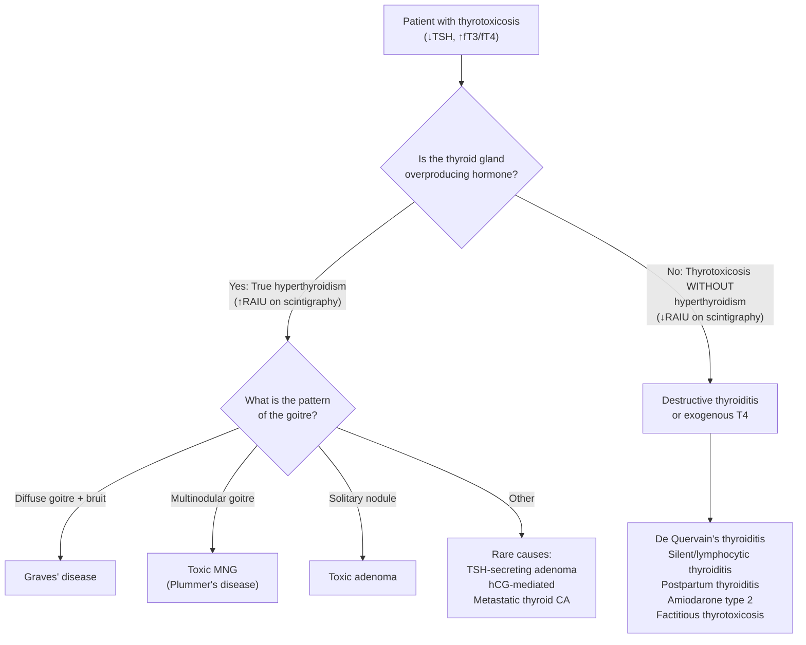
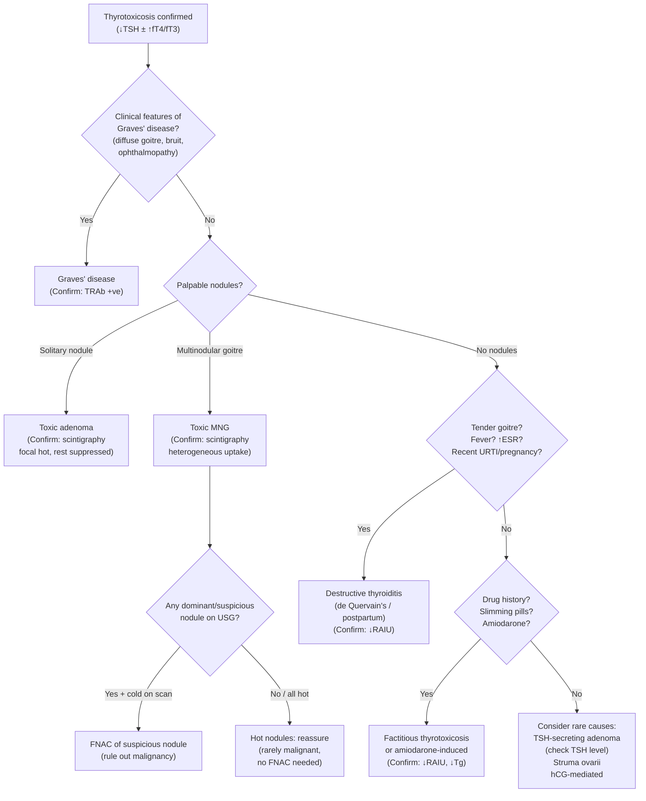

## Differential Diagnosis of Toxic Multinodular Goitre

When a patient presents with features suggesting toxic multinodular goitre — namely thyrotoxicosis combined with a nodular thyroid — you need to systematically work through the differential diagnosis. The clinical question is really two-fold:

1. **What is the cause of this patient's thyrotoxicosis?** (i.e., differential diagnosis of thyrotoxicosis)
2. **What is the nature of this multinodular goitre?** (i.e., could there be a coexisting malignancy within the MNG?)

Let's address both systematically.

---

### Part 1: Differential Diagnosis of Thyrotoxicosis

The approach begins with understanding that thyrotoxicosis (excess circulating thyroid hormone) can arise from three fundamentally different mechanisms:

1. **True hyperthyroidism** — the gland is overproducing hormone
2. **Destructive/inflammatory thyroiditis** — stored hormone is leaking out of damaged follicles
3. **Exogenous thyroid hormone** — iatrogenic or factitious intake

This is the single most important conceptual framework for the DDx.

### Detailed Differential Diagnosis Table

| Diagnosis | Key Distinguishing Features | Why It Mimics TMNG | How to Differentiate |
|---|---|---|---|
| ***Graves' disease*** | ***Diffuse toxic goitre: diffuse, non-tender, vascular with audible bruit***; ***ophthalmopathy (exophthalmos)***; ***pretibial myxoedema***; younger age (20–50y) [2] | Can present with thyrotoxicosis + goitre; occasionally Graves' can develop in a pre-existing MNG ("Marine-Lenhart syndrome") | Goitre is diffuse/smooth vs nodular; thyroid bruit present; ***TRAb positive (80–100%)***; ***scintigraphy: diffuse ↑uptake*** [3][6] |
| ***Toxic adenoma*** ("hot nodule") | ***Solitary palpable nodule***; younger than TMNG (30–50y); mild thyrotoxicosis | A dominant "hot" nodule in an MNG can mimic a solitary toxic adenoma | USG shows solitary nodule vs multiple; ***scintigraphy: focal ↑uptake with suppression elsewhere*** [1][3]; the rest of the gland is suppressed |
| ***Subacute (de Quervain's) thyroiditis*** | ***Preceding URTI***; ***fever***; ***tender goitre***; pain radiating to jaw/ears; ***↑ESR***; self-limiting (thyrotoxic → hypothyroid → recovery) [2][7] | Can cause transient thyrotoxicosis with a palpable goitre | ***Tender goitre*** (TMNG is non-tender); ***↓radioiodine uptake*** on scintigraphy (damaged follicles leak stored hormone but cannot trap new iodine — the follicular machinery is destroyed); systemic inflammatory markers elevated; ***self-limiting — do NOT give antithyroid medications*** [7] |
| ***Silent (painless) thyroiditis / Postpartum thyroiditis*** | ***Recent pregnancy (< 6 months)*** for postpartum; painless small goitre; fluctuating thyroid status | Thyrotoxicosis with a goitre | ***↓radioiodine uptake***; no nodularity; history of recent pregnancy; ***low titres of thyroid autoantibodies*** [4][7] |
| ***Factitious thyrotoxicosis*** | ***Intake of ANY medications (especially slimming pills)*** [4]; suppressed TSH with elevated T4; no goitre or small goitre | If a patient with a pre-existing non-toxic MNG takes exogenous thyroid hormone, they appear "toxic" | ***↓radioiodine uptake*** (exogenous hormone suppresses TSH → suppresses gland function); ***↓serum thyroglobulin*** (no glandular production); ***↑T4:T3 ratio*** (synthetic levothyroxine is T4) [3] |
| **Amiodarone-induced thyrotoxicosis (AIT)** | Type 1: excess iodine substrate → hyperthyroidism in pre-existing thyroid disease (e.g., MNG); Type 2: destructive thyroiditis from amiodarone toxicity | Type 1 AIT in a patient with MNG is essentially TMNG precipitated by iodine load (Jod-Basedow). Type 2 mimics destructive thyroiditis | Drug history is crucial; Type 1: ↑uptake on scintigraphy, Type 2: ↓uptake; often mixed features in practice |
| **TSH-secreting pituitary adenoma** | ***Very rare***; ***↑TSH + ↑T3 + ↑fT4*** ("TSH-dependent hyperthyroidism") [4]; visual field defects; diffuse goitre | Can cause goitre + thyrotoxicosis | ***TSH is NOT suppressed*** — it is normal or elevated (this is the key distinguishing feature; in ALL other causes of primary thyrotoxicosis TSH is suppressed) |
| ***Gestational thyrotoxicosis / hCG-mediated*** | First trimester; hyperemesis gravidarum; ***hydatidiform mole may secrete large amounts of hCG which mimics TSH structure*** [4] | Thyrotoxicosis in a woman of reproductive age | History of pregnancy; ↑βhCG; no nodularity; self-limiting after first trimester |
| **Struma ovarii** | Ectopic thyroid tissue in an ovarian dermoid/teratoma producing thyroid hormone | Rare cause of thyrotoxicosis | No thyroid goitre; ↓thyroid RAIU; pelvic mass on imaging; ectopic uptake on whole-body scintigraphy |

<Callout title="The Scintigraphy Pattern Is the Key Differentiator" type="idea">

When the clinical picture is ambiguous, ***thyroid scintigraphy*** separates the wheat from the chaff [1][3][8]:

- ***Diffuse ↑uptake → Graves' disease*** or secondary hyperthyroidism
- ***Heterogeneous ↑uptake → Toxic MNG*** (hot and cold areas intermixed)
- ***Focal ↑uptake with suppression elsewhere → Toxic adenoma***
- ***↓uptake (diffusely) → Destructive thyroiditis or factitious thyrotoxicosis***

This is because scintigraphy directly measures the **metabolic function** of thyroid tissue — whether the gland is actively trapping iodine (true hyperthyroidism) or not (destructive/exogenous causes) [8].
</Callout>

### Clinical Approach: Step-by-Step Differentiation

The diagnostic algorithm for a patient presenting with **thyrotoxicosis + goitre** follows this logic [3][4][6]:

**Step 1 — Confirm thyrotoxicosis biochemically**
- ***TSH is the most sensitive indicator*** [6] → if suppressed, proceed to fT4 and fT3
- ***↓TSH + ↑fT4 = overt primary thyrotoxicosis***
- ***↓TSH + normal fT4 → measure fT3*** (to detect ***T3 toxicosis*** — 2–5% of patients have ONLY elevated fT3) [6]
- ***↓TSH + normal fT4 + normal fT3 = subclinical hyperthyroidism*** [2]

**Step 2 — Determine the aetiology clinically**
- ***Features of Graves' disease?*** → diffuse goitre, bruit, ophthalmopathy, pretibial myxoedema, young female → Graves' [4]
- ***Palpable nodules?*** → ***solitary adenoma or toxic MNG*** [4]
- ***Recent pregnancy (< 6 months), preceding URTI, fever, tender goitre?*** → ***destructive thyroiditis*** [4]
- ***Intake of ANY medications (especially slimming pills)?*** → ***factitious thyrotoxicosis*** [4]

**Step 3 — Aetiological investigations if not clinically apparent**
- ***TRAb (thyrotropin receptor antibodies)***: Sensitivity 97%, Specificity 99% with newer assays → if positive, Graves' disease [3]
- ***Thyroid scintigraphy***: Useful when you need to distinguish between causes, especially to ***rule out destructive thyroiditis*** or to ***rule out malignancy in a dominant nodule within a toxic MNG*** [3]

**Step 4 — Assess the nodules for malignancy**
- ***USG: routine for ALL goitre/nodules*** [3]
- ***FNAC for suspicious nodules*** [3]
- ***Thyroid scintigraphy if nodule + ↓TSH*** → ***hot nodules are rarely cancer and hence do NOT require FNA***; ***cold nodules have 10–20% chance of malignancy and hence require FNA*** provided sonographic criteria are met [6]

---

### Part 2: Differential Diagnosis of the Multinodular Goitre Itself

A multinodular goitre is NOT always benign. ***Around 10–15% of thyroid nodules are malignant*** [5]. In a patient with TMNG, you must also consider whether any nodule could harbour malignancy.

***Differential diagnosis of thyroid nodules*** (within a multinodular goitre) [2][3]:

| Category | Examples | Approximate Frequency |
|---|---|---|
| ***Non-neoplastic nodules*** | ***Colloid, haemorrhagic, complex, cystic, hyperplastic, adenomatous nodules, dominant nodule in MNG*** | ***70%*** |
| ***Benign follicular adenoma*** | ***Non-toxic (more common), toxic*** | ***15%*** |
| ***Thyroid malignancies*** | ***Papillary, follicular, medullary, anaplastic, lymphoma, metastatic*** | ***~10–15%*** |
| **Miscellaneous** | Thyroiditis, other | ~5% |

#### Red Flags for Malignancy Within an MNG

This is critical because a ***dominant or atypical nodule in a multinodular goitre*** warrants FNAC [6]:

| Feature | Why It Is Concerning |
|---|---|
| ***Male sex*** | Thyroid nodules are less common in males but more likely to be malignant |
| ***Age < 14y or > 70y*** | Nodules in the 3rd to 6th decade are usually benign; extremes of age carry higher malignancy risk |
| ***Solitary or dominant nodule*** | A single dominant nodule within an MNG is more likely malignant than multiple indistinguishable nodules |
| ***Firm/hard consistency, fixation*** | Suggests invasion into surrounding structures — hallmark of malignancy |
| ***Rapid progressive growth (weeks to months)*** | Normal thyroid nodules grow slowly; rapid growth suggests anaplastic CA, lymphoma, or haemorrhage into a nodule |
| ***Pressure symptoms / RLN palsy (dysphonia)*** | Indicates rapid growth and local invasion — especially concerning for anaplastic or poorly differentiated carcinoma |
| ***Cervical lymphadenopathy (especially level VI)*** | Level VI is the first site of metastasis for thyroid carcinoma (central compartment nodes) |
| ***Previous neck irradiation*** | Strong risk factor for papillary thyroid carcinoma |
| ***Family history of thyroid cancer*** | ~20% of medullary CA (MEN2), ~5% of papillary CA are familial [3] |
| ***Cold nodule on scintigraphy*** | ***Cold (hypofunctioning) nodules have 10–20% chance of being cancer*** [6] |

<Callout title="Hot Nodules Are Almost Never Cancer" type="error">
***Hyperfunctioning (hot) nodules on scintigraphy are rarely cancer and do NOT require FNA*** [6]. This is because the molecular machinery for autonomous hormone production (constitutively active TSHR) is different from the mutations driving malignancy. A hot nodule indicates functional autonomy — virtually always benign. However, ***cold (hypofunctioning) nodules have a 10–20% risk of malignancy*** and must be investigated with FNAC if sonographic criteria are met [6].
</Callout>

### USG Features Suspicious for Malignancy (TI-RADS)

When evaluating nodules within an MNG on ultrasound, look for these features [3]:

| Feature | Significance |
|---|---|
| **Hypoechoic, heterogeneous** | More likely malignant than iso/hyperechoic |
| **Taller than wide** | Suggests growth against tissue planes — infiltrative pattern |
| **Irregular margins** | Suggests local invasion |
| **Solid (vs cystic)** | Solid nodules carry higher malignancy risk |
| ***Microcalcification (< 0.2 mm)*** | ***Represents Psammoma bodies of papillary carcinoma*** |
| **Absent or incomplete perilesional halo** | Halo = compression without invasion; absent halo suggests invasion |
| **Intranodular vascularity** | Central vascularity more suspicious than peripheral |
| **Local invasion (especially into strap muscles)** | Indicates locally advanced malignancy |
| **Suspicious cervical lymph nodes** | Absent hilum, microcalcification, round shape, peripheral vascularity |

---

### Summary: Distinguishing TMNG from Its Closest Mimics

| Feature | Toxic MNG | Graves' Disease | Toxic Adenoma | De Quervain's Thyroiditis | Factitious Thyrotoxicosis |
|---|---|---|---|---|---|
| **Goitre** | Multinodular, large, irregular | Diffuse, smooth, bruit | Solitary nodule | Diffuse, ***tender*** | Small / no goitre |
| **Age** | > 50y (elderly) | 20–50y | 30–50y | Any (post-viral) | Any |
| **Pain** | No (unless haemorrhage) | No | No | ***Yes — tender goitre*** | No |
| **Ophthalmopathy** | No | Yes | No | No | No |
| **TRAb** | Negative | Positive | Negative | Negative | Negative |
| **Anti-TPO** | 10–20% | 50–80% | Usually negative | Low titre | Negative |
| ***Scintigraphy*** | ***Heterogeneous ↑uptake*** | ***Diffuse ↑uptake*** | ***Focal ↑uptake, suppression elsewhere*** | ***↓uptake (diffusely)*** | ***↓uptake (diffusely)*** |
| **Thyroglobulin** | Normal/↑ | Normal/↑ | Normal/↑ | ↑ (released from damaged follicles) | ***↓*** (gland suppressed) |
| **ESR** | Normal | Normal | Normal | ***↑↑*** | Normal |
| **T4:T3 ratio** | Normal/low | Normal/low | Normal/low | Normal | ***↑*** (synthetic T4) |

> **High Yield**: The ***three key investigations*** that differentiate causes of thyrotoxicosis are: (1) ***TRAb*** — positive only in Graves'; (2) ***Thyroid scintigraphy*** — pattern of uptake distinguishes all major causes; (3) ***USG*** — distinguishes nodular from diffuse goitre and screens for malignancy [1][3][6].

---

### Approach Algorithm (Mermaid)

<Callout title="High Yield Summary">

1. The DDx of thyrotoxicosis is organised by mechanism: **true hyperthyroidism** (Graves', toxic MNG, toxic adenoma) vs **destructive thyroiditis** (de Quervain's, silent, postpartum, amiodarone type 2) vs **exogenous** (factitious, iatrogenic)

2. ***Scintigraphy pattern is the single most useful test*** to distinguish: diffuse ↑ = Graves'; heterogeneous ↑ = toxic MNG; focal hot + rest suppressed = toxic adenoma; diffuse ↓ = destructive/factitious

3. ***TRAb*** is highly sensitive and specific for Graves' disease (97%/99%) — negative in TMNG

4. Within a toxic MNG, ***dominant or cold nodules must be evaluated for malignancy*** with USG ± FNAC. ***Hot nodules are rarely cancer and do NOT require FNA***

5. ***Tender goitre + ↑ESR + preceding URTI = de Quervain's thyroiditis*** — self-limiting, do NOT give antithyroid drugs (↓RAIU confirms)

6. Always ask about drug history: ***amiodarone and slimming pills*** are important causes of thyrotoxicosis in Hong Kong

7. ***TSH-secreting pituitary adenoma*** is distinguished by ***TSH that is NOT suppressed*** — the only cause where TSH is normal/elevated with elevated T3/T4
</Callout>

---

<ActiveRecallQuiz
  title="Active Recall - Differential Diagnosis of Toxic Multinodular Goitre"
  items={[
    {
      question: "A 65-year-old woman presents with weight loss and AF. Examination reveals a multinodular goitre with no tenderness, no bruit, and no ophthalmopathy. TFT shows TSH less than 0.01 and fT4 18 (elevated). What is the most likely diagnosis and what scintigraphy pattern would you expect?",
      markscheme: "Diagnosis: Toxic multinodular goitre (Plummer's disease). Expected scintigraphy: heterogeneous uptake with multiple areas of increased and decreased activity (hot and cold areas). Key distinguishing features from Graves': no bruit, no ophthalmopathy, multinodular (not diffuse) goitre, elderly age."
    },
    {
      question: "Name the three fundamental mechanisms causing thyrotoxicosis and give one example of each.",
      markscheme: "(1) True hyperthyroidism (gland overproducing) - e.g. Graves' disease, toxic MNG, toxic adenoma. (2) Destructive thyroiditis (stored hormone leaking from damaged follicles) - e.g. de Quervain's thyroiditis, postpartum thyroiditis, amiodarone type 2. (3) Exogenous thyroid hormone - e.g. factitious thyrotoxicosis (slimming pills), iatrogenic levothyroxine overdose."
    },
    {
      question: "On thyroid scintigraphy, a hot (hyperfunctioning) nodule is found within a multinodular goitre. Does this nodule need FNAC? Explain why or why not.",
      markscheme: "No, hot nodules do NOT require FNAC. Hot nodules are rarely malignant because the molecular machinery for autonomous hormone production (constitutively active TSHR mutations driving cAMP signalling) is different from the mutations driving thyroid carcinoma. However, cold (hypofunctioning) nodules within the same MNG have a 10-20% risk of malignancy and should undergo FNAC if sonographic criteria are met."
    },
    {
      question: "A patient with known non-toxic MNG develops thyrotoxicosis 2 weeks after a contrast-enhanced CT scan. What phenomenon explains this and what is the mechanism?",
      markscheme: "Jod-Basedow phenomenon (iodine-induced thyrotoxicosis). Mechanism: the iodinated contrast provides a large iodine load. Pre-existing autonomous nodules within the MNG (with somatic TSHR or Gsalpha mutations) use this iodine as substrate to ramp up T3/T4 production, tipping the patient from subclinical to overt thyrotoxicosis. The non-autonomous thyroid tissue is already suppressed and cannot compensate."
    },
    {
      question: "How do you distinguish destructive thyroiditis from toxic MNG as a cause of thyrotoxicosis? Name three differentiating features.",
      markscheme: "Three differentiating features: (1) Scintigraphy - decreased/absent uptake in destructive thyroiditis (damaged follicles cannot trap iodine) vs heterogeneous increased uptake in toxic MNG. (2) Clinical - tender goitre with fever and elevated ESR in de Quervain's vs non-tender multinodular goitre in TMNG. (3) Course - destructive thyroiditis is self-limiting (thyrotoxic phase then hypothyroid phase then recovery) vs TMNG is persistent/progressive. Also: antithyroid drugs are ineffective in destructive thyroiditis (no new hormone synthesis to block)."
    }
  ]}
/>

## References

[1] Lecture slides: GC 177. A thyroid nodule benign thyroid nodules; thyroid cancer.pdf (p4, p13, p15)
[2] Senior notes: Ryan Ho Endocrine.pdf (p17, p31–32)
[3] Senior notes: Ryan Ho Fundamentals.pdf (p172, p422, p425–427)
[4] Senior notes: Adrian Lui Pediatrics.pdf (p271)
[5] Senior notes: maxim.md (Approach to thyroid nodules, Thyroid cancer overview)
[6] Senior notes: felixlai.md (Thyroid antibodies, Bethesda classification, Thyroid scintigraphy)
[7] Senior notes: Ryan Ho Endocrine.pdf (p31 — Subacute thyroiditis)
[8] Senior notes: Ryan Ho Diagnostic Radiology.pdf (p59 — Thyroid scintigraphy)
