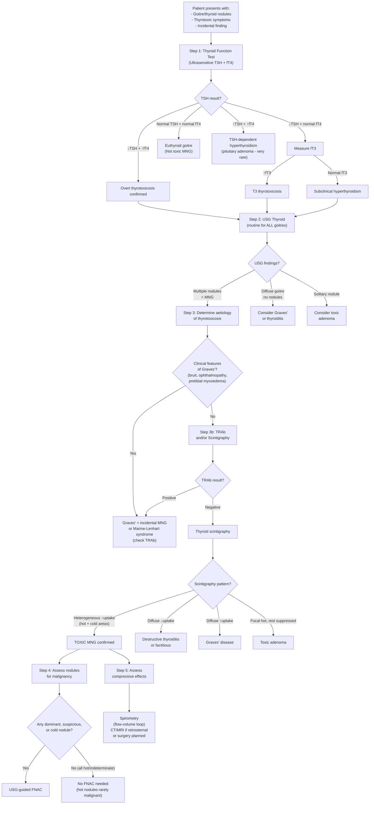
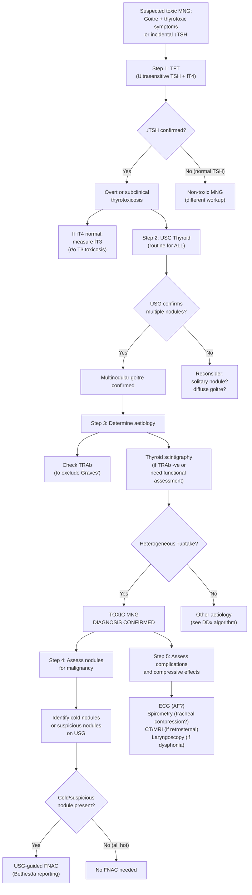

## Diagnostic Criteria, Algorithm and Investigation Modalities for Toxic Multinodular Goitre

### Diagnostic Criteria

There is no single "diagnostic criterion" for toxic multinodular goitre in the way that, say, the Jones criteria exist for rheumatic fever. Instead, the diagnosis of TMNG rests on the **convergence of three pillars**:

1. **Biochemical confirmation of thyrotoxicosis** — suppressed TSH ± elevated fT4/fT3
2. **Structural confirmation of a multinodular goitre** — by clinical examination and ultrasound
3. **Functional confirmation that the multinodular goitre is the source** — by thyroid scintigraphy showing heterogeneous uptake, and/or exclusion of other aetiologies (especially Graves' disease)

Let's think about why each pillar is necessary:

- **Pillar 1 (Biochemistry)** answers: *"Is this patient truly thyrotoxic, or are the symptoms from something else?"*
- **Pillar 2 (Structure)** answers: *"What does the thyroid look like? Is it multinodular (TMNG) vs diffuse (Graves') vs solitary nodule (toxic adenoma)?"*
- **Pillar 3 (Function/Aetiology)** answers: *"Is the MNG actually the CAUSE of the thyrotoxicosis, or does this patient have an MNG incidentally plus a separate cause of thyrotoxicosis (e.g., Graves' superimposed on MNG, destructive thyroiditis)?"*

<Callout title="Diagnostic Triad for TMNG">

To diagnose toxic multinodular goitre, you need ALL THREE:
1. ***↓TSH (± ↑fT4/fT3)*** — biochemical thyrotoxicosis
2. **Multinodular goitre** on examination and/or USG
3. ***Heterogeneous ↑uptake on thyroid scintigraphy*** (or negative TRAb to exclude Graves') — confirming the MNG as the source [2][3][4]
</Callout>

---

### The Diagnostic Algorithm

The approach to investigating a patient with suspected TMNG follows a logical, stepwise pathway. This is the same general algorithm used for all thyrotoxicosis and goitres, but with specific branch points relevant to TMNG.

---

### Investigation Modalities — Comprehensive Breakdown

Let me now walk through each investigation in detail, explaining what it tells you, why you order it, and how to interpret the findings.

---

#### 1. Thyroid Function Test (TFT)

***This is the first and most important investigation*** [1][2][3][4].

**What to order**: ***Ultrasensitive TSH + fT4*** as the initial screen [3][4]

**Why TSH first?**
- ***TSH is the most sensitive indicator of thyroid function*** [4][6] — this is because of the **log-linear relationship** between TSH and fT4. A small change in fT4 produces a large, amplified change in TSH. So TSH becomes abnormal *before* fT4 moves outside the reference range. This is why subclinical disease (where fT4 is still normal) is picked up by TSH first.

**How to interpret:**

| TSH | fT4 | fT3 | Interpretation |
|---|---|---|---|
| ***↓↓ (usually undetectable)*** | ***↑*** | ***↑*** | ***Overt primary thyrotoxicosis*** — the diagnosis is confirmed [3][4] |
| ***↓*** | ***Normal*** | ***↑*** | ***T3 thyrotoxicosis*** — 2–5% of patients have ONLY elevated fT3; this is why fT3 must be checked if fT4 is normal with suppressed TSH [6] |
| ***↓*** | ***Normal*** | ***Normal*** | ***Subclinical hyperthyroidism*** — ***most common initial biochemical presentation of toxic MNG***; ***25% of MNG patients have complete suppression of TSH*** with thyroid hormones still in the reference range [2] |
| ↑ | ↑ | ↑ | ***TSH-dependent hyperthyroidism — very rare, due to TSH-secreting pituitary adenomas*** [3][4] |
| Normal | Normal | Normal | Euthyroid — the goitre is non-toxic |

<Callout title="Why Measure FREE T4, Not Total T4?" type="idea">
T3 and T4 are highly protein-bound (>99% to thyroxine-binding globulin/TBG, albumin, and transthyretin). Many factors alter binding protein levels — ***pregnancy, oral contraceptives, and hormonal therapy increase TBG*** (→ falsely elevated total T4), while ***androgens and hypoalbuminaemia decrease TBG*** (→ falsely low total T4). ***Free T4 (fT4) and free T3 (fT3) are normal in euthyroid patients with altered TBG and hence are preferable over total thyroid hormones*** [6].
</Callout>

**Additional TFT considerations:**

- ***Sick euthyroidism***: In acutely ill patients, systemic illness causes ***↓peripheral conversion of T4→T3, altered binding protein levels, and ↓TSH secretion***. The pattern: ***TSH low/low-normal, fT4 low/normal/high, T3 usually low*** [3][4]. Key point: ***T3 should be checked if suspected hyperthyroidism with concurrent illness*** — in sick euthyroidism T3 is low, whereas in true hyperthyroidism T3 is elevated [3][4].

- ***Other causes of ↓TSH*** (without hyperthyroidism): central hypothyroidism (pituitary/hypothalamic insufficiency), systemic illness, pregnancy (hCG cross-reacts with TSH receptor in first trimester) [3][4].

---

#### 2. Thyroid Ultrasound (USG)

***Routine for ALL patients with goitre/palpable nodules*** [1][2][3].

**Why is USG essential in TMNG?**
USG serves multiple purposes simultaneously:

| Purpose | Explanation |
|---|---|
| ***Define anatomy and size of goitre*** | Quantify gland volume; document number, size, and location of nodules [2][3] |
| ***Ascertain risk of malignancy*** | Look for suspicious features in individual nodules (TI-RADS classification); ***around 10–15% of nodules are malignant*** [5] |
| ***Assess cervical lymph nodes*** | ***Especially level VI (central compartment)*** — the first site of thyroid carcinoma metastasis [5][6] |
| ***Assess retrosternal extension*** | Lower poles dipping below the thoracic inlet [5] |
| ***Guide FNAC*** | Target biopsy to the most suspicious region of a nodule — ↑diagnostic accuracy [2][3] |

**Technical details**: ***7.5 or 10 MHz probes, B-mode*** [3]. Readily available, non-invasive, ***↑sensitivity but ↓specificity*** [3]. Used as an ***extension of physical examination to guide (not confirm) diagnosis*** [3].

<Callout title="USG Is NOT a Screening Test" type="error">
***USG should NOT be used as a screening test for healthy subjects*** [3] — its high sensitivity but low specificity means that it will pick up clinically insignificant thyroid nodules in > 30% of the population, leading to unnecessary anxiety, biopsies, and costs. It is only indicated when there is a clinical reason (palpable goitre, abnormal TFT, clinical suspicion).
</Callout>

**USG features to report:**

**The nodule itself** [3][6]:

| Feature | Suspicious for Malignancy | Reassuring |
|---|---|---|
| ***Echogenicity*** | ***Hypoechoic, heterogeneous*** | Hyperechoic, isoechoic |
| ***Shape*** | ***Taller than wide*** | Wider than tall |
| ***Margins*** | ***Irregular (infiltrative/microlobulated)*** | Smooth, well-defined |
| ***Internal structure*** | ***Solid, or cystic with irregular septa*** | ***Spongiform appearance***, purely cystic |
| ***Calcification*** | ***Microcalcification (< 0.2 mm)*** — ***represents Psammoma bodies of papillary carcinoma*** [3] | Large coarse calcification, ***comet-tail shadowing*** |
| ***Perilesional halo*** | ***Absent or incomplete*** (represents compression without a complete capsule → infiltrative) | Complete halo (capsulated, compressive) |
| ***Vascularity*** | ***Intranodular (central) vascularity*** | Peripheral vascularity |
| ***Local invasion*** | ***Invasion into strap muscles*** | None |

**Surrounding tissues** [3]:
- **Other nodules**: presence of multiple nodules suggests MNG → generally reassuring (but dominant/atypical nodules still need evaluation)
- **Parenchymal abnormalities**: heterogeneous, hypoechoic parenchyma may suggest underlying thyroiditis
- ***Lymph nodes***: ***absent hilum, microcalcification, round shape, peripheral vascularity, hyperechoic → more likely malignant*** [3]

> **Mnemonic for suspicious USG features**: ***"SHIT CME"*** — ***S***olid, ***H***ypoechoic, ***I***rregular margins, ***T***aller than wide, ***C***alcification (micro), ***M***icrocalcification, ***E***xtrathyroidal extension — ***most important are solid & hypoechoic*** [5].

**Sonographic criteria for FNA (ATA 2015 Guidelines)** [6]:

| Sonographic Pattern | Ultrasound Findings | Risk of Malignancy | Size Cutoff for FNA |
|---|---|---|---|
| ***High suspicion*** | ***Solid hypoechoic nodule ± microcalcifications, rim calcification with extrusive soft tissue, taller than wide, irregular margins, extrathyroidal extension*** | ***> 70–90%*** | ***≥ 1 cm*** |
| ***Intermediate suspicion*** | ***Hypoechoic solid nodule WITHOUT microcalcifications, taller-than-wide, or extrathyroidal extension*** | ***10–20%*** | ***≥ 1 cm*** |
| ***Low suspicion*** | Isoechoic/hyperechoic solid nodule, or partially cystic with eccentric solid areas, WITHOUT suspicious features | 5–10% | ≥ 1.5 cm |
| ***Very low suspicion*** | Spongiform or partially cystic without suspicious features | < 3% | ≥ 2 cm |
| ***Benign*** | Purely cystic | ***< 1%*** | ***No FNA*** |

---

#### 3. Thyroid Scintigraphy (Radionuclide Scan)

***This is the key investigation for determining the aetiology of thyrotoxicosis and the functional status of nodules*** [1][2][3][8].

**When to order it:**

***Thyroid scintigraphy is indicated in patients with thyroid nodule(s) + ↓TSH*** [1][2][3][6] — i.e., when there is biochemical evidence of hyperthyroidism AND nodularity. It is also indicated when the clinical picture does not clearly point to a specific aetiology.

***It is NOT recommended for routine diagnostic use*** [6] — only for specific indications:

| Indication | Rationale |
|---|---|
| ***↓TSH + thyroid nodule(s)*** | ***Determine functional status of the nodule — hot vs cold*** [1][4][6] |
| ***Differentiate between Graves' + co-existent nodule vs toxic adenoma vs toxic MNG*** | ***Pattern of uptake distinguishes the three*** [2][4] |
| ***Suspecting destructive thyroiditis*** | ***↓uptake globally confirms destructive/factitious aetiology*** [2][4] |
| ***Determine functional status of dominant nodule in toxic MNG*** | ***Hot nodules are almost never malignant → no FNAC needed; cold nodules warrant FNAC*** [4][6] |

**Radiopharmaceuticals** [8]:

| Agent | What It Measures | Details |
|---|---|---|
| ***⁹⁹ᵐTc-pertechnetate*** | ***Iodine trapping only*** | ***Has similar ionic size as iodide ion → taken up by NIS*** [8]; most commonly used; quick, cheap |
| ***¹²³I*** | ***Trapping + organification*** | More physiological; better for quantitative uptake measurements; more expensive |
| ***¹³¹I*** | Trapping + organification | Higher radiation dose; mainly used for therapy (RAI ablation), not routine diagnostic imaging |

**Principle**: ***Radioactive iodine is handled in the same manner as normal iodine*** [8]. The ***level of uptake reflects metabolic activity*** — areas producing more hormone trap more tracer and appear "hot"; areas that are inactive appear "cold" [8].

**Images**: ***Obtained at anterior, left anterior oblique (LAO), and right anterior oblique (RAO)*** views [8].

***Interpretation — this is extremely high yield*** [1][2][3][4]:

| Scintigraphy Pattern | Diagnosis | Why |
|---|---|---|
| ***Heterogeneous ↑uptake (patchy hot and cold areas)*** | ***Toxic MNG*** | Multiple autonomous nodules (hot) interspersed with suppressed or non-functioning tissue (cold) [2][3][4] |
| ***Diffuse ↑uptake*** | ***Graves' disease*** (or secondary hyperthyroidism) | Entire gland is uniformly stimulated by TRAb [2][3][4] |
| ***Focal ↑uptake with suppression of surrounding tissue*** | ***Toxic adenoma*** | Single autonomous nodule produces all the hormone; the rest of the gland is suppressed by ↓TSH [2][3][4] |
| ***Diffuse ↓uptake*** | ***Destructive thyroiditis or factitious thyrotoxicosis*** | Follicles are destroyed (thyroiditis) or suppressed by exogenous T4 (factitious) → cannot trap iodine [2][3][4] |

<Callout title="Scintigraphy in Toxic MNG — Dual Purpose">
In TMNG, scintigraphy serves TWO purposes simultaneously:
1. **Confirms the MNG as the aetiology** of thyrotoxicosis (heterogeneous uptake pattern)
2. **Identifies cold nodules** within the MNG that may harbour malignancy and warrant FNAC — ***hot nodules are rarely cancer and do NOT require FNA; cold nodules have 10–20% risk of malignancy*** [6]
</Callout>

> ***Radio-isotope scintigraphy (I¹²³ or Tc⁹⁹ᵐ): for diagnosis of malignancy it has low sensitivity and specificity; its main role is functional assessment in thyrotoxic patients*** [1].

**Why NOT use scintigraphy routinely (i.e., in euthyroid patients)?**
- ***Scintigraphy should NOT be used if TSH is normal*** [3] — because if the patient is euthyroid, the nodule is not hyperfunctioning. Most cold nodules are benign anyway, and the test would lead to unnecessary biopsies. In euthyroid patients, USG + FNAC is the appropriate pathway.

---

#### 4. Thyrotropin Receptor Antibodies (TRAb)

***TRAb: Sensitivity 97%, Specificity 99% with newer assays*** [2][3][4].

**When to order**: When the aetiology of thyrotoxicosis is ***not clinically apparent*** [2][3]. In TMNG, TRAb is used primarily to **exclude Graves' disease**:

| TRAb Result | Interpretation |
|---|---|
| **Positive** | Graves' disease (or Graves' superimposed on pre-existing MNG — "Marine-Lenhart syndrome") |
| **Negative** | NOT Graves' — supports TMNG, toxic adenoma, or destructive thyroiditis |

**Antibody prevalence across conditions** [6]:

| Condition | Anti-TSH (TRAb) | Anti-TPO | Anti-TG |
|---|---|---|---|
| Normal population | 0% | 10–15% | 10–20% |
| Graves' disease | 80–90% | 50–80% | 50–70% |
| Hashimoto thyroiditis | 10–20% | 90–100% | 80–90% |
| ***Multinodular goitre*** | ***10–20%*** | ***10–20%*** | ***30–40%*** |

Note that 10–20% of MNG patients can have low-titre TRAb — this does not mean they have Graves'. Context matters.

---

#### 5. Fine Needle Aspiration Cytology (FNAC)

***FNAC is the single most important investigation for thyroid nodules if TSH is not depressed*** [2][3]. In TMNG specifically, FNAC is used to **rule out coexistent malignancy** in suspicious nodules.

**Technique**: ***Trans-isthmic approach ± USG guidance*** [2][3]. USG guidance is preferred because it ***confirms the presence of the nodule and targets the biopsy to the most suspicious region*** [3].

<Callout title="Why Not Core Needle Biopsy?" type="error">
***Core needle biopsy is NOT performed on the thyroid*** [6] because:
1. The thyroid is an extremely **vascularised** organ → core biopsy risks **massive bleeding**
2. ***FNAC is very accurate*** (90–95%) for identifying thyroid cancer types [3]
The only exception is suspected thyroid lymphoma, which may require core biopsy for architectural assessment.
</Callout>

**Indications for FNAC in TMNG** [6]:

- ***Dominant or atypical nodule in multinodular goitre***
- ***Hypofunctioning (cold) nodules on scintigraphy***
- ***Nodules meeting sonographic size criteria*** (see ATA 2015 criteria above)
- ***Nodules associated with abnormal cervical lymph nodes***
- ***Complex or recurrent cystic nodules***

**NOT indicated for**:
- ***Hot (hyperfunctioning) nodules — these are almost never malignant*** [6]

**Reporting: The Bethesda Classification** [3][6]:

| ***Class*** | ***Diagnostic Category*** | ***Cancer Risk*** | ***Usual Management*** |
|---|---|---|---|
| ***I*** | ***Non-diagnostic*** | ***1–4%*** | ***Repeat FNA*** (or operate if radiologically suspicious) |
| ***II*** | ***Benign*** | ***0–3%*** | ***Clinical follow-up*** |
| ***III*** | ***AUS or FLUS (atypia of undetermined significance / follicular lesion of undetermined significance)*** | ***5–15%*** | ***Repeat FNA; molecular testing; hemithyroidectomy if AUS ×2*** |
| ***IV*** | ***Follicular neoplasm*** | ***15–30%*** | ***Hemithyroidectomy; molecular testing*** |
| ***V*** | ***Suspicious for malignancy*** | ***60–75%*** | ***Hemithyroidectomy + frozen section → total thyroidectomy*** |
| ***VI*** | ***Malignant*** | ***97–99%*** | ***Total thyroidectomy*** |

**Limitations**: ***Histological demonstration of capsular or vascular invasion is required to diagnose whether a follicular lesion is benign or malignant*** [3] — FNA cannot distinguish follicular adenoma from follicular carcinoma. This is why Bethesda IV (follicular neoplasm) requires surgical excision for definitive diagnosis.

**Newer technology**: ***Molecular diagnostics (e.g., Veracyte Afirma)*** — based on multi-gene expression panels to help reclassify indeterminate nodules (Bethesda III/IV), but ***currently expensive, no universal standards, and not readily available*** [3].

---

#### 6. Additional Investigations

##### a. Routine Bloods

| Investigation | Indication | Rationale |
|---|---|---|
| **CBC with differentials** | All patients | Baseline; exclude concurrent illness |
| **Serum calcium, phosphate** | Pre-operative baseline | Document pre-operative parathyroid function (important baseline before thyroidectomy) |
| **Liver function tests** | Baseline before ATD | Carbimazole/methimazole can cause hepatotoxicity (cholestatic); PTU can cause hepatocellular injury |
| **ESR, antithyroid antibodies** | If thyroiditis suspected | ***ESR ↑↑ in de Quervain's thyroiditis*** [2][3] |
| **Calcitonin** | If FHx or clinical suspicion of medullary carcinoma or MEN2 | Screening for medullary thyroid carcinoma [3] |

##### b. Investigations for Compressive/Retrosternal Goitre

These are ***selective, NOT routine*** [1][3][5]:

| Investigation | When Indicated | What It Shows |
|---|---|---|
| ***CXR (thoracic inlet view)*** | Suspected retrosternal extension | Tracheal deviation; retrosternal soft tissue shadow; tracheal compression [1] |
| ***CT / MRI neck and thorax*** | ***Only when: (1) retrosternal goitre, or (2) locally advanced thyroid cancer*** [5] | ***Degree of tracheal displacement or compression; extent of retrosternal extension; relationship to great vessels; surgical planning*** [2][5] |
| ***Spirometry (flow-volume loop)*** | Suspected significant tracheal compression | ***Upper airway obstruction (UAO) results in a blunted flow-volume loop*** [2][3] — both inspiratory and expiratory limbs are flattened if there is fixed UAO; variable extrathoracic obstruction produces flattening of the inspiratory limb only |
| ***Direct laryngoscopy*** | Hoarseness / dysphonia | ***Assess vocal cord function — recurrent laryngeal nerve palsy*** [3]; essential pre-operatively |
| **OGD** | Dysphagia with suspected oesophageal involvement | Assess oesophageal compression or invasion [3] |

<Callout title="Why Does Retrosternal Goitre Require CT?" type="idea">
***Retrosternal goitre requires CT because*** [5]:
1. ***Cannot be visualised by USG*** — ultrasound cannot penetrate the sternum
2. ***Surgical planning*** — need to know the extent of retrosternal extension and relationship to great vessels
3. ***Retrosternal goitre may be malignant*** — cannot be assessed by USG/FNAC alone

***Important caveat***: ***Iodinated contrast used in CT may affect post-operative radioactive iodine body scan*** [3] — if RAI therapy is planned, either use non-contrast CT/MRI or allow sufficient washout time (typically 6–8 weeks) before RAI.
</Callout>

##### c. PET Scan

***No diagnostic role at all*** in the primary workup of TMNG or benign thyroid nodules [5]. PET is used in thyroid cancer follow-up (e.g., rising thyroglobulin with negative RAI scan in differentiated thyroid carcinoma).

---

### Summary: Routine vs Selective Investigations

| Category | Investigation | Routine or Selective | Notes |
|---|---|---|---|
| ***Blood*** | ***TFT (ultrasensitive TSH + fT4)*** | ***Routine*** | First-line; confirms thyrotoxicosis [1][3] |
| | fT3 | Selective | Only if ↓TSH + normal fT4 (to detect T3 toxicosis) [4] |
| | TRAb | Selective | If aetiology not clinically apparent; to r/o Graves' [2][3] |
| | Anti-TPO, anti-TG | Selective | If thyroiditis suspected [3] |
| | ESR | Selective | If de Quervain's suspected [3] |
| | Calcitonin | Selective | If MTC/MEN2 suspected [3] |
| ***Imaging*** | ***USG thyroid*** | ***Routine*** | For ALL goitres/nodules [1][2][3] |
| | ***Thyroid scintigraphy*** | ***Selective*** | ***Only in toxic (↓TSH) + nodules*** [1][5] |
| | CXR | Selective | Thoracic inlet view if retrosternal suspected [1] |
| | CT/MRI | Selective | ***Only for retrosternal goitre or locally advanced cancer*** [5] |
| | PET scan | ***NOT indicated*** | ***No diagnostic role*** [5] |
| ***Cytology*** | ***FNAC*** | ***Selective*** | ***For suspicious, cold, or dominant nodules only*** [1][2][3] |
| ***Functional*** | Spirometry (flow-volume loop) | Selective | If tracheal compression suspected [2][3] |
| ***Endoscopy*** | Direct laryngoscopy | Selective | If dysphonia / pre-operatively [3] |

---

### Putting It All Together: The Complete Investigation Pathway for Suspected TMNG

> **High Yield**: The investigation pathway can be summarised as: ***TFT → USG → Scintigraphy (if ↓TSH + nodules) → FNAC (if cold/suspicious nodules) → Assess complications*** [1][2][3][5].

---

<Callout title="High Yield Summary">

1. ***TSH is the single most sensitive test*** for thyroid dysfunction — always start with ultrasensitive TSH + fT4

2. ***fT3 must be measured if ↓TSH + normal fT4*** to detect T3 thyrotoxicosis (2–5% of cases)

3. ***Free hormones (fT4, fT3) are preferred over total*** because binding protein levels are affected by pregnancy, OCP, androgens, hypoalbuminaemia

4. ***USG is routine for ALL goitres/nodules*** — not just for structure but also to assess malignancy risk (TI-RADS) and guide FNAC

5. ***Thyroid scintigraphy is ONLY indicated when ↓TSH + nodules*** — pattern distinguishes TMNG (heterogeneous ↑), Graves' (diffuse ↑), toxic adenoma (focal hot), destructive thyroiditis (diffuse ↓)

6. ***Hot nodules are almost never malignant (< 1%) → no FNAC needed; cold nodules have 10–20% malignancy risk → FNAC if sonographic criteria met***

7. ***FNAC reported using the Bethesda classification*** (I–VI); accuracy 90–95%; cannot distinguish follicular adenoma from carcinoma (needs histology)

8. ***CT/MRI only for retrosternal goitre or locally advanced cancer*** — beware iodinated contrast may delay subsequent RAI therapy

9. ***PET has no diagnostic role*** in thyroid nodule workup

10. ***Spirometry (flow-volume loop)*** screens for upper airway obstruction from tracheal compression
</Callout>

---

<ActiveRecallQuiz
  title="Active Recall - Diagnostic Criteria, Algorithm and Investigations for Toxic MNG"
  items={[
    {
      question: "A patient has suppressed TSH and normal fT4. What is the next step and why?",
      markscheme: "Measure fT3. Reason: 2-5% of patients have T3 thyrotoxicosis where ONLY fT3 is elevated. Autonomous thyroid nodules preferentially secrete T3 (the more biologically active hormone). If fT3 is also normal, the diagnosis is subclinical hyperthyroidism. If fT3 is elevated, the diagnosis is T3 thyrotoxicosis."
    },
    {
      question: "In a patient with confirmed thyrotoxicosis and a multinodular goitre, when would you order thyroid scintigraphy and what pattern confirms toxic MNG?",
      markscheme: "Order scintigraphy when: (1) TSH is suppressed AND there are thyroid nodules, (2) aetiology is not clinically apparent and TRAb is negative, (3) need to determine functional status of individual nodules (hot vs cold) and rule out malignancy. Pattern confirming toxic MNG: heterogeneous increased uptake with multiple hot and cold areas. Radiopharmaceuticals: 99mTc-pertechnetate (trapping only) or 123-I (trapping + organification)."
    },
    {
      question: "A cold nodule is found within a toxic MNG on scintigraphy. A hot nodule is also present. Which needs FNAC and why?",
      markscheme: "The COLD nodule needs FNAC (if sonographic criteria are met) because cold nodules have a 10-20% risk of malignancy. The HOT nodule does NOT need FNAC because hot nodules are almost never malignant (less than 1%) - the molecular machinery for autonomous hormone production (constitutively active TSHR) is different from oncogenic mutations driving carcinoma."
    },
    {
      question: "Name the Bethesda classification categories I through VI with their approximate cancer risk.",
      markscheme: "I: Non-diagnostic (1-4%); II: Benign (0-3%); III: AUS or FLUS - atypia of undetermined significance or follicular lesion of undetermined significance (5-15%); IV: Follicular neoplasm (15-30%); V: Suspicious for malignancy (60-75%); VI: Malignant (97-99%)."
    },
    {
      question: "Why is CT scan only selectively ordered in MNG workup, and what important caveat applies if RAI therapy is planned?",
      markscheme: "CT is only indicated for: (1) retrosternal goitre (USG cannot penetrate sternum), (2) locally advanced thyroid cancer (for delineation of cervical fascia structures and staging). NOT routine. Caveat: iodinated contrast used in CT may interfere with subsequent radioactive iodine (RAI) therapy or body scan - the excess iodine saturates the thyroid and competes with RAI uptake. Need to allow 6-8 weeks washout before RAI."
    },
    {
      question: "What is the mnemonic for suspicious USG features of thyroid nodules and which two features are most important?",
      markscheme: "Mnemonic: SHIT CME - Solid, Hypoechoic, Irregular margins, Taller than wide, Calcification (micro), Microcalcification, Extrathyroidal extension. The two most important features are SOLID and HYPOECHOIC."
    }
  ]}
/>

## References

[1] Lecture slides: GC 177. A thyroid nodule benign thyroid nodules; thyroid cancer.pdf (p7, p13, p15)
[2] Senior notes: Ryan Ho Endocrine.pdf (p13, p17, p19–20, p31–32)
[3] Senior notes: Ryan Ho Fundamentals.pdf (p421–422, p425–429)
[4] Senior notes: Adrian Lui Pediatrics.pdf (p272)
[5] Senior notes: maxim.md (Approach to thyroid nodules — Investigations)
[6] Senior notes: felixlai.md (Thyroid USG, Sonographic criteria for FNA, Bethesda classification, Radionuclide scan)
[8] Senior notes: Ryan Ho Diagnostic Radiology.pdf (p59 — Thyroid scintigraphy)
