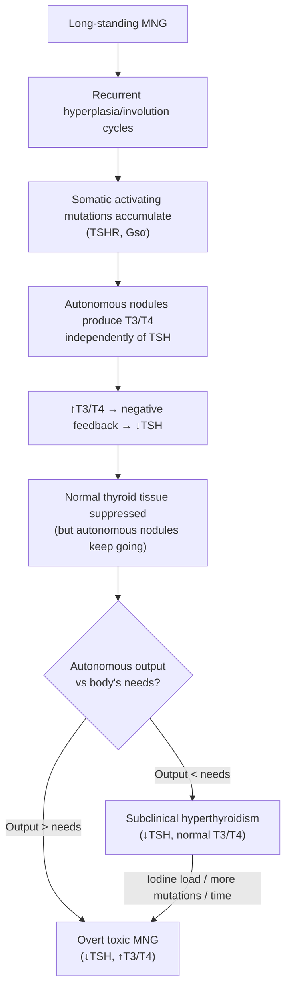

# Toxic Multinodular Goitre (Plummer's Disease)

## Definition

***Toxic multinodular goitre (TMNG)*** — also known as ***Plummer's disease*** — is a condition in which a multinodular goitre (MNG) develops **autonomous thyroid hormone production** from one or more nodules, leading to **thyrotoxicosis** [1][2][3].

Let's unpack the terminology:
- **"Toxic"** = producing excess thyroid hormone → thyrotoxicosis
- **"Multinodular"** = multiple discrete nodules within the thyroid gland
- **"Goitre"** = enlargement of the thyroid gland (from Latin *guttur* = throat)
- **"Plummer's disease"** = named after Henry Plummer, who first distinguished this entity from Graves' disease in 1913

<Callout title="Key Distinction: Thyrotoxicosis vs Hyperthyroidism">
***Thyrotoxicosis*** is defined as the **clinical syndrome** associated with excess circulating thyroid hormone, regardless of source. ***Hyperthyroidism*** specifically refers to **endogenous hyperactivity of the thyroid gland**. TMNG causes both thyrotoxicosis AND hyperthyroidism (the gland is autonomously overproducing hormone). In contrast, subacute thyroiditis causes thyrotoxicosis but NOT hyperthyroidism (stored hormone is released from damaged follicles, not newly synthesised) [2][4].
</Callout>

---

## Epidemiology

- **Second most common cause of hyperthyroidism** worldwide (after Graves' disease) [2]
- In **iodine-deficient regions**, TMNG may surpass Graves' disease as the leading cause
- ***Most common cause of hyperthyroidism in the elderly*** — this is a crucial exam point. The classic clinical vignette: **elderly patient presenting with new-onset atrial fibrillation + multinodular goitre** [2][3]
- **Age**: typically presents in patients ***> 50 years old*** (usually > 35y), distinguishing it from Graves' which peaks at 20–50y
- **Sex**: Female > Male (approximately ***F:M = 3:1***), consistent with thyroid disease in general
- ***Subclinical hyperthyroidism is the most common initial biochemical presentation*** — **25% of MNG patients have complete TSH suppression**, with T3/T4 still within the reference range [2][3]
- **Hong Kong context**: Hong Kong is an iodine-sufficient area (seafood-rich diet). Despite this, TMNG remains common because:
  - Long-standing non-toxic MNG eventually develops autonomy over years/decades
  - Ageing population means more elderly patients with long-standing goitres
  - Excess iodine exposure (e.g., contrast dye, amiodarone, kelp supplements) can precipitate thyrotoxicosis in a pre-existing MNG (***Jod-Basedow phenomenon***)

> **High Yield**: TMNG is the most common cause of subclinical thyrotoxicosis in the elderly. The classic presentation is ***AF + multinodular goitre in an elderly patient*** [2][3].

---

## Risk Factors

| Risk Factor | Mechanism |
|---|---|
| **Long-standing non-toxic MNG** | Decades of recurrent hyperplasia and involution → somatic mutations accumulate → autonomous function |
| **Iodine deficiency (historical or geographical)** | Chronic TSH stimulation → goitre → with repletion of iodine, autonomous nodules can produce excess hormone (Jod-Basedow) |
| **Increasing age** | More time for somatic mutations to accumulate; elderly have higher prevalence of MNG |
| **Female sex** | Oestrogen may promote thyroid cell proliferation; pregnancy-related TSH stimulation |
| **Iodine excess / iodine load** | Contrast media, amiodarone, kelp — provides substrate for autonomous nodules to overproduce T3/T4 |
| **Family history of goitre** | Genetic susceptibility to goitrogenesis |

---

## Anatomy and Function of the Thyroid Gland

### Gross Anatomy

- ***Location: C5–C7 vertebral level*** [5]
- Butterfly-shaped gland, composed of **two lateral lobes** connected by an **isthmus**
- Enclosed by:
  - **True capsule** (thin fibrous capsule adherent to the gland)
  - ***False capsule*** (formed by the **pretracheal layer of the deep cervical fascia**) [5]
- A ***pyramidal lobe*** may be present (embryological remnant of the thyroglossal duct), extending superiorly from the isthmus [5]

### Blood Supply

- **Superior thyroid artery** (first branch of the external carotid artery)
- **Inferior thyroid artery** (from the thyrocervical trunk of the subclavian artery)
- ***Extensive anastomosis within and on the surface of the gland*** — provides collateral circulation [5]
- **Thyroid ima artery** (inconstant, directly from the aortic arch or brachiocephalic artery — important in tracheostomy!)

### Nerve Supply (Surgically Critical)

- **Recurrent laryngeal nerve (RLN)**: runs in the tracheoesophageal groove; supplies all intrinsic laryngeal muscles except cricothyroid. Injury → vocal cord paralysis → hoarseness
- **External branch of the superior laryngeal nerve (EBSLN)**: runs close to the superior thyroid artery; supplies the cricothyroid muscle. Injury → loss of high-pitched voice

### Histology and Functional Units

- ***Lobule is the functional unit*** → each lobule contains ***20–40 follicles*** [5]
- Each follicle consists of:
  - ***Follicular cells*** (thyrocytes): synthesise and secrete **thyroid hormones (T3, T4)**
  - ***Colloid*** (intraluminal): stores **thyroglobulin** (the precursor molecule for T3/T4)
  - ***Parafollicular C cells***: secrete **calcitonin** (important in medullary thyroid carcinoma)

### Thyroid Hormone Synthesis — Simplified

1. **Iodide trapping**: Follicular cells actively transport iodide from blood via the **sodium-iodide symporter (NIS)** on the basolateral membrane
2. **Oxidation and organification**: Iodide is oxidised by **thyroid peroxidase (TPO)** and attached to tyrosine residues on thyroglobulin → MIT (monoiodotyrosine), DIT (diiodotyrosine)
3. **Coupling**: MIT + DIT → **T3**; DIT + DIT → **T4** (all still attached to thyroglobulin in the colloid)
4. **Secretion**: Thyroglobulin is endocytosed back into the follicular cell → lysosomal proteolysis → free T3 and T4 released into blood
5. **Peripheral conversion**: ~80% of circulating T3 comes from **peripheral deiodination of T4** (mainly in the liver and kidneys)

> This physiology is key to understanding why autonomous nodules in TMNG produce excess hormone: they trap iodine and produce T3/T4 independently of TSH stimulation.

---

## Etiology (with Hong Kong Focus)

### The Natural History: From Simple Goitre → Non-Toxic MNG → Toxic MNG

This is a continuum, and understanding the progression is essential:

1. **Simple (diffuse) goitre**: A diffuse, non-neoplastic, non-inflammatory thyroid enlargement. Causes include iodine deficiency, goitrogens, increased physiological demand (puberty, pregnancy). The gland is uniformly hyperplastic [2][3].

2. ***Non-toxic multinodular goitre***: Over years to decades, the diffuse goitre undergoes ***recurrent episodes of hyperplasia and involution*** (due to unknown or fluctuating stimuli). This results in ***hyperplastic nodules growing at varying rates*** — some become colloid-rich, some undergo haemorrhage/degeneration, some become cystic [2][3].

3. ***Toxic multinodular goitre (Plummer's disease)***: Eventually, ***some nodules acquire somatic mutations that confer autonomous function*** — they produce thyroid hormone independently of TSH. When the autonomous output exceeds the body's needs, the patient becomes thyrotoxic [2][3].

### Molecular Pathogenesis of Autonomy

The key molecular events that lead to autonomous hormone production include:

| Mutation | Frequency | Mechanism |
|---|---|---|
| **Activating mutations of the TSH receptor (TSHR)** | ~60% of autonomous nodules | Constitutively activated TSHR → continuous cAMP signalling → hormone production without TSH binding |
| **Activating mutations of Gsα (GNAS1)** | ~5–10% | Gsα is the stimulatory G-protein coupled to TSHR. Gain-of-function → constitutive activation of adenylyl cyclase → ↑cAMP → hormone overproduction (also seen in McCune-Albright syndrome) |
| **Clonal expansion** | Variable | Individual nodules are monoclonal; heterogeneous mutations across different nodules explain the "multi" in multinodular |

> The fundamental point: these are **somatic** (acquired) mutations, not germline. They accumulate over time. This explains why TMNG is a disease of the elderly — it takes decades for enough autonomous clones to develop.

### Why Does Non-Toxic MNG Become Toxic?

Think of it as a **"threshold" model**:
- In non-toxic MNG, small amounts of autonomous hormone production are present but are counterbalanced by **TSH suppression** of the remaining normal thyroid tissue (negative feedback)
- As autonomous tissue mass grows (more nodules, bigger nodules, more mutations), the total autonomous output **exceeds** the body's requirement
- The normal thyroid tissue is now maximally suppressed (TSH is undetectable) but the autonomous nodules keep producing → **overt thyrotoxicosis**
- An **iodine load** (e.g., CT contrast, amiodarone) can tip a subclinically toxic MNG into overt toxicosis because it provides **substrate** for the autonomous nodules to ramp up production — this is the ***Jod-Basedow phenomenon*** (Jod = iodine in German; Basedow = German eponym for Graves'-like thyrotoxicosis)

### Causes and Precipitants Relevant to Hong Kong

| Factor | Comment |
|---|---|
| **Long-standing MNG** | Most common underlying factor in HK — many elderly patients have had a goitre for decades |
| **Iodine excess** | HK diet is iodine-sufficient (seafood, soy sauce); iodinated contrast for CT scans is very common |
| **Amiodarone** | Widely used anti-arrhythmic in HK (especially for AF in the elderly) — contains 37% iodine by weight; can cause both type 1 (excess substrate) and type 2 (destructive thyroiditis) amiodarone-induced thyrotoxicosis |
| **Lithium** (less common) | Used in psychiatry; can paradoxically cause thyrotoxicosis in MNG patients |

---

## Classification

### Within the Spectrum of Goitre

***Goitre is classified as*** [1]:

| Category | Examples |
|---|---|
| ***Simple goitre (endemic or sporadic)*** | ***Diffuse; Nodular*** |
| ***Toxic goitre*** | ***Diffuse toxic (Graves'); Toxic nodular (Plummer's); Toxic/functioning adenoma*** |
| ***Neoplastic goitre*** | ***Benign; Malignant*** |
| ***Thyroiditis*** | ***Bacterial (acute suppurative); Viral (subacute); Lymphocytic/Hashimoto/autoimmune (chronic)*** |

### Within the Spectrum of Multinodular Goitre

| Type | TSH | Thyroid Hormones | Clinical State |
|---|---|---|---|
| **Non-toxic MNG** | Normal | Normal | Euthyroid |
| **Subclinical toxic MNG** | ***Suppressed (< 0.1 mU/L)*** | ***T3/T4 within reference range (high-normal)*** | ***Subclinical hyperthyroidism*** |
| **Overt toxic MNG** | ***Undetectable*** | ***Elevated T3 and/or T4*** | ***Overt thyrotoxicosis*** |

<Callout title="Subclinical Hyperthyroidism — Why It Matters" type="idea">
***Subclinical hyperthyroidism*** (↓TSH, normal fT3/fT4) is the most common biochemical finding in MNG. Don't dismiss it! Even subclinical disease carries risks: ***↑risk of AF (1.68×), osteoporosis (↑bone resorption, ↓bone density), IHD (1.20–1.39×), and heart failure***. It should be worked up and treated if TSH < 0.1 mU/L or patient is at high risk (elderly, underlying cardiac disease, osteoporosis risk) [2][3].
</Callout>

### Within the Spectrum of Thyrotoxicosis (Etiological)

| Classification | Causes |
|---|---|
| ***Primary hyperthyroidism*** | ***Graves' disease; Toxic MNG; Toxic adenoma***; Metastatic thyroid cancer; Activating TSHR mutations; McCune-Albright (Gsα mutation) |
| **Secondary hyperthyroidism** | TSH-secreting pituitary adenoma; hCG-secreting tumours; Gestational thyrotoxicosis |
| **Thyrotoxicosis without hyperthyroidism** | Subacute (de Quervain's) thyroiditis; Silent thyroiditis; Destructive thyroiditis (amiodarone, radiation); Levothyroxine overdose |

---

## Pathophysiology

### Autonomous Thyroid Hormone Production

The pathophysiology of TMNG centres on **autonomous, TSH-independent thyroid hormone synthesis and secretion** by one or more nodules within a multinodular goitre.

### Why Is the Thyrotoxicosis Typically Milder Than in Graves'?

This is a commonly tested concept:
- In Graves' disease, the **entire gland** is stimulated by TRAb → **intense, diffuse** hormone overproduction
- In TMNG, **only the autonomous nodules** are producing excess hormone; the **non-autonomous tissue is suppressed** by the low TSH → the total output is generally **lower** than in Graves'
- Therefore, TMNG typically presents with **milder thyrotoxicosis** — often subclinical first, progressing slowly to overt disease
- **T3-thyrotoxicosis** is common in TMNG (elevated T3 with normal T4) — because autonomous nodules preferentially secrete T3 (it is biologically more active), and the peripheral conversion of T4→T3 is preserved

### Downstream Pathophysiological Effects of Excess Thyroid Hormone

Thyroid hormones (primarily T3) act on virtually every organ system. The effects are mediated by:
1. **Nuclear thyroid hormone receptors** → altered gene transcription → protein synthesis
2. **Increased basal metabolic rate** (BMR) — T3 increases mitochondrial oxidative phosphorylation and thermogenesis
3. **Sensitisation to catecholamines** — T3 upregulates β-adrenergic receptors, amplifying sympathetic effects

| Organ System | Pathophysiology | Clinical Consequence |
|---|---|---|
| **Cardiovascular** | ↑β₁-adrenergic sensitivity → ↑HR, ↑contractility; ↓SVR (peripheral vasodilation); ↑cardiac output | Tachycardia, palpitations, widened pulse pressure, **AF** (especially in elderly with TMNG), high-output heart failure |
| **Metabolic** | ↑BMR, ↑glycogenolysis, ↑lipolysis, ↑protein catabolism | Weight loss despite normal/increased appetite, heat intolerance, sweating |
| **Neuromuscular** | ↑neuromuscular excitability, ↑β-adrenergic tone | Fine tremor, hyperreflexia, proximal myopathy, anxiety, irritability |
| **GI** | ↑GI motility (↑smooth muscle activity) | Increased stool frequency/diarrhoea |
| **Skeletal** | ↑osteoclastic bone resorption (T3 stimulates RANKL) | Osteoporosis (especially postmenopausal women) |
| **Reproductive** | Altered SHBG levels, ↑oestrogen clearance | Menstrual irregularities (oligomenorrhoea), ↓fertility |
| **Integumentary** | ↑BMR, sympathetic activation | Warm, moist skin; palmar erythema; fine hair; onycholysis |

### Pathophysiology of Compressive Symptoms in TMNG

Unlike Graves' disease (which causes a diffuse, moderately enlarged gland), **TMNG is characterised by large, asymmetric, nodular goitres** that may extend **retrosternally**. This is because the goitre has been growing for years/decades before becoming toxic. Compression occurs on surrounding structures:

| Structure Compressed | Symptom | Mechanism |
|---|---|---|
| **Trachea** | ***Dyspnoea, stridor*** | Physical narrowing of the airway; may be exacerbated by retrosternal extension |
| **Oesophagus** | ***Dysphagia*** | Physical compression of the oesophageal lumen posteriorly |
| **Recurrent laryngeal nerve** | ***Dysphonia (hoarseness)*** | Stretching or compression of the nerve in the tracheoesophageal groove (if hoarseness is present, must also consider malignancy!) |
| **Superior vena cava / thoracic inlet** | ***Pemberton's sign*** (facial plethora, distended neck veins, stridor on arm elevation) | Retrosternal goitre obstructs venous return when arms are raised |

---

## Clinical Features

<Callout title="The Classic Presentation" type="idea">
***Elderly patient with long-standing goitre presenting with new-onset AF, weight loss, or progressive dyspnoea. The thyrotoxicosis is often milder than Graves' and may be "apathetic" in the elderly*** [2][3].
</Callout>

### Symptoms

#### A. Thyrotoxic Symptoms (from excess thyroid hormone)

| Symptom | Pathophysiological Basis |
|---|---|
| ***Palpitations*** | ↑β₁-adrenergic receptor sensitivity → ↑heart rate and force of contraction; AF is common in elderly TMNG patients |
| ***Weight loss despite normal/increased appetite*** | ↑BMR → ↑caloric expenditure exceeds intake; ↑protein catabolism and lipolysis |
| ***Heat intolerance and excessive sweating*** | ↑thermogenesis from uncoupled oxidative phosphorylation → excess heat production; peripheral vasodilation to dissipate heat → sweating |
| ***Tremor*** | ↑β-adrenergic stimulation of skeletal muscle → fine postural tremor (classically demonstrated by asking patient to hold out hands with a piece of paper on top) |
| ***Anxiety, irritability, emotional lability*** | ↑CNS catecholamine sensitivity → neuropsychiatric hyperexcitability |
| ***Diarrhoea / increased stool frequency*** | ↑GI smooth muscle motility driven by excess thyroid hormone |
| ***Muscle weakness (proximal myopathy)*** | ↑protein catabolism in skeletal muscle → preferential wasting of proximal muscles (difficulty climbing stairs, rising from a chair) |
| ***Oligomenorrhoea / amenorrhoea*** | Altered SHBG levels; ↑oestrogen clearance; disrupted HPG axis |
| ***Dyspnoea (multifactorial)*** | (1) Tracheal compression from large goitre, (2) respiratory muscle weakness, (3) high-output cardiac failure |
| ***Loss of libido*** | Altered sex hormone binding; general catabolic state |

<Callout title="Apathetic Thyrotoxicosis in the Elderly" type="error">
***In elderly patients, thyrotoxicosis may present atypically as "apathetic thyrotoxicosis"*** — instead of the classic hyperkinetic features (tremor, anxiety, weight loss), the patient may present with ***lethargy, depression, weight loss, AF, or heart failure***. ***Cardiopulmonary symptoms may dominate in older patients*** [4]. This is a notorious exam trap. Always check TFT in any elderly patient with new-onset AF, unexplained weight loss, or heart failure!
</Callout>

#### B. Compressive Symptoms (from the goitre mass itself)

| Symptom | Pathophysiological Basis |
|---|---|
| ***Visible neck swelling / cosmetic concern*** | Long-standing goitre with multiple nodules; progressive enlargement over years |
| ***Dysphagia*** | Posterior nodules or retrosternal extension compressing the oesophagus |
| ***Dyspnoea / stridor*** | Tracheal compression or deviation; especially with retrosternal extension; worse on exertion or when lying flat |
| ***Dysphonia (hoarseness)*** | Compression or stretching of the recurrent laryngeal nerve; must also exclude malignancy if present |
| ***Sudden painful neck swelling*** | ***Haemorrhage into a nodule or cyst → sudden painful swelling*** [2][3] — the patient wakes up with acute neck swelling and tenderness; this is NOT malignancy, it is intra-nodular haemorrhage |

### Signs

#### A. General Inspection

| Sign | Pathophysiological Basis |
|---|---|
| **Anxious / restless appearance** | Sympathetic overactivity (↑β-adrenergic tone) |
| **Thin / cachectic build** | Chronic hypermetabolism, ↑protein catabolism |
| **Warm, moist skin** | Peripheral vasodilation to dissipate excess heat; ↑sweat gland activity |
| **Fine hair / hair thinning** | ↑metabolic turnover of hair follicles → shortened hair growth cycle |
| **Onycholysis (Plummer's nails)** | Separation of nail plate from nail bed — mechanism unclear but associated with accelerated nail growth and distal soft tissue changes |
| **Palmar erythema** | Peripheral vasodilation |

#### B. Thyroid Examination — The Goitre

| Sign | Detail |
|---|---|
| ***Multinodular goitre*** | Multiple palpable nodules of varying size and consistency; the gland is **irregularly enlarged**, often **asymmetric** |
| ***Large goitre*** | TMNG goitres are often **significantly larger** than Graves' goitres because they have been growing for decades |
| ***Retrosternal extension*** | Lower poles of the goitre may dip below the sternal notch — cannot palpate the lower border; percussion over the sternum may be dull |
| ***No thyroid bruit*** (usually) | Unlike Graves' disease where the entire gland is hypervascular (audible bruit/thrill), TMNG typically does **NOT** have a diffuse bruit because only select nodules are autonomous, not the whole gland |
| ***Pemberton's sign*** | Ask the patient to raise both arms above the head for 1 minute → facial plethora, distended neck veins, inspiratory stridor. This occurs because a retrosternal goitre obstructs the thoracic inlet when arms are raised |
| **Tracheal deviation** | Large asymmetric nodules may push the trachea to the contralateral side |

<Callout title="Thyroid Bruit: Graves' vs TMNG" type="error">
A **thyroid bruit** (and thrill) is classically associated with **Graves' disease** — the entire gland is diffusely hypervascular due to TSH receptor antibody stimulation. In TMNG, there is typically **no diffuse bruit** because only autonomous nodules are hyperactive, not the entire gland. This is a key differentiating feature on examination.
</Callout>

#### C. Eyes

| Sign | Pathophysiological Basis |
|---|---|
| ***Lid retraction (sclera visible above iris)*** | ***Due to overactive sympathetic activity → ↑Müller's muscle (smooth muscle) contraction*** [4]. This is a sign of thyrotoxicosis from ANY cause, NOT specific to Graves' |
| ***Lid lag (upper lid lags behind the globe on downward gaze)*** | Same mechanism — ***sympathetic overactivity driving Müller's muscle*** [4]; NOT specific to Graves' |
| **No true Graves' ophthalmopathy** | Exophthalmos, ophthalmoplegia, periorbital oedema, and conjunctival injection are **specific to Graves' disease** (autoimmune orbital inflammation mediated by anti-TSH receptor antibodies cross-reacting with orbital fibroblasts). These are **NOT** features of TMNG |

> **Exam Pearl**: ***Lid lag and lid retraction are due to overactive sympathetic activity (↑Müller's muscle contraction) and thus are not specific to Graves' disease*** [4]. They can occur in ANY cause of thyrotoxicosis including TMNG. But exophthalmos, pretibial myxoedema, and thyroid acropachy are ONLY seen in Graves'.

#### D. Cardiovascular Signs

| Sign | Pathophysiological Basis |
|---|---|
| **Tachycardia (resting HR > 90 bpm)** | ↑β₁-adrenergic receptor density and sensitivity → ↑chronotropy |
| ***Atrial fibrillation (irregularly irregular pulse)*** | Most important cardiac complication of TMNG in the elderly. T3 shortens atrial refractory period, increases atrial ectopy → triggers and sustains AF. ***AF + multinodular goitre in elderly is the classic presentation*** [2][3] |
| **Widened pulse pressure / bounding pulse** | ↑cardiac output + ↓SVR (peripheral vasodilation) → ↑systolic, ↓diastolic pressure |
| **High-output heart failure** (in severe/prolonged cases) | Chronic ↑cardiac output + tachycardia → eventually myocardial demand exceeds supply → decompensation, especially in patients with pre-existing cardiac disease |

#### E. Neuromuscular Signs

| Sign | Pathophysiological Basis |
|---|---|
| **Fine tremor** | ↑β-adrenergic stimulation of skeletal muscle motor units |
| **Hyperreflexia** | ↑neuromuscular excitability; shortened reflex relaxation time |
| **Proximal myopathy** | ↑protein catabolism → weakness of proximal muscles (shoulder and hip girdle) |

#### F. Signs that are **ABSENT** in TMNG (vs. Graves')

This is a favourite exam question — distinguishing TMNG from Graves':

| Feature | Graves' Disease | TMNG |
|---|---|---|
| **Goitre type** | Diffuse, smooth, symmetrical | Multinodular, irregular, asymmetric, often large |
| **Thyroid bruit** | Present (diffuse hypervascularity) | Absent |
| **Ophthalmopathy** | Present (exophthalmos, ophthalmoplegia) | Absent (only lid lag/retraction from sympathetic overactivity) |
| **Pretibial myxoedema** | Present (< 10%) | Absent |
| **Thyroid acropachy** | Present (rare) | Absent |
| **Dermopathy** | Present | Absent |
| **Age** | 20–50y (younger) | > 50y (older) |
| **Severity of thyrotoxicosis** | Often marked | Often milder / subclinical first |
| **TSH receptor antibodies (TRAb)** | Positive (~100%) | Negative (10–20%) |
| **Thyroid scintigraphy** | ***Diffuse ↑uptake*** | ***Heterogeneous ↑uptake*** (hot + cold areas) |

---

## Summary of Important Distinguishing Features (TMNG vs Graves' vs Toxic Adenoma)

| Feature | Graves' Disease | Toxic MNG | Toxic Adenoma |
|---|---|---|---|
| **Age** | 20–50y | > 50y | 30–50y |
| **Goitre** | Diffuse, smooth | Multinodular, large | Solitary nodule |
| **Bruit** | + | − | − |
| **Ophthalmopathy** | + | − | − |
| **Pretibial myxoedema** | + | − | − |
| **TRAb** | + (80–100%) | − (10–20%) | − |
| **Anti-TPO** | + (50–80%) | + (10–20%) | − |
| ***Scintigraphy*** | ***Diffuse ↑uptake*** | ***Heterogeneous ↑uptake*** | ***Focal ↑uptake, suppression elsewhere*** |
| **Severity** | Moderate–severe | Mild–moderate (often subclinical) | Mild–moderate |
| **Response to ATD** | Good (remission in ~50%) | ***Poor — recurrence upon discontinuation*** | Poor |

---

<Callout title="High Yield Summary">

1. ***Toxic MNG (Plummer's disease)*** = autonomous thyroid hormone production from nodules within a long-standing multinodular goitre → thyrotoxicosis

2. ***Most common cause of hyperthyroidism in the elderly***; classic presentation is ***AF + multinodular goitre in an elderly patient***

3. Pathogenesis: recurrent hyperplasia/involution → somatic activating mutations (TSHR, Gsα) → autonomous function → TSH suppression → subclinical then overt toxicosis

4. ***Thyrotoxicosis is typically milder than Graves'*** and often presents as ***subclinical hyperthyroidism first*** (↓TSH, normal fT3/fT4)

5. ***25% of MNG patients have complete TSH suppression***

6. Key distinguishing features from Graves': NO ophthalmopathy, NO pretibial myxoedema, NO thyroid bruit, NO TRAb; ***scintigraphy shows heterogeneous uptake*** (vs diffuse in Graves')

7. ***Lid lag and lid retraction*** are from sympathetic overactivity — ***NOT specific to Graves'***; can occur in TMNG

8. ***ATD is ineffective long-term*** (recurrence upon discontinuation) because the underlying autonomous mutations don't regress (unlike the autoimmune process in Graves' which may remit)

9. Compressive symptoms (dysphagia, dyspnoea, dysphonia) are more common in TMNG than Graves' because the goitres are larger and often retrosternal

10. ***Jod-Basedow phenomenon***: iodine load can precipitate overt thyrotoxicosis in subclinical TMNG
</Callout>

---

<ActiveRecallQuiz
  title="Active Recall - Toxic Multinodular Goitre (Definition, Epidemiology, Etiology, Pathophysiology, Clinical Features)"
  items={[
    {
      question: "A 72-year-old woman presents with new-onset atrial fibrillation and a palpable multinodular goitre. TFT shows suppressed TSH with high-normal fT4. What is the most likely diagnosis, and what is the biochemical term for her thyroid status?",
      markscheme: "Diagnosis: Toxic multinodular goitre (Plummer's disease). Biochemical status: Subclinical hyperthyroidism (suppressed TSH with normal thyroid hormones). This is the most common initial biochemical presentation of MNG-related thyrotoxicosis."
    },
    {
      question: "Explain the molecular pathogenesis of autonomous thyroid hormone production in toxic MNG. Name the two most important somatic mutations.",
      markscheme: "Somatic activating mutations accumulate over decades in nodules of a long-standing MNG. (1) Activating mutations of the TSH receptor (TSHR) in approximately 60% - constitutively activates cAMP pathway independent of TSH. (2) Activating mutations of Gsalpha (GNAS1) in approximately 5-10% - constitutive activation of adenylyl cyclase. These are acquired, not germline, explaining the elderly age of presentation."
    },
    {
      question: "What is the Jod-Basedow phenomenon and why is it clinically relevant in Hong Kong?",
      markscheme: "Jod-Basedow phenomenon is iodine-induced thyrotoxicosis occurring when excess iodine is provided to a patient with pre-existing autonomous thyroid tissue (e.g., subclinical toxic MNG). The iodine serves as substrate for autonomous nodules to overproduce T3/T4. Relevant in HK because iodinated CT contrast and amiodarone are commonly used, and can precipitate overt thyrotoxicosis in patients with previously subclinical MNG."
    },
    {
      question: "On clinical examination, how do you distinguish toxic MNG from Graves' disease? List at least 4 differentiating features.",
      markscheme: "TMNG vs Graves': (1) Goitre: multinodular and irregular vs diffuse and smooth, (2) Thyroid bruit: absent in TMNG vs present in Graves', (3) Ophthalmopathy (exophthalmos, ophthalmoplegia): absent in TMNG vs present in Graves', (4) Pretibial myxoedema: absent in TMNG vs present in Graves', (5) Age: typically older (>50y) in TMNG vs younger (20-50y) in Graves', (6) TRAb: negative in TMNG vs positive in Graves', (7) Scintigraphy: heterogeneous uptake vs diffuse uptake."
    },
    {
      question: "Why are antithyroid drugs (ATDs) ineffective as long-term monotherapy for toxic MNG, unlike in Graves' disease?",
      markscheme: "In Graves' disease, the underlying pathology is autoimmune (TRAb stimulation) which may spontaneously remit after 12-18 months of ATD therapy. In TMNG, the pathology is somatic activating mutations in thyroid nodules - these mutations are permanent and do not regress. Therefore, thyrotoxicosis invariably recurs upon ATD discontinuation. TMNG requires definitive treatment (surgery or radioactive iodine)."
    },
    {
      question: "Lid lag and lid retraction are found in a patient with toxic MNG. Are these specific to Graves' disease? Explain the mechanism.",
      markscheme: "No, lid lag and lid retraction are NOT specific to Graves' disease. They occur in ANY cause of thyrotoxicosis. Mechanism: thyroid hormone excess causes sympathetic overactivity which increases contraction of Mueller's muscle (a smooth muscle in the upper eyelid innervated by sympathetic fibres). This is distinct from Graves' ophthalmopathy (exophthalmos, ophthalmoplegia) which is autoimmune-mediated and specific to Graves'."
    }
  ]}
/>

---

## References

[1] Lecture slides: GC 177. A thyroid nodule benign thyroid nodules; thyroid cancer.pdf (p4–5, p15)
[2] Senior notes: Ryan Ho Endocrine.pdf (p17, p31–32)
[3] Senior notes: Ryan Ho Fundamentals.pdf (p422, p425–427)
[4] Senior notes: Adrian Lui Pediatrics.pdf (p271) / Ryan Ho Endocrine.pdf (p12)
[5] Senior notes: maxim.md (Endocrine surgery - Thyroid anatomy)
[6] Senior notes: felixlai.md (Thyrotoxicosis causes, thyroid antibodies, thyroid scintigraphy)
