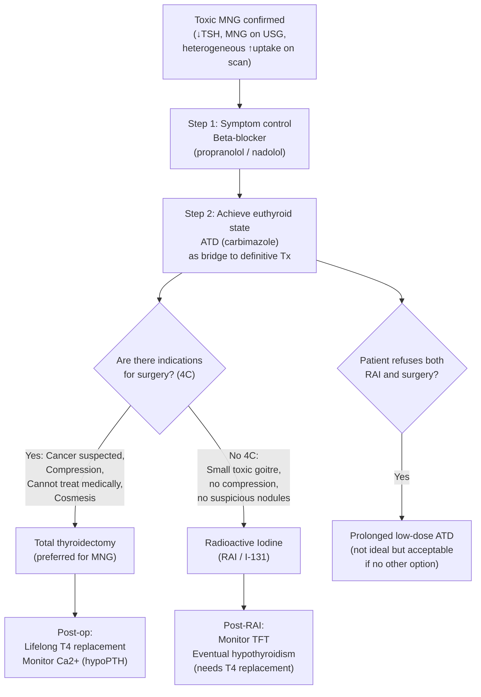

## Management of Toxic Multinodular Goitre

### The Fundamental Management Principle

The single most important concept in managing toxic MNG is this: ***antithyroid drugs (ATDs) are ineffective as long-term monotherapy because thyrotoxicosis invariably recurs upon discontinuation*** [2][5]. This is fundamentally different from Graves' disease.

**Why?** In Graves' disease, the underlying pathology is **autoimmune** (TRAb stimulating the TSH receptor). The autoimmune process may spontaneously remit after 12–18 months of ATD suppression — this is why ATDs work as first-line in Graves'. In contrast, TMNG is driven by **somatic activating mutations** (TSHR, Gsα) in autonomous nodules. These mutations are **permanent** — they don't go away. Stop the ATD, and the autonomous nodules resume their overproduction immediately. Therefore, ***TMNG requires early definitive treatment*** [2][5].

---

### Management Algorithm Overview

---

### Treatment Modalities

#### 1. Symptomatic Control: Beta-Blockers

***Non-selective short-acting β-blocker (e.g., propranolol, nadolol) for short-term alleviation of symptoms*** [2][3][4].

**Why beta-blockers?** Thyroid hormone excess sensitises tissues to catecholamines by upregulating β-adrenergic receptor expression. Beta-blockers directly antagonise these receptors → rapid relief of adrenergic symptoms (tachycardia, palpitations, tremor, anxiety, sweating) within hours, even before thyroid hormone levels normalise.

| Drug | Dose | Special Notes |
|---|---|---|
| ***Propranolol*** | 10–40 mg TDS–QDS | ***Non-selective (β₁ + β₂)***; additionally **inhibits peripheral T4→T3 conversion** (a unique property among beta-blockers); **preferred in thyroid storm** [6][9] |
| **Nadolol** | 40–80 mg OD | Non-selective; longer acting; good for compliance |
| **Atenolol** | 25–50 mg OD | Cardioselective (β₁); acceptable alternative if β₂ blockade undesirable (e.g., asthma) |

**Role**: Symptom bridge only — beta-blockers do NOT address the underlying hormone overproduction. They are used while awaiting the effect of ATDs or definitive treatment.

**Contraindications**: Asthma (non-selective β-blockers cause bronchospasm), severe bradycardia, decompensated heart failure, second/third-degree heart block. In these patients, consider ***diltiazem (CCB)*** as alternative [6][9].

---

#### 2. Antithyroid Drugs (ATDs) — Bridge to Definitive Treatment

<Callout title="ATDs in Toxic MNG — Key Difference from Graves'" type="error">
In Graves' disease, ***ATDs are first-line for a 12–18 month course*** because the autoimmune process may subside [2][10]. In toxic MNG, ***ATDs are NOT definitive treatment*** — they are used as a ***bridge*** to render the patient euthyroid before surgery or RAI. ***Relapse is invariable upon discontinuation*** [2][5]. ***Prolonged use is only acceptable if the patient does not want RAI or surgery*** [5].
</Callout>

**Summary table for ATDs in toxic MNG** [5]:

| | Graves' Disease | ***Toxic MNG (Plummer's)*** | Toxic Adenoma |
|---|---|---|---|
| ***Antithyroid drugs*** | ***1st line*** | ***(Ineffective long-term: recur upon discontinuation) — Prolonged use if patient does not want RAI or surgery*** | Not preferred |
| ***Radioactive iodine*** | ***2nd line*** | ***Preferred if no 4C*** | Preferred |
| ***Surgery*** | ***2nd line*** | ***Preferred if 4C*** | Hemithyroidectomy |

##### Pharmacology of Thionamides

The thionamides — ***carbimazole, methimazole, and propylthiouracil (PTU)*** — are the ATD drugs used [2][4][6][10]:

**Mechanism of action** [6][10]:
- ***Inhibit thyroid peroxidase (TPO)*** → block **organification** (iodination of tyrosine residues on thyroglobulin) and **coupling** of iodotyrosines → ***↓T3 and T4 synthesis***
- ***PTU only***: additionally ***inhibits peripheral conversion of T4→T3*** (by inhibiting type 1 deiodinase) — this is why PTU is preferred in thyroid storm
- Immunosuppressive effects (relevant mainly in Graves'): ***↓serum TRAb levels*** [10]

**Why is there a delay in onset?**
***Onset of euthyroid state takes 3–4 weeks*** because the thyroid gland has a ***large storage of pre-formed hormones*** (weeks' worth of T3/T4 stored in the colloid as thyroglobulin) [6]. The ATDs block NEW hormone synthesis but do NOT affect the release of already-stored hormone. The existing stores must be depleted before clinical effect is seen.

**Choice of ATD** [10]:
- ***Prefer carbimazole/methimazole*** (over PTU) for maintenance because:
  - Achieves euthyroid more rapidly
  - Once-daily dosing (better compliance)
  - ↓hepatotoxicity (PTU causes hepatocellular injury; carbimazole causes cholestatic injury — the former is more dangerous)
  - Little or no effect on subsequent RAI success
- ***Prefer PTU only in***: (1) ***first trimester of pregnancy*** (↓teratogenicity), (2) ***thyroid storm*** (↓peripheral T4→T3 conversion), (3) minor reactions to carbimazole [10]

**Dosing** [10]:
- **Initiation**: Carbimazole 15–60 mg/day in 2–3 divided doses (depends on severity of thyrotoxicosis)
- **Monitoring**: TFT ± CBC/LFT every 4–6 weeks until euthyroid
- **Maintenance**: Titrate down gradually to 5–15 mg/day
- **Baseline bloods before starting**: ***CBC and LFT*** [10]

**Regimen types** [10]:
- **Titrating regimen**: Start high → titrate down guided by TSH
- **Block and replace**: High-dose ATD + levothyroxine replacement — useful where control is difficult

**Adverse effects of ATDs** [6][10]:

| Side Effect | Frequency | Mechanism / Details |
|---|---|---|
| ***Skin rash, urticaria, pruritus*** | ***~5%*** | Allergic/histamine-mediated; treated with antihistamines [6] |
| **Arthralgia / arthritis** | Uncommon | Immune-mediated |
| **Fever** | Uncommon | |
| ***Agranulocytosis*** | ***0.1–0.5%*** | ***Usually within first 2–3 months***; reversible; ***↑risk with age > 40y or high doses***; ***predicted by HLA-B*38:02:01 allele (mainly found in Asian population)*** [10]. Presents classically as ***fever + sore throat while on ATD → advise patient to seek help immediately if any symptoms of infection*** [10] |
| ***Hepatotoxicity*** | Variable | ***PTU: hepatocellular (up to 1/3 with ↑ALT/AST, rarely fulminant failure)***; ***Carbimazole: cholestatic*** [10] |
| **Teratogenicity** | Rare | Aplasia cutis, choanal atresia (methimazole/carbimazole >> PTU) → PTU preferred in 1st trimester [10] |

---

#### 3. Definitive Treatment: Radioactive Iodine (RAI / ¹³¹I)

***RAI is preferred for toxic MNG if there are no indications for surgery (no "4C")*** [5].

**How does RAI work?** [6]:
- ¹³¹I is ***taken up and processed by the thyroid gland in the same way as normal iodide*** — via the sodium-iodide symporter (NIS)
- The specificity to the thyroid is due to ***preferential thyroid uptake via the NIS***
- ¹³¹I becomes ***incorporated into thyroglobulin*** within the follicular cells
- It then ***emits β-radiation*** (short range, ~0.5–2 mm) within the thyroid gland → ***destruction of thyroid follicular cells by necrosis and radiation-induced DNA damage*** [6]
- Autonomous ("hot") nodules preferentially take up more ¹³¹I (because they are metabolically active) → they receive the highest radiation dose and are preferentially destroyed

**Advantages** [2][3]:
- Non-surgical, outpatient procedure
- ***↓cost***
- ***Can be repeated if needed***
- Good efficacy for small to moderate-sized toxic goitres

**Disadvantages** [2][3]:
- ***Hypothyroidism***: the most important long-term consequence — ***transient in 3.5–28%; permanent in 10–15% in first 2 years and ~3%/year thereafter*** [6] → requires lifelong T4 replacement monitoring
- ***Slow response*** — takes weeks to months for full effect
- ***Restricted proximity to other persons*** (especially children, pregnant women) due to radiation exposure [3]
- Risk of ***radiation thyroiditis*** (~3%) — transient painful swelling [3]
- Risk of ***transition to Graves' disease*** (~5%) — RAI can trigger new autoimmune response [3]
- May be less effective for **very large goitres** (insufficient RAI dose relative to gland volume; may need repeated doses)
- ***Does NOT address compressive symptoms*** — the goitre shrinks slowly and incompletely

**Contraindications** [6][9]:
- ***Pregnancy and lactation*** — ¹³¹I crosses the placenta and is concentrated by the fetal thyroid (from ~12 weeks gestation) → ***damages fetal thyroid gland***; secreted in breast milk
- ***Children and adolescents*** — avoid potential long-term radiation effects in young age [9]
- **Active moderate-to-severe Graves' ophthalmopathy** — RAI can worsen GO (not directly relevant to TMNG, but important if Graves' co-exists) [10][11]
- **Suspicion of thyroid malignancy** — RAI treats the functional problem but does NOT address the cancer; surgery is needed
- **Large goitre with significant compression** — RAI is too slow and insufficient to relieve compressive symptoms urgently

**Pre-RAI Preparation** [9]:
- Discussion of treatment options and informed consent
- ***Avoid iodine-containing food, medicine (e.g., cough suppressants), or radiological contrast for ≥ 4 weeks before ¹³¹I therapy*** — because excess iodine competes with RAI uptake and reduces efficacy
- ***Stop antithyroid medications ≥ 4 weeks before ¹³¹I therapy*** — ATDs reduce iodine organification and may lower RAI uptake/efficacy (though some centres stop only 3–7 days before)
- ***Symptomatic control with propranolol*** during the ATD-free period
- ***Pregnancy test for patients with child-bearing potential*** [9]

**Post-RAI Care** [9]:
- Symptomatic control of hyperthyroidism with propranolol (thyrotoxicosis may transiently worsen as damaged follicles release stored hormone)
- Discharge home immediately; ***avoid close contact with others*** (radiation protection)
- ***Safe contraception for ≥ 6 months*** — avoid pregnancy and breastfeeding for ≥ 6 months [9]
- Monitor TFT regularly — hypothyroidism may develop weeks to years later

---

#### 4. Definitive Treatment: Thyroidectomy (Surgery)

***Surgery is preferred for toxic MNG when there are indications ("4C")*** [5].

##### Indications for Thyroidectomy — The "4C" Mnemonic

***Indications for surgery (3Cs + Cosmesis)*** [2][10]:

| Indication | Explanation |
|---|---|
| ***Cancer*** | ***Confirmed CA or suspicious FNAC (Bethesda IV–VI)***; dominant cold nodule with concerning features |
| ***Compressive symptoms*** | ***Dysphagia, dysphonia, dyspnoea, or retrosternal goitre*** — surgery provides immediate and definitive relief [1][2] |
| ***Cannot be treated medically*** | ***Frequent relapses on ATD; RAI unsuitable (large goitre > 80g, concurrent suspicious nodules); patient intolerant/allergic to ATDs*** [2][10] |
| ***Cosmesis*** | ***Patient preference for cosmetic removal of large visible goitre*** [1][2] |

***Additional indications from the lecture slides*** [1]:
- ***Symptomatic goitre (size of goitre/nodule)***
- ***Increase in goitre size***
- ***Trachea compression or deviation***
- ***Retrosternal extension***
- ***Suspected malignancy***
- ***Cosmetic considerations / patient wish***

##### Types of Thyroidectomy

| Type | When Used | Advantages | Disadvantages |
|---|---|---|---|
| ***Total / near-total thyroidectomy*** | ***For symptomatic multinodular goitre*** [1]; ***toxic MNG*** [5] | ***No recurrence / need for reoperation***; addresses all nodules simultaneously; definitive cure for toxicosis | ***Additional surgical risk: hypoparathyroidism (1–2%)***; ***needs long-term thyroxine replacement***; ***↑risk of bilateral RLN injury*** [1][3] |
| ***Unilateral lobectomy (hemithyroidectomy)*** | ***For uninodular goitre*** [1]; dominant suspicious nodule on one side only | ***Safe, minimal morbidities, diagnosis and cure; future reoperation on contralateral lobe without difficulty*** [1]; ***around 10–20% chance of hypothyroidism*** [1] | Risk of recurrence in contralateral lobe (recurrence rate 8.4% vs 0.2% in TT) [3]; may need completion thyroidectomy |
| ***Partial or bilateral subtotal thyroidectomy*** | ***Rarely indicated*** [1] | Preserves some thyroid tissue | High recurrence risk; difficult re-exploration through scarred tissue |

<Callout title="Why Total Thyroidectomy for Toxic MNG?">
In TMNG, the disease is **bilateral and multinodular** — autonomous nodules are scattered throughout both lobes. A hemithyroidectomy would leave behind autonomous tissue in the contralateral lobe → recurrence. Therefore, ***total thyroidectomy is the procedure of choice for toxic MNG*** [5]. Hemithyroidectomy is reserved for toxic adenoma (solitary nodule) [5].
</Callout>

##### Pre-Operative Preparation

This is a critically important step — operating on a thyrotoxic patient without adequate preparation risks **thyroid storm** perioperatively. ***Patients must be brought to euthyroid state before surgery*** [6].

**Pre-op preparation protocol** [5][6][10]:

1. **ATD (carbimazole/methimazole)** to render the patient euthyroid — typically for 4–8 weeks before surgery
2. **Beta-blocker** for symptom control (continue until morning of surgery and postoperatively)
3. ***Lugol's iodine (5% iodine + 10% KI)*** — given for ***7–10 days immediately before surgery***
   - **Mechanism**: Excess iodine acutely inhibits thyroid hormone release (***Wolff-Chaikoff effect*** — transient block of organification due to iodine overload) AND ***↓vascularity of the thyroid gland*** (makes the gland firmer and less bloody, easier to operate on)
   - **Dose**: Typically 0.3 mL (5 drops) TDS for 7–10 days pre-op
   - ***Must be given AFTER ATDs have been started*** — otherwise the iodine acts as substrate for new hormone synthesis and worsens thyrotoxicosis
4. **Ensure adequacy**: Confirm euthyroid on TFT, resting heart rate < 80/min before proceeding
5. **Pre-operative vocal cord assessment**: Direct laryngoscopy to document baseline vocal cord function (medicolegal importance)

##### Complications of Thyroidectomy

| Complication | Mechanism | Frequency | Key Points |
|---|---|---|---|
| ***Haemorrhage*** | Post-operative bleeding → neck haematoma → ***compression of trachea (airway compromise)*** | ~1% | ***Life-threatening emergency***; expanding neck haematoma after thyroidectomy = open wound immediately at bedside (even before returning to theatre); compressive oedema on trachea |
| ***Recurrent laryngeal nerve (RLN) injury*** | Surgical damage to RLN in tracheoesophageal groove | Transient ~5%; Permanent ~1% | Unilateral → hoarseness (vocal cord paralysis on affected side); ***bilateral → stridor, airway obstruction*** (both cords in paramedian position) |
| ***Hypoparathyroidism*** | Inadvertent removal or devascularisation of parathyroid glands (especially in total thyroidectomy) | ***Transient 10–20%; Permanent 1–2%*** [3] | ***Hypocalcaemia*** → perioral tingling, Chvostek's sign, Trousseau's sign, tetany, seizures; monitor serum Ca²⁺ postoperatively; treat with calcium ± calcitriol |
| **External branch of SLN injury** | Damage to nerve running near superior thyroid artery | ~3% | Loss of high-pitched voice (cricothyroid denervation); subtle, often missed |
| ***Hypothyroidism*** | Removal of thyroid tissue → insufficient hormone production | ***100% after total thyroidectomy*** | ***Needs lifelong thyroxine (T4) replacement*** [1] |
| ***Thyroid storm*** | Manipulation of thyroid intra-operatively → surge of hormone release in unprepared patient | Rare if properly prepared | ***Prevented by ensuring euthyroid state pre-operatively*** [6] |
| **Wound infection** | Surgical site infection | < 1% | Standard wound care |
| **Keloid / hypertrophic scar** | Particularly in Asian patients | Variable | Cosmetic concern |

---

#### 5. Management of Subclinical Thyrotoxicosis in MNG

***Subclinical thyrotoxicosis*** (↓TSH, normal fT3/fT4) is the **most common initial biochemical presentation of MNG**. Management depends on the degree of TSH suppression and patient risk profile [2][3][7]:

| Scenario | Management |
|---|---|
| ***TSH < 0.1 mU/L*** | ***Workup + treat*** — significant risk of AF, osteoporosis, progression to overt toxicosis [2][7] |
| ***TSH 0.1–0.4 mU/L in elderly (> 65y) or at high risk*** (underlying cardiac disease, osteoporosis risk) | ***Workup + treat*** [7] |
| ***TSH 0.1–0.4 mU/L in younger, low-risk patients*** | ***Observe + monitor TFT every 6–12 months*** [2][7] |

**Treatment** in these cases follows the same paradigm: definitive therapy (RAI or surgery) is preferred, with ATD as a bridge or for patients refusing definitive treatment.

---

#### 6. Management of Non-Toxic MNG (for Completeness)

This is relevant because TMNG evolves from non-toxic MNG, and many exam questions ask about the transition:

| Scenario | Management |
|---|---|
| ***Small, asymptomatic, non-toxic MNG*** | ***No treatment + annual TFT to screen for development of toxic MNG*** [2] |
| | ***Consider T4 suppression therapy in selected patients → aim for low-normal TSH*** (controversial — may ↓goitre size but carries risk of subclinical hyperthyroidism) [2] |
| ***Large or symptomatic non-toxic MNG*** | Surgery (total thyroidectomy) for compression or cosmetic concerns [2] |
| | RAI if high surgical risk [3] |

---

#### 7. Management of Thyroid Storm (Emergency)

Although thyroid storm can complicate any cause of thyrotoxicosis, it is an important management scenario for TMNG, especially in the perioperative setting or when an acute illness precipitates crisis in a previously undertreated patient [3][4][6][9].

***Thyroid storm: rare but life-threatening (10% mortality, medical emergency)*** [3].

**Setting/Precipitants** [3][4][9]:
- ***Longstanding untreated/undertreated hyperthyroidism***
- ***Acute infection, thyroid or non-thyroid surgery, trauma, childbirth***
- ***Withdrawal of antithyroid drugs***
- ***Shortly after treatment procedures (subtotal thyroidectomy or RAI)***
- ***Acute iodine load (e.g., amiodarone)*** [9]

**Clinical features** [3]:
- ***CVS: tachycardia > 140/min, AF, high-output failure***
- ***Hyperpyrexia: may reach > 40°C***
- ***CNS disturbance: agitation, anxiety, delirium, psychosis, stupor, coma***

**Diagnosis**: ***Burch and Wartofsky scoring system*** (sensitive but not specific): ***≥ 45 = highly suggestive; 25–44 = supports diagnosis; < 25 = unlikely*** [3]

**Treatment** (the order and rationale matter enormously):

| Step | Drug / Measure | Mechanism / Rationale |
|---|---|---|
| **1. Supportive** | ***Paracetamol + physical cooling*** (NOT salicylates — aspirin displaces T4 from TBG → ↑free T4); IV fluid resuscitation; O₂; digoxin/diuretics for CHF/AF; ***IV thiamine*** [9] | Resuscitation and supportive care |
| **2. Beta-blocker** | ***Propranolol*** (or CCB if β-blocker C/I, e.g., ***diltiazem***) | ***↓adrenergic symptoms***; propranolol additionally blocks T4→T3 conversion [3] |
| **3. Thionamide** | ***PTU is preferred*** (over carbimazole/methimazole) | ***↓thyroid hormone synthesis + blocks peripheral T4→T3 conversion*** [3] |
| | ***Lithium (LiCO₃ 250 mg Q6H to [Li] 0.6–1.0 mmol/L)*** if thionamide C/I (e.g., previous agranulocytosis) [3][9] | Lithium inhibits thyroid hormone release |
| **4. Iodine** (≥ 1h AFTER thionamide) | ***Lugol's solution 6–8 drops Q6–8H PO***, or ***SSKI, Oragrafin, or IV NaI*** | ***Rapidly ↓thyroid hormone release*** (Wolff-Chaikoff effect). ***MUST be given ≥ 1h after first dose of thionamide*** — otherwise the iodine is used as substrate for NEW hormone synthesis, worsening the crisis [3][9] |
| **5. Glucocorticoids** | ***High-dose dexamethasone*** (or hydrocortisone) | ***↓peripheral conversion of T4→T3***; treats possible relative adrenal insufficiency in the hypermetabolic state [3][6] |
| **6. Adjuncts** | ***Bile acid sequestrant*** (cholestyramine) to ↓enterohepatic cycling of T4 [9]; ***plasmapheresis / charcoal haemoperfusion*** in desperate cases [6][9] | Remove circulating thyroid hormone directly |

<Callout title="Why Must Iodine Be Given AFTER Thionamide?" type="error">
***Iodine must be given ≥ 1 hour after the first dose of thionamide*** [3][9]. The reason: thionamide blocks thyroid peroxidase (TPO), preventing new hormone synthesis. If you give iodine FIRST (before TPO is blocked), the autonomous thyroid tissue uses the iodine as raw material to synthesise even MORE T3/T4, paradoxically worsening the storm. Once TPO is blocked, the iodine cannot be organified and instead exerts its inhibitory effect on hormone release (Wolff-Chaikoff effect).
</Callout>

**Subsequent management** [9]:
- ***Stop iodine and taper steroids once clinical improvement is evident***
- ***Titrate thionamide (switch to methimazole) to maintain euthyroidism***
- Plan for definitive treatment (RAI or surgery) once stabilised

---

### Summary: Management Decision Tree for Toxic MNG

| Clinical Scenario | Recommended Treatment |
|---|---|
| ***Small toxic MNG, no compressive symptoms, no suspicious nodules*** | ***RAI (preferred)*** [5] |
| ***Large goitre, compressive symptoms, retrosternal extension*** | ***Total thyroidectomy (preferred)*** [1][2][5] |
| ***Suspected/confirmed malignancy within MNG*** | ***Total thyroidectomy*** [1][5] |
| ***Patient unfit for surgery, refuses surgery*** | ***RAI*** (even if large goitre — may need repeated doses) [3] |
| ***Patient refuses both RAI and surgery*** | ***Prolonged low-dose ATD*** (not ideal; recurrence upon discontinuation; requires indefinite treatment) [5] |
| ***Pre-operative / pre-RAI preparation*** | ***ATD + beta-blocker → achieve euthyroid → definitive Tx*** |
| ***Thyroid storm*** | ***Emergency: supportive + beta-blocker + PTU + iodine (after 1h) + steroids*** [3] |
| ***Subclinical toxicosis (TSH < 0.1) or high-risk*** | ***Definitive treatment (RAI or surgery)*** [2][7] |
| ***Subclinical toxicosis (TSH 0.1–0.4), low-risk*** | ***Observe + monitor TFT annually*** [2][7] |

---

<Callout title="High Yield Summary">

1. ***ATDs are NOT effective long-term in TMNG*** — unlike Graves', the somatic mutations are permanent → ***relapse is invariable upon discontinuation*** → ATDs are used only as a **bridge** to definitive treatment

2. ***Definitive treatment = RAI or total thyroidectomy***

3. ***RAI is preferred if no "4C"*** (no Cancer suspicion, no Compression, Can be treated non-surgically, no Cosmetic concern); ***surgery (total thyroidectomy) is preferred if "4C" present*** [5]

4. ***Pre-operative preparation is essential***: ATD → euthyroid → Lugol's iodine 7–10 days pre-op → beta-blocker → confirm euthyroid → proceed

5. ***Total thyroidectomy*** is the surgical procedure for toxic MNG (bilateral disease); hemithyroidectomy is for toxic adenoma / uninodular goitre [1][5]

6. Key surgical complications: ***haemorrhage (airway emergency), RLN injury (hoarseness/stridor), hypoparathyroidism (hypocalcaemia), hypothyroidism (100% after TT → lifelong T4)***

7. ***Thyroid storm***: PTU preferred (blocks synthesis + peripheral conversion); ***iodine must be given ≥ 1h after thionamide***; paracetamol NOT salicylates; high-dose dexamethasone

8. ***Carbimazole preferred over PTU*** for maintenance; ***PTU preferred only in 1st trimester pregnancy, thyroid storm, and CBZ intolerance***

9. ***Agranulocytosis*** (0.1–0.5%) — educate patient: ***seek help immediately if fever/sore throat while on ATD***

10. ***Subclinical toxicosis*** in MNG: treat if TSH < 0.1 or elderly/high-risk; observe if low-risk
</Callout>

---

<ActiveRecallQuiz
  title="Active Recall - Management of Toxic Multinodular Goitre"
  items={[
    {
      question: "Why are antithyroid drugs ineffective as long-term monotherapy for toxic MNG, unlike in Graves' disease?",
      markscheme: "In Graves' disease, ATDs work long-term because the underlying autoimmune process (TRAb stimulation) may spontaneously remit after 12-18 months of treatment. In toxic MNG, the pathology is somatic activating mutations (TSHR, Gsalpha) in autonomous nodules - these mutations are permanent and do not regress. Therefore thyrotoxicosis invariably recurs upon ATD discontinuation. ATDs are only used as a bridge to definitive treatment (RAI or surgery)."
    },
    {
      question: "A 68-year-old woman with a large toxic MNG causing dysphagia and tracheal deviation needs definitive treatment. What is the preferred approach and what type of surgery?",
      markscheme: "Preferred approach: Total thyroidectomy (not RAI). Reason: the 4C indications for surgery are met - Compression (dysphagia, tracheal deviation). Total thyroidectomy (not hemithyroidectomy) because TMNG is bilateral multinodular disease. RAI is too slow to relieve compressive symptoms and may be inadequate for large goitres. Pre-op preparation: ATD to achieve euthyroid, beta-blocker, Lugol's iodine for 7-10 days before surgery."
    },
    {
      question: "In thyroid storm management, why must iodine be given at least 1 hour after the first dose of thionamide? What is the mechanism?",
      markscheme: "Thionamide blocks thyroid peroxidase (TPO), preventing new hormone synthesis. If iodine is given BEFORE TPO is blocked, autonomous thyroid tissue uses the iodine as raw material to synthesise more T3/T4, paradoxically worsening the storm. Once TPO is blocked by thionamide, the iodine cannot be organified and instead exerts its inhibitory effect on hormone release via the Wolff-Chaikoff effect (transient block of organification due to iodine overload)."
    },
    {
      question: "What pre-operative preparation is needed before thyroidectomy for toxic MNG? List the steps and their rationale.",
      markscheme: "Steps: (1) ATD (carbimazole) for 4-8 weeks to render patient euthyroid - prevents perioperative thyroid storm. (2) Beta-blocker (propranolol) for symptom control - continue until morning of surgery. (3) Lugol's iodine for 7-10 days before surgery - Wolff-Chaikoff effect blocks hormone release AND decreases thyroid gland vascularity (makes surgery easier/less bloody). Must be given AFTER ATDs are started. (4) Confirm euthyroid on TFT and HR less than 80. (5) Pre-operative laryngoscopy to document baseline vocal cord function."
    },
    {
      question: "Name the four most important complications of total thyroidectomy and explain the mechanism of each.",
      markscheme: "(1) Haemorrhage - post-op neck haematoma compresses trachea causing airway compromise (emergency: open wound at bedside). (2) Recurrent laryngeal nerve injury - RLN runs in tracheoesophageal groove; unilateral injury causes hoarseness, bilateral causes stridor/airway obstruction. (3) Hypoparathyroidism - inadvertent removal or devascularisation of parathyroid glands, especially in total thyroidectomy; causes hypocalcaemia (tingling, tetany, seizures). (4) Hypothyroidism - 100% after total thyroidectomy; needs lifelong T4 replacement."
    },
    {
      question: "When is RAI preferred over surgery for toxic MNG, and what are the contraindications to RAI?",
      markscheme: "RAI preferred: small toxic MNG without 4C indications (no cancer suspicion, no compression, can be treated non-surgically, no cosmetic concern). Contraindications: (1) Pregnancy and lactation (I-131 crosses placenta and damages fetal thyroid, secreted in breast milk), (2) Children/adolescents (long-term radiation risk), (3) Large goitre with significant compression (RAI too slow, insufficient volume reduction), (4) Suspected malignancy (needs surgical excision), (5) Active moderate-severe Graves' ophthalmopathy (if coexistent)."
    }
  ]}
/>

## References

[1] Lecture slides: GC 177. A thyroid nodule benign thyroid nodules; thyroid cancer.pdf (p14, p15)
[2] Senior notes: Ryan Ho Endocrine.pdf (p13, p17, p21, p23–24, p32)
[3] Senior notes: Ryan Ho Fundamentals.pdf (p172, p422, p425, p427–429)
[4] Senior notes: Adrian Lui Pediatrics.pdf (p272)
[5] Senior notes: maxim.md (Thyrotoxicosis management table, Thyroidectomy types)
[6] Senior notes: felixlai.md (Treatment of hyperthyroidism, Management of thyroid storm, RAI preparation)
[7] Senior notes: Ryan Ho Fundamentals.pdf (p425 — Subclinical thyrotoxicosis management)
[8] Senior notes: Ryan Ho Diagnostic Radiology.pdf (p59)
[9] Senior notes: Adrian Lui Pediatrics.pdf (p273 — Thyroid storm management)
[10] Senior notes: Ryan Ho Endocrine.pdf (p24 — ATD pharmacology)
[11] Senior notes: Ryan Ho Opthalmology.pdf (p130 — GO management, RAI contraindication)
