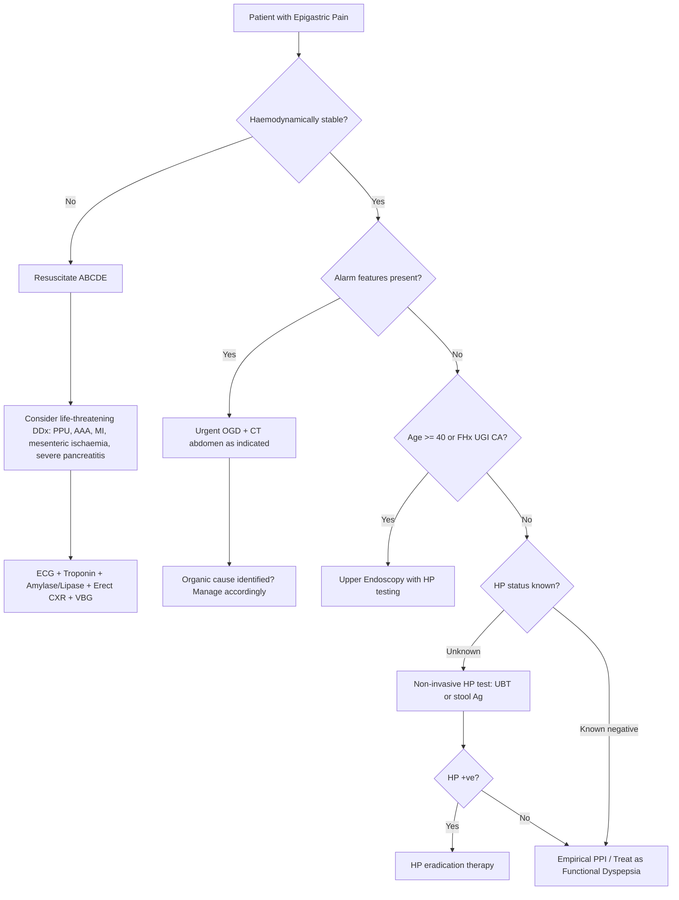

## Differential Diagnosis of Epigastric Pain

The differential diagnosis of epigastric pain is one of the broadest in clinical medicine. The key to narrowing it down efficiently is understanding **why** each condition produces epigastric pain — this always comes back to the anatomy (which organ?), the innervation (visceral vs somatic, which spinal segments?), and the pathological process (inflammation, obstruction, ischaemia, neoplasia).

Think of the differential in three tiers:
1. **Life-threatening emergencies** — must be excluded first
2. **Common organic causes** — the bread-and-butter diagnoses
3. **Less common but important causes** — conditions you must not forget

---

### Systematic Differential Diagnosis by System

#### Organising Framework

The best way to organise the differential is anatomically — organ by organ — because the epigastrium sits over multiple foregut structures, and extra-abdominal pathology can refer pain here.

```mermaid
graph TD
    A["Epigastric Pain DDx"] --> B["GI Tract"]
    A --> C["Hepatobiliary & Pancreatic"]
    A --> D["Vascular"]
    A --> E["Cardiac"]
    A --> F["Other / Non-GI"]

    B --> B1["Oesophagus"]
    B --> B2["Stomach"]
    B --> B3["Duodenum"]
    B --> B4["Bowel"]

    B1 --> B1a["GERD / Oesophagitis"]
    B1 --> B1b["Oesophageal spasm"]
    B1 --> B1c["Mallory-Weiss tear"]
    B1 --> B1d["Boerhaave's perforation"]
    B1 --> B1e["CA oesophagus / cardia"]

    B2 --> B2a["Gastritis / Gastropathy"]
    B2 --> B2b["Gastric ulcer"]
    B2 --> B2c["Gastric cancer"]
    B2 --> B2d["Gastric volvulus"]
    B2 --> B2e["Gastroparesis"]
    B2 --> B2f["GOO"]

    B3 --> B3a["Duodenal ulcer"]
    B3 --> B3b["Duodenitis"]
    B3 --> B3c["Periampullary tumour"]

    B4 --> B4a["SMA syndrome"]
    B4 --> B4b["Transverse colon pathology"]

    C --> C1["Biliary colic"]
    C --> C2["Acute cholecystitis"]
    C --> C3["Choledocholithiasis"]
    C --> C4["Acute cholangitis"]
    C --> C5["Acute pancreatitis"]
    C --> C6["Chronic pancreatitis"]
    C --> C7["Pancreatic carcinoma"]
    C --> C8["Hepatitis / Liver abscess / HCC"]

    D --> D1["Ruptured AAA"]
    D --> D2["Aortic dissection"]
    D --> D3["Acute mesenteric ischaemia"]

    E --> E1["Inferior MI"]
    E --> E2["Myopericarditis"]

    F --> F1["Functional dyspepsia"]
    F --> F2["Drug-induced dyspepsia"]
    F --> F3["Herpes zoster"]
    F --> F4["Abdominal wall pain"]
    F --> F5["Metabolic: DKA, hyperCa, hyperK"]
    F --> F6["Referred: basal pneumonia, PE"]
```

---

### Tier 1: Life-Threatening Emergencies

These must be actively excluded in any acute epigastric pain presentation. Missing them is catastrophic.

| Condition | Why Epigastric Pain? | Key Discriminating Features |
|---|---|---|
| **Perforated peptic ulcer** | Anterior DU/GU perforates → gastric acid spills onto parietal peritoneum → immediate chemical peritonitis (somatic pain via T5–T9) → secondary bacterial peritonitis [3][12] | Sudden onset, maximal from the start; board-like rigidity; pain ↑ by movement → lies still; pneumoperitoneum on erect CXR (↓ liver dullness); Hx of NSAIDs/PUD. **Note**: pain and guarding may ↓ after 4–6h as acid diluted — but peritonitis is still progressing [3] |
| ***Ruptured / expanding AAA*** | ***Aorta lies retroperitoneally at T12–L2 directly behind the epigastrium → aneurysmal expansion or rupture irritates retroperitoneal nerves → epigastric + back pain*** [13] | ***Tearing pain at epigastrium radiating to back; shock; pulsatile abdominal mass***; elderly male with vascular risk factors |
| ***Aortic dissection*** | ***Intimal tear → propagating haematoma stretches aortic wall → visceral afferents from thoracic/abdominal aorta → chest ± epigastric pain depending on extent of dissection*** [11][13] | ***Sudden, excruciating, tearing/ripping pain; radiating to interscapular region of back or into abdomen; ↑↑↑ BP or Hx of HTN; Hx of connective tissue disorder (Marfan, EDS); ± branch vessel occlusion signs (stroke, limb ischaemia, AKI)*** [11] |
| **Acute mesenteric ischaemia** | SMA occlusion (embolus or thrombosis) → small bowel ischaemia → visceral afferent activation (T9–T12) → periumbilical / epigastric pain; as bowel infarcts, transmural necrosis → peritonitis [3] | "Pain out of proportion to physical findings" early on; vascular risk factors (AF, recent MI, atherosclerosis); rapid deterioration; lactic acidosis; late: peritoneal signs, bloody diarrhoea |
| **Acute MI (inferior wall)** | Inferior LV wall sits on diaphragm → ischaemic afferents travel with phrenic nerve and cardiac sympathetic chain → referred to epigastrium. Especially in diabetics with autonomic neuropathy who lack typical chest pain [11] | Risk factors for IHD; diaphoresis, dyspnoea, nausea; ECG: ST elevation in II, III, aVF; troponin ↑. **Always ECG + troponin in acute epigastric pain!** |
| **Severe acute pancreatitis** | Premature trypsin activation → autodigestion → retroperitoneal inflammation → coeliac plexus irritation → severe epigastric pain radiating to back [1][9] | Severe constant pain; radiates to back; relieved leaning forward; N/V; Cullen's/Grey Turner's signs; amylase/lipase ≥ 3× ULN; organ failure |

<Callout title="Life-Threatening DDx Mnemonic" type="idea">
For life-threatening causes of acute epigastric pain, remember **"PRAMS"**: **P**erforated peptic ulcer, **R**uptured AAA, **A**cute MI (inferior), **M**esenteric ischaemia, **S**evere pancreatitis. Some add DKA, Addisonian crisis, and ruptured ectopic pregnancy to complete the list of abdominal emergencies [1][13].
</Callout>

---

### Tier 2: Common Organic Causes

These are the conditions you encounter most frequently in clinical practice and exams.

#### A. Oesophageal

| Condition | Why Epigastric Pain? | Discriminating Features |
|---|---|---|
| ***GERD / Oesophagitis*** | ***Refluxing of acid from stomach up through LES onto squamous epithelium of oesophagus → pain*** [3][4] | ***Retrosternal burning (heartburn); precipitated by bending, stooping, heavy lifting; occurs when lying flat; acid regurgitation with bitter taste ± cough; dysphagia suggests stricture*** [3][4]. Note: ***GERD is overdiagnosed in dyspepsia — do NOT conclude GERD unless typical symptoms present*** [2] |
| ***Oesophageal spasm*** | Diffuse oesophageal spasm → uncoordinated, high-amplitude contractions of oesophageal smooth muscle → visceral pain via vagal and sympathetic afferents → retrosternal/epigastric pain | ***Retrosternal burning pain associated with supine position and recent eating/drinking; may radiate to back; may be a/w dysphagia; may be relieved by nitrates or warm water*** [11] |
| **Mallory-Weiss tear** | Forceful retching/vomiting → longitudinal mucosal tear at GEJ → bleeding from submucosal arteries → haematemesis with epigastric pain | Preceding forceful vomiting (often alcohol-related); haematemesis; usually self-limiting |

#### B. Gastric

| Condition | Why Epigastric Pain? | Discriminating Features |
|---|---|---|
| **Gastritis / Gastropathy** | Mucosal inflammation or epithelial injury (H. pylori, NSAIDs, alcohol, stress) → nociceptor activation in mucosa/submucosa → visceral epigastric pain [3][14] | Non-specific dyspepsia (epigastric pain, nausea, vomiting); drug Hx (NSAIDs, alcohol, iron); may present with UGIB; endoscopy diagnostic [14] |
| ***Gastric ulcer*** | ***Irritation of gastric/duodenal mucosa due to ↓ mucosal defence*** → acid contacts exposed submucosa/muscularis → nociceptor stimulation [3] | ***Usually pain immediately after meal → often afraid of eating; ↓ by vomiting; epigastric tenderness ± guarding*** [3]. Drug Hx: ***ask about ANY drug ingested, esp aspirin, NSAIDs, alendronate*** [3] |
| ***Gastric cancer*** | Tumour invades gastric wall → serosal irritation; ulceration within tumour mimics PUD; antral tumours cause GOO → distension pain [5][6] | ***Could be asymptomatic; distending discomfort, vomiting (splash); anaemia, pallor, melaena, haematemesis; perforation with acute peritonitis (rare); epigastric pain*** [6]. ***Persistent and progressive epigastric discomfort/pain as disease progresses; early satiety, bloating esp linitis plastica; constitutional symptoms (LOW, LOA, cachexia)*** [15]. Metastatic signs: Virchow's node, Sister Joseph nodule, Krukenberg tumour |
| **Gastric volvulus** | Rotation > 180° → closed-loop obstruction → gastric wall ischaemia and distension → intense visceral pain [10] | Borchardt's triad: severe epigastric pain + retching without vomiting + inability to pass NG tube |
| **Gastroparesis** | Delayed gastric emptying without mechanical obstruction → gastric distension → stretch-activated visceral afferents → pain | N/V, early satiety, postprandial fullness, bloating; causes: DM neuropathy, drugs (CCB, GLP-1 agonists), post-surgical |
| ***Gastric outlet obstruction*** | ***Mechanical obstruction at pylorus/duodenum → proximal gastric distension → stretch-activated visceral afferents → epigastric pain*** [10] | ***Waxing-and-waning epigastric pain; repeated non-bilious projectile vomiting of undigested food; early satiety; weight loss; succussion splash on examination; malignant until proven otherwise (80% malignant, 20% benign)*** [10] |

#### C. Duodenal

| Condition | Why Epigastric Pain? | Discriminating Features |
|---|---|---|
| ***Duodenal ulcer*** | ***↓ pain after eating → usually good appetite; pain ~2h after meal*** — food buffers acid temporarily; as stomach empties, acid bolus hits duodenal ulcer [3] | Hunger pain; nocturnal pain (circadian acid secretion maximal at night); relieved by antacids; 4 major risk factors: ***H. pylori, NSAIDs, stress, excess gastric acid*** [1][12] |
| **Duodenitis** | Mucosal inflammation of duodenum (same mechanisms as gastritis — H. pylori, NSAIDs) → visceral pain | Clinically indistinguishable from DU without endoscopy; usually self-limited |
| **Periampullary tumour** | Tumour at ampulla of Vater → obstructs CBD/pancreatic duct → obstructive jaundice ± pancreatitis → epigastric pain | Painless jaundice (may have intermittent pain); ampullary tumours may present with melaena (ulceration) |

#### D. Hepatobiliary

| Condition | Why Epigastric Pain? | Discriminating Features |
|---|---|---|
| ***Biliary colic*** | ***Gallbladder contracts against transient obstruction (Hartmann's pouch/cystic duct) → ↑ intra-gallbladder pressure → visceral pain via splanchnic afferents → RUQ/epigastric*** [9][11] | ***RUQ/epigastric pain esp after fatty meal (fat intolerance); steady (not truly colicky); radiates to right shoulder/scapula; N/V; resolves < 6h; afebrile; no peritoneal signs*** [9][11]. **Biliary pain is episodic, constant, NON-colicky, intense, dull — NOT ↑ by movement, NOT ↓ by squatting or bowel movements** [2] |
| ***Acute cholecystitis*** | Persistent cystic duct obstruction → GB distension → mucosal ischaemia → inflammation extends to serosa → parietal peritoneal irritation (somatic pain) [1][9] | ***RUQ/epigastric pain lasting > 6h ± tenderness*** [11]; fever; Murphy's sign +ve; pain does NOT subside (cf. biliary colic); leukocytosis; USG: GB wall thickening, pericholecystic fluid, sonographic Murphy's [1] |
| **Choledocholithiasis / Cholangitis** | Stone in CBD → duct distension → visceral pain; if infected → cholangitis (Charcot's triad: fever + jaundice + RUQ pain) [1] | Obstructive jaundice pattern on LFT (↑ ALP, ↑ conjugated bilirubin); Reynolds' pentad adds hypotension + altered mental status in suppurative cholangitis |
| **Hepatitis (acute)** | Hepatocyte inflammation → liver capsular stretch (Glisson's capsule innervated by phrenic nerve + lower intercostal nerves) → RUQ/epigastric pain | Jaundice, dark urine, pale stools; ↑↑ transaminases; ask about viral risk factors, drugs, alcohol |
| **HCC** | Tumour expansion → capsular stretch → pain; or rupture → haemoperitoneum → acute abdomen | Background of chronic liver disease/cirrhosis; AFP ↑; irregular hepatomegaly |

#### E. Pancreatic

| Condition | Why Epigastric Pain? | Discriminating Features |
|---|---|---|
| **Acute pancreatitis** | Premature enzyme activation → autodigestion → retroperitoneal inflammation → coeliac plexus irritation [1][9][16] | Severe constant epigastric pain radiating to back; relieved leaning forward; ↑ by movement; N/V (90%); initially little peritoneal signs ("pain out of proportion to findings"); amylase/lipase ≥ 3× ULN [16]. ***D/dx to consider: PUD (long-standing intermittent pain, normal amylase/lipase), PPU (early florid peritoneal signs, free gas, lipase < 3× ULN), cholangitis (obstructive jaundice, normal amylase), cholecystitis (RUQ, Murphy's, amylase rarely > 3× ULN), IO (imaging discernible), mesenteric ischaemia (periumbilical, vascular RFs, less marked enzyme rise)*** [16] |
| **Chronic pancreatitis** | Progressive fibrosis and destruction of pancreatic parenchyma → ductal hypertension, perineural inflammation → chronic epigastric pain radiating to back [1] | Recurrent episodes; steatorrhoea; new-onset DM; pancreatic calcifications on imaging; alcohol Hx |
| ***Pancreatic carcinoma*** | ***Head: CBD obstruction → painless jaundice; Body/tail: retroperitoneal infiltration → severe epigastric pain radiating to back*** [7][8] | ***Painless progressive obstructive jaundice (head); severe epigastric pain radiating to back (body/tail); constitutional symptoms; steatorrhoea; new-onset DM; Trousseau syndrome; Courvoisier's sign (palpable GB)*** [7][8] |

> **High Yield:** When distinguishing pancreatitis from PUD — ***PUD has long-standing intermittent epigastric pain, NSAID use/HP infection, and normal amylase and lipase; PPU has early florid peritoneal signs, free gas under diaphragm on erect CXR, and lipase/amylase < 3× ULN*** [16].

#### F. Cardiac and Vascular

| Condition | Why Epigastric Pain? | Discriminating Features |
|---|---|---|
| ***Acute MI (inferior)*** | Inferior wall ischaemia → afferents via phrenic nerve and cardiac sympathetic chain → referred to epigastrium | ***Prolonged epigastric ± substernal pain*** [11]; diaphoresis; dyspnoea; ECG changes (ST elevation II, III, aVF); troponin ↑; IHD risk factors |
| ***Myopericarditis*** | ***Sharp, pleuritic pain of variable duration, may be positional (↑ when sitting up and leaning forward due to pressure on parietal pericardium); retrosternal, radiating to shoulder/neck; insidious onset, may be a/w prodromal viral illness*** [11] | Positional pain; pericardial rub; diffuse ST elevation on ECG; recent viral illness |
| ***Aortic dissection*** | ***Sudden, excruciating, tearing/ripping pain radiating to interscapular region or abdomen; may occur with heavy isometric exercise or ↑↑↑ BP; ± occlusion of aortic branches*** [11] | BP differential between arms; widened mediastinum on CXR; CT aortogram diagnostic |
| **Mesenteric ischaemia** | SMA occlusion → small bowel ischaemia → visceral pain (T9–T12); late: transmural infarction → peritonitis | Pain out of proportion; AF or recent MI (embolus); lactic acidosis; CT angiography |

#### G. Non-GI / Miscellaneous

| Condition | Why Epigastric Pain? | Discriminating Features |
|---|---|---|
| ***Functional dyspepsia*** | ***Gastric dysmotility + visceral hypersensitivity + psychological factors → chronic epigastric discomfort without structural disease*** [2] | ***Commonest cause of epigastric discomfort; prevalence 10–20% in Chinese; young ( < 40y), F > M; diagnosis of exclusion after OGD and HP testing negative*** [2]. Overlap with GERD and IBS common in Chinese |
| ***Drug-induced dyspepsia*** | Direct mucosal irritation (NSAIDs, iron, bisphosphonates) or systemic effects (digoxin, metronidazole) → mucosal injury or altered GI motility → epigastric pain [2] | ***Drugs: NSAIDs, steroids, oral antibiotics, iron, digoxin, metronidazole, alendronate, slow K*** [2]; temporal relationship with drug initiation; resolves on drug withdrawal |
| ***Herpes zoster*** | Varicella-zoster virus reactivation in T5–T9 dorsal root ganglia → dermatomal neuropathic pain → epigastric region [11][13] | ***Severe, unilateral dermatomal burning pain; ± vesicular eruption*** [11]; ***dermatomal hyperaesthesia*** [13]; rash may come after pain or without pain (zoster sine herpete) |
| **Abdominal wall pain** | Myofascial trigger points or nerve entrapment in rectus sheath → somatic pain localised to epigastrium | Carnett sign positive (↑ local tenderness during muscle tensing → indicates abdominal wall origin) [2] |
| ***Metabolic*** | **DKA**: gastroparesis + metabolic acidosis → vomiting + abdominal pain; **Hypercalcaemia**: ↑ Ca²⁺ → ↑ gastric acid secretion + constipation + pancreatitis; **Hyperkalaemia**: smooth muscle dysfunction → abdominal pain [1][2] | DKA: Kussmaul breathing, ketotic breath, hyperglycaemia; hyperCa: "bones, stones, groans, thrones, moans" |
| **Referred pain from chest** | Basal pneumonia or PE → diaphragmatic irritation → phrenic nerve (C3–C5) → referred to epigastrium/shoulder | Pleuritic pain; cough; dyspnoea; CXR findings; D-dimer / CTPA for PE |
| ***Pancreatitis (referred from retro-peritoneum)*** [13] | Already discussed above but worth remembering as a common "forgotten" cause in acute abdominal pain [13] | |

<Callout title="Don't Forget These!" type="error">
***"Have you forgotten?"*** — In any acute abdominal pain, always consider [13]:
- ***Hernia (inguinal or femoral)*** — incarceration/strangulation
- ***Ruptured AAA or aortic dissection*** — tearing epigastric pain radiating to back + shock
- ***Herpes zoster*** — dermatomal hyperaesthesia, vesicular eruption
- ***Pancreatitis***
- ***Retention of urine***
- ***Non-specific abdominal pain***
</Callout>

---

### Differentiating the Key Conditions: A Practical Comparison

This table is extremely high yield for exams — it distils the discriminating features of the most commonly confused causes.

| Feature | Gastric Ulcer | Duodenal Ulcer | Biliary Colic | Acute Cholecystitis | Acute Pancreatitis | Pancreatic CA | Gastric CA | Inferior MI |
|---|---|---|---|---|---|---|---|---|
| **Pain timing** | Worse with food | Better with food; 2h post-meal | After fatty meal | Persistent > 6h | Acute onset | Progressive | Persistent | Acute onset |
| **Radiation** | Epigastric | Epigastric | R shoulder | R shoulder | Back | Back | Variable | L arm, jaw |
| **Character** | Burning | Burning/hunger | Steady, severe | Constant | Severe, boring | Dull → severe | Dull, aching | Heavy, squeezing |
| **Relieved by** | Vomiting | Food, antacids | Resolves spontaneously | Nothing (needs Tx) | Leaning forward | Nothing | Nothing | GTN (sometimes) |
| **Key signs** | Epigastric tenderness | Epigastric tenderness | Afebrile, no peritoneal signs | Murphy's +ve, fever | Cullen's/Grey Turner's (severe) | Courvoisier's sign, jaundice | Mass, Virchow's node | ECG changes |
| **Lab clue** | Normal amylase | Normal amylase | Normal LFT (or mild ↑) | Leukocytosis, ↑ LFT | Amylase/lipase ≥ 3× ULN | ↑ ALP, ↑ bilirubin, CA19-9 | ↓ Hb (chronic blood loss) | ↑ Troponin |

---

### Differential Diagnosis by Clinical Presentation Pattern

Sometimes it's more useful to think about the differential based on what the patient presents with, rather than organ-by-organ:

#### Pattern 1: Acute Severe Epigastric Pain

Think **surgical emergency** until proven otherwise:
- Perforated peptic ulcer
- Acute pancreatitis
- Ruptured AAA
- Acute mesenteric ischaemia
- Acute MI (inferior)
- Gastric volvulus
- Boerhaave's perforation (oesophageal rupture — after forceful vomiting)

#### Pattern 2: Chronic/Recurrent Epigastric Pain

Think **organic vs functional**:
- Functional dyspepsia (most common — 60% of dyspepsia presentations) [1]
- PUD (H. pylori, NSAIDs)
- GERD
- Chronic pancreatitis
- Gastric/pancreatic cancer (if alarm features)
- Drug-induced dyspepsia
- Coeliac disease, Crohn's disease (less common)

#### Pattern 3: Epigastric Pain with Jaundice

Think **hepatobiliary/pancreatic**:
- Choledocholithiasis ± cholangitis
- CA head of pancreas (painless jaundice) / body-tail (painful jaundice)
- Acute hepatitis
- Cholangiocarcinoma
- Periampullary tumour

#### Pattern 4: Epigastric Pain with UGIB

Think **mucosal pathology**:
- PUD (MC cause of UGIB) [12]
- Gastritis / duodenitis (erosive)
- Oesophageal varices (portal hypertension)
- Gastric cancer
- Mallory-Weiss tear
- Dieulafoy's lesion
- Angiodysplasia

#### Pattern 5: Epigastric Pain with Weight Loss

Think **malignancy or malabsorption**:
- Gastric cancer
- Pancreatic cancer
- Chronic pancreatitis (malabsorption)
- Coeliac disease
- Functional dyspepsia (afraid to eat → weight loss, but mild)

---

### Zollinger-Ellison Syndrome — A Special Differential

***Zollinger-Ellison syndrome (ZES)*** deserves special mention because it is a classic exam question [1][17]:

- **"Zollinger"** and **"Ellison"** were the surgeons who described the triad of: (1) gastric acid hypersecretion, (2) severe peptic ulceration, (3) non-beta islet cell tumour (gastrinoma)
- ***Gastrinoma*** (50% in duodenum, 25% in pancreas) → ***hypergastrinaemia → 4–6× gastric acid output due to trophic effect on parietal cells and histamine-secreting enterochromaffin cells*** [17]
- ***Suspect when***: recurrent ulcers despite adequate therapy; ulcers at atypical locations (D2, jejunum); complicated PUD without H. pylori or NSAID use; diarrhoea (chronic, due to fat maldigestion — acid inactivates pancreatic lipase); ***PPI-resistant ulcers*** [1][17]
- ***20–30% associated with MEN1*** (parathyroid + pituitary + pancreatic tumours) [17]
- ***Diagnosis***: fasting serum gastrin > 10× ULN while gastric pH < 2; secretin stimulation test in difficult cases [17]

<Callout title="Exam Pearl: When to Suspect ZES">
A patient with recurrent peptic ulcers at unusual sites (distal duodenum, jejunum), refractory to standard PPI therapy, H. pylori-negative, no NSAID use, and chronic diarrhoea → always think Zollinger-Ellison syndrome. Check fasting serum gastrin.
</Callout>

---

### Valentino's Sign — A Diagnostic Trap

***PPU can mimic acute appendicitis*** — this is known as **Valentino's sign**: duodenal contents from a perforated anterior DU track down the right paracolic gutter to the RIF, causing RLQ pain and tenderness that mimics appendicitis [10]. The key discriminator is:
- PPU: sudden onset epigastric pain **first**, then migrates to RLQ
- Appendicitis: periumbilical pain first (visceral, T10), then migrates to RLQ (somatic, parietal peritoneal irritation)

---

### A Practical Clinical Approach to Narrowing the DDx

When you see a patient with epigastric pain, your clinical reasoning should follow this logical sequence:

> **High Yield:** The approach differs by age and alarm features. In Hong Kong, the age threshold for OGD is **≥ 40 years** (lower than Western ≥ 55) due to higher gastric cancer prevalence in East Asia [2].

---

### Summary Table: Differential Diagnosis at a Glance

| System | Condition | Key Clue |
|---|---|---|
| **Oesophageal** | GERD | Heartburn, regurgitation, positional |
| | Oesophageal spasm | Retrosternal pain relieved by nitrates/warm water |
| **Gastric** | Gastric ulcer | Pain ↑ with food |
| | Gastric cancer | Alarm features, persistent pain, weight loss |
| | GOO | Non-bilious projectile vomiting, succussion splash |
| | Gastric volvulus | Borchardt's triad |
| **Duodenal** | Duodenal ulcer | Pain ↓ with food, 2h post-meal recurrence |
| **Biliary** | Biliary colic | Steady RUQ/epigastric pain after fatty meal, < 6h |
| | Cholecystitis | > 6h, fever, Murphy's +ve |
| | Cholangitis | Charcot's triad / Reynolds' pentad |
| **Pancreatic** | Acute pancreatitis | Severe, radiates to back, leaning forward relieves |
| | Chronic pancreatitis | Recurrent, steatorrhoea, calcifications |
| | Pancreatic CA | Painless jaundice (head) / back pain (body-tail) |
| **Vascular** | Ruptured AAA | Pulsatile mass, shock, back pain |
| | Mesenteric ischaemia | Pain out of proportion, AF, lactic acidosis |
| **Cardiac** | Inferior MI | ECG changes, troponin ↑, diaphoresis |
| **Other** | Functional dyspepsia | Young, no alarm features, normal investigations |
| | Drug-induced | Temporal relation to NSAID/iron/alendronate |
| | Herpes zoster | Dermatomal, unilateral, vesicles |
| | DKA / hyperCa | Metabolic derangement |

---

<Callout title="High Yield Summary">

1. **Organise the DDx anatomically** — oesophagus, stomach, duodenum, biliary, pancreas, vascular, cardiac, other — then prioritise by acuity.

2. **Life-threatening DDx to exclude first**: Perforated PU, ruptured AAA, acute MI, mesenteric ischaemia, severe pancreatitis (mnemonic: **PRAMS**).

3. **Most common cause overall**: Functional dyspepsia (60% of dyspepsia presentations), but this is a diagnosis of exclusion.

4. **Most common organic cause of UGIB**: Peptic ulcer disease.

5. ***Gastric ulcer pain ↑ with food; duodenal ulcer pain ↓ with food and recurs 2h later.***

6. ***Biliary colic: steady (NOT colicky), < 6h, afebrile, no peritoneal signs. Acute cholecystitis: > 6h, fever, Murphy's +ve.***

7. ***Pancreatitis vs PUD***: PUD has normal amylase/lipase; pancreatitis has amylase/lipase ≥ 3× ULN. PPU has early florid peritoneal signs and pneumoperitoneum.

8. ***Always ECG in acute epigastric pain*** — inferior MI is a life-threatening mimic.

9. ***Don't forget***: hernia, herpes zoster, ruptured AAA, retention of urine, non-specific abdominal pain.

10. ***ZES***: recurrent ulcers at unusual sites, refractory to PPI, H. pylori-negative, no NSAIDs, ± diarrhoea → check fasting serum gastrin.

11. ***Valentino's sign***: PPU mimics appendicitis as duodenal contents track down right paracolic gutter to RIF.

</Callout>

---

<ActiveRecallQuiz
  title="Active Recall - Differential Diagnosis of Epigastric Pain"
  items={[
    {
      question: "List 5 life-threatening causes of acute epigastric pain that must be excluded first.",
      markscheme: "Perforated peptic ulcer, ruptured/expanding AAA, acute inferior MI, acute mesenteric ischaemia, severe acute pancreatitis. (Also accept: aortic dissection, Boerhaave perforation, DKA, Addisonian crisis.)",
    },
    {
      question: "How do you distinguish biliary colic from acute cholecystitis clinically?",
      markscheme: "Biliary colic: steady RUQ/epigastric pain after fatty meal, resolves within 6 hours, afebrile, no peritoneal signs, normal labs. Acute cholecystitis: pain persists beyond 6 hours, more severe, fever, Murphy's sign positive, peritoneal signs may be present, leukocytosis and raised LFT.",
    },
    {
      question: "A patient has recurrent duodenal ulcers at unusual locations (D2, jejunum), refractory to PPI, H. pylori-negative, no NSAID use, and chronic diarrhoea. What is the diagnosis and how do you confirm it?",
      markscheme: "Zollinger-Ellison syndrome (gastrinoma). Confirm with fasting serum gastrin level greater than 10 times ULN in the presence of gastric pH less than 2. Secretin stimulation test for difficult cases. 20-30% associated with MEN1.",
    },
    {
      question: "Explain the pathophysiological basis of why acute pancreatitis and PUD can be confused clinically, and state 3 key features that help distinguish them.",
      markscheme: "Both cause severe epigastric pain and nausea/vomiting. Distinguishing features: (1) Pancreatitis pain radiates to back and is relieved by leaning forward vs PUD pain is burning and related to meals; (2) Amylase/lipase at least 3x ULN in pancreatitis vs normal in PUD; (3) PPU has early florid peritoneal signs and pneumoperitoneum on CXR vs pancreatitis has initially minimal peritoneal signs (pain out of proportion to findings).",
    },
    {
      question: "What is Valentino's sign and why does it occur?",
      markscheme: "Valentino's sign is when a perforated peptic ulcer (usually anterior DU) mimics acute appendicitis. Duodenal contents leak from the perforation and track down the right paracolic gutter to the right iliac fossa, causing RLQ pain and tenderness. Key discriminator: PPU starts as sudden epigastric pain first then migrates to RLQ, whereas appendicitis starts as periumbilical pain then localises to RLQ.",
    },
    {
      question: "State the alarm features in dyspepsia that mandate urgent upper endoscopy in a Hong Kong clinical setting.",
      markscheme: "Age at least 40 years with new-onset dyspepsia (lower threshold in Asia); unintentional weight loss; dysphagia or odynophagia; unexplained iron deficiency anaemia; persistent vomiting; UGIB (haematemesis, melaena); palpable mass or lymphadenopathy; FHx of UGI cancers.",
    },
  ]}
/>

## References

[1] Senior notes: felixlai.md (Dyspepsia, Peptic Ulcer Disease, Acute Pancreatitis, Biliary sections)
[2] Senior notes: Ryan Ho Fundamentals.pdf (p263–264, Approach to Dyspepsia); Ryan Ho GI.pdf (p53–54)
[3] Senior notes: Ryan Ho GI.pdf (p94, Causes of Upper Abdominal Pain); Ryan Ho Fundamentals.pdf (p268)
[4] Senior notes: Ryan Ho GI.pdf (p56–57, GERD)
[5] Senior notes: felixlai.md (Gastric Cancer — Etiology, Classification)
[6] Lecture slides: GC 212. Weight loss and vomiting gastric cancer; abdominal imaging.pdf (p24)
[7] Senior notes: maxim.md (Pancreatic carcinoma section)
[8] Lecture slides: WCS 056 - Painless jaundice and epigastric mass - by Prof R Poon.ppt (1).pdf
[9] Senior notes: maxim.md (Biliary colic, Acute cholecystitis, Acute pancreatitis sections); felixlai.md (Biliary sections)
[10] Senior notes: maxim.md (GOO, Gastric volvulus, Valentino's sign sections)
[11] Senior notes: Ryan Ho Cardiology.pdf (p56, Chest pain differentials — aortic dissection, myopericarditis, GERD, biliary, gastritis/PU, herpes zoster)
[12] Senior notes: felixlai.md (Upper GI Bleeding — Differential diagnosis)
[13] Lecture slides: GC 195. Lower and diffuse abdominal pain RLQ problems; pelvic inflammatory disease; peritonitis and abdominal emergencies.pdf (p44)
[14] Senior notes: Ryan Ho GI.pdf (p75, Gastritis)
[15] Senior notes: Ryan Ho GI.pdf (p84, Gastric cancer clinical features)
[16] Senior notes: Ryan Ho GI.pdf (p340–341, Acute pancreatitis — DDx)
[17] Senior notes: Ryan Ho Endocrine.pdf (p102, Gastrinoma / Zollinger-Ellison Syndrome)
