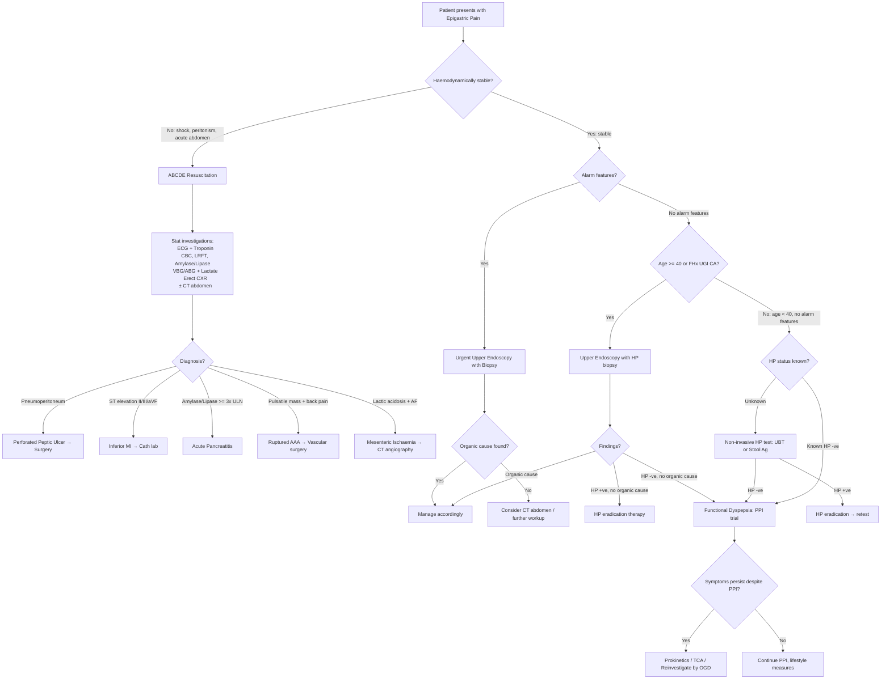

## Diagnostic Criteria, Algorithm, and Investigations for Epigastric Pain

Epigastric pain is a symptom, not a disease — so there is no single "diagnostic criterion" for epigastric pain itself. Instead, the diagnostic approach involves **systematically working through the differential** using history, examination, bedside tests, blood tests, imaging, and endoscopy to identify (or exclude) the underlying cause. However, several of the key conditions causing epigastric pain **do** have formal diagnostic criteria, and you must know these.

This section covers:
1. **Formal diagnostic criteria** for the major conditions
2. **The overall diagnostic algorithm** for approaching a patient with epigastric pain
3. **Investigation modalities** — what to order, what you're looking for, and why

---

## Formal Diagnostic Criteria for Major Conditions

### 1. Functional Dyspepsia — Rome IV Criteria

Functional dyspepsia (FD) is a **diagnosis of exclusion** — you must first rule out organic disease [1][2].

**Rome IV diagnostic criteria** (updated from Rome III) [1][2]:

> Presence of **one or more** of the following, with **no evidence of structural disease** (including at upper endoscopy) to explain the symptoms:
> - Bothersome **postprandial fullness**
> - Bothersome **early satiation**
> - Bothersome **epigastric pain**
> - Bothersome **epigastric burning**
>
> Criteria fulfilled for the **last 3 months** with symptom onset **≥ 6 months** before diagnosis.

**Two subtypes**:
- ***Postprandial distress syndrome (PDS)***: postprandial fullness and/or early satiation occurring ≥ 3 days/week
- ***Epigastric pain syndrome (EPS)***: epigastric pain and/or burning occurring ≥ 1 day/week

**Supportive remarks** [1]:
- Pain may be induced or relieved by ingestion of a meal, or may occur while fasting
- Pain does **not** fulfil biliary pain criteria
- Vomiting warrants consideration of another disorder
- Heartburn is not a dyspeptic symptom but may often coexist
- Symptoms relieved by evacuation of faeces or gas should generally not be considered as part of dyspepsia

<Callout title="Why is FD a Diagnosis of Exclusion?" type="idea">
Because functional dyspepsia and organic diseases (PUD, gastric CA, GERD) share identical symptoms, you cannot clinically distinguish them. A normal OGD + normal H. pylori status + no alarm features are required before labelling a patient as FD. This is why understanding the investigation algorithm is so important.
</Callout>

### 2. Acute Pancreatitis — Revised Atlanta Classification (2013)

***Diagnostic criteria: ≥ 2 out of 3*** [9][16]:

| Criterion | Details | Why? |
|---|---|---|
| ***Clinical*** | ***Acute onset of persistent, severe epigastric pain often radiating to the back*** | Retroperitoneal pancreatic inflammation irritating coeliac plexus |
| ***Biochemical*** | ***Serum amylase or lipase ≥ 3× upper limit of normal (ULN)*** | Leakage of pancreatic enzymes into blood from damaged acinar cells |
| ***Radiological*** | ***Characteristic findings on transabdominal USG, contrast-enhanced CT, or MRI*** | Direct visualisation of pancreatic oedema, necrosis, or peripancreatic fluid |

**Key points** [9][16]:
- ***Pancreatic enzyme elevation is NOT indicative of severity*** — it tells you the diagnosis, not the prognosis [9]
- Imaging is usually only needed if the diagnosis is in doubt (i.e., amylase/lipase is equivocal but clinical suspicion is high) [16]
- Early CT scan ( < 3 days) **will not show necrotic/ischaemic areas** — necrosis takes 48–72 hours to demarcate [16]

### 3. Acute Cholecystitis — Tokyo Guidelines 2013 (TG13)

***Diagnostic criteria (Sensitivity 91.2%, Specificity 96.9%)*** [18][19]:

| Component | Criteria |
|---|---|
| **A: Local signs of inflammation** | Murphy's sign; RUQ mass/pain/tenderness |
| **B: Systemic signs of inflammation** | Fever; leukocytosis; elevated CRP ( > 3 mg/dL) |
| **C: Imaging findings** | Imaging findings characteristic of acute cholecystitis |

***Interpretation*** [18][19]:
- ***Suspected diagnosis*** = **1× item in A** + **1× item in B**
- ***Definite diagnosis*** = **1× item in A** + **1× item in B** + **1× item in C**

Why this structure? Because you want both clinical **and** radiological confirmation — clinical signs alone have limited specificity (Murphy's sign: Sens 50–65%, Spec 79–96%), and imaging alone may show incidental cholecystitis in asymptomatic patients [19].

### 4. Acute Myocardial Infarction — 4th Universal Definition (2018)

***Detection of rise and/or fall of cardiac biomarkers (preferably cTn) with ≥ 1 value above 99th percentile URL, PLUS ≥ 1 of*** [11][20]:
1. ***Symptoms of ischaemia***
2. ***New or presumed new significant ST-T changes or new LBBB***
3. ***Development of pathological Q waves***
4. ***Imaging evidence of new loss of viable myocardium or new regional wall motion abnormality***
5. ***Identification of an intracoronary thrombus by angiography or post-mortem***

This is critical because inferior MI can present as isolated epigastric pain — you diagnose it by ECG + troponin, not by abdominal examination.

### 5. Peptic Ulcer Disease — No Formal "Diagnostic Criteria"

PUD is diagnosed by **direct visualisation at upper endoscopy (OGD)** with biopsy [1][3]. There are no validated clinical diagnostic criteria — history alone cannot reliably distinguish PUD from functional dyspepsia or gastric cancer. This is why OGD is the definitive investigation.

### 6. GERD — Clinical + Response to PPI

GERD can be diagnosed clinically when typical symptoms (heartburn + regurgitation) are present [4]. A **PPI therapeutic trial** (1–4 weeks) serves as both diagnostic and therapeutic — symptom improvement strongly suggests GERD [1]. Definitive testing (pH monitoring, impedance) is reserved for refractory cases.

---

## The Diagnostic Algorithm

### Overarching Principle

The approach to a patient with epigastric pain depends on **two critical decision points**:
1. **Is this an acute emergency?** → Stabilise first, then investigate
2. **Are alarm features present?** → Determines urgency and type of investigation

### Master Algorithm for Epigastric Pain

### Key Decision Points Explained

**1. Why ECG first in acute epigastric pain?**

Because inferior MI can mimic an acute abdomen, and the treatment (reperfusion) is time-critical. An ECG takes 30 seconds and can save a life. ***Always ECG + cardiac enzymes to rule out basal MI*** [3][11][18].

**2. Why erect CXR?**

***Erect CXR looks for free gas under diaphragm → pneumoperitoneum → perforation*** [3][18]. This is the fastest way to diagnose a perforated peptic ulcer. Also evaluates for: left-sided pleural effusion (pancreatitis, Boerhaave's), widened mediastinum (aortic dissection), basal pneumonia.

**3. Why amylase/lipase?**

Because acute pancreatitis requires ≥ 3× ULN for diagnosis — and the treatment pathway (aggressive fluid resuscitation, aetiology-directed therapy) is completely different from PUD or biliary colic [9][16].

**4. The age threshold for OGD**

In Hong Kong, ***age ≥ 40 years*** with new-onset dyspepsia warrants OGD (lower than Western guideline of ≥ 55) due to higher gastric cancer prevalence in East Asia [2].

**5. Test-and-treat for H. pylori**

In young patients ( < 40) without alarm features, a non-invasive H. pylori test (urea breath test or stool antigen test) is the first step — because HP eradication can cure a subset of both PUD and functional dyspepsia without needing endoscopy [2].

---

## Investigation Modalities — Systematic Review

### A. Bedside Investigations

| Investigation | What It Tells You | Key Findings |
|---|---|---|
| ***ECG*** | ***Rule out acute MI (inferior wall)*** [3][11][18] | ST elevation in II, III, aVF = inferior MI; diffuse ST elevation with PR depression = pericarditis; normal ECG does not exclude ACS (repeat in 6–12h) |
| ***Urinalysis*** | Rule out urological causes (UTI, renal colic) [3][18] | Haematuria → renal colic; nitrites + leukocytes → UTI; glucose + ketones → DKA |
| ***Urine pregnancy test*** | Rule out ectopic pregnancy in women of childbearing age [3][18] | Always check before CT scan (radiation) |

### B. Blood Tests

| Investigation | What It Tells You | Key Findings & Interpretation |
|---|---|---|
| **CBC** | Infection, chronic blood loss, haemoconcentration | ↑ WBC with left shift → infection/inflammation (cholecystitis, cholangitis, pancreatitis); ↓ Hb (microcytic) → chronic GI blood loss (PUD, gastric CA); ↑ Hb/Hct → haemoconcentration in pancreatitis (prognostic) [3][18] |
| **LFT** | Hepatocellular vs obstructive pattern | **Parenchymal** (↑↑ AST/ALT, mild ↑ ALP): hepatitis; **Ductal/Obstructive** (↑↑ ALP, ↑ GGT, ↑ conjugated bilirubin): choledocholithiasis, cholangitis, pancreatic head tumour [18][21]. ↑ bilirubin/GGT in cholecystitis should raise suspicion of CBD obstruction [19] |
| **RFT** | Hydration, electrolytes, renal function | HypoK/hypoCl → prolonged vomiting; ↑ urea:creatinine ratio ( > 100:1) → UGIB (Hb digestion in gut + reduced renal perfusion); Cr → suitability for contrast scans [3][18] |
| ***Serum amylase*** | Pancreatic injury | ***Rise within 6–12h of onset, normalise in 3–5 days***; ≥ 3× ULN diagnostic of acute pancreatitis; ***prolonged elevation suggests complications (e.g., pseudocyst)***; ***false positives: PPU, ruptured AAA, DKA, macroamylasaemia*** [9][16]. If equivocal/delayed: **urine amylase** (rises within 24–48h, persists 1 week) [9] |
| ***Serum lipase*** | Pancreatic injury (preferred for delayed presentations) | ***Rise within 4–8h of onset, normalise in 8–14 days (longer half-life)***; ***more specific than amylase***; ***preferred for delayed presentation > 24h*** [9][16] |
| ***Cardiac markers (Troponin)*** | ***Rule out myocardial infarction as a differential diagnosis of epigastric pain*** [1][3][18] | ↑ cTnI or cTnT with dynamic rise/fall pattern → MI. Repeat troponin at 6–12h if first is normal but clinical suspicion remains [20] |
| **CRP** | Inflammatory marker | ↑ CRP supports inflammatory/infective process (cholecystitis, pancreatitis); CRP > 150 mg/L at 48h in pancreatitis predicts severe disease [16] |
| **Glucose** | DKA, new-onset DM (pancreatic CA) | Hyperglycaemia → DKA (with ketones) or pancreatic exocrine/endocrine destruction [7] |
| **Calcium, Phosphate** | Aetiology of pancreatitis; metabolic cause of abdominal pain | Hypercalcaemia → can cause pancreatitis AND cause epigastric pain directly; Hypocalcaemia in pancreatitis → fat saponification (fatty acids precipitate with calcium) [9] |
| ***ABG / VBG + Lactate*** | Metabolic status | ***Metabolic acidosis + ↑ lactate → intestinal ischaemia***; metabolic alkalosis → prolonged vomiting; respiratory alkalosis → early sepsis [3][18] |
| **Clotting profile** | Coagulopathy, pre-operative baseline | ↑ INR in obstructive jaundice (vitamin K malabsorption — fat-soluble vitamin requires bile salts); responsive to IV vitamin K (cf. hepatocellular failure where it is not) [21] |
| **Tumour markers** | Prognostic/monitoring (NOT diagnostic screening) | ***CA19-9: elevated in ~80% pancreatic CA, but NOT sensitive and NOT specific for early diagnosis***; also ↑ in HCC, cholangioCA, gastric CA, chronic pancreatitis, cholangitis; used for monitoring after treatment [7][8]. CEA: raised in 30–60% pancreatic CA |

<Callout title="Amylase vs Lipase — Know the Difference" type="error">
A common exam mistake is confusing the two. **Serum lipase** has a longer half-life (normalises in 8–14 days vs 3–5 days for amylase) and is **more specific** for pancreatic injury. Always prefer lipase for **delayed presentations ( > 24h)**. Amylase can be falsely elevated in many non-pancreatic conditions (PPU, DKA, macroamylasaemia). The cut-off for diagnosis is **≥ 3× ULN for either**, NOT an absolute value [9][16].
</Callout>

### C. Radiological Investigations

#### 1. Erect Chest X-Ray (CXR)

**Why order it?** It is rapid, cheap, and answers three critical questions at once [3][18][22]:

| Finding | Diagnosis | Why? |
|---|---|---|
| ***Free gas under diaphragm*** | ***Perforated peptic ulcer (or other viscus)*** | Air escapes from the perforated hollow viscus into the peritoneal cavity → rises to highest point (under diaphragm on erect film) [22] |
| **Left-sided pleural effusion** | Acute pancreatitis (or Boerhaave's) | Pancreatic inflammation tracks via the oesophageal hiatus or diaphragmatic lymphatics to the left pleural space; amylase-rich effusion |
| **Widened mediastinum** | Aortic dissection | Haematoma around the aortic arch widens the mediastinal silhouette |
| **Basal consolidation** | Pneumonia (referred epigastric pain) | Lower lobe pneumonia irritates the diaphragm → phrenic nerve → referred epigastric/shoulder pain |

#### 2. Abdominal X-Ray (AXR — Supine ± Erect)

| Finding | Diagnosis | Pathophysiological Explanation |
|---|---|---|
| ***Sentinel loop sign*** | ***Acute pancreatitis*** | ***Localised ileus of a single jejunal loop adjacent to the inflamed pancreas → the loop becomes dilated and gas-filled*** [9][16][18] |
| ***Colonic cut-off sign*** | ***Acute pancreatitis*** | ***Functional spasm of the descending colon secondary to pancreatic inflammation → colon dilated from ascending to mid-transverse, then abrupt paucity of gas distal to splenic flexure*** [9][16] |
| **Pancreatic calcification** | Chronic pancreatitis | Intraductal protein plugs calcify over time → visible calcification in the pancreatic bed [16] |
| ***Radio-opaque stones*** | Gallstones (only 15%), urinary stones (90%) | ***Only pigmented gallstones are radio-opaque (calcium bilirubinate); majority cholesterol stones are radiolucent***; urinary stones (calcium oxalate/phosphate) are usually radio-opaque [18] |
| **Air-fluid levels ( > 5)** | Intestinal obstruction | Dilated bowel loops with fluid trapped behind the obstruction → gravity-dependent fluid with gas above it on erect film |
| **Ground-glass appearance** | Peripancreatic fluid collection | Hazy opacification of the abdomen due to free fluid |
| ***Obliteration of psoas outline*** | ***Retroperitoneal fluid/haemorrhage*** | ***Retroperitoneal fluid accumulation (pancreatitis, AAA leak) obliterates the normally visible psoas muscle shadow*** [9] |

#### 3. Ultrasound (USG)

USG is the **first-line imaging** for biliary pathology and is readily available, quick, and non-invasive [18][19].

| Target | Findings | Interpretation |
|---|---|---|
| ***Gallstones*** | ***Hyperechoic focus with posterior acoustic shadowing, gravity-dependent (rolling stone sign on lateral decubitus)*** | ***USG sensitivity for gallstones ~95%*** [9][18] |
| ***Acute cholecystitis*** | ***Thickened GB wall ( > 3 mm), distended GB with sludge, sonographic Murphy's sign, pericholecystic fluid*** | Sensitivity 88%, Specificity 80% [19]. ***Sonographic Murphy's sign = tenderness maximal when USG probe presses on the visualised gallbladder*** [18][19] |
| **CBD dilatation** | CBD diameter > 6 mm (or > 10 mm post-cholecystectomy) | Suggests distal obstruction — choledocholithiasis, pancreatic head tumour |
| **Pancreas** | Diffusely enlarged and hypoechoic (acute pancreatitis); peripancreatic anechoic fluid collection | May be absent in initial phase; may be obscured by bowel gas due to ileus [16] |
| **Liver** | Hepatomegaly, focal lesions, dilated intrahepatic ducts | HCC, metastatic disease, biliary obstruction |

**Limitations**: operator-dependent; limited by body fat and bowel gas (especially for distal CBD and pancreas) [9].

| ***Site of pain*** | ***Imaging of choice*** |
|---|---|
| ***RUQ*** | ***USG*** |
| ***LUQ*** | ***CT*** |
| ***RLQ*** | ***CT with IV contrast*** |
| ***LLQ*** | ***CT with IV contrast*** |
| ***Suprapubic*** | ***USG (transabdominal or transvaginal)*** |

This table from the lecture notes is useful as a quick reference — RUQ pain defaults to USG because the most common pathology is biliary, and USG is the gold standard for gallstones [18].

#### 4. Contrast-Enhanced CT Abdomen

CT is the **workhorse** of abdominal imaging for complex or unclear presentations. Different "protocols" are used depending on the clinical question [7][16][18]:

| Protocol | What It Evaluates | Key Findings |
|---|---|---|
| **Standard CT abdomen with IV contrast** | Most acute abdomen presentations | PPU: free gas + free fluid; cholecystitis: GB wall thickening + fat stranding (seen better than USG); appendicitis: distended appendix + fat stranding; AAA: aneurysmal dilatation ± retroperitoneal haematoma [18] |
| ***CT with pancreas protocol (thin-sliced, triphasic: arterial + pancreatic + portovenous phases)*** | ***Pancreatic carcinoma*** | ***Ill-defined hypoattenuating mass within pancreas; double duct sign (dilated pancreatic duct + CBD) — present in 62–77% of CA head of pancreas; determine resectability: encasement of SMA, hepatic artery, coeliac trunk, SMV, portal vein*** [7][8] |
| **CT abdomen with contrast for pancreatitis** | Acute pancreatitis (when diagnosis in doubt or assessing severity ≥ 3 days) | ***Focal or diffuse enlargement with homogeneous enhancement; peripancreatic fat stranding; necrosis shown as hypoenhancement on contrast CT; early CT will NOT show necrotic areas*** [16] |
| **CT angiography** | Mesenteric ischaemia, AAA, aortic dissection | Filling defect in SMA/SMV; intestinal pneumatosis (air in bowel wall); aortic intimal flap; contrast extravasation (active bleeding) |

> **High Yield:** ***Contrast is essential in pancreatitis CT to detect pancreatic necrosis*** — a non-enhanced CT cannot distinguish viable from necrotic tissue. Necrosis = hypoenhancement = failure to take up contrast [1][16].

#### 5. MRCP and ERCP

| Modality | What It Does | When To Use |
|---|---|---|
| **MRCP** (Magnetic Resonance Cholangiopancreatography) | Non-invasive delineation of biliary and pancreatic ductal anatomy | ***Alternative to ERCP; ↑ popularity because ERCP is associated with ↑↑↑ risks (pancreatitis, perforation, bleeding)***; used to confirm CBD stones, cholangiocarcinoma, define anatomy before surgery [7] |
| **ERCP** (Endoscopic Retrograde Cholangiopancreatography) | Therapeutic + diagnostic: cannulation of ampulla of Vater → inject contrast → visualise ducts; can perform sphincterotomy, stone extraction, stenting | Suspected cholangitis or CBD stones needing intervention; diagnostic doubt; brush cytology/biopsy for biliary strictures [7] |

#### 6. EUS (Endoscopic Ultrasound)

***EUS-guided FNAC/biopsy is preferred over percutaneous USG/CT-guided biopsy for pancreatic masses*** — because of ***↑ sensitivity (90%) and ↓ chance of tumour seeding*** [7][8].

**Indications for tissue biopsy in pancreatic mass** [7]:
1. ***Diagnosis doubtful***
2. ***Plan for non-operative treatment (patient unfit, systemic spread, or unresectable disease)***
3. ***Plan for initial neoadjuvant chemotherapy***

***Tissue diagnosis is NOT mandatory if the lesion is potentially resectable*** — proceed directly to surgery to avoid seeding risk [7][8].

### D. Endoscopy

#### Upper Endoscopy (OGD — Oesophago-gastro-duodenoscopy)

OGD is the **definitive investigation** for the upper GI tract. It is both **diagnostic and therapeutic** [1][3].

**Indications** [1]:
- ***Symptom-based***: anaemia, haematemesis, melaena, ***epigastric pain***, dysphagia, acid reflux, indigestion
- ***Disease-based***: PUD follow-up, suspected oesophageal/gastric cancer, oesophageal variceal treatment, foreign body ingestion

**Contraindications** [1]: Known/suspected perforation; recent MI

**Key findings and their significance** [1]:

| Finding | Diagnosis | Endoscopic Features |
|---|---|---|
| **Benign ulcer** | Peptic ulcer disease | ***Smooth, regular, rounded edges; flat smooth ulcer base often filled with exudate*** [1] |
| **Malignant ulcer** | Gastric cancer | ***Ulcerated mass protruding into lumen; irregular or thickened ulcer margins; folds surrounding ulcer crater are nodular, clubbed, fused*** [1] |
| **Oesophagitis** | GERD | Mucosal breaks at the GEJ (Los Angeles classification A–D) |
| **Gastritis** | H. pylori, NSAIDs, alcohol | Erythema, erosions, petechiae |
| **Varices** | Portal hypertension | Dilated submucosal veins in oesophagus/fundus |

***Forrest classification*** — endoscopic stigmata of recent haemorrhage (SRH), used to prognosticate rebleeding risk and guide therapy [1]:

| ***Class*** | ***Stigmata*** | ***Prevalence*** | ***Rebleeding Risk*** | ***Management*** |
|---|---|---|---|---|
| ***Ia*** | ***Spurting haemorrhage*** | ***10%*** | ***55–100%*** | ***Endoscopic therapy required*** |
| ***Ib*** | ***Oozing haemorrhage*** | ***10%*** | | ***Endoscopic therapy required*** |
| ***IIa*** | ***Non-bleeding visible vessel*** | ***25%*** | ***40–50%*** | ***Endoscopic therapy required*** |
| ***IIb*** | ***Adherent clot*** | ***10%*** | ***20–30%*** | ***Consider endoscopic therapy*** |
| ***IIc*** | ***Flat pigmented spot*** | ***10%*** | ***10%*** | ***Acid suppression alone*** |
| ***III*** | ***Clean base*** | ***35%*** | ***5%*** | ***Acid suppression alone*** |

> **High Yield:** Forrest Class I and IIa/IIb are **high risk** and require endoscopic haemostasis. Class IIc and III are **low risk** and can be managed with acid suppression alone [1].

**Biopsy protocol at OGD**:
- All gastric ulcers must be biopsied (to exclude malignancy) — duodenal ulcers are rarely malignant and do not routinely need biopsy
- H. pylori testing should be done on biopsy sample (rapid urease test / histology) [2]
- Follow-up OGD for gastric ulcers at 6–8 weeks to confirm healing and re-biopsy if not healed

<Callout title="AVOID Endoscopy in Acute Abdomen!" type="error">
***AVOID endoscopy for acute abdomen — a sealed-off perforation may open by gas insufflation during endoscopy*** [18]. If perforation is suspected (peritonism, free gas on CXR), do NOT proceed with OGD. This is a critical safety point.
</Callout>

### E. H. pylori Testing

H. pylori testing is central to the diagnostic approach to epigastric pain, because it determines management for both PUD and functional dyspepsia [1][2].

| Test | Type | How It Works | Sensitivity / Specificity | Notes |
|---|---|---|---|---|
| **Rapid urease test (CLO test)** | Invasive (biopsy at OGD) | Biopsy placed in urea-containing medium → H. pylori urease converts urea to ammonia → pH change → colour change | High | Requires OGD; affected by recent PPI/antibiotics (must stop PPI ≥ 2 weeks, antibiotics ≥ 4 weeks before testing) |
| **Histology** | Invasive (biopsy at OGD) | Direct visualisation of organisms on gastric biopsy | Gold standard | Also assesses gastritis, metaplasia, dysplasia |
| ***Urea breath test (UBT)*** | Non-invasive | ***Patient ingests ¹³C- or ¹⁴C-labelled urea → H. pylori urease hydrolyses it to labelled CO₂ → detected in breath samples*** [1] | Sens ~95%, Spec ~95% | Best non-invasive test; used for test-and-treat AND confirmation of eradication (≥ 4 weeks post-treatment) |
| **Stool antigen test** | Non-invasive | Detects H. pylori antigens in stool using monoclonal antibodies | Sens ~95%, Spec ~95% | Good alternative to UBT; useful in children |
| **Serology (IgG)** | Non-invasive | Detects antibodies to H. pylori in blood | Moderate | Cannot distinguish current from past infection; NOT useful for confirming eradication; useful in epidemiological studies |

**Why stop PPI before HP testing?** PPIs suppress H. pylori replication and reduce urease activity → false-negative results on urease-based tests (CLO test, UBT). Always stop PPI ≥ 2 weeks and antibiotics ≥ 4 weeks before testing [1][2].

### F. Fluoroscopy / Contrast Studies

| Study | Evaluates | Indications | Key Findings |
|---|---|---|---|
| ***Barium meal*** | ***Stomach and duodenum*** | ***Dyspepsia and epigastric pain; weight loss; suspected stomach cancer; suspected PPU*** [22] | Ulcer crater (niche); filling defect (tumour); mucosal irregularity; gastric outlet narrowing; contrast leak (perforation — use water-soluble contrast, NOT barium, if perforation suspected) |
| **Barium swallow** | Hypopharynx, oesophagus | Dysphagia, odynophagia | Stricture, achalasia ("bird's beak"), mucosal irregularity, hiatus hernia |
| **Water-soluble contrast meal** | Stomach/duodenum when perforation suspected | Suspected PPU or oesophageal perforation | Contrast extravasation at perforation site — barium NEVER used if perforation suspected (causes severe peritonitis) |

### G. Special Investigations by Condition

| Condition | Key Investigation | Specific Findings |
|---|---|---|
| **ZES / Gastrinoma** | Fasting serum gastrin + gastric pH | Gastrin > 10× ULN with pH < 2 diagnostic; secretin stimulation test for equivocal cases [17] |
| **Chronic pancreatitis** | Plain AXR, USG, CT, MRCP, ± secretin-stimulated MRCP, faecal elastase | AXR: pancreatic calcification (30%); CT: ductal dilatation, calcification, pseudocysts; ***amylase/lipase usually NORMAL due to burnout effect*** [16]; faecal elastase < 200 μg/g → exocrine insufficiency |
| **Gastric cancer staging** | CT chest + abdomen + pelvis, ± PET-CT, EUS | EUS for T and N staging; CT for distant metastases (liver, peritoneal, lung); diagnostic laparoscopy for peritoneal disease |
| **Pancreatic cancer staging** | ***CT pancreas protocol, ± MRCP, ± EUS-FNAC, ± PET-CT*** | ***Double duct sign; hypoattenuating mass; vascular encasement (SMA, hepatic artery, coeliac trunk, SMV, portal vein) determines resectability*** [7][8] |
| **GERD** | PPI trial → if refractory: 24h pH/impedance monitoring, oesophageal manometry | pH monitoring: gold standard for acid exposure; manometry for motility assessment before anti-reflux surgery |
| **Mesenteric ischaemia** | CT angiography, ± conventional angiography | SMA filling defect (embolus/thrombus); intestinal pneumatosis; portal venous gas; bowel wall thickening |

---

## Summary: What to Order and When

| Clinical Scenario | First-Line Investigations | Second-Line / Definitive |
|---|---|---|
| **Acute severe epigastric pain** | ECG, troponin, CBC, LRFT, amylase/lipase, VBG/lactate, erect CXR | CT abdomen, OGD (if no perforation suspected), ± CT angiography |
| **Chronic/recurrent epigastric pain, age ≥ 40 or alarm features** | CBC, LFT, OGD with biopsy + HP testing | CT abdomen, USG abdomen, tumour markers if malignancy suspected |
| **Chronic/recurrent epigastric pain, age < 40, no alarm features** | Non-invasive HP test (UBT or stool Ag) | OGD if HP eradication fails or symptoms persist despite PPI |
| **RUQ / biliary-type pain** | USG abdomen, CBC, LFT, amylase | MRCP, ERCP if CBD stones/cholangitis |
| **Suspected pancreatic pathology** | Amylase/lipase, USG, LFT, Ca²⁺, glucose | ***CT pancreas protocol, MRCP, EUS-FNAC*** |
| **Suspected UGIB** | CBC, clotting, X-match, LRFT, VBG | Urgent OGD (within 24h; within 12h if high-risk) |

---

<Callout title="High Yield Summary">

1. **Functional dyspepsia** is diagnosed by Rome IV criteria PLUS exclusion of organic disease by OGD — it is a diagnosis of exclusion.

2. ***Acute pancreatitis***: ≥ 2/3 of clinical (epigastric pain radiating to back), biochemical (amylase/lipase ≥ 3× ULN), radiological. Enzyme elevation is diagnostic, NOT prognostic.

3. ***Acute cholecystitis***: Tokyo 2013 — suspected = local signs + systemic signs; definite = local + systemic + imaging.

4. ***Acute MI***: rise/fall of cTn above 99th URL + ≥ 1 of symptoms, ECG changes, Q waves, imaging, or thrombus.

5. **Always ECG + troponin** in acute epigastric pain to exclude inferior MI.

6. **Erect CXR**: pneumoperitoneum (PPU), pleural effusion (pancreatitis), widened mediastinum (dissection).

7. ***AXR***: sentinel loop sign and colonic cut-off sign → pancreatitis; radio-opaque stones → 90% urinary, only 15% gallstones.

8. ***USG is first-line for biliary pathology*** (sensitivity 95% for gallstones); ***sonographic Murphy's sign*** confirms acute cholecystitis.

9. ***CT pancreas protocol (triphasic)*** is essential for pancreatic carcinoma — hypoattenuating mass, double duct sign, vascular encasement determines resectability.

10. ***Forrest classification*** at OGD guides management: Class I/IIa–b = high risk → endoscopic therapy; Class IIc/III = low risk → acid suppression alone.

11. ***Stop PPI ≥ 2 weeks and antibiotics ≥ 4 weeks before H. pylori testing*** (urease-based tests) to avoid false negatives.

12. ***AVOID endoscopy if perforation is suspected*** — gas insufflation can open a sealed perforation.

13. ***EUS-guided FNAC is preferred over percutaneous biopsy for pancreatic masses*** (higher sensitivity, lower seeding risk). Tissue diagnosis is NOT mandatory if the lesion is potentially resectable.

</Callout>

---

<ActiveRecallQuiz
  title="Active Recall - Diagnostic Criteria, Algorithm, and Investigations for Epigastric Pain"
  items={[
    {
      question: "State the Revised Atlanta diagnostic criteria for acute pancreatitis. Which criterion is NOT indicative of severity?",
      markscheme: "Requires 2 out of 3: (1) Clinical — acute onset persistent severe epigastric pain often radiating to back; (2) Biochemical — serum amylase or lipase at least 3x ULN; (3) Radiological — characteristic findings on USG, CT, or MRI. The biochemical criterion (enzyme elevation) is NOT indicative of severity — it confirms diagnosis only.",
    },
    {
      question: "A 55-year-old male presents with acute epigastric pain. List the stat bedside and blood investigations you would order, and explain why ECG is mandatory.",
      markscheme: "Bedside: ECG, urinalysis, urine pregnancy test (if female). Blood: CBC, LFT, RFT, amylase/lipase, clotting, troponin, VBG/ABG with lactate, glucose, calcium, group and screen. ECG is mandatory because inferior MI (RCA territory) can present as isolated epigastric pain — especially in diabetics with autonomic neuropathy. ST elevation in leads II, III, aVF diagnoses inferior MI. Missing this is fatal.",
    },
    {
      question: "What is the sentinel loop sign on AXR and what does it indicate? Explain its pathophysiology.",
      markscheme: "A single dilated gas-filled loop of jejunum adjacent to the pancreas on AXR. It indicates localised ileus secondary to acute pancreatitis. Pathophysiology: pancreatic inflammation in the retroperitoneum causes reflex paralysis of the adjacent bowel segment (jejunum) via local peritoneal irritation and sympathetic activation, resulting in a localised ileus.",
    },
    {
      question: "State the Tokyo 2013 criteria for diagnosing acute cholecystitis. What is the difference between a suspected and definite diagnosis?",
      markscheme: "Three components: A (local signs) — Murphy's sign, RUQ mass/pain/tenderness; B (systemic signs) — fever, leukocytosis, elevated CRP; C (imaging) — findings characteristic of acute cholecystitis on USG/CT. Suspected = 1 item from A + 1 item from B. Definite = 1 item from A + 1 item from B + 1 item from C. Sensitivity 91.2%, Specificity 96.9%.",
    },
    {
      question: "Why must you stop PPI at least 2 weeks before H. pylori testing with a urea breath test? Why is serology not useful for confirming eradication?",
      markscheme: "PPIs suppress H. pylori replication and reduce urease activity, leading to false-negative results on urease-based tests (UBT, CLO test). Stopping PPI at least 2 weeks allows bacterial repopulation and urease recovery. Serology detects IgG antibodies which persist for months to years after eradication — it cannot distinguish current from past infection, so it is useless for confirming eradication.",
    },
    {
      question: "A pancreatic head mass is found on CT. Under what circumstances is tissue biopsy required before surgery, and which biopsy method is preferred?",
      markscheme: "Tissue biopsy is NOT mandatory if the lesion is potentially resectable — proceed directly to surgery. Indications for biopsy: (1) diagnosis doubtful on imaging; (2) plan for non-operative treatment (unfit patient, unresectable, systemic spread); (3) plan for neoadjuvant chemotherapy. Preferred method: EUS-guided FNAC/biopsy — higher sensitivity (90%) and lower risk of tumour seeding compared to percutaneous USG/CT-guided biopsy.",
    },
  ]}
/>

## References

[1] Senior notes: felixlai.md (Dyspepsia, OGD indications, PUD diagnosis, H. pylori testing, Forrest classification)
[2] Senior notes: Ryan Ho Fundamentals.pdf (p263–264, Approach to Dyspepsia); Ryan Ho GI.pdf (p53–54)
[3] Senior notes: Ryan Ho GI.pdf (p94, p105, Causes of Upper Abdominal Pain, Investigations for Acute Abdomen); Ryan Ho Fundamentals.pdf (p268, p279)
[4] Senior notes: Ryan Ho GI.pdf (p56–57, GERD)
[7] Senior notes: maxim.md (Pancreatic carcinoma — Investigations, tissue biopsy indications); Ryan Ho GI.pdf (p352)
[8] Lecture slides: WCS 056 - Painless jaundice and epigastric mass - by Prof R Poon.ppt (1).pdf
[9] Senior notes: maxim.md (Acute pancreatitis — Investigation, diagnostic criteria); felixlai.md (Acute pancreatitis — Diagnosis)
[11] Senior notes: Ryan Ho Cardiology.pdf (p56, p58, p127 — Chest pain approach, MI definition)
[16] Senior notes: Ryan Ho GI.pdf (p340–341, p348 — Acute pancreatitis diagnosis, imaging; Chronic pancreatitis)
[17] Senior notes: Ryan Ho Endocrine.pdf (p102, Gastrinoma / ZES)
[18] Lecture slides: GC 195. Lower and diffuse abdominal pain RLQ problems; pelvic inflammatory disease; peritonitis and abdominal emergencies.pdf (p12, Investigations); Senior notes: maxim.md (Acute abdomen — Investigations, imaging by site)
[19] Senior notes: Ryan Ho GI.pdf (p247–248, Acute cholecystitis — Tokyo guidelines, imaging); felixlai.md (Tokyo criteria 2013)
[20] Senior notes: Ryan Ho Cardiology.pdf (p127, Universal definition of MI)
[21] Senior notes: Ryan Ho Fundamentals.pdf (p296, Investigations for jaundice — LFT patterns, clotting)
[22] Senior notes: Ryan Ho Diagnostic Radiology.pdf (p19, GI fluoroscopy studies); Ryan Ho Radiology.pdf (p6, Pneumoperitoneum)
