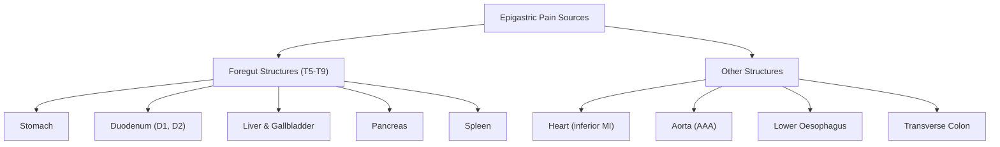

## Definition and Overview

Epigastric pain is pain localised to the upper central region of the abdomen, bounded superiorly by the xiphisternum, inferiorly by the transumbilical plane, and laterally by the midclavicular lines bilaterally. It corresponds roughly to the **epigastrium** — one of the nine regions of the abdomen.

**"Epigastric"** breaks down as: *epi-* (Greek: upon/above) + *gastric* (Greek: *gaster* = stomach) — literally "upon the stomach." This is logical because the stomach and adjacent foregut structures sit directly behind this region.

Epigastric pain is not a diagnosis; it is a **presenting complaint** that encompasses a vast differential ranging from benign functional dyspepsia to life-threatening emergencies such as perforated peptic ulcer, acute pancreatitis, ruptured abdominal aortic aneurysm, and even acute myocardial infarction. The clinical approach therefore demands a systematic framework linking anatomy, referred pain pathways, and pathophysiology to narrow the differential efficiently.

<Callout title="Key Concept">
Epigastric pain is a symptom, not a disease. Your job is to work backwards from the pain to the organ, then from the organ to the pathology, using the character, timing, radiation, and associated features to narrow the differential.
</Callout>

### Relationship to Dyspepsia

***Dyspepsia*** is a broader syndrome defined by the ***Rome IV criteria*** (updated from Rome III) as one or more of [1][2]:
- ***Postprandial fullness***
- ***Early satiety***
- ***Epigastric pain***
- ***Epigastric burning***

These symptoms must be prominent enough to affect daily activities. Approximately ***75% of patients with dyspepsia have functional dyspepsia*** (no identifiable organic cause), while ***25% have an underlying organic cause*** [1][2].

***Alarm features in dyspepsia*** (mandating urgent investigation) include [1][2]:
- ***Age ≥ 40 years (in Asian populations; ≥ 55 years in Western guidelines) with newly onset dyspepsia***
- ***Family history of upper GI cancer***
- ***Jaundice***
- ***Unintended weight loss***
- ***Dysphagia or odynophagia***
- ***GI bleeding (haematemesis, melaena)***
- ***Unexplained iron-deficiency anaemia***
- ***Persistent vomiting***
- ***Palpable mass or lymphadenopathy***

> **High Yield:** In Hong Kong, the age threshold for OGD is typically **≥ 40 years** with new-onset dyspepsia (lower than Western guidelines) because of higher gastric cancer prevalence in East Asia [2].

---

## Epidemiology and Risk Factors

### Epidemiology of Epigastric Pain (by Major Causes)

| Condition | Epidemiological Highlights (HK/Asia Focus) |
|---|---|
| **Functional dyspepsia** | Prevalence 10–20% among Chinese; most common cause of epigastric discomfort; F > M = 2:1; usually < 40 years [2] |
| **Peptic ulcer disease** | Incidence ~1/1000/year, lifetime risk ~10%, falling trend (↓ H. pylori, ↓ smoking); M:F = 3:1 for DU [1][3] |
| **GERD** | Rising incidence in HK (2.5% in 2002 → 3.7% in 2011); Asians present atypically with less severe oesophagitis [4] |
| ***Gastric cancer*** | ***6th in incidence, 4th in cancer mortality; ↑ in Asia (Japan, Korea, China); 90% adenocarcinoma; distal stomach MC site*** [5][6] |
| ***Pancreatic carcinoma*** | ***Head (60%), body (15%), tail (5%), diffuse (20%); 90% ductal adenocarcinoma*** [7][8] |
| **Acute pancreatitis** | Gallstones MC cause in HK; alcohol second; incidence rising globally [1][9] |
| **Biliary colic / cholecystitis** | Gallstones affect ~10–15% of adults; 80% remain asymptomatic; higher prevalence in females (4F's: Female, Forty, Fat, Fertile) [9] |
| **Acute MI (inferior)** | Must always be considered; epigastric pain can be the sole presenting complaint, especially in diabetics (autonomic neuropathy masks chest pain) |

### General Risk Factors for Conditions Causing Epigastric Pain

- **H. pylori infection** — major risk factor for PUD and gastric cancer (see below)
- **NSAIDs / aspirin** — dose-dependent mucosal injury
- **Smoking** — doubles PUD risk, increases gastric cancer risk (~11%) [5]
- **Alcohol** — gastritis, pancreatitis, liver disease
- **Age** — increasing risk of malignancy
- **Obesity** — GERD, gallstones, pancreatic cancer
- ***Hereditary factors*** — ***E-cadherin mutation (hereditary diffuse gastric cancer)***, HNPCC, FAP [5][6]

---

## Anatomy and Function

Understanding which organs sit in or refer pain to the epigastrium is essential. The key concept is the distinction between **visceral pain** and **somatic (parietal) pain**.

### Visceral vs Somatic Pain — A First Principles Explanation

| Feature | Visceral Pain | Somatic (Parietal) Pain |
|---|---|---|
| **Origin** | Distension, ischaemia, or spasm of hollow viscera / capsular stretch of solid organs | Inflammation of parietal peritoneum |
| **Nerve fibres** | Autonomic (sympathetic) afferents; poorly localised | Somatic (spinal) afferents; well-localised |
| **Character** | Dull, vague, crampy, midline | Sharp, localised, constant |
| **Location** | Referred to dermatome of embryological origin | Directly over the inflamed area |
| **Associated features** | Nausea, vomiting, sweating (autonomic) | Guarding, rigidity, rebound tenderness |

**Why is foregut pain felt in the epigastrium?** The foregut (stomach, duodenum D1–D2, liver, gallbladder, pancreas, spleen) is innervated by the coeliac (splanchnic) plexus, which enters the spinal cord at T5–T9. The brain interprets this afferent input as coming from the T5–T9 dermatomes, which map to the epigastrium. This is why gastric ulcer pain, biliary colic, and early appendicitis (midgut = T10) all start as poorly localised midline pain before parietal peritoneal involvement causes localisation.

### Organs in or Referring Pain to the Epigastrium

### Stomach Anatomy (Detailed)

The stomach is a J-shaped muscular organ with the following regions: **cardia** (entry point from oesophagus), **fundus** (dome-shaped superior portion), **body/corpus** (largest part), **antrum** (distal narrowing), and **pylorus** (sphincter controlling gastric outflow).

***Arterial supply*** [1][3]:
- **Greater curvature**: short gastric arteries, left gastro-omental (gastroepiploic) artery, right gastro-omental (gastroepiploic) artery
- **Lesser curvature**: left gastric artery (largest contributor), right gastric artery

All these are branches or indirect branches of the **coeliac trunk** — this rich anastomotic supply means the stomach rarely infarcts but ulcer erosion into an artery (e.g., left gastric artery or gastroduodenal artery posteriorly in DU) causes torrential haemorrhage.

***Nerve supply*** [1]:
- **Sympathetic**: greater splanchnic nerve (T5–T9 sympathetic trunk) — mediates visceral pain
- **Parasympathetic**:
  - ***Anterior vagal nerve: Stomach + Pylorus + Liver***
  - ***Posterior vagal nerve: Stomach + Foregut and midgut down to splenic flexure***

The vagus nerve stimulates gastric acid secretion (via acetylcholine on parietal cells and gastrin release from G cells). This is why **vagotomy** was historically used to treat PUD — cutting the vagal supply reduces acid output.

### Gastric Mucosal Defence — Why Doesn't the Stomach Digest Itself?

The stomach maintains a balance between **aggressive factors** (acid, pepsin) and **protective mechanisms** (mucus-bicarbonate barrier, mucosal blood flow, prostaglandins, epithelial cell turnover) [1][3]:

1. **Mucus layer** — secreted by surface epithelial cells; forms an unstirred gel layer trapping bicarbonate
2. **Bicarbonate secretion** — creates a pH gradient (pH 1–2 at lumen surface → pH 6–7 at epithelial surface)
3. **Mucosal blood flow** — delivers oxygen and nutrients, washes away back-diffused H⁺ ions
4. **Prostaglandins (PGE₂, PGI₂)** — synthesised via **COX-1**; stimulate mucus and bicarbonate secretion, maintain mucosal blood flow, promote epithelial restitution
5. **Rapid epithelial cell turnover** — gastric epithelium renews every 3–7 days

<Callout title="Why NSAIDs Cause Ulcers" type="idea">
NSAIDs non-selectively inhibit COX-1 → ↓ prostaglandin synthesis → ↓ mucus, ↓ bicarbonate, ↓ mucosal blood flow → mucosal barrier breaks down → back-diffusion of H⁺ → epithelial injury → ulceration. This is why COX-2 selective inhibitors (e.g., celecoxib) have a lower GI risk — they spare COX-1-mediated gastroprotection [1].
</Callout>

### Pancreatic Anatomy

The pancreas is a retroperitoneal organ lying transversely across the posterior abdominal wall at the level of L1–L2. It has a **head** (nestled in the C-loop of the duodenum), **uncinate process** (hooks behind the superior mesenteric vessels), **neck**, **body**, and **tail** (extending to the splenic hilum).

**Key vascular relationships** [7][8]:
- The ***superior mesenteric artery (SMA)***, ***hepatic artery***, ***coeliac trunk***, ***superior mesenteric vein (SMV)***, and ***portal vein (PV)*** all pass in close proximity — this is why pancreatic tumours can encase these vessels making them unresectable [7][8]
- The ***common bile duct (CBD)*** passes through the head of the pancreas before joining the main pancreatic duct (of Wirsung) at the ***ampulla of Vater*** — this is why head of pancreas tumours cause ***painless obstructive jaundice*** [7][8]

**Pancreatic ducts**: 
- Main pancreatic duct (of Wirsung) joins the CBD at the ampulla of Vater
- Accessory duct (of Santorini) drains via the minor papilla
- ***Pancreatic divisum***: MC congenital anomaly — failure of fusion of dorsal and ventral ductal systems

**Why does pancreatic pain radiate to the back?** The pancreas is retroperitoneal, lying directly anterior to the aorta and vertebral bodies (T12–L2). Inflammatory or neoplastic processes irritate the retroperitoneal nerve plexuses (coeliac and superior mesenteric plexuses), causing referred pain to the back.

### Biliary System Anatomy

- **Gallbladder** sits on the visceral surface of the liver (segments 4b and 5)
- **Hartmann's pouch**: infundibulum of the gallbladder where stones commonly impact
- **Cystic duct** → joins the **common hepatic duct** to form the **common bile duct (CBD)**
- CBD descends behind the first part of the duodenum and through the head of the pancreas
- ***Courvoisier's Law***: ***In painless jaundice with an enlarged gallbladder, the cause is unlikely to be gallstone*** — because a gallbladder chronically inflamed by stones becomes fibrotic and cannot distend; therefore think of ***periampullary tumours*** [9]

---

## Etiology (Hong Kong Focus) and Pathophysiology

Below are the major causes of epigastric pain, organised by system, with their pathophysiological mechanisms explained from first principles.

### 1. Peptic Ulcer Disease (PUD)

**Definition**: A defect in the gastric or duodenal mucosa that extends through the **muscularis mucosae** into the submucosa or deeper [1][3].

**Sites** [3]:
- Duodenal ulcer (75%): usually solitary, in D1 (anterior wall perforates; posterior wall bleeds from gastroduodenal artery)
- Gastric ulcer (20%): usually lesser curvature / corpus-antrum junction
- Lower oesophagus, Meckel's diverticulum (ectopic gastric epithelium), stomal ulcer

#### Aetiology

**H. pylori infection** [1][3]:
- Present in 92% of DU and 70% of GU
- ***Microaerophilic Gram-negative coccobacillus***
- ***Strong urease activity*** — hydrolyses urea → ammonia + CO₂ → neutralises surrounding acid → creates a "protective cloud" allowing survival
- ***Spiral shape, flagella, and mucolytic enzymes*** — facilitates penetration through the mucus layer to reach the gastric surface epithelium
- Induces chronic active gastritis → direct epithelial injury by toxins (CagA, VacA) + host inflammatory response → disruption of mucosal defence → ulceration
- In duodenal ulcer: H. pylori colonises gastric metaplasia in duodenum; promotes antral-predominant gastritis → ↑ gastrin → ↑ acid load to duodenum → duodenal injury
- In gastric ulcer: pangastritis → mucosal atrophy → ↓ acid (paradoxically) but ↓ mucosal defence even more → ulceration

**NSAIDs (including aspirin)** [1][3]:
- Present in 5% of DU and 25% of GU
- ***Gastric and duodenal mucosa use COX-1 for prostaglandin synthesis***
- ***Prostaglandins (PGE₂) protect mucosal lining via: mucin production, mucosal bicarbonate secretion, maintaining mucosal blood flow, and inhibiting gastric acid secretion***
- ***NSAIDs non-selectively inhibit COX-1 and COX-2 → impaired prostaglandin production → disruption of mucosal barrier → increased mucosal permeability to H⁺ ions → acid-mediated damage***
- ***Selective COX-2 inhibitors spare COX-1-mediated GI protection***
- ***Risk factors for NSAID ulcers***: ***advanced age ( > 75 years), prior ulcer history, high-dose / long-duration NSAIDs, concurrent corticosteroids / anticoagulants*** [1]

**Other aetiologies** [1][3]:
- ***Stress ulcers*** — burns (Curling's ulcer), head injury (Cushing's ulcer — vagal-mediated acid hypersecretion), mechanical ventilation, coagulopathy; due to impaired mucosal perfusion + biliary reflux
- ***Smoking*** — 2× risk; impairs mucosal blood flow and bicarbonate secretion, accelerates gastric emptying of acid into duodenum
- ***Alcohol*** — direct mucosal irritant
- ***Zollinger-Ellison syndrome*** — gastrinoma (usually pancreatic or duodenal) → hypergastrinaemia → massive acid hypersecretion → ulcers at atypical locations (D2, jejunum); suspect when recurrent ulcers despite adequate treatment, ulcers in unusual locations, H. pylori-negative, no NSAID use [1]

#### Pathophysiology Summary

The fundamental concept is an **imbalance between aggressive factors (acid + pepsin) and defensive factors (mucus, bicarbonate, blood flow, prostaglandins, epithelial renewal)** [1][3].

### 2. Gastro-oesophageal Reflux Disease (GERD)

***GERD***: ***Condition that develops when reflux of stomach contents causes troublesome symptoms and/or complications*** (Montreal definition, 2006) [4].

**Pathophysiology** [1][4]:
- ***Incompetent lower oesophageal sphincter (LES)***: transient LES relaxation (early) or persistent weakness (late)
- ***Increased intra-abdominal pressure***: obesity, pregnancy, chronic cough, constipation
- ***Hiatus hernia***: sliding type (Type 1) — upper stomach slides up through oesophageal hiatus → loss of intra-abdominal oesophageal segment → loss of the "pinch" effect → functional LES weakness
- ***Delayed oesophageal clearance***: defective peristalsis → prolonged acid exposure
- ***Gastric dysmotility***: delayed gastric emptying

**Why does GERD cause epigastric pain?** The refluxed acid contacts the squamous epithelium of the lower oesophagus (which lacks the protective mucus-bicarbonate layer of the stomach), causing chemical irritation → oesophagitis → retrosternal burning (heartburn). Some patients present with an "acid feeling in the stomach" or epigastric burning rather than classic heartburn — this is the ***atypical presentation*** more common in Asians [4].

**Risk factors** [1][4]:
- ***↓ LES tone***: genetic determinants, hiatus hernia, alcohol, caffeine, smoking
- ***Drugs***: NSAIDs, CCBs, beta-blockers, nitrates, anticholinergics
- ***↑ Intra-abdominal pressure***: pregnancy, obesity, chronic cough, constipation

### 3. Functional Dyspepsia

***Functional dyspepsia (FD)***: dyspepsia in the absence of detectable organic disease [2].

**Rome IV Subtypes** [2]:
1. **Postprandial distress syndrome (PDS)**: postprandial fullness + early satiety (≥ 3 days/week)
2. **Epigastric pain syndrome (EPS)**: epigastric pain or burning (≥ 1 day/week)
3. **Overlap** of both

**Pathophysiology** (not well understood, multifactorial) [2]:
- ***Gastric dysmotility and impaired compliance*** → distension-like feeling
- ***Visceral hypersensitivity*** → ↓ threshold for pain even with normal gastric compliance
- ***H. pylori infection*** → evidence weak but eradication relieves symptoms in a minority
- ***Altered gut microbiome***
- ***Psychological factors*** → anxiety and depression strongly associated
- ***Diet and genetics***

<Callout title="FD vs Organic Causes" type="error">
A common student mistake is to assume that "normal OGD" = "nothing wrong." Functional dyspepsia is a real diagnosis with real pathophysiology (dysmotility + visceral hypersensitivity). It is not a diagnosis of dismissal; it requires active management.
</Callout>

### 4. Gastric Cancer

***Epidemiology***: ***↓ trend globally but ↑ in Asia; 6th in incidence, 4th in cancer mortality; adenocarcinoma (90%) > lymphoma (5%) > GIST, metastasis; site: distal stomach (antrum/pylorus) > cardia (↑ trend) > OGJ*** [5][6].

***Risk factors*** [5][6]:
- ***Compensatory epithelial cell proliferation***:
  - ***H. pylori → chronic atrophic gastritis → intestinal metaplasia → body/distal CA (intestinal type)***
  - ***Chronic gastric reflux (e.g., Barrett's oesophagus) → proximal CA***
  - ***History of gastric resection → bile reflux (e.g., Billroth II) → chronic gastritis***
  - ***Chronic atrophic gastritis associated with pernicious anaemia and Ménétrier's disease***
- ***Environmental factors: smoking, smoked/pickled food, nitrosamines, alcohol***
- ***Host factors***: ***hereditary diffuse gastric carcinoma (HDGC: E-cadherin mutation)***, ***HNPCC, FAP, Peutz-Jeghers syndrome*** [5][6]
- ***Adenomatous polyps*** [6]
- ***Previous partial gastrectomy ( > 20 years)*** [6]
- ***EBV infection (~10%)*** [5]
- ***Industrial exposure (dusty, high temperature, rubber, coal mining, metal processing, chromium production)*** [6]
- ***Pernicious anaemia*** [6]
- ***Common variable immunodeficiency (CVID)*** [6]

***Classification (Lauren)*** [5]:

| Feature | Intestinal Type | Diffuse Type |
|---|---|---|
| **Differentiation** | Well-differentiated, better prognosis | Undifferentiated, poorer prognosis |
| **Risk factors** | H. pylori, environmental | HDGC (E-cadherin mutation) |
| **HER2** | +ve in 15% | -ve; signet ring cells +ve |
| **Spread** | Haematogenous | Transmural (linitis plastica) and lymphatic |
| **Demographics** | Elderly male, distal stomach | Young female, proximal stomach |

**Pathophysiology of epigastric pain in gastric cancer**: The tumour invades the gastric wall → serosal irritation and involvement of the coeliac plexus → constant, dull epigastric pain. Antral tumours may cause gastric outlet obstruction → distending pain with vomiting. Ulceration within the tumour mimics peptic ulcer pain.

### 5. Pancreatic Carcinoma

***Types***: ***ductal adenocarcinoma (90%); cystic tumours, ampullary tumours, islet cell tumours (better prognosis); metastasis from RCC (MC), lung, breast*** [7][8].

***Sites***: ***head (60%), body (15%), tail (5%), diffuse (20%)*** [7].

***Risk factors*** [7][8]:
- ***Smoking (3× risk)***
- ***DM, chronic pancreatitis***
- ***Family history***
- ***Pre-malignant conditions: pancreatic intraepithelial neoplasia (PanIN)***
- ***Hereditary cancer syndromes: Lynch syndrome***

**Pathophysiology** [7][8]:
- Head tumours obstruct the CBD → ***painless progressive obstructive jaundice*** (the classic presentation) [7][8]
- Body/tail tumours infiltrate the retroperitoneum → ***severe epigastric pain radiating to the back*** (because the coeliac plexus sits directly behind the pancreas) [7]
- Pancreatic duct obstruction → pancreatic exocrine insufficiency → steatorrhoea, maldigestion, new-onset diabetes
- ***Trousseau syndrome***: ***hypercoagulable state → migratory superficial thrombophlebitis*** (mucin-secreting adenocarcinomas release tissue factor and other procoagulant substances) [7]

### 6. Acute Pancreatitis

**Definition**: Acute inflammation of the pancreatic parenchyma [1][9].

**Aetiology** (mnemonic: ***GAME ID***) [9]:
- ***G*** — Gallstone (MC): impacted stone at ampulla → duct obstruction → reflux + duct hypertension → premature enzyme activation
- ***A*** — Alcohol: direct toxic effect on acinar cells + increases ductal permeability
- ***M*** — Metabolic: hypertriglyceridaemia, hypercalcaemia
- ***E*** — ERCP (reduced by PR NSAID or temporary pancreatic stenting)
- ***I*** — Idiopathic (10%)
- ***D*** — Drugs (NSAIDs, steroids, azathioprine, ACEi, valproate)
- Others: trauma, infections (mumps), autoimmune (SLE), pregnancy, scorpion venom, pancreatic divisum

**Pathophysiology** [1][9]:
1. ***Initial insult***: ***unregulated premature activation of pancreatic enzymes (especially trypsinogen → trypsin) within acinar cells***
2. ***Autodigestion***: trypsin activates other zymogens → autodigestion of pancreatic parenchyma → necrosis
3. ***Extension***: autodigestion extends into retroperitoneum → fat necrosis (fatty acids bind calcium = saponification → hypocalcaemia → tetany)
4. ***Systemic response***: NF-κB pathway → cytokines (TNF-α, IL-1, IL-6) → SIRS → organ dysfunction (ARDS, AKI, shock)
5. ***Enzymes in bloodstream***: amylase and lipase leak into blood (diagnostic) → distant organ injury

### 7. Biliary Colic and Acute Cholecystitis

**Biliary colic** [9]:
- ***Transient obstruction*** of Hartmann's pouch or cystic duct by gallstone → gallbladder contracts against obstruction → ***steady*** (not truly colicky — gallbladder has no peristalsis) RUQ/epigastric pain
- Worse after fatty meals (fat in duodenum → CCK release → gallbladder contraction)
- Usually resolves < 6 hours; if > 6 hours → suspect acute cholecystitis

**Acute cholecystitis** [9]:
- **Calculous (95%)**: persistent cystic duct obstruction → gallbladder distension → ↑ intraluminal pressure → mucosal ischaemia → secondary bacterial infection
- **Acalculous (5%)**: critically ill patients (dehydration, shock, TPN) → gallbladder stasis and ischaemia

### 8. Gastric Outlet Obstruction (GOO)

***Definition: clinical syndrome characterised by epigastric pain and post-prandial vomiting due to mechanical obstruction*** [10].

***Aetiology: malignant until proven otherwise*** [10]:
- ***Malignant (80%)***: gastric cancer (MC), lymphoma; extraluminal compression (CA head of pancreas, CA ampulla, cholangioCA)
- ***Benign (20%)***: PUD-related pyloric stenosis (2nd MC), gastric volvulus, SMA syndrome, foreign body/bezoar, Bouveret syndrome (gallstone in duodenum), chronic pancreatitis, Crohn's disease

### 9. Other Important Causes

**Perforated peptic ulcer** [3]:
- Anterior duodenal ulcer perforates → gastric acid leaks into peritoneal cavity → chemical peritonitis (immediate, intense pain) → secondary bacterial peritonitis (hours later)
- Pain starts in epigastrium → generalises to the whole abdomen
- Board-like rigidity, pneumoperitoneum on CXR

**Acute myocardial infarction (inferior wall)** [11]:
- The inferior wall of the left ventricle sits on the diaphragm → ischaemia/infarction → afferent fibres travel with the phrenic nerve and sympathetic chain → referred pain to the epigastrium
- Especially common in diabetics (autonomic neuropathy masks typical chest pain)
- Always do an **ECG** in any patient with epigastric pain, especially if risk factors for IHD

**Abdominal aortic aneurysm (AAA) rupture**:
- Aorta lies retroperitoneally at the level of the epigastrium → expanding or leaking AAA → sudden epigastric/back pain + haemodynamic collapse
- Classic triad: abdominal pain + hypotension + pulsatile abdominal mass

**Gastric volvulus** [10]:
- Abnormal rotation of stomach > 180° → closed-loop obstruction ± strangulation
- Usually secondary to diaphragmatic/hiatal hernia (rolling type)
- ***Borchardt's triad***: ***severe epigastric pain, retching without vomiting, inability to pass NG tube below diaphragm***

---

## Classification of Epigastric Pain

### By Onset and Duration

| Category | Examples |
|---|---|
| **Acute ( < 24–48 hours)** | Perforated PU, acute pancreatitis, biliary colic, acute cholecystitis, acute MI, ruptured AAA, gastric volvulus |
| **Subacute (days–weeks)** | Gastritis, PUD, cholangitis, GOO |
| **Chronic ( > 4 weeks)** | Functional dyspepsia, GERD, chronic pancreatitis, gastric cancer, pancreatic cancer |

### By Mechanism

| Mechanism | Character | Examples |
|---|---|---|
| **Visceral (distension/spasm)** | Dull, vague, midline, ± N/V | Biliary colic, early appendicitis, functional dyspepsia, gastric distension |
| **Somatic (peritoneal irritation)** | Sharp, well-localised, ↑ with movement | Perforated PU, cholecystitis with localised peritonitis |
| **Referred** | Pain felt distant from source | Inferior MI → epigastric; diaphragmatic irritation → shoulder tip |
| **Inflammatory** | Constant, progressive | Pancreatitis, cholecystitis |
| **Neoplastic** | Constant, progressive, with weight loss | Gastric cancer, pancreatic cancer |

### By Anatomical Source

| Source | Conditions |
|---|---|
| **Oesophagus** | GERD, oesophagitis, oesophageal spasm, Mallory-Weiss tear, Boerhaave's perforation |
| **Stomach** | Gastritis, gastric ulcer, gastric cancer, gastric volvulus, gastroparesis |
| **Duodenum** | Duodenal ulcer, duodenitis, periampullary tumour |
| **Hepatobiliary** | Biliary colic, cholecystitis, cholangitis, hepatitis, liver abscess, HCC |
| **Pancreas** | Acute/chronic pancreatitis, pancreatic cancer |
| **Vascular** | AAA, mesenteric ischaemia, SMA syndrome |
| **Cardiac** | Acute MI (inferior), myopericarditis |
| **Other** | Herpes zoster (T5–T9 dermatome), musculoskeletal, DKA, Addisonian crisis |

---

## Clinical Features

### A. Symptoms with Pathophysiological Basis

#### 1. Pain Characteristics (SOCRATES Framework)

| Feature | Significance | Pathophysiological Basis |
|---|---|---|
| **Site: epigastric** | Foregut structures (T5–T9) | Visceral afferents from stomach, duodenum, pancreas, gallbladder all converge on T5–T9 segments |
| **Onset: sudden** | Perforation, vascular event | Sudden peritoneal contamination (PPU) or acute ischaemia (MI, AAA) |
| **Onset: gradual** | Inflammatory or functional | Accumulating inflammation (pancreatitis) or ongoing functional derangement (FD) |
| **Character: burning** | Acid-related | Mucosal contact with H⁺ ions → nociceptor activation in exposed submucosa |
| **Character: sharp, constant** | Peritoneal irritation | Parietal peritoneum has somatic innervation → sharp, well-localised pain |
| **Character: dull, crampy** | Visceral distension/spasm | Hollow viscus distension (biliary colic) or smooth muscle spasm stimulates poorly-localised autonomic afferents |
| **Character: tearing** | Aortic dissection | Intimal tear with propagating haematoma stretching the aortic wall |
| ***Radiation: to back*** | ***Pancreatitis, pancreatic CA, penetrating posterior DU*** | ***Retroperitoneal location of pancreas → inflammation/invasion of coeliac/superior mesenteric plexus*** [7][9] |
| **Radiation: to right shoulder** | Biliary pathology | Phrenic nerve (C3–C5) irritation by diaphragmatic inflammation from gallbladder → referred to C3–C5 dermatome (shoulder) |
| **Radiation: interscapular** | Aortic dissection | Descending aorta posterior to heart → pain referred to interscapular region |

#### 2. Relationship to Meals

| Pattern | Condition | Why? |
|---|---|---|
| ***Pain immediately after meals → afraid of eating*** | ***Gastric ulcer*** | ***Food stimulates acid secretion → acid contacts exposed ulcer base → pain*** [3] |
| ***Pain 2 hours after meals; relieved by eating*** | ***Duodenal ulcer*** | ***Food buffers gastric acid temporarily → relief; 2–3 hours later as stomach empties, acid bolus enters duodenum → pain*** [3] |
| **Pain after fatty meals** | Biliary colic | Fat → CCK release → gallbladder contraction against impacted stone → pain |
| **Pain after heavy meals, worse lying flat** | GERD | Large meal → gastric distension → ↑ transient LES relaxation + ↑ intra-abdominal pressure → reflux |
| ***Pain exacerbated by movement*** | ***Peritonitis (e.g., PPU)*** | ***Movement stretches inflamed parietal peritoneum → somatic pain*** [3] |
| ***Pain relieved by leaning forward*** | ***Acute pancreatitis, CA pancreas*** | ***Leaning forward takes pressure off the inflamed retroperitoneal pancreas by moving it away from the vertebral column and coeliac plexus*** [9] |

#### 3. Associated GI Symptoms

| Symptom | Conditions | Pathophysiology |
|---|---|---|
| **Nausea and vomiting** | Most causes of epigastric pain | Vagal afferent stimulation from visceral inflammation → vomiting centre in medulla |
| ***Non-bilious projectile vomiting of undigested food*** | ***Gastric outlet obstruction*** | ***Obstruction proximal to the ampulla of Vater → bile cannot enter stomach → vomitus contains food/gastric juice but no bile*** [10] |
| **Bilious vomiting** | Obstruction distal to ampulla | Bile from CBD enters duodenum proximal to obstruction → refluxes into stomach → bilious vomit |
| **Haematemesis (fresh blood)** | Severe/acute UGIB (PUD, varices, Mallory-Weiss) | Rapid bleeding from arterial erosion or variceal rupture — blood does not remain long enough for acid digestion |
| **Coffee-ground vomiting** | Slow UGIB | Haemoglobin exposed to gastric acid → oxidised to acid haematin (dark brown) → coffee-ground appearance |
| ***Melaena*** | ***UGIB (PUD, gastric CA)*** | ***Blood digested through GI tract → haemoglobin broken down by bacteria → dark, tarry, foul-smelling stool*** [6] |
| **Early satiety** | Gastric CA (linitis plastica), FD, GOO | Linitis plastica: diffuse infiltration → non-compliant, rigid stomach → cannot accommodate food; FD: impaired gastric accommodation reflex |
| ***Dysphagia*** | ***CA oesophagus/cardia, GERD stricture*** | ***Luminal narrowing → progressive difficulty swallowing solids then liquids (mechanical) vs. solids and liquids from the start (motility)*** |
| **Steatorrhoea** | Chronic pancreatitis, pancreatic CA | ↓ Pancreatic lipase → undigested fat in stool → pale, greasy, foul-smelling, floating stools |
| ***Heartburn and regurgitation*** | ***GERD*** | ***Acid contacts squamous epithelium → burning; LES incompetence → gastric content flows retrogradely to throat*** [4] |

#### 4. Associated Systemic Symptoms

| Symptom | Conditions | Pathophysiology |
|---|---|---|
| ***Unintended weight loss*** | ***Gastric CA, pancreatic CA, chronic pancreatitis*** | ***Malignancy: catabolic state + anorexia; pancreatic insufficiency: malabsorption*** [6][7] |
| **Fever** | Acute cholecystitis, cholangitis, pancreatitis, perforated PU | Infection/SIRS → pyrogens → hypothalamic thermostat reset |
| ***Painless progressive jaundice*** | ***CA head of pancreas*** | ***Tumour gradually obstructs CBD → conjugated bilirubin cannot drain → regurgitates into blood → jaundice*** [7][8] |
| **Jaundice with pain** | Choledocholithiasis, cholangitis | Stone intermittently/acutely obstructs CBD → pain (distension) + jaundice (obstruction) |
| ***New-onset diabetes*** | ***Pancreatic CA*** | ***Destruction of islets of Langerhans → ↓ insulin → hyperglycaemia*** [7] |
| ***Trousseau syndrome (migratory thrombophlebitis)*** | ***Pancreatic CA*** | ***Mucin-secreting adenocarcinoma releases tissue factor and procoagulants → hypercoagulable state*** [7] |

#### 5. Key History Points

***Drug history*** [3]:
- **NSAIDs, aspirin**: PUD, gastritis
- **Bisphosphonates (e.g., alendronate)**: oesophagitis
- **Steroids**: potentiate NSAID ulcerogenicity
- **Anticoagulants/antiplatelets**: increase bleeding risk from pre-existing lesion

***Red flags*** (alarm features) [2][5]:
- ***Background***: age > 40 (Asian) / > 55 (Western), FHx of upper GI cancer
- ***Constitutional***: significant unintentional weight loss
- ***Bleeding***: haematemesis, coffee-ground vomiting, melaena, PR bleed, anaemic symptoms
- ***Obstruction***: dysphagia, early satiety, vomiting, abdominal distension, constipation

### B. Signs with Pathophysiological Basis

#### 1. General Inspection

| Sign | Conditions | Pathophysiology |
|---|---|---|
| **Pallor** | UGIB, gastric CA with chronic blood loss | Chronic GI bleeding → iron deficiency → microcytic anaemia → ↓ haemoglobin → pallor |
| **Jaundice** | Biliary obstruction, pancreatic CA, hepatitis | ↑ Serum bilirubin > 35–50 μmol/L → deposits in skin and sclerae |
| **Cachexia** | Advanced malignancy (gastric CA, pancreatic CA) | Tumour-secreted cytokines (TNF-α, IL-6) → increased basal metabolic rate + anorexia → muscle wasting |
| **Distress, lying still** | Peritonitis (PPU) | Any movement stretches inflamed parietal peritoneum → patient instinctively avoids motion |
| **Restlessness** | Biliary/ureteric colic, mesenteric ischaemia | Visceral pain with no position of comfort → patient writhes and moves about |
| ***Trousseau's sign of malignancy*** | ***Pancreatic CA*** | ***Migratory superficial thrombophlebitis → tender, erythematous, cord-like superficial veins*** [7] |

#### 2. Abdominal Examination

| Sign | Conditions | Pathophysiology |
|---|---|---|
| **Epigastric tenderness** | PUD, gastritis, pancreatitis | Inflammation of underlying organ → visceral nociceptors activated → tenderness on palpation |
| **Guarding (voluntary → involuntary)** | Peritonitis (PPU, perforated cholecystitis) | Reflex contraction of abdominal wall muscles to "guard" the inflamed peritoneum → progresses to involuntary as inflammation worsens |
| **Board-like rigidity** | Generalised peritonitis (PPU) | Intense involuntary contraction of the rectus abdominis due to widespread parietal peritoneal irritation |
| **Rebound tenderness** | Peritonitis | Sudden release of palpating hand → inflamed peritoneum snaps back → momentary sharp pain |
| ***Succussion splash*** | ***GOO, gastric outlet obstruction*** | ***Retained gastric content (food + fluid + air) in a dilated stomach → shaking patient produces audible splash*** [10] |
| ***Palpable epigastric mass*** | ***Gastric CA, pancreatic CA*** | ***Advanced tumour large enough to be palpated in the epigastrium*** [6][7] |
| ***Murphy's sign (+ve)*** | ***Acute cholecystitis*** | ***Palpation of RUQ during inspiration → inflamed gallbladder descends with diaphragm → contacts examiner's hand → patient arrests inspiration due to pain*** |
| **↓ Liver dullness** | Pneumoperitoneum (PPU) | Free air rises to beneath anterior abdominal wall → abolishes normal liver dullness on percussion |
| ***Cullen's sign*** | ***Severe acute pancreatitis*** | ***Retroperitoneal haemorrhage tracks along the falciform ligament to the periumbilical region → bluish discolouration*** [9] |
| ***Grey Turner's sign*** | ***Severe acute pancreatitis*** | ***Retroperitoneal haemorrhage tracks laterally to the flanks → flank ecchymosis*** [9] |
| **Fox's sign** | Severe acute pancreatitis | Retroperitoneal blood tracks to inguinal ligament region |
| **Palpable gallbladder (Courvoisier's sign)** | Pancreatic head CA, periampullary tumour | ***Non-fibrotic gallbladder distends when CBD is gradually obstructed by tumour*** (in contrast to gallstone disease where the GB is fibrotic and cannot distend) [7][8][9] |
| **Virchow's node (left supraclavicular)** | Gastric CA, pancreatic CA | Metastasis via thoracic duct → left supraclavicular lymph node (also called "Troisier's sign") |
| **Sister Mary Joseph nodule** | Gastric CA (advanced), ovarian CA | Peritoneal metastasis tracking along the falciform ligament or umbilical ligaments to the umbilicus |

<Callout title="Don't Forget the ECG!">
In any patient presenting with acute epigastric pain — especially if elderly, diabetic, or with cardiovascular risk factors — perform an ECG. Inferior MI (occlusion of the right coronary artery) can mimic acute abdominal pathology and is immediately life-threatening.
</Callout>

---

## Important Patterns of Epigastric Pain — Summary Table

| Condition | Character | Timing | Radiation | Key Associated Features |
|---|---|---|---|---|
| **Gastric ulcer** | Burning, gnawing | Worse with food | Epigastric | Weight loss (afraid to eat), UGIB |
| **Duodenal ulcer** | Burning, hunger pain | Relieved by food; 2h post-meal | Epigastric | Good appetite, nocturnal pain |
| **GERD** | Burning | Post-prandial, lying flat | Retrosternal → throat | Heartburn, regurgitation, water brash |
| **Biliary colic** | Steady, severe | After fatty meal | Right shoulder/scapula | N/V, resolves < 6h |
| **Acute cholecystitis** | Constant, severe | Persistent > 6h | Right shoulder | Fever, Murphy's +ve |
| **Acute pancreatitis** | Severe, constant | Rapid onset (gallstone) or less abrupt (alcohol) | ***Radiates to back*** | Relieved leaning forward, N/V, Cullen's/Grey Turner's |
| **Pancreatic CA** | Constant, dull → severe | Progressive | ***Back*** | ***Painless jaundice (head), weight loss, new-onset DM*** |
| ***Gastric CA*** | ***Persistent, dull*** | ***Constant*** | ***Variable*** | ***Weight loss, early satiety, anaemia, haematemesis/melaena, palpable mass*** |
| **PPU** | Sudden, excruciating | Sudden onset | Generalises to whole abdomen | Board-like rigidity, pneumoperitoneum |
| **GOO** | Distending, waxing-waning | Post-prandial | Epigastric | Non-bilious projectile vomiting, succussion splash |
| **Inferior MI** | Heavy, squeezing | Acute | Jaw, left arm | Diaphoresis, dyspnoea, ECG changes |

---

<Callout title="High Yield Summary">

1. **Epigastric pain is a symptom, not a diagnosis** — work backwards from pain character, timing, radiation, and associated features to the organ and then the pathology.

2. **Foregut structures (stomach, D1–D2, liver, gallbladder, pancreas)** all refer visceral pain to the epigastrium via T5–T9 sympathetic afferents.

3. **PUD pathophysiology** = imbalance between aggressive factors (acid, pepsin) and protective factors (mucus, bicarbonate, prostaglandins, mucosal blood flow). H. pylori (92% DU) and NSAIDs (25% GU) are the dominant causes.

4. **NSAIDs cause ulcers** by inhibiting COX-1 → ↓ prostaglandins → ↓ mucosal defence → acid-mediated injury. COX-2 selective inhibitors spare GI protection.

5. ***Gastric ulcer pain worsens with food; duodenal ulcer pain improves with food and recurs 2 hours later.***

6. ***Pain radiating to the back*** = think retroperitoneal (pancreatitis, pancreatic CA, penetrating posterior DU, AAA).

7. ***Painless progressive obstructive jaundice + palpable gallbladder (Courvoisier's law)*** = periampullary tumour (CA head of pancreas) until proven otherwise.

8. **Always ECG** for acute epigastric pain — inferior MI is a life-threatening mimic.

9. ***Alarm features*** requiring urgent OGD: age ≥ 40 (Asia), weight loss, UGIB, dysphagia, anaemia, FHx of UGI cancer, palpable mass.

10. ***Functional dyspepsia*** is the commonest cause of epigastric discomfort (prevalence 10–20% in Chinese), but is a diagnosis of exclusion. Pathophysiology involves gastric dysmotility, visceral hypersensitivity, altered microbiome, and psychological factors.

11. ***Acute pancreatitis*** — gallstones MC cause; severe constant epigastric pain radiating to back, relieved by leaning forward; Cullen's and Grey Turner's signs indicate retroperitoneal haemorrhage.

12. ***Gastric cancer*** — 6th incidence, 4th mortality; risk factors include H. pylori, atrophic gastritis, intestinal metaplasia, E-cadherin mutation (HDGC), smoking, pickled food; Lauren classification (intestinal vs diffuse).

</Callout>

---

<ActiveRecallQuiz
  title="Active Recall - Epigastric Pain (Definition, Epidemiology, Anatomy, Etiology, Clinical Features)"
  items={[
    {
      question: "Explain why foregut pathology (stomach, duodenum, gallbladder, pancreas) causes pain localised to the epigastrium.",
      markscheme: "Foregut structures are innervated by sympathetic afferents via coeliac plexus entering spinal cord at T5-T9. Brain interprets this visceral input as pain from T5-T9 dermatomes, which correspond to the epigastric region. This is visceral referred pain - poorly localised, midline, dull.",
    },
    {
      question: "A patient with PUD has epigastric pain that is relieved by eating but recurs 2 hours later. Is this a gastric or duodenal ulcer, and why?",
      markscheme: "Duodenal ulcer. Food buffers gastric acid temporarily (relief). After 2-3 hours, gastric emptying delivers an acid bolus to the duodenum where the ulcer is located, causing pain. Gastric ulcer pain worsens with food because food stimulates acid secretion that directly contacts the gastric ulcer.",
    },
    {
      question: "Why do NSAIDs cause peptic ulcers? Why are COX-2 selective inhibitors relatively GI-sparing?",
      markscheme: "NSAIDs non-selectively inhibit COX-1 and COX-2. COX-1 produces prostaglandins (PGE2) that maintain mucosal defence: mucus production, bicarbonate secretion, mucosal blood flow, inhibition of acid secretion. Inhibiting COX-1 disrupts the mucosal barrier, allowing H+ back-diffusion and acid-mediated injury. COX-2 inhibitors selectively target COX-2 (inflammatory), sparing COX-1-mediated gastroprotection.",
    },
    {
      question: "State Courvoisier's Law and explain its pathophysiological basis.",
      markscheme: "In painless jaundice with a palpable (enlarged) gallbladder, the cause is unlikely to be gallstone. Basis: chronic gallstone disease causes repeated cholecystitis leading to fibrosis of gallbladder wall, so it cannot distend. A palpable gallbladder in the setting of obstructive jaundice therefore implies a non-stone cause of CBD obstruction, most commonly periampullary tumour (e.g., CA head of pancreas).",
    },
    {
      question: "A patient presents with severe constant epigastric pain radiating to the back, relieved by leaning forward, with nausea and vomiting. What is the most likely diagnosis, and explain why the pain radiates to the back and is relieved by leaning forward.",
      markscheme: "Acute pancreatitis. Pain radiates to the back because the pancreas is retroperitoneal, lying anterior to the aorta and vertebral bodies (T12-L2), and inflammation irritates the coeliac and superior mesenteric nerve plexuses posteriorly. Leaning forward relieves pain by moving the inflamed pancreas away from the vertebral column and reducing pressure on these nerve plexuses.",
    },
    {
      question: "List the alarm features in dyspepsia that warrant urgent endoscopy.",
      markscheme: "Age >= 40 (Asian) or >= 55 (Western) with new-onset dyspepsia; FHx of UGI cancer; jaundice; unintended weight loss; dysphagia or odynophagia; GI bleeding (haematemesis, melaena); unexplained iron-deficiency anaemia; persistent vomiting; palpable mass or lymphadenopathy.",
    },
  ]}
/>

## References

[1] Senior notes: felixlai.md (Peptic Ulcer Disease, Dyspepsia, Gastric Anatomy sections)
[2] Senior notes: Ryan Ho Fundamentals.pdf (p264–268, Dyspepsia and Functional Dyspepsia); Ryan Ho GI.pdf (p54–56)
[3] Senior notes: Ryan Ho GI.pdf (p76, p94 — Peptic Ulcer Disease, Causes of Upper Abdominal Pain)
[4] Senior notes: Ryan Ho GI.pdf (p56–57 — GERD); felixlai.md (GERD section)
[5] Senior notes: felixlai.md (Gastric Cancer — Etiology, Pathophysiology, Classification)
[6] Lecture slides: GC 212. Weight loss and vomiting gastric cancer; abdominal imaging.pdf (p11, p24)
[7] Senior notes: maxim.md (Pancreatic carcinoma section)
[8] Lecture slides: WCS 056 - Painless jaundice and epigastric mass - by Prof R Poon.ppt (1).pdf
[9] Senior notes: maxim.md (Acute pancreatitis, Biliary colic, Acute cholecystitis, Courvoisier's Law sections); felixlai.md (Acute pancreatitis section)
[10] Senior notes: maxim.md (Gastric outlet obstruction, Gastric volvulus sections)
[11] Senior notes: Ryan Ho Cardiology.pdf (p56 — Aortic dissection, Chest pain differentials)
