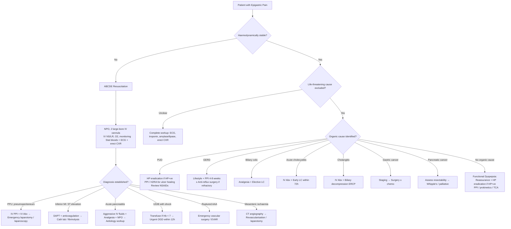
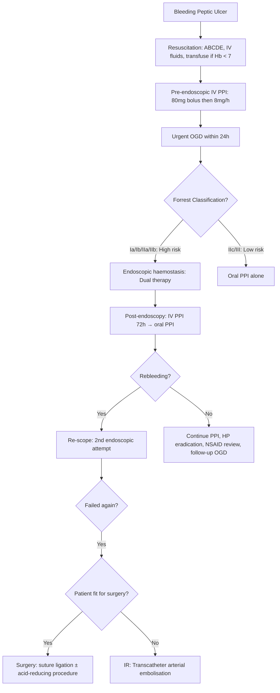

## Management of Epigastric Pain

The management of epigastric pain is not a single pathway — it is **cause-directed**. Your first job is to **stabilise** the patient (if acutely unwell), then **diagnose** the underlying cause (covered in prior sections), and finally **treat** that cause specifically. Think of it as three phases:

1. **Immediate stabilisation** — ABCDE, resuscitation
2. **Cause-specific definitive management** — medical, endoscopic, or surgical
3. **Prevention of recurrence** — lifestyle, H. pylori eradication, medication review

---

## Master Management Algorithm

---

## Phase 1: Immediate Stabilisation (Acute Presentations)

### ABCDE Approach

Any patient presenting with acute severe epigastric pain needs the **ABCDE** approach before any specific treatment [23][24]:

| Step | Action | Why |
|---|---|---|
| **A — Airway** | Secure airway; consider cuffed ETT + NGT if massive haematemesis or impaired consciousness | Massive UGIB → aspiration risk; peritonitis → septic shock → reduced GCS |
| **B — Breathing** | High-flow O₂; monitor SpO₂; assess for respiratory distress | Pancreatitis → ARDS / pleural effusion; peritonitis → splinting → shallow breathing |
| **C — Circulation** | ***NPO, 2 large-bore IV cannulae (16G); IV NS 2L fast rate to maintain BP/pulse + urine output; blood transfusion if Hb < 7 or massive haemorrhage; withhold anticoagulants/antiplatelets (balance thrombotic risk)*** [23] | Hypovolaemic shock from UGIB, pancreatitis (third-spacing), or AAA rupture |
| **D — Disability** | GCS, glucose, pupils | DKA can cause epigastric pain; altered consciousness in Reynolds' pentad (cholangitis) |
| **E — Exposure** | Full abdominal examination, PR exam | Look for peritonism, Cullen's/Grey Turner's signs, hernia |

### Pre-Endoscopy Management for UGIB

When epigastric pain is accompanied by haematemesis/melaena [23][24]:

- **Bloods**: CBC (baseline Hb), clotting, cross-match, LRFT, VBG (acidosis)
- **RFT**: elevated urea:creatinine ratio ( > 100:1) — because Hb digestion in the gut generates urea + reduced renal perfusion from hypovolaemia [23]
- ***Pre-endoscopic PPI: IV esomeprazole 80 mg stat → 8 mg/h infusion until OGD*** (only if early endoscopy cannot be arranged; raising gastric pH stabilises clots) [23]
- **Risk stratification**:

| Score | Components | Use |
|---|---|---|
| ***Glasgow-Blatchford Score (GBS)*** | ***Clinical + Lab (endoscopic results NOT required)*** | ***Predicts need for endoscopy; GBS = 0 can be safely discharged*** [23] |
| ***Rockall Score*** | ***Clinical (Age, BP, Comorbidities) + Endoscopy (Diagnosis, Evidence of bleeding)*** | ***Predicts rebleeding and mortality*** [23] |
| ***AIMS65*** | ***Albumin < 30, INR > 1.5, altered Mental status, Systolic BP ≤ 90, age > 65*** | ***Predicts in-patient mortality*** [24] |

---

## Phase 2: Cause-Specific Management

### A. Peptic Ulcer Disease (PUD)

PUD management has three pillars: **eradicate the cause**, **heal the ulcer**, and **prevent recurrence**.

#### 1. H. pylori Eradication

If H. pylori is detected, eradication is mandatory — it cures the ulcer in the vast majority and prevents recurrence [1][2][25]:

| Regimen | Components | Duration | Notes |
|---|---|---|---|
| ***Standard triple therapy*** | ***PPI (bd) + Amoxicillin 1g bd + Clarithromycin 500 mg bd*** | ***7–14 days*** | ***First-line in areas with clarithromycin resistance < 15%*** [25] |
| ***Bismuth quadruple therapy*** | ***PPI (bd) + Bismuth subsalicylate + Metronidazole + Tetracycline*** | ***10–14 days*** | ***First-line if clarithromycin resistance ≥ 15% or previous macrolide exposure*** |
| **Concomitant therapy** | PPI (bd) + Amoxicillin + Clarithromycin + Metronidazole (all bd) | 14 days | Alternative first-line; higher eradication rates than sequential |

**Post-treatment testing**: Confirm eradication with **non-invasive tests** (UBT or stool antigen) ≥ 4 weeks after completing all drugs. ***Do NOT use serology (positive for life)***. Stop PPI ≥ 2 weeks before testing [25].

***Causes of failure of triple therapy*** [25]:
- ***Poor compliance***
- ***Inappropriate dose and duration***
- ***Smoking: nicotine can ↓ efficacy of antibiotics***
- ***True antibiotic resistance***

If first-line fails → switch to alternative regimen or guide treatment by **sensitivity studies**.

#### 2. Acid Suppression (Ulcer Healing)

| Drug Class | Mechanism | Indications | Key Points |
|---|---|---|---|
| ***Proton pump inhibitors (PPI)*** | Irreversibly inhibit H⁺/K⁺-ATPase (proton pump) on parietal cell apical membrane → blocks the final common pathway of acid secretion | ***Full-dose PPI × 4–8 weeks for non-HP non-NSAID PUD; × 8 weeks for NSAID PUD*** [2][25] | ***All PPIs except dexlansoprazole should be taken 30 min–1 hour before meals*** for maximal efficacy (pump must be active to be inhibited) [1]. Examples: omeprazole, esomeprazole, lansoprazole, pantoprazole, rabeprazole |
| **H₂-receptor antagonists (H₂RA)** | Competitively block histamine H₂ receptors on parietal cells → ↓ basal and stimulated acid secretion | Alternative if PPI intolerant; second-line | ***Regular use leads to tolerance and loss of therapeutic effect → use intermittently*** [1]. Examples: famotidine, ranitidine (withdrawn in many markets due to NDMA concerns) |
| **Antacids** | Directly neutralise gastric acid (Al(OH)₃, Mg(OH)₂, CaCO₃) | Symptomatic relief only | Do NOT heal ulcers; provide rapid but short-lived relief |
| **Sucralfate** | Forms a viscous gel that binds to the ulcer base → physical barrier protecting from acid and pepsin | Adjunctive in stress ulcer prophylaxis | Must be taken on empty stomach; can impair absorption of other drugs |
| **Misoprostol** | PGE₁ analogue → replaces the prostaglandins inhibited by NSAIDs → restores mucosal defence | ***Co-therapy for NSAID gastroprotection*** [25] | Side effects: diarrhoea, abdominal cramps; **contraindicated in pregnancy** (uterotonic → can induce abortion) |

<Callout title="Why PPI Before Meals?">
PPIs are **prodrugs** that require an acidic environment for activation. They are absorbed in the small intestine, circulate to the parietal cell, and are trapped in the secretory canaliculus (pH ~1) where they are activated. But the proton pump must be **actively secreting** acid for the PPI to bind and inhibit it. Eating stimulates acid secretion → pumps are active → PPI works best. Taking PPI 30–60 minutes before a meal ensures peak plasma levels coincide with maximal pump activity.
</Callout>

#### 3. NSAID-Related Ulcer Management [1][25]

- ***Switch to less ulcerogenic NSAIDs or COX-2 selective inhibitors*** (e.g., celecoxib)
- ***Withdraw NSAIDs during PPI treatment*** if possible
- ***Bleeding peptic ulcer in aspirin users: resume aspirin with PPI once haemostasis is secured*** — to minimise cardiovascular risk (delaying aspirin restart ↑ CV events without significantly reducing rebleeding) [1]
- ***Non-bleeding peptic ulcer in aspirin users: continue aspirin with PPI*** [1]
- ***Prevention in high-risk NSAID users*** [25]:
  - Review indications for NSAIDs
  - Prior HP testing ± eradication before starting long-term NSAIDs
  - ***Co-therapy with PPI, H₂RA, or misoprostol (PG analogue)***

#### 4. Follow-Up Endoscopy [1]

- ***Gastric ulcer: follow-up OGD necessary until complete healing confirmed*** (to avoid missing concomitant gastric cancer due to sampling error; repeat biopsy at 6–8 weeks)
- ***Uncomplicated duodenal ulcer: follow-up OGD unnecessary if asymptomatic*** (majority benign)
- ***Complicated duodenal ulcer: follow-up until healing confirmed***
- ***Non-healing gastric ulcer after 12 weeks of medical therapy → elective surgery*** even if biopsy is benign (non-healing indicates risk of malignancy) [1]

#### 5. Surgical Management of PUD [1][10]

***Indications for surgery*** [1][10]:
- ***Complicated PUD*** (haemorrhage, perforation, GOO)
- ***Refractory to medical treatment*** (exclude ZES before elective surgery)
- ***Suspicious of malignancy*** (non-healing GU > 3 months)

| Ulcer Type | Surgical Options | Rationale |
|---|---|---|
| ***DU (acid reduction)*** | ***Highly selective vagotomy (nerve of Latarjet preserved); Truncal vagotomy + drainage (pyloroplasty / gastrojejunostomy); Antrectomy + Billroth II / Roux-en-Y*** [10] | DU is acid-driven → reduce acid secretion by dividing vagal supply to parietal cells (vagotomy) or removing gastrin-producing antrum (antrectomy) |
| ***GU Type I*** | ***Distal gastrectomy + Billroth II*** | Type I is on lesser curvature, normal/low acid → remove ulcer to exclude malignancy |
| ***GU Type II/III*** | ***Truncal vagotomy + antrectomy + Billroth II*** | Type II/III have high acid → need acid reduction + ulcer excision |
| ***GU Type IV*** | ***Subtotal gastrectomy extending to ulcer + Billroth I/II/Roux-en-Y*** | High lesser curvature → technically difficult, needs wider resection |

### B. Management of PUD Complications

#### Bleeding (Haemorrhage) [1][10][23][24]

This is the **leading cause of death** in PUD (5–15% mortality).

**Step-wise approach**:

***Endoscopic treatment modalities*** — usually **dual therapy** (adrenaline injection + one other modality) [1][24]:

| Modality | Mechanism | Key Points |
|---|---|---|
| ***Chemical: Adrenaline injection*** | ***Volume effect (tamponade) + vasoconstriction + platelet aggregation*** | ***Should NOT be used as monotherapy — high rate of rebleeding after absorption (~1h)*** [1][24] |
| ***Thermal: Heater probe / bipolar cautery*** | Coaptive coagulation — compress vessel walls together + seal with heat | Risk of perforation (immediate or delayed) |
| ***Mechanical: Haemoclips*** | Physically clamp the bleeding vessel | Useful for large visible vessels |
| ***Haemospray (TC-325)*** | Nanopowder with large surface area → induces mechanical haemostasis | Usually when other modalities fail; good for diffuse oozing |
| **Argon plasma coagulation** | Non-contact thermal → lower energy depth → lower perforation risk | Useful for diffuse superficial oozing (gastritis, angiodysplasia) [24] |

***Post-endoscopy*** [24]:
- ***IV PPI × 72h to ↑ pH for clot stabilisation*** (for Forrest IIa and above, or adherent clot resistant to vigorous irrigation)
- Close monitoring for rebleeding (3–10%): keep inpatient ≥ 3 days
- Signs of rebleeding: ***↑ pulse rate, haematemesis, fresh blood from NGT, fresh melaena, sudden ↓ Hb***

***Transcatheter arterial embolisation (TAE)*** [1][10]:
- Angiography of coeliac trunk and SMA → identify contrast extravasation → selective coiling of bleeding vessel
- ***Equally effective as surgery for failed endoscopic haemostasis*** with fewer complications
- Consider when patient is **high-risk for surgery**
- ***Reduces need for surgery without increasing mortality***

***Surgical treatment*** [10][24]:
- ***DU: suture ligation of bleeding vessel (usually GDA) → ± partial gastrectomy or vagotomy + pyloroplasty***
- ***GU: partial gastrectomy (risk of malignant ulcer → need histology)***

#### Perforation [3]

***Perforated peptic ulcer (PPU)*** is a surgical emergency:

- **Initial management**: NPO, IV PPI (high-dose), IV broad-spectrum antibiotics (cover gut flora — e.g., co-amoxiclav or cefuroxime + metronidazole), IV fluids, NG decompression, urinary catheter
- **Definitive**: Emergency **laparoscopic or open omental patch repair** (Graham patch) — suturing a pedicled omental flap over the perforation
- Post-operatively: H. pylori eradication, review NSAIDs, PPI therapy

***Boey score*** (prognostic for PPU mortality) [10]:

| Risk Factor | Points |
|---|---|
| ***Time from perforation to admission > 24 hours*** | ***1*** |
| ***Pre-operative systolic BP < 100 mmHg*** | ***1*** |
| ***Any systemic illness (heart disease, liver disease, renal disease, DM)*** | ***1*** |
| ***Mortality: Score 0 = 0%, 1 = 10%, 2 = 45.5%, 3 = 100%*** | |

#### Gastric Outlet Obstruction (GOO) [1][10]

- ***Malignant until proven otherwise*** (80% malignant, 20% benign)
- **Initial**: NPO, NG decompression, IV fluids (correct metabolic alkalosis from vomiting — hypokalaemic, hypochloraemic), IV PPI
- **Definitive**: depends on underlying cause:
  - **Medical**: PPI, H. pylori eradication (if PUD-related)
  - **Endoscopic balloon dilatation** ± **duodenal stenting** (palliative for malignant GOO)
  - ***Surgical: bypass (gastrojejunostomy), pyloroplasty + gastroduodenostomy*** [10]

### C. GERD Management [1][4][25]

#### Stepwise Approach

| Step | Treatment | Details |
|---|---|---|
| **1. Lifestyle modification** | Weight loss, smoking cessation, reduce alcohol, elevate head of bed, avoid late meals ( < 2–3h before bed), avoid precipitants (chocolate, coffee, fatty food, spicy food) [1] | Reducing intra-abdominal pressure (weight loss) and decreasing LES relaxation (avoiding triggers) reduces reflux |
| **2. Medical therapy** | ***Full-dose PPI × 4–8 weeks for healing of oesophagitis*** [25] | PPI only changes acidic reflux into non-acidic reflux → relieves heartburn and oesophagitis but ***regurgitation often remains uncorrected*** since reflux mechanism is unaffected [1] |
| **3. Maintenance** | ***Lowest dose PPI if symptoms recur; offer H₂RA if inadequate PPI response*** [25] | |
| **4. Severe oesophagitis** | ***Full-dose PPI × 8 weeks or long-term; double-dose PPI or switch PPI if failed*** [25] | |

#### Anti-Reflux Surgery [10][26]

***Indications*** [10][26]:
- ***Young and fit PPI-dependent patients*** (to avoid lifelong PPI)
- ***GERD / complications unresponsive to medical treatment*** (very rare — consider alternative diagnosis)

***Contraindications***: ***Aperistalsis → risk of dysphagia*** [26]

***Laparoscopic fundoplication*** [26]:
- ***Goal: close the hiatal defect, restore LES pressure and angle of His, lengthen intra-abdominal oesophagus***
- ***Types***:
  - ***Total (Nissen): 360° wrap → more durable but more dysphagia***
  - ***Partial (Toupet — posterior 270°; Dor/Watson — anterior 90–180°): preferred in Chinese — less dysphagia***
- ***Specific complications***:
  - ***Gas bloat syndrome (90% esp in Nissen)***: inability to burp or vomit, flatus; self-limiting in 4 weeks — because the tight wrap prevents air escape from the stomach
  - ***Too tight → dysphagia (50% early, 10% long-term)*** → Ix: water-soluble contrast swallow; Tx: endoscopic bougie/balloon dilatation or revision
  - ***Too loose → recurrence of reflux***
  - ***Slipped Nissen***: wrap slides down, GEJ retracts into chest
- ***Efficacy: PPI independence rate ~60%***

***Pre-operative workup*** [26]: oesophageal manometry (to exclude aperistalsis), 24h ambulatory pH monitoring, OGD with biopsy

### D. Acute Pancreatitis Management [1][9][16][27]

Management is primarily **supportive** — there is no specific drug that "treats" pancreatitis. The focus is on:
1. Aggressive IV fluid resuscitation
2. Pain control
3. Nutritional support
4. Aetiology-directed treatment
5. Management of complications

#### Supportive Management

| Component | Details | Rationale |
|---|---|---|
| ***Aggressive IV fluids*** | ***5–10 mL/kg/h isotonic crystalloids (Lactated Ringer's may be superior to NS in reducing SIRS); adjust according to clinical assessment, Hct, and urea*** [1][16][27] | Pancreatitis causes massive third-space fluid loss → hypovolaemia → end-organ ischaemia; aggressive early resuscitation ↓ pancreatic necrosis. ***Aim for urine output 0.5–1.0 mL/kg/h*** [1] |
| ***Analgesia*** | ***Opioids preferred: fentanyl, hydromorphone, tramadol, pethidine; morphine should be AVOIDED*** [1][27] | ***Morphine can cause sphincter of Oddi spasm*** → theoretically worsens ductal hypertension (though evidence is debated, it remains standard teaching to avoid it). ***NSAIDs NOT preferred: can worsen pancreatitis and cause renal failure*** [27] |
| **O₂ supplementation** | Pulse oximetry and ABG monitoring | Pancreatitis → SIRS → ARDS; diaphragmatic inflammation → pleural effusion → hypoxia |
| **Electrolyte correction** | Correct hypocalcaemia (tetany from fat saponification), hypokalaemia, hyperglycaemia | Metabolic derangements common; hypocalcaemia is prognostic |
| ***NPO + NG suction*** | ***NPO only if nausea/vomiting; NG suction if ileus or protracted vomiting*** [1] | |
| **Monitoring** | HDU care if severe; serial vitals, electrolytes, glucose, ABG | |
| **Stress ulcer prophylaxis** | PPI | Critically ill patients at risk of stress ulceration |

#### Nutritional Support [1][27]

This is a critical concept — the old dogma of "resting the pancreas" by prolonged NPO is **WRONG**.

- ***Early enteral feeding ( < 48–72h) is preferred*** → ***associated with ↓ mortality, ↓ organ failure, ↓ infection, ↓ surgical intervention*** [27]
- ***Nasogastric or nasojejunal feeding are both safe and effective*** [1]
- ***Oral feeding can be initiated early (≤ 24h) if no ileus, N/V in mild cases*** [27]
- ***Parenteral nutrition should only be considered if enteral route is not available, not tolerated, or caloric requirements cannot be met*** [1]

#### Antibiotics [1][27]

- ***Prophylactic antibiotics are generally NOT recommended*** [1][27]
- ***May be considered in pancreatic necrosis > 30% involvement by CT***
- ***Therapeutic antibiotics for infected necrosis***: ***imipenem or meropenem*** to target enteric organisms; alternatives: fluoroquinolones + metronidazole [1]
- ***In HK: routine antibiotics are generally given due to ↑ proportion of biliary pancreatitis*** — usually amoxicillin for interstitial pancreatitis (cover cholangitis) and imipenem for necrosis [27]

#### ERCP for Biliary Pancreatitis [1][9][27]

***Indications for ERCP*** [1][27]:
- ***Patients with jaundice, acute cholangitis, or evidence of persistent CBD stones***
  - ***Arrange within 24–72 hours after admission*** for endoscopic sphincterotomy and stone extraction
- Patients with no identifiable cause (to rule out CBD stones, strictures, neoplasms)

***Contraindications***: altered GI anatomy (e.g., Billroth II, Roux-en-Y) — relative; may need percutaneous approach [28]

***Alternative if ERCP not feasible***: ***Percutaneous transhepatic biliary drainage (PTBD)*** [1]

#### Cholecystectomy for Gallstone Pancreatitis [1]

- ***Cholecystectomy should be performed after recovery in ALL patients with gallstone pancreatitis*** [1]
- ***Mild pancreatitis: cholecystectomy during same index hospitalisation (within 1 week of recovery)***
- ***Severe necrotising pancreatitis: delay cholecystectomy until inflammation subsides and collections resolve (interval cholecystectomy)***
- Intraoperative cholangiography to rule out persistent choledocholithiasis
- If clinical suspicion of CBD stone is ***high → ERCP first***; ***moderate → MRCP/EUS then cholecystectomy***; ***low → cholecystectomy with IOC*** [1]

#### Management of Pancreatitis Complications [27]

| Complication | Management |
|---|---|
| ***Acute peripancreatic fluid collection*** | ***None needed — majority resolves spontaneously*** [27] |
| ***Acute necrotic collection (sterile)*** | ***Conservative management for ≥ 4 weeks*** (necrotic tissue is poorly demarcated early on → early debridement is incomplete and harmful) [27] |
| ***Infected necrosis*** | ***Empirical antibiotics → percutaneous/endoscopic drainage → surgical necrosectomy if failed (step-up approach)***; leading cause of morbidity/mortality; usually occurs > 10 days post-onset [27] |
| ***Pseudocyst (walled-off collection)*** | Observe if asymptomatic; drain if symptomatic/infected/causing organ dysfunction; endoscopic (EUS-guided), percutaneous, or surgical drainage |
| ***Pseudoaneurysm*** | ***Endoscopic drainage absolutely contraindicated*** → angiographic embolisation or surgical resection [27] |
| ***Abdominal compartment syndrome*** | IAP > 20 mmHg + new organ failure → surgical decompression [27] |

### E. Acute Cholecystitis Management [19]

***Definitive treatment: Early laparoscopic cholecystectomy (LC) — ideally within 72 hours*** of symptom onset. This is supported by current guidelines because:
- Early LC has comparable morbidity to delayed LC
- ↓ Overall hospital stay
- ↓ Risk of recurrent attacks while waiting for interval surgery

| Severity (TG13) | Management |
|---|---|
| **Grade I (Mild)** | IV antibiotics + early LC (within 72h) |
| **Grade II (Moderate)** | IV antibiotics + early LC if safe; percutaneous cholecystostomy (drainage) if high surgical risk |
| **Grade III (Severe)** | Organ support + IV antibiotics + percutaneous cholecystostomy for drainage → interval LC when stable |

### F. Acute Cholangitis Management [28]

***First-line approach: Endoscopic retrograde cholangiopancreatography (ERCP) ± biliary stenting*** [28]

- IV broad-spectrum antibiotics (cover Gram-negatives: e.g., piperacillin-tazobactam, or ceftriaxone + metronidazole)
- ***ERCP for biliary decompression***: sphincterotomy + stone extraction + stenting
- ***Potential complications of ERCP: perforation, bleeding from papillotomy, pancreatitis*** [28]
- ***Relative contraindications for ERCP: altered GI anatomy e.g., Billroth II gastrectomy, Roux-en-Y*** [28]
- If ERCP not feasible: ***PTBD*** (percutaneous transhepatic biliary drainage) or surgical exploration of CBD

- **Prevent recurrence**: elective LC after recovery

### G. Functional Dyspepsia Management [2][25]

| Step | Treatment | Rationale |
|---|---|---|
| **1. Reassurance** | Explain that no serious organic disease has been found | Reduces anxiety, which itself perpetuates symptoms |
| **2. Dietary changes** | ***Avoid known precipitants, low-fat diet, ↓ FODMAPs, ↓ lactose*** [2] | Dietary triggers exacerbate gastric dysmotility and visceral hypersensitivity |
| **3. HP eradication** | ***If HP +ve: eradication therapy → offers symptomatic benefit in a small subgroup*** [2] | NNT ~14 — modest benefit, but worthwhile as HP is a modifiable factor |
| **4. Empirical PPI** | ***Low-dose PPI or H₂RA × 4 weeks if symptoms persist after HP excluded*** [25] | ***Effective in Western populations but effect not clearly demonstrated in Asians; effective in ulcer-like/reflux-like but NOT in dysmotility-like FD*** [2] |
| **5. Prokinetics** | ***Metoclopramide for refractory cases*** | Enhances gastric emptying → helps postprandial distress symptoms. Side effects: extrapyramidal (dopamine antagonist) |
| **6. Neuromodulators** | ***TCAs (e.g., amitriptyline) and SSRIs (e.g., escitalopram)*** [2] | Modulate visceral hypersensitivity via central and peripheral mechanisms; TCAs also have anticholinergic effects that may ↓ gastric motility (paradoxical) — use at low doses |
| **7. Others** | ***Simeticone (Mylicon)***: anti-foaming agent for belching symptoms [2] | Commonly used in GOPC; reduces gas bubble surface tension |

> **High Yield:** ***Reinvestigate by OGD if symptoms persist despite multiple treatments*** — do not keep treating empirically indefinitely [2].

### H. Gastric Cancer Management [5][6]

| Stage | Approach |
|---|---|
| ***Early gastric cancer (T1N0)*** | ***Endoscopic mucosal resection (EMR) or endoscopic submucosal dissection (ESD); HP eradication; > 90% 5-year survival*** [5] |
| ***Resectable invasive CA*** | ***Gastrectomy (distal/subtotal/total depending on site) + D2 lymphadenectomy + perioperative chemotherapy*** |
| **Unresectable / metastatic** | ***Palliative chemotherapy ± targeted therapy (trastuzumab if HER2+ve); local palliation for GOO (stenting / bypass), bleeding (radiotherapy / endoscopic)*** |

***Criteria for unresectability*** [5]:
- ***Distant metastasis***
- ***Invasion of major vascular structures (aorta)***
- ***Encasement/occlusion of coeliac axis, proximal splenic artery, or hepatic artery*** (distal splenic artery involvement is NOT a contraindication)

### I. Pancreatic Cancer Management [7][8]

***Assess resectability*** — this is the central decision point [7][8]:

| Category | Management |
|---|---|
| ***Resectable (no vascular involvement)*** | ***Surgery: Whipple's procedure (pancreaticoduodenectomy) for head tumours; distal pancreatectomy + splenectomy for body/tail; ± adjuvant chemotherapy*** |
| ***Borderline resectable*** | ***Neoadjuvant chemotherapy ± chemoradiation → reassess → surgery if responds*** |
| ***Unresectable / locally advanced*** | ***Palliative chemotherapy (FOLFIRINOX or gemcitabine + nab-paclitaxel); biliary stenting for jaundice; coeliac plexus block for pain*** |
| ***Metastatic*** | ***Palliative chemotherapy; best supportive care*** |

***Vascular encasement*** by ***SMA, hepatic artery, coeliac trunk, SMV, or portal vein*** determines resectability on CT pancreas protocol [7][8].

### J. Biliary Colic Management [9]

- ***Acute: NPO, analgesia (NSAIDs preferred — e.g., diclofenac IM; opioids if severe), antiemetics*** [9]
- ***Definitive: Elective laparoscopic cholecystectomy*** — to ↓ risk of future complications (cholecystitis, cholangitis, pancreatitis) [9]

---

## NICE Guidelines Summary Table for Medical Therapy [25]

| Condition | Treatment Protocol |
|---|---|
| ***Uninvestigated dyspepsia*** | ***HP testing and eradication (test-and-treat); empirical full-dose PPI × 4 weeks; offer H₂RA if inadequate PPI response*** |
| ***Functional dyspepsia*** | ***HP eradication if HP+ve; low-dose PPI or H₂RA × 4 weeks if symptoms persist after HP excluded; lowest dose PPI/H₂RA if symptoms recur*** |
| ***Peptic ulcer disease*** | ***HP eradication if HP+ve; full-dose PPI or H₂RA × 4–8 weeks for non-HP non-NSAID PUD; × 8 weeks for NSAID PUD*** |
| ***GERD*** | ***Full-dose PPI × 4–8 weeks for oesophagitis; × 8 weeks or long-term for severe oesophagitis; lowest-dose PPI for recurrent symptoms; H₂RA if PPI inadequate*** |

---

<Callout title="High Yield Summary">

1. **Management of epigastric pain is cause-directed** — stabilise first (ABCDE), diagnose (Ix), then treat the specific cause.

2. ***PUD: eradicate H. pylori (triple therapy 7–14 days) + PPI for ulcer healing (4–8 weeks) + review NSAIDs.***

3. ***Bleeding PUD: IV PPI 80 mg bolus + 8 mg/h infusion → urgent OGD → endoscopic haemostasis (dual therapy: adrenaline + heater probe/clip) for Forrest Ia–IIb → IV PPI 72h post-endoscopy.*** Adrenaline alone is NOT sufficient.

4. ***Failed endoscopic haemostasis → TAE (if unfit) or surgery (suture ligation ± acid-reducing procedure for DU; partial gastrectomy for GU).***

5. ***PPU: emergency omental patch repair + IV PPI + IV antibiotics + HP eradication.*** Boey score predicts mortality.

6. ***GERD: lifestyle + PPI 4–8 weeks → lowest maintenance dose → fundoplication if PPI-dependent/refractory.*** Nissen (360°) is more durable but more dysphagia; partial wraps preferred in Chinese.

7. ***Acute pancreatitis: aggressive IV fluids (LR 5–10 mL/kg/h) + opioid analgesia (NOT morphine) + early enteral feeding ( < 48–72h) + ERCP within 24–72h if biliary cause with cholangitis/CBD stones.*** Prophylactic antibiotics NOT routinely recommended.

8. ***Cholecystectomy for ALL gallstone pancreatitis patients*** — during same admission if mild, interval if severe.

9. ***Acute cholecystitis: early LC within 72h + IV antibiotics.*** Percutaneous cholecystostomy if too sick for surgery.

10. ***Cholangitis: IV antibiotics + ERCP for biliary decompression.*** ERCP complications: perforation, bleeding, pancreatitis.

11. ***Functional dyspepsia: reassurance → dietary changes → HP eradication if +ve → low-dose PPI → prokinetics/TCA if refractory → reinvestigate by OGD if persistent.***

12. ***Gastric cancer: EMR/ESD for T1N0; gastrectomy + D2 LN dissection + perioperative chemo for resectable; palliative chemo ± targeted therapy for unresectable.***

13. ***Pancreatic cancer: Whipple's for resectable head tumours; assess vascular encasement (SMA, hepatic artery, coeliac trunk, SMV, PV) for resectability; neoadjuvant chemo for borderline; palliative chemo + stenting for unresectable.***

</Callout>

---

<ActiveRecallQuiz
  title="Active Recall - Management of Epigastric Pain"
  items={[
    {
      question: "A patient presents with a bleeding duodenal ulcer (Forrest Ia). Outline the step-by-step management from presentation to definitive treatment.",
      markscheme: "1) ABCDE resuscitation: NPO, 2 large-bore IV, IV fluids, transfuse if Hb < 7. 2) Pre-endoscopic IV PPI: esomeprazole 80mg bolus then 8mg/h infusion. 3) Urgent OGD within 12-24h. 4) Endoscopic dual therapy: adrenaline injection + heater probe or haemoclip (adrenaline alone is insufficient). 5) Post-endoscopy: IV PPI 72h then switch to oral PPI. 6) HP eradication if HP+ve. 7) Review NSAIDs. 8) If rebleeding: re-scope for 2nd attempt; if fails again: TAE (if unfit for surgery) or surgical suture ligation of GDA +/- vagotomy + pyloroplasty.",
    },
    {
      question: "Why should morphine be avoided in acute pancreatitis? What analgesics are preferred?",
      markscheme: "Morphine causes sphincter of Oddi spasm, which theoretically worsens pancreatic ductal hypertension and may exacerbate pancreatitis. Preferred analgesics are other opioids: fentanyl, hydromorphone, tramadol, or pethidine. NSAIDs are also not preferred as they can worsen pancreatitis and cause renal failure in the context of hypovolaemia.",
    },
    {
      question: "State the NICE guideline treatment protocols for: uninvestigated dyspepsia, functional dyspepsia, PUD, and GERD.",
      markscheme: "Uninvestigated dyspepsia: HP test-and-treat; empirical full-dose PPI x4w; H2RA if PPI inadequate. Functional dyspepsia: HP eradication if +ve; low-dose PPI or H2RA x4w if HP excluded; lowest dose if recurs. PUD: HP eradication if +ve; full-dose PPI x4-8w (non-HP non-NSAID) or x8w (NSAID PUD). GERD: Full-dose PPI x4-8w for oesophagitis; x8w or long-term for severe; lowest dose for recurrent; H2RA if PPI inadequate.",
    },
    {
      question: "A patient with gallstone pancreatitis has concurrent cholangitis. When should ERCP be performed, and when should cholecystectomy be done?",
      markscheme: "ERCP should be performed within 24-72 hours of admission for sphincterotomy and stone extraction (urgent biliary decompression for cholangitis). Cholecystectomy: if mild pancreatitis, perform during same index hospitalisation after recovery (within 1 week). If severe necrotising pancreatitis, delay cholecystectomy until inflammation subsides and collections resolve (interval cholecystectomy). All gallstone pancreatitis patients need cholecystectomy to prevent recurrence.",
    },
    {
      question: "Compare Nissen and partial fundoplication for GERD. Which is preferred in Chinese patients and why?",
      markscheme: "Nissen: 360-degree total wrap; more durable anti-reflux effect but higher rate of dysphagia and gas bloat syndrome (inability to burp/vomit, flatus). Partial fundoplication (e.g., Toupet 270-degree posterior): less dysphagia, less gas bloat. Partial wraps are preferred in Chinese patients because of lower dysphagia rates. Gas bloat is self-limiting in ~4 weeks. Overall PPI independence rate is ~60% for both.",
    },
    {
      question: "What are the indications for surgery in PUD, and what are the specific surgical options for a Type I gastric ulcer versus a duodenal ulcer?",
      markscheme: "Indications: (1) complicated PUD (haemorrhage, perforation, GOO); (2) refractory to medical treatment (exclude ZES first); (3) suspicious of malignancy (non-healing GU > 3 months). Type I GU: distal gastrectomy + Billroth II (remove ulcer to exclude malignancy; Type I has normal/low acid so acid reduction not primary goal). DU: acid-reducing procedures — highly selective vagotomy, or truncal vagotomy + pyloroplasty/gastrojejunostomy, or antrectomy + Billroth II/Roux-en-Y (DU is acid-driven).",
    },
  ]}
/>

## References

[1] Senior notes: felixlai.md (PUD treatment, NSAID management, aspirin in bleeding ulcer, PUD complications, Acute pancreatitis treatment, Cholecystectomy for gallstone pancreatitis, GERD medical treatment)
[2] Senior notes: Ryan Ho GI.pdf (p54–55, Functional Dyspepsia management); Ryan Ho Fundamentals.pdf (p264–265)
[3] Senior notes: Ryan Ho Fundamentals.pdf (p268, Perforated peptic ulcer)
[4] Senior notes: Ryan Ho GI.pdf (p56–57, GERD pathophysiology and treatment)
[5] Senior notes: Ryan Ho GI.pdf (p86, Gastric cancer staging and management)
[6] Lecture slides: GC 212. Weight loss and vomiting gastric cancer; abdominal imaging.pdf
[7] Senior notes: maxim.md (Pancreatic carcinoma — Investigations, resectability)
[8] Lecture slides: WCS 056 - Painless jaundice and epigastric mass - by Prof R Poon.ppt (1).pdf
[9] Senior notes: maxim.md (Biliary colic, Acute pancreatitis — Investigation, diagnostic criteria, management)
[10] Senior notes: maxim.md (PUD surgical management, Boey score, GOO, PUD complications — haemorrhage)
[16] Senior notes: Ryan Ho GI.pdf (p340–346, Acute pancreatitis diagnosis, management, complications)
[19] Senior notes: Ryan Ho GI.pdf (p247–248, Acute cholecystitis — Tokyo guidelines, management)
[23] Senior notes: maxim.md (UGIB initial management, pre-endoscopy management, risk stratification)
[24] Senior notes: Ryan Ho Fundamentals.pdf (p255–257, Endoscopic Tx modalities, post-endoscopy management, surgery for bleeding ulcers)
[25] Senior notes: Ryan Ho GI.pdf (p55, p78–79, NICE guidelines, HP eradication, NSAID ulcer management); Ryan Ho Fundamentals.pdf (p265)
[26] Senior notes: maxim.md (GERD surgical treatment, fundoplication types and complications)
[27] Senior notes: Ryan Ho GI.pdf (p344–346, Pancreatitis supportive management, antibiotics, nutritional support, management of complications)
[28] Lecture slides: GC 200. RUQ pain, jaundice and fever Cholecytitis and cholangitis Imaging of GI system.pdf (p14, ERCP for cholangitis)
