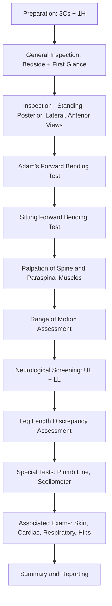

# Examination for Scoliosis

## Master Examination Sequence

---

## Preparation

### The 3Cs + 1H

Before you even look at the patient, get the housekeeping right — examiners mark this.

- **Consent**: "Hello, I am [Name], a medical student. I would like to examine your back today. May I have your permission?"
  - Cantonese: 「你好，我係醫學生[名]。我想檢查你嘅背脊，可以嗎？」
- **Curtains**: Draw curtains for privacy — especially important as the patient will be undressed to underwear.
- **Chaperone**: Offer a chaperone, particularly for adolescent patients. "Would you like someone else present during the examination?"
  - 「你想唔想有其他人陪你做檢查？」
- **Hand hygiene**: "I would like to wash my hands before we begin." State this aloud in the OSCE. [1]

### Positioning and Exposure

- **Position**: Patient standing, clothed **only in underpants/underwear** [1][2]. This is non-negotiable — you cannot assess scoliosis through a gown.
- **Exposure**: The entire back, shoulders, flanks, and lower limbs should be visible. Long hair should be tied up or held forward to expose the neck and upper thoracic region.
- **Ask about pain first**: "Before I begin, do you have any pain anywhere?" 「喺我開始之前，你有冇邊度痛？」 [1]

<Callout title="OSCE Pitfall: Inadequate Exposure" type="error">
A very common mistake is examining through a hospital gown. You will miss shoulder asymmetry, scapular prominence, and skin stigmata. The patient must be exposed to underwear only — state this clearly.
</Callout>

---

## General Inspection

Before touching the patient, take a step back and look.

### Bedside Clues
- **Walking aids**: Crutches, wheelchair (suggesting neuromuscular aetiology)
- **Braces**: A thoracolumbosacral orthosis (TLSO/Boston brace) at the bedside is a giveaway for **adolescent idiopathic scoliosis** under active treatment [3]
- **Medications**: NSAIDs, neuropathic pain medications
- **Body habitus**: Marfanoid features (tall, thin, long limbs, arachnodactyly) — Marfan syndrome is associated with scoliosis [4][5]

### First Glance
- **General appearance**: Age (adolescent vs adult), distress level, asymmetric posture
- **Obvious deformity**: Visible trunk shift, shoulder asymmetry, pelvic tilt
- **Skin**: Look for café-au-lait spots (***neurofibromatosis type 1***), midline skin defects such as hairy patches, dimples, or haemangiomas over the spine (***spinal dysraphism***) [3][6]
- **Gait**: Note any antalgic gait, Trendelenburg gait, or short-limb gait before formal examination [2]

**Model commentary**: *"On general inspection, the patient is a slim adolescent female standing comfortably. I note no walking aids or braces at the bedside. There are no obvious skin stigmata visible from this distance. I can see that the right shoulder appears higher than the left."*

---

## Systematic Examination Sequence

### 1. Inspection — Standing Position

This is the most critical part of the scoliosis examination. You must systematically view from three aspects.

#### A. Posterior View

Ask the patient to stand straight with feet together, arms relaxed at the sides. Stand behind the patient.

**What to assess:**

| Feature | How to Assess | Normal | Abnormal in Scoliosis | Why It Occurs |
|---|---|---|---|---|
| **Shoulder height** | Compare acromial levels | Symmetrical | One shoulder higher | Thoracic curve tilts shoulder girdle |
| **Scapular prominence** | Look for winging or asymmetry | Symmetrical, flat | One scapula more prominent/protruding | Rib rotation from vertebral rotation pushes scapula posteriorly |
| ***Waist creases / flank folds*** | Compare skin creases at waist | Symmetrical | Asymmetrical — deeper on concave side | Trunk shift from lateral curvature |
| **Trunk shift** | Drop a plumb line from C7 | Falls over gluteal cleft | Deviates laterally | Uncompensated curve shifts trunk |
| **Pelvic tilt** | Palpate bilateral iliac crests | Level | Unlevel | May be a cause (LLD) or effect of scoliosis |
| **Spine alignment** | Visual inspection of spinous processes | Straight vertical line | 'C'-shaped (simple) or 'S'-shaped (complex) curve [1][2] | The defining feature of scoliosis |
| ***Skin signs*** | Inspect entire back | No lesions | ***Café-au-lait spots*** (NF1), hairy patches, dimples (dysraphism) | Underlying syndromic or congenital aetiology [3][6] |

**Model commentary**: *"Looking from behind, I note the right shoulder is elevated compared to the left. The right scapula is more prominent. The waist creases are asymmetric — deeper on the left. There is a rightward trunk shift with the plumb line from C7 falling to the right of the gluteal cleft. I can see an 'S'-shaped curve of the spinous processes. I do not see café-au-lait spots or midline skin defects."*

#### B. Lateral View

Walk around to view the patient from the side. Assess both sides.

**What to assess:**
- ***Thoracic kyphosis***: Normally gentle; exaggerated kyphosis may be a **secondary compensatory curve** or suggest Scheuermann disease
- ***Lumbar lordosis***: Normally present; increased lordosis may compensate for thoracic hyperkyphosis or fixed hip flexion deformity
- **Sagittal balance**: The ear should align roughly over the greater trochanter. Forward sagittal imbalance suggests decompensation.
- **"Question mark" posture**: ↑thoracic kyphosis + ↓lumbar lordosis → think ankylosing spondylitis rather than idiopathic scoliosis [2]

**Model commentary**: *"From the lateral view, thoracic kyphosis appears mildly increased with preserved lumbar lordosis. Sagittal balance is maintained."*

#### C. Anterior View

Now face the patient from the front.

**What to assess:**
- **Chest wall symmetry**: Rib prominence anteriorly on the concave side
- **Breast asymmetry**: One breast may appear lower/smaller due to trunk rotation (be sensitive)
- **Sternum**: Any pectus excavatum or carinatum — associated with connective tissue disorders like Marfan syndrome [4]
- **Shoulder and clavicle height**: Confirm asymmetry noted posteriorly

---

### 2. Adam's Forward Bending Test (FBT)

This is **the** key special test for scoliosis — you will almost certainly be asked to perform or describe it. [1][2][3]

#### Technique
1. Ask the patient to stand with feet together, knees straight
2. Instruct: "Please bend forward slowly from the waist with your arms hanging loose, palms together, as if diving into a pool."
   - 「請你慢慢向前彎腰，雙臂自然放低，手掌合埋，好似跳水咁。」
3. Stand behind the patient and observe the back at **eye level** (kneel or crouch down as needed)
4. Observe the spine from both the head end (looking along the spine from cranial to caudal) and from behind

#### What to Look For

- **Rib hump**: Unilateral prominence of the posterior rib cage on the ***convex side*** of the curve
  - This is the hallmark of **structural scoliosis** — it is caused by ***vertebral rotation*** that rotates the attached ribs posteriorly on the convex side [3]
- **Lumbar prominence**: Paraspinal muscle fullness on one side in lumbar curves
- **Measure the angle of trunk rotation (ATR)** using a **scoliometer** (inclinometer) placed over the apex of the rib hump
  - ***ATR ≥ 5-7°*** is considered positive and warrants further investigation [3]
  - In Hong Kong school screening: ***ATR 5-14° → referred for Moiré topography***; ***ATR ≥ 15° → referred to Student Health Service Centre*** [3]

#### Normal vs Abnormal

| Finding | Interpretation |
|---|---|
| Symmetric back on FBT | No structural scoliosis |
| ***Rib hump present*** | ***Structural scoliosis — vertebral rotation present*** |
| Curve disappears on FBT | ***Non-structural (postural) scoliosis*** — the curve corrects with forward flexion because there is no fixed vertebral rotation |

#### Pathophysiology
In structural scoliosis, the vertebral bodies rotate toward the convexity. Because the ribs are attached to the vertebral bodies, the ribs on the convex side are pushed posteriorly, creating the rib hump. On the concave side, the ribs are pushed anteriorly. This 3D rotational deformity is the fundamental difference between structural and non-structural scoliosis. [3]

**Model commentary**: *"I am now performing Adam's forward bending test. I ask the patient to bend forward with palms together and knees straight. Looking from behind, I can see a prominent right-sided rib hump in the thoracic region, consistent with a right thoracic structural scoliosis. There is no lumbar prominence."*

<Callout title="Why the FBT matters" type="idea">
The rib hump on forward bending is pathognomonic for structural scoliosis. It tells you the vertebrae are actually rotating — this is not just a postural issue. If the "scoliosis" disappears on forward bending, it is non-structural and you should look for other causes like leg length discrepancy.
</Callout>

---

### 3. Sitting Forward Bending Test

#### Technique
- Ask the patient to sit on a stool (feet on the ground) and bend forward in the same manner as the standing FBT
- 「請你坐喺度，然後向前彎腰。」

#### Purpose
- **Eliminates leg length discrepancy (LLD)** as a cause of apparent scoliosis [3]
- When seated, the pelvis is level regardless of leg lengths
- If the curve **persists** when sitting → structural scoliosis
- If the curve **disappears** when sitting → likely non-structural scoliosis secondary to LLD

**Model commentary**: *"To distinguish structural from non-structural scoliosis, I now perform the forward bending test in the sitting position. The rib hump persists, confirming this is a structural scoliosis and not secondary to leg length discrepancy."*

---

### 4. Palpation

#### Spinous Processes
- **Technique**: Start at C7 (the first palpable spinous process — the *vertebra prominens*) and trace each spinous process downward to the sacrum [1][2]
- **What to feel for**:
  - ***Deviation of spinous processes from the midline*** → confirms scoliosis [1][2]
  - **Tenderness** → red flag; idiopathic scoliosis is typically painless. Tenderness suggests infection, tumour, or fracture
  - **Step deformities** → spondylolisthesis

**Model commentary**: *"I am palpating each spinous process from C7 downwards. I note deviation of the spinous processes to the left in the thoracic region. There is no midline tenderness."*

#### Percussion
- **Gently tap along the spine with a closed fist** [1][2]
- Purpose: Elicit bony tenderness which may indicate pathological scoliosis (infection, tumour, osteoporotic fracture)
- Normal: No tenderness
- 「我輕輕拍一下你嘅背脊，如果痛就話我知。」

#### Paraspinal Muscles
- **Palpate the paraspinal muscles bilaterally** [1][2]
- Feel for:
  - **Spasm or contracture** → may indicate underlying pain or neuromuscular cause
  - **Asymmetric bulk** → longstanding curves cause hypertrophy on the concave side
  - **Tenderness**

#### Sacroiliac Joint
- Palpate the SIJ area for tenderness (relevant if considering ankylosing spondylitis as a differential in an adult) [1][2]

---

### 5. Range of Motion Assessment

While ROM is less central to scoliosis than to ankylosing spondylitis, it provides important information about curve flexibility and associated conditions.

| Movement | Instruction (English) | Instruction (Cantonese) | What to Note |
|---|---|---|---|
| **Flexion (L-spine)** | "Bend forward and try to touch the floor" | 「向前彎腰，試下掂地下」 | Measure finger-to-floor distance; observe for asymmetric paravertebral fullness [1] |
| **Extension (L-spine)** | "Lean backwards" | 「向後攣」 | Pain on extension may suggest facet joint pathology |
| **Lateral bending (L-spine)** | "Slide your hand down the side of your leg toward your knee" | 「將手沿住大腿側邊向膝頭方向滑」 | Asymmetric lateral bending is common in scoliosis — restricted toward the concavity [1] |
| **Rotation (T-spine)** | Sit to fix pelvis: "Turn your body to look behind you" | 「坐定唔好郁下半身，轉身望後面」 | Rotation is the main T-spine movement; restricted in structural thoracic scoliosis [1] |
| **C-spine movements** | Flexion, extension, rotation, lateral bending | As appropriate | Assess if cervicothoracic involvement suspected |

**Model commentary**: *"I now assess range of motion. The patient can bend forward with a finger-to-floor distance of 10cm. Lateral bending is slightly reduced to the right compared to the left. Thoracic rotation appears symmetric."*

---

### 6. Neurological Screening

***Idiopathic scoliosis should have a normal neurological examination.*** Any neurological deficit is a red flag suggesting a non-idiopathic cause (e.g. syringomyelia, spinal cord tumour, tethered cord, neuromuscular disease) [3].

#### Upper Limbs
- **Motor**: Inspection for wasting, power (grip, wrist extension, finger abduction)
- **Reflexes**: Biceps (C5/6), triceps (C7), supinator (C5/6)
- **Sensation**: Light touch and pinprick in dermatomal distribution
- **Myelopathic signs**: Hoffmann sign, finger escape test, ten-second test (if cervicothoracic curve or concern for cord compression) [1]

#### Lower Limbs
- **Motor**: Hip flexion (L1/2), knee extension (L3/4), ankle dorsiflexion (L4/5), ankle plantarflexion (S1/2), great toe extension (L5)
- **Reflexes**: Knee jerk (L3/4), ankle jerk (S1/2)
- **Sensation**: Dermatomal assessment
- **Long tract signs**: Ankle clonus ( > 3 beats = sustained), Babinski sign (upgoing plantar = UMN lesion) [1]
- **Straight leg raise test**: To rule out radiculopathy if there is associated pain [7]

#### Gait
- Normal gait, tandem (heel-to-toe) gait, tiptoe (S1) and heel walking (L4/5)
- Trendelenburg gait may indicate hip abductor weakness or hip pathology causing pelvic tilt [2]

**Model commentary**: *"I am now performing a neurological screen. Upper limb power, tone, reflexes and sensation are normal bilaterally. Lower limb power is 5/5 in all myotomes. Reflexes are 2+ and symmetric. Plantars are downgoing. There is no clonus. The straight leg raise is negative bilaterally. Gait is normal."*

<Callout title="Red Flag: Neurological Signs in 'Scoliosis'" type="error">
If you find ANY neurological abnormality (e.g. UMN signs, asymmetric reflexes, sensory level, bladder dysfunction) in a patient with scoliosis, this is NOT idiopathic. An MRI of the whole spine is mandatory to exclude intraspinal pathology such as syringomyelia, tethered cord, or tumour. Mention this in your OSCE — it shows clinical reasoning.
</Callout>

---

### 7. Leg Length Discrepancy Assessment

LLD is an important cause of ***non-structural scoliosis*** — the spine compensates with a curve to keep the eyes level [2].

#### Apparent Leg Length
- Patient lies supine, positioned comfortably (do **not** square the pelvis) [2]
- Measure from a midline point (xiphisternum or umbilicus) to the medial malleolus bilaterally
- Discrepancy may be due to pelvic obliquity (including from scoliosis itself)

#### True Leg Length
- Square the pelvis first
- Measure from the **anterior superior iliac spine (ASIS)** to the **medial malleolus** bilaterally
- Discrepancy indicates true bony inequality

#### Block Test (Standing)
- Place blocks of known height under the shorter leg until the pelvis is level
- The height of blocks needed = degree of LLD

**Model commentary**: *"To assess for leg length discrepancy, I measure true leg length from the ASIS to the medial malleolus. Both sides measure 88cm — there is no true leg length discrepancy."*

---

### 8. Associated and Completing Examinations

To complete your examination in an OSCE, always state what else you would do:

#### Skin Examination
- **Café-au-lait macules**: ***≥ 6 macules > 5mm (prepubertal) or > 15mm (postpubertal)*** = diagnostic criterion for NF1 [6]
- **Axillary freckling** (Crowe sign): also NF1
- **Midline cutaneous signs**: hairy patch, lipoma, sacral dimple (spinal dysraphism)

#### Cardiovascular
- **Auscultation for murmurs**: Marfan syndrome is associated with aortic root dilatation and mitral valve prolapse [4]
- Severe kyphoscoliosis can cause ***restrictive lung disease → pulmonary hypertension → cor pulmonale*** [4][5]

#### Respiratory
- In severe scoliosis (Cobb > 60°), assess for respiratory compromise
- Chest expansion may be reduced
- Auscultate lung fields

#### Hip Examination
- Hip pathology can cause pelvic tilt → secondary scoliosis [2]
- Perform Thomas test to check for fixed flexion deformity
- Assess hip ROM

#### Connective Tissue Assessment
- **Marfan syndrome features**: Arm span > height, positive wrist and thumb signs (Steinberg), high arched palate, lens subluxation, pectus deformity [4]
- **Joint hypermobility**: Beighton score if Ehlers-Danlos suspected

#### Request
- "I would like to review the patient's **PA and lateral standing spine radiographs** and calculate the ***Cobb angle***." [3]
  - ***Cobb angle > 10° = definition of scoliosis*** [3]
  - Note: ***SLAC*** — **S**ite, **L**ocation, **A**pical vertebral level, **C**obb angle [3]

---

## Expected Findings Summary

### Expected Positive Findings in Adolescent Idiopathic Scoliosis (AIS)

- **Most commonly right thoracic** curve [3]
- Shoulder tilt (right shoulder elevated)
- Right scapular prominence
- Asymmetric waist creases
- Trunk shift to the right
- ***Rib hump on Adam's forward bending test*** (right-sided, thoracic)
- **Normal neurological examination**
- **No pain** (typically painless)

### Important Negatives to Document

| Finding | Significance |
|---|---|
| **No neurological deficits** | Supports idiopathic aetiology |
| **No pain/tenderness** | Pain → think infection, tumour, fracture |
| **No café-au-lait spots** | Rules against NF1 |
| **No midline skin defects** | Rules against spinal dysraphism |
| **No Marfanoid habitus** | Rules against Marfan syndrome |
| **No leg length discrepancy** | Rules against LLD-related postural scoliosis |
| **Curve persists on sitting FBT** | Confirms structural (not postural) |

---

## Red-Flag Examination Findings and Escalation Triggers

| Red Flag | Concern | Action |
|---|---|---|
| ***Pain*** (especially night pain) | Tumour (osteoid osteoma), infection | Urgent imaging (MRI) |
| **Neurological deficit** (any) | Intraspinal pathology (syringomyelia, tethered cord, tumour) | **MRI whole spine** |
| **Rapidly progressive curve** | Aggressive aetiology or high growth velocity | Urgent orthopaedic referral |
| **Left thoracic curve** | Higher association with intraspinal pathology than the typical right thoracic | MRI indicated |
| ***Café-au-lait spots*** | NF1 — associated dystrophic scoliosis (often rapidly progressive) | Genetics referral, MRI [6] |
| **Midline cutaneous signs** | Spinal dysraphism, tethered cord | MRI |
| **Onset < 10 years** (early-onset) | Higher risk of progression and cardiopulmonary compromise | Close monitoring, possible MRI |
| **Bladder/bowel dysfunction** | Cauda equina or conus lesion | **Emergency MRI and surgical referral** |

---

## Common OSCE Pitfalls

1. **Not exposing the patient adequately** — you cannot assess scoliosis through clothes
2. **Forgetting Adam's forward bending test** — this is THE test; omitting it is like examining the abdomen without palpation
3. **Not performing the sitting FBT** — you must differentiate structural from non-structural scoliosis [3]
4. **Neglecting the neurological examination** — the whole point is that idiopathic scoliosis should be neurologically normal; you must prove this
5. **Not looking for skin stigmata** (café-au-lait spots, midline defects) — these change the entire management
6. **Not checking leg length** — LLD is the classic cause of "apparent" scoliosis
7. **Forgetting to mention Cobb angle measurement on X-ray** when completing the examination
8. **Not viewing from all three aspects** (posterior, lateral, anterior) — especially missing the lateral view for sagittal plane assessment

---

## High-Yield Exam Interpretation Tips

- **"Why is the rib hump important?"** — It proves vertebral rotation, which is the hallmark of structural scoliosis. The 3D deformity (coronal curve + axial rotation + sagittal change) is what distinguishes structural from postural. [3]
- ***Right thoracic is the most common curve pattern*** in AIS. A **left thoracic** curve should raise suspicion for intraspinal pathology and warrants MRI. [3]
- **Scoliosis is defined as Cobb angle > 10°** — below this, it is just asymmetry. [3]
- The **Risser sign** (iliac apophysis ossification on X-ray) helps predict growth remaining and therefore risk of progression — the more growth remaining, the higher the risk.
- **Disease course**: ***90% of idiopathic scoliosis curves do not progress***; 10% require treatment; only 1% require surgery. [3]
- ***Management thresholds*** (Cobb angle): Observation < 25° (child) / < 40° (skeletal maturity); ***Bracing 25-45°***; ***Surgery > 45° (child) / > 50° (mature)*** [3]

---

## Model Reporting Script

> "On examination, this is a 14-year-old female who appears comfortable at rest. Vitals are stable.
>
> On general inspection, I note no walking aids, braces, or relevant medications at the bedside. There are no café-au-lait macules or midline cutaneous stigmata.
>
> **Inspection from behind** reveals the right shoulder is elevated compared to the left. The right scapula is prominent. The waist creases are asymmetric — deeper on the left. There is an 'S'-shaped curvature of the spine with a primary right thoracic curve and a compensatory left lumbar curve. The plumb line from C7 falls to the right of the gluteal cleft, indicating an uncompensated curve. The pelvis appears level.
>
> **From the lateral view**, thoracic kyphosis is mildly increased. Lumbar lordosis is preserved. Sagittal balance is maintained.
>
> **Adam's forward bending test** reveals a prominent right thoracic rib hump, consistent with structural scoliosis. The sitting forward bending test confirms the rib hump persists — ruling out leg length discrepancy as the cause.
>
> **On palpation**, spinous processes deviate to the left in the thoracic region. There is no midline tenderness. Paraspinal muscles are non-tender with mild asymmetric bulk.
>
> **Range of motion** shows a finger-to-floor distance of 8cm. Lateral bending is mildly reduced to the right. Thoracic rotation is slightly reduced.
>
> **Neurological examination** is entirely normal — upper and lower limb power, tone, reflexes, and sensation are intact. Plantars are downgoing. There is no clonus. Gait is normal.
>
> **Leg lengths** are equal — true leg length is 86cm bilaterally.
>
> **In summary**, this patient has clinical features consistent with **adolescent idiopathic scoliosis** with a primary right thoracic structural curve. There are no red-flag features — no pain, no neurological deficits, and no syndromic stigmata. I would like to review a standing PA and lateral X-ray of the whole spine to measure the Cobb angle and assess the Risser sign to guide management."

---

<Callout title="High Yield Summary">

**Scoliosis examination in a nutshell:**

1. **Expose properly** — underwear only, hair up
2. **Inspect from all 3 views** — posterior (curve, shoulder/scapula/waist asymmetry, trunk shift), lateral (kyphosis/lordosis), anterior (chest wall/sternum)
3. ***Adam's forward bending test*** — THE test: rib hump = structural scoliosis (vertebral rotation)
4. ***Sitting FBT*** — eliminates LLD as cause
5. **Palpate** spinous processes for deviation and tenderness
6. **Neurological screen** — must be normal in idiopathic; any deficit = red flag → MRI
7. **Check skin** for café-au-lait spots (NF1) and midline defects (dysraphism)
8. **Measure leg length** to exclude non-structural cause
9. **Complete with**: request for X-ray → ***Cobb angle > 10° = scoliosis***; note ***SLAC*** (Site, Location, Apical level, Cobb angle)
10. **Management thresholds**: Observe ( < 25°), Brace (25-45°), Surgery ( > 45° child / > 50° mature)

</Callout>

---

<ActiveRecallQuiz
  title="Active Recall - Physical Exam"
  items={[
    {
      question: "What is the definition of scoliosis and what angle defines it?",
      markscheme: "A 3D torsional deformity of the spine affecting all 3 planes with intervertebral changes, defined as a Cobb angle greater than 10 degrees.",
    },
    {
      question: "What does a positive Adam's forward bending test look like, and what is the pathophysiological basis of the rib hump?",
      markscheme: "A rib hump is visible on the convex side of the curve. It occurs because vertebral body rotation pushes the attached ribs posteriorly on the convex side and anteriorly on the concave side.",
    },
    {
      question: "How do you differentiate structural from non-structural (postural) scoliosis on clinical examination?",
      markscheme: "Structural scoliosis has a rib hump on forward bending test that persists in sitting (ruling out LLD). Non-structural scoliosis corrects on forward bending because there is no fixed vertebral rotation.",
    },
    {
      question: "What are the red-flag features in a patient presenting with scoliosis that should prompt MRI?",
      markscheme: "Pain (especially night pain), any neurological deficit, left thoracic curve pattern, rapid progression, onset before age 10, cafe-au-lait spots, midline cutaneous stigmata, and bladder or bowel dysfunction.",
    },
    {
      question: "What are the management thresholds based on Cobb angle for adolescent idiopathic scoliosis?",
      markscheme: "Observation for Cobb angle less than 25 degrees in children (less than 40 degrees at skeletal maturity), bracing for 25-45 degrees, and surgical spinal fusion for greater than 45 degrees in children (greater than 50 degrees at maturity).",
    },
    {
      question: "Why is the sitting forward bending test performed in addition to the standing forward bending test?",
      markscheme: "To eliminate leg length discrepancy as the cause of scoliosis. When sitting, the pelvis is level regardless of leg lengths. If the curve persists sitting, it is structural. If it disappears, it is non-structural due to LLD.",
    },
  ]}
/>

---

## References

[1] Senior notes: Ryan Ho Fundamentals.pdf (Section D: Examination of the Spine, pp. 145-147)
[2] Senior notes: Ryan Ho Rheumatology.pdf (Sections C-D: Examination of Lower Limb Joints and Spine, pp. 18, 24-26)
[3] Senior notes: maxim.md (Sections 1.6 Summary of Special Tests and 11.2 Scoliosis)
[4] Senior notes: Ryan Ho Cardiology.pdf (Inspection of Precordium — Skeletal abnormalities, p. 11)
[5] Senior notes: Ryan Ho Respiratory.pdf (Kyphoscoliosis as extrapulmonary restrictive lung disease, p. 7)
[6] Senior notes: Ryan Ho Rheumatology.pdf (NF1 diagnostic criteria and surveillance, p. 172)
[7] Lecture slides: GC 226. Lumbar Spine Pathology_Part B (2).pdf (Physical examination — Look, Feel, Move, p. 2)
