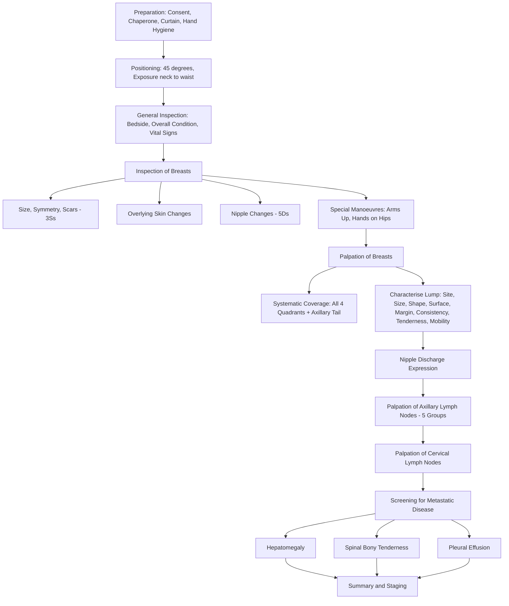

# Examination of Breast

## Master Framework Diagram

---

## Setting and Preparation

### Introduce Yourself and Obtain Consent
- "Good morning, my name is Dr ___, I am a medical student. I would like to examine your breasts today. Is that alright with you?"
  - 「你好，我叫___，係醫學生。我想幫你檢查乳房，可以嗎？」
- **State that you would wash your hands** before and after the examination.

### The 3Cs + 1H
- **Consent**: Ensure verbal consent. Explain the steps briefly — this reduces anxiety and improves cooperation.
- **Curtain/Privacy**: Draw curtains; ensure no unnecessary people are in the room. 「我會拉埋簾保障你嘅私隱。」
- ***Chaperone***: **ALWAYS** have a chaperone present regardless of the examiner's gender. This is both a medico-legal safeguard and a patient comfort measure [1][2].
- **Hand hygiene**: Wash hands or use alcohol gel.

### Positioning and Exposure
- **Position**: Recline bed to **45 degrees** (or sitting if no bed available). Arms resting at sides initially [1][2][3].
- **Exposure**: From **clavicle to upper abdomen**, exposing both breasts and axillae. The extent of breast tissue spans from the clavicle to the inframammary fold, and from the mid-axillary line to the sternum [2].
  - 「我需要你除低上面嘅衫到腰嘅位置，等我可以檢查你嘅乳房。」

<Callout title="Privacy is Non-Negotiable" type="error">
In OSCEs, failing to request a chaperone or forgetting to ensure privacy (drawing curtains) is an automatic penalty. Always state it out loud, even if there is no curtain in the exam room.
</Callout>

---

## General Inspection

Before touching the patient, take a step back and *look*. This tells you more than you think.

### Bedside Environment
- **Medical accessories**: IV lines, surgical drains (e.g. Jackson-Pratt drain post-mastectomy — note the colour and volume of fluid), oxygen, diet restriction signs [1][2].
- **Medications**: chemotherapy infusion pump, analgesia.

### The Patient at First Glance
| Feature | What to Look For | Why It Matters |
|---|---|---|
| Overall condition | Comfortable vs distressed, alert vs drowsy | Sets clinical acuity |
| Nutritional status | ***Cachexia*** — temporal wasting, prominent clavicles | Suggests advanced malignancy |
| Body habitus | Obesity (↑ risk of breast CA in post-menopausal women) | Risk factor for oestrogen-driven CA |
| Hydration | Dry mucous membranes, tongue | General health status |
| Pallor | Conjunctivae, palms | Anaemia from chronic disease or marrow metastasis |
| Jaundice | Scleral icterus | Liver metastasis |
| Central cyanosis | Tongue | Pulmonary involvement |
| ***Lymphadenopathy*** | Cervical, supraclavicular | Nodal spread |
| Lymphoedema of upper limb | Swelling, pitting | Post-axillary dissection or advanced axillary disease |
| Ankle oedema | Bilateral pitting | Hypoalbuminaemia from cachexia/liver disease |

**Why inspect generally?** — Breast carcinoma commonly metastasises to **bone, liver, lung, and brain** [3]. Pallor may indicate bone marrow infiltration; jaundice suggests liver metastasis; lymphoedema of the ipsilateral arm suggests axillary nodal obstruction.

---

## Inspection of the Breasts

Stand at the **end of the bed** to get a symmetrical view [2][4].

**Model instruction**: "I am now going to look at both breasts carefully."
「我而家會仔細睇你兩邊乳房。」

### A. Size, Symmetry, and Scars — ***"The 3Ss"*** [1][2][3]

- **Size**: Mild asymmetry is normal; ***marked size difference of recent onset is likely pathological*** [1].
- **Symmetry**: Compare breast contours bilaterally. Asymmetry in shape may indicate an underlying mass distorting tissue.
- **Scars** — look carefully at:
  - ***Inframammary folds*** (hidden mastectomy scars)
  - ***Periareolar region*** (biopsy, nipple reconstruction)
  - ***Axillary skin folds*** (sentinel lymph node biopsy, axillary dissection)
  - **Oblique horizontal scar** across chest wall → previous mastectomy [2]
  - If mastectomy scar present: look for signs of **recurrence** — skin ulceration, abnormal discharge from scar, nodules
  - **Shape of breast with no nipple** → breast reconstruction → look for **donor site** on the **back** (latissimus dorsi myocutaneous flap, LDMF) or **abdomen** (TRAM/DIEP flap) [2]
  - **Radiation markings** (ink tattoos): indicate previous radiotherapy

### B. Overlying Skin Changes

| Finding | Appearance | Pathophysiological Basis |
|---|---|---|
| ***Peau d'orange*** | Orange-peel skin with pitting at hair follicle/sweat gland openings | ***Tumour spreads along fibrous septa of breast and blocks lymphatics*** → oedema of overlying skin between pits that mark hair follicles and sweat glands [1][2] |
| Dimpling / puckering | Focal indentation of skin | Tumour invades and shortens **Cooper's ligaments** (suspensory ligaments), pulling skin inward |
| Skin fixation | Skin overlying mass cannot be pinched up | Direct tumour invasion through subcutaneous tissue into dermis |
| Ulceration | Breach of skin integrity | Tumour fungates through skin (T4b) |
| Erythema | Diffuse redness, warmth | Inflammatory breast CA (T4d) — tumour invades dermal lymphatics → lymphatic obstruction → inflammation-like picture |
| Ecchymosis / haematoma | Bruising | Fat necrosis (post-trauma), recent biopsy [1] |
| Recent biopsy signs | Bruising, dressing, puncture marks | Recent diagnostic workup [2] |

### C. Nipple Changes — ***"The 5Ds"*** [1][2][3][4]

A helpful mnemonic to systematically assess the nipple:

1. **Deviation / Displacement** — nipple pulled to one side by an underlying hard mass shortening the ducts
2. **Discolouration** — pigmentary change
3. ***Dermatitis*** — eczema-like rash with crusting → ***Paget's disease of the nipple*** (intraepidermal spread of underlying DCIS or invasive carcinoma) [1][2]
4. **Depression (Retraction / Inversion)** — underlying tumour invading and fibroting the lactiferous ducts, pulling the nipple inward
5. **Discharge** — look at the patient's clothing/bra for any stains [2]

<Callout title="Paget's Disease of the Nipple" type="idea">
An eczematous, crusting rash on the nipple that does NOT respond to topical steroids should be biopsied to rule out Paget's disease. Nearly all cases have an underlying carcinoma (DCIS or invasive). Key distinguishing feature from true eczema: Paget's involves the nipple first then spreads to the areola, while eczema typically affects the areola first.
</Callout>

### D. Special Inspection Manoeuvres

These dynamic manoeuvres are essential — they accentuate subtle signs that are invisible at rest.

#### 1. Arms Raised Over Head 「請你將雙手舉過頭。」
- **How**: Ask the patient to slowly raise both arms above her head.
- **What you're looking for**:
  - Symmetrical elevation of both breasts
  - ***Accentuation of skin tethering/dimpling*** — if Cooper's ligaments are invaded, the skin will indent further when stretched [1][2][4]
  - Exposure of the **lower part of the breast** and **inframammary fold** for hidden scars or skin changes
  - Any **axillary lumps** now visible [2]
- **Pathophysiology**: Raising the arms stretches the breast tissue upward. If a tumour is attached to the suspensory ligaments or skin, the tethered area cannot move freely → dimpling is accentuated.

#### 2. Hands on Hips, Press Inward 「請你將雙手放喺髖部用力向內壓。」
- **How**: Ask the patient to place both hands on her hips and push inward firmly. This **contracts the pectoralis major** [1][2][4].
- **What you're looking for**:
  - ***Any previously unnoticed mass*** that becomes more prominent (superficial mass not tethered to pectoralis → more visible)
  - ***Reduced mobility of a mass*** if it is fixed to the pectoralis major (the mass will become more fixed and less mobile when the muscle is contracted)
  - Retraction or dimpling not seen at rest
- **Pathophysiology**: Pectoralis major contraction pulls the deep fascia taut. A mass fixed to the muscle will be drawn inward, producing visible retraction; a mass above the muscle will be pushed forward and become more prominent.

---

## Palpation of Breasts

**Before you touch**: "I will now feel your breasts. Please let me know if you feel any pain or discomfort."
「我而家會用手檢查你嘅乳房。如果你覺得痛或者唔舒服，請即刻話畀我知。」

### General Principles [1][2][3]

- ***ALWAYS ask about pain*** before palpating [1][2].
- **Start with the normal/asymptomatic side** — establishes baseline and builds trust.
- Use the **flats of three middle fingers** (pads, not tips) — greater surface area = better sensitivity for deeper lumps.
- **Position**: Both arms at sides. For large or pendulous breasts, ask the patient to put her ipsilateral hand behind her head (this spreads the tissue more thinly over the chest wall) [2].

### Systematic Coverage

You must demonstrate a **systematic approach** covering all breast tissue. Options include [2]:
- **Clock-face / radial**: palpate radially from nipple outward along each hour position
- **Spiral**: concentric circles from outside inward (or inside outward)
- **Quadrant-by-quadrant**: four quadrants + subareolar region

Whichever method you choose, **always include**:
- The ***nipple-areolar complex*** [1]
- The ***axillary tail of Spence*** — an extension of breast tissue through the deep fascia into the axilla; >50% of breast carcinomas occur in the **upper outer quadrant** including the axillary tail [1][3]

### Characterising a Breast Lump

If a lump is found, go back to it and describe systematically [1][2][3]:

| Parameter | How to Assess | Normal / Benign | Abnormal / Malignant |
|---|---|---|---|
| **Site** | Laterality (L/R) + quadrant + clock-face + distance from nipple (e.g. "Lt 10 o'clock, 4cm from nipple") | — | UOQ most common for CA |
| **Size** | Measure with ruler in two dimensions (cm × cm) | — | Matters for T-staging |
| **Shape** | Describe geometric shape | Oval/spherical (fibroadenoma) | ***Spiculated, irregular*** (CA) [3] |
| **Edge / Margin** | Palpate circumference | Well-defined, smooth | ***Irregular, ill-defined*** |
| **Surface** | Run fingers over surface | Smooth, lobulated | Nodular, irregular, ***indistinct*** [3] |
| **Consistency** | Compress gently | Soft (cyst), rubbery (fibroadenoma), firm (FBC) | ***Stony hard*** (CA) [1][3] |
| **Tenderness** | Watch facial expressions! Ask. | Tender (abscess, FBC, cyst) | ***Usually non-tender*** (CA) [3] |
| **Mobility** | See special tests below | Mobile (fibroadenoma — "breast mouse") | ***Fixed/tethered*** (CA) [1][3] |

### Special Tests for Breast Lump Mobility

These are **critical for OSCE marks** and have direct clinical significance:

#### a. Skin Fixation vs Skin Tethering [1][2]

- **Technique**: Try to **pinch the skin directly overlying the lump** between thumb and index finger.
  - **Skin fixation**: You **cannot** pinch the skin above the lump at all — the tumour has directly invaded the dermis.
  - ***Skin tethering***: The lump appears separate from the skin and can be moved independently, but when moved beyond a certain limit, the skin **indents** (dimples) as if pulled by a string. The tumour has invaded the **fibrous septa (Cooper's ligaments)** but not the skin itself [1][2].
- **Pathophysiology**: Cooper's ligaments are fibrous strands running from the deep fascia through the breast parenchyma to the skin. Tumour invasion of these ligaments causes tethering; direct dermal invasion causes fixation.

<Callout title="Tethered vs Fixed — Know the Difference">
**Tethered** = can move independently within limits; pulling beyond limits causes skin indentation. **Fixed** = completely stuck, no independent movement at all. This distinction affects T-staging: skin involvement = T4b [1][2].
</Callout>

#### b. Pectoralis Major (Muscle) Fixation [1][2]

- **Technique**:
  1. First, move the lump in **two perpendicular directions** with the muscle relaxed. Note the degree of mobility.
  2. Then ask the patient to **press her hands firmly against her hips** 「請你用力將手壓向髖部」 — this contracts the pectoralis major.
  3. Now attempt to move the lump again in the same directions.
- **Positive result**: The lump has **reduced or no mobility** when the muscle is contracted, indicating fixation to the pectoralis major.
- **Pathophysiology**: The breast sits anterior to the pectoralis major, separated by the deep (pectoral) fascia. If a tumour invades through the fascia into the muscle, contraction of the muscle "locks" the mass in place. ***Fixation of the lump is almost diagnostic of malignancy*** [1][3]. This also indicates at least T4a staging (chest wall involvement) [2].

---

## Expression of Nipple Discharge

In an OSCE, you would typically say: "To avoid embarrassment, I will skip nipple expression, but I would like to describe how it is done if prompted." [2]

### If Prompted [2]:
1. **First ask the patient to express it herself** 「你可以試吓自己擠出分泌物畀我睇嗎？」
2. If unsuccessful, **ask permission** then use **two hands** to gently compress on either side of the nipple
3. Observe carefully at the nipple to determine:
   - **Single duct vs multiple duct** discharge (uniductal is more concerning)
   - **Nature of discharge**:

| Colour | Likely Cause |
|---|---|
| Watery / serous | Physiological, papilloma, carcinoma |
| Whitish (milky) | Galactorrhoea |
| ***Greenish / purulent*** | ***Ductal ectasia*** |
| ***Bloody*** | ***Intraductal papilloma, DCIS, invasive CA*** [2] |

- **Pathological discharge** is more likely if: **unilateral, uniductal, spontaneous, persistent, bloody** [5].

---

## Palpation of Axillary Lymph Nodes

This is a critical step — axillary nodal status is the single most important prognostic factor in operable breast cancer.

### Technique [1][2][3]

"I will now examine your armpit."
「我而家會檢查你嘅腋下。」

1. **Position**: Hold the patient's ipsilateral elbow/forearm with your hand (like a handshake), allowing her arm to rest on your forearm. This **relaxes the axillary muscles** and opens the axilla [1][2].
2. Use your **opposite hand** to palpate high up into the axillary apex.
3. Palpate all ***5 groups of axillary lymph nodes*** [1][2]:
   - **Anterior (pectoral)** group — along the lateral border of pectoralis major
   - **Posterior (subscapular)** group — along the lateral border of subscapularis
   - **Lateral (humeral)** group — along the medial aspect of the humerus
   - **Medial (central)** group — within the axillary fat pad
   - **Apical (infraclavicular)** group — at the apex of the axilla (highest group)

4. For each palpable node, comment on [1][2]:
   - **Number**
   - **Site** (which group)
   - **Size** (cm)
   - **Consistency** (soft, firm, hard)
   - **Tenderness**
   - **Fixation** (mobile, matted to each other, fixed to underlying structures)

### Normal vs Abnormal Findings
- **Normal**: Small (< 1cm), soft, non-tender, mobile lymph nodes may be palpable — can be reactive
- **Suspicious for malignancy**: Hard, non-tender, fixed/matted nodes > 1cm
- **Pathophysiology**: Breast cancer drains primarily via lymphatics to the axillary nodes. Tumour cells replace normal nodal architecture, causing enlargement and hardening. Extranodal extension causes fixation.

---

## Palpation of Cervical Lymph Nodes

If axillary disease is suspected or advanced cancer is likely, palpate the **cervical and supraclavicular lymph nodes** [2].

- Supraclavicular lymphadenopathy in the context of breast cancer suggests **N3c** disease — stage III disease at minimum.

---

## Completing the Examination: Screening for Metastatic Disease

"To complete my examination, I would like to check for signs of distant spread." [2][3]

| Site | How to Check | What You're Looking For | Pathophysiology |
|---|---|---|---|
| **Liver** | Palpate abdomen for hepatomegaly | Enlarged, hard, nodular liver edge | Haematogenous spread to liver |
| **Spine** | Percuss spinous processes for bony tenderness | Localised tenderness over vertebrae | Bone metastasis (breast CA is osteolytic + osteoblastic) |
| **Lungs** | Auscultate and percuss chest | Absent breath sounds, ***stony dullness*** → pleural effusion | Pleural metastasis or lymphangitic carcinomatosis |
| **Contralateral breast** | Examine the other breast | Synchronous contralateral primary | Bilateral breast CA is not uncommon |

---

## Expected Positive and Negative Findings

### Findings You Would Expect in Breast Carcinoma [1][2][3]
- ***Hard, irregular, non-tender mass*** — typically in the upper outer quadrant
- ***Skin tethering or fixation, dimpling***
- ***Peau d'orange***
- ***Nipple retraction or deviation***
- ***Palpable, hard, fixed axillary lymph nodes***
- ***Stony hard consistency***
- ***Fixation to pectoralis major***

### Important Negatives to Document
- No palpable contralateral breast mass (rules out synchronous bilateral disease)
- No cervical/supraclavicular lymphadenopathy (rules out N3c)
- No hepatomegaly (rules out liver metastasis)
- No spinal tenderness (rules out bone metastasis)
- No pleural effusion (rules out pulmonary metastasis)
- No lymphoedema of the ipsilateral upper limb

---

## Red-Flag Examination Findings and Escalation Triggers

| Red Flag | Significance | Action |
|---|---|---|
| Inflammatory changes: diffuse erythema and oedema involving ≥ 1/3 of breast | ***Inflammatory breast cancer (T4d)*** — worst prognosis among locally advanced | Urgent oncology referral; neoadjuvant chemotherapy before surgery [3] |
| Peau d'orange | Locally advanced disease (T4b) | Urgent triple assessment |
| Fungating/ulcerating mass | Neglected or locally advanced CA | Urgent surgical and oncology review |
| Hard, fixed supraclavicular node | N3c — stage IIIC minimum | Staging CT; systemic therapy |
| New-onset pathological fracture or cord compression signs | Bone metastasis | Emergency MRI spine; consider surgery/RT |
| Bilateral bloody nipple discharge | High suspicion for malignancy | Urgent bilateral imaging + biopsy |

---

## AJCC 8th Edition T-Staging (Clinically Assessable) [2]

| Stage | Definition |
|---|---|
| Tis | Carcinoma in situ |
| T1 | ≤ 2 cm |
| T2 | > 2 cm and ≤ 5 cm |
| T3 | > 5 cm |
| T4a | Extension to chest wall |
| T4b | Skin involvement (ulceration, ipsilateral skin nodules, peau d'orange) |
| T4c | Both T4a + T4b |
| ***T4d*** | ***Inflammatory breast cancer*** |

---

## Common OSCE Pitfalls

<Callout title="Don't Lose Marks on These" type="error">

1. **Forgetting the chaperone** — instant penalty mark in most OSCE circuits.
2. **Not asking about pain** before palpation — examiners watch for this.
3. **Starting with the abnormal side** — always start with the normal side to establish baseline and put the patient at ease.
4. **Not including the axillary tail** in palpation — this is where many cancers hide.
5. **Forgetting the special manoeuvres during inspection** — arms above head and hands-on-hips are essential and frequently tested.
6. **Describing the lump haphazardly** — use a systematic checklist (site, size, shape, surface, margin, consistency, tenderness, mobility).
7. **Not checking for metastatic disease** to complete the examination — always mention liver, spine, and lungs.
8. **Skipping the contralateral breast** — synchronous bilateral disease is not rare.
9. **Using vague terms** — say "stony hard" or "rubbery," not just "hard."
10. **Forgetting to look at the bra/clothing** for nipple discharge stains.
</Callout>

---

## High-Yield Exam-Focused Interpretation Tips

- ***Peau d'orange = lymphatic obstruction*** — the skin pits correspond to where hair follicles and sweat glands anchor the skin, while the surrounding oedematous tissue swells. This is a **T4b** feature [1][2].
- **Skin dimpling ≠ skin fixation** — dimpling is tethering via Cooper's ligaments; fixation is direct dermal invasion. Both are T4b but fixation implies more advanced local invasion.
- **A mobile, rubbery, well-defined mass in a young woman** → think **fibroadenoma** ("breast mouse" because it slips away under your fingers).
- **A hard, irregular, fixed mass** → think **carcinoma** until proven otherwise. But remember: ***organised haematoma, fat necrosis, and breast prosthesis/foreign body*** can also feel hard and fixed [2].
- ***Triple assessment sensitivity is 99.6% when all three components are combined*** — clinical examination alone has sensitivity of only 50–85% [4][6].
- **Upper outer quadrant** accounts for ~50% of breast carcinomas — always pay special attention here [1].
- **Bloody nipple discharge** from a single duct = intraductal papilloma > DCIS > invasive CA [5].

---

## Model Reporting Script

> "On examination, Mrs Chan is lying comfortably on the bed at 45 degrees. She is alert and not in any respiratory distress. She does not appear cachexic. There are no IV lines, drains, or medical accessories at the bedside.
>
> On general inspection, there is no pallor, jaundice, or peripheral lymphadenopathy. There is no lymphoedema of the upper limbs. Vital signs are stable.
>
> On inspection of the breasts, there is asymmetry with the left breast appearing larger than the right. There is a visible mass in the upper outer quadrant of the left breast with overlying skin dimpling. I note peau d'orange appearance overlying the mass. The left nipple is deviated medially. There is no ulceration, erythema, or fungation. There are no scars or radiation markings. On raising the arms above the head, the skin dimpling is accentuated. On pressing hands against hips to contract pectoralis major, the mass becomes more prominent.
>
> On palpation of the left breast, there is a 4cm × 3cm mass at the 10 o'clock position, approximately 3cm from the nipple. It is irregular in shape with ill-defined margins and a nodular surface. It is stony hard in consistency, non-tender, and fixed to the overlying skin — I cannot pinch the skin above the lump. On contraction of pectoralis major, the mass shows reduced mobility, suggesting fixation to the underlying muscle. The right breast is unremarkable on palpation with no palpable masses.
>
> Nipple expression was not performed to maintain patient dignity. The patient reports no spontaneous discharge.
>
> On palpation of the left axilla, there is a 2cm firm, non-tender lymph node in the anterior group that appears fixed to underlying structures. No other axillary lymph nodes are palpable. The right axilla is clear. Cervical and supraclavicular lymph nodes are not palpable bilaterally.
>
> To complete the examination, there is no hepatomegaly on abdominal palpation. There is no spinal tenderness on percussion of the spinous processes. The chest is clear with no evidence of pleural effusion.
>
> In summary, this patient has a left-sided breast mass in the upper outer quadrant that is clinically suspicious for malignancy — it is stony hard, irregular, fixed to skin and pectoralis major, with peau d'orange and nipple deviation. There are palpable ipsilateral axillary lymph nodes. Clinically, this is at least a T4c N1 tumour. There are no signs of distant metastasis on clinical examination. I would proceed with triple assessment including mammogram and ultrasound of both breasts, followed by core biopsy of the mass and ultrasound-guided FNA of the axillary lymph node."

---

<Callout title="High Yield Summary">

**Breast examination is a core OSCE skill.** Key steps to never forget:

1. **3Cs + 1H**: Consent, Curtain, Chaperone, Hand hygiene
2. **Inspection**: 3Ss (Size, Symmetry, Scars) → Skin changes → 5Ds of nipple → Arms up → Hands on hips
3. **Palpation**: Start normal side → Flats of fingers → Cover all 4 quadrants + axillary tail → Characterise lump systematically → Test skin tethering/fixation → Test muscle fixation
4. **Axillary LNs**: 5 groups (anterior, posterior, lateral, medial, apical)
5. **Complete**: Screen for metastasis (liver, bone, lung) and examine contralateral breast
6. **Triple assessment** (clinical + radiology + pathology) has a combined sensitivity of **99.6%** — but only when all three are done [4][6]
7. **Peau d'orange** = lymphatic obstruction by tumour along fibrous septa → T4b
8. **Fixation to pectoralis** = tumour invasion through deep fascia → at least T4a

</Callout>

---

<ActiveRecallQuiz
  title="Active Recall - Physical Exam"
  items={[
    {
      question: "What are the 5Ds of nipple changes you must look for during breast inspection?",
      markscheme: "Deviation/Displacement, Discolouration, Dermatitis (Paget disease), Depression (retraction/inversion), Discharge"
    },
    {
      question: "What is the pathophysiological mechanism of peau d'orange in breast cancer?",
      markscheme: "Tumour spreads along fibrous septa and blocks dermal/subdermal lymphatics, causing oedema of skin between hair follicle and sweat gland openings anchored by Cooper ligaments, giving an orange-peel appearance"
    },
    {
      question: "How do you test for fixation of a breast lump to pectoralis major, and what does a positive result indicate?",
      markscheme: "Move the lump in two perpendicular directions with muscle relaxed, then ask patient to press hands on hips to contract pectoralis major and repeat. Positive if lump becomes less mobile or immobile, indicating tumour invasion through deep fascia into the muscle (at least T4a)"
    },
    {
      question: "What is the difference between skin tethering and skin fixation of a breast lump?",
      markscheme: "Tethering: lump moves independently within limits but pulling beyond limits causes skin dimpling (invasion of Coopers ligaments/fibrous septa). Fixation: skin cannot be pinched above the lump at all (direct dermal invasion). Both indicate T4b"
    },
    {
      question: "Name the 5 groups of axillary lymph nodes you must palpate during breast examination.",
      markscheme: "Anterior (pectoral), Posterior (subscapular), Lateral (humeral), Medial (central), Apical (infraclavicular)"
    },
    {
      question: "What is the sensitivity of triple assessment for breast cancer, and what are its three components?",
      markscheme: "Sensitivity 99.6%, specificity 93%. Components: clinical examination (history and PE, 50-85%), radiological assessment (mammogram plus or minus USG, 90%), pathological assessment (FNA or core biopsy, 91%). Positive if any one component is positive"
    }
  ]}
/>

---

## References

[1] Senior notes: felixlai.md (Breast examination section)
[2] Senior notes: Ryan Ho Urogenital.pdf (Section 9.1 Examination of Breast, pp. 187–189)
[3] Senior notes: maxim.md (Section 8.3 Assessment of breast mass)
[4] Lecture slides: GC 181. Breast mass breast cancer; benign breast diseases.pdf (p. 12)
[5] Senior notes: Ryan Ho Urogenital.pdf (Section on nipple discharge, p. 198)
[6] Lecture slides: The Management of breast cancer_Prof A Kwong 20_2_2020.pdf (p. 10)
