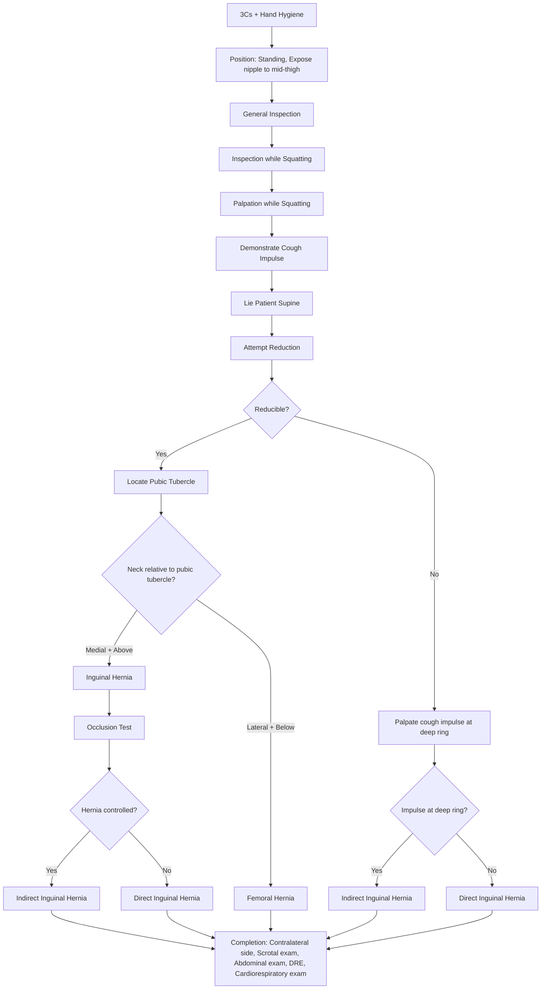

# Examination of Hernia

## Master Examination Framework

---

## General Approach: The 3Cs + Hand Hygiene

Before touching the patient, you must establish rapport and set up properly. This is marks on the table in every OSCE.

1. **Consent**: "Hello, my name is Dr ___. I am going to examine your groin area today. Is that alright with you?" 「你好，我係___醫生。我今日需要檢查你嘅腹股溝位置，可以嗎？」
2. **Chaperone**: "I will have a chaperone present during this examination." 「我會安排一位同事喺場陪同檢查。」 — This is **non-negotiable** for any examination involving the groin/genitalia.
3. **Comfortable**: "Please let me know at any time if you are in pain or uncomfortable." 「如果有任何唔舒服，請隨時話我知。」
4. **Hand hygiene**: "I would wash my hands before starting." State this aloud even if you gel in front of the examiner.

**Positioning**: ***ALWAYS start in the STANDING position*** [1][2]. Hernias reduce when lying down and may be completely invisible supine. The true size of the hernia is only appreciated in the standing position [2]. Expose from **nipple to mid-thigh** [1].

**Why standing?** Gravity and increased intra-abdominal pressure from standing allow hernia contents to descend through the defect — if you start supine, you may miss the hernia entirely.

> 「請你企起身，同埋除咗上衫同褲到大腿中間位。」 ("Please stand up and remove your clothing from your chest to mid-thigh.")

<Callout title="OSCE Pitfall: Starting Supine" type="error">
The single most common mistake in the hernia OSCE is starting the patient supine. The hernia may be completely reduced in this position and you will find nothing. **Always start standing.**
</Callout>

---

## General Inspection

Before you even get close to the groin, take a step back and look. This takes 10–15 seconds and can earn you significant marks.

### Around the Bedside
- **IV lines, drains**: Suggests recent surgery or acute presentation
- **Vomit bowel / NG tube**: May indicate intestinal obstruction from an incarcerated hernia
- **Urinary catheter**: Could suggest urinary retention (BPH → chronic straining → predisposing factor)
- **Walking aids, oxygen**: Suggests chronic cough (COPD), another predisposing factor
- **Medications**: Laxatives (chronic constipation), bronchodilators (COPD)

### Patient at First Glance
- **Body habitus**: Obesity increases intra-abdominal pressure and is a major risk factor [3]
- **Distress level**: A patient lying motionless suggests peritonitis (strangulated hernia with perforation); a patient calmly standing likely has a reducible hernia
- **Cachexia**: Consider underlying malignancy causing increased intra-abdominal pressure (ascites)
- **Abdominal distension**: Visible from a distance — could suggest bowel obstruction

**Model commentary**: *"On general inspection, the patient is a middle-aged gentleman standing comfortably. He is of normal body habitus. There are no drains, NG tubes, or IV lines. I do not see any obvious abdominal distension."*

---

## Systematic Examination Sequence

### INSPECTION (While Squatting Down in Front of the Patient)

You should squat or kneel to bring your eyes level with the groin. Inspect both sides systematically.

#### a) Overlying Skin Changes
- **How**: Look at the skin over the groin and scrotum bilaterally.
- **Normal**: No erythema, no skin changes.
- **Abnormal**: ***Erythema and oedema may point towards strangulation*** [2]. Discolouration (dusky, purple) suggests ischaemia of underlying contents.
- **Pathophysiology**: Strangulated bowel within the hernia sac becomes congested and inflamed → inflammatory mediators cause overlying skin erythema and oedema.

#### b) Surgical Scars
- **How**: Look carefully for scars — they can be ***very fine especially if a long time ago — LOOK VERY HARD!*** [1]
- **Types**: 
  - **Oblique scar** in the groin → previous open hernia repair (eg. Lichtenstein)
  - **Laparoscopic scars** → typically 3 port sites, one at subumbilical region (TAPP/TEP repair)
- **Why it matters**: Presence of a scar with a recurrent lump = ***recurrent hernia*** (5% risk in open repair) [1]. This changes management — laparoscopic repair is preferred for recurrent hernias.

#### c) Lump Characteristics
- **Site**: Left or right? Groin crease, above crease, extending into scrotum?
- **Extension into scrotum**: An inguinoscrotal swelling strongly suggests ***indirect inguinal hernia*** (which traverses the entire inguinal canal and can descend through the superficial ring into the scrotum) [3][4].
- **Contralateral side**: Always inspect both sides — ***inguinal hernia is 20% bilateral*** [1].

#### d) Visible Cough Impulse
- **How**: Ask the patient to turn their head away from you and cough. 「請你將頭轉向另一邊，然後咳一下。」
- **Normal**: No visible change in the groin region.
- **Abnormal**: Visible bulging or expansion of the lump on coughing.
- **Pathophysiology**: Coughing raises intra-abdominal pressure → transmitted to the hernia sac → sac expands visibly. This is pathognomonic for a hernia as it demonstrates communication with the abdominal cavity.

#### e) Ask Patient to Tense Abdominal Muscles
- **How**: Ask the patient to look down at their toes (chin to chest). 「請你低頭望住自己隻腳趾。」
- **Why**: Tensing the rectus abdominis makes ventral/incisional hernias more prominent and helps delineate the fascial defect.

**Model commentary**: *"On inspection while squatting down, I can see a right inguinoscrotal swelling. There are no overlying skin changes, no erythema, and no surgical scars. The contralateral side appears normal. On asking the patient to cough, I can see a visible cough impulse — the lump becomes larger on coughing."*

---

### PALPATION (While Squatting, Then Supine)

<Callout title="Always Ask About Pain First" type="error">
Before touching anything: "Is there any pain in this area?" 「呢度有冇痛？」 — A tender hernia is already incarcerated and you must be extremely gentle. If a hernia is acutely tender, tense, and erythematous, suspect **strangulation** and do not attempt forceful reduction.
</Callout>

#### a) Palpate the Mass
- **Consistency**: Typically soft (omentum/bowel). A hard, tense lump suggests incarceration or strangulation.
- **Tenderness**: ***If tender, means that it is already incarcerated*** [1]. Exquisite tenderness → strangulation.
- **Fluctuance**: Present (fluid within the sac or bowel contents).
- **Temperature**: Increased warmth over the hernia suggests inflammation → strangulation.
- **Borders and surface**: Smooth, ill-defined margins typical of hernia.

#### b) "Can You Get Above It?"
- **How**: Try to palpate above the superior aspect of the swelling. Place fingers above the lump and see if you can delineate its upper border.
- **Cannot get above** → the swelling originates from the inguinal canal = **inguinal hernia** or inguinoscrotal pathology
- **Can get above** → the swelling is confined to the scrotum = **scrotal pathology** (e.g., hydrocele, epididymal cyst)
- **Pathophysiology**: An inguinal hernia enters the scrotum from above via the inguinal canal, so there is no plane of separation between the upper border of the swelling and the canal.

**Model commentary**: *"On palpation, the lump is soft, non-tender, and I can feel a fluctuant mass. I cannot get above the swelling, confirming that it extends from the inguinal canal. Both testes are palpable in the scrotum."*

#### c) Palpate the Scrotum (if scrotal swelling present)
- **Both testes present?** — An absent testis suggests undescended testis (associated with patent processus vaginalis and thus ***higher chance of indirect inguinal hernia and underlying testicular malignancy***) [2].
- **Can the lump be separated from the testis?** — A hernia that has descended into the scrotum **cannot be separated from the testis** (the sac surrounds the cord structures). A hydrocele also cannot be separated, but it **transilluminates**.

#### d) Palpable Expansile Cough Impulse
This is the **key diagnostic sign** for hernia.

- **How**: Stand at the side of the patient. Place one hand on the patient's back for support. Place the fingers of the other hand parallel to the inguinal ligament over the lump. Ask the patient to cough while turning their head to the left side. 「請你將頭轉向左邊，然後咳一下。」
- **Normal**: No palpable expansion.
- **Abnormal**: ***Expansile cough impulse = swelling becomes tense and expands with coughing*** [1]. This is distinct from a transmitted impulse (where the whole mass moves but does not expand).
- **Pathophysiology**: Coughing → ↑intra-abdominal pressure → peritoneal sac distends → the examiner feels the mass actively expanding under their fingers.
- **Important**: ***Reduce the hernia before asking the patient to cough*** [2] — this allows you to feel the impulse pushing through the defect rather than just the sac tensing.

<Callout title="Cough Impulse vs Transmitted Pulsation" type="idea">
An **expansile** cough impulse means the lump enlarges under your fingers. A **transmitted** impulse means the lump moves but doesn't change size. Femoral artery aneurysm has an **expansile pulsation**, and a saphena varix has a **cough impulse with a fluid thrill**. A hernia has an **expansile cough impulse**.
</Callout>

#### e) Inguinal Lymphadenopathy
- **How**: Palpate along the inguinal ligament for any enlarged lymph nodes.
- **Why**: Differential diagnosis of a groin lump includes lymphadenopathy (L SHAPE mnemonic: ***Lymph nodes, Saphenous varix, Hernia, Aneurysm, Psoas abscess, Ectopic testis***) [4]. Also, the ***lower half of the anal canal drains to superficial inguinal lymph nodes*** [2], so inguinal lymphadenopathy may indicate anorectal pathology.

**Model commentary**: *"I can feel a palpable expansile cough impulse over the right groin. There is no inguinal lymphadenopathy."*

---

### SUPINE EXAMINATION

Now ask the patient to lie down. 「請你瞓低。」

#### a) Attempt Reduction
- **How**: Some hernias may reduce spontaneously on lying supine. If not, ask the patient to try to reduce it themselves first. 「你可唔可以試下自己將個脹起嘅位推返入去？」 If still irreducible, ***ask the examiner*** if you may attempt gentle reduction (usually refused to avoid ***reduction en-masse***) [1].
- **Reduction en-masse**: This is when the hernia sac and contents are pushed together as a unit but the contents remain **within the sac** — they never actually re-enter the peritoneal cavity. The hernia appears reduced but the strangulation persists. This is a **dangerous pitfall** [1][2].
- ***STOP IMMEDIATELY if painful!*** [1]
- **Comment**: "The hernia can/cannot be reduced."

#### b) Locate the Pubic Tubercle
This is the **key landmark** for distinguishing inguinal from femoral hernia.

- **How**: Start from the umbilicus and move inferiorly. The ***first bony prominence = pubic symphysis***. Then feel laterally — the ***most lateral bony prominence = pubic tubercle*** [1][2].
- **Alternative (male)**: Follow the spermatic cord to where it attaches at the pubic tubercle.

#### c) Determine Relationship of Hernia Neck to Pubic Tubercle
- ***Medial and above pubic tubercle → inguinal hernia*** [1][2]
- ***Lateral and below pubic tubercle → femoral hernia*** [1][2]
- **Pathophysiology**: The inguinal canal passes above the inguinal ligament (and the pubic tubercle is its medial landmark), while the femoral canal lies below the inguinal ligament lateral to the pubic tubercle.

---

### SPECIAL TESTS

#### 1. Deep Inguinal Ring Occlusion Test

This is the **most important special test** in hernia examination — it distinguishes direct from indirect inguinal hernia.

- **Technique**:
  1. Reduce the hernia with the patient supine.
  2. Locate the **deep inguinal ring**: ***½ inch above the mid-point of the inguinal ligament*** (inguinal ligament runs between ASIS and pubic symphysis) [1][2]. This corresponds roughly to 2 cm above the midpoint.
  3. Apply firm pressure with your thumb over the deep inguinal ring.
  4. Ask the patient to stand up and cough. 「請你企起身，然後咳一下。」
  5. **Observe**:
     - ***Hernia controlled (+ve occlusion test) → indirect inguinal hernia*** [1][5]
     - ***Hernia NOT controlled (−ve occlusion test) → direct inguinal hernia*** [1][5]
  6. Release the thumb and ask the patient to cough again:
     - ***Hernia appears obliquely downward = indirect*** [1]
     - ***Hernia projects directly outward = direct*** [1]

- **Accuracy**: ***Accuracy of 86% for indirect inguinal hernia, but only 35% for direct inguinal hernia*** [5]. So a positive test is quite reliable for indirect, but a negative test doesn't definitively confirm direct.

- **Pathophysiology**: An indirect hernia enters through the **deep inguinal ring** (lateral to the inferior epigastric vessels) [3][4]. Occluding this ring blocks the hernia from entering the canal. A direct hernia protrudes through **Hesselbach's triangle** (medial to the inferior epigastric vessels), bypassing the deep ring entirely [3][4] — so occluding the ring has no effect.

- **Model commentary**: *"I am now performing the occlusion test. I have located the deep inguinal ring at the mid-point of the inguinal ligament. With pressure applied over the deep ring, I ask the patient to stand and cough. The hernia is controlled — this is consistent with an indirect inguinal hernia."*

<Callout title="Pantaloon Hernia" type="idea">
If the hernia appears slightly on coughing with occlusion but appears even more fully after removal of compression, this suggests a ***pantaloon hernia*** — the presence of both direct and indirect components straddling the inferior epigastric vessels [2][4].
</Callout>

#### 2. Cough Impulse at the Deep Ring (If Irreducible)
- **When**: The occlusion test requires a reducible hernia. If the hernia is irreducible, you cannot perform the full test.
- **Technique**: Palpate over the deep inguinal ring while the patient coughs.
- **Impulse present at deep ring** → indirect inguinal hernia (contents transmit pressure from within the canal at the deep ring level)
- **Impulse absent at deep ring** → likely direct inguinal hernia

#### 3. Direction of Herniation After Reduction
- After reducing and releasing, observe:
  - **Oblique course** (lateral to medial, superolateral to inferomedial) → indirect
  - **Direct forward bulge** → direct
- This is because indirect hernias follow the course of the inguinal canal, while direct hernias push straight through the posterior wall.

#### 4. Transillumination Test
- **When**: If there is a scrotal component.
- **How**: Darken the room. Place a pen torch behind the scrotum. 「我而家要熄燈，然後用電筒照你嘅陰囊。」
- **Positive** (lights up): Hydrocele (clear fluid transilluminates).
- **Negative** (opaque): Hernia (bowel/omentum does not transilluminate), solid testicular mass.
- **Caveat**: In infants, thin-walled hernia sacs may transilluminate — do not rely solely on this test in paediatric patients.

---

### AUSCULTATION

- **How**: Place the stethoscope over the hernia lump. 「我而家聽下你個脹起嘅位。」
- **Normal**: No bowel sounds over the lump if it contains omentum.
- **Abnormal**: **Bowel sounds** audible over the hernia → confirms bowel as hernia content. **High-pitched tinkling** sounds → may suggest obstructed loop within the sac.
- **Why**: Helps determine the content of the hernia sac (bowel vs omentum) and identify early obstruction.

### PERCUSSION (Limited Role)

- **Over the hernia**: 
  - **Resonant** → bowel (air-filled loops)
  - **Dull** → omentum or fluid
- **Why**: Quickly differentiates bowel from omentum content. More relevant for incisional hernias where the defect is larger and content identification affects surgical planning [4].

---

## Completion of Examination

State these systematically to the examiner — this demonstrates thoroughness:

1. **Contralateral groin examination**: Inguinal hernia is ***20% bilateral*** [1]. Also check for femoral hernia on the other side.

2. **Genital examination** (males):
   - **Scrotal extension**: Indirect inguinal hernia may descend through the superficial ring into the scrotum [2]
   - **Undescended testes**: Higher chance of indirect inguinal hernia and underlying testicular malignancy [2]
   - **Baseline testicular volume**: Post-operatively can be complicated by ***testicular atrophy*** [2] from pampiniform plexus thrombosis → useful to document baseline

3. **Abdominal examination**: Look for causes of ***increased intra-abdominal pressure*** — abdominal mass, large bladder (palpable suprapubically), ascites (shifting dullness), abdominal distension [1]. Auscultate for bowel sounds (absent → ileus from peritonitis; high-pitched → obstruction).

4. **Digital rectal examination (DRE)**:
   - **Stool impaction** → chronic constipation → chronic straining [1]
   - **BPH** → straining to urinate [1]
   - ***Lower half of anal canal drains to superficial inguinal lymph node*** [2] — anorectal pathology may explain inguinal lymphadenopathy

5. **Per vaginal examination** (females): ***Lower 1/3 of vagina drains to superficial inguinal lymph node*** [2]

6. **Cardiorespiratory examination**: Look for causes of ***chronic cough*** (e.g., COPD, chronic lung disease) which predisposes to hernia formation and recurrence [1][6]

---

## Expected Positive Findings

For a typical **reducible indirect inguinal hernia** (the most common OSCE scenario):
- Right-sided inguinoscrotal swelling (2/3 are right-sided [3])
- Visible and palpable expansile cough impulse
- Cannot get above the lump
- Soft, non-tender, reducible
- Neck of hernia **medial and above** the pubic tubercle
- Positive occlusion test (hernia controlled)
- Hernia reappears obliquely on release of pressure

## Important Negative Findings to Document

- **No erythema or skin changes** → excludes strangulation
- **Non-tender** → excludes incarceration/strangulation
- **No contralateral hernia** → unilateral
- **Both testes present and normal** → no undescended testis
- **No inguinal lymphadenopathy** → excludes reactive/malignant LAP
- **No abdominal distension or abnormal bowel sounds** → excludes obstruction

---

## Red-Flag Examination Findings and Escalation Triggers

| Red Flag Finding | What It Suggests | Action |
|---|---|---|
| ***Tense, tender, irreducible hernia*** | Incarceration → imminent strangulation | Urgent surgical referral |
| ***Erythema and oedema of overlying skin*** | Strangulation | Emergency surgery |
| ***Loss of cough impulse in a previously reducible hernia*** | Strangulation (sac is sealed off from abdominal cavity) | Emergency surgery |
| ***Signs of intestinal obstruction*** (vomiting, distension, absent bowel sounds) | Obstructed hernia | NG decompression + emergency surgery |
| ***Fever, tachycardia, peritonism*** | Gangrenous bowel / perforation | Resuscitate + emergency laparotomy |
| ***Scrotal swelling with acute pain*** | Testicular torsion (DDx) | Urgent surgical exploration (< 6h) |

<Callout title="Strangulation progresses to gangrene as early as 5–6 hours" type="error">
An acutely tender, tense hernia with overlying skin changes and loss of cough impulse is a **surgical emergency**. Do NOT attempt reduction. Call your senior immediately. [3]
</Callout>

---

## Differentiating Key Hernia Types — Summary Table

| Feature | **Indirect Inguinal** | **Direct Inguinal** | **Femoral** |
|---|---|---|---|
| **Proportion** | ***80%***, younger males | ***20%***, older males | More common in ***females*** |
| **Relation to pubic tubercle** | Medial + above | Medial + above | ***Lateral + below*** |
| **Relation to inferior epigastric vessels** | ***Lateral*** | ***Medial (Hesselbach triangle)*** [3][4] | Below inguinal ligament |
| **Course** | Through entire inguinal canal | Medial 1/3 of canal | Through femoral canal |
| **Descends to scrotum** | ***Yes*** | Rarely | No |
| **Occlusion test** | ***Controlled*** (+ve) [3][5] | NOT controlled (−ve) | N/A |
| **Strangulation risk** | More common (narrow deep ring) | Less common (broad base) | ***Highest*** (narrow neck) |
| **Aetiology** | Congenital (patent processus vaginalis) or acquired | Acquired (weakened posterior wall) | Acquired |

---

## Common OSCE Pitfalls

1. **Starting the patient supine** — You will miss the hernia. Always start standing.
2. **Forgetting the chaperone** — Automatic mark deduction for groin/genital examination.
3. **Not asking about pain before palpation** — The hernia may be strangulated; rough handling causes unnecessary distress and is unprofessional.
4. **Confusing "cannot get above" with "cannot separate from testis"** — Both are needed to confirm inguinoscrotal hernia. "Cannot get above" differentiates from isolated scrotal pathology; "cannot separate from testis" differentiates from epididymal pathology.
5. **Reduction en-masse** — Never forcefully push an irreducible hernia. Always ask the examiner before attempting manual reduction [1].
6. **Forgetting to check the contralateral side** — 20% bilateral [1].
7. **Not completing the examination** — You must mention abdominal exam, DRE, and cardiorespiratory exam to score full marks.
8. **Mistaking a femoral hernia for inguinal** — Always palpate the pubic tubercle and determine the relationship of the neck. Femoral hernias sit below and lateral.
9. **Not looking for scars** — Fine scars from previous repairs can be almost invisible. Look hard.

---

## High-Yield Exam-Focused Interpretation Tips

- **"Why does the cough impulse disappear in strangulation?"** — Because the hernia sac is sealed off from the peritoneal cavity by the tight constricting ring. Intra-abdominal pressure can no longer transmit to the sac.
- **"Why is the indirect hernia more common than direct?"** — The deep ring is a natural weak point (passage of the processus vaginalis in embryological life), and incomplete closure (patent processus vaginalis) is common.
- **"Why is femoral hernia more prone to strangulation?"** — The femoral ring is narrow and rigid (bounded by the inguinal ligament, pectineal ligament, and lacunar ligament) [4]. Once bowel enters, it gets trapped easily.
- **"Why do we check for predisposing factors?"** — ***Require treatment as well to decrease the risk of recurrence*** [1]. Treating the hernia alone without addressing chronic cough, constipation, BPH, or obesity leads to recurrence.
- ***Diagnosis is primarily clinical*** — physical examination alone is usually sufficient [5]. USG is the imaging of choice if diagnosis is uncertain (e.g., occult hernia with symptoms but no palpable lump) [2].

---

## Model Reporting Script

> *"On examination, Mr Chan is a 55-year-old gentleman who appears comfortable at rest in the standing position. Vitals are stable — he is afebrile with a heart rate of 78, blood pressure 128/76, and oxygen saturations of 98% on room air.*
>
> *On inspection of the groin, there is a right inguinoscrotal swelling with no overlying skin changes, no erythema, and no surgical scars. The contralateral left groin appears normal. On asking the patient to cough, there is a visible cough impulse.*
>
> *On palpation, the swelling is soft, non-tender, and fluctuant. I cannot get above the lump, and it extends from the right inguinal region into the scrotum. Both testes are palpable and normal. There is a palpable expansile cough impulse. There is no inguinal lymphadenopathy.*
>
> *On lying the patient supine, the hernia reduces spontaneously. The neck of the hernia lies medial and above the pubic tubercle, consistent with an inguinal hernia. On performing the deep ring occlusion test, the hernia is controlled with pressure over the deep inguinal ring — consistent with an indirect inguinal hernia. On release of pressure, the hernia reappears obliquely.*
>
> *Abdominal examination is unremarkable with no distension, masses, or organomegaly. Bowel sounds are present and normal.*
>
> *In summary, this gentleman has a right-sided, reducible, indirect inguinal hernia with no features of incarceration or strangulation. I would like to complete the examination with a digital rectal examination and cardiorespiratory assessment to look for predisposing factors such as BPH, constipation, or chronic cough."*

---

<Callout title="High Yield Summary">

**Key questions to answer in a hernia OSCE** [1]:
1. **Is this a hernia?** — Cough impulse + reducibility = hernia
2. **Inguinal or femoral?** — Relationship to pubic tubercle (medial + above = inguinal; lateral + below = femoral)
3. **Direct or indirect?** — Occlusion test (controlled = indirect; not controlled = direct)
4. **Reducible or irreducible?** — Irreducible = incarcerated → higher risk of strangulation
5. **Any predisposing factors?** — Complete with abdominal exam, DRE, cardiorespiratory exam

**Red flags**: Tender + tense + erythematous + loss of cough impulse = **strangulation → emergency surgery**

**DDx of groin lump (L SHAPE)**: Lymph nodes, Saphenous varix, Hernia, Aneurysm, Psoas abscess, Ectopic testis [4]

</Callout>

---

<ActiveRecallQuiz
  title="Active Recall - Physical Exam"
  items={[
    {
      question: "What is the key anatomical landmark used to distinguish inguinal from femoral hernia, and what is the relationship of each?",
      markscheme: "Pubic tubercle. Inguinal hernia: neck is medial and above the pubic tubercle. Femoral hernia: neck is lateral and below the pubic tubercle.",
    },
    {
      question: "Describe how you perform the deep ring occlusion test and what a positive result indicates.",
      markscheme: "Reduce the hernia. Apply pressure over the deep inguinal ring (half inch above the midpoint of the inguinal ligament, between ASIS and pubic symphysis). Ask patient to stand and cough. If hernia is controlled (does not reappear), it is an indirect inguinal hernia (positive test). If not controlled, it is a direct inguinal hernia.",
    },
    {
      question: "Why does the cough impulse disappear in a strangulated hernia?",
      markscheme: "The hernia sac is sealed off from the peritoneal cavity by the tight constricting ring at the neck. Increased intra-abdominal pressure from coughing can no longer be transmitted to the sac, so the cough impulse is lost.",
    },
    {
      question: "What is reduction en-masse and why is it dangerous?",
      markscheme: "Reduction en-masse is when the hernia sac and its contents are pushed together as a unit but the contents remain trapped within the sac and do not re-enter the peritoneal cavity. It is dangerous because the strangulation persists despite the hernia appearing reduced.",
    },
    {
      question: "Name four examinations you would perform to complete a hernia examination and explain why.",
      markscheme: "1. Contralateral groin - 20 percent of inguinal hernias are bilateral. 2. Abdominal examination - look for causes of increased intra-abdominal pressure (ascites, masses, distension) and bowel obstruction. 3. Digital rectal examination - assess for BPH or constipation (predisposing factors). 4. Cardiorespiratory examination - assess for chronic cough such as COPD (predisposing factor).",
    },
    {
      question: "What are the boundaries of Hesselbach triangle and which type of hernia protrudes through it?",
      markscheme: "Boundaries: inferior epigastric vessels (lateral), rectus sheath or lateral border of rectus abdominis (medial), inguinal ligament (inferior). Direct inguinal hernia protrudes through Hesselbach triangle.",
    },
  ]}
/>

---

## References

[1] Senior notes: Ryan Ho Fundamentals.pdf (Section 2.10 Examination of Hernias and Stoma, p152–154)
[2] Senior notes: felixlai.md (Section: Physical examination of hernia)
[3] Senior notes: maxim.md (Section 6.2–6.3 Overview and Inguinal hernia)
[4] Senior notes: Ryan Ho Urogenital.pdf (Section 10.1 Approach to Groin Lump and Hernia, p215–221)
[5] Lecture slides: GC 193. Inguinal and scrotal swelling different types of hernia.pdf (p27, p39)
[6] Lecture slides: GC 195. Lower and diffuse abdominal pain RLQ problems; pelvic inflammatory disease; peritonitis and abdominal emergencies.pdf (p11)
