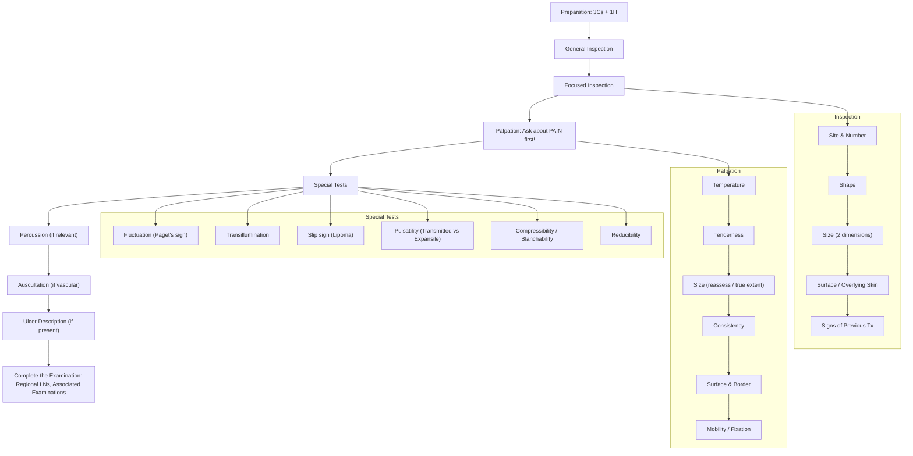

# Examination of Lumps and Bumps

## Master Examination Framework

---

## Preparation (3Cs + 1H)

This is your opening ritual — examiners will mark you down if you skip it, and it sets the professional tone.

- **Introduce yourself**: "Good morning, my name is Dr. ___, I am a medical student. May I know your name and date of birth?"
- **Consent**: "I would like to examine the lump on your [body part]. May I have your permission to do so?" 「我想檢查你身上嘅呢粒腫塊，可以嗎？」
- **Curtains/Chaperone**: "I will draw the curtains for your privacy. Would you like a chaperone present?"
- **Hand hygiene**: "Before I begin, I would like to wash my hands." / State: "I would wash my hands with alcohol gel."
- **Exposure**: Expose the area of complaint fully **and the contralateral side for comparison** [1][2]. For head/neck lesions, ***note especially to expose regions hidden by hair*** [1].
- **Positioning**: Comfortable position — sitting or supine depending on the lesion site. 「請你坐好/躺低，放鬆啲。」
- **Pain**: Ask the patient if there is any pain before you touch. "Is the lump painful at all?" 「呢粒嘢有冇痛㗎？」

<Callout title="Don't Forget" type="error">
Forgetting to ask about pain before palpation is one of the most common OSCE errors. Examiners specifically watch for this. Ask about pain BEFORE touching — not during.
</Callout>

---

## General Inspection

Before diving into the lump, take a step back and observe the patient and their environment. This shows clinical maturity and can pick up clues that change your entire differential.

**Bedside / Surroundings:**
- IV drip, O₂ supplementation, diet restriction signs, drain bags [2]
- Medications at bedside (e.g. antibiotics → abscess? Immunosuppressants?)

**Patient as a whole:**
- **General appearance**: Alert? Comfortable? In distress?
- **Body habitus**: Cachexic (think malignancy), obese (lipomas more common)
- **Vital signs**: Pulse, BP, temperature, RR (state you would check)
- **Hydration status**
- **Quick screen**: Pallor, jaundice, central cyanosis, lymphadenopathy (neck, axillae, groin), ankle oedema [2]

**Why this matters**: A cachexic patient with a hard, fixed lump and cervical lymphadenopathy is a very different clinical scenario from a well-nourished young person with a soft, mobile lump. The general inspection primes your diagnostic thinking.

**Model running commentary:**
> "On general inspection, the patient appears comfortable at rest, is of normal body habitus, and shows no signs of distress. There is no IV access, no oxygen supplementation, and no drains visible at the bedside. There is no obvious pallor, jaundice, or peripheral lymphadenopathy on first glance."

---

## Systematic Examination Sequence

### 1. Inspection

***Examine carefully from front, two sides, and back*** [1]. ***Identify all lesions first and describe the most prominent one in detail*** [1].

| Feature | What to Describe | Why It Matters |
|---|---|---|
| **Number** | Solitary vs. multiple | Multiple lesions → neurofibromatosis, metastases, lipomatosis |
| ***Site*** | ***With reference to anatomical landmarks*** [1][2] | Determines differential (e.g. midline neck = thyroglossal cyst) |
| **Shape** | Round, ovoid, hemispheric, exophytic, irregular | Simple geometric terms; irregular shapes raise malignancy concern |
| ***Size*** | ***By ruler/measuring tape in at least two dimensions*** [1] | Objective documentation; "approximately X cm by Y cm" |
| ***Surface / Overlying skin*** | Erythema, pigmentation, ***punctum*** (sebaceous cyst), smooth/rough, ulceration, telangiectasia, breach of skin integrity (ulcers, sinus) [1][2] | ***Punctum suggests the abnormality arises from an epidermal appendage*** [2]; ulceration suggests malignancy or abscess |
| **Signs of previous Tx** | Scars, radiotherapy markings | Recurrence? Previous excision? |
| **Discharge / bleeding** | Present or absent, type | Active infection, malignancy |

**Model running commentary:**
> "On inspection, there is a solitary, round lump on the posterior triangle of the neck, measuring approximately 3 cm by 2 cm. The overlying skin appears normal with no erythema, pigmentation, ulceration, punctum, or signs of previous treatment such as scars or radiotherapy markings. There is no visible discharge or bleeding."

**Cantonese instructions:**
- "Can you please show me the lump?" 「可唔可以俾我睇下粒嘢？」
- "Can you turn to the side for me?" 「可唔可以側一側身？」

---

### 2. Palpation

<Callout title="Golden Rule" type="error">
***Before starting to palpate, ask for pain!*** [1] "Does it hurt when I press? I'll be gentle." 「我㩒嘅時候會唔會痛？我會輕力啲。」
</Callout>

#### a) Temperature
- **How**: Palpate with the **dorsum** of your hand (dorsal skin is more sensitive to temperature) [2]. Compare with contralateral/surrounding skin.
- **Normal**: Same temperature as surrounding tissue.
- **Abnormal**: ***Warmth indicates active inflammation*** (e.g. abscess, infected cyst) [1][2].
- **Pathophysiology**: Inflammatory mediators cause local vasodilation → increased blood flow → warmth.

> "On palpation, the mass is not warm to touch compared with the surrounding skin."

#### b) Tenderness
- **How**: Gently press and observe the patient's face for grimace.
- **Normal**: Non-tender.
- **Abnormal**: ***Tenderness → active inflammation*** [1].
- **Pathophysiology**: Inflammatory mediators stimulate nociceptors. Acute abscess is tender; malignant masses are often painless unless invading nerves.

> "The mass is non-tender on palpation."

#### c) Size (reassess on palpation)
- **How**: ***Feel for induration in the region surrounding the lesion to delineate its true extent*** [1]. The palpable size may be larger than the visible size.
- **Why**: Surface inspection may underestimate depth/extent. Important for staging and surgical planning.

#### d) Consistency
- **How**: Press gently to assess the "feel" of the lump.

| Consistency | Suggests | Pathophysiology |
|---|---|---|
| ***Soft*** | ***Lipomas, fluid-filled cysts*** [1] | Adipose tissue is compressible; fluid conforms to pressure |
| ***Firm*** | ***Other benign lesions*** [1] | Fibrous tissue, organized structure |
| ***Hard*** | ***Malignant lesions*** [1] | Desmoplastic reaction — cancer cells stimulate dense collagen deposition |
| ***Bony hard*** | ***Calcification, bony tissues (e.g. exostosis)*** [1] | Calcium/bone matrix |

> "The consistency is firm."

#### e) Surface and Border
- **Surface**: Smooth / lobulated / rough / nodular [2]
- **Border (margins)**: ***Well-circumscribed vs. poorly defined (irregular)*** [2]
- **Why**: Well-defined borders suggest benign encapsulated lesions; poorly defined borders suggest infiltrative pathology (malignancy, inflammation).

> "The surface is smooth, and the borders are well-defined."

#### f) Mobility / Relationship to Surrounding Structures

This is a critical step that determines the layer of origin and whether the mass is fixed (invasion/fibrosis).

**i) General mobility:**
- **How**: ***Pinch the lump and try to move in all directions*** [1].
- **Findings**: ***Fully mobile (all directions) vs. mobile in certain directions vs. fixed and immobile*** [1].

**ii) Attachment to skin:**
- **How**: ***Try to pinch the skin above the lump*** [1].
- **If you CAN pinch skin**: Lesion is entirely subcutaneous (e.g. lipoma).
- **If you CANNOT pinch skin / skin moves with lump**: Lesion is attached to or arising from the skin (e.g. sebaceous cyst, dermatofibroma, malignancy invading skin).

**iii) Attachment to underlying muscle:**
- **How**: ***Ask the patient to contract the underlying muscle*** [1]. "Please tense your arm for me." 「請你用力握拳/收縮肌肉。」
- ***Intramuscular mass → disappears*** (hidden within contracted muscle belly) [1]
- ***Above muscle → becomes more prominent*** (pushed up by contraction) [1]
- ***Fixed to muscle → becomes less mobile*** (tethered) [1]

> "The mass is freely mobile in all directions. I can pinch the skin above it, suggesting it is subcutaneous. On contraction of the underlying muscle, the lump becomes more prominent, confirming it lies superficial to the muscle."

---

### 3. Percussion

***Only relevant in assessing retrosternal extension of goitre*** [1]. For most lumps and bumps, percussion is not performed.

- **How**: Percuss the upper sternum/manubrium.
- **Normal**: Resonant.
- **Abnormal**: Dull → retrosternal mass.

> "I would percuss the sternum to assess for retrosternal extension if this were a thyroid mass."

---

### 4. Auscultation

***Only done for vascular lesions*** [1].

- **How**: Place stethoscope over the lump; listen for bruit or continuous hum.
- **Normal**: No sounds.
- **Abnormal**: Bruit → arteriovenous malformation (AVM), aneurysm; vascular tumour (e.g. haemangioma, carotid body tumour).
- **Pathophysiology**: Turbulent flow through abnormal vascular channels or high-flow shunts produces audible murmurs.

> "I would auscultate over the lump if a vascular lesion is suspected."

---

### 5. Ulcer Description (If Present)

If the lump is ulcerated, you must describe the ulcer systematically [1]:

| Feature | What to Document | Key Associations |
|---|---|---|
| **Base** | Granulation tissue, slough, fascia, muscle, bone | Clean granulation = healing; slough = infection; bone = deep ulcer |
| ***Edge*** | ***Sloping (healing), punched out (ischaemic/syphilitic), undermined (TB), rolled (BCC), everted (SCC)*** [1] | Edge morphology is HIGH YIELD for diagnosis |
| **Discharge** | Serous, sanguinous, serosanguinous, purulent | Purulent = infection; bloody = malignancy/granulation |
| **Surrounding skin** | Erythema, induration, pigmentation, varicose veins | Lipodermatosclerosis = venous; pale/hairless = arterial |

<Callout title="Ulcer Edges - Exam Favourite" type="idea">
The morphology of the ulcer edge is one of the most commonly asked viva questions. Remember: **Rolled = BCC**, **Everted = SCC**, **Undermined = TB/infection**, **Punched out = ischaemia/neuropathy**, **Sloping = healing**.
</Callout>

---

## Special Tests

These are the tests that distinguish you from a student who just pokes and prods. Each test has a specific indication and mechanism.

### a) Fluctuation (Paget's Sign) — Fluid-Filled Lesions

- **Indication**: To determine if a lump contains fluid.
- **How**: ***Rest two fingers on opposite sides of the lump → press down on the middle of the lump → observe if the two fingers move apart*** [1][2].
- **Positive result**: Fingers move apart (fluid displaced sideways).
- **Confirm**: Repeat at 90° to the original axis to confirm true fluctuance (not just soft tissue displacement).
- **Pathophysiology**: Fluid within an enclosed space transmits pressure equally in all directions (Pascal's law). Solid masses do not.
- **Associated conditions**: Abscess, sebaceous cyst, ganglion, cystic hygroma.

> "I will now test for fluctuation using Paget's sign. I am placing two fingers on opposite sides and pressing down in the middle — the fingers are moving apart, which indicates the presence of fluid within the mass."

### b) Transillumination — Cystic Lesions with Clear Fluid

- **Indication**: To determine if a lump is cystic and contains clear/translucent fluid.
- **How**: Darken the room. Place a pen-torch on one side of the lump and observe from the other side for a red/pink glow.
- **Positive result**: Lump glows/transilluminates → fluid-filled cyst with clear/serous content.
- **Negative result**: No transillumination → solid mass, or fluid is opaque (blood, pus).
- **Pathophysiology**: Light passes through clear fluid but is blocked by solid tissue or turbid fluid.
- **Associated conditions**: Ganglion cyst, epididymal cyst, cystic hygroma, hydrocele.

> "I would like to transilluminate this mass using a pen-torch in a darkened room to assess if it contains clear fluid."

### c) Slip Sign — Lipoma

- **Indication**: Characteristic test for lipomas.
- **How**: ***Gently press the edge of the lump — it tends to slip away from the examining finger*** [1][3].
- **Positive result**: The lump "slips" or "squidges" away under gentle lateral pressure.
- **Pathophysiology**: Lipomas are encapsulated collections of adipose tissue surrounded by a thin fibrous capsule, sitting freely in subcutaneous fat. The smooth capsule and soft contents allow it to be easily displaced.
- **Note**: ***Lipoma — slip sign positive, NOT fixed to skin*** [3].

> "On gentle pressure, the lump slips away from my examining finger — a positive slip sign, consistent with a lipoma."

### d) Pulsatility — Vascular Lesions

- **Indication**: Any lump overlying or near a major vessel, or if you suspect a vascular origin.
- **How**: Place two fingers on opposite edges of the lump and feel the direction of pulsation.
- ***Transmitted pulsation: Fingers pushed in the same direction*** → the lump is sitting on top of an artery and merely transmitting its pulse [1].
- ***Expansile pulsation: Fingers pushed apart*** → the lump itself is of arterial origin (aneurysm) [1].
- **Pathophysiology**: An aneurysm expands in all directions with each systole; a mass simply lying on an artery only transmits the push unidirectionally.

> "I am placing two fingers on either side of the mass — the fingers are being pushed apart with each pulse, indicating an expansile pulsation consistent with an aneurysm."

### e) Compressibility (Blanchability) — Vascular Lesions

- **How**: ***Press on the lump — it disappears (blanches). On release, it reappears*** [1].
- **Positive result**: Disappears with pressure, refills on release.
- **Pathophysiology**: Vascular lesions (e.g. haemangioma) are filled with blood that can be displaced under pressure. Once pressure is removed, blood refills the channels.
- **Distinguish from reducibility**: Compressible lesions refill spontaneously; reducible lesions need an opposing force (gravity, cough) to reappear.

### f) Reducibility — Hernia

- **How**: ***Press on the lump — it disappears. It reappears with opposing force (e.g. standing, coughing, straining)*** [1].
- **Positive result**: Disappears on pressure, reappears with Valsalva/standing.
- **Pathophysiology**: Hernia contents (bowel, omentum) are pushed back through the defect into the abdomen; increased intra-abdominal pressure pushes them back out.

---

## Completing the Examination

Always state what you would do to complete the assessment — this shows the examiner you are thinking beyond the lump itself.

- ***Palpate the regional lymph nodes if malignant lesion is suspected*** [1]:
    - Head/neck lump → cervical LN chain
    - Upper limb lump → axillary and epitrochlear LNs
    - Breast lump → axillary and supraclavicular LNs
    - Lower limb lump → inguinal LNs
- **Examine the contralateral side** for comparison
- **Examine the drainage area** (e.g. for cervical lymphadenopathy: ***oral cavity, ENT, face and scalp, breast in females, chest and abdomen for supraclavicular nodes***) [4]
- **Other lymph node groups** and **hepatosplenomegaly** if lymphoma or systemic malignancy is suspected [4]
- **Neurovascular status distally** if the lump is compressing or adjacent to nerves/vessels

---

## Common Cases — Quick Reference

### Sebaceous (Epidermoid) Cyst
- ***50% punctum positive*** [3], ***fixed to skin*** [3], subcutaneous
- Smooth, well-defined, non-tender (unless infected)
- May have cheesy, foul-smelling discharge
- **Pathophysiology**: Blocked pilosebaceous duct → keratin accumulation

### Lipoma
- ***Slip sign positive*** [3], ***NOT fixed to skin*** [3], subcutaneous
- Soft, lobulated, well-defined, non-tender
- **Above muscle** → more prominent on contraction
- **Pathophysiology**: Encapsulated benign adipose tumour

### Ganglion Cyst
- ***Movable in one plane, more prominent upon contraction of tendon*** [3]
- Firm, transilluminates, typically over wrist/dorsum of hand
- **Pathophysiology**: Mucin-filled cyst arising from joint capsule or tendon sheath

---

## Expected Positive vs. Important Negative Findings

| Expected Positive Findings (examples) | Important Negatives to Document |
|---|---|
| Punctum (epidermoid cyst) | No overlying skin changes |
| Slip sign (lipoma) | Non-tender, no warmth |
| Fluctuance (cystic lesion) | No regional lymphadenopathy |
| Fixation to skin/deep structures (malignancy) | No ulceration or discharge |
| Expansile pulsatility (aneurysm) | Non-pulsatile |
| Transillumination (cyst with clear fluid) | No compressibility |

---

## Red-Flag Examination Findings and Escalation Triggers

🚩 **Hard, irregular, fixed mass with poorly defined borders** → malignancy until proven otherwise
🚩 **Rapidly enlarging lump** → malignancy, abscess
🚩 **Associated regional lymphadenopathy (hard, matted, non-tender)** → metastatic spread
🚩 **Overlying skin ulceration with everted/rolled edges** → SCC/BCC
🚩 **Expansile pulsation** → aneurysm (do NOT compress/manipulate — risk of rupture)
🚩 **Warm, tender, fluctuant mass with overlying erythema** → abscess requiring drainage
🚩 **Sudden onset of multiple seborrheic keratoses** (***Leser-Trélat sign***) → underlying visceral malignancy [5]

---

## Common OSCE Pitfalls

<Callout title="Common OSCE Pitfalls" type="error">

1. **Not asking about pain before palpation** — this is a safety issue and an automatic mark deduction.
2. **Not measuring the lump** — always use a ruler or tape measure; vague descriptions ("golf-ball sized") lose marks.
3. **Forgetting to test fixation** — attachment to skin and to underlying muscle are two separate tests; do both.
4. **Not examining the contralateral side** for comparison.
5. **Skipping special tests** — fluctuation, transillumination, slip sign are what differentiate a thorough candidate.
6. **Not offering to examine regional lymph nodes** to complete the examination.
7. **Describing findings out of order** — follow the systematic sequence: Inspection → Palpation → Special Tests → Completion.
8. **Not exposing the lesion adequately** (especially in hair-bearing areas).
</Callout>

---

## High-Yield Exam-Focused Interpretation Tips

- ***Punctum = epidermal appendage origin*** [2] — this immediately narrows your differential to sebaceous/epidermoid cyst.
- **Mobility determines layer**: Fixed to skin = dermal/epidermal; free from skin but above muscle = subcutaneous; disappears on contraction = intramuscular.
- **Consistency is a crude but powerful discriminator**: soft = benign/cystic; hard = worry about malignancy.
- **Fluctuation must be tested in TWO perpendicular planes** to be valid — one plane alone could be false positive from soft tissue wobble.
- ***Rolled edge = BCC; everted edge = SCC*** [1] — commit this to memory.
- **Transillumination negative does not mean "not cystic"** — blood and pus do not transilluminate.

---

## Model Reporting Script

> "On examination, Mr. Chan appears comfortable at rest, is of normal body habitus, and is alert. Vital signs are stable.
>
> On inspection of the right posterior triangle of the neck, there is a solitary, ovoid lump measuring approximately 3 cm by 2 cm. The overlying skin is normal — there is no erythema, pigmentation, ulceration, punctum, or scar. There is no visible discharge or bleeding.
>
> On palpation, the mass is not warm to touch and is non-tender. It is firm in consistency with a smooth surface and well-defined borders. The mass is mobile in all directions. I can pinch the overlying skin, suggesting it lies in the subcutaneous plane. On contraction of the underlying sternocleidomastoid, the lump becomes more prominent, confirming it is superficial to the muscle.
>
> Special tests: There is no fluctuation on Paget's sign. The mass does not transilluminate. The slip sign is negative. There is no pulsatility, compressibility, or reducibility.
>
> On examination of regional lymph nodes, there is no palpable cervical, supraclavicular, or axillary lymphadenopathy.
>
> In summary, this is a solitary, firm, well-defined, mobile subcutaneous neck mass with no overlying skin changes and no regional lymphadenopathy. The differential diagnosis includes a lipoma, dermoid cyst, or benign soft tissue tumour. I would recommend further investigation with ultrasound and possible fine-needle aspiration cytology."

---

<Callout title="High Yield Summary">

**Examination of lumps and bumps follows a strict sequence: Inspection → Palpation → Special Tests → Completion.**

**Inspection**: Number, Site, Shape, Size (measured), Surface/overlying skin, Signs of previous treatment.

**Palpation** (ask about PAIN first): Temperature, Tenderness, Size (reassess true extent), Consistency (soft/firm/hard/bony), Surface, Border, Mobility (to skin, to muscle, general).

**Special Tests**: Fluctuation (Paget's sign — test in 2 planes), Transillumination, Slip sign (lipoma), Pulsatility (transmitted vs expansile), Compressibility (vascular), Reducibility (hernia).

**Complete by**: Examining regional lymph nodes, contralateral side, and drainage area.

**Three classic cases**: Sebaceous cyst (punctum, fixed to skin), Lipoma (slip sign, mobile, NOT fixed to skin), Ganglion (prominent on tendon contraction, transilluminates).

**Red flags**: Hard + fixed + irregular borders + lymphadenopathy = think malignancy. Rolled edge = BCC. Everted edge = SCC.

</Callout>

---

<ActiveRecallQuiz
  title="Active Recall - Physical Exam"
  items={[
    {
      question: "What is Paget's sign and what does a positive result indicate?",
      markscheme: "Place two fingers on opposite sides of the lump, press down in the middle. Positive = fingers move apart, indicating the lump contains fluid (fluctuance). Must test in two perpendicular planes to confirm."
    },
    {
      question: "How do you differentiate transmitted from expansile pulsation, and why does it matter?",
      markscheme: "Transmitted: fingers pushed in same direction (mass overlying artery). Expansile: fingers pushed apart (mass IS arterial, e.g. aneurysm). Expansile pulsation suggests aneurysm — avoid vigorous manipulation."
    },
    {
      question: "A lump has a visible punctum. What does this suggest about its origin and what is the most likely diagnosis?",
      markscheme: "Punctum suggests the abnormality arises from an epidermal appendage. Most likely diagnosis is a sebaceous (epidermoid) cyst. The cyst is typically fixed to skin."
    },
    {
      question: "How do you test whether a lump is above, within, or fixed to the underlying muscle?",
      markscheme: "Ask the patient to contract the underlying muscle. Above muscle = lump becomes more prominent. Intramuscular = lump disappears. Fixed to muscle = lump becomes less mobile."
    },
    {
      question: "Describe the classic features of a lipoma on examination.",
      markscheme: "Soft, lobulated, well-defined, non-tender, positive slip sign, NOT fixed to skin (can pinch skin above), subcutaneous, becomes more prominent on muscle contraction (lies above muscle). Non-fluctuant, does not transilluminate."
    },
    {
      question: "What are the classic ulcer edge descriptions and their associated diagnoses?",
      markscheme: "Sloping = healing. Punched out = ischaemic or neuropathic ulcer. Undermined = TB or chronic infection. Rolled = BCC. Everted = SCC."
    }
  ]}
/>

## References

[1] Senior notes: Ryan Ho Fundamentals.pdf (Section 2.12: Examination of Lumps and Bumps, pp.158–160)
[2] Senior notes: felixlai.md (Section: Lumps and bumps examination)
[3] Senior notes: maxim.md (Section 2.3: Common short cases — Lumps and bumps)
[4] Senior notes: Ryan Ho Fundamentals.pdf (Section 2.13.2: Examination of Neck Masses, p.173)
[5] Senior notes: Ryan Ho Fundamentals.pdf (Section 2.12.1: Epidermal Masses — Seborrheic keratosis, p.160)
