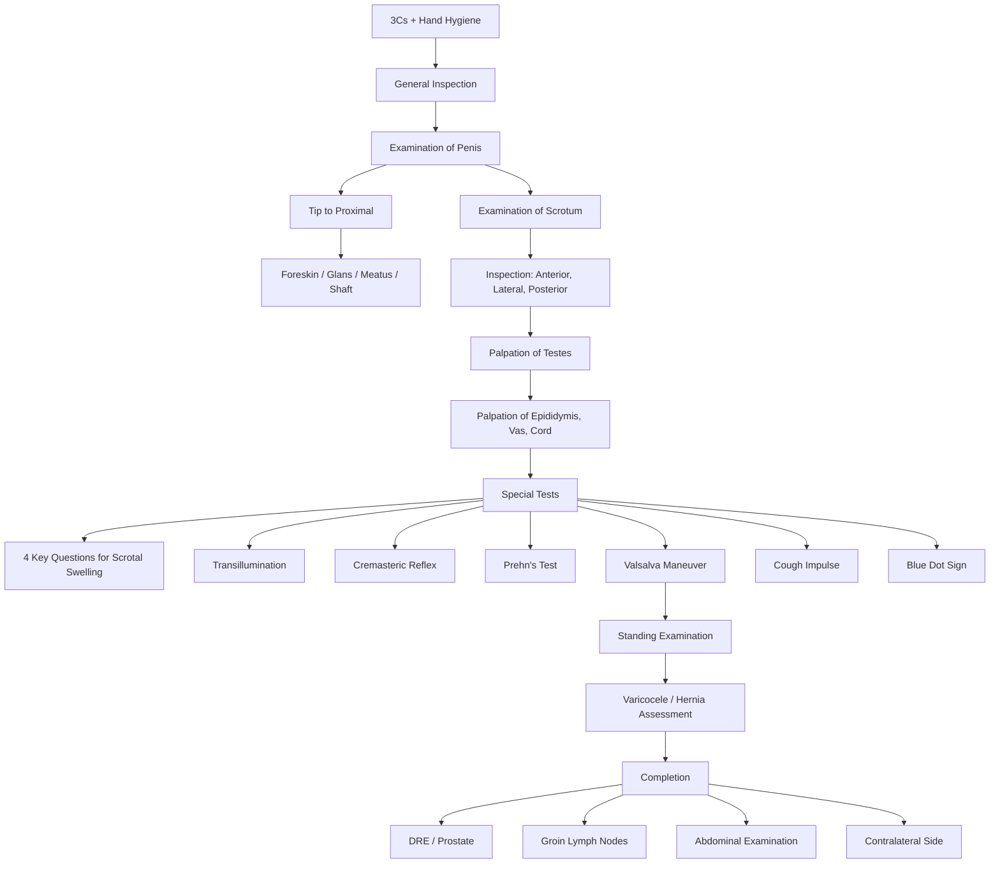

# Examination of Male Genitalia

## Master Examination Framework

---

## General Approach (3Cs + 1H)

Every HKUMed OSCE physical examination station begins the same way. This is non-negotiable — marks are explicitly allocated here.

1. **Introduce yourself**: "Good morning, my name is Dr [Name]. I am one of the doctors looking after you today."
2. **Confirm identity**: "May I confirm your name and date of birth?" 「請問你叫咩名，出生日期係幾時？」
3. **Consent**: "I would like to examine your genital area today. This may feel slightly uncomfortable, but I will be as gentle as possible. Is that okay?" 「我今日需要檢查你嘅下體部位，過程可能會有少少唔舒服，我會盡量輕手。你可唔可以呢？」
4. **Wash hands**: "Before I begin, I would like to wash my hands and put on a pair of gloves."

<Callout title="Chaperone" type="error">
Always offer a chaperone for genital examinations. In the OSCE, state: "I would like to have a chaperone present for this examination." This is a professional requirement and a commonly examined mark.
</Callout>

**Positioning and Exposure** [1][2]:
- **Position**: Lying supine initially. You will ask the patient to stand later.
- **Exposure**: Waist down — from the umbilicus to mid-thigh, with drapes available to cover areas not being actively examined.
- **Preparation**: Gloves, drapes, **penlight** (for transillumination).

**Cantonese instruction**: "Please lie flat on the bed and lower your trousers and underwear to your knees." 「請你平躺喺床上，將褲同底褲除落去膝頭位置。」

---

## General Inspection

Before touching the patient, stand at the end of the bed and systematically survey the environment and the patient.

### Bedside and Surroundings
- **Drains/catheters**: Urinary catheter (note colour of urine — frank haematuria? concentrated?), wound drains
- **IV lines, fluid bags**: May suggest active infection management (e.g. IV antibiotics for epididymo-orchitis)
- **Observation chart**: Fever (infection), tachycardia (pain/sepsis)
- **Mobility aids**: Wheelchair, walking stick — may suggest debilitation

### First Glance at the Patient
- **Distress level**: Is the patient writhing in pain (testicular torsion) or comfortable (chronic hydrocele)?
- **Body habitus**: Eunuchoid body proportions (hypogonadism), gynaecomastia (Klinefelter syndrome, liver disease, testicular tumour secreting β-hCG)
- **Skin**: Rash, bruising, swelling, erythema, hair loss in the genital region [1][2]

### Genital Region Inspection (Before Touching)
- **Scars** [1][2]:
  - *Inguinal (usually oblique)*: open hernia repair, inguinal orchiectomy, orchidopexy
  - *Scrotal (usually midline)*: simple orchiectomy
- **Obvious masses**: Groin lymph nodes, scrotal mass, hernia
- **Hair distribution**: Coarser than scalp hair [1][2]
  - Superior: abundant suprapubic region, may extend to umbilicus
  - Inferior: distributed around scrotum to anal orifice
  - Sparse/absent pubic hair → hypogonadism, Klinefelter syndrome

**Running commentary**: *"On general inspection, the patient appears comfortable at rest. There are no urinary catheters, drains, or IV lines at the bedside. I can see no obvious scars or swellings in the inguinal or scrotal region. The pubic hair distribution appears normal for a post-pubertal male."*

---

## Systematic Examination Sequence

### A. Examination of the Penis

The penis is examined **from tip to base** (distal to proximal) [1][2]. This is logical because the most clinically important structures (glans, meatus) are at the tip.

#### 1. Overall Inspection

- **Size, shape, skin changes**: Note any obvious abnormalities
- ***Peyronie's disease***: An acquired localized fibrotic disorder of the tunica albuginea → penile deformity, palpable plaque, pain ± erectile dysfunction [1][2]

**Why this matters**: Peyronie's can be a viva question — "What is this plaque on the shaft?" It's a fibrous plaque, not a tumour.

#### 2. Foreskin

- **Retract the foreskin** gently to inspect the glans 「我而家要輕輕推開你嘅包皮」
- ***Phimosis***: Inability to retract foreskin over the glans [1][2]
  - Pathophysiology: Fibrosis of the prepuce (can be physiological in children < 3y, or pathological from BXO/recurrent infection)
  - Normal: Foreskin retracts smoothly
  - Abnormal: Tight band preventing retraction → risk of urinary obstruction, paraphimosis, increased risk of penile carcinoma
- ***Paraphimosis***: Retracted foreskin cannot be returned to normal position [1][2]
  - Pathophysiology: Tight phimotic ring becomes trapped proximal to the glans → venous congestion → worsening oedema → arterial compromise
  - **This is a urological emergency** — can lead to glans ischaemia

<Callout title="ALWAYS Replace the Foreskin" type="error">
After examining the glans, you MUST replace the foreskin to its normal position. Failure to do so can cause iatrogenic paraphimosis. State this explicitly in the OSCE: "I am now replacing the foreskin to its original position." This is a classic OSCE pitfall. [1][2]
</Callout>

- **Smegma**: Dead skin cells and sebum trapped under foreskin — whitish material, commonly seen, usually benign [1][2]

#### 3. Glans Penis

- **Colour and texture**: Erythematous and dry if circumcised [1][2]
- **Abnormal growths**: eg. ***penile warts*** (condylomata acuminata — HPV 6, 11)
- **Ulcers** [1][2]:
  - *Tender ulcers*: HSV (grouped vesicles on erythematous base), chancroid (Haemophilus ducreyi — ragged undermined edges), Behçet's disease
  - *Non-tender ulcers*: SCC of penis, syphilitic chancre (single, clean, indurated base — primary syphilis)
  - **Why this matters**: The tender vs non-tender distinction is a classic OSCE viva question for differentiating penile ulcers.
- ***Balanitis***: Inflammation of the glans → erythema, discharge, ulceration [1][2]
  - Causes: Poor hygiene, Candida, Reiter's syndrome (reactive arthritis — triad of urethritis, conjunctivitis, arthritis)
- ***Balanitis xerotica obliterans (BXO)***: White scarring atrophic patches on glans/prepuce — associated with penile SCC [1][2]

**Running commentary**: *"I am now inspecting the glans penis. The foreskin retracts fully. There is no phimosis. The glans appears pink and moist with no ulceration, warts, or discharge. I am now replacing the foreskin."*

#### 4. Urethral Meatus

- **Position** [1][2]:
  - Normal: At the tip of the glans
  - ***Hypospadias***: Ventrally located opening, associated with hooded foreskin and ventral chordee
  - Epispadias: Dorsally located (rare, associated with bladder exstrophy)
- **Stenosis**: Narrowing of the meatus — may cause obstructive urinary symptoms
- **Warts, stones at opening** [1][2]
- **Express for discharge** [1][2]: Gently compress and strip the urethra from base to tip
  - *Purulent (yellow-green)*: Gonococcal urethritis
  - *Clear/mucoid*: Non-gonococcal urethritis (Chlamydia, Mycoplasma)
  - If history of discharge, always attempt to express fluid by milking the shaft [3]

**Cantonese instruction**: "I'm going to gently squeeze along your penis — please tell me if this is painful." 「我而家會沿住輕輕擠壓，如果痛請話畀我知。」

#### 5. Penile Shaft

- **Palpation**: Should be soft and free of nodularity [1][2]
  - Palpate for induration, plaques (Peyronie's), curvature, tenderness
  - ***Chordee***: Ventral curvature of the penis, may be associated with hypospadias [1][2]
- **Strip urethra**: For any discharge (as above) [1][2]

---

### B. Examination of the Scrotum

This is the most examined component in an OSCE. The approach is: **Inspection → Palpation → Special tests**.

#### Inspection

Inspect **anteriorly, laterally, and posteriorly** (lift the scrotum to see the posterior surface and perineum) [1][2].

- **Skin changes**: Rash, ulcers, erythema, sebaceous cysts [1][2]
  - *Angiokeratoma*: Small dark red/purple papules — common, benign, of no clinical significance [1][2]
  - *Tinea cruris*: Erythematous rash from fungal infection of moist groin skin [3]
  - *Scabies*: Burrows and excoriations [3]
- **Scrotal swelling/asymmetry**: Note side and degree
  - Left testis normally hangs slightly lower than the right [4]
- **Scrotal oedema**: Seen in severe cardiac failure, nephrotic syndrome, liver cirrhosis [3]
- ***Necrotic-looking tissue***: Must rule out **Fournier's gangrene** — a necrotizing fasciitis of the perineum/scrotum. This is a surgical emergency [1][2]
- ***Erythematous, oedematous, indurated scrotal wall***: Suggests acute inflammation — torsion, epididymo-orchitis [4]
- ***High-riding testis***: Testis sits higher than expected — classic for testicular torsion (shortening of cord from twisting) [4]
- ***Transverse lie***: Long axis of testis oriented transversely instead of longitudinally → ***bell-clapper deformity*** [4]
  - Pathophysiology: Testes lack normal posterior attachment to tunica vaginalis → increased mobility → predisposes to torsion. Usually bilateral.

**Running commentary**: *"On inspection of the scrotum, I can see both hemiscrotums. The left testis appears to sit slightly lower than the right, which is normal. There is no swelling, erythema, skin changes, or obvious masses. I will now lift the scrotum to inspect posteriorly — the perineum appears normal with no necrotic changes."*

#### Palpation of the Testes

**Always ask about pain before palpating**: "Does it hurt anywhere? I'll start with the side that doesn't hurt." 「有冇邊度痛？我會由唔痛嗰邊開始檢查。」

**Method** [1][2]:
- Palpate gently using fingers and thumb of the right hand
- Cradle the testis with the right middle and index fingers posteriorly, and palpate with the ipsilateral thumb anteriorly
- **Palpate the entire testicular surface** by gently rolling it between thumb and forefingers [4]

**What to assess**:
- **Size**: Normal adult testis ~ 4 × 3 × 2.5 cm (15–25 mL by orchidometer)
  - Equal bilaterally
  - *Small firm testes*: Hypogonadotropic hypogonadism or testicular atrophy (alcohol, drugs, Klinefelter) [1][2]
  - *Contralateral testicular hypertrophy*: Soft sign that the other testis is absent or atrophic [4]
- **Surface**: Smooth
- **Consistency**: Relatively firm, homogeneous [5]
  - *Hard, nodular, irregular*: Testicular tumour [5]
- **Tenderness**: Non-tender normally
  - *Exquisitely tender*: Testicular torsion, acute epididymitis, torsion of testicular appendix, mumps orchitis [1][2]
- **Mobility**: Freely mobile within tunica vaginalis [5]
- **Absence of testis**: Previous orchiectomy, undescended testis (cryptorchidism), retractile testis [1][2]
  - Undescended testis may be palpable in the inguinal canal at or above the inguinal ring
  - In children, testis may retract as examination begins due to a marked **cremasteric reflex** (max at ~3–8y), usually resolves in puberty [1][2]

<Callout title="Testicular Examination Requires Two Hands for Undescended Testes" type="idea">
For suspected undescended testes: one hand is placed near the ASIS and swept along the inguinal canal; the other hand palpates the scrotum. This "milking" technique expresses any retained testicular tissue into the scrotum. Hands can be lubricated with warm soapy water ("soap test") to reduce friction. [4]
</Callout>

**Running commentary**: *"I am now palpating the right testis. It is approximately normal in size, smooth in surface, firm in consistency, non-tender, and freely mobile. I can distinguish it from the epididymis posteriorly. I will now examine the left testis in the same manner."*

#### Palpation of Other Scrotal Structures

- **Epididymis** [1][2]: Located at the posterior aspect of the testis
  - Palpate upwards along the testicular-epididymal groove to distinguish testicular from epididymal masses
  - *Tender, swollen epididymis*: Epididymitis — most common cause of acute scrotal pain in adults > 18y
  - *Firm, non-tender epididymis*: TB epididymitis (may have associated "beading" of the vas) [6]
  - *Soft, fluctuant, transilluminable mass at epididymal head*: Epididymal cyst / spermatocele [6]

- **Vas deferens and spermatic cord** [1][2]:
  - Palpate along the cord — note any mass, tenderness, thickening
  - Absent vas deferens: Think cystic fibrosis (congenital bilateral absence of vas deferens — CBAVD)
  - ***"Bag of worms" texture***: Varicocele (dilated pampiniform plexus) [6]

---

### C. Special Tests and the Four Key Questions for Scrotal Swelling

When a scrotal mass is identified, you need to systematically answer **four questions** [1][2][6]:

| Question | How to Assess | What It Tells You |
|---|---|---|
| **1. Is the swelling tender?** | Ask and palpate gently | Tender = torsion, epididymitis, strangulated hernia |
| **2. Can you get above it?** | Palpate the superior margin of the mass at the superficial inguinal ring (1 cm above and lateral to pubic tubercle) | Cannot get above → inguinoscrotal hernia or communicating hydrocele. Can get above → confined to scrotum |
| **3. Is it separable from testis?** | Feel along the testicular-epididymal groove | Inseparable = testicular origin (tumour, hydrocele, torsion). Separable = epididymal, vas, skin origin |
| **4. Does it transilluminate?** | Darken room, hold penlight behind mass | Transilluminates = fluid (hydrocele, epididymal cyst). Opaque = solid (tumour, haematocele) |

#### Special Test 1: Transillumination Test

- **Technique**: In a darkened room, place the penlight against the posterior aspect of the scrotal swelling. Observe from the anterior side whether light passes through.
- **Positive result**: The swelling glows red/pink → fluid-filled → **hydrocele** or **epididymal cyst** [4][6]
- **Negative result**: The swelling is opaque → solid → **testicular tumour**, haematocele, TB epididymitis
- **Mechanism**: Serous fluid transmits light; solid tissue, blood, and thick pus do not.
- **Pitfall**: A large hydrocele can mask an underlying testicular tumour — always request USG if a hydrocele is confirmed clinically.

**Running commentary**: *"I am now performing transillumination. Using the penlight behind the swelling in a darkened room… the swelling transilluminates brightly, which is consistent with a fluid-filled structure such as a hydrocele."*

#### Special Test 2: Cremasteric Reflex

- **Technique**: Stroke or gently pinch the skin of the upper inner thigh (over the femoral triangle) [1][2][7]
- **Positive (normal)**: Ipsilateral testis elevates due to cremasteric muscle contraction
- **Negative (abnormal)**: **Absence of ipsilateral cremasteric reflex → highly suggestive of testicular torsion** [4][7]
- **Mechanism** [1][2]:
  - The genitofemoral nerve (L1-L2) has two branches:
    - **Femoral branch** (sensory): Supplies skin over the upper thigh
    - **Genital branch** (motor): Supplies the cremasteric muscle
  - Stroking the thigh → activates the femoral branch → reflex arc → stimulates genital branch → cremasteric muscle contraction → testis elevates
  - In testicular torsion, the genital branch is twisted/ischaemic → reflex arc is broken → absent cremasteric reflex
- **Clinical utility**: Present in majority of children aged 30 months to 12 years; less consistent in infants and teenagers [1][2]. Absence is **reliably associated with torsion** in the appropriate clinical context.
- **Sensitivity**: ~99% for detecting torsion when absent (i.e. almost all torsions have absent reflex), but specificity is lower as it can be absent in other conditions or normal individuals < 30 months [4]

#### Special Test 3: Prehn's Test (Prehn's Sign)

- **Technique**: Gently elevate the affected testis and scrotum with your hand [1][2]
- **Positive result (pain relieved)**: Suggests **epididymitis** — elevation improves venous drainage and reduces congestion
- **Negative result (pain unchanged or worsened)**: Suggests **testicular torsion** — elevation further twists the cord or does not relieve ischaemic pain
- **Mechanism**: In epididymitis, pain is inflammatory/congestive; elevation aids venous return. In torsion, the pain is ischaemic; elevation does not address the mechanical twist.

<Callout title="Prehn's Test Reliability" type="error">
Prehn's test is **NOT reliable** enough to be used as the sole differentiator between torsion and epididymitis [4]. It should never delay surgical exploration when torsion is clinically suspected. It is, however, still expected in the OSCE examination sequence.
</Callout>

#### Special Test 4: Blue Dot Sign

- **Technique**: Inspect the scrotum carefully, particularly the anterosuperior aspect, in a well-lit room
- **Positive result**: A small blue/dark discolouration visible through the scrotal skin [4]
- **Significance**: Indicates **torsion and infarction of the appendix testis** (a müllerian remnant on the anterosuperior pole of the testis)
- **Sensitivity**: Only present in ~21% of cases [4] — low sensitivity, but highly specific when present
- **Mechanism**: The appendix testis is a pedunculated structure that twists on its own pedicle → venous congestion → infarction → appears as blue-black dot through thin scrotal skin

#### Special Test 5: Valsalva Maneuver (for Varicocele)

- **Technique**: With the patient **standing**, ask him to bear down as if straining to pass stool 「請你好似去大便咁用力谷」
- **Positive result**: A varicocele becomes more prominent or palpable during Valsalva [6]
- **Mechanism**: Valsalva increases intra-abdominal pressure → increases retrograde flow in incompetent testicular veins → distends the pampiniform plexus
- **Grading of varicocele** [4]:
  - ***Grade 1 (small)***: Palpable only with Valsalva maneuver
  - ***Grade 2 (moderate)***: Non-visible on inspection but palpable upon standing (without Valsalva)
  - ***Grade 3 (large)***: Visible on gross inspection ("bag of worms")

**Key clinical points about varicocele** [4]:
- **85–95% are left-sided** — because the left spermatic vein enters the left renal vein at a perpendicular 90° angle (vs. the right entering the IVC at an obtuse angle), and the left renal vein is compressed between the aorta and SMA (***"nutcracker effect"***)
- ***A left varicocele that does NOT disappear when supine → must rule out renal masses or left renal vein thrombosis*** [1][2] (the mass obstructs venous outflow)
- ***A unilateral right varicocele is rare and should prompt investigation for IVC obstruction (e.g. RCC with IVC extension)*** [4]

#### Special Test 6: Cough Impulse (for Hernia)

- **Technique**: With the patient standing, place your finger over the superficial inguinal ring (1 cm above and lateral to pubic tubercle). Ask the patient to cough 「請你咳一下」
- **Positive result**: A palpable impulse felt at the fingertip → **inguinal hernia** with scrotal extension [6]
- **Mechanism**: Coughing increases intra-abdominal pressure → forces abdominal contents into the hernia sac → transmits as a palpable impulse
- **Why this matters**: An inguinoscrotal hernia is the most important differential for "cannot get above the swelling" — as opposed to a communicating hydrocele

---

### D. Standing Examination

At the end of the scrotal examination, **ask the patient to stand** [1][2]. 「而家請你企起身」

This is essential because:
- **Hernias** may only appear in the standing position (reduced when supine) [1][2]
- **Varicoceles** are best assessed standing — bag-of-worms texture over the posterior scrotum [1][2]
- Varicocele may be associated with a **horizontal lie** of the ipsilateral testis [1][2]

**Running commentary**: *"I would now like to ask the patient to stand. Standing, I am inspecting the inguinal regions bilaterally for any swelling or cough impulse. I am palpating the spermatic cord — there is no bag-of-worms texture suggestive of varicocele on either side."*

---

## Completion of Examination

State clearly: **"To complete my examination, I would like to..."** [1][2]

1. **Per-rectal examination (DRE)**: To assess the prostate and seminal vesicles
   - Prostate: Size, consistency (smooth vs nodular), tenderness
   - Prostatomegaly → BPH
   - Hard, irregular, non-tender prostate → prostate carcinoma
   - Tender, boggy prostate → acute prostatitis

2. **Examine the groin lymph nodes** [1][2]:
   - ***Groin LNs drain the scrotal skin and penis ONLY***
   - ***Testes drain along their vascular supply to para-aortic nodes*** — NOT to inguinal nodes
   - Therefore, inguinal lymphadenopathy in the context of a testicular mass suggests skin/penile pathology, NOT testicular metastasis

3. **Abdominal examination** [5]:
   - Para-aortic lymphadenopathy (testicular tumour staging)
   - Renal masses (especially left RCC causing left varicocele)
   - Palpable bladder (obstruction)

4. **Examine the contralateral side** (if not already done)

5. **Urinalysis**: Dipstick for haematuria, pyuria, nitrites

---

## Summary Table: Scrotal Swellings — Key Differentiating Features

| Condition | Tender? | Get Above? | Separable from Testis? | Transilluminates? | Other Features |
|---|---|---|---|---|---|
| **Hydrocele** | No | Yes | No (surrounds testis) | **Yes** | Smooth, fluctuant |
| **Epididymal cyst** | No | Yes | **Yes** | **Yes** | At head of epididymis |
| **Testicular tumour** | No | Yes | No | No | Hard, irregular, non-tender |
| **Varicocele** | No (dull ache) | Yes | Yes | No | Bag of worms, ↑ standing, ↓ supine |
| **Inguinoscrotal hernia** | ± | **No** | Yes | ± (bowel may transilluminate) | Cough impulse +ve, reducible |
| **Testicular torsion** | **Yes** | Yes | No | No | High-riding, transverse lie, –ve cremasteric reflex |
| **Epididymitis** | **Yes** | Yes | Yes (early) / No (late) | No | Prehn's +ve, fever, pyuria |
| **Torsion of appendix testis** | Yes | Yes | No | No | Blue dot sign |

---

## Expected Positive and Negative Findings to Document

### Positive Findings (Condition-Specific Examples)
- Testicular torsion: Tender, high-riding testis, transverse lie, absent cremasteric reflex, negative Prehn's test
- Testicular tumour: Hard, non-tender, irregular testicular mass, inseparable from testis, does not transilluminate, para-aortic lymphadenopathy
- Hydrocele: Non-tender, cannot separate from testis, can get above it, transilluminates brightly
- Varicocele: Bag-of-worms texture, ↑ with Valsalva/standing, left-sided, decompresses supine

### Important Negatives to Document
- No contralateral abnormality
- No inguinal lymphadenopathy
- No urethral discharge
- No scrotal skin necrosis (rules out Fournier's gangrene)
- No abdominal masses
- Normal cremasteric reflex bilaterally

---

## Red-Flag Examination Findings and Escalation Triggers

| Finding | Concern | Action |
|---|---|---|
| ***Absent cremasteric reflex + acute tender high-riding testis*** | **Testicular torsion** | Immediate surgical exploration — do NOT delay for imaging |
| ***Paraphimosis (foreskin trapped behind glans)*** | Glans ischaemia | Urgent manual reduction or dorsal slit |
| ***Scrotal/perineal necrosis with crepitus*** | **Fournier's gangrene** | Emergency surgical debridement + IV broad-spectrum antibiotics |
| ***Hard, painless testicular mass in young man*** | **Testicular cancer** | Urgent scrotal USS + tumour markers (AFP, β-hCG, LDH) |
| ***New right-sided varicocele or varicocele not decompressing supine*** | **IVC obstruction / renal mass** | CT abdomen to rule out RCC with IVC extension [4] |
| ***Bilateral undescended testes*** | Disorders of sex development | Karyotype + endocrine workup |

---

## Common OSCE Pitfalls

<Callout title="Common OSCE Pitfalls" type="error">

1. **Forgetting to replace the foreskin** after examining the glans — can cause iatrogenic paraphimosis [1][2]
2. **Not offering a chaperone** — this is a professionalism mark
3. **Not asking about pain before palpating** — always ask first, always start with the normal/non-painful side
4. **Forgetting to stand the patient** at the end — you will miss varicoceles and hernias [1][2]
5. **Not attempting transillumination** — a key special test that differentiates fluid from solid
6. **Confusing lymphatic drainage**: Testes → para-aortic nodes (NOT inguinal). Scrotal skin and penis → inguinal nodes [1][2]
7. **Not performing the cremasteric reflex** in an acute scrotum scenario — a make-or-break test for torsion
8. **Examining too roughly** — the testes are exquisitely sensitive; always be gentle
9. **Not checking the contralateral testis** — bilateral pathology is possible (bell-clapper deformity is often bilateral)
10. **Not mentioning DRE** as a completion step
</Callout>

---

## High-Yield Exam-Focused Interpretation Tips

- **"Why is the cremasteric reflex absent in torsion?"** → The genital branch of the genitofemoral nerve (motor arm of the reflex arc) runs through the spermatic cord and is twisted/ischaemic in torsion [1][2]
- **"Why are varicoceles more common on the left?"** → Left testicular vein enters the left renal vein at 90° (vs. right entering IVC at obtuse angle) + nutcracker effect (compression between aorta and SMA) [4]
- **"Why does a testicular tumour not transilluminate?"** → Solid tissue is opaque to light; only serous fluid transmits light
- **"Why must inguinal orchiectomy be performed via an inguinal incision, not scrotal?"** → To clamp the spermatic cord before mobilizing the testis, preventing tumour seeding along the testicular vein; scrotal incision would violate the scrotal skin drainage field and risk inguinal node metastasis [6]
- **"What does 'cannot get above the swelling' mean?"** → The mass extends into the inguinal canal → either inguinoscrotal hernia or communicating hydrocele
- **"How do you differentiate retractile from truly undescended testis?"** → Hold the testis in the dependent scrotum for ≥ 1 minute to fatigue the cremasteric muscle. A retractile testis remains in the scrotum; an ectopic/undescended testis immediately springs back out [4]

---

## Model Reporting Script

> *"On examination, Mr Chan is a young gentleman who appears comfortable at rest. Vitals are stable with no fever.*
>
> *On general inspection, there are no catheters, drains, or IV lines. No scars are seen in the inguinal or scrotal regions. Pubic hair distribution is normal.*
>
> *On inspection of the penis, the foreskin retracts fully with no phimosis. The glans is pink and moist with no ulceration, warts, or balanitis. The urethral meatus is normally positioned at the tip with no hypospadias. No urethral discharge is expressed on stripping.*
>
> *On inspection of the scrotum, there is a visible swelling on the left hemiscrotum. The left testis appears to sit higher than the right, and the long axis is oriented transversely. The overlying skin is erythematous and oedematous.*
>
> *On palpation, the left testis is exquisitely tender, firm, and swollen. I am unable to distinguish it from the epididymis. The right testis is normal in size, smooth, firm, non-tender, and freely mobile with a normal epididymis and vas deferens.*
>
> *On special testing, the cremasteric reflex is absent on the left and present on the right. Prehn's test does not relieve pain on the left. There is no blue dot sign. Transillumination is negative bilaterally.*
>
> *Standing, there are no hernias or varicoceles bilaterally.*
>
> *To complete, I would perform a DRE and examine the inguinal lymph nodes, which on initial inspection appear non-enlarged.*
>
> *In summary, the findings of an acutely tender, high-riding left testis with a transverse lie, absent cremasteric reflex, and negative Prehn's test are highly consistent with **left testicular torsion**. I would recommend urgent surgical exploration without delay for imaging."*

---

<Callout title="High Yield Summary">

**The 4 Questions for Scrotal Swelling**: Tender? Get above it? Separate from testis? Transilluminate?

**Cremasteric reflex** is the single most important test in the acute scrotum — absent in torsion (genital branch of genitofemoral nerve L1-2 is compromised).

**Always replace the foreskin** after examination.

**Varicocele**: Left-sided predominance (nutcracker effect, 90° angle of left testicular vein). Right-sided or non-decompressing varicocele → rule out RCC/IVC obstruction.

**Testicular tumour**: Hard, non-tender, inseparable from testis, does not transilluminate. Perform inguinal (NOT scrotal) orchiectomy. Drains to para-aortic nodes, NOT inguinal nodes.

**Groin LNs drain scrotal skin and penis; testes drain to para-aortic nodes.**

**Standing examination is essential** — do not skip it. Varicoceles and hernias are missed supine.
</Callout>

---

<ActiveRecallQuiz
  title="Active Recall - Physical Exam"
  items={[
    {
      question: "What are the four key questions to answer when examining a scrotal swelling?",
      markscheme: "1. Is it tender? 2. Can you get above it? 3. Is it separable from the testis? 4. Does it transilluminate?",
    },
    {
      question: "Describe the mechanism of the cremasteric reflex and why it is absent in testicular torsion.",
      markscheme: "Genitofemoral nerve L1-L2: femoral branch (sensory, upper thigh skin) and genital branch (motor, cremasteric muscle). Stroking the thigh activates the sensory arm, reflexively contracting the cremaster to elevate the testis. In torsion, the genital branch is twisted within the spermatic cord and becomes ischaemic, abolishing the motor limb of the reflex.",
    },
    {
      question: "Why are varicoceles more common on the left side?",
      markscheme: "Left testicular vein enters the left renal vein at a perpendicular 90-degree angle (vs right entering IVC at obtuse angle), and the left renal vein is compressed between the aorta and SMA (nutcracker effect), increasing venous pressure and causing retrograde flow and valve incompetence.",
    },
    {
      question: "Where do the testes drain lymphatically, and why is this clinically important?",
      markscheme: "Testes drain to para-aortic lymph nodes (along gonadal vessels), NOT to inguinal nodes. Inguinal nodes drain scrotal skin and penis only. This is why testicular tumours are managed with inguinal orchiectomy (not scrotal approach) and retroperitoneal lymph node dissection. Inguinal lymphadenopathy with a testicular mass suggests scrotal skin or penile pathology, not testicular metastasis.",
    },
    {
      question: "What is the blue dot sign and what does it indicate?",
      markscheme: "A blue-black discolouration visible through the scrotal skin at the anterosuperior pole of the testis, indicating torsion and infarction of the appendix testis (a mullerian remnant). Present in only about 21% of cases - low sensitivity but highly specific when present.",
    },
    {
      question: "After retracting the foreskin for examination, what must you always do and why?",
      markscheme: "Always replace the foreskin to its normal position after examination. Failure to do so can cause iatrogenic paraphimosis, where the tight phimotic ring becomes trapped proximal to the glans, causing venous congestion, progressive oedema, and potentially arterial compromise and glans ischaemia - a urological emergency.",
    },
  ]}
/>

---

## References

[1] Senior notes: Ryan Ho Fundamentals.pdf (p156–158, Section 2.11 Examination of Male Genitalia)
[2] Senior notes: Ryan Ho Urogenital.pdf (p228–231, Section 11.1 Examination of Male Genitalia)
[3] Senior notes: Ryan Ho Urogenital.pdf (p4, Section 1.1 Examination of Urological System; p117, Section C Examination of Male Genitalia; p243, Physical examination of STI)
[4] Senior notes: felixlai.md (Sections on testicular torsion, undescended testes, varicocele)
[5] Senior notes: felixlai.md (Section on testicular examination for testicular cancer)
[6] Senior notes: maxim.md (Scrotal exam, benign scrotal conditions, radical inguinal orchidectomy)
[7] Senior notes: Ryan Ho Neurology.pdf (p28, Cremasteric reflex L1-2)
