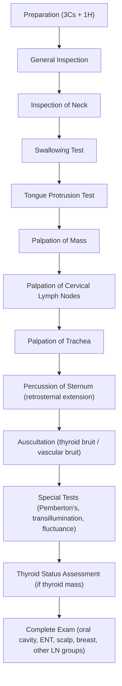

# Examination of Neck Masses

## Master Examination Framework

---

## 1. Preparation

**Running commentary:** *"Hello, my name is Dr Chan. I am a medical student. May I examine your neck today? I will need to expose your neck, upper chest and look at a few other areas as well. Please let me know if you experience any discomfort at any time. I would like to wash my hands first."*

| Step | Detail |
|:-----|:-------|
| **Introduce yourself** | State name and role |
| **3Cs** | **Consent** – explain procedure; **Curtains** – ensure privacy; **Chaperone** – offer if appropriate |
| **1H** | **Hand hygiene** – state you would wash your hands / use alcohol gel |
| **Positioning** | ***Sitting upright on a chair*** – this is the standard position for neck examination [1][2] |
| **Exposure** | ***Entire neck, upper chest including sternum, clavicles*** – ensure the patient is adequately exposed but dignified; ask female patients to lower their clothing to expose the clavicles while maintaining modesty [1][2] |
| **Equipment** | A **glass of water** should be available for the swallowing test, a pen torch for transillumination [1][2] |

**Cantonese:** "我需要檢查你嘅頸部，可以坐直啲嗎？" (*I need to examine your neck; can you sit up straight?*)

---

## 2. General Inspection

**Why:** Before touching the patient, gather visual clues about the underlying aetiology (thyroid disease, malignancy, infection, systemic illness).

**Running commentary:** *"On general inspection, the patient is sitting comfortably on a chair without any dyspnoea. On greeting the patient, there is no hoarseness of voice. On shaking the patient's hand, there is no palm sweating. There are no obvious eye signs and the patient does not appear nervous or agitated."* [1]

### Bedside and First Glance

| What to look for | Significance |
|:-----------------|:-------------|
| O₂ therapy, IV lines, drains | Suggests recent surgery or acute illness |
| Sputum jar, inhalers | Respiratory comorbidity |
| Diet restriction card | Post-operative nil-by-mouth |
| General appearance: cachexia vs obese | Cachexia → malignancy; obesity → common in MNG |
| ***Hoarseness*** when speaking | ***Recurrent laryngeal nerve (RLN) involvement by thyroid malignancy or other cervical malignancy*** [1][2][3] |
| Palm sweating on handshake | Hyperthyroidism |
| Obvious eye signs (stare, proptosis) | Graves' ophthalmopathy |
| Nervousness / agitation | Thyrotoxicosis |
| Vital signs: pulse, BP, RR, temperature | Tachycardia / AF → thyrotoxicosis; fever → infection/abscess |

<Callout title="Don't Forget the Handshake" type="idea">
The handshake is a classic HKUMed opening move — it simultaneously assesses palm sweating (hyperthyroidism), peripheral perfusion, tremor, and allows you to observe the patient's face for eye signs at close range. [1]
</Callout>

---

## 3. Inspection of the Neck

**Patient instruction:** "Please tilt your head back slightly for me." 「請將頭微微向後仰」

**Running commentary:** *"On inspection of the neck, there is an obvious right-sided/left-sided/midline/diffuse neck mass. There are no overlying skin changes, no scars, no dilated veins, and no other visible neck masses."* [1]

### What to inspect for:

| Feature | How to Assess | Normal | Abnormal | Pathophysiology |
|:--------|:-------------|:-------|:---------|:----------------|
| ***Site of mass*** | Note anatomical location: midline, anterior triangle, posterior triangle, supraclavicular | No visible mass | Visible swelling | Location narrows differential (see Localization Table below) [2][3] |
| ***Scars*** | Look for **Kocher's (collar) incision** – horizontal incision 2 finger-breadths above suprasternal notch | No scar | Thyroidectomy scar | Previous thyroid surgery |
| ***Overlying skin changes*** | Erythema, ulceration, sinus, punctum, post-irradiation marks | Normal skin | Erythema → acute inflammation/suppurative thyroiditis; radiation marks → previous radiotherapy; ulceration → malignant infiltration [1][2] | Inflammatory mediators cause vasodilation and erythema; radiation fibrosis from prior Tx |
| ***Dilated neck veins / facial plethora*** | Inspect for distended veins in neck and upper chest | No venous distension | Thoracic inlet obstruction → retrosternal goitre, SVCO from malignancy [1] | Retrosternal mass compresses SVC/innominate veins, impeding venous return |
| Number of masses | Count visible lumps | None | Multiple → MNG or multiple lymph nodes | — |

### ***Localization of Neck Masses by Site*** [2][3]

| Location | Differential Diagnoses |
|:---------|:----------------------|
| ***Midline (Central)*** | ***Thyroid nodule (isthmus), thyroglossal cyst, dermoid cyst, ranula, Level I lymph node*** |
| ***Anterior triangle*** | ***Thyroid nodule, branchial cleft cyst, carotid body tumour (chemodectoma), carotid artery aneurysm, laryngocele, submandibular gland mass*** |
| ***Posterior triangle*** | ***Level II–IV lymph nodes, schwannoma, cystic hygroma, cervical rib*** |
| ***Supraclavicular*** | ***Level V lymph node (from NPC), supraclavicular lymph node – malignancy metastasizing from below the clavicle (GI, lung, gynaecological)*** |

<Callout title="Virchow's Node (Troisier's Sign)" type="error">
A ***left supraclavicular lymph node*** (Virchow's node) is a classic examination finding for intra-abdominal malignancy (especially gastric cancer). This drains via the thoracic duct. Students often forget to check the supraclavicular fossa — always palpate there! [2][3]
</Callout>

---

## 4. Swallowing Test (Inspection Phase)

**Why:** The thyroid gland is enclosed within the ***pretracheal fascia***, which is anchored to the trachea. Therefore, thyroid masses (and thyroglossal cysts) will ***move upward with swallowing***. Non-thyroid masses (e.g. lymph nodes, branchial cysts) will not. [1][2]

**Patient instruction:** "Please hold this water in your mouth, and when I say 'now', please swallow." 「請含住啲水喺口入面，我話"吞"嘅時候你就吞落去」

**Running commentary:** *"I would like a glass of water to test if the mass is thyroid in origin. The mass moves up with swallowing. This is likely to be thyroid in origin."* [1]

| Finding | Interpretation |
|:--------|:-------------|
| Mass moves up with swallowing | Thyroid mass or thyroglossal cyst |
| Mass does NOT move with swallowing | Non-thyroid origin (lymph node, branchial cyst, salivary gland, etc.) |

---

## 5. Tongue Protrusion Test

**Why:** A ***thyroglossal cyst*** is a remnant of the thyroglossal duct (the embryonic tract from the foramen caecum to the thyroid). The tract is intimately associated with the ***hyoid bone***. Protruding the tongue pulls on the hyoid via the genioglossus and hyoglossus muscles, which transmits movement to the cyst. [1][2]

**When to do it:** When the mass is ***at or near the level of the hyoid bone***, usually a ***midline, discrete, slightly left-of-midline swelling***. [1]

**How to perform:**
1. Ask the patient to open their mouth
2. Place two fingers just above the swelling
3. Ask the patient to stick out their tongue 「請伸出舌頭」
4. Feel for upward movement of the mass (positive = "puckering")

**Running commentary:** *"Since the mass is located near the hyoid bone, I would like to test for thyroglossal cyst. I will place two fingers above the swelling and ask the patient to protrude their tongue. (Tests.) The mass moves upward with tongue protrusion, which is consistent with a thyroglossal cyst."* [1]

| Finding | Interpretation |
|:--------|:-------------|
| Mass moves up with tongue protrusion (+ve puckering) | ***Thyroglossal cyst*** |
| No movement | Not thyroglossal cyst |

---

## 6. Palpation

<Callout title="Always Ask for Pain First!" type="error">
***Before touching the patient, always ask: "Is there any pain or tenderness in your neck?"*** 「你頸部有冇痛嘅地方？」 This is a perennial OSCE pitfall — forgetting to ask causes unnecessary patient distress and loses marks. [1][2]
</Callout>

### 6A. Palpation of the Mass

**Position:** Stand ***behind*** the patient. Gently tilt the patient's head slightly forward to relax the anterior neck muscles (sternocleidomastoid and strap muscles). [1]

**Patient instruction:** "I'm going to feel your neck now. Please let me know if anything is sore." 「我而家會摸你嘅頸，如果有任何唔舒服請話畀我知」

**Running commentary:** *"I would now proceed to palpation of the neck. There is a mass in the right anterior triangle. It is approximately 3 cm × 2 cm, firm in consistency, with a smooth surface, well-defined borders, non-tender, and not attached to the skin or underlying structures. It moves with swallowing."* [1]

#### ***Mass characterization framework*** [1][2][3][4]

| Parameter | How to Assess | What to Report |
|:----------|:-------------|:---------------|
| ***Site*** | Reference to anatomical triangles and levels | Central / Anterior triangle / Posterior triangle (L/R) / Supraclavicular |
| ***Size*** | Estimate dimensions in cm | e.g. "3 × 2 cm" |
| ***Shape*** | Describe geometric form | Round, ovoid, irregular |
| ***Consistency*** | Compress gently between fingers | ***Soft*** (cyst/lipoma), ***Firm*** (reactive LN/adenoma), ***Hard*** (malignancy), ***Rubbery*** (lymphoma), ***Bony hard*** (calcification) |
| ***Surface*** | Run fingers over the mass | Smooth, nodular, multinodular |
| ***Border*** | Trace the margins | Well-circumscribed vs poorly defined/irregular |
| ***Tenderness*** | Observe patient's face during palpation | Tender → acute inflammation / infection / haemorrhage into cyst |
| ***Temperature*** | Dorsum of hand | Warm → inflammation |
| ***Mobility*** | Move mass in all directions; test fixation to skin (pinch overlying skin) and deep structures (ask patient to swallow / contract SCM) | ***Mobile*** = likely benign; ***Fixed to skin*** = malignant infiltration; ***Fixed to underlying structures*** = advanced malignancy |
| ***Moves with swallowing*** | Re-test during palpation | Thyroid mass vs non-thyroid |

#### ***Lymph node characterization*** [2][3][5]

| Finding | Interpretation |
|:--------|:-------------|
| ***Discrete, mobile, firm or rubbery, slightly tender*** | ***Reactive lymph node*** |
| ***Isolated, asymmetric, tender, warm, erythematous, fluctuant*** | ***Infected lymph node (lymphadenitis/abscess)*** |
| ***Firm, rubbery, rapidly expanding*** | ***Rapidly growing lymphoma*** |
| ***Rock-hard, fixed, non-tender*** | ***Malignant metastatic lymph node*** (invasion through capsule → fixation) [2][3] |
| ***Matted*** (multiple nodes stuck together) | ***TB lymphadenitis*** or ***lymphoma*** |

#### Level of Cervical Lymph Node and Likely Primary Site [3]

| Level | Likely Primary |
|:------|:---------------|
| ***Level I or II*** | ***Oral cavity*** |
| ***Level III or IV*** | ***Larynx / Hypopharynx / Thyroid*** |
| ***Level II or V*** | ***Nasopharynx*** |

#### Special Mass Characteristics [3]

| Character | Likely Diagnosis |
|:----------|:----------------|
| ***Immobile, midline, elevates with swallowing*** | ***Thyroid tumour / thyroglossal duct cyst*** |
| ***Soft, ballotable, mobile*** | ***Cystic congenital mass*** |
| ***Pulsatile with bruit*** | ***Vascular lesion (carotid body tumour, aneurysm)*** |
| ***Firm, lateral, moves side-to-side but NOT up and down*** | ***Carotid body tumour / vagal schwannoma*** |

### 6B. Palpation of Cervical Lymph Nodes

**Systematic sequence** (from behind the patient) [5]:

**Submental → Submandibular → Pre-auricular → Post-auricular → Posterior triangle → Supraclavicular → Jugular chain (anterior cervical chain / deep cervical chain)**

**Running commentary:** *"I would like to examine the cervical lymph nodes systematically. Starting with submental, submandibular, pre-auricular, post-auricular, posterior triangle, supraclavicular, and the jugular chain. There is/are no palpable lymph nodes."* [1]

### 6C. Palpation of Trachea

**How:** Using two fingers, trace the trachea from the cricoid cartilage level down to the suprasternal notch, feeling for deviation. [1]

**Why:** Tracheal deviation indicates displacement by a large mass (goitre, lymph node mass) or retrosternal extension.

**Running commentary:** *"I would also like to feel for any tracheal deviation. The trachea is central."* [1]

### 6D. Palpation of Lower Border of Thyroid

**Why:** If you ***cannot feel the lower border***, suspect ***retrosternal extension***. [1][2]

**Running commentary:** *"I can/cannot feel the lower border of the thyroid."*

---

## 7. Percussion

**When:** ***If the lower border of the thyroid/mass cannot be palpated***, or clinically suspected retrosternal goitre [1][2].

**How:** Return to the front of the patient. Percuss ***bilaterally*** down the manubrium and sternum, from above downward. Compare both sides.

**Patient instruction:** "I'm going to tap on your chest bone." 「我而家會輕輕敲你嘅胸骨」

| Finding | Interpretation | Pathophysiology |
|:--------|:---------------|:----------------|
| ***Resonant*** | Normal – no retrosternal extension | Air-filled lung tissue underlying sternum |
| ***Dull percussion note*** | ***Retrosternal extension of goitre/mass*** [1][2] | Solid thyroid tissue replacing normal aerated lung space |

**Running commentary:** *"Since I cannot feel the lower border, I would like to percuss on the sternum for any retrosternal extension. (Percusses.) The percussion note is resonant bilaterally, so there is no evidence of retrosternal extension."* [1]

---

## 8. Auscultation

**What to listen for:** Place the ***bell*** of the stethoscope over the thyroid gland.

**Patient instruction:** "Please hold your breath for a moment." 「請閉住呼吸一陣」 (to eliminate breath sounds)

| Finding | Interpretation | Pathophysiology |
|:--------|:-------------|:----------------|
| ***Thyroid bruit*** | ***Increased blood flow – typical of Graves' disease*** [1][2] | Autoimmune stimulation (TSH receptor antibodies) → diffuse hypervascularity |
| Carotid bruit | Carotid artery atherosclerosis | Louder over carotid artery; do not confuse with thyroid bruit |
| Venous hum | Normal variant | Can be obliterated by gentle pressure on the base of the neck [1] |
| Bruit over a lateral mass | Vascular lesion (carotid body tumour, AV malformation, carotid aneurysm) | Turbulent blood flow through abnormal vessels |

**Running commentary:** *"I would like to auscultate over the thyroid with the bell of the stethoscope. There is no thyroid bruit."* [1]

---

## 9. Special Tests

### 9A. Pemberton's Sign (Retrosternal Goitre / Thoracic Inlet Obstruction)

**Technique:** Ask the patient to raise ***both arms vertically above the head*** and hold for approximately 60 seconds. 「請將雙手舉高過頭，保持一分鐘」 [1][2]

**Positive result:** Development of:
- ***Facial plethora*** (facial congestion/redness)
- ***Cyanosis***
- ***Distended neck veins***
- ***Inability to swallow***
- ***Respiratory distress / stridor***

**Mechanism:** Raising the arms forces the retrosternal goitre further into the thoracic inlet, compressing the great veins (SVC / brachiocephalic veins) and trachea, exacerbating obstructive symptoms. [1][2]

**Running commentary:** *"I would like to perform Pemberton's sign to test for thoracic inlet obstruction. I will ask the patient to raise both arms above the head for one minute. (Observes.) There is no facial plethora, cyanosis, venous distension or respiratory distress. Pemberton's sign is negative."*

### 9B. Fluctuance (Paget's Sign)

**Technique:** Place two fingers on opposite sides of the lump. Press down on the centre of the lump. If the two fingers are pushed apart, the test is positive → fluid-filled lesion. [4][6]

**Positive:** Cystic lesion (branchial cyst, thyroglossal cyst, cystic hygroma, colloid cyst)

### 9C. Transillumination

**Technique:** In a darkened room, place a pen torch on one side of the mass. Look from the other side for transmitted light ("glow"). [6]

**Positive:** Cystic lesion with clear fluid → ***cystic hygroma*** (brilliantly transilluminant), branchial cyst, simple cyst

**Negative:** Solid masses, abscesses (turbid fluid)

### 9D. Pulsatility Test

**Technique:** Place fingers on either side of the mass and feel for pulsation. [6]

| Finding | Interpretation |
|:--------|:-------------|
| ***Transmitted pulsation*** (fingers pushed in same direction) | Mass sitting on top of an artery |
| ***Expansile pulsation*** (fingers pushed apart) | ***Vascular lesion – carotid body tumour, carotid aneurysm, AV malformation*** |

### 9E. Side-to-Side Mobility Test (for Carotid Body Tumour)

**Technique:** Attempt to move the mass in the horizontal (side-to-side) and vertical (up-and-down) planes. [3]

**Positive:** ***Mass mobile side-to-side but NOT up-and-down*** → ***carotid body tumour*** (located at carotid bifurcation, splays the carotid) or ***vagal schwannoma***

**Mechanism:** The tumour is tethered along the vertical axis of the carotid artery / vagus nerve but can be displaced laterally.

### 9F. Slip Sign (for Lipoma)

**Technique:** Gently press on the edge of the mass — a lipoma tends to ***slip away*** from the examining finger. [6]

---

## 10. Completion of Examination

**Running commentary:** *"To complete my examination, I would like to…"*

| Assessment | Rationale |
|:-----------|:---------|
| ***Examine the oral cavity and oropharynx*** | Drainage area for cervical LN; primary H&N malignancy (SCC of oral cavity, tonsil, tongue base) [1][4][7] |
| ***ENT examination (nasopharynx, larynx, hypopharynx)*** | NPC is a common cause of neck lymphadenopathy in Hong Kong; laryngeal/hypopharyngeal SCC [7] |
| ***Examine face and scalp for skin lesions*** | Melanoma / SCC draining to cervical LN |
| ***Examine breast*** (in female patients) | Breast carcinoma may metastasize to supraclavicular nodes |
| ***Examine chest and abdomen*** (if supraclavicular node) | Lung, GI, and gynaecological malignancy draining to supraclavicular nodes [2][3] |
| ***Examine other lymph node groups*** (axillary, inguinal, epitrochlear) | To assess for generalized lymphadenopathy (lymphoma, CLL, systemic infection) [5] |
| ***Feel for hepatosplenomegaly*** | Lymphoma, leukaemia, EBV infection [5] |
| ***Cranial nerve examination*** | Cranial nerve palsy from neural invasion or neural tumour (vagal schwannoma, NPC invading skull base) [3] |
| ***Check thyroid status*** (if thyroid mass) | Hyperthyroid signs: tremor, tachycardia, warm moist palms, lid lag/retraction, proptosis, chemosis, ophthalmoplegia, pretibial myxoedema, proximal myopathy; Hypothyroid signs: bradycardia, dry skin, delayed relaxation of reflexes [1][2] |

### Thyroid Eye Disease Assessment (if thyroid origin suspected) [1][2]

| Sign | How to Test | Pathophysiology |
|:-----|:-----------|:----------------|
| ***Lid retraction*** | Stand behind, look from top of head | Sympathetic overactivity (not specific to Graves') |
| ***Proptosis*** | Look from the side | Graves' ophthalmopathy: retro-orbital fat/muscle inflammation and expansion |
| ***Chemosis*** | Stand in front, look for conjunctival oedema | Venous congestion from increased retro-orbital pressure |
| ***Lid lag*** | Ask patient to follow your finger downward; watch for delayed descent of upper lid | Sympathetic overactivity (not specific to Graves') |
| ***Ophthalmoplegia / Diplopia*** | Test extraocular movements (H-pattern) | Extraocular muscle inflammation and fibrosis (Graves' specific) |

---

## 11. Expected Findings and Important Negatives

### Expected Positive Findings by Condition

| Condition | Key Examination Findings |
|:----------|:------------------------|
| ***Thyroid nodule (benign)*** | Solitary/multinodular, firm, smooth, mobile, non-tender, moves with swallowing, no LN |
| ***Thyroid carcinoma*** | ***Hard, fixed to underlying structures, irregular, ± cervical lymphadenopathy (hard, fixed), ± hoarseness (RLN palsy)*** |
| ***Graves' disease*** | Diffuse goitre, thyroid bruit, tremor, tachycardia/AF, sweating, eye signs |
| ***Thyroglossal cyst*** | Midline at hyoid level, moves with swallowing AND tongue protrusion |
| ***Branchial cyst*** | Anterior triangle (anterior to SCM), fluctuant, transilluminant, young adult |
| ***Carotid body tumour*** | Anterior triangle at angle of mandible, pulsatile (expansile), moves side-to-side but not up-and-down, ± bruit |
| ***Cystic hygroma*** | Posterior triangle, transilluminant, soft, compressible, child |
| ***Reactive lymphadenopathy*** | Discrete, mobile, firm/rubbery, slightly tender |
| ***Metastatic lymph node*** | Hard, fixed, non-tender, ± primary lesion on drainage area exam |
| ***Lymphoma*** | Firm, rubbery, rapidly expanding, ± hepatosplenomegaly, ± B symptoms |

### Important Negatives to Document

- No hoarseness (RLN intact)
- No stridor or dyspnoea (no airway compromise)
- No signs of thoracic inlet obstruction (no facial plethora, no dilated neck veins)
- No skin fixation
- No tracheal deviation
- No cervical lymphadenopathy
- Pemberton's sign negative
- No thyroid eye signs

---

## 12. Red-Flag Examination Findings and Escalation Triggers

| Red Flag | Concern | Action |
|:---------|:--------|:-------|
| ***Stridor*** | Airway compromise from mass compression | **Urgent ENT/anaesthesia review; secure airway** |
| ***Rapid enlargement with pain*** | Anaplastic thyroid carcinoma or haemorrhage into cyst | **Urgent surgical referral** |
| ***Fixed, rock-hard mass with hoarseness*** | Locally advanced malignancy invading RLN | **Urgent cross-sectional imaging + ENT referral** |
| ***Facial plethora + dilated veins + dyspnoea (Pemberton's +)*** | SVC obstruction from retrosternal goitre/mass | **Urgent CT and surgical review** |
| ***New cranial nerve palsy*** | Skull base invasion (NPC) or neural tumour | **Urgent imaging** |
| ***Supraclavicular node + weight loss*** | Distant malignancy (GI, lung, gynaecological) | **Urgent systemic workup (CT chest/abdomen/pelvis)** |

---

## 13. Common OSCE Pitfalls

<Callout title="OSCE Pitfalls – Don't Lose Marks Here" type="error">

1. **Forgetting to ask for pain before palpation** — this is emphasised in every HKUMed marking scheme [1][2]
2. **Forgetting the glass of water** for the swallowing test — always ask for one at the start
3. **Not standing behind the patient** to palpate the thyroid
4. **Failing to check for tongue protrusion** when the mass is at the hyoid level
5. **Not palpating the lower border** of the thyroid — this determines if you need to percuss for retrosternal extension
6. **Confusing thyroid bruit with carotid bruit** — differentiate by location; a carotid bruit is loudest over the carotid and a venous hum disappears with pressure
7. **Not examining the drainage basin** — if you find lymphadenopathy, always examine oral cavity, ENT, scalp, breast (female), chest, abdomen
8. **Forgetting Pemberton's sign** when there is a large goitre
9. **Not assessing thyroid status** — the examiner will often ask you to proceed to this
10. **Describing mass characteristics incompletely** — always cover all parameters: site, size, shape, consistency, surface, border, tenderness, temperature, mobility, fixation
</Callout>

---

## 14. High-Yield Exam Interpretation Tips

| Sign | Why It Matters |
|:-----|:---------------|
| ***Moves with swallowing*** | Immediately tells you the mass is thyroid/thyroglossal in origin — this single test narrows your DDx enormously |
| ***Hard + fixed + non-tender*** | The "triad of malignancy" for any lump — always flag this |
| ***Thyroid bruit*** | Essentially pathognomonic of Graves' disease in the right context — don't auscultate unless you suspect Graves' |
| ***Lower border not palpable*** | Must percuss sternum and do Pemberton's — retrosternal goitre changes the surgical approach (may need sternotomy) |
| ***Level of lymph node*** | Directs your search for the primary: Level I–II → oral cavity, Level III–IV → larynx/thyroid, Level II/V → NPC [3] |
| ***Expansile vs transmitted pulsation*** | Expansile = the mass itself is vascular (carotid body tumour); transmitted = mass merely overlies an artery |
| ***Matted lymph nodes*** | Think TB or lymphoma — important in Hong Kong's demographic |

---

## 15. Only Three Clinical Diagnoses from Thyroid Examination

As emphasized by senior notes, ***only three conclusions can be derived from clinical thyroid examination alone*** [2]:

1. **Thyroid nodule** (solitary)
2. **Multinodular goitre**
3. **Diffuse goitre**

Everything else (benign vs malignant, functional status) requires investigations (TFT, USG, FNAC).

---

## 16. Model Reporting Script

> *"On examination, Mr/Mrs Chan is sitting comfortably at rest. On greeting the patient, there is no hoarseness of voice. On shaking the patient's hand, there is no palm sweating. There are no obvious eye signs.*
>
> *Vitals are stable with a pulse of 78 beats per minute, regular.*
>
> *On inspection of the neck, there is a visible right anterior triangle mass approximately 3 × 2 cm. There is no overlying skin change, no scars, no dilated veins, and no other visible masses.*
>
> *On the swallowing test, the mass moves upward with swallowing, suggesting it is thyroid in origin. Tongue protrusion does not move the mass.*
>
> *On palpation, the mass is firm in consistency, non-tender, with a smooth surface and well-defined borders. It is not fixed to the overlying skin or underlying structures. I can feel the lower border of the thyroid. There is no cervical lymphadenopathy on systematic palpation. The trachea is central.*
>
> *On percussion of the sternum, the note is resonant bilaterally, with no evidence of retrosternal extension. Pemberton's sign is negative.*
>
> *On auscultation, there is no thyroid bruit.*
>
> *To complete my examination, I checked the oral cavity, which is unremarkable. There are no skin lesions on the face or scalp. Thyroid status examination reveals no tremor, normal eye movements, no lid lag or retraction, and no pretibial myxoedema.*
>
> *In summary, the findings are consistent with a solitary right thyroid nodule without features of malignancy and no clinical evidence of thyroid dysfunction. I would recommend thyroid function tests, thyroid ultrasound, and fine-needle aspiration cytology to further evaluate this mass."*

---

<Callout title="High Yield Summary">

**Examination of Neck Masses — Key Steps:**

1. **Preparation:** Sit up, expose neck/clavicles/sternum, glass of water ready
2. **General:** Hoarseness, palm sweat, eye signs, vital signs
3. **Inspection:** Site, size, shape, scars (Kocher's), skin changes, dilated veins
4. **Swallowing test:** Moves up → thyroid/thyroglossal origin
5. **Tongue protrusion test:** Moves up → thyroglossal cyst
6. **Palpation:** Mass characterization (site, size, shape, consistency, surface, border, tenderness, temperature, mobility/fixation); cervical LN (systematic); trachea; lower border of thyroid
7. **Percussion:** Sternum for retrosternal extension (only if lower border not palpable)
8. **Auscultation:** Thyroid bruit (Graves'); vascular bruit (carotid body tumour)
9. **Special tests:** Pemberton's sign, fluctuance, transillumination, pulsatility, side-to-side mobility
10. **Complete:** Oral cavity/ENT, scalp, breast (female), chest/abdomen (supraclavicular node), other LN groups, hepatosplenomegaly, cranial nerves, thyroid status

**Only 3 clinical diagnoses from thyroid exam:** Thyroid nodule, MNG, Diffuse goitre

**Red flags:** Stridor, hard + fixed + hoarse, Pemberton's positive, rapid enlargement

</Callout>

---

<ActiveRecallQuiz
  title="Active Recall - Physical Exam"
  items={[
    {
      question: "Why does a thyroid mass move upward with swallowing?",
      markscheme: "The thyroid is enclosed within the pretracheal fascia and attached to the trachea via Berry's ligament. Swallowing elevates the larynx and trachea, pulling the thyroid (and any mass within it) upward.",
    },
    {
      question: "How do you differentiate a thyroglossal cyst from a thyroid nodule on clinical examination?",
      markscheme: "Both move with swallowing. However, a thyroglossal cyst also moves upward with tongue protrusion (positive puckering test) because it is attached to the foramen caecum via the thyroglossal duct remnant through the hyoid bone. A thyroid nodule does not move with tongue protrusion.",
    },
    {
      question: "What is Pemberton's sign and what does a positive result indicate?",
      markscheme: "Patient raises both arms above the head for 60 seconds. Positive if facial plethora, cyanosis, distended neck veins, stridor, or respiratory distress develop. Indicates thoracic inlet obstruction, typically from retrosternal goitre compressing the SVC and/or trachea.",
    },
    {
      question: "What are the features on palpation that suggest a cervical lymph node is malignant rather than reactive?",
      markscheme: "Malignant: rock-hard, fixed to underlying structures (invasion through capsule), non-tender. Reactive: discrete, mobile, firm or rubbery, slightly tender.",
    },
    {
      question: "A patient has a pulsatile lateral neck mass that moves side-to-side but not up-and-down. What is the likely diagnosis and why?",
      markscheme: "Carotid body tumour (chemodectoma). It arises at the carotid bifurcation and is tethered along the vertical axis of the carotid vessels, restricting vertical movement, but can be displaced laterally (side-to-side).",
    },
    {
      question: "Which cervical lymph node levels drain the nasopharynx, and why is this important in Hong Kong?",
      markscheme: "Levels II and V. Nasopharyngeal carcinoma (NPC) is endemic in southern China/Hong Kong. An unexplained posterior triangle or upper jugular chain lymph node in a patient from this region should raise suspicion for NPC and prompt nasopharyngoscopy.",
    },
  ]}
/>

---

## References

[1] Senior notes: Ryan Ho Fundamentals.pdf (Section 2.13 Examination of the Neck, pp. 170–173)
[2] Senior notes: felixlai.md (Neck examination – Examination of the thyroid gland)
[3] Senior notes: felixlai.md (Section III. Diagnosis – Physical examination of neck masses)
[4] Lecture slides: GC 219. Infections and tumours in pharynx and oral cavity.pdf (p. 9 – Physical Examination)
[5] Senior notes: Ryan Ho Haemtology.pdf (pp. 7, 87 – Cervical lymphadenopathy, approach to lymphadenopathy)
[6] Senior notes: Ryan Ho Rheumatology.pdf (Section 5.1 Examination of Lumps and Bumps, pp. 160–161)
[7] Lecture slides: GC 217. Facial nerve palsy and salivary gland diseases.pdf (pp. 38, 42 – Other examinations)
