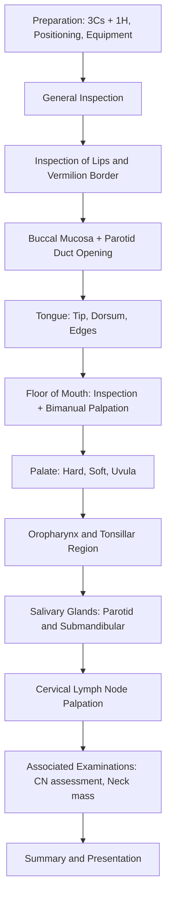

# Examination of the Oral Cavity

---

## Master Examination Framework

---

## 1. Preparation

**Why:** A structured setup demonstrates professionalism, ensures patient safety, and avoids missing key steps — examiners in OSCE mark this before you even touch the patient.

- **Introduce yourself:** "Good morning, my name is Dr [Name]. I am one of the doctors here today."
  - 「你好，我係醫生 [Name]。」
- **3Cs:**
  - **Consent:** "I would like to examine the inside of your mouth. Is that alright with you?"
    「我想檢查你嘅口腔，可以嗎？」
  - **Curtains:** Draw curtains for privacy (even for oral exam — it's a habit the examiner wants to see).
  - **Chaperone:** Offer a chaperone if appropriate.
- **1H: Hand hygiene:** "Before I begin, I would like to wash my hands and put on a pair of gloves."
  「我會先洗手同戴手套。」
- **Positioning:** Patient sitting upright in a chair or on the bed at 90°. [1][2]
- **Exposure:** Head and neck region. Remove any scarves, collars. Ask patient to **remove lipstick** before examination. [1]
- **Equipment:** Gloves, tongue depressor/spatula, pen torch or headlight. [1]

> **Model commentary:** *"I would like to introduce myself — my name is Dr Chan. I would like to examine the inside of your mouth today, if that is alright with you. Before I begin, I would wash my hands and put on a pair of gloves. Could I ask you to sit upright and remove any lipstick? I have a tongue depressor and a torch ready."*

---

## 2. General Inspection

**Why:** Before you zero in on the oral cavity, a 10-second scan of the patient and their surroundings can reveal the diagnosis (e.g., cachexia suggesting malignancy, IV antibiotics suggesting infection, NG tube suggesting dysphagia).

### Bedside
- **Equipment:** IV access, oxygen supplementation, NG tube, PEG tube, suction, tracheostomy
- **Monitoring:** Cardiac monitor, fluid balance charts
- **Diet restriction:** Nil-by-mouth signs (suggests dysphagia or post-operative)

### Patient at First Glance
- **General status:** Distress, pain level, conscious level
- **Body habitus:** Cachexia (malignancy), obesity
- **Skin/complexion:** Pallor (anaemia — iron deficiency predisposes to oral cancer), jaundice
- **Specific smells:**
  - *Fetor hepaticus* (sweet smell) → severe hepatocellular disease [3]
  - *Ketosis* (sickly sweet) → diabetic ketoacidosis [3]
  - *Uraemic fetor* (fishy ammonia) → uraemia [3]
  - *Putrid smell* → anaerobic infection [3]
  - *Alcohol/cigarette* → risk factors for oral cancer [3]
- **Vitals:** Pulse, BP, RR, temperature (fever in acute oral/pharyngeal infection)

> **Model commentary:** *"On general inspection, the patient is sitting comfortably in an upright position. There is no supplemental oxygen, no NG tube, and no IV access. There are no obvious signs of cachexia. The patient does not appear jaundiced or anaemic. There is no abnormal fetor."*

---

## 3. Systematic Examination of the Oral Cavity

The approach follows a **"outside-in, anterior-to-posterior"** sequence. This is the gold-standard order per HKUMed teaching [1][4]:

1. Lips and vermilion border
2. Buccal mucosa and parotid duct opening
3. Tongue (tip → dorsum → edges)
4. Floor of mouth (inspection → bimanual palpation)
5. Palate (hard → soft → uvula)
6. Oropharynx and tonsils
7. Salivary glands (parotid → submandibular)

---

### 3.1 Lips and Vermilion Border

**How:** Inspect the lips from the front. Gently evert the upper and lower lips to examine the inner mucosal surface. Palpate the lips between thumb and index finger.

| Finding | Significance | Pathophysiology |
|---|---|---|
| **Angular cheilitis** (cracking at commissures) | Iron deficiency, B12/folate deficiency, candidiasis, denture-related | Mucosal atrophy from nutritional deficiency; candidal overgrowth in moist skin folds |
| **Lip ulcer/mass** | ***SCC of the lip*** (most common lip malignancy), actinic cheilitis | UV exposure → dysplastic epithelial changes, especially lower lip |
| ***Hereditary haemorrhagic telangiectasia (HHT)*** | Multiple telangiectasia on lips/oral mucosa | Abnormal vascular development (mutations in ENG/ACVRL1) → fragile vessels [5] |
| **Vesicles** | Herpes simplex (HSV-1) | Reactivation of latent virus in trigeminal ganglion |
| **Pigmentation** | ***Peutz-Jeghers syndrome*** (perioral melanotic macules) | Germline STK11 mutation → hamartomatous GI polyps + mucocutaneous pigmentation |
| **Lip swelling** | Angioedema, granulomatous cheilitis (Crohn's) | Mast cell degranulation (angioedema); non-caseating granulomas (Crohn's) |

> **Model commentary:** *"I will first inspect and palpate the lips and vermilion border. I note there is no angular cheilitis, no ulceration, no vesicles, and no abnormal pigmentation. The vermilion border is intact."*

**Cantonese instruction:** "Please open your mouth slightly." 「請你微微張開口。」

---

### 3.2 Buccal Mucosa and Parotid Duct Opening

**How:** Ask the patient to open their mouth. Using a tongue depressor (or gloved finger), gently retract the cheek laterally. Inspect the buccal mucosa on both sides systematically. Then identify the **parotid duct opening (Stensen's duct)** — it is located ***opposite the upper second molar*** on the buccal mucosa. [1][4][6]

**Cantonese instruction:** "I'm going to gently pull your cheek to the side to have a look inside." 「我會輕輕將你塊面皮撥開嚟睇吓。」

| Finding | Significance | Pathophysiology |
|---|---|---|
| ***Leukoplakia*** | Pre-malignant white patch that cannot be scraped off | Epithelial hyperkeratosis; ~5% malignant transformation rate |
| ***Erythroplakia*** | Red velvety patch — higher malignant potential than leukoplakia | Epithelial dysplasia/carcinoma in situ with ↑vascularity |
| **Oral candidiasis (thrush)** | White patches that CAN be scraped off → raw erythematous base | Opportunistic Candida albicans overgrowth (immunosuppression, steroids, DM, antibiotics) |
| ***Oral submucous fibrosis*** | Restricted mouth opening, blanched mucosa, palpable fibrous bands | ***Betel nut (areca nut) chewing*** → arecoline stimulates fibroblast proliferation and collagen deposition [4] |
| **Fordyce granules** | Small yellow-white papules on buccal mucosa | Ectopic sebaceous glands — completely benign, normal variant |
| **Aphthous ulcers** | Painful shallow ulcers with erythematous halo | Immune-mediated mucosal destruction; associated with stress, B12/folate/iron deficiency, Behçet's disease, Crohn's |
| ***Parotid duct — pus/absent saliva*** | Suppurative parotitis, sialolithiasis | Stone obstructs duct → stasis → secondary bacterial infection (S. aureus) [6][7] |

**Special attention at parotid duct opening:**
- Milk the parotid gland by palpating from the ear forward along the duct's route → observe if clear saliva flows from the duct [6]
- **Normal:** clear saliva expressed
- **Abnormal:** pus, turbid fluid, or no flow (obstruction by calculus)

> **Model commentary:** *"I will now retract the buccal mucosa laterally using a tongue depressor to inspect the mucosa. The mucosa appears pink and healthy bilaterally. There is no leukoplakia, erythroplakia, or candidal plaques. I will now inspect the parotid duct opening opposite the upper second molar — the opening appears normal and clear saliva can be expressed on gentle palpation of the parotid gland."*

---

### 3.3 Tongue

**How:** Examine the tongue in a **systematic three-region approach** [1]:
1. **Tip of tongue** — ask patient to open mouth widely 「請張大口。」
2. **Dorsum of tongue** — inspect with mouth open
3. **Edges of tongue** — ask patient to protrude tongue laterally to each side 「請將條脷伸出嚟，擺去左邊…再擺去右邊。」

If an **ulcer or mass** is found:
- Describe it (site, size, shape, edge, base, colour)
- ***Palpate the ulcer/mass for extent of induration*** — induration beyond the visible margin suggests **submucosal infiltration by carcinoma** [1][4]

| Finding | Significance | Pathophysiology |
|---|---|---|
| ***Tongue SCC*** | ***Most common oral malignancy; typically lateral border*** | Risk factors: smoking, alcohol, betel nut, HPV; chronic irritation → dysplasia → carcinoma [4][8] |
| **Atrophic glossitis** (smooth, depapillated, beefy red tongue) | Iron deficiency anaemia, B12/folate deficiency, coeliac disease | Rapid epithelial turnover of tongue papillae is vulnerable to nutritional deficiency → papillae atrophy [5] |
| **Geographic tongue** | Map-like areas of smooth red depapillation | Benign mucosal inflammation; may indicate riboflavin (B2) deficiency [3] |
| **Lingua nigra (black hairy tongue)** | Dark brown discolouration, dorsal surface | Posterior extension of filiform papillae with keratin accumulation; also from bismuth compounds [3] |
| **Tongue coating** | Thickened epithelium with bacteria/food | Common in smokers, URI, rarely severe disease; more marked posteriorly due to ↓mobility [3] |
| ***Macroglossia*** | Enlarged tongue | Amyloidosis, hypothyroidism, acromegaly, Down syndrome |
| **Fasciculations** | Wriggling movements at rest | ***LMN lesion of CN XII*** (hypoglossal) [9] |
| **Deviation on protrusion** | Tongue deviates to one side | ***Ipsilateral CN XII palsy*** — genioglossus on affected side is weak, so the contralateral muscle pushes it to the affected side [9] |
| **Central cyanosis** | Bluish discolouration of tongue | Deoxyhaemoglobin > 5 g/dL → cardiac or respiratory disease |

<Callout title="Tongue Carcinoma: Don't Forget to Palpate!" type="error">
A very common OSCE mistake is to only *look* at the tongue and not *palpate* it. Tongue SCC is often much more indurated than it looks on inspection. Palpation reveals the true extent of the tumour — this directly impacts staging and surgical planning. Always use a gloved finger to palpate any suspicious lesion on the tongue. [1][4]
</Callout>

> **Model commentary:** *"I will now examine the tongue. I will ask the patient to protrude the tongue straight out — 請將條脷伸出嚟 — the tongue protrudes in the midline without deviation or fasciculation. The dorsum shows no coating, no discolouration, and no lesions. I will now ask the patient to move the tongue to the left and then to the right to inspect the lateral borders. There is no ulceration, leukoplakia, or mass on either lateral edge. The tip of the tongue is normal."*

---

### 3.4 Floor of Mouth

**How:**
1. **Inspection:** Ask the patient to lift their tongue up to the palate 「請將條脷捲上去頂住上顎。」 → inspect the sublingual region, including the sublingual caruncle (opening of Wharton's duct / submandibular duct) and the frenulum.
2. ***Bimanual palpation:*** Place a gloved index finger on the floor of the mouth, and the other hand externally below the mandible. Palpate systematically from posterior to anterior. [1][6]

**Why bimanual?** Masses of the floor of the mouth or submandibular gland are often deep — single-handed intraoral palpation alone may miss them. Bimanual technique traps the tissue between two hands for better assessment of size, consistency, and fixation. [1][6]

| Finding | Significance | Pathophysiology |
|---|---|---|
| ***Floor of mouth SCC*** | Second most common oral cavity cancer | Pooling of carcinogens (saliva + tobacco/alcohol) in dependent floor |
| **Ranula** | Translucent bluish cystic swelling | Mucous extravasation cyst from sublingual gland duct obstruction |
| ***Submandibular duct stone (sialolith)*** | Palpable hard mass in floor of mouth | Wharton's duct is long, uphill, with viscous saliva → stones form; 80% of salivary calculi are submandibular [6] |
| **Ludwig's angina** | Bilateral floor of mouth swelling, elevated tongue, dysphagia, airway compromise | Rapidly spreading cellulitis of submandibular space (sublingual + submylohyoid); often from dental infection — **AIRWAY EMERGENCY** |

**Assessing fixation to mandible (for floor of mouth cancer):** [8]
- During bimanual palpation, attempt to move the mass relative to the inner cortex of the mandible
- **Absence of fixation** to the inner mandibular cortex → mandible-sparing surgery is feasible
- **Fixation** → likely bony invasion → segmental mandibulectomy required

> **Model commentary:** *"I will now inspect the floor of the mouth — please lift your tongue up to touch the roof of your mouth. I can see the sublingual folds and the submandibular duct openings — they appear normal with no masses, swelling, or pus. I will now perform bimanual palpation of the floor of mouth — I will place one finger inside your mouth and my other hand under your chin. 我會將手指放入你口度同喺下巴外面一齊檢查。 The floor of mouth is soft and non-tender. There are no palpable masses or stones."*

---

### 3.5 Palate (Hard Palate → Soft Palate → Uvula)

**How:** Use a tongue depressor to gently depress the tongue. Inspect the hard palate anteriorly, then the soft palate and uvula posteriorly. Use the torch. [1]

**Cantonese instruction:** "I'm going to press your tongue down gently with this stick." 「我會用呢支壓舌板輕輕壓低你條脷。」

| Finding | Significance | Pathophysiology |
|---|---|---|
| **Torus palatinus** | Bony midline hard palate swelling | Benign bony exostosis — normal variant, no treatment needed |
| ***Palatal SCC*** | Ulcerative or exophytic mass of hard palate | Mucosal squamous cell carcinoma; smoking (especially reverse smoking) is a strong risk factor |
| ***Adenoid cystic carcinoma / mucoepidermoid carcinoma*** | Mass on hard/soft palate | ***Minor salivary gland tumours*** — the palate has the highest density of minor salivary glands in the oral cavity [4] |
| **Kaposi sarcoma** | Violaceous papules/plaques on palate | HHV-8-driven vascular neoplasm; pathognomonic of AIDS |
| **Palatal petechiae** | Haemorrhagic spots on soft palate | Infectious mononucleosis (EBV), streptococcal pharyngitis, thrombocytopenia |
| **High-arched palate** | Marfan syndrome, Turner syndrome | Altered connective tissue/growth |
| **Cleft palate** | Congenital defect | Failure of fusion of palatine shelves |

**CN IX/X assessment at this point:**
- Ask the patient to say "Ah" → observe soft palate elevation and uvula position [9]
- **Normal:** soft palate rises symmetrically, uvula midline
- **CN X palsy:** uvula deviates to the **normal (unaffected) side** because the musculus uvulae on the affected side is paralysed [9]

> **Model commentary:** *"Using the tongue depressor, I will now inspect the palate. The hard palate mucosa appears intact with no masses, ulceration, or discolouration. There is no torus palatinus. The soft palate and uvula appear normal. I will ask the patient to say 'Ah' — 請講 'Ah' — the soft palate rises symmetrically and the uvula remains midline, suggesting intact CN IX and X function."*

---

### 3.6 Oropharynx and Tonsillar Region

**How:** With the tongue depressed and torch illumination, inspect the posterior pharyngeal wall, palatine tonsils (between the anterior and posterior tonsillar pillars), and the base of tongue (as much as visible).

| Finding | Significance | Pathophysiology |
|---|---|---|
| ***Unilateral tonsillar enlargement*** | ***Must exclude lymphoma or SCC*** until proven otherwise | Asymmetric enlargement is a red flag for malignancy [4] |
| **Tonsillar exudate** | Acute tonsillitis (bacterial/viral), infectious mononucleosis | Inflammatory exudate from crypts |
| **Peritonsillar swelling with uvula deviation** | ***Peritonsillar abscess (quinsy)*** | Collection of pus between tonsillar capsule and superior constrictor; complication of acute tonsillitis [4] |
| **"Hot-potato" voice** | Large tongue base/oropharyngeal tumour, peritonsillar abscess | Mass effect on oropharyngeal resonance [4][8] |
| **Posterior pharyngeal wall bulge** | Retropharyngeal abscess | Infection spreading to retropharyngeal space (danger space) — can compromise airway |

<Callout title="Unilateral Tonsillar Enlargement" type="error">
Students often dismiss asymmetric tonsils as "probably just chronic tonsillitis." In clinical practice (and in OSCE vivas), ***unilateral tonsillar enlargement must be investigated to exclude malignancy*** — especially lymphoma (NHL commonly involves Waldeyer's ring) and oropharyngeal SCC. Always mention this in your presentation. [4][5]
</Callout>

---

### 3.7 Salivary Glands

This is a natural extension of the oral cavity examination, as **salivary duct openings are intraoral** and pathology often presents with oral symptoms. [1][6][7]

#### Parotid Gland
**How:**
- Ask patient to clench teeth → tightens masseter → parotid gland can be palpated just behind the masseter and anterior to the ear [3][7]
- **Normal:** impalpable
- **Enlarged:** palpable soft or firm mass in the pre-auricular/retromandibular region
- ***Bimanual palpation for parotid duct (Stensen's duct):*** One finger intraorally along the buccal mucosa opposite the upper second molar, the other hand externally along the duct route (ear → jaw line) [6]
- ***Always check for facial nerve palsy if parotid pathology detected*** — the facial nerve runs through the parotid gland [7]

#### Submandibular Gland
**How:**
- ***Bimanual palpation:*** Gloved index finger intraorally on the floor of the mouth beside the tongue; other hand externally behind the body of the mandible [3][6][7]
- Ask the patient to **close the mouth slightly** to relax the floor of mouth musculature — this facilitates examination [6]
- Palpate the floor of mouth from posterior to anterior to detect any stones in Wharton's duct [6]

| Finding | Significance | Pathophysiology |
|---|---|---|
| ***Sialolithiasis (submandibular > parotid)*** | Palpable hard stone in duct, swelling worse with meals | 80% submandibular (longer duct, more viscous/alkaline saliva, duct opening is superior to gland → flow against gravity) [6] |
| **Acute sialadenitis** | Tender, swollen gland with pus from duct | Duct obstruction → stasis → bacterial superinfection (S. aureus) |
| ***Pleomorphic adenoma*** | Firm, non-tender, slowly growing parotid mass | Most common salivary gland tumour (80% benign); arises from myoepithelial cells |
| ***Facial nerve palsy with parotid mass*** | Highly suspicious for ***malignant parotid tumour*** | Malignant tumour invading facial nerve trunk/branches within the parotid [7] |

> **Model commentary:** *"I will now palpate the salivary glands. I ask the patient to clench their teeth — 請你咬實牙齒 — and I palpate over the parotid region bilaterally. The parotid glands are impalpable. I will perform bimanual palpation for the submandibular glands — one finger intraorally, one hand externally. No enlargement or tenderness is felt. I will also check for any facial nerve weakness — please raise your eyebrows, close your eyes tightly, and show me your teeth — 請你做呢幾個表情 — facial nerve function is intact bilaterally."*

---

## 4. Cervical Lymph Node Palpation

**Why this completes the examination:** The oral cavity and oropharynx drain to cervical lymph nodes. ***Ipsilateral or bilateral non-tender cervical lymphadenopathy is a common presenting sign of oral/oropharyngeal cancer*** since regional metastasis rates are high. [4][8]

**How:** Sit the patient up, examine from behind. Palpate in sequence [5]:
1. Submental (Level IA)
2. Submandibular (Level IB)
3. Pre-auricular
4. Post-auricular
5. Upper jugular chain (Level II)
6. Mid-jugular chain (Level III)
7. Lower jugular chain (Level IV)
8. Posterior triangle (Level V)
9. Supraclavicular

**Characterize any lymph node found:**

| Character | Likely Aetiology |
|---|---|
| Discrete, mobile, firm, slightly tender | Reactive |
| Isolated, tender, warm, fluctuant | Infected |
| Firm, rubbery, rapidly expanding | Lymphoma |
| ***Rock-hard, fixed, non-tender*** | ***Metastatic malignancy*** [2] |

> **Model commentary:** *"To complete the oral cavity examination, I will palpate for cervical lymphadenopathy. I will examine from behind the patient — 我會喺你後面檢查你頸部嘅淋巴結. [Palpates systematically.] There is no palpable cervical lymphadenopathy."*

---

## 5. Associated/Completing Examinations

To demonstrate thoroughness [1][2]:

- **Cranial nerve examination** — especially CN V (trigeminal, for sensation), CN VII (facial nerve — pertinent if parotid pathology), CN IX/X (palatal movement, gag reflex), ***CN XII (tongue movement)*** [9]
- **Scalp and face examination** — for skin lesions that may drain to cervical nodes [2]
- **Neck mass examination** — if any mass is found, full neck mass workup (inspection, palpation, swallowing test) [2]
- **Nasal and ear examination** — to exclude ***nasopharyngeal carcinoma (NPC)*** especially if posterior cervical/supraclavicular lymphadenopathy
- **Fibreoptic nasendoscopy** — for visualization of tongue base, hypopharynx, and larynx (state you would arrange this)

---

## 6. Special Tests and Named Clinical Signs

### 6.1 Bimanual Palpation of Floor of Mouth
- **Technique:** Gloved index finger intraoral, other hand submental externally. Palpate posterior → anterior.
- **Positive result:** Palpable mass, induration, or stone
- **Mechanism:** Traps tissue between hands — essential for detecting submandibular stones and floor of mouth tumours [1][6]

### 6.2 Milking the Parotid/Submandibular Gland
- **Technique:** Compress the gland externally and observe the duct opening intraorally for saliva flow
- **Positive result:** Purulent discharge → suppurative sialadenitis; absent flow → complete duct obstruction [6]
- **Normal:** Clear saliva flowing from the duct

### 6.3 Assessing Trismus
- **Technique:** Measure maximal inter-incisal distance (MID) with a ruler
- **Normal:** ≥ 35 mm (roughly 3 finger-breadths)
- ***Positive (trismus):*** MID < 35 mm
- ***Significance:*** In the context of oral/oropharyngeal cancer, trismus indicates ***advanced disease with involvement of pterygoid musculature*** [4][8]
- **Other causes:** TMJ disorder, infection (peritonsillar abscess, Ludwig's angina), post-radiation fibrosis

### 6.4 Gag Reflex (CN IX Afferent, CN X Efferent)
- **Technique:** Touch the posterior pharyngeal wall or tonsillar pillar with a tongue depressor on each side [9]
- **Positive (normal):** Bilateral palatal contraction and gagging
- **Absent/diminished:** CN IX or CN X palsy
- **Clinical relevance:** Absent gag reflex + dysphagia → bulbar palsy → risk of aspiration

### 6.5 Tongue Protrusion Test (CN XII)
- **Technique:** Ask patient to protrude tongue in midline [9]
- **Positive:** Deviation to one side → ipsilateral CN XII (LMN) lesion
- **Mechanism:** Genioglossus on affected side is weak; contralateral pushes tongue toward the weak side
- **Clinical relevance in oral cavity cancer:** Invasion of tongue base cancer into hypoglossal nerve → tongue deviation; also ***decreased tongue mobility suggests deep muscle invasion and mandates partial glossectomy*** [8]

---

## 7. Expected Positive and Important Negative Findings

### In Oral Cavity Malignancy (the "high-yield" OSCE scenario):

**Expected Positive Findings:**
- ***Ulcerative or exophytic mass*** on tongue (lateral border), floor of mouth, or buccal mucosa
- ***Induration on palpation*** extending beyond visible lesion margin
- ***Ipsilateral cervical lymphadenopathy*** (rock-hard, fixed, non-tender)
- ***Leukoplakia or erythroplakia*** (pre-malignant lesions)
- Trismus (if pterygoid involvement)
- Referred otalgia (CN IX/X tympanic branches)
- Weight loss and cachexia

**Important Negative Findings to Document:**
- No contralateral lymphadenopathy (staging implications)
- No facial nerve palsy (argues against parotid malignancy)
- Tongue protrudes in midline (CN XII intact → no deep invasion)
- No trismus (pterygoid not involved)
- Floor of mouth not fixed to mandible (mandible-sparing surgery feasible)
- No distant metastatic signs (hepatomegaly, respiratory signs)

---

## 8. Red-Flag Examination Findings and Escalation Triggers

| Red-Flag Finding | Concern | Action |
|---|---|---|
| ***Rapidly progressive floor of mouth swelling + elevated tongue + stridor*** | **Ludwig's angina — airway emergency** | Urgent ENT/anaesthetics review; secure airway |
| ***Trismus + drooling + "hot-potato" voice + uvula deviation*** | **Peritonsillar abscess (quinsy)** | Urgent ENT referral for drainage |
| ***Non-healing ulcer > 3 weeks*** | **Must exclude malignancy** | Urgent biopsy/referral |
| ***Facial nerve palsy with parotid mass*** | **Malignant parotid tumour** | Urgent imaging + FNAC |
| ***Unilateral tonsillar enlargement*** | **Lymphoma or SCC** | Urgent ENT referral + biopsy |
| ***Profuse haemorrhage from oral lesion*** | **Erosion into vessel by tumour** | Resuscitate, pack, urgent surgical input |

---

## 9. Common OSCE Pitfalls

<Callout title="Don't Fall Into These Traps" type="error">

1. **Forgetting to put on gloves** — you MUST wear gloves for any intraoral examination. Instant mark deduction.
2. **Not asking the patient to remove lipstick** — vermilion border and lip pathology will be obscured. [1]
3. **Only inspecting, not palpating the tongue** — the extent of induration (tumour spread) is only appreciable on palpation. [1]
4. **Forgetting bimanual palpation of the floor of mouth** — single-handed palpation misses deep lesions and stones.
5. **Not examining the lateral borders of the tongue** — this is the most common site for tongue SCC. Students often inspect the dorsum and stop.
6. **Not checking the parotid and submandibular duct openings** — these are intraoral structures and part of the oral cavity exam. [1][7]
7. **Skipping cervical lymph nodes** — the exam is incomplete without lymph node palpation.
8. **Not examining CN function** (especially XII, IX, X) — cranial nerves are integral to the oral cavity and their involvement changes staging.
9. **Calling leukoplakia "thrush"** (or vice versa) — leukoplakia CANNOT be scraped off; candidal plaques CAN be.
</Callout>

---

## 10. High-Yield Exam-Focused Interpretation Tips

- ***"Why does the tongue deviate?"*** — Because genioglossus pushes the tongue to the contralateral side. If one is paralysed (CN XII lesion), the tongue is pushed toward the paralysed side.
- ***"Why is the lateral border the most common site for tongue SCC?"*** — Contact with teeth causes chronic friction + pooling of carcinogens in the lateral gutter.
- ***"Why is bimanual palpation critical for floor of mouth cancer?"*** — To assess fixation to the inner cortex of the mandible. If NOT fixed → mandible can be spared surgically. [8]
- ***"Why 80% of salivary stones in submandibular gland?"*** — Wharton's duct is longer, curves uphill around the mylohyoid, and submandibular saliva is more mucous (viscous) and alkaline → favours calcium phosphate precipitation. [6]
- ***"Why does parotid malignancy cause facial nerve palsy?"*** — The facial nerve runs THROUGH the substance of the parotid gland (between superficial and deep lobes). Malignant tumours invade the nerve; benign tumours typically displace it. [7]
- ***"Why otalgia in oropharyngeal cancer?"*** — Referred otalgia via the tympanic branch of CN IX (Jacobson's nerve) and auricular branch of CN X (Arnold's nerve). [4][8]
- ***"Why trismus in advanced oral/oropharyngeal cancer?"*** — Tumour invasion into the medial or lateral pterygoid muscles restricts mandibular movement. [4]

---

## 11. Model Reporting Script

> *"On examination, Mr Chan is a [age]-year-old gentleman sitting comfortably and alert. He appears cachectic. Vital signs are stable with a temperature of 37.2°C.*
>
> *On general inspection, there is no supplemental oxygen, NG tube, or IV access. There is no fetor.*
>
> *On inspection of the oral cavity, starting with the lips — there is no angular cheilitis, ulceration, or abnormal pigmentation at the vermilion border.*
>
> *The buccal mucosa bilaterally appears healthy. There is no leukoplakia, erythroplakia, or oral candidiasis. The parotid duct openings are identified opposite the upper second molars bilaterally — they appear patent with clear saliva expressed on gentle gland compression.*
>
> *On examination of the tongue, there is a 2 cm × 1.5 cm ulcerative lesion on the left lateral border of the tongue. The ulcer has irregular, raised edges with an indurated base. On palpation, the induration extends approximately 1 cm beyond the visible margin. The tongue protrudes in the midline without deviation, and there is no fasciculation, suggesting intact CN XII function.*
>
> *The floor of the mouth is inspected — there is no visible swelling. On bimanual palpation, no masses or stones are felt. There is no fixation to the mandible.*
>
> *The hard palate, soft palate, and uvula appear normal. The soft palate elevates symmetrically on phonation, and the uvula is midline, suggesting intact CN IX and X.*
>
> *On inspection of the oropharynx, the tonsils are symmetrical and there is no peritonsillar swelling or exudate.*
>
> *The parotid and submandibular glands are examined — no enlargement or tenderness. Facial nerve function is intact bilaterally.*
>
> *On cervical lymph node examination, there is a 2 cm × 2 cm firm, non-tender, relatively fixed lymph node in the left level II region. No other lymphadenopathy is palpable.*
>
> *In summary, this patient has a suspicious ulcerative lesion on the left lateral tongue border with deep induration and ipsilateral level II lymphadenopathy, concerning for squamous cell carcinoma of the tongue with regional nodal metastasis. I would like to arrange an urgent incisional biopsy of the tongue lesion, MRI of the oral cavity and neck for staging, CT thorax for distant metastases, and a panendoscopy to exclude synchronous primary tumours."*

---

<Callout title="High Yield Summary">

**Oral cavity examination follows a strict "outside-in, anterior-to-posterior" sequence:** Lips → Buccal mucosa (+ parotid duct) → Tongue (tip, dorsum, edges) → Floor of mouth (bimanual!) → Palate → Oropharynx → Salivary glands → Cervical lymph nodes.

**Three must-do manoeuvres:** (1) ***Palpate any tongue/floor of mouth lesion*** for induration, (2) ***Bimanual palpation*** of floor of mouth and submandibular gland, (3) ***Cervical lymph node palpation*** — without these, the examination is incomplete.

**Key associations:** Lateral tongue = most common site for oral SCC. Leukoplakia cannot be scraped off (vs candida). Unilateral tonsillar enlargement = exclude malignancy. Facial nerve palsy + parotid mass = malignant until proven otherwise. Trismus = advanced oral/oropharyngeal cancer with pterygoid involvement. Referred otalgia = CN IX/X involvement.

**Always remember equipment (gloves, spatula, torch) and ask to remove lipstick.**
</Callout>

---

<ActiveRecallQuiz
  title="Active Recall - Physical Exam"
  items={[
    {
      question: "What is the systematic sequence for examining the oral cavity?",
      markscheme: "Lips and vermilion border, buccal mucosa and parotid duct opening, tongue (tip, dorsum, edges), floor of mouth (inspection and bimanual palpation), palate (hard, soft, uvula), then complete with cervical lymph node palpation.",
    },
    {
      question: "Where is the parotid duct opening (Stensen's duct) located and what should you look for?",
      markscheme: "Opposite the upper second molar on the buccal mucosa. Look for clear saliva flow on gland compression; pus suggests suppurative sialadenitis; absent flow suggests obstruction (sialolithiasis).",
    },
    {
      question: "Why is palpation of a tongue lesion essential and what does induration signify?",
      markscheme: "Induration extending beyond visible margins indicates submucosal tumour infiltration, suggesting deeper invasion than what is seen on inspection. This determines the true extent of disease and guides surgical planning.",
    },
    {
      question: "Why do 80% of salivary calculi occur in the submandibular gland?",
      markscheme: "Wharton's duct is longer, has an uphill course against gravity (curves around mylohyoid), and submandibular saliva is more mucous (viscous) and alkaline, favouring calcium phosphate precipitation.",
    },
    {
      question: "A patient presents with a parotid mass and ipsilateral facial nerve palsy. What is the most likely diagnosis and why?",
      markscheme: "Malignant parotid tumour. The facial nerve runs through the substance of the parotid gland (between superficial and deep lobes). Benign tumours displace the nerve; malignant tumours invade it, causing palsy.",
    },
    {
      question: "What does trismus indicate in a patient with an oral cavity or oropharyngeal lesion?",
      markscheme: "Advanced disease with invasion into the pterygoid musculature. It limits mouth opening to less than 35mm inter-incisal distance and indicates locally advanced (T4) tumour staging.",
    },
  ]}
/>

---

## References

[1] Senior notes: Ryan Ho Fundamentals.pdf (p174 — Section 2.14: Examination of Oral Cavity and Parotid Glands)
[2] Senior notes: Ryan Ho Fundamentals.pdf (p173 — Section 2.13.2: Examination of Neck Masses)
[3] Senior notes: Ryan Ho GI.pdf (p9 — Section on Mouth, Salivary Glands, Fetor, Tongue)
[4] Lecture slides: GC 219. Infections and tumours in pharynx and oral cavity.pdf (p9 — Physical Examination)
[5] Senior notes: Ryan Ho Haemtology.pdf (p7 — Section on Mouth and Cervical Lymphadenopathy)
[6] Senior notes: felixlai.md (Section on Examination of Stensen's duct, Wharton's duct, and sialolithiasis)
[7] Lecture slides: GC 217. Facial nerve palsy and salivary gland diseases.pdf (p38–40 — Physical Examination of Salivary Glands)
[8] Senior notes: felixlai.md (Section on Cancer of floor of mouth — bimanual palpation and fixation assessment; Oropharyngeal cancer clinical manifestation)
[9] Senior notes: Ryan Ho Neurology.pdf (p22 — CN IX, X, XII examination)
