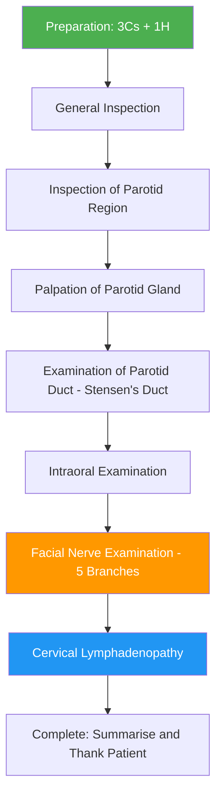

# Examination of Parotid Glands

## Master Examination Flowchart

---

## Preparation: The 3Cs + 1H

Before touching anything, set the stage properly. This is free marks in an OSCE — don't throw them away.

| Step | Action | Commentary Example |
|---|---|---|
| **Introduce** | "Good morning, my name is Dr. Chan. I am a medical student. May I confirm your name and date of birth?" | 「你好，我叫陳醫生，我係醫學生。可以確認吓你個名同出生日期嗎？」 |
| **Consent** | "I would like to examine the area around your ears and face, including looking inside your mouth. Is that okay?" | 「我想檢查吓你耳仔附近同面部，同埋睇吓你口腔入面，可以嗎？」 |
| **Comfort** | "Please let me know if you feel any pain or discomfort at any point." | 「如果你有任何唔舒服，請隨時話我知。」 |
| **Hand hygiene** | "I would wash my hands before and after the examination." (State this aloud in OSCE.) | — |

**Setting** [1]:
- **Exposure**: Head and neck region fully exposed — remove scarves, collars, jewellery around ears/neck
- **Position**: ***Upright sitting position*** — this is the standard position for parotid examination
- **Equipment**: Gloves, tongue depressor, pen torch, a glass of water (for swallowing test if also assessing thyroid differential)

---

## General Inspection

Start from the end of the bed. This is your chance to gather a surprising amount of information before laying a finger on the patient.

### Bedside Clues
- **Drains**: A parotid wound drain (e.g. Penrose or suction drain) suggests recent parotidectomy
- **IV lines / medications**: IV antibiotics suggest acute suppurative parotitis; IV fluids in a dehydrated post-operative patient (dehydration is a classic risk factor for acute parotitis)
- **Dressings/scars**: Pre-auricular or modified Blair incision dressings

### Patient at First Glance
- **General body habitus**: Cachexia (malignancy?), obesity, signs of chronic liver disease or alcoholism (sialadenosis), features of anorexia/bulimia nervosa (bilateral painless parotid enlargement from self-induced vomiting) [2]
- **Facial asymmetry**: Obvious if there is a parotid mass — the swelling lifts the earlobe upward and outward. Any facial droop? This immediately raises the suspicion of malignancy or Bell's palsy
- **Skin changes**: Erythema, warmth overlying the parotid region (acute parotitis vs abscess)
- **Distress level**: A patient in obvious pain with trismus suggests acute suppurative parotitis or parotid abscess
- **Dehydration**: Dry mucous membranes, sunken eyes — dehydration predisposes to sialadenitis due to salivary stasis

**Running commentary:**
> "On general inspection, the patient is sitting comfortably. I can see a visible swelling in the right preauricular region. There are no drains, IV lines, or surgical dressings. The patient does not appear to be in distress and there is no obvious facial asymmetry at rest."

---

## Systematic Examination Sequence

### 1. Inspection of the Parotid Region

Stand in front of the patient and inspect from the front, both sides, and behind.

**What to look for** [1][3]:

| Feature | How | Normal | Abnormal | Pathophysiology |
|---|---|---|---|---|
| **Swelling / Mass** | Inspect preauricular region, angle of mandible, extending behind ear | No visible swelling | Visible mass — note ***site, size, shape*** | Tumour, inflammation, sialolithiasis, sialadenosis |
| ***Overlying skin changes*** | Look for erythema, ulceration, tethering | Normal skin colour and texture | ***Hyperemic hot skin over lump*** — suggests malignancy or abscess [1] | Tumour infiltrating dermis or inflammatory hyperaemia |
| **Scars** | Look in preauricular/submandibular region | No scars | ***Scars from previous surgery*** — modified Blair incision (parotidectomy) [1] | Previous parotidectomy or drainage |
| **Earlobe displacement** | Compare both earlobes | Symmetrical | Earlobe pushed upward and outward | Mass effect from parotid tumour (the parotid wraps around the mandible and ear) |
| **Trismus** | Ask patient to open mouth wide 「請你盡量張開口」 | Full mouth opening | Reduced mouth opening | Inflammation/tumour involving masticator space or medial pterygoid |
| **Pharyngeal asymmetry** | Look inside mouth for bulging of soft palate/tonsillar fossa | Symmetrical | Medial displacement of tonsil/soft palate | Deep lobe parotid tumour extending into parapharyngeal space |

**Running commentary:**
> "On inspection, there is a 3 × 4 cm ovoid swelling in the right preauricular region, just anterior to the tragus. The overlying skin appears normal with no erythema, ulceration, or previous surgical scars. The right earlobe appears slightly displaced superiorly compared to the left. The patient can open the mouth fully without restriction."

<Callout title="Is It Really a Parotid Swelling?" type="idea">
The lecture slides explicitly ask you to differentiate a parotid swelling from ***masseter hypertrophy***, ***neck lymph nodes***, ***lipomas***, and ***vascular malformations*** [3]. A parotid mass will be located anterior to the external auditory canal, superior to the angle of the mandible, and superficial to (or involving) the masseter. Ask the patient to clench their teeth — the parotid overlies the masseter, whereas masseter hypertrophy is the muscle itself becoming prominent.
</Callout>

---

### 2. Palpation of the Parotid Gland

**Technique** [1][3]:
- ***Palpate the parotid mass from behind*** — stand behind the patient
- Use both hands to palpate the parotid regions bilaterally (compare sides)
- Ask the patient to clench their teeth 「請你咬緊牙」 to tighten the masseter — this makes the parotid more palpable as it overlies the masseter [4]

**What to assess:**

| Parameter | How | Normal | Abnormal | Significance |
|---|---|---|---|---|
| **Size** | Estimate in cm, at least 2 dimensions | ***Normal = impalpable*** [4] | Palpable, enlarged | Any pathology — tumour, inflammation, sialadenosis |
| **Consistency** | Gentle compression | Spongy and elastic [2] | Firm/hard = tumour; Tender and boggy = acute sialadenitis; ***Hard consistency*** = malignancy [1] | Hard irregular mass with pain → high suspicion malignancy |
| ***Border / Surface*** | Run fingers along edges | — | ***Well-defined, smooth*** = benign (e.g. pleomorphic adenoma); ***Irregular surface or ill-defined border*** = malignancy [1] | Malignant tumours infiltrate surrounding tissue → irregular borders |
| ***Attachment to overlying skin*** | ***Pinch skin above the lump*** [1] | Skin moves freely over lump | ***Fixation to skin*** = malignancy [1] | Tumour invasion through parotid capsule into dermis |
| ***Attachment to masseter*** | ***Ask patient to clench teeth and test mobility*** [1] | Mobile over masseter | Fixed to masseter = deep invasion | ***Fixation to underlying structures*** → malignancy sign [1] |
| **Tenderness** | Ask before pressing; gently palpate | Non-tender | Exquisitely tender = acute suppurative parotitis; ***Pain*** = malignancy sign [1] | Acute infection → glandular oedema stretching capsule |
| **Temperature** | Use dorsum of hand | Normal | Warm = inflammation/abscess | Increased blood flow from inflammatory response |
| **Mobility** | Try to move lump in all directions | Mobile | Fixed, immobile = malignancy or abscess with surrounding phlegmon | Tumour infiltration into surrounding structures |

<Callout title="Common OSCE Pitfall" type="error">
Students often forget to ***palpate from behind***. This is explicitly stated in Ryan Ho Fundamentals [1] — the examiner expects you to walk behind the patient, just like for thyroid examination. Palpating from the front blocks your view and is ergonomically awkward.
</Callout>

**Running commentary:**
> "I will now palpate the swelling from behind. May I touch your face? 「我而家會喺你後面摸吓你面，可以嗎？」 Before I start, is there any pain? The mass is approximately 3 × 4 cm, firm in consistency, with a smooth surface and well-defined borders. It is not tender. The overlying skin is freely mobile over the lump. I will now ask you to clench your teeth — 「請你咬緊牙」 — and the mass remains mobile over the masseter. There is no attachment to underlying structures."

---

### 3. Examination of Parotid (Stensen's) Duct

This is critical and commonly tested. The Stensen's duct is the conduit from the parotid gland to the oral cavity — stones, pus, and tumours can involve it.

**Anatomy** [1][2]:
- ***Stensen's duct arises from the anterior border of the parotid gland, 4–7 cm long***
- Runs along the ***middle 1/3 of a line drawn from the tragus to the philtrum*** [1]
- ***Opens opposite to the upper 2nd maxillary molar*** on the buccal mucosa [1]

#### a. External Palpation of the Duct [1][2]

- ***Palpate along the duct on the clenched masseter muscle*** [1]
- Start from the attachment of the earlobe and palpate forward toward the jaw line [2]
- Feel for ***any stones*** along the course — stones are typically ***rock hard, small, smooth or irregular*** [2]

**Running commentary:**
> "I will now palpate along the parotid duct. Please clench your teeth again. 「請你再咬緊牙」 I am palpating from the earlobe forward along the course of Stensen's duct over the masseter. I cannot feel any discrete lumps or stones along the duct."

#### b. Intraoral Examination [1][2][3]

Put on gloves (state this aloud: "I will put on gloves for the intraoral examination").

| Step | Technique | What to Look For |
|---|---|---|
| **Inspect the duct opening** | Use tongue depressor to retract the buccal mucosa laterally; use pen torch. Locate the parotid papilla ***opposite to the 2nd upper molar*** | ***Inflammation, discharge, stones*** [1][3] — erythema/oedema of papilla suggests obstruction or infection |
| ***Milk the parotid duct*** | With one hand inside the mouth on the buccal mucosa and the other hand externally along the duct, gently compress from posterior to anterior (i.e. "milk" along the duct) | ***Clear saliva*** = normal [2]; ***Purulent material*** expressed from duct orifice = acute suppurative parotitis [2]; ***No flow*** = complete obstruction |
| **Palpate the duct opening** | With a gloved finger, palpate the buccal mucosa around the parotid papilla | ***Small stones*** may be visible or palpable at the duct orifice [2]; stones may move in and out of view with compression |
| ***Bimanual palpation*** | One finger in the mouth, other hand externally | Feel for stones within the ductal system; palpate the gland itself for deep lobe extension |

**Running commentary:**
> "I am now going to look inside your mouth. I will put on gloves. 「我而家會睇吓你口腔入面，我會戴手套。」Please open your mouth. 「請你張開口。」I am retracting the buccal mucosa to inspect the parotid duct opening opposite the upper second molar. The papilla appears normal with no erythema or discharge. I will now gently milk along the duct — clear saliva is expressed from the duct opening. There are no stones palpable at the orifice."

<Callout title="Purulent Discharge = Key Finding">
If you express ***purulent material from the orifice of Stensen's duct***, this is pathognomonic of ***acute suppurative parotitis*** [2]. Collect this for Gram stain and culture. This distinguishes bacterial parotitis from viral parotitis (mumps), which does ***NOT*** give purulent discharge [2].
</Callout>

---

### 4. Examination of Facial Nerve Branches

This is **the most important associated examination** in parotid pathology. ***Facial nerve involvement*** is a ***sign of malignancy*** [1][5]. The facial nerve (CN VII) runs through the substance of the parotid gland, dividing it into superficial and deep lobes. Any parotid pathology — tumour, surgery, abscess — can damage it.

**Test all five branches systematically** [1][5]:

| Branch | Test | Instruction (English) | Instruction (Cantonese) | What to Look For |
|---|---|---|---|---|
| ***Temporal*** | Ask patient to look upwards following your finger (fix head) | "Please look up, following my finger" | 「請你望上面，跟住我隻手指」 | Inability to raise eyebrows / wrinkle forehead |
| ***Zygomatic*** | Ask patient to forcefully shut eyelids, try to open them | "Please close your eyes tightly and don't let me open them" | 「請你用力閂埋眼，唔好俾我打開」 | Inability to close eye = lagophthalmos; orbicularis oculi weakness |
| ***Buccal*** | Ask patient to blow up cheeks; press on buccinator for tone | "Please puff out your cheeks" | 「請你脹大面」 | Air leaks from one side; reduced buccinator tone |
| ***Marginal mandibular*** | Ask patient to grin / show teeth | "Please show me your teeth" or "Please smile" | 「請你露齒笑」 | Asymmetric smile; inability to depress lower lip on affected side |
| ***Cervical*** | Ask patient to depress mandible against resistance; feel for platysma tone | "Please push your chin down against my hand" | 「請你用力將下巴壓落去」 | Loss of platysma contraction |

**Running commentary:**
> "I will now test the facial nerve. Please look up — good, the forehead wrinkles symmetrically. Now close your eyes tightly — I cannot open them; good power bilaterally. Please puff out your cheeks — good, no air leak. Please show me your teeth — the smile is symmetrical. Please push your chin down — I can feel the platysma contracting on both sides. The facial nerve is intact in all five branches."

**Why this matters** [1][2][5]:
- ***Facial weakness*** in the context of a parotid mass = ***high suspicion of malignant involvement*** [2]
- A parotid mass with intact facial nerve → more likely benign (e.g. pleomorphic adenoma, Warthin's tumour)
- ***Must be distinguished from Bell's palsy*** [2] — Bell's palsy is a diagnosis of exclusion; always examine the parotid if a patient presents with facial nerve palsy
- **Document specific branch involvement if present** [2] — this helps localise the tumour within the gland (e.g. marginal mandibular branch involvement suggests lower pole tumour)

---

### 5. Cervical Lymphadenopathy

***To complete the examination, palpate for cervical lymphadenopathy*** [1][3].

- Systematically palpate all cervical lymph node levels (I–VI)
- Focus especially on:
  - **Level II** (upper jugular) — primary drainage of parotid
  - **Preauricular and postauricular** nodes
  - **Intraparotid lymph nodes** — the parotid is unique among salivary glands because it contains lymph nodes within its parenchyma (due to late encapsulation during embryological development)
- Hard, fixed, matted nodes = metastatic disease
- Tender, mobile nodes = reactive/inflammatory

**Running commentary:**
> "To complete my examination, I would like to palpate for cervical lymphadenopathy. I will check all levels systematically. There are no palpable lymph nodes in the preauricular, postauricular, upper jugular, posterior triangle, or supraclavicular regions."

---

### 6. Additional Associated Examinations

To truly complete your assessment [1][2][3]:

| Examination | Rationale |
|---|---|
| **Contralateral parotid gland** | Bilateral parotid enlargement → Sjögren's syndrome, viral parotitis (mumps), sialadenosis (alcoholism, bulimia), sarcoidosis, lymphoepithelial cysts (HIV) [2] |
| **Submandibular glands** (bimanual palpation) | May also be involved in systemic conditions (Sjögren's, sarcoidosis); submandibular duct (Wharton's) stones are actually more common than parotid stones |
| **Examination of oral cavity** | Rule out oral cavity tumours extending to the parapharyngeal space mimicking deep-lobe parotid mass [3] |
| **Scalp and facial skin** | SCC and melanoma of the scalp/face can metastasise to intraparotid lymph nodes [2] |
| **Ears** (otoscopy if indicated) | Ramsay-Hunt syndrome: vesicles in external ear + facial nerve palsy + otalgia [5] |
| **Eyes** (dry eyes?) | Sjögren's syndrome: sicca complex (dry eyes + dry mouth) |

---

## Special Tests and Named Signs

### Fluctuance (Paget's Sign)
- **Technique**: Place two fingers on opposite sides of the mass; press with one and feel displacement with the other. Repeat at 90°.
- **Positive**: Fluid thrill transmitted = fluctuant → abscess, cyst (e.g. lymphoepithelial cyst, first branchial cleft cyst)
- **Mechanism**: Fluid within a contained cavity transmits pressure equally in all directions (Pascal's principle)

### Transillumination
- **Technique**: In a darkened room, place a pen torch against the mass
- **Positive**: Glows → cystic lesion (e.g. cyst, cystic Warthin's tumour)
- **Negative**: Solid lesion

### Bimanual Palpation for Deep Lobe Extension
- **Technique**: One finger in the mouth pressing laterally on the tonsillar/parapharyngeal region while the other hand palpates externally
- **Positive**: "Dumbbell" or "iceberg" tumour palpable both intra-orally and externally = deep lobe parotid tumour extending through the stylomandibular tunnel
- ***Pharyngeal asymmetry*** or ***buccal involvement*** should be assessed [2]

### "Milking" the Duct
- Not so much a "named test" as a critical manoeuvre — described above. ***Express purulent material → suppurative parotitis*** [2][3]

---

## Signs of Malignancy — The Red Flags 🚩

These are explicitly listed in Ryan Ho Fundamentals [1] and Felix Lai [2] and are **extremely high-yield** for OSCEs:

| Sign | Mechanism |
|---|---|
| ***Hyperemic hot skin over lump*** | Tumour neoangiogenesis and inflammation |
| ***Pain*** | Perineural invasion (especially adenoid cystic carcinoma) or capsular stretch |
| ***Fixation to underlying structures or skin*** | Tumour invasion beyond capsule |
| ***Hard consistency*** | Dense cellular tumour mass |
| ***Irregular surface or ill-defined border*** | Infiltrative growth pattern |
| ***Facial nerve involvement*** | Tumour invading/compressing CN VII within the gland substance |

<Callout title="Red Flag: Sudden Growth of a Previously Stable Mass" type="error">
A parotid mass that has been stable for years then suddenly enlarges = ***carcinoma ex pleomorphic adenoma*** until proven otherwise [2]. This is a malignant transformation of a pre-existing benign pleomorphic adenoma. Always ask about duration and growth pattern!
</Callout>

### Escalation Triggers
- New facial nerve palsy + parotid mass → urgent ENT/surgical referral, imaging, and FNA
- Trismus + parotid swelling + systemic toxicity → possible parotid abscess → urgent surgical assessment (I&D may be needed if no improvement after 48 hours of IV antibiotics [2])
- Airway compromise (stridor, dyspnoea) → emergency — parotid abscess can extend to parapharyngeal space causing airway obstruction [2]

---

## Expected Positive vs Important Negative Findings

### For Pleomorphic Adenoma (Most Common Parotid Tumour) [2]
| Expected Positives | Important Negatives to Document |
|---|---|
| Slow-growing, well-defined, firm, smooth, non-tender, mobile parotid mass | ***No facial nerve palsy*** |
| Earlobe displacement | No skin fixation or overlying skin changes |
| — | No cervical lymphadenopathy |
| — | No trismus |
| — | Clear saliva from Stensen's duct (no pus) |

### For Acute Suppurative Parotitis [2]
| Expected Positives | Important Negatives to Document |
|---|---|
| Firm, erythematous, exquisitely tender swelling | No facial nerve palsy (unless complicated) |
| Preauricular and postauricular region to angle of mandible | No fluctuance initially (if fluctuant → abscess) |
| Purulent discharge from Stensen's duct on milking | — |
| Fever, trismus, systemic toxicity | — |

### For Parotid Malignancy [2]
| Expected Positives | Important Negatives to Document |
|---|---|
| Hard, fixed, irregular mass | — |
| ***Facial nerve palsy*** (branch-specific) | If no nerve palsy, still cannot rule out malignancy |
| Pain, paraesthesia | — |
| Cervical lymphadenopathy | — |
| Skin fixation/ulceration | — |

---

## Differential Diagnosis of Parotid Swelling

When you feel a "parotid mass," consider [2][3]:

| Diagnosis | Key Differentiating Feature |
|---|---|
| ***Masseter hypertrophy*** | Becomes more prominent on clenching; bilateral; history of bruxism |
| ***Cervical lymph node*** | Located below/posterior to angle of mandible, not preauricular |
| ***Lipoma*** | Soft, slip sign positive, subcutaneous |
| ***Vascular malformation*** | Compressible, may have bruit, bluish discolouration |
| **Bilateral parotid**: Mumps, Sjögren's, sialadenosis, sarcoidosis, HIV lymphoepithelial cysts | Clinical context (bilateral, systemic symptoms) [2] |

---

## Common OSCE Pitfalls

1. **Forgetting to palpate from behind** — This is the correct approach and examiners specifically look for it [1]
2. **Not examining the Stensen's duct intra-orally** — Many students skip this entirely. It's a core part of the parotid exam [1][3]
3. **Not testing the facial nerve** — This is the single most important associated examination. Missing it is like examining a thyroid without checking for tremor
4. **Not asking the patient to clench teeth** — You need the masseter contracted to palpate the duct and assess gland mobility [1]
5. **Failing to distinguish superficial vs deep lobe tumour** — Check for pharyngeal asymmetry (deep lobe pushes the tonsil/soft palate medially)
6. **Not looking at both sides** — Bilateral parotid enlargement has a completely different differential diagnosis [2]
7. **Forgetting to state "I would check for cervical lymphadenopathy"** — This is explicitly stated as the completion step [1]
8. **Not wearing gloves for intraoral examination** — Automatic fail in some OSCE stations

---

## High-Yield Exam-Focused Interpretation Tips

- **"Why does facial nerve palsy matter so much?"** — The facial nerve traverses the parotid gland, dividing it into superficial and deep lobes. Benign tumours *displace* the nerve; malignant tumours *invade* it. Therefore, ***facial nerve palsy in the presence of a parotid mass = malignancy until proven otherwise*** [1][2][5].
- **"Why is the parotid gland unique in containing lymph nodes?"** — During embryological development, the parotid is the last salivary gland to encapsulate. Lymphatic tissue is incorporated before encapsulation is complete. This is why **metastatic skin cancers (SCC, melanoma) of the scalp and face can present as intraparotid masses** [2].
- **"Why is pleomorphic adenoma important even though it's benign?"** — It can undergo ***malignant transformation to carcinoma ex pleomorphic adenoma*** [2]. Long-standing, previously stable mass that suddenly grows = malignant degeneration.
- **"Why does adenoid cystic carcinoma cause pain?"** — It has a ***propensity for perineural invasion*** [2], tracking along nerve sheaths, which causes pain and paraesthesia even in relatively small tumours.

---

## Model Reporting Script

> "On examination, Mr. Chan is sitting comfortably with no obvious distress. Vitals are stable.
>
> On **inspection**, there is a 3 × 4 cm ovoid swelling in the right preauricular region, located anterior to the tragus and superior to the angle of the mandible. The overlying skin appears normal — no erythema, ulceration, or scarring. The right earlobe is slightly displaced superiorly. There is no trismus, and no pharyngeal asymmetry on intra-oral inspection.
>
> On **palpation** from behind, the mass is firm in consistency, non-tender, with a smooth surface and well-defined borders. It is freely mobile and not attached to the overlying skin or the underlying masseter muscle on clenching.
>
> On **examination of Stensen's duct**, I palpated along the duct on the clenched masseter and found no stones. Intra-orally, the parotid papilla opposite the upper second molar appears normal. On milking the duct, clear saliva is expressed. No pus or stones are visible at the orifice.
>
> On **facial nerve examination**, all five branches — temporal, zygomatic, buccal, marginal mandibular, and cervical — are intact bilaterally.
>
> There is **no cervical lymphadenopathy** palpable. The contralateral parotid gland is not enlarged.
>
> **In summary**, this is a well-defined, firm, mobile, non-tender right parotid mass with no signs of malignancy — no skin fixation, no deep fixation, no facial nerve involvement, and no lymphadenopathy. The most likely diagnosis is a **benign parotid tumour such as pleomorphic adenoma**. I would recommend further investigation with **ultrasound** and **fine needle aspiration cytology** to obtain a tissue diagnosis before definitive management."

---

<Callout title="High Yield Summary">

**Examination of Parotid Glands — Key Steps:**

1. **Setting**: Sitting upright, head and neck exposed, gloves ready
2. **Inspect**: Swelling (site/size/shape), overlying skin, scars, earlobe displacement, trismus, pharyngeal asymmetry
3. **Palpate from behind**: Size, consistency, border, surface, skin fixation (pinch test), masseter fixation (clench test), tenderness, mobility
4. **Stensen's duct**: External palpation on clenched masseter → intraoral inspection of papilla opposite upper 2nd molar → milk the duct for discharge → palpate for stones
5. **Facial nerve**: Test ALL 5 branches (Temporal / Zygomatic / Buccal / Marginal mandibular / Cervical) — **facial nerve palsy + parotid mass = malignancy until proven otherwise**
6. **Complete**: Cervical lymphadenopathy, contralateral parotid, submandibular glands, scalp/facial skin, oral cavity

**Signs of malignancy**: Pain, hard consistency, irregular borders, skin/deep fixation, facial nerve palsy, hot hyperaemic skin

</Callout>

---

<ActiveRecallQuiz
  title="Active Recall - Physical Exam"
  items={[
    {
      question: "Where does Stensen's duct open intraorally, and how do you locate it?",
      markscheme: "Opens on the buccal mucosa opposite the upper 2nd maxillary molar. Located along the middle third of a line from tragus to philtrum. Retract buccal mucosa with tongue depressor to visualise the papilla.",
    },
    {
      question: "What are the signs of malignancy in a parotid gland mass?",
      markscheme: "Pain, hard consistency, irregular surface or ill-defined border, fixation to skin or underlying structures, hyperemic hot overlying skin, and facial nerve involvement.",
    },
    {
      question: "How do you test the five branches of the facial nerve?",
      markscheme: "Temporal: look upwards. Zygomatic: forcefully close eyes, resist opening. Buccal: puff out cheeks, press buccinator. Marginal mandibular: show teeth or grin. Cervical: depress mandible against resistance, feel platysma.",
    },
    {
      question: "How do you differentiate acute suppurative parotitis from viral parotitis (mumps) on physical examination?",
      markscheme: "Suppurative parotitis: unilateral, purulent discharge from Stensen duct on milking, exquisite tenderness, systemic toxicity. Viral parotitis: often bilateral, NO purulent discharge from duct, prodromal period, less localised tenderness.",
    },
    {
      question: "Why does the parotid gland uniquely contain intraparotid lymph nodes, and what is the clinical significance?",
      markscheme: "The parotid encapsulates late during embryological development, incorporating lymphatic tissue. Clinically, metastatic skin cancers (SCC, melanoma) of the scalp and face can present as intraparotid masses via these nodes.",
    },
    {
      question: "A patient has a parotid mass that has been stable for 10 years but suddenly enlarged over 2 months. What is the most likely diagnosis?",
      markscheme: "Carcinoma ex pleomorphic adenoma - malignant transformation of a pre-existing benign pleomorphic adenoma. Requires urgent investigation with imaging and FNA/core biopsy.",
    },
  ]}
/>

---

## References

[1] Senior notes: Ryan Ho Fundamentals.pdf (p175, Section 2.14.2 Examination of Parotid Gland; also p61, p173–174)
[2] Senior notes: felixlai.md (Sections on sialolithiasis, parotitis, salivary gland tumours)
[3] Lecture slides: GC 217. Facial nerve palsy and salivary gland diseases.pdf (p38, p40, p41)
[4] Senior notes: Ryan Ho GI.pdf (p9, Salivary Glands examination)
[5] Senior notes: Ryan Ho Neurology.pdf (p19–20, CN VII examination and localisation)
