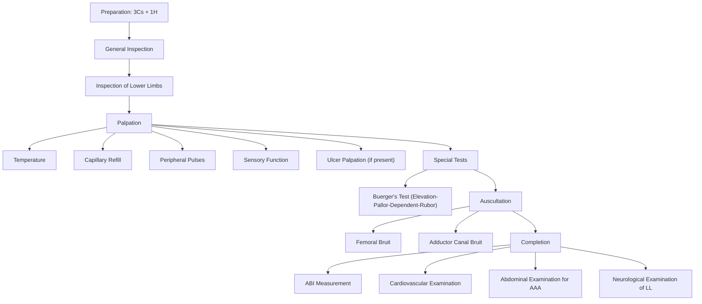

# Examination of the Peripheral Arterial System

---

## Master Examination Sequence

---

## Preparation

**Before touching the patient, always:**

- **Introduce yourself**: "Good morning, my name is Dr ___, I am one of the medical students / doctors. May I examine your legs today?"
  - 「你好，我姓___，係醫學生/醫生，我今日想幫你檢查吓你隻腳，可以嗎？」
- **3Cs**: Obtain **consent**, draw the **curtains**, offer a **chaperone**
- **1H**: "I would wash my hands before and after the examination." (State this — examiners want to hear it.)
- **Positioning**: Supine, in a **warm room** (cold causes vasoconstriction and confounds findings) [1][2]
- **Exposure**: **Bilaterally from the groin to the toes** — preferably with the patient wearing underwear only on the lower half. "Could you please remove your trousers and socks?" 「可唔可以除咗條褲同襪？」
- **Pain**: "Do you have any pain anywhere before I start?" 「開始之前有冇邊度痛？」— ***always ask before you touch the patient*** [1]

<Callout title="Why a warm room?" type="idea">
Cold ambient temperature causes peripheral vasoconstriction, which can exaggerate pallor and reduce palpability of pulses, confounding your exam. Always note if the room is cold — mention it to the examiner.
</Callout>

---

## General Inspection

**Stand at the end of the bed and take 10 seconds to look.**

### Bedside Environment
- **IV drip** → dehydration, NBM for surgery (e.g., pre-op for bypass)
- **O₂ supplementation** → respiratory/cardiac comorbidity
- **Fasting card** → planned vascular surgery
- **Pressure stocking / heel protector / splint** → suggests known ischaemia or ulceration [2]
- **Mobility aids** (wheelchair, walking frame) → functional limitation from claudication

### Patient at First Glance
| Feature | What to look for | Significance |
|---|---|---|
| **Pain** | Grimacing, guarding foot | ***Rest pain*** = critical limb ischaemia [1] |
| **Dyspnoea** | Tachypnoea, nasal prongs | Congestive heart failure (shared RF: atherosclerosis) |
| **Tar stain** on fingers | Nicotine staining | ***Major risk factor*** for PVD [1][2] |
| **Body habitus** | Cachexia vs obesity | Chronic disease vs metabolic syndrome |
| **Amputations** | Missing toes, forefoot, BKA, AKA | Previous severe PAD / gangrene [1] |

**Running commentary example:**
> "On general inspection, the patient is lying comfortably on the bed. He is not in pain or dyspnoea. I note there is tar staining on the right hand. There is a heel protector on the left foot. I do not see any IV drip or O₂."

---

## Inspection of the Lower Limbs

**Inspect systematically: both legs compared side by side, anteriorly, medially, laterally, and posteriorly (ask patient to roll slightly or lift the leg).**

Focus on:
1. ***Colour***
2. ***Trophic changes***
3. ***Scars***
4. ***Ulcers and gangrene***
5. ***Amputations***

### 1. Colour of the Limbs

| Colour | Interpretation | Pathophysiology |
|---|---|---|
| ***White/pale*** | Advanced ischaemia | Severely reduced arterial inflow [1][2] |
| ***Red*** | Vasodilatation of microcirculation | Impaired vasoregulation; reactive hyperaemia [1] |
| ***Blue/cyanotic (sunset hue)*** | Excessive deoxygenation | Stagnated deoxygenated blood from arterial insufficiency [1][2] |
| ***Mottled*** | Prolonged acute limb ischaemia | Fixed skin staining from extravasation of deoxygenated blood into tissues [1] |
| ***Black*** | Gangrene | Tissue necrosis from complete arterial occlusion [2] |

### 2. Trophic Changes

These are changes resulting from **interruption of nutrition** to the skin and its appendages [2].

| Finding | How to identify | Why it happens |
|---|---|---|
| ***Hair loss*** (esp. dorsum of toes) | Compare hairy vs hairless areas bilaterally | Chronic ischaemia → hair follicle atrophy. (May be unreliable on its own.) [1] |
| ***Dry, shiny, thin skin*** | Skin appears atrophic, paper-thin | Autonomic neuropathy + chronic ischaemia → loss of sebaceous gland function [1][2] |
| ***Thickened, brittle, ridged nails*** | Inspect toenails | Chronic ischaemia to nail matrix → abnormal keratinization [2] |
| ***Muscle atrophy*** | Compare calf and foot bulk bilaterally | Disuse + ischaemic myopathy [1] |
| ***Pointed toes*** | Tapered appearance | Chronic ischaemia leading to loss of soft tissue bulk [2] |

**Inspect especially over pressure areas:** ***metatarsal heads, between toes, tip of toes, heel*** [1].

### 3. Scars

| Scar location | Suggests |
|---|---|
| ***Bilateral groin scars*** (small, ± bruises) | Endovascular access / femoral catheterization / femorofemoral angiogram [1] |
| ***Long longitudinal scar*** (medial thigh to behind knee) | Femoropopliteal bypass (remember to **palpate posteriorly** — the graft may be posterior) [1] |
| ***Scar along medial leg (course of GSV)*** | ***Venous grafting*** — GSV harvested for CABG or vascular bypass [1] |
| ***CABG scars*** (midline sternotomy, radial artery) | Concomitant coronary artery disease [2] |

### 4. Ulcers and Gangrene

If an ulcer is present, describe it fully (site, size, shape, edge, base, depth, surrounding skin, discharge). Look for:

- **Arterial ulcers**: typically on pressure areas (***tips of toes, metatarsal heads, heel***), punched-out edges, pale/necrotic base, ***painful*** [3]
- **Gangrene**:
  - ***Dry gangrene***: Black, hard, mummified, clear line of demarcation → gradual arterial occlusion [2]
  - ***Wet gangrene***: Soft, moist, swollen, infected, no clear line of demarcation → ***surgical emergency*** requiring debridement or amputation [2]

### 5. Levels of Amputation

Document any amputation level — from disarticulation at DIP/PIP, ray amputation, forefoot (Lisfranc/Chopart's), Syme's (ankle), BKA, AKA, up to hip disarticulation. This indicates severity of previous disease. [1]

**Running commentary example:**
> "I will now inspect the legs, especially over the pressure areas — the metatarsal heads, between the toes, tip of the toes, and the heel. On inspection, the left leg looks pale compared to the right, with thin and shiny skin and thickened brittle nails, suggesting chronic ischaemia. I note a long longitudinal scar on the medial aspect of the left thigh extending to behind the knee, consistent with a previous femoropopliteal bypass. There is a ray amputation of the left 2nd toe. There are no ulcers, active gangrene, or wet gangrene seen."

---

## Palpation

**Always ask before you touch**: "I am going to feel your legs now. Please let me know if it is painful." 「我而家摸吓你隻腳，如果痛就話我知。」

### 1. Temperature

- **How**: Use the **dorsum (back) of your hand** — it is more sensitive to temperature differences [2].
- **Technique**: Run both hands simultaneously up from the feet to the shins and thighs. **Compare both sides** at the same level.
- **Normal**: Both limbs are warm and similar in temperature.
- **Abnormal**: A **cool limb** (or a distinct temperature gradient) suggests arterial insufficiency distal to the level where the temperature drops.
- **Pathophysiology**: Reduced arterial inflow → decreased warm blood delivery to the periphery → cooler skin temperature.

**Commentary**: "I am now using the back of my hands to compare temperature bilaterally. The left foot is cooler than the right, with a temperature gradient noted at the level of the mid-calf, suggesting arterial insufficiency distal to this level."

### 2. Capillary Refill Time

- **How**: Press firmly on the nail bed or finger/toe pulp for **5 seconds**, release, and time how long it takes for the blanched area to turn pink.
- **Normal**: ***< 2 seconds*** [2]
- **Abnormal**: > 2 seconds = delayed capillary refill → poor peripheral perfusion.
- **Pathophysiology**: Reduced arterial pressure → slower refilling of capillary beds after compression.

**Commentary**: "I am checking capillary refill by pressing on the nail bed of the great toe for 5 seconds. On release, the blanched area returns to pink in approximately 4 seconds on the left side, which is delayed, compared to 1 second on the right."

### 3. Peripheral Pulses

This is the **cornerstone** of the peripheral arterial exam. Palpate **bilaterally** and grade each pulse.

| Pulse | Landmark | Technique |
|---|---|---|
| **Femoral** | ***Midway between ASIS and pubic symphysis*** | Use 2–3 fingertips, press firmly [2] |
| **Popliteal** | Popliteal fossa | Flex the knee ~30°, wrap both hands around the knee, compress against the **posterior aspect of the tibia** with thumbs on patella [2]. This is the hardest pulse to feel — takes practice. |
| **Posterior tibial** | ***Posterior and inferior (⅓ way down) to medial malleolus*** | Curl fingers around the back of the medial malleolus [2] |
| **Dorsalis pedis** | Dorsum of foot, ***lateral to extensor hallucis longus tendon*** | Light touch; can be congenitally absent in ~10% of people [2] |

**Grading scale**:
- 0 = Absent
- 1 = Diminished / barely palpable
- 2 = Normal
- 3 = Bounding (aneurysmal)

**Pathophysiology**: Pulses are reduced or absent distal to a haemodynamically significant stenosis or occlusion. A bounding, expansile pulse (especially popliteal) raises suspicion for an **aneurysm**.

<Callout title="Popliteal Pulse — The One Students Miss" type="error">
The popliteal pulse is the most commonly missed pulse in OSCEs. You **must** flex the knee and compress deeply against the posterior tibia. If you feel a prominent, expansile popliteal pulse, consider **popliteal aneurysm** — 50% of patients with popliteal aneurysm have an AAA. [4]
</Callout>

**Commentary**: "I am now palpating the peripheral pulses bilaterally. The femoral pulse is present bilaterally. The popliteal pulse is present on the right but absent on the left. The posterior tibial and dorsalis pedis pulses are present on the right but absent on the left, consistent with a femoropopliteal level occlusion on the left."

### 4. Sensory and Motor Function

- **Sensory**: Test light touch (cotton wool) and pinprick in a dermatomal distribution. Loss of sensation or **paraesthesia** is an early sign of ischaemia (nerves are the most sensitive tissue to ischaemia: ***Nerves > Muscle > Skin > Bone***) [2][4].
- **Motor**: Test muscle power (dorsiflexion, plantarflexion) — weakness or paralysis is a **late and ominous sign** of irreversible ischaemia [2][4].

**Commentary**: "I would like to check the sensory and motor function of the lower limb. Can you feel me touching your toes? 「你有冇感覺到我掂你隻腳趾？」 Now, can you push your foot up against my hand? 「將隻腳板向上推。」"

### 5. Ulcer Palpation (if ulcer present)

If there is an ulcer, palpate for [1]:
- **Swelling** around the ulcer
- **Surrounding tissue tenderness** → suggests infection
- **Bogginess** → suggests underlying abscess
- **Discharge** → note character (serous, purulent, haemorrhagic)

---

## Special Tests

### ***Buerger's Test (Elevation-Pallor-Dependent-Rubor)***

This is the **single most important special test** for peripheral arterial examination in the OSCE.

**Technique** [1][2][3][4]:

1. Ask the patient to lie supine, as close to the edge of the bed as possible.
2. With the limb straight, **hold the patient's heel** and slowly raise the limb.
3. Observe for **elevation pallor** — the toes and foot will turn **white** as the limb is raised.
4. **Note the angle at which pallor occurs** — this is the ***Buerger's angle***.
5. Then abduct the hip and gently **let the leg drop over the edge of the bed** (dependent position).
6. Observe for ***dependent rubor*** — the foot becomes **purple-red** due to reactive hyperaemia.

**Interpretation**:

| Buerger's Angle | Significance |
|---|---|
| Normal (> 90°) | Limb can be raised to 90° without turning white |
| ***< 20°*** | ***Severe ischaemia*** [2] |
| 20–40° | Moderate ischaemia |

**Pathophysiology**:
- **Elevation pallor**: When the limb is elevated, gravity reduces the already compromised arterial perfusion pressure → blood drains out of the microcirculation → pallor.
- **Dependent rubor**: When the foot is lowered, gravity aids blood flow into maximally dilated (ischaemia-induced loss of autoregulation) arterioles → pooling of blood → reactive hyperaemia giving a dusky purple-red colour. In a normal limb, autoregulation prevents this — the foot remains pink.

**Running commentary**:
> "I would now like to perform Buerger's test. I will hold the patient's heel and slowly raise the leg, looking for elevation pallor… The left foot turns pale at approximately 30 degrees — this is the Buerger's angle, indicating significant arterial insufficiency. I will now lower the leg over the edge of the bed and observe for dependent rubor… The foot turns purple-red over 30 seconds, confirming reactive hyperaemia consistent with peripheral arterial disease."

**Patient instruction**: "I am going to raise your leg slowly. Please let me know if it is painful." 「我而家會慢慢抬高你隻腳，如果痛就話我知。」Then: "Now I am going to let your leg hang over the side of the bed." 「而家我會將你隻腳放低落床邊。」

<Callout title="OSCE Tip" type="idea">
Perform Buerger's test on **both legs** for comparison. The examiner wants to see you compare. A unilateral finding is much more convincing than a bilateral one.
</Callout>

---

## Auscultation

- **Where**: Over the **femoral artery** (at the groin) and along the **adductor canal** (medial thigh) [1].
- **How**: Use the **bell** of the stethoscope (better for low-frequency sounds like bruits).
- **Normal**: No bruit.
- **Abnormal**: A **bruit** (audible turbulent flow) suggests a haemodynamically significant **stenosis** at or proximal to the site of auscultation.
- **Pathophysiology**: Turbulent flow through a narrowed arterial segment creates vibrations audible as a bruit. A bruit implies at least ~50% stenosis.
- Also auscultate over the **popliteal fossa** [2].

**Commentary**: "I am now listening with the bell of the stethoscope over the femoral artery for any bruit… There is a bruit heard over the left femoral artery, suggesting proximal stenosis."

---

## Completion and Associated Examinations

**Always state these to the examiner — they demonstrate completeness of your approach** [1][5]:

1. **Ankle-Brachial Index (ABI)** — "I would like to measure the ABI using a handheld Doppler probe."
2. **Complete cardiovascular examination** — including **palpation of all peripheral pulses** (upper limb: radial, brachial, carotid), BP in both arms, and auscultation for heart murmurs and AF (shared atherosclerotic risk)
3. **Abdominal examination** — specifically to palpate for an ***abdominal aortic aneurysm*** (pulsatile, expansile epigastric mass) [5]
4. **Neurological examination of the lower limb** — especially in diabetic patients (peripheral neuropathy contributes to ulcer formation) [6]
5. **Urinalysis** — "I would dip the urine for glucose" (screen for diabetes) [3]

### Ankle-Brachial Index (ABI)

This is ***the key bedside investigation*** to confirm clinical suspicion and quantify severity [2][3][4].

**Technique**:
- **Ankle pressure**: Place BP cuff around the **calf**, use Doppler probe over the ***dorsalis pedis*** or ***posterior tibial*** artery. Inflate until signal obliterates, then deflate slowly until signal returns = systolic ankle pressure. Take the **higher** of the two ankle readings.
- **Brachial pressure**: Place BP cuff around the **arm**, use Doppler over the **brachial** artery. Record systolic pressure. Take the **higher** of the two arms.
- **Calculate**: ABI = Higher ankle systolic pressure ÷ Higher brachial systolic pressure [2][3]

| ***ABI*** | ***Interpretation*** |
|---|---|
| ***> 1.3*** | ***Calcified, non-compressible artery*** (especially in DM patients) → perform **toe-brachial pressure index (TBPI)** instead [2][3] |
| ***0.9–1.3*** | ***Normal*** |
| ***0.4–0.9*** | ***Claudication*** — arterial obstruction associated with claudication [2][3] |
| ***< 0.4*** | ***Critical limb ischaemia*** — associated with rest pain, non-healing ulceration, and gangrene [2][3] |

**Exercise treadmill test**: If the patient has classical intermittent claudication but a **normal resting ABI**, an exercise treadmill test can unmask disease — a decrease in ABI of **> 0.2** after exercise indicates claudication [2][4].

<Callout title="ABI > 1.3 Trap" type="error">
An ABI > 1.3 does **not** mean "super-healthy arteries." It means the arteries are **calcified and non-compressible** (Mönckeberg's sclerosis), especially in diabetic patients. The cuff cannot compress the artery, giving a falsely high reading. Use the **toe-brachial pressure index (TBPI)** instead, because digital arteries are spared from medial calcification. [2][3]
</Callout>

---

## Expected Positive Findings vs Important Negatives

### Expected Positive Findings in PAD
- Pale/cyanotic limb (unilateral or bilateral)
- Trophic changes (hair loss, shiny skin, thickened nails)
- Absent or diminished pulses distal to occlusion
- Cool limb with temperature gradient
- Delayed capillary refill
- Positive Buerger's test (elevation pallor + dependent rubor)
- Femoral/popliteal bruit
- Ulcers on pressure areas (punched-out, painful)
- Gangrene (dry or wet)
- Previous scars from bypass surgery or endovascular intervention
- Previous amputation

### Important Negatives to Document
- "No rest pain" — excludes critical ischaemia at the time of examination
- "No wet gangrene" — no surgical emergency at present
- "No motor or sensory deficit" — limb is still viable
- "No abdominal aortic aneurysm on palpation"
- "Regular pulse, no atrial fibrillation" (AF = source of embolism causing acute limb ischaemia)
- "No ulcers" — no tissue loss

---

## Red-Flag Examination Findings and Escalation Triggers

These findings require **urgent senior / vascular surgery review**:

| Red Flag | Implication |
|---|---|
| ***6 Ps of acute limb ischaemia***: Pain, Pallor, Pulselessness, Paraesthesia, Perishingly cold, Paralysis | ***Acute limb ischaemia*** — limb-threatening emergency [4] |
| **Paralysis and perishingly cold** | Late signs → may indicate ***irreversible ischaemia*** (non-viable limb) [4] |
| **Mottled, non-blanching skin** | Fixed staining → tissue death |
| **Wet gangrene** | ***Surgical emergency*** — risk of sepsis; requires urgent debridement/amputation [2] |
| **Buerger's angle < 20°** | ***Severe ischaemia*** [2] |
| **ABI < 0.4** | ***Critical limb ischaemia*** [2][3] |
| **New-onset sensory loss / motor weakness** | Nerve ischaemia → limb viability in question |

<Callout title="The 6 Ps of Acute Limb Ischaemia" type="error">
***Pain, Pallor, Pulselessness, Paraesthesia, Perishingly cold, Paralysis.*** The last two (perishingly cold + paralysis) are **late signs** indicating **irreversible ischaemia** and a **non-viable limb**. Tissue sensitivity to ischaemia follows the hierarchy: ***Nerves > Muscle > Skin > Bone***. If a limb is paralysed and ice-cold with absent Doppler signals, it may not be salvageable. [4]
</Callout>

---

## Common OSCE Pitfalls

1. **Forgetting to expose both legs** — you cannot compare if you only look at one leg.
2. **Not asking about pain before palpation** — you will lose marks and may hurt the patient.
3. **Skipping the popliteal pulse** — the most commonly missed pulse; students forget to flex the knee and press deeply.
4. **Not performing Buerger's test** — this is the signature special test of this station; omitting it is a major miss.
5. **Forgetting to state ABI** — even if no Doppler is available, state "I would like to measure the ABI."
6. **Not mentioning the completion steps** (CVS exam, abdominal exam for AAA, neuro exam) — demonstrates incompleteness.
7. **Using the palm instead of dorsum** to assess temperature — the dorsum is more sensitive.
8. **Confusing arterial vs venous ulcer features** — arterial ulcers are on pressure points, punched-out, painful; venous ulcers are at the gaiter area, irregular edges, relatively painless.
9. **Interpreting ABI > 1.3 as "normal"** — it means calcified arteries, especially in diabetics.
10. **Not commenting on the contralateral limb** — PAD is often bilateral; always compare.

---

## High-Yield Exam-Focused Interpretation Tips

- **Location of absent pulses tells you the level of occlusion**: absent femoral → aortoiliac disease; present femoral but absent popliteal → femoropopliteal disease; present popliteal but absent pedal → distal (tibial) disease [5].
- ***Claudication site localizes the level of disease***: **thigh/buttock claudication → aortoiliac**; **calf claudication → femoropopliteal** (the most common, ~70%) [3][5].
- **Bilateral buttock claudication + impotence = *Leriche syndrome*** (aortoiliac occlusive disease) [3].
- ***Bruit intensity does NOT correlate with severity*** — a very tight stenosis may have a soft bruit or no bruit (insufficient flow to generate turbulence).
- **Duplex USG** is the first-line imaging investigation; normal arterial flow should be ***triphasic*** [3].
- ***Digital subtraction angiography (DSA)*** is the gold standard but reserved for patients with **planned intervention** [3].

---

## Model Reporting Script

> "On examination, Mr Chan is lying comfortably at rest. He is alert, not in pain or dyspnoea. I note tar staining on his right hand. Vital signs are stable with a heart rate of 78 bpm, regular, and blood pressure 148/86 mmHg in the right arm.
>
> On inspection of the lower limbs, the left leg appears pale compared to the right. There is loss of hair over the dorsum of the left foot, with thin, shiny skin and thickened brittle nails — trophic changes consistent with chronic ischaemia. I note a long longitudinal scar on the medial aspect of the left thigh, suggestive of a previous femoropopliteal bypass. There is a ray amputation of the left second toe. There are no active ulcers and no gangrene.
>
> On palpation, the left foot is cool compared to the right, with a temperature gradient at the mid-calf level. Capillary refill is delayed at 4 seconds on the left great toe versus 1 second on the right. The femoral pulses are present bilaterally. The left popliteal, posterior tibial, and dorsalis pedis pulses are absent. All pulses on the right are present and normal. Sensation is intact bilaterally; motor power is grade 5 in both lower limbs.
>
> On Buerger's test, the left foot develops elevation pallor at approximately 25 degrees — the Buerger's angle. On dependency, the left foot demonstrates dependent rubor. The right leg remains pink throughout.
>
> On auscultation, there is a bruit heard over the left femoral artery. No bruit on the right.
>
> To complete my assessment, I would like to measure the ankle-brachial index, perform a cardiovascular examination to assess for AF and other risk factors, palpate the abdomen for AAA, and perform a neurological examination of the lower limbs.
>
> In summary, Mr Chan has clinical findings consistent with **left femoropopliteal level peripheral arterial disease** with evidence of chronic ischaemia, a previous femoropopliteal bypass and ray amputation, and no features of critical limb ischaemia at present."

---

<Callout title="High Yield Summary">

**The peripheral arterial exam in 60 seconds:**

1. **Prepare**: Supine, warm room, groin-to-toes exposure, ask about pain.
2. **General**: Tar stain, rest pain, dyspnoea, amputations, bedside clues (heel protector, fasting card).
3. **Inspect**: Colour (white/blue/red/mottled/black), trophic changes (hair loss, shiny skin, brittle nails), scars (bypass, endovascular), ulcers (pressure-area, punched-out = arterial), gangrene (dry vs wet).
4. **Palpate**: Temperature (dorsum of hand, compare), capillary refill ( < 2s normal), **all four pulses bilaterally** (femoral → popliteal → posterior tibial → dorsalis pedis), sensory/motor.
5. **Buerger's test**: Elevation-pallor (note Buerger's angle; < 20° = severe) → Dependent-rubor.
6. **Auscultate**: Femoral and adductor canal bruits (bell of stethoscope).
7. **Complete**: ABI (Doppler), CVS exam, abdominal exam for AAA, neurological exam of LL, urinalysis for glucose.
8. **ABI interpretation**: > 1.3 = calcified; 0.9–1.3 = normal; 0.4–0.9 = claudication; < 0.4 = critical ischaemia.

</Callout>

---

<ActiveRecallQuiz
  title="Active Recall - Physical Exam"
  items={[
    {
      question: "What is the Buerger's angle and what does an angle of less than 20 degrees indicate?",
      markscheme: "Buerger's angle is the angle of leg elevation at which pallor develops. An angle less than 20 degrees indicates severe peripheral arterial insufficiency / critical ischaemia.",
    },
    {
      question: "How do you correctly palpate the popliteal pulse?",
      markscheme: "Flex the knee approximately 30 degrees, wrap both hands around the knee, and compress deeply against the posterior aspect of the tibia with the fingertips of both hands meeting in the popliteal fossa.",
    },
    {
      question: "What does an ABI greater than 1.3 signify and what should you do next?",
      markscheme: "It indicates calcified, non-compressible arteries, commonly seen in diabetic patients. You should perform a toe-brachial pressure index instead, as digital arteries are spared from medial calcification.",
    },
    {
      question: "What are the 6 Ps of acute limb ischaemia, and which two are late signs indicating irreversible ischaemia?",
      markscheme: "Pain, Pallor, Pulselessness, Paraesthesia, Perishingly cold, Paralysis. The last two (perishingly cold and paralysis) are late signs indicating irreversible ischaemia and a non-viable limb.",
    },
    {
      question: "How do you differentiate an arterial ulcer from a venous ulcer on examination?",
      markscheme: "Arterial ulcers occur on pressure areas (toes, heel, metatarsal heads), are punched-out with a pale or necrotic base, and are painful. Venous ulcers occur at the gaiter area (medial lower third of leg), have irregular sloping edges, granulation tissue at the base, and are relatively painless.",
    },
    {
      question: "A patient with bilateral buttock and thigh claudication and impotence — what is the diagnosis and at what level is the occlusion?",
      markscheme: "Leriche syndrome. The occlusion is at the aortoiliac level (distal aorta or bilateral common iliac arteries).",
    },
  ]}
/>

---

## References

[1] Senior notes: Ryan Ho Fundamentals.pdf (Section 2.15.1 — Examination of Peripheral Arterial System, pp. 176–179)
[2] Senior notes: felixlai.md (Section: Vascular Examination — Examination of arterial system)
[3] Senior notes: maxim.md (Section 7.2 — Peripheral Vascular Disease)
[4] Senior notes: felixlai.md (Section: Acute Arterial Ischaemia — 6 Ps, Rutherford Classification)
[5] Lecture slides: WCS 002 - Toe gangrene and leg ulcer - by Prof SWK Cheng.pdf (pp. 1, 8)
[6] Senior notes: Ryan Ho Endocrine.pdf (Section: Diabetic Foot, pp. 98–99)
